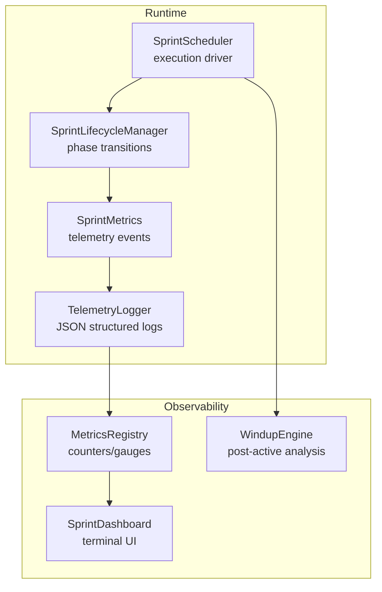
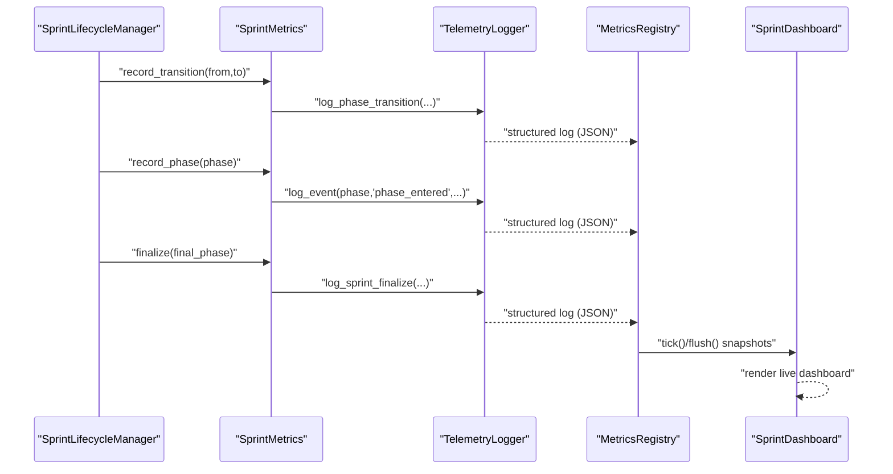
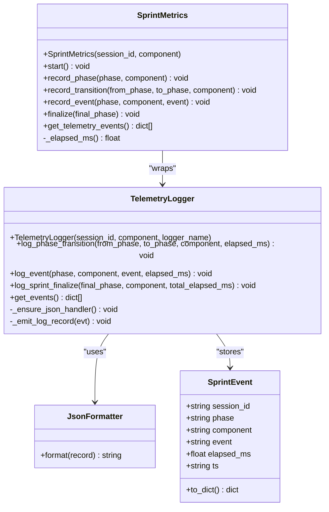
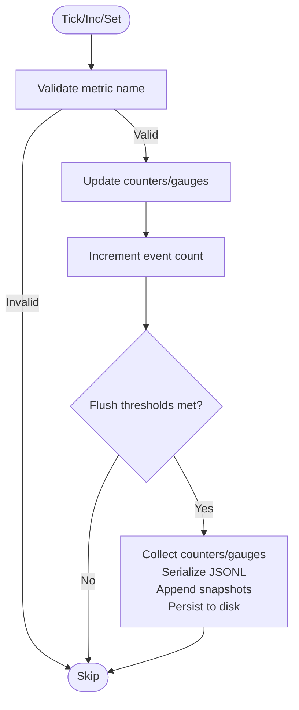
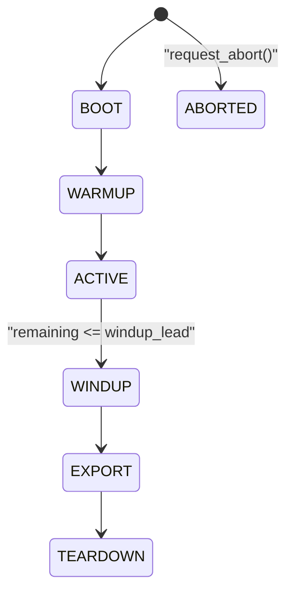
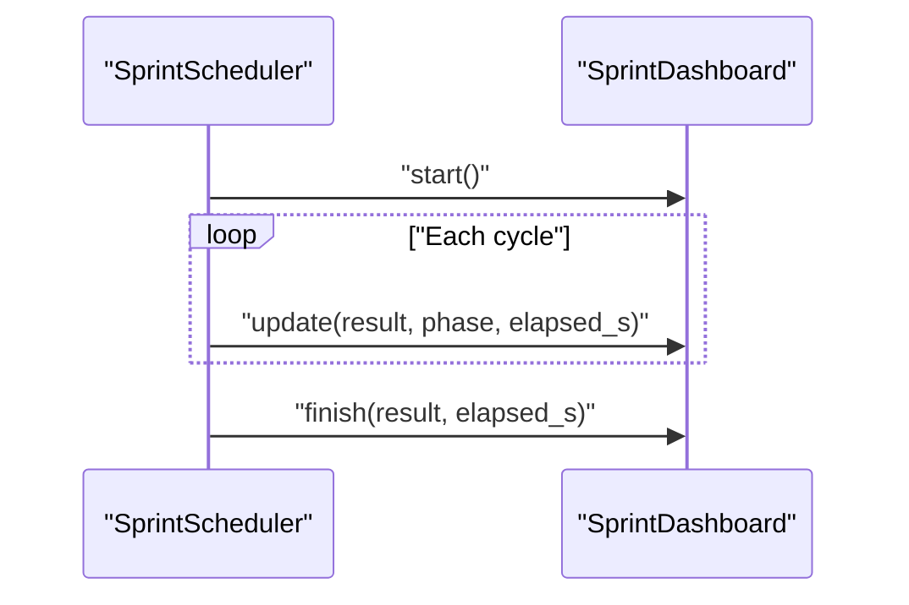
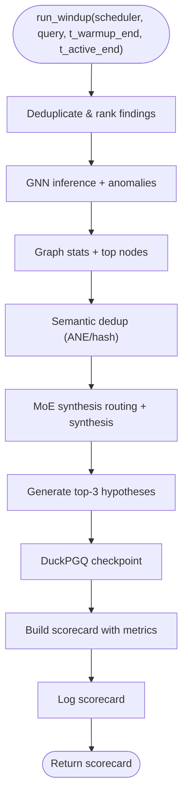
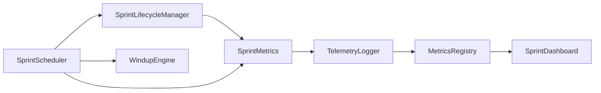

# Telemetry System

<cite>
**Referenced Files in This Document**
- [telemetry.py](file://hledac/universal/runtime/telemetry.py)
- [windup_engine.py](file://hledac/universal/runtime/windup_engine.py)
- [sprint_dashboard.py](file://hledac/universal/monitoring/sprint_dashboard.py)
- [metrics_registry.py](file://hledac/universal/metrics_registry.py)
- [sprint_scheduler.py](file://hledac/universal/runtime/sprint_scheduler.py)
- [sprint_lifecycle.py](file://hledac/universal/runtime/sprint_lifecycle.py)
</cite>

## Table of Contents
1. [Introduction](#introduction)
2. [Project Structure](#project-structure)
3. [Core Components](#core-components)
4. [Architecture Overview](#architecture-overview)
5. [Detailed Component Analysis](#detailed-component-analysis)
6. [Dependency Analysis](#dependency-analysis)
7. [Performance Considerations](#performance-considerations)
8. [Troubleshooting Guide](#troubleshooting-guide)
9. [Conclusion](#conclusion)
10. [Appendices](#appendices)

## Introduction
This document describes the Telemetry System that powers performance monitoring, metrics collection, and real-time observability across the runtime. It explains how sprint-level telemetry is captured, aggregated, and surfaced for dashboards and external monitoring systems. It also documents the windup engine’s role in post-active analysis, telemetry data aggregation, and integration points with external monitoring and alerting.

The system emphasizes fail-soft reliability, bounded memory usage, and minimal external dependencies. It separates telemetry events (structured logs with timestamps and phase/context) from numeric metrics (counters/gauges), enabling flexible downstream consumption and export.

## Project Structure
The telemetry system spans several modules:
- Runtime telemetry capture and structured logging
- Metrics registry for numeric gauges and counters
- Sprint lifecycle orchestration and phase transitions
- Real-time terminal dashboard for live sprint monitoring
- Windup engine for post-active analysis and scorecards

**Diagram sources**
- [telemetry.py:107-244](file://hledac/universal/runtime/telemetry.py#L107-L244)
- [metrics_registry.py:86-387](file://hledac/universal/metrics_registry.py#L86-L387)
- [sprint_lifecycle.py:54-200](file://hledac/universal/runtime/sprint_lifecycle.py#L54-L200)
- [sprint_scheduler.py:1-200](file://hledac/universal/runtime/sprint_scheduler.py#L1-L200)
- [sprint_dashboard.py:66-268](file://hledac/universal/monitoring/sprint_dashboard.py#L66-L268)
- [windup_engine.py:41-256](file://hledac/universal/runtime/windup_engine.py#L41-L256)

**Section sources**
- [telemetry.py:1-370](file://hledac/universal/runtime/telemetry.py#L1-L370)
- [metrics_registry.py:1-388](file://hledac/universal/metrics_registry.py#L1-L388)
- [sprint_lifecycle.py:1-200](file://hledac/universal/runtime/sprint_lifecycle.py#L1-L200)
- [sprint_scheduler.py:1-200](file://hledac/universal/runtime/sprint_scheduler.py#L1-L200)
- [sprint_dashboard.py:1-269](file://hledac/universal/monitoring/sprint_dashboard.py#L1-L269)
- [windup_engine.py:1-257](file://hledac/universal/runtime/windup_engine.py#L1-L257)

## Core Components
- TelemetryLogger and SprintMetrics: Capture structured telemetry events keyed by session, phase, component, and elapsed milliseconds. Events are emitted as JSON logs and retained in a bounded ring buffer for retrieval.
- MetricsRegistry: Lightweight numeric metrics plane with counters and gauges, periodic flush to disk JSONL, and a ring buffer of recent snapshots. Integrates sprint telemetry events for unified observability.
- SprintLifecycleManager: Enforces monotonic phase transitions (BOOT → WARMUP → ACTIVE → WINDUP → EXPORT → TEARDOWN) and timing controls for wind-down.
- SprintScheduler: Drives execution and coordinates lifecycle transitions; integrates telemetry and metrics during runtime.
- SprintDashboard: Real-time terminal dashboard rendering live sprint state, findings, sources, and governor status.
- WindupEngine: Post-active analysis pipeline producing scorecards, deduplication statistics, synthesis outcomes, and anomaly detection insights.

**Section sources**
- [telemetry.py:107-370](file://hledac/universal/runtime/telemetry.py#L107-L370)
- [metrics_registry.py:86-387](file://hledac/universal/metrics_registry.py#L86-L387)
- [sprint_lifecycle.py:54-200](file://hledac/universal/runtime/sprint_lifecycle.py#L54-L200)
- [sprint_scheduler.py:1-200](file://hledac/universal/runtime/sprint_scheduler.py#L1-L200)
- [sprint_dashboard.py:66-268](file://hledac/universal/monitoring/sprint_dashboard.py#L66-L268)
- [windup_engine.py:41-256](file://hledac/universal/runtime/windup_engine.py#L41-L256)

## Architecture Overview
The telemetry architecture combines event-based telemetry and numeric metrics:
- TelemetryLogger emits JSON logs enriched with session, phase, component, event, and elapsed_ms.
- SprintMetrics wraps TelemetryLogger to record phase transitions, phase entry, named events, and finalization.
- MetricsRegistry aggregates numeric counters/gauges and persists them to JSONL, while ingesting sprint telemetry events for unified reporting.
- SprintLifecycleManager triggers telemetry events during phase transitions.
- SprintScheduler orchestrates lifecycle and telemetry collection.
- SprintDashboard consumes live state and governor snapshots for real-time visibility.
- WindupEngine produces a scorecard and logs outcomes for post-active analysis.

**Diagram sources**
- [sprint_lifecycle.py:92-125](file://hledac/universal/runtime/sprint_lifecycle.py#L92-L125)
- [telemetry.py:248-370](file://hledac/universal/runtime/telemetry.py#L248-L370)
- [metrics_registry.py:217-311](file://hledac/universal/metrics_registry.py#L217-L311)
- [sprint_dashboard.py:96-137](file://hledac/universal/monitoring/sprint_dashboard.py#L96-L137)

## Detailed Component Analysis

### TelemetryLogger and SprintMetrics
- TelemetryLogger
  - Ensures a JSON formatter handler is attached to the logger.
  - Emits structured log records with fields: ts, level, logger, message, plus optional sprint context (session_id, phase, component, event, elapsed_ms).
  - Maintains a bounded ring buffer of recent events for retrieval.
- SprintMetrics
  - Records phase transitions, phase entry, named events, start, and finalization.
  - Computes elapsed milliseconds since start using a monotonic clock.
  - Delegates to TelemetryLogger for emitting structured logs.

**Diagram sources**
- [telemetry.py:42-244](file://hledac/universal/runtime/telemetry.py#L42-L244)
- [telemetry.py:248-370](file://hledac/universal/runtime/telemetry.py#L248-L370)

**Section sources**
- [telemetry.py:107-244](file://hledac/universal/runtime/telemetry.py#L107-L244)
- [telemetry.py:248-370](file://hledac/universal/runtime/telemetry.py#L248-L370)

### MetricsRegistry
- Purpose: Lightweight numeric metrics plane with counters and gauges.
- Features:
  - Bounded metric names enforced by a frozen set.
  - Periodic flush cadence (event count and time-based).
  - Ring buffer for recent snapshots.
  - Persistence to JSONL with correlation metadata (run_id, branch_id, provider_id, action_id).
  - Ingestion of sprint telemetry events from TelemetryLogger for unified reporting.
  - Fail-soft behavior and closed-state protection to avoid mutation after closure.
- Tick routine captures system memory metrics when psutil is available.

**Diagram sources**
- [metrics_registry.py:177-220](file://hledac/universal/metrics_registry.py#L177-L220)
- [metrics_registry.py:251-311](file://hledac/universal/metrics_registry.py#L251-L311)

**Section sources**
- [metrics_registry.py:86-387](file://hledac/universal/metrics_registry.py#L86-L387)

### SprintLifecycleManager
- Enforces monotonic phase progression and automatic wind-up when remaining time reaches the wind-down threshold.
- Provides snapshot state for monitoring and diagnostics without execution authority.
- Coordinates telemetry events via SprintMetrics during transitions.

**Diagram sources**
- [sprint_lifecycle.py:21-146](file://hledac/universal/runtime/sprint_lifecycle.py#L21-L146)

**Section sources**
- [sprint_lifecycle.py:54-200](file://hledac/universal/runtime/sprint_lifecycle.py#L54-L200)

### SprintScheduler
- Drives execution and lifecycle transitions.
- Integrates telemetry and metrics during runtime.
- Coordinates windup and export phases.

**Section sources**
- [sprint_scheduler.py:1-200](file://hledac/universal/runtime/sprint_scheduler.py#L1-L200)

### SprintDashboard
- Real-time terminal dashboard rendering:
  - Phase indicator with elapsed/remaining time.
  - Findings counters (accepted/public/CT).
  - Cycle progress and per-source telemetry.
  - Branch status (timeouts, blockers).
  - Abort/windup reasons.
  - Governor state and kill-chain tagging.
- Uses Rich for live updates and transient rendering.

**Diagram sources**
- [sprint_dashboard.py:96-137](file://hledac/universal/monitoring/sprint_dashboard.py#L96-L137)

**Section sources**
- [sprint_dashboard.py:66-268](file://hledac/universal/monitoring/sprint_dashboard.py#L66-L268)

### WindupEngine
- Post-active analysis pipeline producing a scorecard with:
  - Peak RSS, accepted/deduped findings counts.
  - Synthesis engine used and bandit rewards.
  - GNN predictions/anomalies and graph statistics.
  - Top graph nodes and phase durations.
  - Circuit breaker states and ranked parquet path.
- Logs outcomes and maintains fail-soft behavior.

**Diagram sources**
- [windup_engine.py:41-256](file://hledac/universal/runtime/windup_engine.py#L41-L256)

**Section sources**
- [windup_engine.py:41-256](file://hledac/universal/runtime/windup_engine.py#L41-L256)

## Dependency Analysis
- TelemetryLogger depends on stdlib logging and emits JSON logs.
- SprintMetrics depends on TelemetryLogger and time.monotonic for elapsed timing.
- MetricsRegistry depends on psutil (optional) and persists to JSONL.
- SprintLifecycleManager coordinates telemetry via SprintMetrics.
- SprintScheduler orchestrates lifecycle and telemetry collection.
- SprintDashboard reads governor snapshots and live results.
- WindupEngine produces scorecards consumed by exporters and dashboards.

**Diagram sources**
- [sprint_lifecycle.py:92-125](file://hledac/universal/runtime/sprint_lifecycle.py#L92-L125)
- [telemetry.py:248-370](file://hledac/universal/runtime/telemetry.py#L248-L370)
- [metrics_registry.py:217-311](file://hledac/universal/metrics_registry.py#L217-L311)
- [sprint_scheduler.py:1-200](file://hledac/universal/runtime/sprint_scheduler.py#L1-L200)
- [sprint_dashboard.py:243-259](file://hledac/universal/monitoring/sprint_dashboard.py#L243-L259)
- [windup_engine.py:41-256](file://hledac/universal/runtime/windup_engine.py#L41-L256)

**Section sources**
- [telemetry.py:107-370](file://hledac/universal/runtime/telemetry.py#L107-L370)
- [metrics_registry.py:86-387](file://hledac/universal/metrics_registry.py#L86-L387)
- [sprint_lifecycle.py:54-200](file://hledac/universal/runtime/sprint_lifecycle.py#L54-L200)
- [sprint_scheduler.py:1-200](file://hledac/universal/runtime/sprint_scheduler.py#L1-L200)
- [sprint_dashboard.py:66-268](file://hledac/universal/monitoring/sprint_dashboard.py#L66-L268)
- [windup_engine.py:41-256](file://hledac/universal/runtime/windup_engine.py#L41-L256)

## Performance Considerations
- Fail-soft design: All telemetry and metrics operations are void-returning and swallow exceptions to avoid impacting runtime.
- Bounded memory: Ring buffers for telemetry events and snapshots prevent unbounded growth.
- Minimal dependencies: Uses only stdlib and optional psutil; JSONL persistence avoids heavy external clients.
- Flush cadence: Event count and time-based thresholds balance throughput and persistence overhead.
- Timing accuracy: Monotonic clocks ensure reliable elapsed time computation without wall-clock adjustments.
- Dashboard refresh: Controlled refresh rate reduces UI overhead while maintaining responsiveness.

[No sources needed since this section provides general guidance]

## Troubleshooting Guide
Common telemetry issues and remedies:
- JSON formatting errors
  - Symptom: Malformed log lines or fallback messages.
  - Cause: Unexpected record attributes or formatting failures.
  - Action: Inspect record attributes attached to log records; ensure only expected fields are present.
  - Section sources
    - [telemetry.py:82-102](file://hledac/universal/runtime/telemetry.py#L82-L102)
- Persistence failures
  - Symptom: Metrics not flushed or degraded mode indicated.
  - Cause: File open/write/fsync errors.
  - Action: Verify run directory permissions and disk availability; check last_persist_failure in metrics summary.
  - Section sources
    - [metrics_registry.py:162-176](file://hledac/universal/metrics_registry.py#L162-L176)
    - [metrics_registry.py:296-310](file://hledac/universal/metrics_registry.py#L296-L310)
- Missing numeric metrics
  - Symptom: Empty or partial counters/gauges.
  - Cause: psutil unavailable or tick not invoked.
  - Action: Confirm psutil installation; ensure periodic tick invocations; verify flush cadence.
  - Section sources
    - [metrics_registry.py:222-250](file://hledac/universal/metrics_registry.py#L222-L250)
- Dashboard not rendering
  - Symptom: No live updates or Rich import errors.
  - Cause: Rich not installed or environment lacks terminal support.
  - Action: Install Rich; run in a compatible terminal; verify Live availability.
  - Section sources
    - [sprint_dashboard.py:21-30](file://hledac/universal/monitoring/sprint_dashboard.py#L21-L30)
- Windup pipeline failures
  - Symptom: Warnings logged for steps like GNN, ANE, synthesis.
  - Cause: Missing models, graph state, or runtime errors.
  - Action: Check model loading, graph readiness, and engine availability; review warnings and adjust routing.
  - Section sources
    - [windup_engine.py:70-115](file://hledac/universal/runtime/windup_engine.py#L70-L115)
    - [windup_engine.py:116-180](file://hledac/universal/runtime/windup_engine.py#L116-L180)

**Section sources**
- [telemetry.py:82-102](file://hledac/universal/runtime/telemetry.py#L82-L102)
- [metrics_registry.py:162-176](file://hledac/universal/metrics_registry.py#L162-L176)
- [metrics_registry.py:296-310](file://hledac/universal/metrics_registry.py#L296-L310)
- [sprint_dashboard.py:21-30](file://hledac/universal/monitoring/sprint_dashboard.py#L21-L30)
- [windup_engine.py:70-115](file://hledac/universal/runtime/windup_engine.py#L70-L115)
- [windup_engine.py:116-180](file://hledac/universal/runtime/windup_engine.py#L116-L180)

## Conclusion
The Telemetry System provides robust, fail-soft, and bounded observability for runtime performance and sprint execution. It separates structured telemetry events from numeric metrics, integrates seamlessly with the lifecycle and scheduler, and exposes real-time dashboards and post-active scorecards. Its minimal dependencies and resilient design enable reliable operation across diverse environments.

[No sources needed since this section summarizes without analyzing specific files]

## Appendices

### Configuration Options
- Telemetry sampling and retention
  - Bounded event history: 100 events for telemetry events.
  - Section sources
    - [telemetry.py:123-134](file://hledac/universal/runtime/telemetry.py#L123-L134)
- Metrics flush cadence
  - Event-based: every 100 events.
  - Time-based: every 60 seconds.
  - Section sources
    - [metrics_registry.py:97-102](file://hledac/universal/metrics_registry.py#L97-L102)
- Metrics retention
  - Recent snapshots ring buffer: 100 entries.
  - Section sources
    - [metrics_registry.py:101-102](file://hledac/universal/metrics_registry.py#L101-L102)
- Dashboard refresh
  - Refresh rate: 4 Hz.
  - Section sources
    - [sprint_dashboard.py:103-106](file://hledac/universal/monitoring/sprint_dashboard.py#L103-L106)

### Examples

- Telemetry setup
  - Initialize a telemetry logger and metrics collector with a session ID and component.
  - Record phase transitions and events during lifecycle.
  - Retrieve events for export or analysis.
  - Section sources
    - [telemetry.py:125-137](file://hledac/universal/runtime/telemetry.py#L125-L137)
    - [telemetry.py:262-273](file://hledac/universal/runtime/telemetry.py#L262-L273)
    - [telemetry.py:355-360](file://hledac/universal/runtime/telemetry.py#L355-L360)

- Custom metric definition
  - Define a metric name in the bounded set and increment counters or set gauges.
  - Section sources
    - [metrics_registry.py:37-73](file://hledac/universal/metrics_registry.py#L37-L73)
    - [metrics_registry.py:181-216](file://hledac/universal/metrics_registry.py#L181-L216)

- Performance analysis workflow
  - Use MetricsRegistry tick to capture memory metrics periodically.
  - Ingest sprint telemetry events for unified reporting.
  - Render live dashboard and produce windup scorecards.
  - Section sources
    - [metrics_registry.py:222-250](file://hledac/universal/metrics_registry.py#L222-L250)
    - [metrics_registry.py:337-356](file://hledac/universal/metrics_registry.py#L337-L356)
    - [sprint_dashboard.py:243-259](file://hledac/universal/monitoring/sprint_dashboard.py#L243-L259)
    - [windup_engine.py:220-256](file://hledac/universal/runtime/windup_engine.py#L220-L256)

### Integration with Monitoring Systems
- Structured logs
  - TelemetryLogger emits JSON logs suitable for ingestion by log collectors (e.g., filebeat/fluent-bit) and SIEM systems.
  - Section sources
    - [telemetry.py:82-102](file://hledac/universal/runtime/telemetry.py#L82-L102)
- Numeric metrics
  - MetricsRegistry persists counters/gauges to JSONL for downstream processing and export.
  - Section sources
    - [metrics_registry.py:296-310](file://hledac/universal/metrics_registry.py#L296-L310)
- Real-time dashboards
  - SprintDashboard provides terminal-based live monitoring; integrate with terminal multiplexers or remote sessions for distributed observation.
  - Section sources
    - [sprint_dashboard.py:96-137](file://hledac/universal/monitoring/sprint_dashboard.py#L96-L137)
- Windup scorecards
  - Use WindupEngine scorecards for automated reporting and alerting on synthesis outcomes, anomalies, and resource usage.
  - Section sources
    - [windup_engine.py:220-256](file://hledac/universal/runtime/windup_engine.py#L220-L256)

### Data Export Capabilities
- Telemetry events
  - Access via TelemetryLogger.get_events() for programmatic export.
  - Section sources
    - [telemetry.py:217-222](file://hledac/universal/runtime/telemetry.py#L217-L222)
- Metrics snapshots
  - Retrieve recent snapshots and persisted JSONL for external analytics.
  - Section sources
    - [metrics_registry.py:312-335](file://hledac/universal/metrics_registry.py#L312-L335)
    - [metrics_registry.py:296-310](file://hledac/universal/metrics_registry.py#L296-L310)