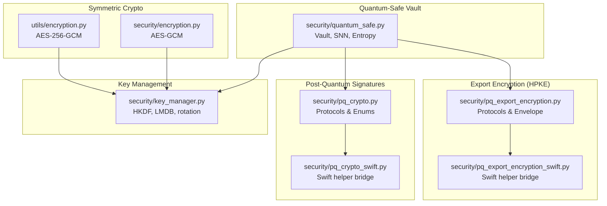
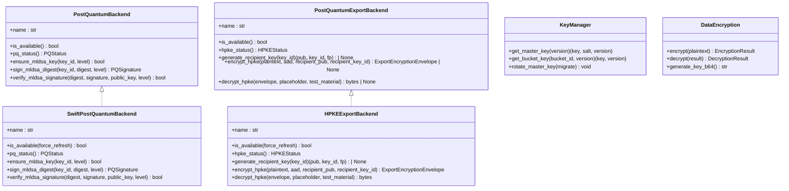
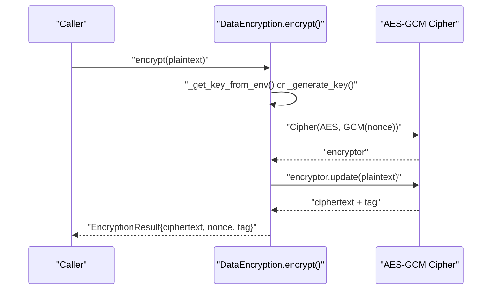
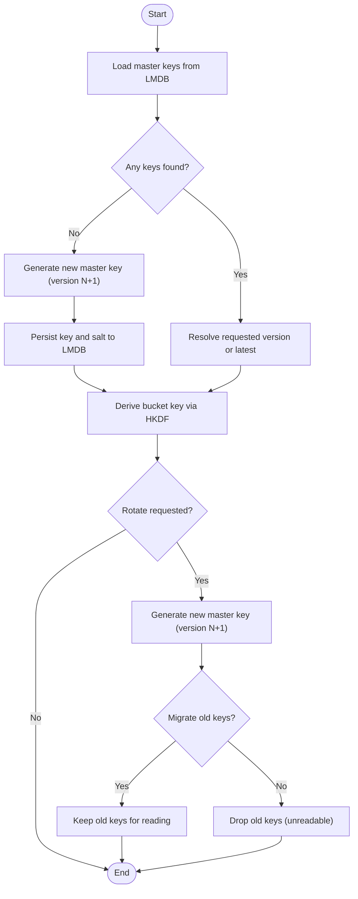
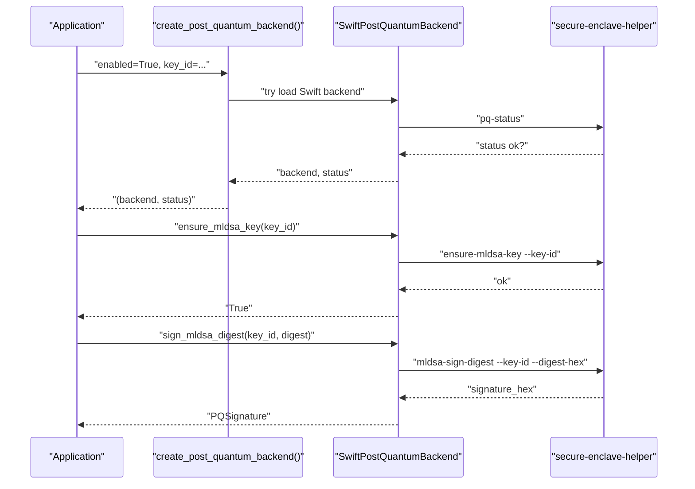
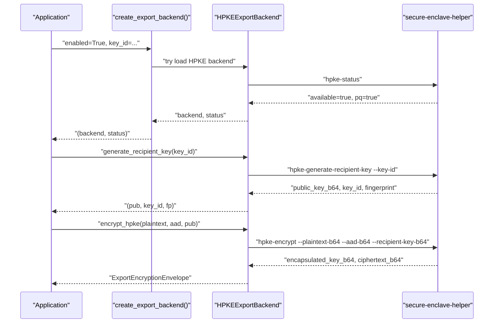
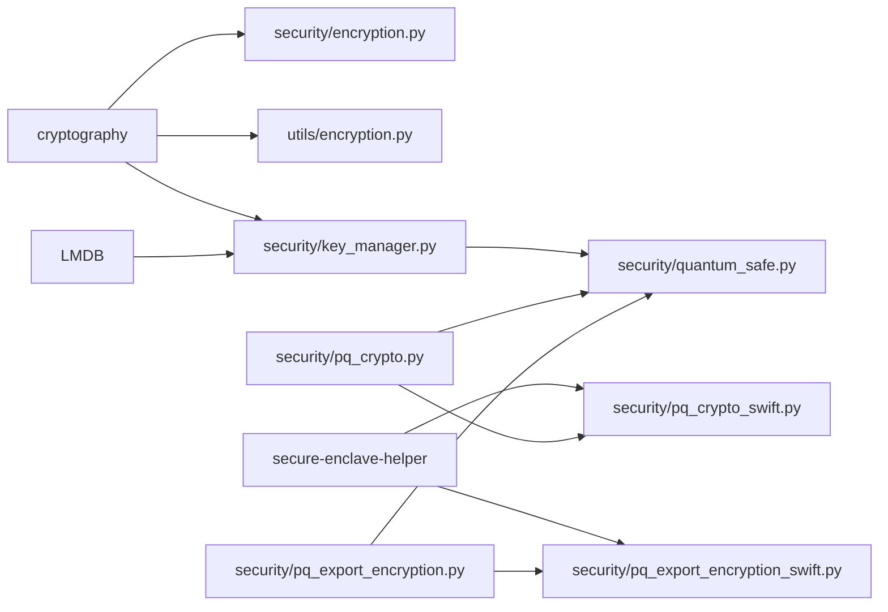

# Cryptographic Operations

<cite>
**Referenced Files in This Document**
- [encryption.py](file://hledac/universal/security/encryption.py)
- [encryption.py](file://hledac/universal/utils/encryption.py)
- [key_manager.py](file://hledac/universal/security/key_manager.py)
- [pq_crypto.py](file://hledac/universal/security/pq_crypto.py)
- [pq_crypto_swift.py](file://hledac/universal/security/pq_crypto_swift.py)
- [pq_export_encryption.py](file://hledac/universal/security/pq_export_encryption.py)
- [pq_export_encryption_swift.py](file://hledac/universal/security/pq_export_encryption_swift.py)
- [quantum_safe.py](file://hledac/universal/security/quantum_safe.py)
</cite>

## Table of Contents
1. [Introduction](#introduction)
2. [Project Structure](#project-structure)
3. [Core Components](#core-components)
4. [Architecture Overview](#architecture-overview)
5. [Detailed Component Analysis](#detailed-component-analysis)
6. [Dependency Analysis](#dependency-analysis)
7. [Performance Considerations](#performance-considerations)
8. [Troubleshooting Guide](#troubleshooting-guide)
9. [Conclusion](#conclusion)

## Introduction
This document describes cryptographic operations in Hledac Universal with a focus on:
- AES-GCM encryption/decryption for sensitive data
- Key management and rotation
- Post-quantum cryptography (PQC) integrations for signatures and export-grade encryption
- Cross-platform compatibility and Apple Silicon optimization
- Practical secure data handling, key rotation procedures, and best practices
- Security compliance considerations

## Project Structure
The cryptographic stack is organized around modular, protocol-driven components:
- Symmetric encryption utilities for general-purpose secure storage
- Key management with versioning and HKDF-based derivation
- Post-quantum signature support (ML-DSA) and export encryption (HPKE X-Wing)
- A quantum-safe vault integrating classical and neuromorphic primitives
- Swift-backed backends for macOS 26+ hardware acceleration

**Diagram sources**
- [encryption.py:36-164](file://hledac/universal/utils/encryption.py#L36-L164)
- [encryption.py:6-23](file://hledac/universal/security/encryption.py#L6-L23)
- [key_manager.py:53-175](file://hledac/universal/security/key_manager.py#L53-L175)
- [pq_crypto.py:96-263](file://hledac/universal/security/pq_crypto.py#L96-L263)
- [pq_crypto_swift.py:177-324](file://hledac/universal/security/pq_crypto_swift.py#L177-L324)
- [pq_export_encryption.py:173-479](file://hledac/universal/security/pq_export_encryption.py#L173-L479)
- [pq_export_encryption_swift.py:175-404](file://hledac/universal/security/pq_export_encryption_swift.py#L175-L404)
- [quantum_safe.py:405-752](file://hledac/universal/security/quantum_safe.py#L405-L752)

**Section sources**
- [encryption.py:1-164](file://hledac/universal/utils/encryption.py#L1-L164)
- [encryption.py:1-23](file://hledac/universal/security/encryption.py#L1-L23)
- [key_manager.py:1-175](file://hledac/universal/security/key_manager.py#L1-L175)
- [pq_crypto.py:1-263](file://hledac/universal/security/pq_crypto.py#L1-L263)
- [pq_crypto_swift.py:1-324](file://hledac/universal/security/pq_crypto_swift.py#L1-L324)
- [pq_export_encryption.py:1-479](file://hledac/universal/security/pq_export_encryption.py#L1-L479)
- [pq_export_encryption_swift.py:1-404](file://hledac/universal/security/pq_export_encryption_swift.py#L1-L404)
- [quantum_safe.py:1-1173](file://hledac/universal/security/quantum_safe.py#L1-L1173)

## Core Components
- AES-GCM encryption/decryption
  - Utilities for AES-256-GCM with random nonces and authentication tags
  - Two implementations: a lightweight class for general storage and a minimal function-based implementation
- Key management
  - Master key versioning, HKDF-derived bucket keys, LMDB-backed persistence, and controlled memory locking
  - Rotation with optional migration semantics
- Post-quantum signatures (ML-DSA)
  - Protocol-driven design with a null backend for fail-soft environments
  - Swift-backed backend for macOS 26+ using a helper tool
- Export encryption (HPKE X-Wing)
  - Protocol-driven HPKE export with envelope metadata and status tracking
  - Swift-backed backend for macOS 26+ with persistent keychain integration
- Quantum-safe vault and neuromorphic crypto
  - Vault composition of classical and PQC primitives
  - SNN-based encryption/decryption with entropy pooling and M1 8GB optimizations

**Section sources**
- [encryption.py:36-164](file://hledac/universal/utils/encryption.py#L36-L164)
- [encryption.py:6-23](file://hledac/universal/security/encryption.py#L6-L23)
- [key_manager.py:53-175](file://hledac/universal/security/key_manager.py#L53-L175)
- [pq_crypto.py:96-263](file://hledac/universal/security/pq_crypto.py#L96-L263)
- [pq_crypto_swift.py:177-324](file://hledac/universal/security/pq_crypto_swift.py#L177-L324)
- [pq_export_encryption.py:173-479](file://hledac/universal/security/pq_export_encryption.py#L173-L479)
- [pq_export_encryption_swift.py:175-404](file://hledac/universal/security/pq_export_encryption_swift.py#L175-L404)
- [quantum_safe.py:405-752](file://hledac/universal/security/quantum_safe.py#L405-L752)

## Architecture Overview
The system separates concerns across protocols, backends, and helpers:
- Protocols define interfaces and data contracts
- Backends implement platform-specific logic
- Swift helper bridges provide macOS 26+ acceleration and keychain integration
- Vault composes primitives for end-to-end security

**Diagram sources**
- [pq_crypto.py:96-263](file://hledac/universal/security/pq_crypto.py#L96-L263)
- [pq_crypto_swift.py:177-324](file://hledac/universal/security/pq_crypto_swift.py#L177-L324)
- [pq_export_encryption.py:173-479](file://hledac/universal/security/pq_export_encryption.py#L173-L479)
- [pq_export_encryption_swift.py:175-404](file://hledac/universal/security/pq_export_encryption_swift.py#L175-L404)
- [key_manager.py:53-175](file://hledac/universal/security/key_manager.py#L53-L175)
- [encryption.py:36-164](file://hledac/universal/utils/encryption.py#L36-L164)

## Detailed Component Analysis

### AES-GCM Encryption Utilities
- Purpose: Provide AES-256-GCM encryption/decryption for sensitive data with authenticated encryption and random nonces.
- Key characteristics:
  - Nonce size: 12 bytes; Tag size: 16 bytes
  - Additional associated data support for binding external metadata
  - Environment-driven key provisioning for session-scoped encryption
- Usage patterns:
  - General-purpose storage encryption via the class-based utility
  - Minimal function-based API for quick symmetric operations

**Diagram sources**
- [encryption.py:69-116](file://hledac/universal/utils/encryption.py#L69-L116)

**Section sources**
- [encryption.py:36-164](file://hledac/universal/utils/encryption.py#L36-L164)
- [encryption.py:6-23](file://hledac/universal/security/encryption.py#L6-L23)

### Key Management and Rotation
- Purpose: Securely manage master keys, derive per-bucket keys, and rotate keys with optional migration.
- Key characteristics:
  - Master key versioning with automatic generation
  - HKDF-based derivation keyed by bucket ID and version
  - LMDB-backed persistence with configurable map size
  - Memory locking for master key buffers to reduce swap exposure
  - Async-safe operations with internal locks
- Rotation procedure:
  - Generate new master key and salt
  - Optionally retain previous versions for reading migrated data
  - Invalidate access to older versions unless explicitly requested

**Diagram sources**
- [key_manager.py:73-175](file://hledac/universal/security/key_manager.py#L73-L175)

**Section sources**
- [key_manager.py:53-175](file://hledac/universal/security/key_manager.py#L53-L175)

### Post-Quantum Signatures (ML-DSA)
- Purpose: Provide hybrid signatures combining ECDSA-P256 (required) and ML-DSA-65 (optional on macOS 26+).
- Key characteristics:
  - Protocol defines backend interface and status reporting
  - Null backend ensures fail-soft behavior when unavailable
  - Swift-backed backend integrates with a helper tool for signing and verification
  - Status caching with short TTL for performance
- Integration:
  - Backend selection based on environment and availability
  - Signing performed over canonical batch digests
  - Verification supports both required and optional signatures

**Diagram sources**
- [pq_crypto.py:208-263](file://hledac/universal/security/pq_crypto.py#L208-L263)
- [pq_crypto_swift.py:191-324](file://hledac/universal/security/pq_crypto_swift.py#L191-L324)

**Section sources**
- [pq_crypto.py:1-263](file://hledac/universal/security/pq_crypto.py#L1-L263)
- [pq_crypto_swift.py:1-324](file://hledac/universal/security/pq_crypto_swift.py#L1-L324)

### Export Encryption (HPKE X-Wing)
- Purpose: Provide export-grade encryption using HPKE with X-Wing ML-KEM-768/X25519 for macOS 26+.
- Key characteristics:
  - Envelope carries encapsulated key, AAD hash, ciphertext, and recipient metadata
  - Policy-driven behavior: required, preferred, or unencrypted-only
  - Persistent keychain integration for production decryption
  - Test-only ephemeral keys for local roundtrips
- Integration:
  - Swift-backed backend for encryption/decryption and key generation
  - Status caching and robust error handling with fail-soft semantics

**Diagram sources**
- [pq_export_encryption.py:304-422](file://hledac/universal/security/pq_export_encryption.py#L304-L422)
- [pq_export_encryption_swift.py:191-338](file://hledac/universal/security/pq_export_encryption_swift.py#L191-L338)

**Section sources**
- [pq_export_encryption.py:1-479](file://hledac/universal/security/pq_export_encryption.py#L1-L479)
- [pq_export_encryption_swift.py:1-404](file://hledac/universal/security/pq_export_encryption_swift.py#L1-L404)

### Quantum-Safe Vault and Neuromorphic Crypto
- Purpose: Compose classical and post-quantum primitives into a unified vault; integrate neuromorphic computing for encryption/signatures.
- Key characteristics:
  - Vault supports ML-KEM/ML-DSA and integrates SNN-based encryption
  - Entropy pool for randomness and reseeding
  - Lazy initialization and cleanup for M1 8GB memory optimization
  - Neural signature generation and verification
- Implementation highlights:
  - SNN-based keystream generation and XOR encryption
  - Neural signature derived from network activations
  - Cleanup routines to release memory-heavy components

```mermaid
classDiagram
class QuantumSafeVault {
+initialize() void
+encrypt(plaintext, aad) EncryptedContainer
+decrypt(container) bytes
+encrypt_with_snn(data, key_id) SNNEncryptedContainer
+decrypt_with_snn(container) bytes
+generate_signature(data, key_id) bytes
+verify_signature(data, signature, key_id) bool
}
class NeuromorphicCryptoEngine {
+initialize() bool
+encrypt(data, key_id) SNNEncryptedContainer
+decrypt(container) bytes
+generate_signature(data, key_id) bytes
+verify_signature(data, signature, key_id) bool
+get_entropy_pool() EntropyPool
+cleanup() void
}
class EntropyPool {
+add_entropy(source, bytes) void
+extract_entropy(length) bytes
+get_entropy_estimate() float
}
QuantumSafeVault --> NeuromorphicCryptoEngine : "uses"
QuantumSafeVault --> EntropyPool : "uses"
```

**Diagram sources**
- [quantum_safe.py:405-752](file://hledac/universal/security/quantum_safe.py#L405-L752)
- [quantum_safe.py:46-133](file://hledac/universal/security/quantum_safe.py#L46-L133)

**Section sources**
- [quantum_safe.py:1-1173](file://hledac/universal/security/quantum_safe.py#L1-L1173)

## Dependency Analysis
- Internal dependencies:
  - Swift backends depend on protocol definitions in their respective core modules
  - Key manager depends on cryptography primitives and LMDB
  - Vault composes key manager, PQC, and HPKE components
- External dependencies:
  - cryptography library for AES-GCM, HKDF, and hashing
  - Swift helper tool for macOS 26+ ML-DSA and HPKE operations
  - LMDB for durable key storage

**Diagram sources**
- [encryption.py:1-23](file://hledac/universal/security/encryption.py#L1-L23)
- [encryption.py:1-164](file://hledac/universal/utils/encryption.py#L1-L164)
- [key_manager.py:1-175](file://hledac/universal/security/key_manager.py#L1-L175)
- [pq_crypto_swift.py:1-324](file://hledac/universal/security/pq_crypto_swift.py#L1-L324)
- [pq_export_encryption_swift.py:1-404](file://hledac/universal/security/pq_export_encryption_swift.py#L1-L404)
- [quantum_safe.py:1-1173](file://hledac/universal/security/quantum_safe.py#L1-L1173)

**Section sources**
- [encryption.py:1-23](file://hledac/universal/security/encryption.py#L1-L23)
- [encryption.py:1-164](file://hledac/universal/utils/encryption.py#L1-L164)
- [key_manager.py:1-175](file://hledac/universal/security/key_manager.py#L1-L175)
- [pq_crypto_swift.py:1-324](file://hledac/universal/security/pq_crypto_swift.py#L1-L324)
- [pq_export_encryption_swift.py:1-404](file://hledac/universal/security/pq_export_encryption_swift.py#L1-L404)
- [quantum_safe.py:1-1173](file://hledac/universal/security/quantum_safe.py#L1-L1173)

## Performance Considerations
- Apple Silicon optimization:
  - Swift-backed backends leverage macOS 26+ hardware acceleration and CryptoKit
  - Status caching reduces repeated helper invocations
  - Lazy initialization and cleanup minimize memory footprint on M1 8GB systems
- Cross-platform compatibility:
  - Null backends ensure graceful degradation on unsupported platforms
  - Environment-based key provisioning avoids hardcoding secrets
- Operational tips:
  - Prefer HKDF-derived bucket keys for deterministic, scalable key derivation
  - Use AES-GCM with authenticated associated data for integrity binding
  - Cache backend instances to avoid repeated initialization overhead

[No sources needed since this section provides general guidance]

## Troubleshooting Guide
- AES-GCM failures:
  - Missing cryptography library: ensure installation and availability
  - Invalid base64 inputs or corrupted tags: verify encoding and integrity
- Key management issues:
  - LMDB map size too small: adjust via environment-provided helpers
  - Missing master key version: rotate or restore previous version
- PQC backend problems:
  - Helper missing or not executable: verify path resolution and permissions
  - ML-DSA unavailable: confirm macOS version and feature flags
- HPKE export issues:
  - PQ export unavailable: check policy and backend status
  - Decryption persistence unsupported: ensure recipient key ID and keychain access
- Quantum-safe vault:
  - Initialization failures: confirm entropy sources and memory constraints
  - Cleanup required after heavy operations to free SNN weights and pools

**Section sources**
- [encryption.py:98-115](file://hledac/universal/utils/encryption.py#L98-L115)
- [key_manager.py:1-175](file://hledac/universal/security/key_manager.py#L1-L175)
- [pq_crypto_swift.py:84-114](file://hledac/universal/security/pq_crypto_swift.py#L84-L114)
- [pq_export_encryption_swift.py:82-112](file://hledac/universal/security/pq_export_encryption_swift.py#L82-L112)
- [quantum_safe.py:433-460](file://hledac/universal/security/quantum_safe.py#L433-L460)

## Conclusion
Hledac Universal’s cryptographic stack combines classical AES-GCM, robust key management, and forward-looking post-quantum primitives. The design emphasizes:
- Fail-soft availability with null backends
- macOS 26+ acceleration via Swift helper bridges
- Production-safe envelopes and persistent keychain integration
- Scalable key derivation and rotation
- Experimental neuromorphic cryptography with memory-conscious operations

These components enable secure, compliant, and future-ready handling of sensitive data across diverse environments.