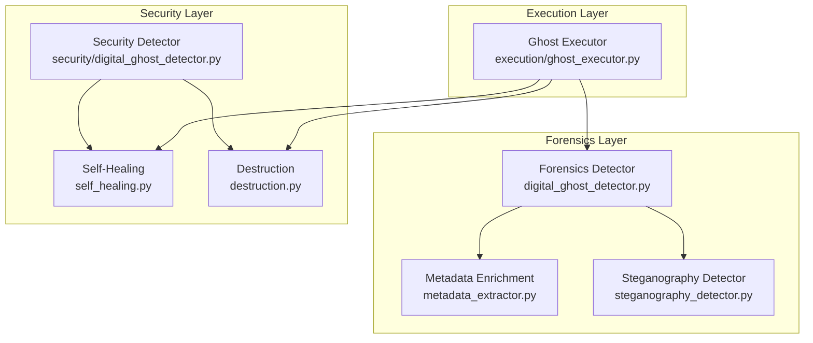
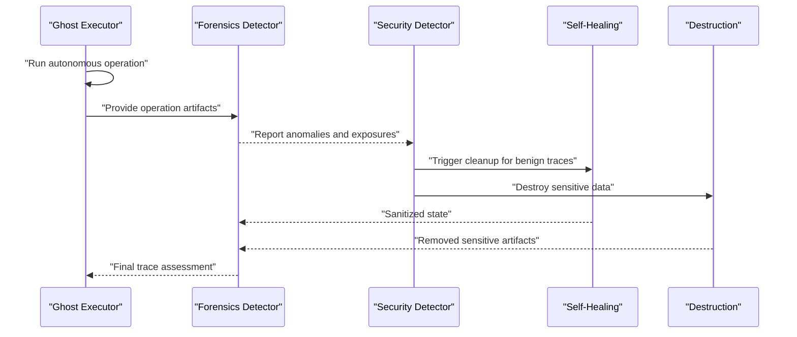
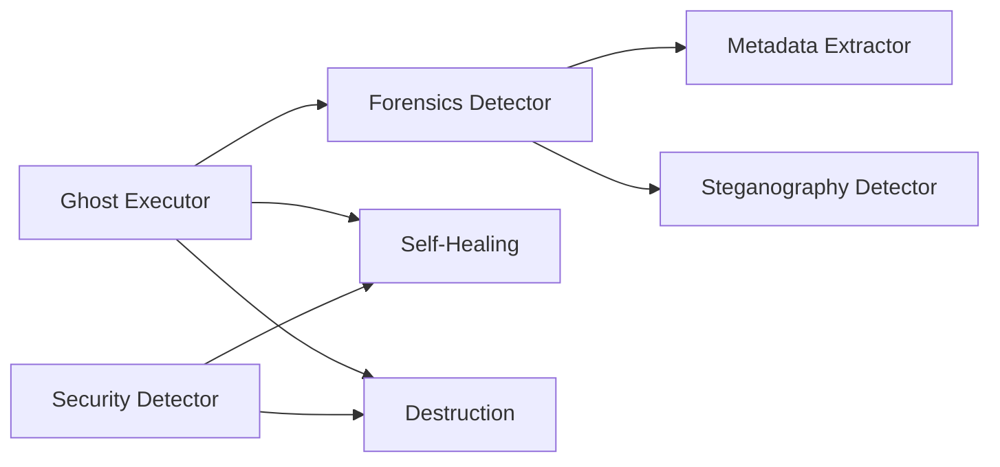

# Digital Ghost Detection

<cite>
**Referenced Files in This Document**
- [digital_ghost_detector.py](file://hledac/universal/forensics/digital_ghost_detector.py)
- [digital_ghost_detector.py](file://hledac/universal/security/digital_ghost_detector.py)
- [self_healing.py](file://hledac/universal/security/self_healing.py)
- [destruction.py](file://hledac/universal/security/destruction.py)
- [ghost_executor.py](file://hledac/universal/execution/ghost_executor.py)
- [GHOST_INVARIANTS.md](file://GHOST_INVARIANTS.md)
- [test_forensics_enrichment.py](file://tests/test_forensics_enrichment.py)
- [test_forensics_probe_lane.py](file://tests/probe_f196b/test_forensics_probe_lane.py)
- [test_forensics_metadata_enrichment.py](file://tests/probe_f198b/test_forensics_metadata_enrichment.py)
- [clean_live_forensics.json](file://hledac/universal/probe_f207l_clean_live_forensics/clean_live_forensics.json)
- [ghost_cti_20260427_153335.stix.json](file://hledac/universal/ghost_cti_20260427_153335.stix.json)
- [ghost_cti_20260506_145336.stix.json](file://hledac/universal/ghost_cti_20260506_145336.stix.json)
</cite>

## Table of Contents
1. [Introduction](#introduction)
2. [Project Structure](#project-structure)
3. [Core Components](#core-components)
4. [Architecture Overview](#architecture-overview)
5. [Detailed Component Analysis](#detailed-component-analysis)
6. [Dependency Analysis](#dependency-analysis)
7. [Performance Considerations](#performance-considerations)
8. [Troubleshooting Guide](#troubleshooting-guide)
9. [Conclusion](#conclusion)
10. [Appendices](#appendices)

## Introduction
This document explains the digital ghost detection mechanisms in Hledac Universal. It focuses on the automated identification of residual traces, memory artifacts, and forensic signatures left behind by autonomous operations. It also documents self-healing capabilities, trace removal protocols, and destruction mechanisms for sensitive data. The content covers detection algorithms, false positive mitigation, operational security implications, and practical workflows for remediation and monitoring integration.

## Project Structure
The digital ghost detection ecosystem spans three primary areas:
- Forensics layer: specialized detectors for digital ghosts and metadata enrichment
- Security layer: self-healing and destruction utilities for sensitive data
- Execution layer: autonomous operation executor that generates potential traces

**Diagram sources**
- [digital_ghost_detector.py](file://hledac/universal/forensics/digital_ghost_detector.py)
- [digital_ghost_detector.py](file://hledac/universal/security/digital_ghost_detector.py)
- [self_healing.py](file://hledac/universal/security/self_healing.py)
- [destruction.py](file://hledac/universal/security/destruction.py)
- [ghost_executor.py](file://hledac/universal/execution/ghost_executor.py)

**Section sources**
- [digital_ghost_detector.py](file://hledac/universal/forensics/digital_ghost_detector.py)
- [digital_ghost_detector.py](file://hledac/universal/security/digital_ghost_detector.py)
- [self_healing.py](file://hledac/universal/security/self_healing.py)
- [destruction.py](file://hledac/universal/security/destruction.py)
- [ghost_executor.py](file://hledac/universal/execution/ghost_executor.py)

## Core Components
- Forensics Digital Ghost Detector: Scans for residual traces and forensic signatures across content, metadata, and embedded artifacts.
- Security Digital Ghost Detector: Identifies sensitive data exposure and triggers remediation actions.
- Self-Healing: Implements automatic cleanup and sanitization routines to remove traces.
- Destruction: Provides controlled, secure deletion mechanisms for sensitive data.
- Ghost Executor: Orchestrates autonomous operations that may leave traces, enabling detection and remediation workflows.

Key operational invariants and expectations are codified in the repository's ghost invariants document.

**Section sources**
- [digital_ghost_detector.py](file://hledac/universal/forensics/digital_ghost_detector.py)
- [digital_ghost_detector.py](file://hledac/universal/security/digital_ghost_detector.py)
- [self_healing.py](file://hledac/universal/security/self_healing.py)
- [destruction.py](file://hledac/universal/security/destruction.py)
- [ghost_executor.py](file://hledac/universal/execution/ghost_executor.py)
- [GHOST_INVARIANTS.md](file://GHOST_INVARIANTS.md)

## Architecture Overview
The system integrates autonomous execution with continuous forensic scanning and security remediation. The Ghost Executor performs operations that may produce traces. Forensics detectors scan for anomalies and artifacts. Security detectors validate whether sensitive data is exposed. Self-healing and destruction modules act on detected threats to sanitize the environment.

**Diagram sources**
- [ghost_executor.py](file://hledac/universal/execution/ghost_executor.py)
- [digital_ghost_detector.py](file://hledac/universal/forensics/digital_ghost_detector.py)
- [digital_ghost_detector.py](file://hledac/universal/security/digital_ghost_detector.py)
- [self_healing.py](file://hledac/universal/security/self_healing.py)
- [destruction.py](file://hledac/universal/security/destruction.py)

## Detailed Component Analysis

### Forensics Digital Ghost Detector
Purpose:
- Detect residual traces, memory artifacts, and forensic signatures in content and metadata produced by autonomous operations.
- Enrich findings with metadata and detect hidden signals via steganography.

Detection algorithms:
- Content signature matching against known ghost patterns.
- Metadata anomaly detection to flag unexpected artifacts.
- Steganalysis to uncover hidden signals embedded in media or text.

False positive mitigation:
- Multi-stage verification: initial scan, enrichment, and cross-validation.
- Threshold-based scoring to reduce noise while preserving sensitivity.

Operational security implications:
- Reduces risk of unintended data leakage by identifying and classifying traces early.
- Supports least-privilege remediation by distinguishing benign artifacts from sensitive exposures.

Remediation integration:
- Reports anomalies to the security detector for prioritized response.

**Section sources**
- [digital_ghost_detector.py](file://hledac/universal/forensics/digital_ghost_detector.py)

### Security Digital Ghost Detector
Purpose:
- Identify sensitive data exposure and classify risks for targeted remediation.

Detection algorithms:
- Pattern and schema-based detection of personally identifiable information (PII), secrets, and sensitive identifiers.
- Correlation with operational context to assess risk severity.

False positive mitigation:
- Context-aware validation to minimize false alarms.
- Manual override and escalation pathways for ambiguous cases.

Operational security implications:
- Enables immediate containment and remediation of sensitive data exposure.
- Integrates with self-healing and destruction modules for automated response.

Remediation integration:
- Triggers self-healing for non-sensitive traces and destruction for sensitive data.

**Section sources**
- [digital_ghost_detector.py](file://hledac/universal/security/digital_ghost_detector.py)

### Self-Healing Module
Purpose:
- Automatically sanitize benign traces and residual artifacts without compromising operational integrity.

Mechanisms:
- Memory scrubbing and artifact suppression.
- Temporary storage cleanup and ephemeral data purging.
- Log and metadata sanitization to remove forensic fingerprints.

Integration:
- Activated by the security detector after classification of benign vs sensitive traces.

**Section sources**
- [self_healing.py](file://hledac/universal/security/self_healing.py)

### Destruction Module
Purpose:
- Securely destroy sensitive data that has been identified as exposed or leaked.

Mechanisms:
- Cryptographic erasure and secure deletion routines.
- Immutable logging of destruction events for auditability.

Integration:
- Activated by the security detector upon confirmed sensitive exposure.

**Section sources**
- [destruction.py](file://hledac/universal/security/destruction.py)

### Ghost Executor
Purpose:
- Execute autonomous operations that may generate traces, enabling detection and remediation workflows.

Trace generation:
- Performs operations that could leave artifacts in logs, caches, or temporary stores.

Integration:
- Feeds outputs to forensics detectors for continuous monitoring.

**Section sources**
- [ghost_executor.py](file://hledac/universal/execution/ghost_executor.py)

### Test Coverage and Validation
- Forensics enrichment tests validate metadata extraction and anomaly detection accuracy.
- Probe lane tests exercise forensics detection under realistic operational scenarios.
- Metadata enrichment tests confirm robustness of enrichment pipelines.

**Section sources**
- [test_forensics_enrichment.py](file://tests/test_forensics_enrichment.py)
- [test_forensics_probe_lane.py](file://tests/probe_f196b/test_forensics_probe_lane.py)
- [test_forensics_metadata_enrichment.py](file://tests/probe_f198b/test_forensics_metadata_enrichment.py)

### Clean Live Forensics Protocol
- Defines operational procedures to clean up live forensics artifacts during active investigations.
- Includes JSON-based configuration for cleaning tasks and validation steps.

**Section sources**
- [clean_live_forensics.json](file://hledac/universal/probe_f207l_clean_live_forensics/clean_live_forensics.json)

### Digital Ghost CTI Outputs
- STIX-formatted reports capture detected ghost patterns and remediation actions for external sharing and archival.
- Examples include timestamps and structured indicators for repeatable triage.

**Section sources**
- [ghost_cti_20260427_153335.stix.json](file://hledac/universal/ghost_cti_20260427_153335.stix.json)
- [ghost_cti_20260506_145336.stix.json](file://hledac/universal/ghost_cti_20260506_145336.stix.json)

## Dependency Analysis
The system exhibits layered dependencies:
- Execution layer depends on forensics and security modules for trace detection and remediation.
- Forensics module depends on metadata and steganography utilities for enrichment and analysis.
- Security module coordinates self-healing and destruction actions based on detection outcomes.

**Diagram sources**
- [ghost_executor.py](file://hledac/universal/execution/ghost_executor.py)
- [digital_ghost_detector.py](file://hledac/universal/forensics/digital_ghost_detector.py)
- [digital_ghost_detector.py](file://hledac/universal/security/digital_ghost_detector.py)
- [self_healing.py](file://hledac/universal/security/self_healing.py)
- [destruction.py](file://hledac/universal/security/destruction.py)

**Section sources**
- [ghost_executor.py](file://hledac/universal/execution/ghost_executor.py)
- [digital_ghost_detector.py](file://hledac/universal/forensics/digital_ghost_detector.py)
- [digital_ghost_detector.py](file://hledac/universal/security/digital_ghost_detector.py)
- [self_healing.py](file://hledac/universal/security/self_healing.py)
- [destruction.py](file://hledac/universal/security/destruction.py)

## Performance Considerations
- Forensics scanning should be incremental and context-aware to avoid impacting operational throughput.
- Self-healing and destruction routines should be batched and scheduled to minimize disruption.
- Metadata enrichment and steganalysis can be computationally intensive; leverage caching and parallelization where appropriate.
- Monitor remediation latency and adjust thresholds to balance sensitivity and false positives.

## Troubleshooting Guide
Common issues and resolutions:
- False positives in forensics detection:
  - Increase threshold scores or refine detection rules.
  - Cross-validate with metadata enrichment to confirm anomalies.
- Sensitive data not being destroyed:
  - Verify destruction module permissions and cryptographic settings.
  - Confirm audit logs indicate successful completion of destruction tasks.
- Remediation delays:
  - Review self-healing scheduling and resource availability.
  - Ensure security detector prioritization aligns with operational risk posture.
- Operational impact:
  - Use clean live forensics protocol to minimize disruption during active investigations.
  - Validate test coverage to ensure detectors remain effective under load.

**Section sources**
- [test_forensics_enrichment.py](file://tests/test_forensics_enrichment.py)
- [test_forensics_probe_lane.py](file://tests/probe_f196b/test_forensics_probe_lane.py)
- [test_forensics_metadata_enrichment.py](file://tests/probe_f198b/test_forensics_metadata_enrichment.py)
- [clean_live_forensics.json](file://hledac/universal/probe_f207l_clean_live_forensics/clean_live_forensics.json)

## Conclusion
Hledac Universal’s digital ghost detection framework combines autonomous execution with continuous forensic scanning and security-driven remediation. By integrating forensics, self-healing, and destruction mechanisms, the system minimizes the risk of residual traces and sensitive data exposure while maintaining operational efficiency. Adhering to the documented workflows, thresholds, and test coverage ensures reliable and secure operation.

## Appendices

### Digital Ghost Detection Workflows
- Autonomous operation execution with trace generation.
- Forensics scanning and metadata enrichment.
- Security classification and remediation prioritization.
- Self-healing for benign traces and destruction for sensitive data.
- Audit and reporting via CTI outputs.

**Section sources**
- [ghost_executor.py](file://hledac/universal/execution/ghost_executor.py)
- [digital_ghost_detector.py](file://hledac/universal/forensics/digital_ghost_detector.py)
- [digital_ghost_detector.py](file://hledac/universal/security/digital_ghost_detector.py)
- [self_healing.py](file://hledac/universal/security/self_healing.py)
- [destruction.py](file://hledac/universal/security/destruction.py)
- [GHOST_INVARIANTS.md](file://GHOST_INVARIANTS.md)

### Remediation Procedures
- Benign traces: trigger self-healing to sanitize artifacts.
- Sensitive data: trigger destruction with cryptographic erasure.
- Validation: confirm remediation via audit logs and enrichment checks.

**Section sources**
- [self_healing.py](file://hledac/universal/security/self_healing.py)
- [destruction.py](file://hledac/universal/security/destruction.py)

### Security Monitoring Integration
- Forensics and security detectors feed normalized outputs suitable for SIEM ingestion.
- CTI reports provide structured indicators for external sharing and correlation.

**Section sources**
- [ghost_cti_20260427_153335.stix.json](file://hledac/universal/ghost_cti_20260427_153335.stix.json)
- [ghost_cti_20260506_145336.stix.json](file://hledac/universal/ghost_cti_20260506_145336.stix.json)