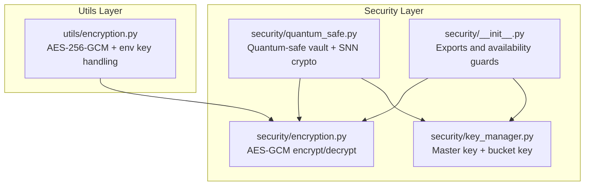
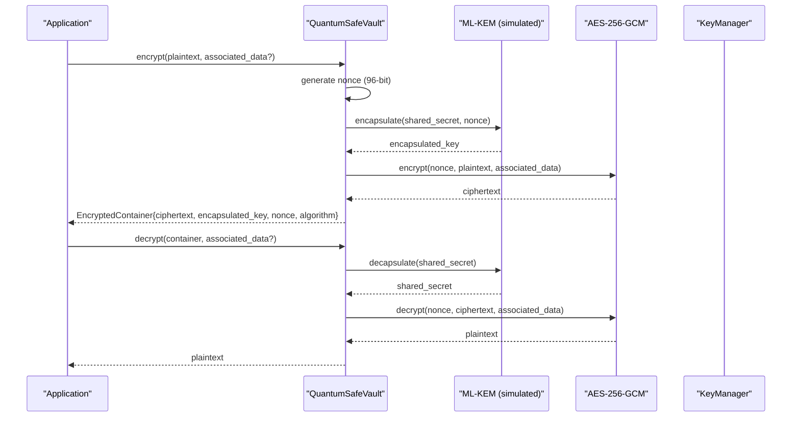
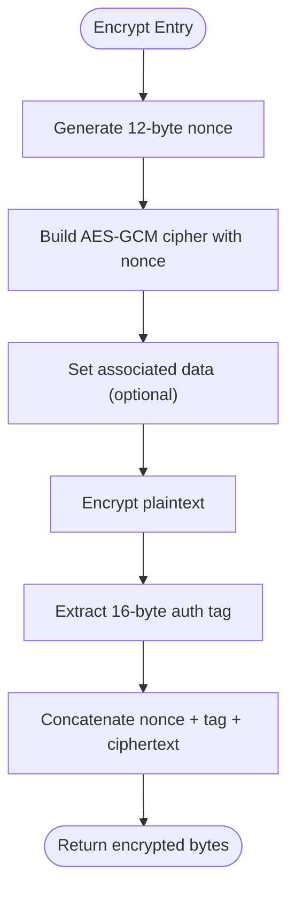
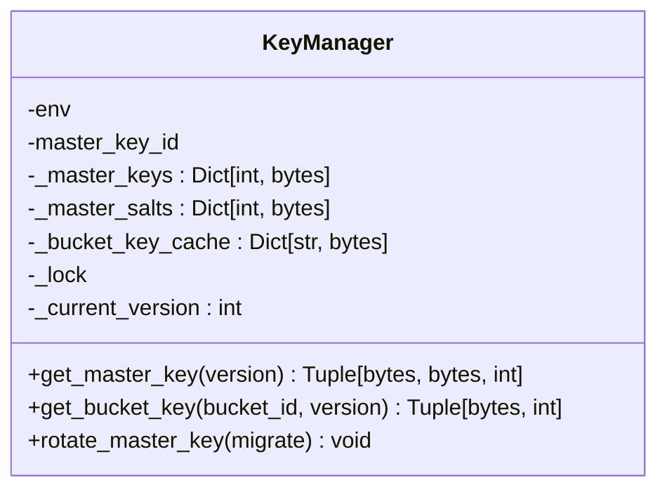
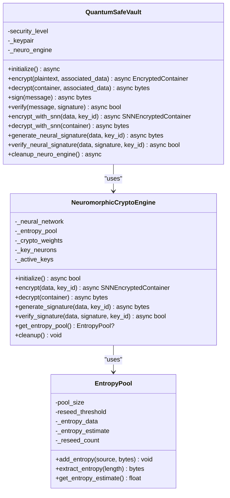
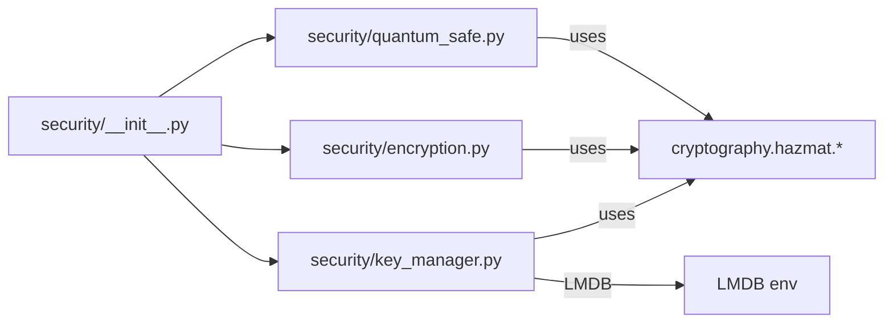

# Encryption Framework

<cite>
**Referenced Files in This Document**
- [security/__init__.py](file://security/__init__.py)
- [security/encryption.py](file://security/encryption.py)
- [security/key_manager.py](file://security/key_manager.py)
- [security/quantum_safe.py](file://security/quantum_safe.py)
- [utils/encryption.py](file://utils/encryption.py)
</cite>

## Table of Contents
1. [Introduction](#introduction)
2. [Project Structure](#project-structure)
3. [Core Components](#core-components)
4. [Architecture Overview](#architecture-overview)
5. [Detailed Component Analysis](#detailed-component-analysis)
6. [Dependency Analysis](#dependency-analysis)
7. [Performance Considerations](#performance-considerations)
8. [Troubleshooting Guide](#troubleshooting-guide)
9. [Conclusion](#conclusion)

## Introduction
This document describes the encryption framework subsystem that provides authenticated encryption, key management, and quantum-safe cryptographic capabilities. It covers AES-GCM implementation, nonce generation, authenticated encryption patterns, key derivation and rotation, and quantum-safe primitives including ML-KEM/ML-DSA and neuromorphic cryptography. It also documents APIs, parameter requirements, error handling, and integration patterns with the broader security architecture.

## Project Structure
The encryption framework spans several modules:
- AES-GCM utilities for authenticated encryption
- Key management with master key rotation and bucket key derivation
- Quantum-safe vault integrating post-quantum KEM/DSA and neuromorphic encryption
- Utility classes for encryption results and environment-based key handling

**Diagram sources**
- [security/__init__.py:24-37](file://security/__init__.py#L24-L37)
- [security/encryption.py:6-22](file://security/encryption.py#L6-L22)
- [security/key_manager.py:53-175](file://security/key_manager.py#L53-L175)
- [security/quantum_safe.py:754-974](file://security/quantum_safe.py#L754-L974)
- [utils/encryption.py:36-164](file://utils/encryption.py#L36-L164)

**Section sources**
- [security/__init__.py:24-37](file://security/__init__.py#L24-L37)

## Core Components
- AES-GCM encryption/decryption with 96-bit nonces and 128-bit authentication tags
- Master key management with versioning, salting, and bucket key derivation via HKDF
- Quantum-safe vault supporting hybrid ML-KEM + AES-GCM and ML-DSA signatures
- Neuromorphic cryptography engine using spiking neural networks for encryption/signing
- Environment-based key provisioning and result containers for encryption utilities

**Section sources**
- [security/encryption.py:6-22](file://security/encryption.py#L6-L22)
- [security/key_manager.py:53-175](file://security/key_manager.py#L53-L175)
- [security/quantum_safe.py:754-974](file://security/quantum_safe.py#L754-L974)
- [utils/encryption.py:36-164](file://utils/encryption.py#L36-L164)

## Architecture Overview
The framework integrates classical authenticated encryption with quantum-safe primitives and neuromorphic techniques. The quantum-safe vault orchestrates KEM encapsulation/decapsulation and AES-GCM, while the key manager provides master keys and derived bucket keys. The neuromorphic engine offers SNN-based encryption and signatures.

**Diagram sources**
- [security/quantum_safe.py:793-859](file://security/quantum_safe.py#L793-L859)

## Detailed Component Analysis

### AES-GCM Implementation
- Primitives: AES-256-GCM via the cryptography library
- Nonce: 12 bytes (96 bits) generated per encryption
- Authentication: 16 bytes (128 bits) authentication tag included with ciphertext
- Associated data: Optional AAD supported during both encryption and decryption
- Encoding: Concatenation of nonce + tag + ciphertext for transport

**Diagram sources**
- [security/encryption.py:6-12](file://security/encryption.py#L6-L12)

**Section sources**
- [security/encryption.py:6-22](file://security/encryption.py#L6-L22)
- [utils/encryption.py:69-96](file://utils/encryption.py#L69-L96)

### Key Management Strategies
- Master key storage: LMDB-backed with versioning and salting
- Bucket key derivation: HKDF-SHA256 keyed by master key, salt, and bucket identifier
- Memory protection: Optional mlock for master key buffers
- Rotation: New master key version generated atomically; optional migration retains older keys for reading

**Diagram sources**
- [security/key_manager.py:53-175](file://security/key_manager.py#L53-L175)

**Section sources**
- [security/key_manager.py:53-175](file://security/key_manager.py#L53-L175)

### Quantum-Safe Encryption Methods
- Hybrid scheme: ML-KEM encapsulates a symmetric key; AES-256-GCM encrypts payload
- Signatures: ML-DSA (Dilithium) for quantum-safe signatures
- Neuromorphic engine: SNN-based encryption and signatures using chaotic dynamics and entropy pools
- Lazy initialization: Engines initialized on first use to optimize memory on constrained systems

**Diagram sources**
- [security/quantum_safe.py:754-974](file://security/quantum_safe.py#L754-L974)
- [security/quantum_safe.py:405-684](file://security/quantum_safe.py#L405-L684)
- [security/quantum_safe.py:46-133](file://security/quantum_safe.py#L46-L133)

**Section sources**
- [security/quantum_safe.py:754-974](file://security/quantum_safe.py#L754-L974)
- [security/quantum_safe.py:405-684](file://security/quantum_safe.py#L405-L684)
- [security/quantum_safe.py:46-133](file://security/quantum_safe.py#L46-L133)

### Encryption/Decryption APIs and Parameters
- AES-GCM
  - encrypt_aes_gcm(key, plaintext, associated_data=b'') -> bytes
  - decrypt_aes_gcm(key, encrypted_data, associated_data=b'') -> bytes
  - Parameters: 32-byte AES key, plaintext bytes, optional AAD bytes
  - Returns: concatenated nonce + tag + ciphertext for encryption; plaintext for decryption
- DataEncryption (utility)
  - encrypt(plaintext: str) -> EncryptionResult
  - decrypt(result: EncryptionResult) -> DecryptionResult
  - Supports environment-provided base64 key or ephemeral key generation
- QuantumSafeVault
  - encrypt/decrypt with containerized output/input
  - sign/verify for ML-DSA signatures
  - SNN-based encrypt/decrypt and signature methods

**Section sources**
- [security/encryption.py:6-22](file://security/encryption.py#L6-L22)
- [utils/encryption.py:69-158](file://utils/encryption.py#L69-L158)
- [security/quantum_safe.py:793-859](file://security/quantum_safe.py#L793-L859)

### Error Handling
- Import-time guards: Availability flags for crypto components
- Runtime errors: Exceptions logged; safe defaults or error fields populated in results
- Integrity: AES-GCM tag verification failure aborts decryption
- Compatibility: Legacy XOR fallback removed; explicit error returned for legacy data

**Section sources**
- [security/__init__.py:25-37](file://security/__init__.py#L25-L37)
- [utils/encryption.py:98-115](file://utils/encryption.py#L98-L115)
- [utils/encryption.py:129-135](file://utils/encryption.py#L129-L135)

### Practical Examples and Integration Patterns
- Secure data protection
  - Use AES-GCM for local storage or in-memory encryption with random nonces
  - Use DataEncryption for environment-managed keys and base64-encoded results
- Key rotation
  - Rotate master key via KeyManager.rotate_master_key(); optionally keep old versions readable
  - Re-derive bucket keys on demand; cached derivations remain valid until rotation
- Integration with security architecture
  - Exported from security/__init__.py for downstream consumers
  - QuantumSafeVault coordinates with KeyManager for hybrid encryption and neuromorphic signing

**Section sources**
- [security/__init__.py:70-105](file://security/__init__.py#L70-L105)
- [security/key_manager.py:165-175](file://security/key_manager.py#L165-L175)
- [utils/encryption.py:44-67](file://utils/encryption.py#L44-L67)

## Dependency Analysis
- Cryptography library usage: AES-GCM, HKDF, hashes, and AESGCM
- LMDB-backed persistence: KeyManager stores master keys and salts
- Lazy initialization: QuantumSafeVault and NeuromorphicCryptoEngine avoid upfront memory allocation
- Export surface: security/__init__.py exposes AES-GCM, KeyManager, and quantum-safe components

**Diagram sources**
- [security/__init__.py:24-37](file://security/__init__.py#L24-L37)
- [security/key_manager.py:9-22](file://security/key_manager.py#L9-L22)
- [security/encryption.py:1-3](file://security/encryption.py#L1-L3)
- [security/quantum_safe.py:820-822](file://security/quantum_safe.py#L820-L822)

**Section sources**
- [security/__init__.py:24-37](file://security/__init__.py#L24-L37)
- [security/key_manager.py:9-22](file://security/key_manager.py#L9-L22)
- [security/encryption.py:1-3](file://security/encryption.py#L1-L3)
- [security/quantum_safe.py:820-822](file://security/quantum_safe.py#L820-L822)

## Performance Considerations
- AES-GCM: Fast authenticated encryption; 96-bit nonces minimize overhead
- Key derivation: HKDF-SHA256 cached per bucket/version reduces repeated computation
- Memory safety: Optional mlock prevents key pages from being swapped; cleanup routines release SNN weights and neural network state
- Lazy initialization: Quantum-safe engines initialized on first use to reduce baseline memory footprint
- Entropy pool: Reseeding and entropy mixing improve randomness quality without blocking operations

[No sources needed since this section provides general guidance]

## Troubleshooting Guide
- Missing cryptography library
  - Symptom: Import errors or disabled crypto features
  - Action: Install the cryptography package; verify availability flags
- Decryption failures
  - Symptom: DecryptionResult.success=False with error message
  - Action: Confirm key correctness, nonce/tag integrity, and AAD consistency
- Legacy data compatibility
  - Symptom: XOR fallback removal error
  - Action: Migrate legacy data to AES-GCM before attempting decryption
- Key rotation
  - Symptom: Old data becomes unreadable after rotation
  - Action: Use migrate=True to retain backward compatibility during rotation

**Section sources**
- [security/__init__.py:25-37](file://security/__init__.py#L25-L37)
- [utils/encryption.py:98-115](file://utils/encryption.py#L98-L115)
- [utils/encryption.py:129-135](file://utils/encryption.py#L129-L135)
- [security/key_manager.py:165-175](file://security/key_manager.py#L165-L175)

## Conclusion
The encryption framework provides robust authenticated encryption via AES-GCM, secure key lifecycle management with rotation and derivation, and forward-looking quantum-safe capabilities through hybrid KEM/AEAD and neuromorphic cryptography. Its modular design, lazy initialization, and environment-aware key provisioning enable secure deployment across diverse operational contexts while maintaining strong security guarantees.