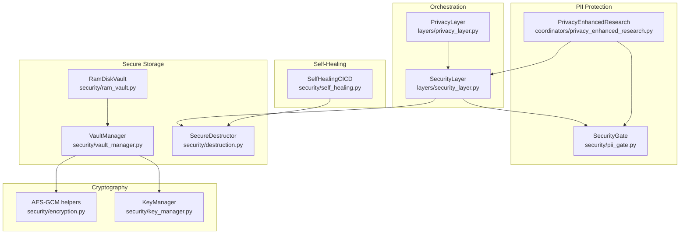
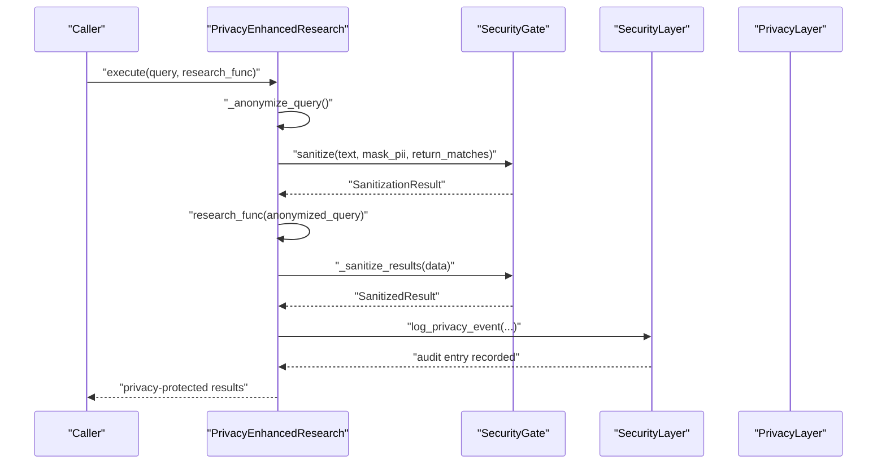
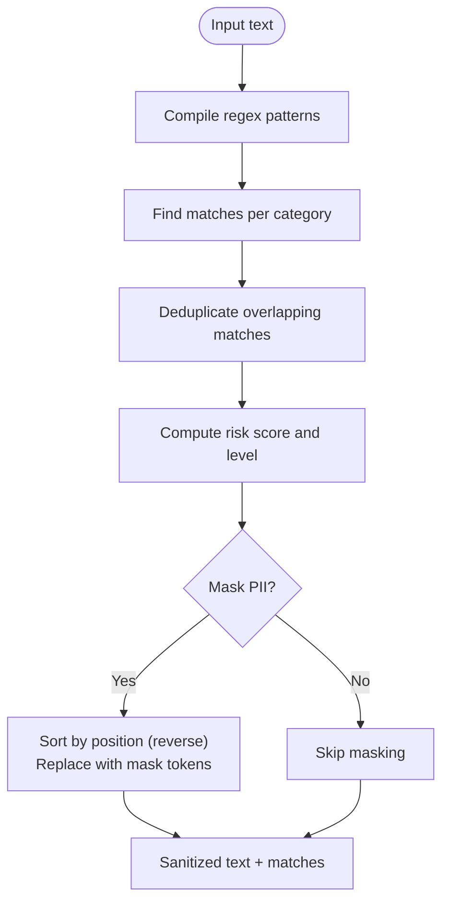
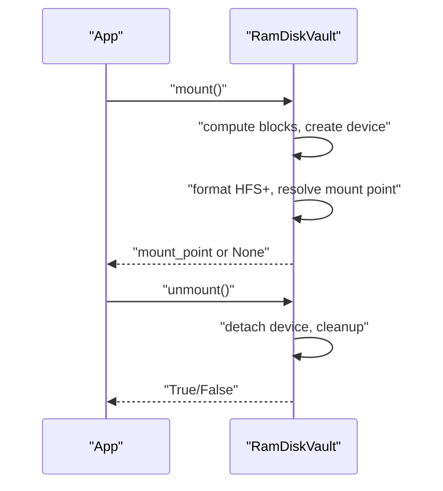
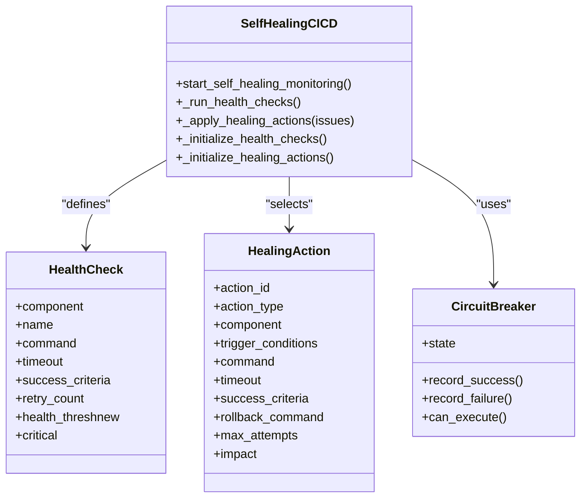
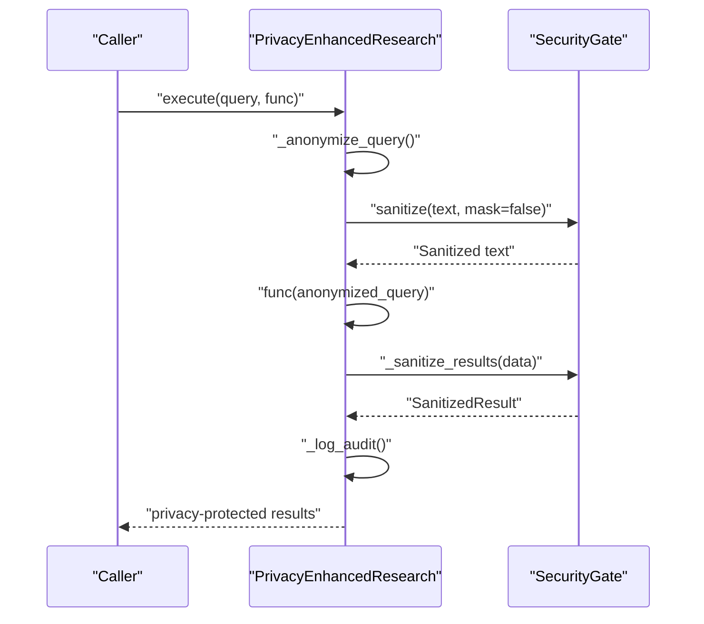
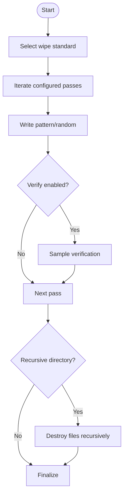
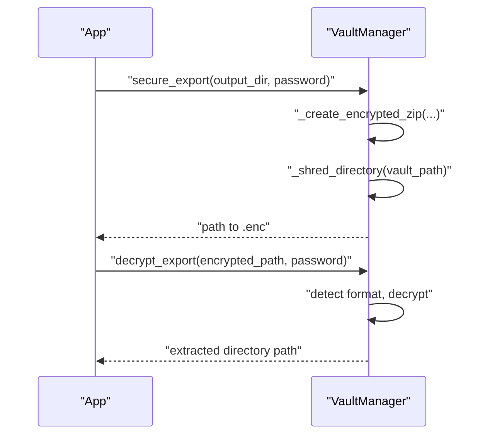
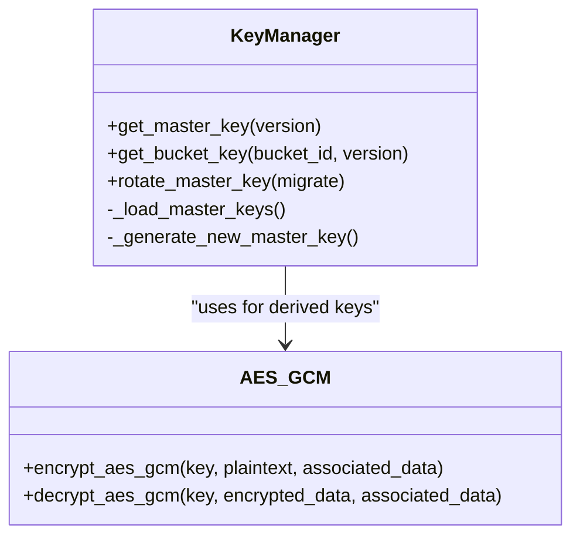
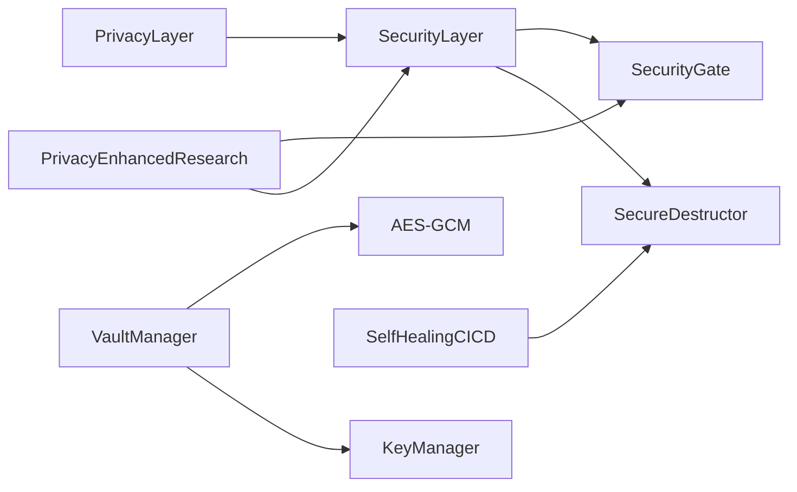

# Privacy Measures

<cite>
**Referenced Files in This Document**
- [privacy_layer.py](file://layers/privacy_layer.py)
- [security_layer.py](file://layers/security_layer.py)
- [pii_gate.py](file://security/pii_gate.py)
- [ram_vault.py](file://security/ram_vault.py)
- [destruction.py](file://security/destruction.py)
- [vault_manager.py](file://security/vault_manager.py)
- [self_healing.py](file://security/self_healing.py)
- [privacy_enhanced_research.py](file://coordinators/privacy_enhanced_research.py)
- [encryption.py](file://security/encryption.py)
- [key_manager.py](file://security/key_manager.py)
</cite>

## Table of Contents
1. [Introduction](#introduction)
2. [Project Structure](#project-structure)
3. [Core Components](#core-components)
4. [Architecture Overview](#architecture-overview)
5. [Detailed Component Analysis](#detailed-component-analysis)
6. [Dependency Analysis](#dependency-analysis)
7. [Performance Considerations](#performance-considerations)
8. [Troubleshooting Guide](#troubleshooting-guide)
9. [Conclusion](#conclusion)
10. [Appendices](#appendices)

## Introduction
This document explains the privacy protection mechanisms implemented in the system, focusing on:
- PII detection and redaction algorithms
- RAM vault operations
- Self-healing data structures
- Privacy-preserving techniques, data minimization strategies, and automated sanitization processes
- Implementation details for sensitive data handling, memory clearing procedures, and secure deletion protocols
- Examples of privacy impact assessments, compliance validation, and privacy-enhancing technologies
- Edge cases, performance implications, and integration with research workflows

## Project Structure
The privacy stack is organized around layered components:
- A privacy orchestration layer that coordinates privacy managers, anonymizers, and protocol generators
- A security layer that centralizes audit logging and destruction operations
- Dedicated security modules for PII detection, RAM-backed vaults, secure deletion, vault export, and self-healing CI/CD
- A privacy-enhanced research coordinator that applies anonymization and sanitization to research queries and results

**Diagram sources**
- [privacy_layer.py:77-548](file://layers/privacy_layer.py#L77-L548)
- [security_layer.py:297-582](file://layers/security_layer.py#L297-L582)
- [pii_gate.py:75-556](file://security/pii_gate.py#L75-L556)
- [privacy_enhanced_research.py:82-420](file://coordinators/privacy_enhanced_research.py#L82-L420)
- [ram_vault.py:9-154](file://security/ram_vault.py#L9-L154)
- [vault_manager.py:36-341](file://security/vault_manager.py#L36-L341)
- [destruction.py:51-281](file://security/destruction.py#L51-L281)
- [encryption.py:6-22](file://security/encryption.py#L6-L22)
- [key_manager.py:53-175](file://security/key_manager.py#L53-L175)
- [self_healing.py:176-800](file://security/self_healing.py#L176-L800)

**Section sources**
- [privacy_layer.py:77-548](file://layers/privacy_layer.py#L77-L548)
- [security_layer.py:297-582](file://layers/security_layer.py#L297-L582)
- [pii_gate.py:75-556](file://security/pii_gate.py#L75-L556)
- [privacy_enhanced_research.py:82-420](file://coordinators/privacy_enhanced_research.py#L82-L420)
- [ram_vault.py:9-154](file://security/ram_vault.py#L9-L154)
- [vault_manager.py:36-341](file://security/vault_manager.py#L36-L341)
- [destruction.py:51-281](file://security/destruction.py#L51-L281)
- [encryption.py:6-22](file://security/encryption.py#L6-L22)
- [key_manager.py:53-175](file://security/key_manager.py#L53-L175)
- [self_healing.py:176-800](file://security/self_healing.py#L176-L800)

## Core Components
- PrivacyLayer: Unified privacy orchestration integrating VPN/Tor privacy controls, anonymous communication, audit logging delegation, and protocol generation. It exposes privacy contexts and PII anonymization APIs.
- SecurityLayer: Centralized audit logging and destruction operations; delegates PII anonymization to PrivacyAuditLog when available.
- SecurityGate: Lightweight, regex-based PII detection and sanitization engine optimized for constrained environments.
- PrivacyEnhancedResearch: Applies anonymization and sanitization to research queries and results, with configurable retention and audit logging.
- RamDiskVault: Creates and manages an in-memory HFS+ volume for sensitive operations.
- VaultManager: Encrypted export/import of vault contents using modern cryptography backends.
- SecureDestructor: Implements secure wipe standards (DoD/NIST/Gutmann) with verification and memory wiping.
- SelfHealingCICD: Automated CI/CD self-healing with health checks, circuit breakers, and remediation actions.
- KeyManager and AES-GCM helpers: Master key lifecycle and symmetric encryption for secure storage.

**Section sources**
- [privacy_layer.py:77-548](file://layers/privacy_layer.py#L77-L548)
- [security_layer.py:297-582](file://layers/security_layer.py#L297-L582)
- [pii_gate.py:75-556](file://security/pii_gate.py#L75-L556)
- [privacy_enhanced_research.py:82-420](file://coordinators/privacy_enhanced_research.py#L82-L420)
- [ram_vault.py:9-154](file://security/ram_vault.py#L9-L154)
- [vault_manager.py:36-341](file://security/vault_manager.py#L36-L341)
- [destruction.py:51-281](file://security/destruction.py#L51-L281)
- [self_healing.py:176-800](file://security/self_healing.py#L176-L800)
- [key_manager.py:53-175](file://security/key_manager.py#L53-L175)
- [encryption.py:6-22](file://security/encryption.py#L6-L22)

## Architecture Overview
The privacy architecture integrates detection, anonymization, secure storage, and destruction into cohesive workflows. PrivacyLayer delegates audit logging to SecurityLayer to maintain a unified audit trail. SecurityGate provides early detection and masking, while PrivacyEnhancedResearch applies data minimization and sanitization to research operations. SecureDestructor and VaultManager provide secure deletion and encrypted export, respectively. SelfHealingCICD ensures resilient operations with automated remediation.

**Diagram sources**
- [privacy_enhanced_research.py:115-214](file://coordinators/privacy_enhanced_research.py#L115-L214)
- [pii_gate.py:150-214](file://security/pii_gate.py#L150-L214)
- [security_layer.py:297-339](file://layers/security_layer.py#L297-L339)
- [privacy_layer.py:288-345](file://layers/privacy_layer.py#L288-L345)

## Detailed Component Analysis

### PII Detection and Redaction Algorithms
- Regex-based detection: SecurityGate compiles category-specific patterns for emails, phones, SSNs, credit cards, IPs, URLs, dates, passports, driver licenses, and more. Detection uses finditer across patterns and deduplicates overlapping matches.
- Risk scoring: Risk score is proportional to the number of unique PII matches; risk level is derived from thresholds.
- Masking strategy: Matches are masked in reverse position order to preserve indices and minimize string concatenations.
- Fallback sanitizer: A robust fallback sanitizer ensures PII is redacted even if primary detection fails, with prioritized patterns and non-overlapping replacement logic.
- PrivacyLayer integration: Delegates anonymization to PrivacyAuditLog anonymizer when available; otherwise falls back to basic redaction.

**Diagram sources**
- [pii_gate.py:114-148](file://security/pii_gate.py#L114-L148)
- [pii_gate.py:216-273](file://security/pii_gate.py#L216-L273)
- [pii_gate.py:275-311](file://security/pii_gate.py#L275-L311)
- [pii_gate.py:457-550](file://security/pii_gate.py#L457-L550)

**Section sources**
- [pii_gate.py:75-556](file://security/pii_gate.py#L75-L556)
- [privacy_layer.py:428-464](file://layers/privacy_layer.py#L428-L464)

### RAM Vault Operations
- Mount lifecycle: Validates size and name, computes block count, creates a RAM disk device, formats with HFS+, and mounts to a predictable path.
- Unmount lifecycle: Safely detaches the device with force, handles timeouts and errors, and cleans up internal state.
- Validation: Uses df checks to confirm mount status.
- Context manager: Supports enter/exit semantics for automatic lifecycle management.

**Diagram sources**
- [ram_vault.py:28-115](file://security/ram_vault.py#L28-L115)

**Section sources**
- [ram_vault.py:9-154](file://security/ram_vault.py#L9-L154)

### Self-Healing Data Structures
- Health monitoring: Periodic health checks for code quality, security scans, tests, builds, and application health; circuit breakers prevent cascading failures.
- Remediation actions: Retry, fallback, circuit breaker, rollback, scale-up/down, restart service, clear cache, update dependencies, isolate issues.
- Metrics and thresholds: Tracks success rates, consecutive failures, response times, and component uptime; enforces limits on concurrent healings.
- Data structures: HealthCheck, HealingAction, HealthResult, HealingResult; uses deques and dicts for history and status tracking.

**Diagram sources**
- [self_healing.py:176-800](file://security/self_healing.py#L176-L800)

**Section sources**
- [self_healing.py:176-800](file://security/self_healing.py#L176-L800)

### Privacy-Enhanced Research Workflow
- Request anonymization: Removes PII patterns and optionally hashes identifiable terms for maximum privacy.
- Result sanitization: Recursively scans results to redact PII and track sanitized fields.
- Audit logging: Records operations with privacy level, anonymized query, result counts, and retention timestamps.
- Retention management: Enforces session/short/medium/long retention policies and periodic cleanup.

**Diagram sources**
- [privacy_enhanced_research.py:115-287](file://coordinators/privacy_enhanced_research.py#L115-L287)
- [pii_gate.py:150-311](file://security/pii_gate.py#L150-L311)

**Section sources**
- [privacy_enhanced_research.py:82-420](file://coordinators/privacy_enhanced_research.py#L82-L420)

### Secure Deletion Protocols
- Standards: Implements DoD 5220.22-M (3-pass), NIST 800-88 (1-pass random), and Gutmann (35-pass) patterns.
- Verification: Optional verification samples and metadata handling; supports recursive directory destruction.
- Memory wiping: Securely wipes bytearrays with random writes followed by zeroing.
- Integration: SecurityLayer coordinates destruction operations and logs actions to the audit chain.

**Diagram sources**
- [destruction.py:85-260](file://security/destruction.py#L85-L260)
- [security_layer.py:549-582](file://layers/security_layer.py#L549-L582)

**Section sources**
- [destruction.py:51-281](file://security/destruction.py#L51-L281)
- [security_layer.py:549-582](file://layers/security_layer.py#L549-L582)

### Vault Export and Encrypted Storage
- Export pipeline: Creates a ZIP archive of the vault, encrypts with pyzipper AES or cryptography Fernet, then securely deletes original contents.
- Decryption: Detects format (ZIP vs Fernet), validates against legacy XOR fallback removal, and extracts to a temporary location.
- Key derivation: Uses PBKDF2-HMAC-SHA256 with high iteration counts for robust key stretching.
- Integrity: Maintains strict fail-fast behavior if required cryptography libraries are missing.

**Diagram sources**
- [vault_manager.py:212-253](file://security/vault_manager.py#L212-L253)
- [vault_manager.py:255-331](file://security/vault_manager.py#L255-L331)

**Section sources**
- [vault_manager.py:36-341](file://security/vault_manager.py#L36-L341)

### Sensitive Data Handling and Memory Clearing
- AES-GCM helpers: Provides authenticated encryption/decryption with random nonces and tags.
- KeyManager: Manages master keys with versioning, HKDF-derived bucket keys, and mlock for sensitive buffers to reduce swap exposure.
- RAM vault: Provides a volatile in-memory filesystem for ephemeral sensitive workloads.

**Diagram sources**
- [key_manager.py:53-175](file://security/key_manager.py#L53-L175)
- [encryption.py:6-22](file://security/encryption.py#L6-L22)

**Section sources**
- [encryption.py:6-22](file://security/encryption.py#L6-L22)
- [key_manager.py:53-175](file://security/key_manager.py#L53-L175)
- [ram_vault.py:9-154](file://security/ram_vault.py#L9-L154)

## Dependency Analysis
- PrivacyLayer depends on SecurityLayer for unified audit logging and on PrivacyAuditLog anonymizer for PII anonymization.
- SecurityLayer depends on SecurityGate for PII detection and SecureDestructor for secure deletion.
- PrivacyEnhancedResearch depends on SecurityGate for sanitization and on SecurityLayer for audit logging.
- VaultManager depends on cryptography/pyzipper for encryption and on SecureDestructor for secure deletion.
- SelfHealingCICD is independent and focuses on CI/CD resilience.

**Diagram sources**
- [privacy_layer.py:77-548](file://layers/privacy_layer.py#L77-L548)
- [security_layer.py:297-582](file://layers/security_layer.py#L297-L582)
- [pii_gate.py:75-556](file://security/pii_gate.py#L75-L556)
- [privacy_enhanced_research.py:82-420](file://coordinators/privacy_enhanced_research.py#L82-L420)
- [vault_manager.py:36-341](file://security/vault_manager.py#L36-L341)
- [encryption.py:6-22](file://security/encryption.py#L6-L22)
- [key_manager.py:53-175](file://security/key_manager.py#L53-L175)
- [self_healing.py:176-800](file://security/self_healing.py#L176-L800)

**Section sources**
- [privacy_layer.py:77-548](file://layers/privacy_layer.py#L77-L548)
- [security_layer.py:297-582](file://layers/security_layer.py#L297-L582)
- [pii_gate.py:75-556](file://security/pii_gate.py#L75-L556)
- [privacy_enhanced_research.py:82-420](file://coordinators/privacy_enhanced_research.py#L82-L420)
- [vault_manager.py:36-341](file://security/vault_manager.py#L36-L341)
- [encryption.py:6-22](file://security/encryption.py#L6-L22)
- [key_manager.py:53-175](file://security/key_manager.py#L53-L175)
- [self_healing.py:176-800](file://security/self_healing.py#L176-L800)

## Performance Considerations
- Regex-based PII detection is optimized for constrained environments with bounded scanning and efficient segment-based replacement to avoid O(n^2) string concatenations.
- SecureDestructor uses minimal passes by default (DoD 3-pass) and optional verification to balance security and performance.
- VaultManager prefers pyzipper AES when available for better throughput; otherwise uses Fernet with temporary files to avoid in-memory duplication.
- SelfHealingCICD employs circuit breakers and throttling to prevent cascading failures and excessive remediation load.
- PrivacyEnhancedResearch applies anonymization and sanitization lazily and tracks sanitized fields to minimize repeated processing.

[No sources needed since this section provides general guidance]

## Troubleshooting Guide
- PII detection failures: SecurityGate returns sanitized text and logs errors; fallback_sanitize ensures PII redaction even if primary detection fails.
- Vault export failures: VaultManager raises runtime errors if neither cryptography nor pyzipper is available; XOR fallback has been removed for security.
- Secure deletion failures: SecureDestructor logs errors and cleans up devices on failure; verify_destruction toggles verification to reduce overhead.
- RAM vault mount failures: Validate size/name constraints, handle timeouts, and ensure proper permissions for hdiutil/diskutil.
- Self-healing stuck cycles: Review circuit breaker states, health check intervals, and max concurrent healings; adjust thresholds and limits accordingly.

**Section sources**
- [pii_gate.py:206-214](file://security/pii_gate.py#L206-L214)
- [vault_manager.py:67-73](file://security/vault_manager.py#L67-L73)
- [destruction.py:132-143](file://security/destruction.py#L132-L143)
- [ram_vault.py:71-78](file://security/ram_vault.py#L71-L78)
- [self_healing.py:461-493](file://security/self_healing.py#L461-L493)

## Conclusion
The system implements a comprehensive privacy stack combining lightweight PII detection, anonymization, secure storage, and destruction. PrivacyLayer and SecurityLayer coordinate these capabilities, while PrivacyEnhancedResearch ensures privacy-preserving research workflows. SecureDestructor and VaultManager enforce secure deletion and encrypted export, respectively. SelfHealingCICD maintains resilience and reliability. Together, these components provide strong privacy safeguards with practical performance characteristics and clear operational boundaries.

[No sources needed since this section summarizes without analyzing specific files]

## Appendices

### Privacy Impact Assessment (PIA) Example
- Purpose: Evaluate privacy risks for research workflows involving sensitive queries and results.
- Scope: Define data categories, processing purposes, retention periods, and third-party integrations.
- Risk Mitigation: Apply anonymization, sanitization, and secure deletion; enforce audit logging and compliance reporting.
- Monitoring: Track health checks, remediation actions, and retention enforcement.

[No sources needed since this section provides general guidance]

### Compliance Validation
- GDPR/CCPA reports: Generated via SecurityLayer using PrivacyAuditLog anonymizer and compliance windows.
- Standards alignment: Secure deletion follows DoD/NIST/Gutmann guidelines; encryption uses modern authenticated ciphers.

**Section sources**
- [security_layer.py:297-308](file://layers/security_layer.py#L297-L308)
- [privacy_layer.py:370-381](file://layers/privacy_layer.py#L370-L381)
- [destruction.py:85-83](file://security/destruction.py#L85-L83)

### Privacy-Enhancing Technologies
- Zero-trust anonymization: Regex-based detection and masking with risk scoring.
- Secure in-memory storage: RAM vault for ephemeral sensitive operations.
- Encrypted archives: Modern cryptography backends for vault export/import.
- Automated remediation: Self-healing CI/CD to maintain system integrity and reduce exposure windows.

[No sources needed since this section provides general guidance]