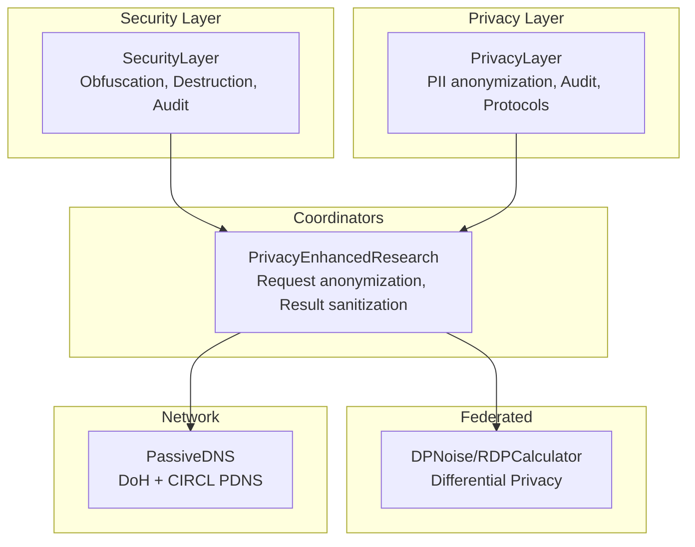
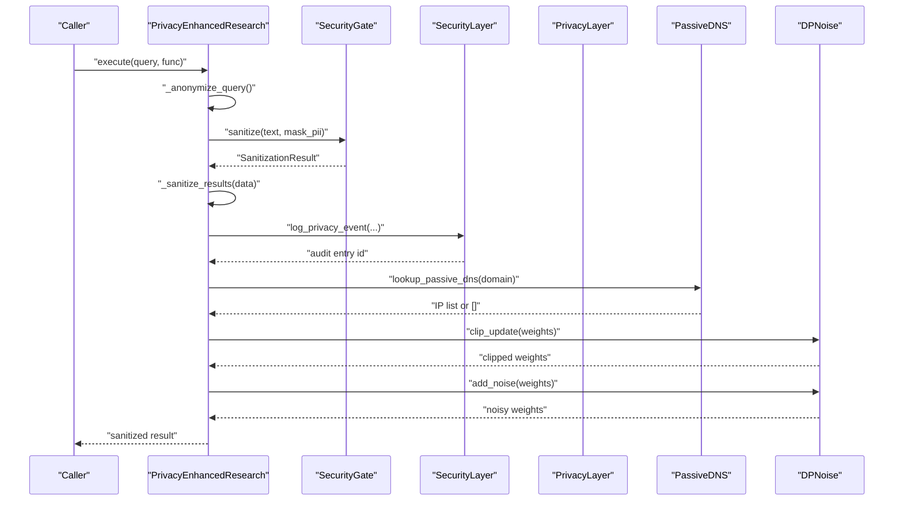
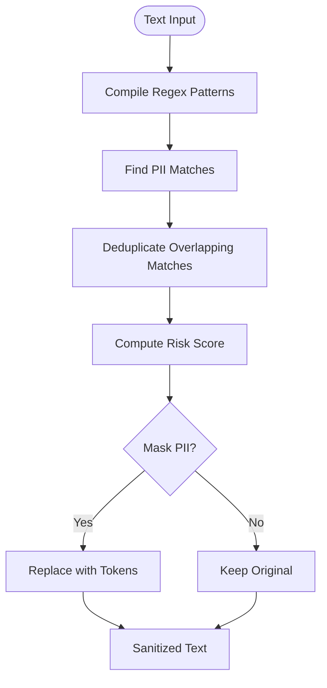
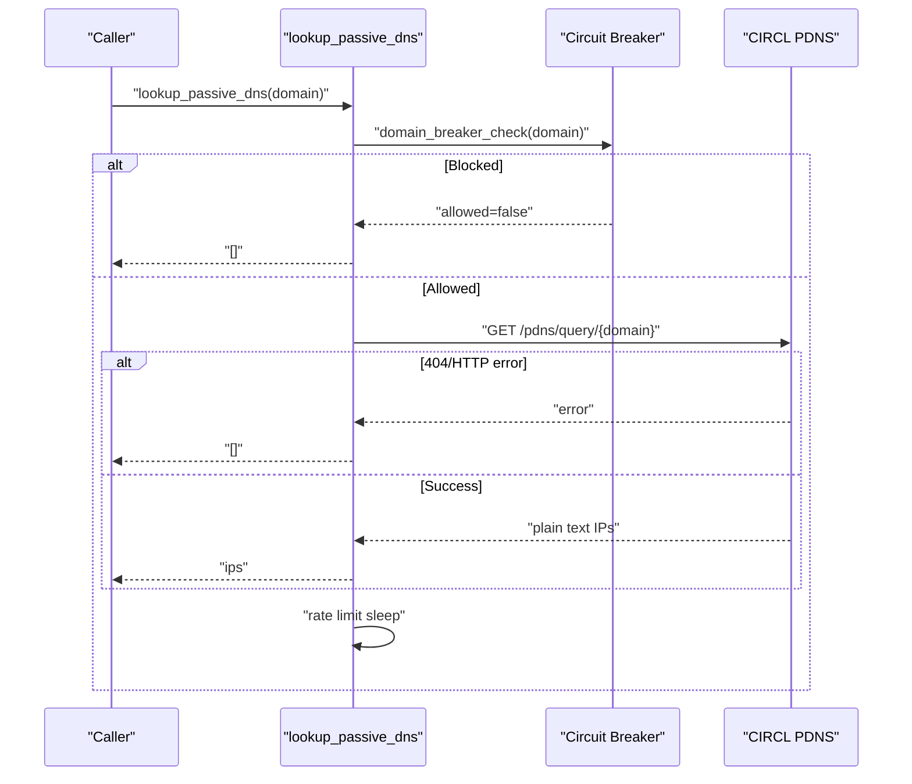
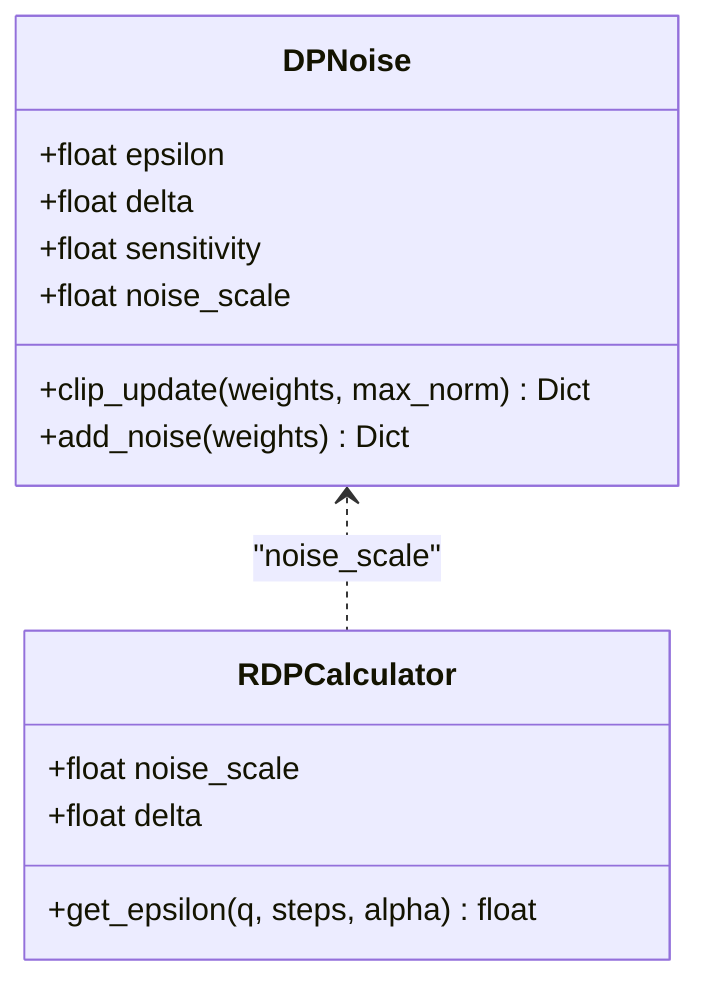
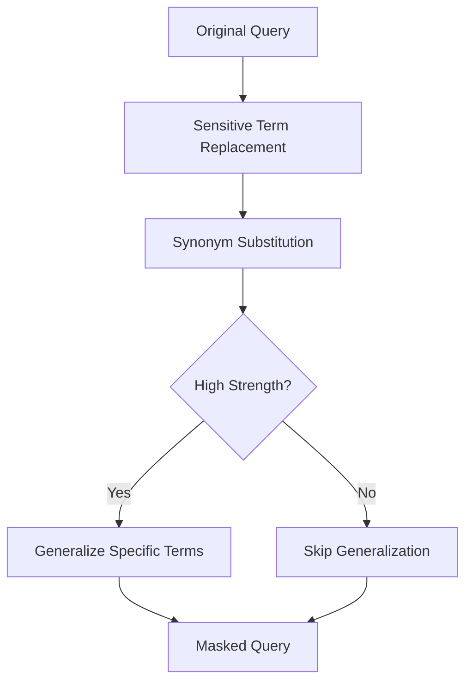
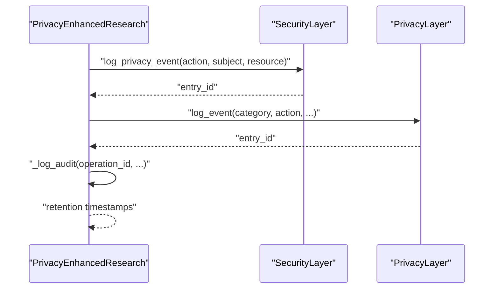
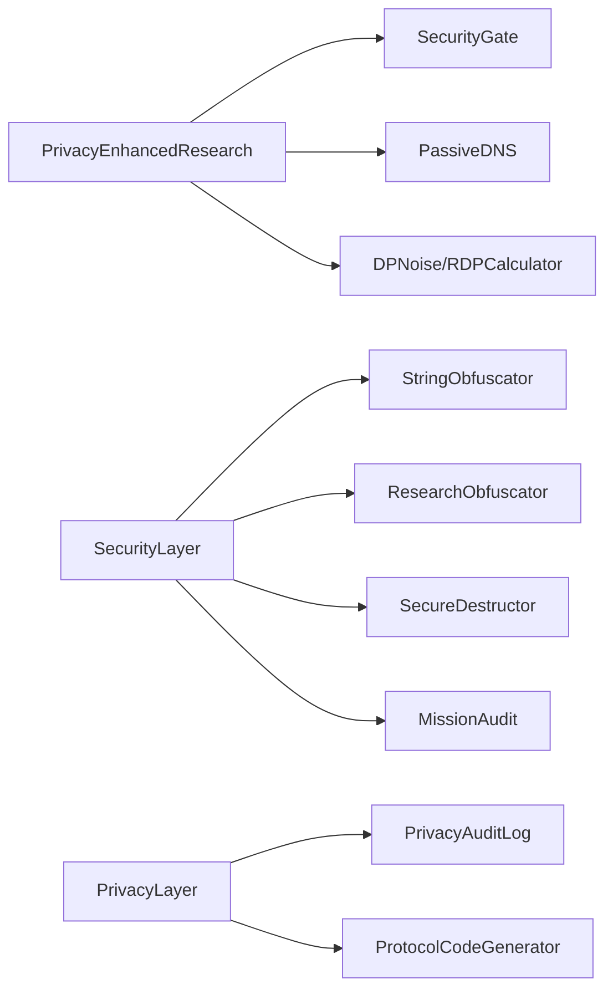

# Privacy-Preserving Techniques

<cite>
**Referenced Files in This Document**
- [privacy_layer.py](file://layers/privacy_layer.py)
- [security_layer.py](file://layers/security_layer.py)
- [pii_gate.py](file://security/pii_gate.py)
- [obfuscation.py](file://security/obfuscation.py)
- [passive_dns.py](file://security/passive_dns.py)
- [differential_privacy.py](file://federated/differential_privacy.py)
- [privacy_enhanced_research.py](file://coordinators/privacy_enhanced_research.py)
- [config.py](file://config.py)
- [project_types.py](file://project_types.py)
- [test_sprint58b.py](file://tests/test_sprint58b.py)
- [test_sprint71/test_federated_dp.py](file://tests/test_sprint71/test_federated_dp.py)
</cite>

## Table of Contents
1. [Introduction](#introduction)
2. [Project Structure](#project-structure)
3. [Core Components](#core-components)
4. [Architecture Overview](#architecture-overview)
5. [Detailed Component Analysis](#detailed-component-analysis)
6. [Dependency Analysis](#dependency-analysis)
7. [Performance Considerations](#performance-considerations)
8. [Troubleshooting Guide](#troubleshooting-guide)
9. [Conclusion](#conclusion)
10. [Appendices](#appendices)

## Introduction
This document explains the privacy-preserving techniques and data protection mechanisms implemented in the codebase. It covers:
- PII detection and sanitization
- Passive DNS anonymization and anti-traffic techniques
- Differential privacy for federated learning
- Obfuscation strategies and data masking
- Privacy-compliant workflows and audit/logging
- Examples of privacy impact assessments and compliance reporting

The goal is to help both technical and non-technical readers understand how privacy is enforced end-to-end, from ingestion to processing and federation.

## Project Structure
The privacy stack is organized around layered components:
- SecurityLayer: cryptography, obfuscation, secure destruction, and unified audit
- PrivacyLayer: privacy orchestration, anonymization, and protocol generation
- Coordinator-level wrappers: privacy-enhanced research workflows
- Federated privacy: differential privacy utilities for training
- Passive DNS: anonymized DNS resolution and passive DNS lookup

**Diagram sources**
- [security_layer.py:34-106](file://layers/security_layer.py#L34-L106)
- [privacy_layer.py:77-110](file://layers/privacy_layer.py#L77-L110)
- [privacy_enhanced_research.py:82-114](file://coordinators/privacy_enhanced_research.py#L82-L114)
- [differential_privacy.py:12-41](file://federated/differential_privacy.py#L12-L41)
- [passive_dns.py:104-216](file://security/passive_dns.py#L104-L216)

**Section sources**
- [security_layer.py:34-106](file://layers/security_layer.py#L34-L106)
- [privacy_layer.py:77-110](file://layers/privacy_layer.py#L77-L110)
- [privacy_enhanced_research.py:82-114](file://coordinators/privacy_enhanced_research.py#L82-L114)
- [differential_privacy.py:12-41](file://federated/differential_privacy.py#L12-L41)
- [passive_dns.py:104-216](file://security/passive_dns.py#L104-L216)

## Core Components
- SecurityLayer integrates string obfuscation, research query masking, secure destruction, and unified audit chains (forensic and compliance).
- PrivacyLayer orchestrates personal privacy controls, anonymous communication, privacy audit logging, and protocol code generation.
- PrivacyEnhancedResearch wraps research operations with request anonymization, result sanitization, audit logging, and retention policies.
- SecurityGate provides fast, regex-based PII detection and sanitization with a robust fallback.
- PassiveDNS offers DoH and passive DNS lookup with graceful degradation and transport policy telemetry.
- DPNoise and RDPCalculator implement differential privacy for federated learning updates.

**Section sources**
- [security_layer.py:34-106](file://layers/security_layer.py#L34-L106)
- [privacy_layer.py:77-110](file://layers/privacy_layer.py#L77-L110)
- [privacy_enhanced_research.py:82-114](file://coordinators/privacy_enhanced_research.py#L82-L114)
- [pii_gate.py:75-113](file://security/pii_gate.py#L75-L113)
- [passive_dns.py:104-216](file://security/passive_dns.py#L104-L216)
- [differential_privacy.py:12-41](file://federated/differential_privacy.py#L12-L41)

## Architecture Overview
The privacy architecture enforces protection at multiple layers:
- Ingestion: PII detection and sanitization via SecurityGate and PrivacyLayer anonymization
- Processing: Research obfuscation and secure destruction
- Federation: Differential privacy noise addition and gradient clipping
- Networking: Passive DNS anonymization and rate-limited, non-blocking lookups

**Diagram sources**
- [privacy_enhanced_research.py:115-215](file://coordinators/privacy_enhanced_research.py#L115-L215)
- [pii_gate.py:150-215](file://security/pii_gate.py#L150-L215)
- [security_layer.py:264-347](file://layers/security_layer.py#L264-L347)
- [privacy_layer.py:288-345](file://layers/privacy_layer.py#L288-L345)
- [passive_dns.py:218-317](file://security/passive_dns.py#L218-L317)
- [differential_privacy.py:23-40](file://federated/differential_privacy.py#L23-L40)

## Detailed Component Analysis

### PII Detection and Sanitization
- SecurityGate performs regex-based detection across multiple PII categories and supports masking and risk scoring. It includes a robust fallback sanitizer that redacts PII conservatively and safely.
- PrivacyLayer delegates anonymization to PrivacyAuditLog’s anonymizer when available, with a basic regex fallback.
- PrivacyEnhancedResearch applies regex-based redaction during request anonymization and result sanitization, with recursive traversal for nested structures.

**Diagram sources**
- [pii_gate.py:114-148](file://security/pii_gate.py#L114-L148)
- [pii_gate.py:216-258](file://security/pii_gate.py#L216-L258)
- [privacy_layer.py:430-452](file://layers/privacy_layer.py#L430-L452)
- [privacy_enhanced_research.py:249-287](file://coordinators/privacy_enhanced_research.py#L249-L287)

**Section sources**
- [pii_gate.py:75-113](file://security/pii_gate.py#L75-L113)
- [pii_gate.py:150-215](file://security/pii_gate.py#L150-L215)
- [privacy_layer.py:430-452](file://layers/privacy_layer.py#L430-L452)
- [privacy_enhanced_research.py:249-287](file://coordinators/privacy_enhanced_research.py#L249-L287)

### Passive DNS Anonymization
- DoH resolution and passive DNS lookup are implemented with graceful degradation, rate-limiting, and transport policy telemetry. The system avoids blocking I/O and returns empty lists on failure.
- Circuit breaker preflight checks are supported to skip unsafe domains early.

**Diagram sources**
- [passive_dns.py:218-317](file://security/passive_dns.py#L218-L317)
- [passive_dns.py:348-522](file://security/passive_dns.py#L348-L522)

**Section sources**
- [passive_dns.py:104-216](file://security/passive_dns.py#L104-L216)
- [passive_dns.py:218-317](file://security/passive_dns.py#L218-L317)
- [passive_dns.py:348-522](file://security/passive_dns.py#L348-L522)

### Differential Privacy for Federated Learning
- DPNoise provides gradient clipping and Gaussian noise addition for federated updates. Noise scale is computed from sensitivity, delta, and epsilon.
- RDPCalculator estimates epsilon via Rényi Differential Privacy conversion for multi-step composition.

**Diagram sources**
- [differential_privacy.py:12-41](file://federated/differential_privacy.py#L12-L41)
- [differential_privacy.py:43-68](file://federated/differential_privacy.py#L43-L68)

**Section sources**
- [differential_privacy.py:12-41](file://federated/differential_privacy.py#L12-L41)
- [differential_privacy.py:43-68](file://federated/differential_privacy.py#L43-L68)
- [test_sprint58b.py:224-276](file://tests/test_sprint58b.py#L224-L276)
- [test_sprint71/test_federated_dp.py:22-37](file://tests/test_sprint71/test_federated_dp.py#L22-L37)

### Obfuscation Strategies and Data Masking
- SecurityLayer integrates StringObfuscator for multi-stage encoding (XOR, Base64, Zlib) and ResearchObfuscator for query masking, chaff traffic, and timing jitter.
- PrivacyLayer exposes anonymization APIs and context management for privacy operations.
- PrivacyEnhancedResearch applies regex-based redaction and optional hashing for maximum privacy.

**Diagram sources**
- [security_layer.py:40-73](file://layers/security_layer.py#L40-L73)
- [obfuscation.py:134-168](file://security/obfuscation.py#L134-L168)
- [privacy_enhanced_research.py:216-247](file://coordinators/privacy_enhanced_research.py#L216-L247)

**Section sources**
- [security_layer.py:34-106](file://layers/security_layer.py#L34-L106)
- [obfuscation.py:61-133](file://security/obfuscation.py#L61-L133)
- [privacy_enhanced_research.py:216-247](file://coordinators/privacy_enhanced_research.py#L216-L247)

### Privacy-Compliant Workflows and Audit Logging
- SecurityLayer maintains unified audit chains supporting forensic and compliance modes. It can log privacy events and generate compliance reports.
- PrivacyLayer centralizes privacy audit logging and protocol generation, with context creation and lifecycle management.
- PrivacyEnhancedResearch tracks operations, retains minimal metadata, and enforces data retention policies.

**Diagram sources**
- [security_layer.py:264-347](file://layers/security_layer.py#L264-L347)
- [privacy_layer.py:288-345](file://layers/privacy_layer.py#L288-L345)
- [privacy_enhanced_research.py:289-320](file://coordinators/privacy_enhanced_research.py#L289-L320)

**Section sources**
- [security_layer.py:264-347](file://layers/security_layer.py#L264-L347)
- [privacy_layer.py:288-345](file://layers/privacy_layer.py#L288-L345)
- [privacy_enhanced_research.py:289-320](file://coordinators/privacy_enhanced_research.py#L289-L320)

## Dependency Analysis
- PrivacyLayer depends on PrivacyAuditLog anonymizer and protocol generator; it delegates privacy audit logging to SecurityLayer to avoid duplication.
- SecurityLayer depends on StringObfuscator, ResearchObfuscator, SecureDestructor, and MissionAudit for unified security and audit.
- PrivacyEnhancedResearch coordinates with SecurityGate and PassiveDNS for privacy-safe operations.
- Federated components (DPNoise, RDPCalculator) are independent and integrated at training time.

**Diagram sources**
- [privacy_enhanced_research.py:115-215](file://coordinators/privacy_enhanced_research.py#L115-L215)
- [security_layer.py:114-139](file://layers/security_layer.py#L114-L139)
- [privacy_layer.py:112-162](file://layers/privacy_layer.py#L112-L162)

**Section sources**
- [privacy_enhanced_research.py:115-215](file://coordinators/privacy_enhanced_research.py#L115-L215)
- [security_layer.py:114-139](file://layers/security_layer.py#L114-L139)
- [privacy_layer.py:112-162](file://layers/privacy_layer.py#L112-L162)

## Performance Considerations
- Regex-based PII detection is optimized for bounded scanning and avoids catastrophic backtracking via length limits and careful pattern ordering.
- PassiveDNS uses non-blocking aiohttp calls, rate-limit sleeps, and graceful degradation to prevent stalls.
- Differential privacy noise addition leverages vectorized numpy operations for efficient per-layer weight updates.
- Research obfuscation applies transformations in linear passes over text and data structures to minimize overhead.

[No sources needed since this section provides general guidance]

## Troubleshooting Guide
Common issues and resolutions:
- PII detection failures: Verify input types and enable fallback sanitization. Review risk analysis outputs and adjust thresholds.
- PassiveDNS timeouts or empty results: Confirm network connectivity, provider availability, and circuit breaker decisions. Adjust rate limits and retry logic.
- Differential privacy noise not applied: Ensure epsilon and delta are set appropriately; confirm noise scale computation and gradient clipping.
- Audit logging errors: Check SecurityLayer initialization and PrivacyLayer audit availability. Validate event categories and severity mappings.

**Section sources**
- [pii_gate.py:206-214](file://security/pii_gate.py#L206-L214)
- [passive_dns.py:210-214](file://security/passive_dns.py#L210-L214)
- [differential_privacy.py:15-21](file://federated/differential_privacy.py#L15-L21)
- [security_layer.py:285-287](file://layers/security_layer.py#L285-L287)

## Conclusion
The codebase implements a comprehensive privacy stack:
- Robust PII detection and sanitization with fallbacks
- Passive DNS anonymization with graceful degradation
- Differential privacy for federated learning
- Multi-level obfuscation and secure destruction
- Unified audit logging for compliance and forensics

These mechanisms collectively support privacy-by-design workflows for autonomous intelligence gathering while maintaining operational reliability.

[No sources needed since this section summarizes without analyzing specific files]

## Appendices

### Privacy Impact Assessment (PIA) Example
- Purpose: Evaluate privacy risks for a research pipeline that ingests external data, performs federated training, and publishes anonymized insights.
- Data Inventory: Identify PII sources (user queries, logs, model artifacts).
- Risk Analysis: Quantify risk using SecurityGate’s risk scoring and PassiveDNS outcome metrics.
- Mitigations: Apply anonymization, differential privacy, and secure destruction; enforce retention policies.
- Monitoring: Track audit logs, compliance reports, and federated privacy budgets.

[No sources needed since this section provides general guidance]

### Compliance Reporting
- GDPR/CCPA Reports: Generated via PrivacyLayer and SecurityLayer compliance modes. Configure retention windows and event categories accordingly.

**Section sources**
- [privacy_layer.py:370-381](file://layers/privacy_layer.py#L370-L381)
- [security_layer.py:289-316](file://layers/security_layer.py#L289-L316)

### Configuration Reference
- SecurityConfig and PrivacyConfig define privacy levels, obfuscation strengths, and audit settings.

**Section sources**
- [config.py:124-146](file://config.py#L124-L146)
- [project_types.py:270-292](file://project_types.py#L270-L292)