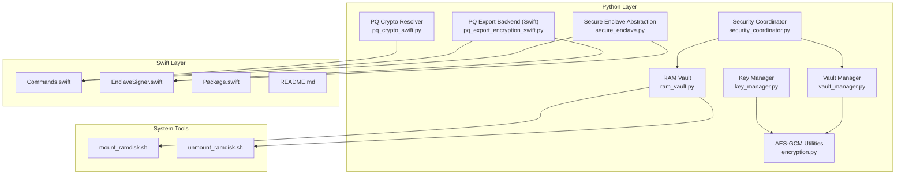
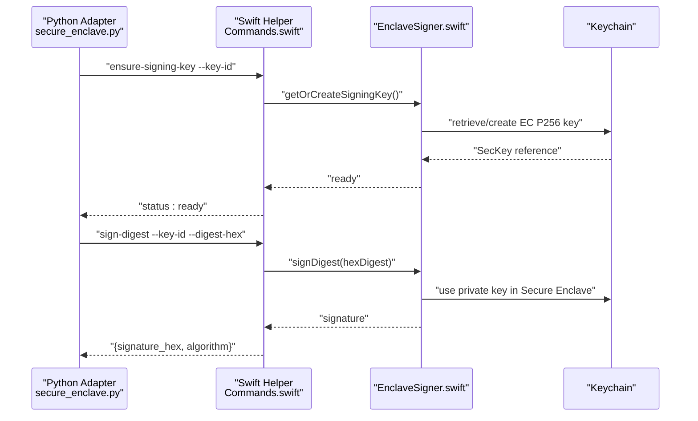
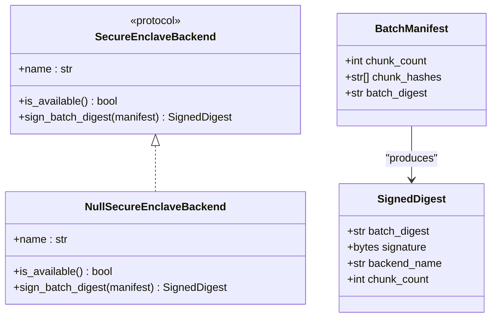
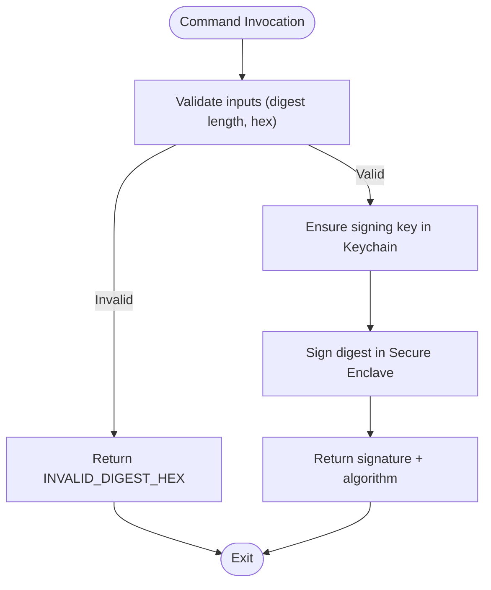
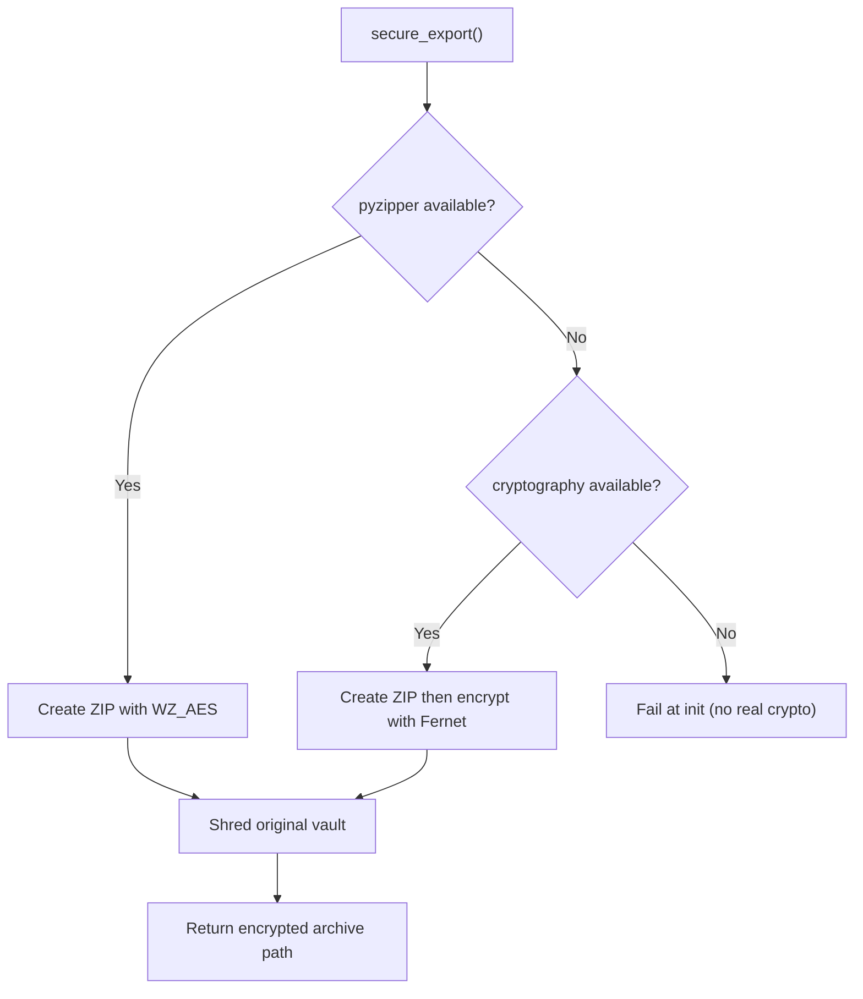
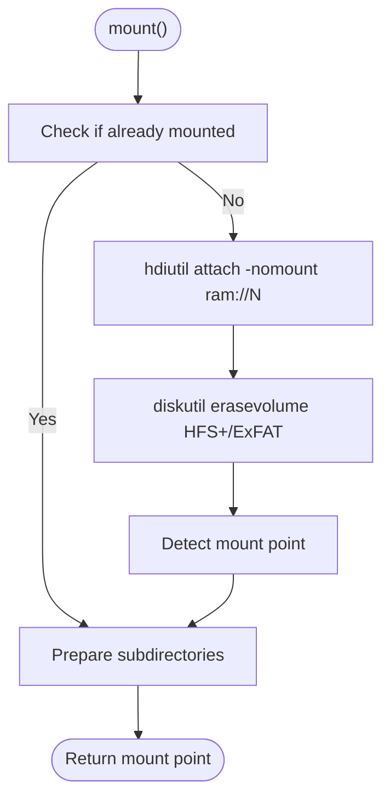
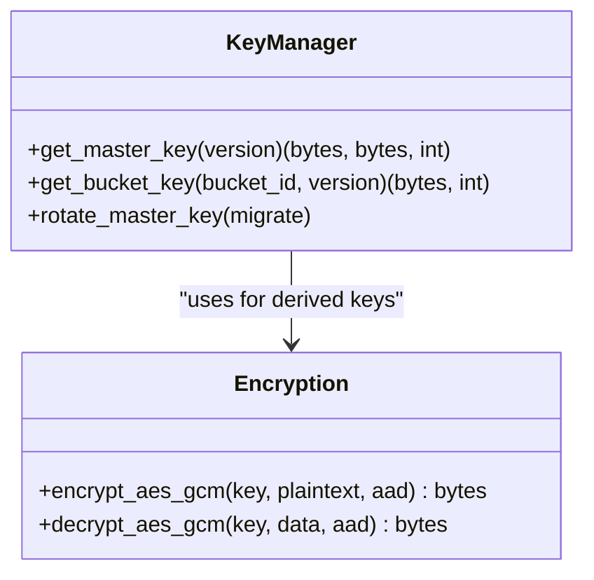
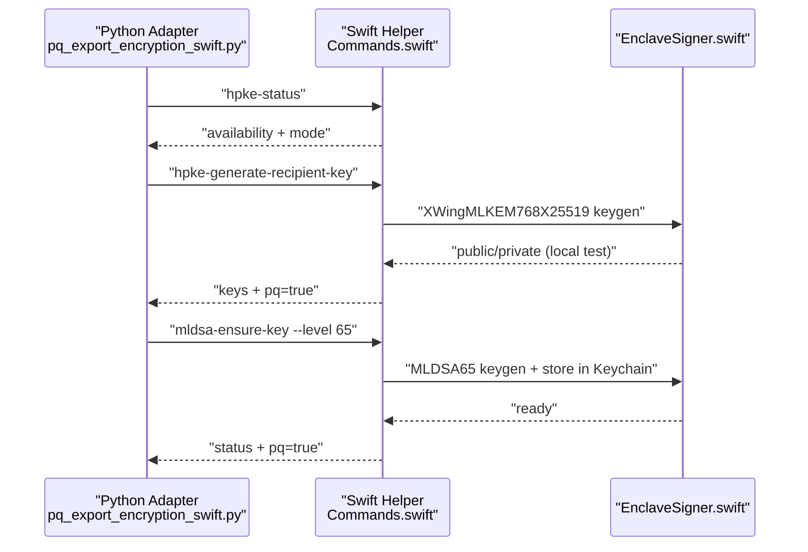
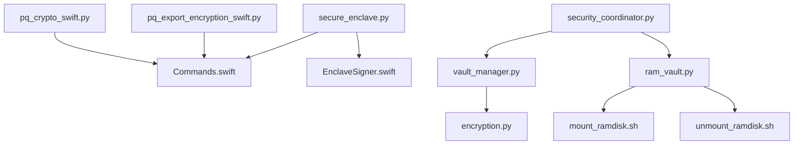

# Secure Enclaves and Hardware Security

<cite>
**Referenced Files in This Document**
- [secure_enclave.py](file://security/secure_enclave.py)
- [EnclaveSigner.swift](file://tools/secure_enclave_helper/Sources/EnclaveSigner.swift)
- [Commands.swift](file://tools/secure_enclave_helper/Sources/Commands.swift)
- [README.md](file://tools/secure_enclave_helper/README.md)
- [Package.swift](file://tools/secure_enclave_helper/Package.swift)
- [ram_vault.py](file://security/ram_vault.py)
- [vault_manager.py](file://security/vault_manager.py)
- [mount_ramdisk.sh](file://scripts/mount_ramdisk.sh)
- [unmount_ramdisk.sh](file://scripts/unmount_ramdisk.sh)
- [security_coordinator.py](file://coordinators/security_coordinator.py)
- [pq_export_encryption_swift.py](file://security/pq_export_encryption_swift.py)
- [pq_crypto_swift.py](file://security/pq_crypto_swift.py)
- [key_manager.py](file://security/key_manager.py)
- [encryption.py](file://security/encryption.py)
</cite>

## Table of Contents
1. [Introduction](#introduction)
2. [Project Structure](#project-structure)
3. [Core Components](#core-components)
4. [Architecture Overview](#architecture-overview)
5. [Detailed Component Analysis](#detailed-component-analysis)
6. [Dependency Analysis](#dependency-analysis)
7. [Performance Considerations](#performance-considerations)
8. [Troubleshooting Guide](#troubleshooting-guide)
9. [Conclusion](#conclusion)
10. [Appendices](#appendices)

## Introduction
This document explains the secure enclave integration and hardware security features implemented in the project. It covers Apple Secure Enclave utilization, vault management systems, and RAM-based secure storage. It also documents the Swift-based enclave helper implementation, cryptographic signing operations, and hardware-backed key protection. Configuration requirements, performance characteristics, and security boundary enforcement are included, along with examples of secure key storage, enclave attestation, and hardware security best practices for autonomous operations.

## Project Structure
The secure enclave and hardware security features are implemented across several modules:
- Python Secure Enclave abstraction and vault management
- Swift-based Secure Enclave helper CLI for signing and post-quantum operations
- RAM-based vault creation and lifecycle management
- Security coordinator orchestration and integration points

**Diagram sources**
- [secure_enclave.py:1-196](file://security/secure_enclave.py#L1-L196)
- [vault_manager.py:1-368](file://security/vault_manager.py#L1-L368)
- [ram_vault.py:1-154](file://security/ram_vault.py#L1-L154)
- [key_manager.py:1-175](file://security/key_manager.py#L1-L175)
- [encryption.py:1-23](file://security/encryption.py#L1-L23)
- [security_coordinator.py:96-352](file://coordinators/security_coordinator.py#L96-L352)
- [pq_export_encryption_swift.py:1-202](file://security/pq_export_encryption_swift.py#L1-L202)
- [pq_crypto_swift.py:52-97](file://security/pq_crypto_swift.py#L52-L97)
- [Commands.swift:1-885](file://tools/secure_enclave_helper/Sources/Commands.swift#L1-L885)
- [EnclaveSigner.swift:1-195](file://tools/secure_enclave_helper/Sources/EnclaveSigner.swift#L1-L195)
- [Package.swift:1-25](file://tools/secure_enclave_helper/Package.swift#L1-L25)
- [README.md:1-221](file://tools/secure_enclave_helper/README.md#L1-L221)
- [mount_ramdisk.sh:1-118](file://scripts/mount_ramdisk.sh#L1-L118)
- [unmount_ramdisk.sh:1-50](file://scripts/unmount_ramdisk.sh#L1-L50)

**Section sources**
- [secure_enclave.py:1-196](file://security/secure_enclave.py#L1-L196)
- [vault_manager.py:1-368](file://security/vault_manager.py#L1-L368)
- [ram_vault.py:1-154](file://security/ram_vault.py#L1-L154)
- [key_manager.py:1-175](file://security/key_manager.py#L1-L175)
- [encryption.py:1-23](file://security/encryption.py#L1-L23)
- [security_coordinator.py:96-352](file://coordinators/security_coordinator.py#L96-L352)
- [pq_export_encryption_swift.py:1-202](file://security/pq_export_encryption_swift.py#L1-L202)
- [pq_crypto_swift.py:52-97](file://security/pq_crypto_swift.py#L52-L97)
- [Commands.swift:1-885](file://tools/secure_enclave_helper/Sources/Commands.swift#L1-L885)
- [EnclaveSigner.swift:1-195](file://tools/secure_enclave_helper/Sources/EnclaveSigner.swift#L1-L195)
- [Package.swift:1-25](file://tools/secure_enclave_helper/Package.swift#L1-L25)
- [README.md:1-221](file://tools/secure_enclave_helper/README.md#L1-L221)
- [mount_ramdisk.sh:1-118](file://scripts/mount_ramdisk.sh#L1-L118)
- [unmount_ramdisk.sh:1-50](file://scripts/unmount_ramdisk.sh#L1-L50)

## Core Components
- Secure Enclave abstraction: Provides a fail-soft protocol for signing batch digests and a null backend for environments without hardware support.
- Swift Secure Enclave helper: Implements signing and post-quantum operations (HPKE X-Wing, ML-DSA) and exposes them via JSON responses.
- Vault management: Encrypted export of vault contents and secure deletion, with prioritized encryption backends.
- RAM-based vault: Creation and lifecycle management of macOS RAM disks for ephemeral, high-performance secure storage.
- Key management: Master key rotation, bucket key derivation, and memory locking for sensitive buffers.
- Security coordinator: Orchestrates security operations and integrates vault and enclave features.

**Section sources**
- [secure_enclave.py:66-124](file://security/secure_enclave.py#L66-L124)
- [Commands.swift:20-130](file://tools/secure_enclave_helper/Sources/Commands.swift#L20-L130)
- [vault_manager.py:36-126](file://security/vault_manager.py#L36-L126)
- [ram_vault.py:9-79](file://security/ram_vault.py#L9-L79)
- [key_manager.py:53-175](file://security/key_manager.py#L53-L175)
- [security_coordinator.py:96-128](file://coordinators/security_coordinator.py#L96-L128)

## Architecture Overview
The system separates cryptographic operations into a Swift helper and Python adapters. The helper ensures keys remain inside Secure Enclave and Keychain, while Python components manage higher-level orchestration, vaulting, and export.

**Diagram sources**
- [secure_enclave.py:152-196](file://security/secure_enclave.py#L152-L196)
- [Commands.swift:34-108](file://tools/secure_enclave_helper/Sources/Commands.swift#L34-L108)
- [EnclaveSigner.swift:44-151](file://tools/secure_enclave_helper/Sources/EnclaveSigner.swift#L44-L151)

## Detailed Component Analysis

### Secure Enclave Abstraction (Python)
- Protocol and null backend: Ensures graceful degradation when hardware or imports are unavailable.
- Batch manifest building: Deterministic hashing of chunk digests for single hardware-backed signature.
- Backend factory: Attempts to load a real backend and falls back to null with detailed status.

**Diagram sources**
- [secure_enclave.py:66-124](file://security/secure_enclave.py#L66-L124)
- [secure_enclave.py:126-149](file://security/secure_enclave.py#L126-L149)

**Section sources**
- [secure_enclave.py:66-124](file://security/secure_enclave.py#L66-L124)
- [secure_enclave.py:126-149](file://security/secure_enclave.py#L126-L149)
- [secure_enclave.py:152-196](file://security/secure_enclave.py#L152-L196)

### Swift Secure Enclave Helper
- Signing operations: ECDSA P-256 over SHA-256 digests with Keychain-managed non-exportable keys.
- Post-quantum commands: HPKE X-Wing (XWingMLKEM768X25519) and ML-DSA-65 (when available).
- Error handling and timeouts: Structured JSON responses and explicit error codes.
- Availability checks: OS version gating and runtime probing.

**Diagram sources**
- [Commands.swift:79-108](file://tools/secure_enclave_helper/Sources/Commands.swift#L79-L108)
- [EnclaveSigner.swift:128-151](file://tools/secure_enclave_helper/Sources/EnclaveSigner.swift#L128-L151)

**Section sources**
- [Commands.swift:20-130](file://tools/secure_enclave_helper/Sources/Commands.swift#L20-L130)
- [EnclaveSigner.swift:29-167](file://tools/secure_enclave_helper/Sources/EnclaveSigner.swift#L29-L167)
- [README.md:117-155](file://tools/secure_enclave_helper/README.md#L117-L155)

### Vault Management System
- Encrypted export: Priority order pyzipper AES (WZ_AES) then Fernet; XOR fallback removed.
- Decryption: ZIP AES or Fernet with strict path safety and format sniffing.
- Secure deletion: Multi-pass overwrite and recursive removal with cleanup.

**Diagram sources**
- [vault_manager.py:212-253](file://security/vault_manager.py#L212-L253)
- [vault_manager.py:117-173](file://security/vault_manager.py#L117-L173)
- [vault_manager.py:255-291](file://security/vault_manager.py#L255-L291)

**Section sources**
- [vault_manager.py:36-126](file://security/vault_manager.py#L36-L126)
- [vault_manager.py:212-253](file://security/vault_manager.py#L212-L253)
- [vault_manager.py:255-291](file://security/vault_manager.py#L255-L291)

### RAM-Based Secure Storage
- Creation: Uses hdiutil to create a RAM disk and diskutil to format with HFS+ or ExFAT.
- Lifecycle: Mount, prepare subdirectories, and safe unmount with detachment.
- Automation: Shell scripts provide idempotent bootstrap and teardown.

**Diagram sources**
- [ram_vault.py:28-69](file://security/ram_vault.py#L28-L69)
- [mount_ramdisk.sh:35-101](file://scripts/mount_ramdisk.sh#L35-L101)

**Section sources**
- [ram_vault.py:9-79](file://security/ram_vault.py#L9-L79)
- [mount_ramdisk.sh:1-118](file://scripts/mount_ramdisk.sh#L1-L118)
- [unmount_ramdisk.sh:1-50](file://scripts/unmount_ramdisk.sh#L1-L50)

### Key Management and Cryptographic Utilities
- Master key rotation: Generates new versions with salts, caches derived bucket keys.
- Bucket key derivation: HKDF-SHA256 from master key and bucket identifiers.
- AES-GCM utilities: Nonce/tag handling and authenticated encryption/decryption.

**Diagram sources**
- [key_manager.py:53-175](file://security/key_manager.py#L53-L175)
- [encryption.py:6-22](file://security/encryption.py#L6-L22)

**Section sources**
- [key_manager.py:53-175](file://security/key_manager.py#L53-L175)
- [encryption.py:1-23](file://security/encryption.py#L1-L23)

### Post-Quantum Integration (Swift Backend)
- HPKE X-Wing: macOS 26+ CryptoKit-based hybrid public-key encryption.
- ML-DSA-65: Quantum-resistant signature scheme with Keychain storage for private/public keys.
- Python bridge: Helper path resolution and fail-soft status caching.

**Diagram sources**
- [pq_export_encryption_swift.py:168-202](file://security/pq_export_encryption_swift.py#L168-L202)
- [Commands.swift:134-200](file://tools/secure_enclave_helper/Sources/Commands.swift#L134-L200)
- [Commands.swift:501-575](file://tools/secure_enclave_helper/Sources/Commands.swift#L501-L575)

**Section sources**
- [pq_export_encryption_swift.py:1-202](file://security/pq_export_encryption_swift.py#L1-L202)
- [pq_crypto_swift.py:52-97](file://security/pq_crypto_swift.py#L52-L97)
- [Commands.swift:131-200](file://tools/secure_enclave_helper/Sources/Commands.swift#L131-L200)
- [Commands.swift:477-575](file://tools/secure_enclave_helper/Sources/Commands.swift#L477-L575)

## Dependency Analysis
- Python Secure Enclave backend depends on the Swift helper via subprocess invocation and JSON responses.
- Vault manager depends on external libraries (cryptography/pyzipper) and enforces availability at initialization.
- RAM vault relies on system tools (hdiutil, diskutil) and shell scripts for lifecycle management.
- Security coordinator orchestrates vault and enclave features and coordinates with other subsystems.

**Diagram sources**
- [secure_enclave.py:152-196](file://security/secure_enclave.py#L152-L196)
- [vault_manager.py:14-33](file://security/vault_manager.py#L14-L33)
- [ram_vault.py:28-79](file://security/ram_vault.py#L28-L79)
- [mount_ramdisk.sh:1-118](file://scripts/mount_ramdisk.sh#L1-L118)
- [unmount_ramdisk.sh:1-50](file://scripts/unmount_ramdisk.sh#L1-L50)
- [security_coordinator.py:96-128](file://coordinators/security_coordinator.py#L96-L128)
- [pq_export_encryption_swift.py:1-202](file://security/pq_export_encryption_swift.py#L1-L202)
- [pq_crypto_swift.py:52-97](file://security/pq_crypto_swift.py#L52-L97)

**Section sources**
- [secure_enclave.py:152-196](file://security/secure_enclave.py#L152-L196)
- [vault_manager.py:14-33](file://security/vault_manager.py#L14-L33)
- [ram_vault.py:28-79](file://security/ram_vault.py#L28-L79)
- [security_coordinator.py:96-128](file://coordinators/security_coordinator.py#L96-L128)
- [pq_export_encryption_swift.py:1-202](file://security/pq_export_encryption_swift.py#L1-L202)
- [pq_crypto_swift.py:52-97](file://security/pq_crypto_swift.py#L52-L97)

## Performance Considerations
- Secure Enclave signing: Minimal overhead; latency dominated by subprocess invocation and JSON marshalling.
- HPKE X-Wing: CPU-intensive hybrid encryption; availability gated by OS version.
- AES-GCM: Fast authenticated encryption; nonce/tag overhead negligible.
- RAM disk I/O: High throughput suitable for temporary artifacts; ensure adequate free memory.
- Vault export: ZIP compression and encryption cost trade-offs; prefer pyzipper AES when available.

[No sources needed since this section provides general guidance]

## Troubleshooting Guide
- Secure Enclave helper not available:
  - Verify helper binary path resolution and executable permissions.
  - Check OS version and hardware support for post-quantum features.
- Subprocess timeouts:
  - Respect the helper’s 10-second timeout; Python adapter should enforce 15-second wall timeout.
- Keychain errors:
  - Ensure keys are created under the expected application tag and accessible attributes.
- Vault export failures:
  - Confirm either pyzipper or cryptography is installed; XOR fallback is removed.
- RAM disk issues:
  - Run zombie sweep and verify device detachment; ensure sufficient free memory.

**Section sources**
- [README.md:136-155](file://tools/secure_enclave_helper/README.md#L136-L155)
- [vault_manager.py:67-73](file://security/vault_manager.py#L67-L73)
- [mount_ramdisk.sh:54-65](file://scripts/mount_ramdisk.sh#L54-L65)
- [unmount_ramdisk.sh:20-47](file://scripts/unmount_ramdisk.sh#L20-L47)

## Conclusion
The project implements robust hardware-backed security through Apple Secure Enclave and Swift-based helpers, complemented by RAM-based ephemeral storage and encrypted vault export. The design emphasizes fail-soft operation, clear security boundaries, and practical performance. Adhering to the outlined best practices ensures secure, auditable, and resilient autonomous operations.

[No sources needed since this section summarizes without analyzing specific files]

## Appendices

### Configuration Requirements
- Swift helper build and installation:
  - Build with Swift Package Manager and place the binary in a discoverable path.
  - Environment variable override for helper path is supported.
- Python dependencies:
  - cryptography and pyzipper for vault export; required at runtime.
- macOS prerequisites:
  - Secure Enclave availability and OS version for post-quantum features.

**Section sources**
- [README.md:20-28](file://tools/secure_enclave_helper/README.md#L20-L28)
- [Package.swift:1-25](file://tools/secure_enclave_helper/Package.swift#L1-L25)
- [vault_manager.py:14-33](file://security/vault_manager.py#L14-L33)
- [pq_crypto_swift.py:84-97](file://security/pq_crypto_swift.py#L84-L97)

### Examples and Best Practices
- Secure key storage:
  - Use Keychain-managed non-exportable keys in Secure Enclave; avoid exporting private material.
- Enclave attestation:
  - Sign canonical batch digests once per batch; record signatures in telemetry.
- Hardware security best practices:
  - Device-only access control; no biometric prompts in autonomous mode.
  - Fail-soft behavior on hardware unavailability; maintain operational continuity.
  - Prefer pyzipper AES for vault export; remove XOR fallback for compliance.
  - Use RAM disks for temporary artifacts; always unmount and clean up.

**Section sources**
- [EnclaveSigner.swift:77-112](file://tools/secure_enclave_helper/Sources/EnclaveSigner.swift#L77-L112)
- [secure_enclave.py:79-96](file://security/secure_enclave.py#L79-L96)
- [README.md:157-163](file://tools/secure_enclave_helper/README.md#L157-L163)
- [vault_manager.py:52-55](file://security/vault_manager.py#L52-L55)
- [ram_vault.py:28-79](file://security/ram_vault.py#L28-L79)