# Security and Privacy

<cite>
**Referenced Files in This Document**
- [security/__init__.py](file://security/__init__.py)
- [security/key_manager.py](file://security/key_manager.py)
- [security/encryption.py](file://security/encryption.py)
- [security/pq_crypto.py](file://security/pq_crypto.py)
- [security/quantum_safe.py](file://security/quantum_safe.py)
- [security/secure_enclave.py](file://security/secure_enclave.py)
- [security/digital_ghost_detector.py](file://security/digital_ghost_detector.py)
- [forensics/digital_ghost_detector.py](file://forensics/digital_ghost_detector.py)
- [security/obfuscation.py](file://security/obfuscation.py)
- [security/pii_gate.py](file://security/pii_gate.py)
- [security/vault_manager.py](file://security/vault_manager.py)
- [security/ram_vault.py](file://security/ram_vault.py)
- [security/audit.py](file://security/audit.py)
</cite>

## Table of Contents
1. [Introduction](#introduction)
2. [Project Structure](#project-structure)
3. [Core Components](#core-components)
4. [Architecture Overview](#architecture-overview)
5. [Detailed Component Analysis](#detailed-component-analysis)
6. [Dependency Analysis](#dependency-analysis)
7. [Performance Considerations](#performance-considerations)
8. [Troubleshooting Guide](#troubleshooting-guide)
9. [Conclusion](#conclusion)
10. [Appendices](#appendices)

## Introduction
This document describes the security and privacy framework of Hledac Universal with a focus on cryptographic operations, digital ghost detection, quantum-safe cryptography, key management, secure enclave integration, privacy-preserving techniques, obfuscation strategies, anonymization processes, and operational security. It also covers security configuration options, threat modeling, vulnerability assessment procedures, secure deployment examples, incident response, security monitoring, compliance requirements, audit trails, and best practices for autonomous operation.

## Project Structure
The security and privacy functionality is primarily implemented under the security/ and forensics/ packages. The security package exposes a unified interface via its __init__.py, aggregating PII detection, vault management, RAM disk vaults, encryption helpers, digital ghost detection, quantum-safe cryptography, post-quantum cryptography, secure enclave integration, and audit logging. Forensics provides an additional digital ghost detection module optimized for M1 8GB RAM constraints.

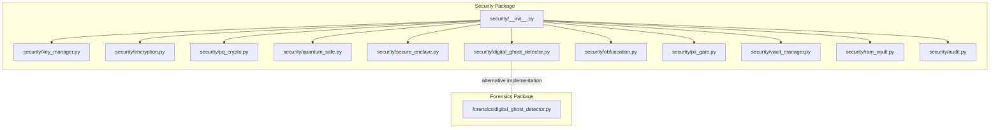

**Diagram sources**
- [security/__init__.py:1-160](file://security/__init__.py#L1-L160)
- [security/key_manager.py:1-175](file://security/key_manager.py#L1-L175)
- [security/encryption.py:1-23](file://security/encryption.py#L1-L23)
- [security/pq_crypto.py:1-263](file://security/pq_crypto.py#L1-L263)
- [security/quantum_safe.py:1-800](file://security/quantum_safe.py#L1-L800)
- [security/secure_enclave.py:1-196](file://security/secure_enclave.py#L1-L196)
- [security/digital_ghost_detector.py:1-547](file://security/digital_ghost_detector.py#L1-L547)
- [forensics/digital_ghost_detector.py:1-405](file://forensics/digital_ghost_detector.py#L1-L405)
- [security/obfuscation.py:1-329](file://security/obfuscation.py#L1-L329)
- [security/pii_gate.py:1-556](file://security/pii_gate.py#L1-L556)
- [security/vault_manager.py:1-368](file://security/vault_manager.py#L1-L368)
- [security/ram_vault.py:1-154](file://security/ram_vault.py#L1-L154)
- [security/audit.py:1-360](file://security/audit.py#L1-L360)

**Section sources**
- [security/__init__.py:1-160](file://security/__init__.py#L1-L160)

## Core Components
- PII Detection and Sanitization: Regex-based detection and masking to prevent accidental exposure of personal data.
- Vault Management: Encrypted export and secure deletion of sensitive artifacts using modern cryptography.
- RAM Disk Vault: In-memory storage for ephemeral sensitive data with automatic lifecycle management.
- Encryption Helpers: AES-GCM encryption/decryption utilities for symmetric confidentiality and integrity.
- Key Management: Master key rotation, bucket key derivation, and memory locking for sensitive buffers.
- Digital Ghost Detection: Multi-method detection of deleted content traces, anomalies, and tampering artifacts.
- Quantum-Safe Cryptography: Hybrid classical and post-quantum signature semantics with neuromorphic crypto engine.
- Post-Quantum Cryptography: Hybrid signature scheme combining ECDSA-P-256 with ML-DSA-65, fail-soft backend selection.
- Secure Enclave Integration: Hardware-backed signing abstraction with canonical batch manifests and fail-soft behavior.
- Audit Logging: Integrity-protected audit trail with HMAC hashing, SQLite persistence, and reporting.

**Section sources**
- [security/pii_gate.py:75-324](file://security/pii_gate.py#L75-L324)
- [security/vault_manager.py:36-368](file://security/vault_manager.py#L36-L368)
- [security/ram_vault.py:9-154](file://security/ram_vault.py#L9-L154)
- [security/encryption.py:6-23](file://security/encryption.py#L6-L23)
- [security/key_manager.py:53-175](file://security/key_manager.py#L53-L175)
- [security/digital_ghost_detector.py:67-547](file://security/digital_ghost_detector.py#L67-L547)
- [forensics/digital_ghost_detector.py:39-405](file://forensics/digital_ghost_detector.py#L39-L405)
- [security/quantum_safe.py:405-800](file://security/quantum_safe.py#L405-L800)
- [security/pq_crypto.py:97-263](file://security/pq_crypto.py#L97-L263)
- [security/secure_enclave.py:66-196](file://security/secure_enclave.py#L66-L196)
- [security/audit.py:115-360](file://security/audit.py#L115-L360)

## Architecture Overview
The security framework integrates multiple layers:
- Data Protection Layer: PII sanitization, encryption, and vaulting.
- Identity and Integrity Layer: Key management, quantum-safe signatures, and secure enclave signing.
- Forensic and Observability Layer: Digital ghost detection and audit logging.
- Operational Layer: RAM disk vaults, obfuscation, and anonymization.

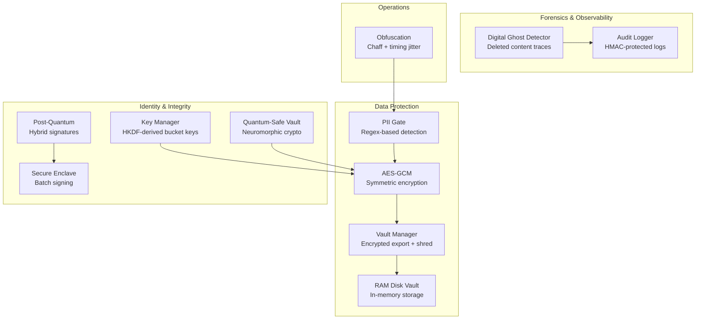

**Diagram sources**
- [security/pii_gate.py:75-324](file://security/pii_gate.py#L75-L324)
- [security/encryption.py:6-23](file://security/encryption.py#L6-L23)
- [security/vault_manager.py:36-368](file://security/vault_manager.py#L36-L368)
- [security/ram_vault.py:9-154](file://security/ram_vault.py#L9-L154)
- [security/key_manager.py:53-175](file://security/key_manager.py#L53-L175)
- [security/pq_crypto.py:97-263](file://security/pq_crypto.py#L97-L263)
- [security/secure_enclave.py:66-196](file://security/secure_enclave.py#L66-L196)
- [security/quantum_safe.py:754-800](file://security/quantum_safe.py#L754-L800)
- [security/digital_ghost_detector.py:67-547](file://security/digital_ghost_detector.py#L67-L547)
- [security/audit.py:115-360](file://security/audit.py#L115-L360)
- [security/obfuscation.py:61-329](file://security/obfuscation.py#L61-L329)

## Detailed Component Analysis

### PII Detection and Sanitization
- Purpose: Detect and mask PII using compiled regex patterns to avoid accidental exposure.
- Implementation highlights:
  - Categories include email, phone, SSN, credit card, IP address, URL, username, date, passport, driver license, and address.
  - Risk scoring based on PII density; masking via configurable character.
  - Fallback sanitizer ensures no raw PII is returned even if main gate fails.
- Complexity: Linear scan with regex per category; deduplication by overlap resolution.

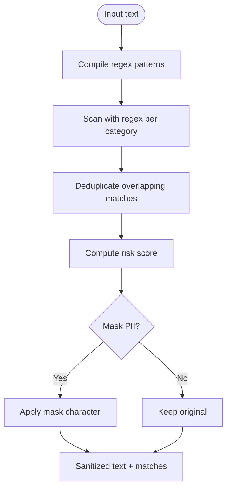

**Diagram sources**
- [security/pii_gate.py:114-324](file://security/pii_gate.py#L114-L324)

**Section sources**
- [security/pii_gate.py:75-324](file://security/pii_gate.py#L75-L324)

### Vault Management and Secure Export
- Purpose: Produce encrypted exports of sensitive artifacts and securely delete originals.
- Implementation highlights:
  - Priority: pyzipper AES (WZ_AES) > cryptography Fernet.
  - PBKDF2-HMAC-SHA256 with 310,000 iterations for key derivation.
  - ZIP creation, encryption, and secure shredding of original directory.
  - Format sniffing for decryption; rejects legacy XOR fallback exports.
- Security invariant: XOR fallback removed; real encryption required.

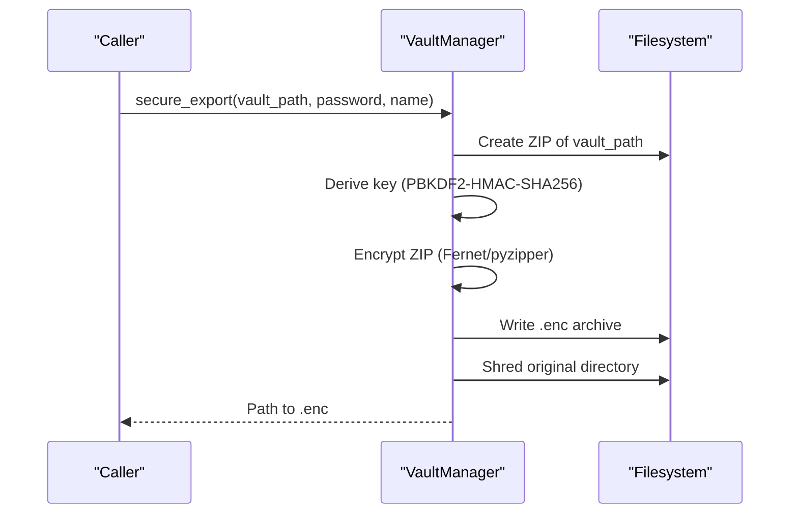

**Diagram sources**
- [security/vault_manager.py:212-254](file://security/vault_manager.py#L212-L254)
- [security/vault_manager.py:117-173](file://security/vault_manager.py#L117-L173)

**Section sources**
- [security/vault_manager.py:36-368](file://security/vault_manager.py#L36-L368)

### RAM Disk Vault
- Purpose: Provide in-memory storage for ephemeral sensitive data with automatic mount/unmount lifecycle.
- Implementation highlights:
  - Uses macOS hdiutil/diskutil to create and format RAM disks.
  - Validates inputs and cleans up on failures or exit.
  - Provides context manager interface for safe usage.

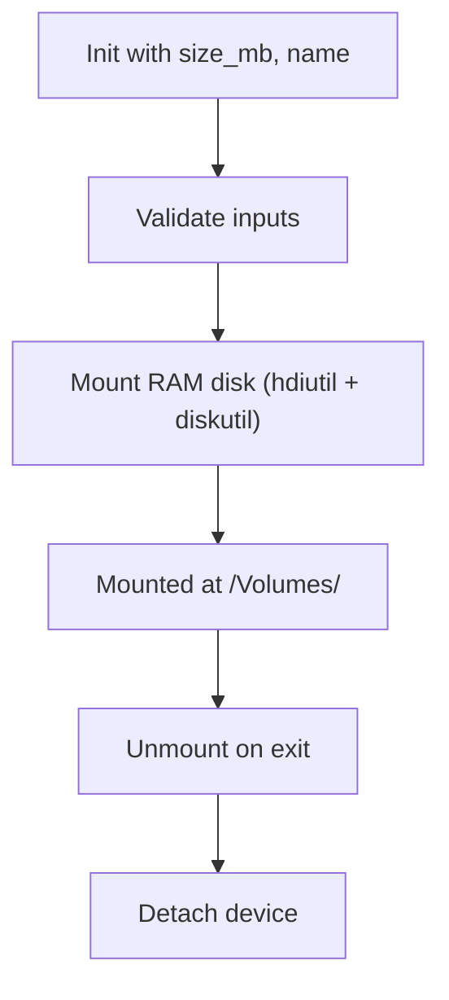

**Diagram sources**
- [security/ram_vault.py:13-154](file://security/ram_vault.py#L13-L154)

**Section sources**
- [security/ram_vault.py:9-154](file://security/ram_vault.py#L9-L154)

### Encryption Helpers (AES-GCM)
- Purpose: Provide authenticated encryption and decryption with associated data support.
- Implementation highlights:
  - Nonce and tag handling; concatenates nonce + tag + ciphertext for transport.
  - Uses cryptography.io primitives.

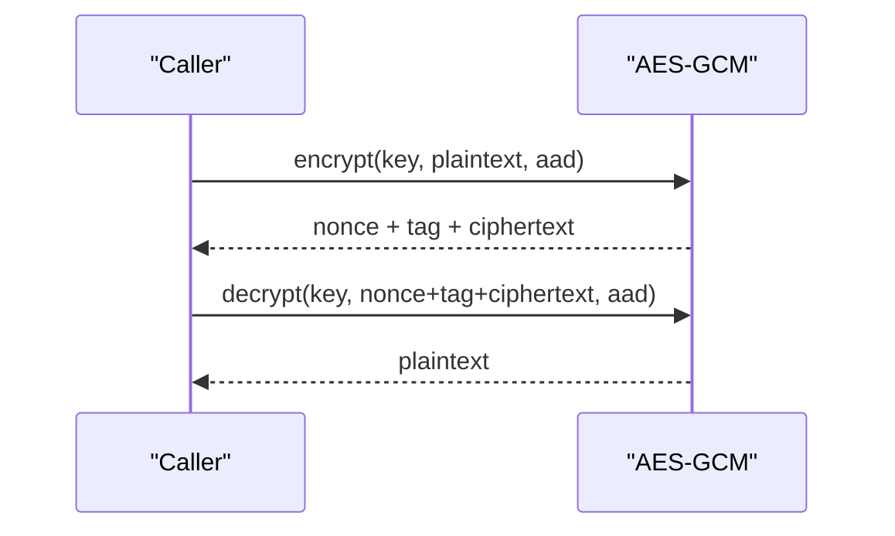

**Diagram sources**
- [security/encryption.py:6-23](file://security/encryption.py#L6-L23)

**Section sources**
- [security/encryption.py:1-23](file://security/encryption.py#L1-L23)

### Key Management
- Purpose: Manage master keys, derive bucket keys, and enforce memory locking for sensitive buffers.
- Implementation highlights:
  - LMDB-backed storage of master keys with versioning.
  - HKDF-SHA256 derivation of bucket keys from master key and salt.
  - mlock for bootstrap-safe memory locking; fail-open behavior.
  - Async operations with thread pool for LMDB transactions.

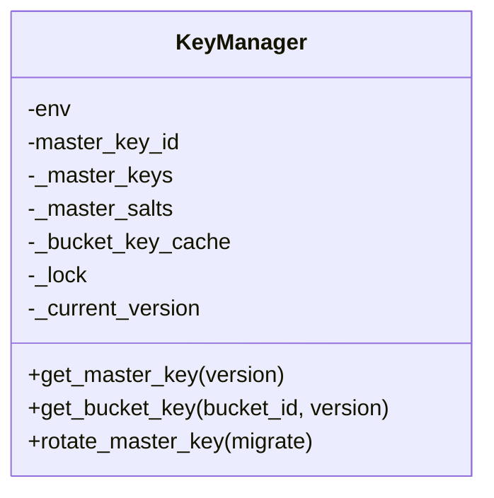

**Diagram sources**
- [security/key_manager.py:53-175](file://security/key_manager.py#L53-L175)

**Section sources**
- [security/key_manager.py:53-175](file://security/key_manager.py#L53-L175)

### Digital Ghost Detection
Two complementary implementations exist:
- Security module: ML-based content prediction, temporal pattern matching, and recovery synthesis.
- Forensics module: Streaming, bounded analysis, and anomaly detection (zlib, entropy, byte patterns).

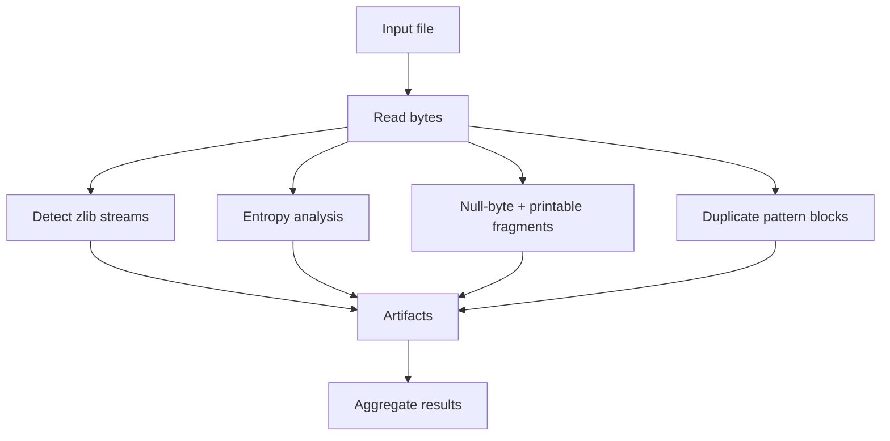

**Diagram sources**
- [forensics/digital_ghost_detector.py:307-367](file://forensics/digital_ghost_detector.py#L307-L367)

**Section sources**
- [security/digital_ghost_detector.py:67-547](file://security/digital_ghost_detector.py#L67-L547)
- [forensics/digital_ghost_detector.py:39-405](file://forensics/digital_ghost_detector.py#L39-L405)

### Quantum-Safe Cryptography and Neuromorphic Engine
- Purpose: Provide quantum-safe signatures and encryption using hybrid classical/post-quantum semantics and neuromorphic crypto.
- Implementation highlights:
  - Hybrid signatures: ECDSA-P-256 primary, ML-DSA-65 optional.
  - Neuromorphic crypto engine: SNN-based encryption/decryption with entropy pooling.
  - Quantum-safe vault supports ML-KEM/ML-DSA and SNN-based operations.

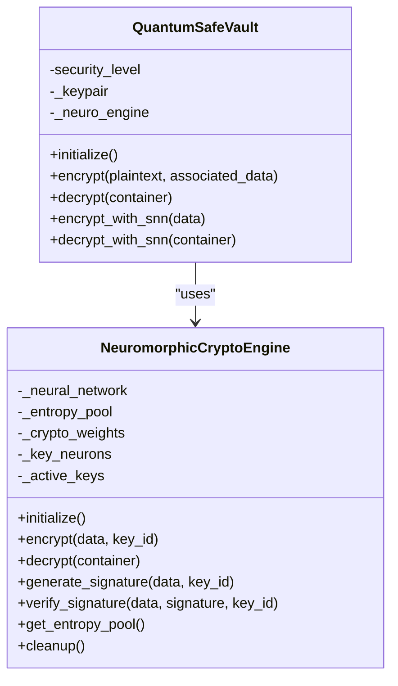

**Diagram sources**
- [security/quantum_safe.py:405-800](file://security/quantum_safe.py#L405-L800)

**Section sources**
- [security/quantum_safe.py:405-800](file://security/quantum_safe.py#L405-L800)

### Post-Quantum Cryptography
- Purpose: Provide hybrid signature semantics with fail-soft backend selection.
- Implementation highlights:
  - Protocols define signing/verification APIs.
  - Null backend for disabled/unavailable environments.
  - Swift-backed backend on macOS 26+ for ML-DSA-65.

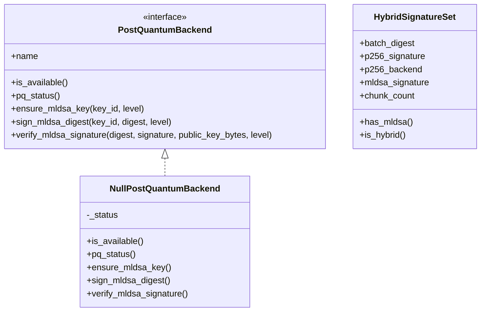

**Diagram sources**
- [security/pq_crypto.py:97-263](file://security/pq_crypto.py#L97-L263)

**Section sources**
- [security/pq_crypto.py:97-263](file://security/pq_crypto.py#L97-L263)

### Secure Enclave Integration
- Purpose: Provide hardware-backed signing with canonical batch manifests and fail-soft behavior.
- Implementation highlights:
  - BatchManifest construction from chunk hashes.
  - Single signature per batch for integrity and provenance.
  - Null backend for disabled/unavailable environments.

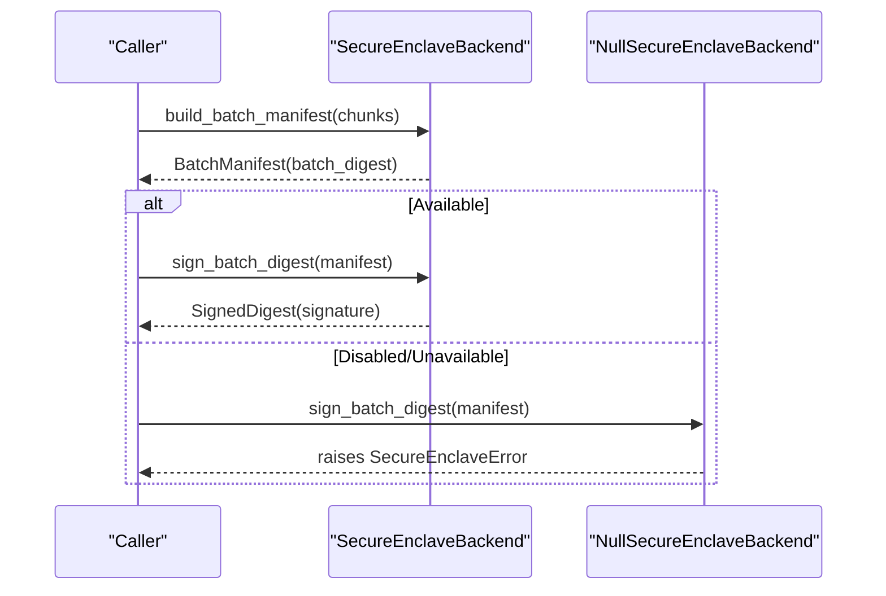

**Diagram sources**
- [security/secure_enclave.py:126-196](file://security/secure_enclave.py#L126-L196)

**Section sources**
- [security/secure_enclave.py:66-196](file://security/secure_enclave.py#L66-L196)

### Audit Logging and Compliance
- Purpose: Maintain integrity-protected audit trails with HMAC hashing and SQLite persistence.
- Implementation highlights:
  - Event hashing with HMAC-SHA256; optional encryption of logs.
  - Query and reporting APIs; retention policies; console/file logging.

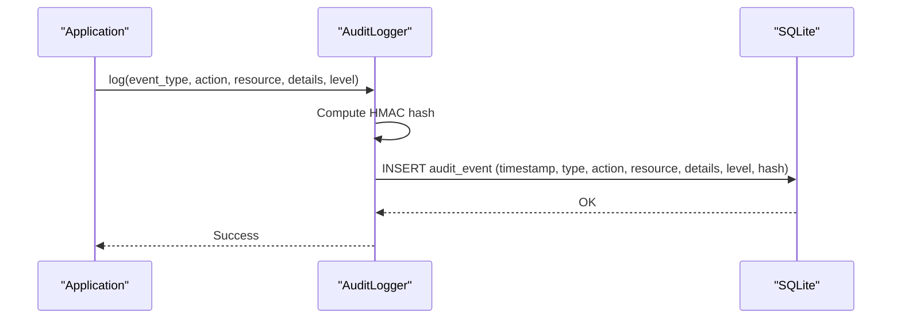

**Diagram sources**
- [security/audit.py:174-246](file://security/audit.py#L174-L246)

**Section sources**
- [security/audit.py:115-360](file://security/audit.py#L115-L360)

### Obfuscation Strategies and Anonymization
- Purpose: Disrupt research patterns, generate plausible deniability, and mask sensitive queries.
- Implementation highlights:
  - Query masking with synonym/generalization.
  - Chaff traffic generation with cover topics.
  - Timing jitter and randomized execution order.

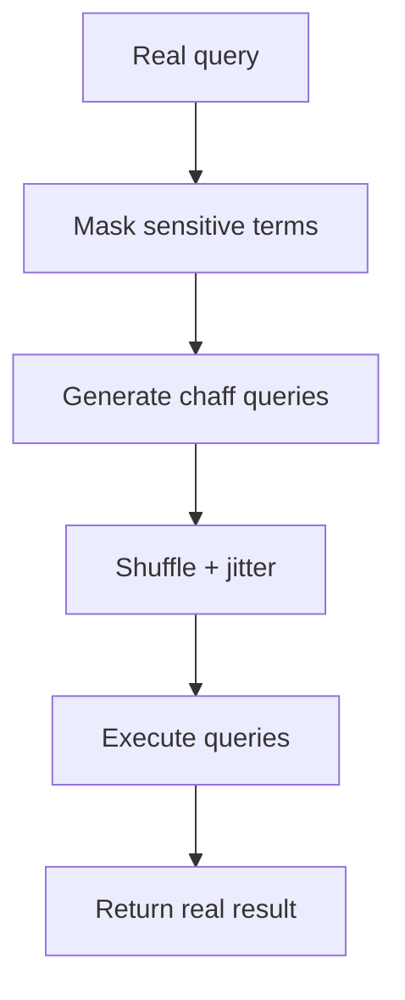

**Diagram sources**
- [security/obfuscation.py:134-329](file://security/obfuscation.py#L134-L329)

**Section sources**
- [security/obfuscation.py:61-329](file://security/obfuscation.py#L61-L329)

## Dependency Analysis
- Internal dependencies:
  - security/__init__.py aggregates all security modules and exposes unified APIs.
  - Vault Manager depends on cryptography and pyzipper for encryption.
  - Key Manager depends on cryptography and LMDB for key storage.
  - Post-Quantum and Secure Enclave modules depend on optional Swift-backed backends.
- External dependencies:
  - cryptography.io for AES-GCM, HKDF, PBKDF2, Fernet.
  - pyzipper for AES-encrypted ZIP archives.
  - sqlite3 for audit logging persistence.

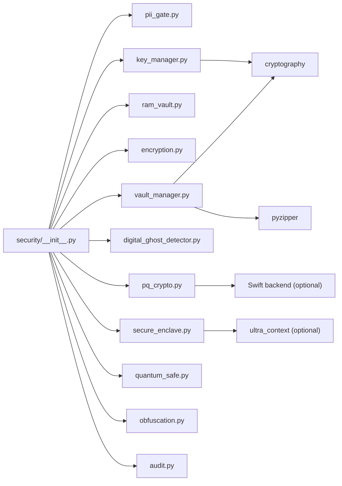

**Diagram sources**
- [security/__init__.py:1-160](file://security/__init__.py#L1-L160)
- [security/vault_manager.py:14-31](file://security/vault_manager.py#L14-L31)
- [security/key_manager.py:9-22](file://security/key_manager.py#L9-L22)
- [security/pq_crypto.py:237-263](file://security/pq_crypto.py#L237-L263)
- [security/secure_enclave.py:170-196](file://security/secure_enclave.py#L170-L196)

**Section sources**
- [security/__init__.py:1-160](file://security/__init__.py#L1-L160)
- [security/vault_manager.py:14-31](file://security/vault_manager.py#L14-L31)
- [security/key_manager.py:9-22](file://security/key_manager.py#L9-L22)
- [security/pq_crypto.py:237-263](file://security/pq_crypto.py#L237-L263)
- [security/secure_enclave.py:170-196](file://security/secure_enclave.py#L170-L196)

## Performance Considerations
- Memory efficiency:
  - PII detection uses regex scanning with bounded lengths to avoid catastrophic backtracking.
  - Forensics digital ghost detection employs streaming and bounded analysis for large files.
  - Key Manager uses LMDB with controlled map sizes and async I/O.
- CPU efficiency:
  - AES-GCM provides authenticated encryption with minimal overhead.
  - HKDF-derived bucket keys reduce repeated KDF computations via caching.
- I/O efficiency:
  - Vault Manager writes temporary ZIPs to a configurable temp directory and cleans up.
  - RAM Disk Vault avoids persistent storage by leveraging in-memory volumes.
- Concurrency:
  - Key Manager and Vault Manager use asyncio locks and thread pools for LMDB operations.

[No sources needed since this section provides general guidance]

## Troubleshooting Guide
- Vault export fails:
  - Ensure either cryptography or pyzipper is installed; XOR fallback is removed.
  - Verify sufficient disk space and permissions for temp directory.
- Decryption errors:
  - Confirm the exported file format (ZIP AES vs Fernet blob) and password correctness.
  - Legacy XOR fallback exports are rejected.
- Key Manager issues:
  - Check LMDB map size and permissions; ensure mlock is permitted by OS.
- Post-Quantum backend unavailable:
  - Verify macOS version and Swift backend availability; expect Null backend behavior.
- Secure Enclave signing errors:
  - Expect SecureEnclaveError when backend is disabled or unavailable; handle gracefully.
- Audit logging failures:
  - Confirm database path write permissions and retention settings.

**Section sources**
- [security/vault_manager.py:67-73](file://security/vault_manager.py#L67-L73)
- [security/vault_manager.py:268-271](file://security/vault_manager.py#L268-L271)
- [security/key_manager.py:28-51](file://security/key_manager.py#L28-L51)
- [security/pq_crypto.py:237-263](file://security/pq_crypto.py#L237-L263)
- [security/secure_enclave.py:104-124](file://security/secure_enclave.py#L104-L124)
- [security/audit.py:144-172](file://security/audit.py#L144-L172)

## Conclusion
Hledac Universal’s security and privacy framework combines robust cryptographic primitives, quantum-safe signature semantics, secure enclave integration, and comprehensive forensics and auditing. It emphasizes fail-soft designs, integrity protection, and operational security for autonomous operation. The modular architecture allows graceful degradation and easy integration of additional backends.

[No sources needed since this section summarizes without analyzing specific files]

## Appendices

### Security Configuration Options
- Vault Manager:
  - Password-based encryption with PBKDF2-HMAC-SHA256 (310,000 iterations).
  - Priority: pyzipper AES > cryptography Fernet.
- Key Manager:
  - HKDF-SHA256 derived bucket keys; mlock for sensitive buffers.
- Audit Logger:
  - HMAC-SHA256 integrity; SQLite persistence; retention days; console/file logging.
- Post-Quantum:
  - Hybrid signatures; fail-soft backend selection; ML-DSA-65 optional.
- Secure Enclave:
  - Canonical batch manifest signing; fail-soft behavior.

**Section sources**
- [security/vault_manager.py:75-103](file://security/vault_manager.py#L75-L103)
- [security/key_manager.py:154-163](file://security/key_manager.py#L154-L163)
- [security/audit.py:104-113](file://security/audit.py#L104-L113)
- [security/pq_crypto.py:208-263](file://security/pq_crypto.py#L208-L263)
- [security/secure_enclave.py:152-196](file://security/secure_enclave.py#L152-L196)

### Threat Modeling and Vulnerability Assessment
- Threats addressed:
  - Data exposure via PII leakage; mitigated by regex-based detection and masking.
  - Data tampering and replay; mitigated by HMAC-protected audit logs and batch signing.
  - Quantum-era attacks; mitigated by hybrid post-quantum signatures and neuromorphic crypto.
  - Incomplete deletion and digital shadows; mitigated by digital ghost detection.
- Assessment procedures:
  - Static analysis of regex patterns and masking logic.
  - Dynamic testing of vault export/decrypt flows and secure deletion.
  - Penetration testing of obfuscation effectiveness against timing and traffic analysis.
  - Audit trail integrity verification using HMAC validation.

[No sources needed since this section provides general guidance]

### Secure Deployment Examples
- Export sensitive artifacts:
  - Use Vault Manager with a strong password; verify .enc file integrity; confirm original directory shredding.
- In-memory processing:
  - Use RAM Disk Vault for ephemeral sensitive data; mount/unmount automatically via context manager.
- Autonomous operation:
  - Enable audit logging with HMAC integrity; configure retention and reporting.
- Quantum resilience:
  - Enable post-quantum backend when available; maintain hybrid signature sets.

**Section sources**
- [security/vault_manager.py:212-254](file://security/vault_manager.py#L212-L254)
- [security/ram_vault.py:145-154](file://security/ram_vault.py#L145-L154)
- [security/audit.py:144-172](file://security/audit.py#L144-L172)
- [security/pq_crypto.py:208-263](file://security/pq_crypto.py#L208-L263)

### Incident Response and Monitoring
- Incident response:
  - Review audit logs for suspicious events; validate HMAC integrity; isolate affected systems.
  - Investigate vault export failures and decryption attempts; revoke compromised keys.
- Security monitoring:
  - Monitor obfuscation effectiveness; track digital ghost detections.
  - Alert on audit events exceeding thresholds; review secure enclave signing failures.

**Section sources**
- [security/audit.py:247-311](file://security/audit.py#L247-L311)
- [security/digital_ghost_detector.py:524-547](file://security/digital_ghost_detector.py#L524-L547)
- [security/obfuscation.py:317-329](file://security/obfuscation.py#L317-L329)

### Compliance Requirements and Best Practices
- Compliance:
  - Audit logs with HMAC integrity support forensic readiness and compliance reporting.
  - Vault exports meet cryptographic standards; XOR fallback removed to enforce real encryption.
- Best practices:
  - Use hybrid post-quantum signatures for future-proof integrity.
  - Apply PII sanitization early in data pipelines.
  - Employ RAM disk vaults for highly sensitive temporary data.
  - Regularly rotate master keys and derive fresh bucket keys.

**Section sources**
- [security/audit.py:104-113](file://security/audit.py#L104-L113)
- [security/vault_manager.py:67-73](file://security/vault_manager.py#L67-L73)
- [security/key_manager.py:165-175](file://security/key_manager.py#L165-L175)