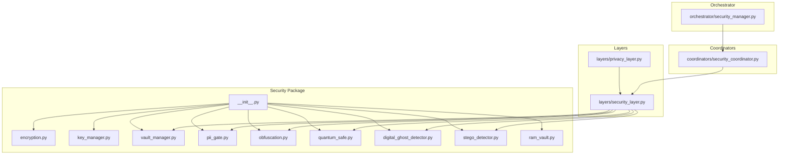
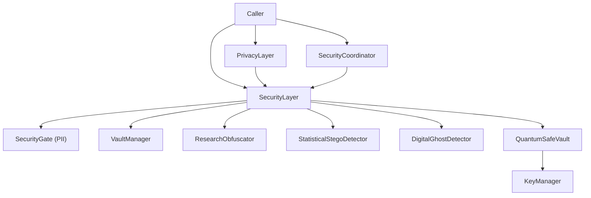
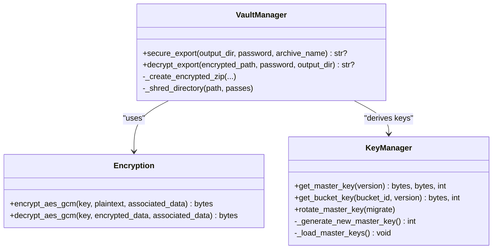
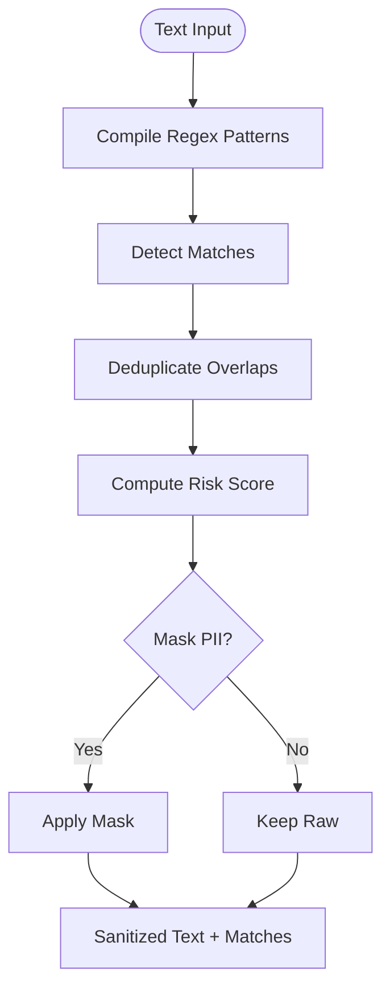
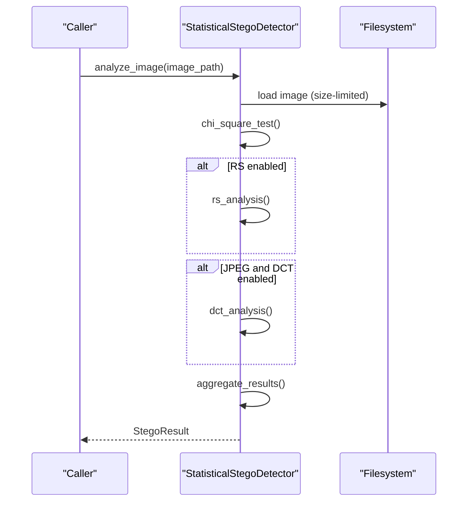
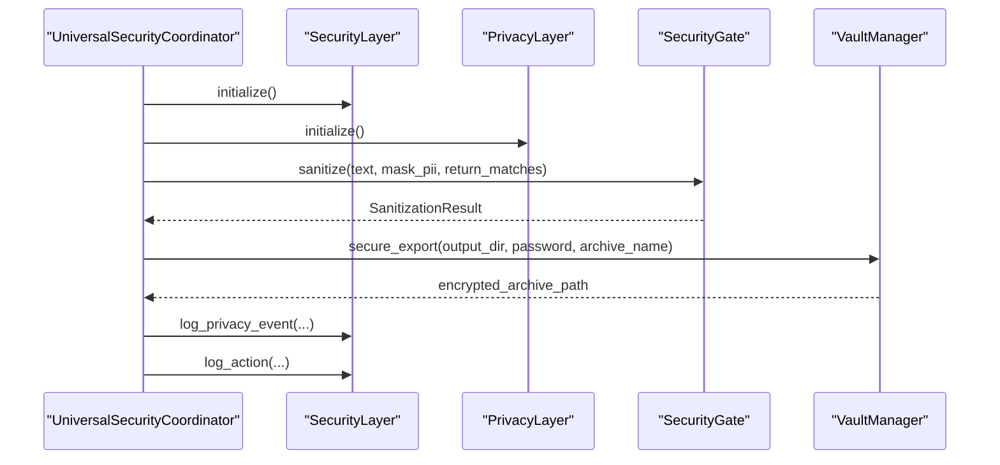
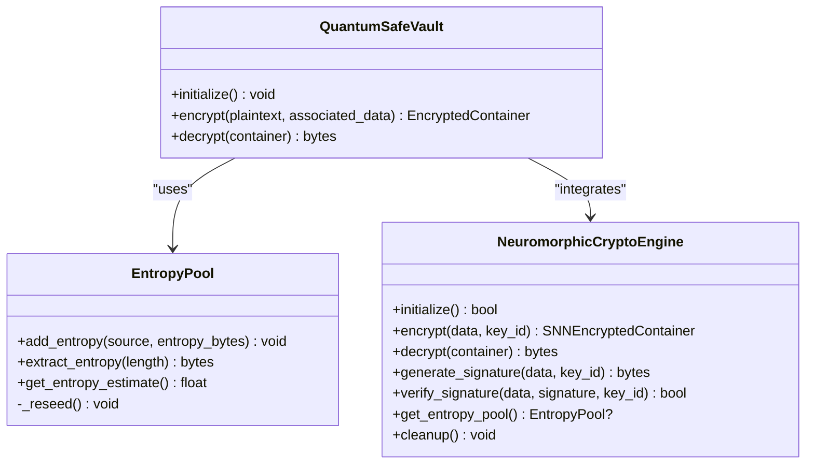
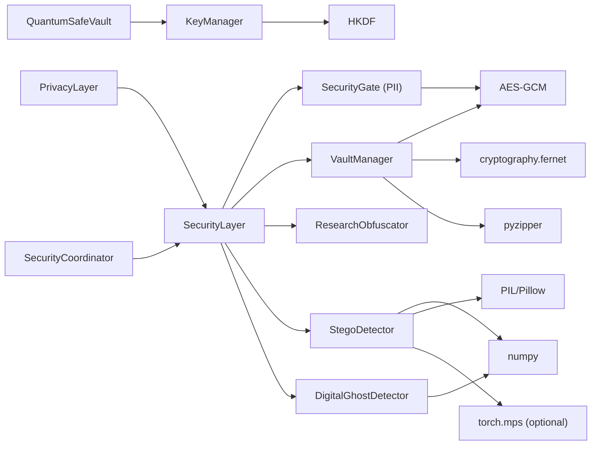

# Security and Privacy

<cite>
**Referenced Files in This Document**
- [security/__init__.py](file://security/__init__.py)
- [security/encryption.py](file://security/encryption.py)
- [security/key_manager.py](file://security/key_manager.py)
- [security/vault_manager.py](file://security/vault_manager.py)
- [security/pii_gate.py](file://security/pii_gate.py)
- [security/obfuscation.py](file://security/obfuscation.py)
- [security/quantum_safe.py](file://security/quantum_safe.py)
- [security/digital_ghost_detector.py](file://security/digital_ghost_detector.py)
- [security/stego_detector.py](file://security/stego_detector.py)
- [security/ram_vault.py](file://security/ram_vault.py)
- [layers/security_layer.py](file://layers/security_layer.py)
- [layers/privacy_layer.py](file://layers/privacy_layer.py)
- [coordinators/security_coordinator.py](file://coordinators/security_coordinator.py)
- [orchestrator/security_manager.py](file://orchestrator/security_manager.py)
</cite>

## Table of Contents
1. [Introduction](#introduction)
2. [Project Structure](#project-structure)
3. [Core Components](#core-components)
4. [Architecture Overview](#architecture-overview)
5. [Detailed Component Analysis](#detailed-component-analysis)
6. [Dependency Analysis](#dependency-analysis)
7. [Performance Considerations](#performance-considerations)
8. [Troubleshooting Guide](#troubleshooting-guide)
9. [Conclusion](#conclusion)

## Introduction
This document describes the Security and Privacy subsystem of the Universal platform. It covers the encryption framework, privacy controls, stealth operations, and security governance. The subsystem integrates:
- Cryptography and key management (AES-GCM, HKDF, quantum-safe primitives)
- PII detection and sanitization
- Steganography detection and digital ghost recovery
- Research obfuscation and secure destruction
- Privacy and security orchestration across layers and coordinators

The goal is to provide a practical, code-backed guide for both newcomers and experienced engineers to understand how security and privacy are implemented, configured, and used.

## Project Structure
The Security and Privacy subsystem is organized around cohesive modules under the security package, with integration points in layers and coordinators:

- security package: cryptography, PII, vaults, steganalysis, stealth, quantum-safe, and auxiliary utilities
- layers: security_layer and privacy_layer integrate security/privacy features into the universal orchestrator
- coordinators: security_coordinator orchestrates multi-layer security operations
- orchestrator: security_manager re-exports the orchestrator’s security facilities

**Diagram sources**
- [security/__init__.py:1-106](file://security/__init__.py#L1-L106)
- [layers/security_layer.py:1-120](file://layers/security_layer.py#L1-L120)
- [layers/privacy_layer.py:1-120](file://layers/privacy_layer.py#L1-L120)
- [coordinators/security_coordinator.py:1-120](file://coordinators/security_coordinator.py#L1-L120)
- [orchestrator/security_manager.py:1-25](file://orchestrator/security_manager.py#L1-L25)

**Section sources**
- [security/__init__.py:1-106](file://security/__init__.py#L1-L106)

## Core Components
This section outlines the primary building blocks of the Security and Privacy subsystem.

- Encryption and Key Management
  - AES-GCM authenticated encryption/decryption
  - Hierarchical key derivation (HKDF) and master key rotation
  - RAM-backed key material with mlock for bootstrap safety
- Vault Management
  - Encrypted export/import of vault contents (ZIP with AES or Fernet)
  - Secure shredding of original directories
- PII Detection and Sanitization
  - Regex-based detection across multiple categories
  - Risk scoring and masking
  - Always-on fallback sanitizer
- Steganalysis and Digital Ghost Recovery
  - Statistical LSB/DCT/RS analysis for images
  - Detection of deleted content traces and reconstruction hints
- Privacy and Security Orchestration
  - SecurityLayer: obfuscation, chaff, secure destruction, audit
  - PrivacyLayer: unified privacy operations with audit delegation
  - SecurityCoordinator: multi-layer orchestration (stealth, threat, crypto, ZKP)
- Quantum-Safe and Neuromorphic Cryptography
  - ML-KEM/ML-DSA-inspired containers and entropy pools
  - SNN-based encryption/signatures with M1 memory optimization

**Section sources**
- [security/encryption.py:1-23](file://security/encryption.py#L1-L23)
- [security/key_manager.py:1-175](file://security/key_manager.py#L1-L175)
- [security/vault_manager.py:1-341](file://security/vault_manager.py#L1-L341)
- [security/pii_gate.py:1-556](file://security/pii_gate.py#L1-L556)
- [security/obfuscation.py:1-329](file://security/obfuscation.py#L1-L329)
- [security/stego_detector.py:1-881](file://security/stego_detector.py#L1-L881)
- [security/digital_ghost_detector.py:1-547](file://security/digital_ghost_detector.py#L1-L547)
- [security/quantum_safe.py:1-1173](file://security/quantum_safe.py#L1-L1173)
- [layers/security_layer.py:1-800](file://layers/security_layer.py#L1-L800)
- [layers/privacy_layer.py:1-548](file://layers/privacy_layer.py#L1-L548)
- [coordinators/security_coordinator.py:1-800](file://coordinators/security_coordinator.py#L1-L800)

## Architecture Overview
The Security and Privacy subsystem follows a layered architecture:
- Data plane: encryption, PII sanitization, steganalysis, secure destruction
- Control plane: orchestrators and layers coordinate operations
- Governance plane: audit logs and compliance reporting

**Diagram sources**
- [layers/security_layer.py:1-200](file://layers/security_layer.py#L1-L200)
- [layers/privacy_layer.py:1-120](file://layers/privacy_layer.py#L1-L120)
- [coordinators/security_coordinator.py:1-120](file://coordinators/security_coordinator.py#L1-L120)
- [security/pii_gate.py:1-120](file://security/pii_gate.py#L1-L120)
- [security/vault_manager.py:1-120](file://security/vault_manager.py#L1-L120)
- [security/obfuscation.py:1-120](file://security/obfuscation.py#L1-L120)
- [security/stego_detector.py:1-120](file://security/stego_detector.py#L1-L120)
- [security/digital_ghost_detector.py:1-120](file://security/digital_ghost_detector.py#L1-L120)
- [security/quantum_safe.py:1-120](file://security/quantum_safe.py#L1-L120)
- [security/key_manager.py:1-120](file://security/key_manager.py#L1-L120)

## Detailed Component Analysis

### Encryption and Key Management
- AES-GCM encryption/decryption with associated data authentication
- HKDF-based bucket key derivation from master keys
- Master key rotation with versioning and caching
- Bootstrap-safe mlock for key material

**Diagram sources**
- [security/key_manager.py:53-175](file://security/key_manager.py#L53-L175)
- [security/vault_manager.py:36-341](file://security/vault_manager.py#L36-L341)
- [security/encryption.py:6-23](file://security/encryption.py#L6-L23)

**Section sources**
- [security/encryption.py:1-23](file://security/encryption.py#L1-L23)
- [security/key_manager.py:1-175](file://security/key_manager.py#L1-L175)
- [security/vault_manager.py:1-341](file://security/vault_manager.py#L1-L341)

### PII Detection and Sanitization
- Regex-based detection across multiple categories
- Risk scoring and masking with configurable thresholds
- Always-on fallback sanitizer for degraded environments

**Diagram sources**
- [security/pii_gate.py:114-324](file://security/pii_gate.py#L114-L324)

**Section sources**
- [security/pii_gate.py:1-556](file://security/pii_gate.py#L1-L556)

### Steganalysis and Digital Ghost Recovery
- Statistical LSB/DCT/RS analysis for images
- Detection of deleted content traces and reconstruction hints
- Memory-conscious streaming analysis with MPS/NumPy acceleration

**Diagram sources**
- [security/stego_detector.py:358-427](file://security/stego_detector.py#L358-L427)
- [security/digital_ghost_detector.py:123-192](file://security/digital_ghost_detector.py#L123-L192)

**Section sources**
- [security/stego_detector.py:1-881](file://security/stego_detector.py#L1-L881)
- [security/digital_ghost_detector.py:1-547](file://security/digital_ghost_detector.py#L1-L547)

### Privacy and Security Orchestration
- SecurityLayer: unified obfuscation, chaff, secure destruction, and audit
- PrivacyLayer: privacy operations with audit delegation to SecurityLayer
- SecurityCoordinator: multi-layer orchestration across stealth, threat, crypto, and ZKP

**Diagram sources**
- [coordinators/security_coordinator.py:231-290](file://coordinators/security_coordinator.py#L231-L290)
- [layers/security_layer.py:217-280](file://layers/security_layer.py#L217-L280)
- [layers/privacy_layer.py:288-345](file://layers/privacy_layer.py#L288-L345)
- [security/pii_gate.py:150-214](file://security/pii_gate.py#L150-L214)
- [security/vault_manager.py:212-253](file://security/vault_manager.py#L212-L253)

**Section sources**
- [layers/security_layer.py:1-800](file://layers/security_layer.py#L1-L800)
- [layers/privacy_layer.py:1-548](file://layers/privacy_layer.py#L1-L548)
- [coordinators/security_coordinator.py:1-800](file://coordinators/security_coordinator.py#L1-L800)

### Quantum-Safe and Neuromorphic Cryptography
- ML-KEM/ML-DSA-inspired containers and entropy pools
- SNN-based encryption/signatures with M1 memory optimization

**Diagram sources**
- [security/quantum_safe.py:405-684](file://security/quantum_safe.py#L405-L684)
- [security/quantum_safe.py:46-133](file://security/quantum_safe.py#L46-L133)

**Section sources**
- [security/quantum_safe.py:1-1173](file://security/quantum_safe.py#L1-L1173)

## Dependency Analysis
Security and privacy components depend on each other and on external libraries. The following diagram highlights key dependencies:

**Diagram sources**
- [security/pii_gate.py:1-120](file://security/pii_gate.py#L1-L120)
- [security/vault_manager.py:1-120](file://security/vault_manager.py#L1-L120)
- [security/key_manager.py:1-120](file://security/key_manager.py#L1-L120)
- [security/quantum_safe.py:1-120](file://security/quantum_safe.py#L1-L120)
- [security/stego_detector.py:1-120](file://security/stego_detector.py#L1-L120)
- [security/digital_ghost_detector.py:1-120](file://security/digital_ghost_detector.py#L1-L120)
- [layers/security_layer.py:1-120](file://layers/security_layer.py#L1-L120)
- [layers/privacy_layer.py:1-120](file://layers/privacy_layer.py#L1-L120)
- [coordinators/security_coordinator.py:1-120](file://coordinators/security_coordinator.py#L1-L120)

**Section sources**
- [security/__init__.py:1-106](file://security/__init__.py#L1-L106)

## Performance Considerations
- Memory constraints on M1 8GB:
  - Steganalysis uses streaming mode and size limits to avoid OOM
  - MPS acceleration is optional and checked lazily
  - Entropy pools and SNN engines are cleaned up aggressively
- Cryptographic operations:
  - AES-GCM authenticated encryption/decryption
  - PBKDF2-HMAC-SHA256 with high iteration counts for vault passwords
- Operational hygiene:
  - Secure shredding of vault originals
  - Lazy initialization of heavy components (SNN, stego detector)

[No sources needed since this section provides general guidance]

## Troubleshooting Guide
Common issues and resolutions:
- Missing cryptography/pyzipper backends for vault export
  - Symptom: RuntimeError indicating missing real encryption
  - Resolution: Install required packages or use compatible alternatives
- Steganalysis failures on unsupported hardware
  - Symptom: MPS detection fails, falls back to CPU
  - Resolution: Ensure MPS availability or rely on CPU path
- PII sanitizer fallback not applied
  - Symptom: Unexpected raw PII in output
  - Resolution: Verify fallback sanitizer is invoked when main gate unavailable
- Vault export fails during ZIP creation
  - Symptom: Failure to create encrypted ZIP
  - Resolution: Check permissions, available disk space, and backend availability
- Secure destruction not removing files
  - Symptom: File persists after destruction
  - Resolution: Confirm passes and verification settings; ensure OS-level permissions allow deletion

**Section sources**
- [security/vault_manager.py:64-126](file://security/vault_manager.py#L64-L126)
- [security/stego_detector.py:340-357](file://security/stego_detector.py#L340-L357)
- [security/pii_gate.py:375-556](file://security/pii_gate.py#L375-L556)
- [layers/security_layer.py:545-635](file://layers/security_layer.py#L545-L635)

## Conclusion
The Security and Privacy subsystem provides a robust, layered approach to protecting sensitive research data and operations. It combines modern cryptography, privacy-preserving detection, stealth mechanisms, and governance through audits. The modular design allows components to be selectively enabled and tuned for performance and compliance needs.