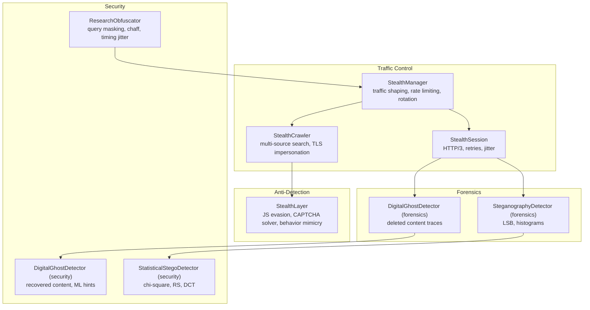
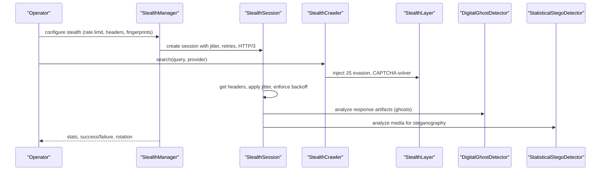
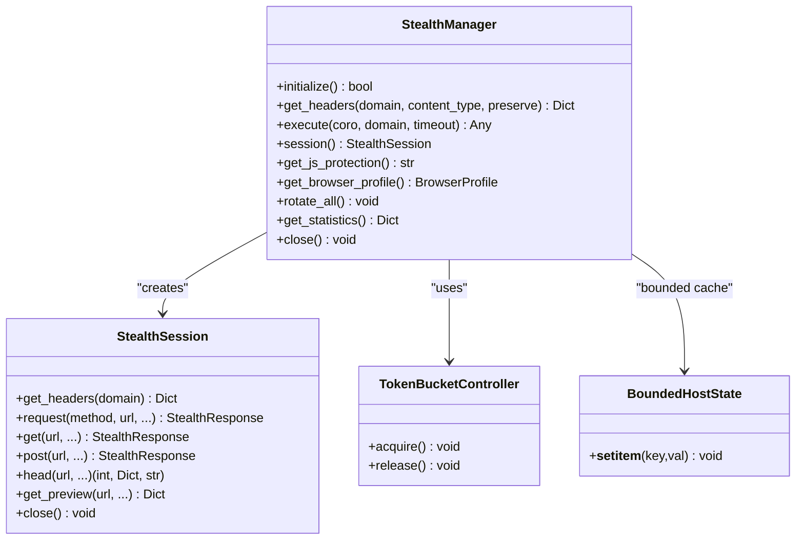
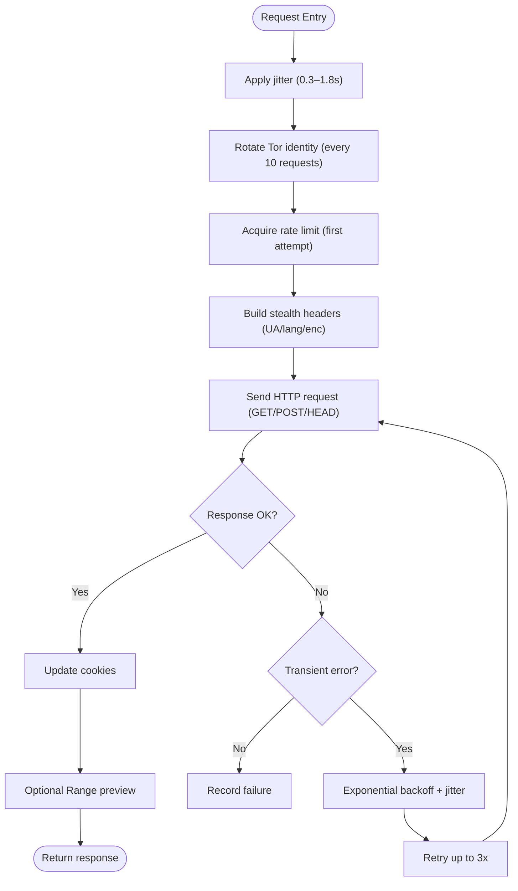
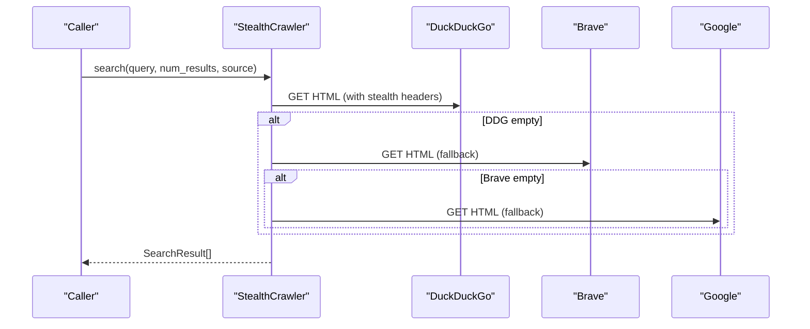
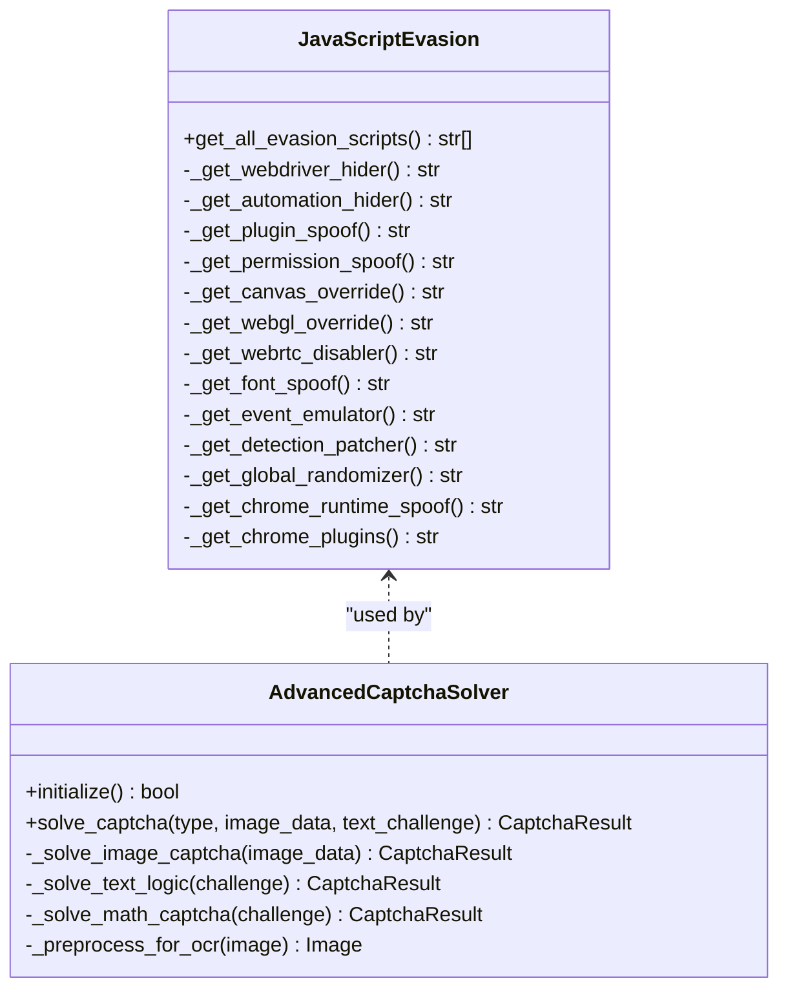
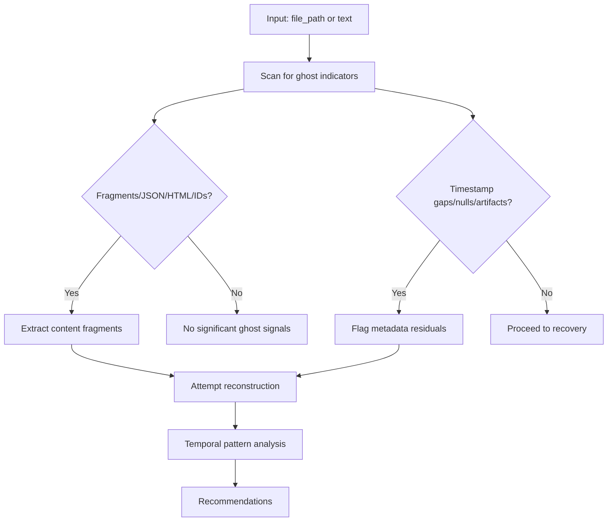
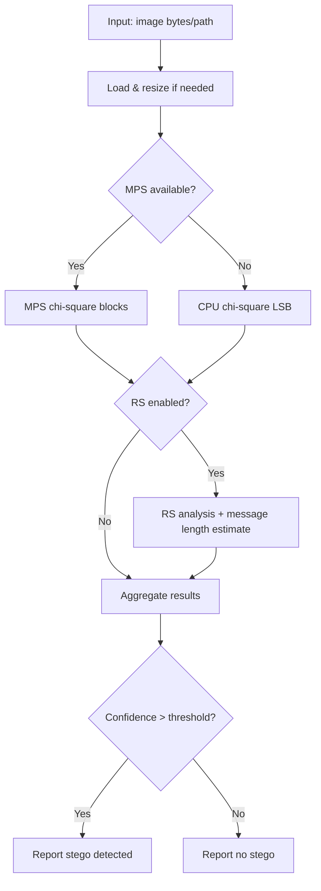
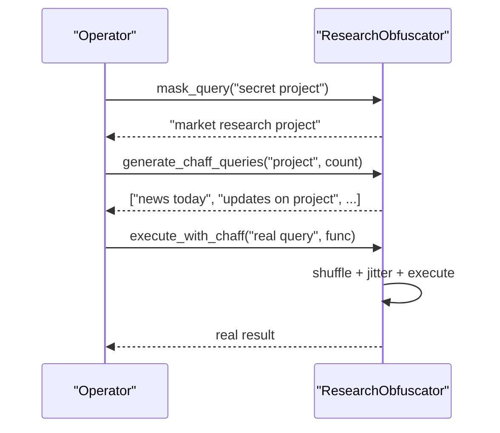
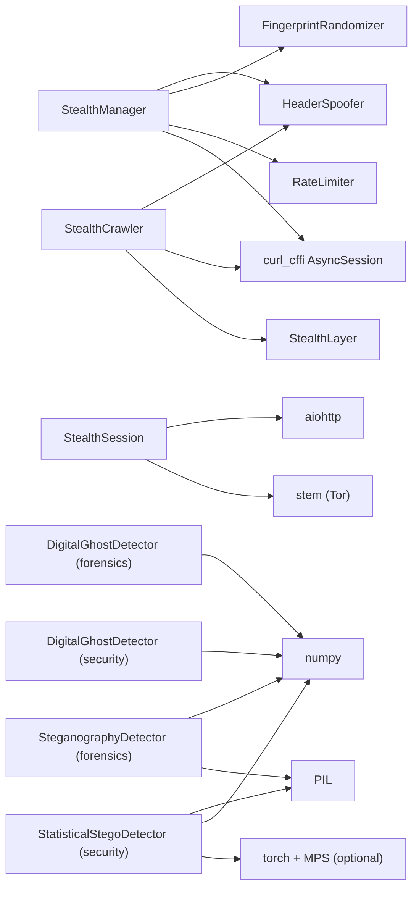

# Stealth Operations

<cite>
**Referenced Files in This Document**
- [stealth_manager.py](file://stealth/stealth_manager.py)
- [stealth_session.py](file://stealth/stealth_session.py)
- [stealth_crawler.py](file://intelligence/stealth_crawler.py)
- [stealth_layer.py](file://layers/stealth_layer.py)
- [digital_ghost_detector.py](file://forensics/digital_ghost_detector.py)
- [digital_ghost_detector.py](file://security/digital_ghost_detector.py)
- [steganography_detector.py](file://forensics/steganography_detector.py)
- [stego_detector.py](file://security/stego_detector.py)
- [obfuscation.py](file://security/obfuscation.py)
</cite>

## Table of Contents
1. [Introduction](#introduction)
2. [Project Structure](#project-structure)
3. [Core Components](#core-components)
4. [Architecture Overview](#architecture-overview)
5. [Detailed Component Analysis](#detailed-component-analysis)
6. [Dependency Analysis](#dependency-analysis)
7. [Performance Considerations](#performance-considerations)
8. [Troubleshooting Guide](#troubleshooting-guide)
9. [Conclusion](#conclusion)
10. [Appendices](#appendices)

## Introduction
This document explains the stealth and anti-detection capabilities implemented across the codebase. It covers traffic obfuscation, digital ghost detection, steganography analysis, network-level anonymity, request pattern camouflage, and behavioral mimicry. It also documents evasion strategies, detection avoidance mechanisms, and operational security measures, with practical examples of stealth routing, traffic shaping, and anomaly detection bypass. The goal is to help operators balance operational effectiveness with security posture.

## Project Structure
The stealth system spans several modules:
- Traffic and session control: stealth_manager, stealth_session, stealth_crawler
- Anti-detection and behavior: stealth_layer
- Forensic and detection: digital ghost detectors, steganography detectors
- Operational obfuscation: security obfuscation

**Diagram sources**
- [stealth_manager.py:85-337](file://stealth/stealth_manager.py#L85-L337)
- [stealth_session.py:55-153](file://stealth/stealth_session.py#L55-L153)
- [stealth_crawler.py:665-800](file://intelligence/stealth_crawler.py#L665-L800)
- [stealth_layer.py:1-200](file://layers/stealth_layer.py#L1-L200)
- [digital_ghost_detector.py:1-120](file://forensics/digital_ghost_detector.py#L1-L120)
- [digital_ghost_detector.py:67-192](file://security/digital_ghost_detector.py#L67-L192)
- [steganography_detector.py:1-120](file://forensics/steganography_detector.py#L1-L120)
- [stego_detector.py:164-210](file://security/stego_detector.py#L164-L210)
- [obfuscation.py:61-136](file://security/obfuscation.py#L61-L136)

**Section sources**
- [stealth_manager.py:85-337](file://stealth/stealth_manager.py#L85-L337)
- [stealth_session.py:55-153](file://stealth/stealth_session.py#L55-L153)
- [stealth_crawler.py:665-800](file://intelligence/stealth_crawler.py#L665-L800)
- [stealth_layer.py:1-200](file://layers/stealth_layer.py#L1-L200)
- [digital_ghost_detector.py:1-120](file://forensics/digital_ghost_detector.py#L1-L120)
- [digital_ghost_detector.py:67-192](file://security/digital_ghost_detector.py#L67-L192)
- [steganography_detector.py:1-120](file://forensics/steganography_detector.py#L1-L120)
- [stego_detector.py:164-210](file://security/stego_detector.py#L164-L210)
- [obfuscation.py:61-136](file://security/obfuscation.py#L61-L136)

## Core Components
- StealthManager: central orchestrator integrating rate limiting, header rotation, browser fingerprint randomization, and per-profile sessions. It enforces retry/backoff, HTTP/3 detection, and Tor identity rotation.
- StealthSession: HTTP client with streaming reads, bounded previews, jitter, and cookie persistence. Includes HTTP/3 detection and optional aioquic usage.
- StealthCrawler: multi-source search with stealth headers, TLS impersonation, and fallback providers.
- StealthLayer: JS evasion scripts, CAPTCHA solver, behavior mimicry, and process masquerading.
- DigitalGhostDetector (forensics/security): detects deleted content traces, metadata residuals, and recovers fragments; supports both file and text analysis.
- SteganographyDetector (forensics/security): statistical analysis for LSB, histograms, and DCT anomalies; includes MPS/CPU acceleration.
- ResearchObfuscator: query masking, chaff traffic generation, timing jitter, and plausible deniability.

**Section sources**
- [stealth_manager.py:85-337](file://stealth/stealth_manager.py#L85-L337)
- [stealth_session.py:55-153](file://stealth/stealth_session.py#L55-L153)
- [stealth_crawler.py:665-800](file://intelligence/stealth_crawler.py#L665-L800)
- [stealth_layer.py:1-200](file://layers/stealth_layer.py#L1-L200)
- [digital_ghost_detector.py:1-120](file://forensics/digital_ghost_detector.py#L1-L120)
- [digital_ghost_detector.py:67-192](file://security/digital_ghost_detector.py#L67-L192)
- [steganography_detector.py:1-120](file://forensics/steganography_detector.py#L1-L120)
- [stego_detector.py:164-210](file://security/stego_detector.py#L164-L210)
- [obfuscation.py:61-136](file://security/obfuscation.py#L61-L136)

## Architecture Overview
The system layers stealth controls at the transport/session level, augments with anti-detection at the browser/behavior level, and applies forensic analysis to detect traces and anomalies. Operational obfuscation masks intent and spreads suspicious activity.

**Diagram sources**
- [stealth_manager.py:196-260](file://stealth/stealth_manager.py#L196-L260)
- [stealth_session.py:520-702](file://stealth/stealth_session.py#L520-L702)
- [stealth_crawler.py:711-761](file://intelligence/stealth_crawler.py#L711-L761)
- [stealth_layer.py:482-567](file://layers/stealth_layer.py#L482-L567)
- [digital_ghost_detector.py:307-367](file://forensics/digital_ghost_detector.py#L307-L367)
- [stego_detector.py:358-427](file://security/stego_detector.py#L358-L427)

## Detailed Component Analysis

### StealthManager: Traffic Obfuscation and Session Control
- Rate limiting: token bucket with per-domain state and backoff on failure.
- Header rotation: dynamic UA/language/encoding with preservation of cookies/auth.
- Browser fingerprint randomization: integrates with stealth_layer profiles.
- Per-profile sessions: LRU cache of curl_cffi sessions with automatic rotation.
- HTTP/3 detection and fallback: HEAD-based detection, optional aioquic usage.
- Tor identity rotation: periodic NEWNYM signaling via stem.
- Retry/backoff: exponential with jitter and transient error classification.

**Diagram sources**
- [stealth_manager.py:85-337](file://stealth/stealth_manager.py#L85-L337)
- [stealth_manager.py:367-703](file://stealth/stealth_manager.py#L367-L703)
- [stealth_manager.py:959-984](file://stealth/stealth_manager.py#L959-L984)
- [stealth_manager.py:933-944](file://stealth/stealth_manager.py#L933-L944)

**Section sources**
- [stealth_manager.py:85-337](file://stealth/stealth_manager.py#L85-L337)
- [stealth_manager.py:367-703](file://stealth/stealth_manager.py#L367-L703)
- [stealth_manager.py:959-984](file://stealth/stealth_manager.py#L959-L984)
- [stealth_manager.py:933-944](file://stealth/stealth_manager.py#L933-L944)

### StealthSession: Request Pattern Camouflage and Memory Safety
- Streaming reads with hard limits to constrain RAM usage.
- Jitter applied before each request to break temporal correlation.
- HTTP/3 detection via Alt-Svc header caching; optional HTTP/3 via aioquic.
- Cookie persistence across requests; robust retry/backoff with transient error detection.
- Range-based preview retrieval for safe content inspection.

**Diagram sources**
- [stealth_session.py:520-702](file://stealth/stealth_session.py#L520-L702)
- [stealth_session.py:885-919](file://stealth/stealth_session.py#L885-L919)

**Section sources**
- [stealth_session.py:520-702](file://stealth/stealth_session.py#L520-L702)
- [stealth_session.py:885-919](file://stealth/stealth_session.py#L885-L919)

### StealthCrawler: Multi-Provider Search with TLS Impersonation
- Multi-source fallback: DuckDuckGo → Brave → Google.
- TLS fingerprinting via curl_cffi impersonation profiles.
- HeaderSpoofer integration for realistic request headers.
- Zero memory leak design with streaming and minimal state.

**Diagram sources**
- [stealth_crawler.py:711-761](file://intelligence/stealth_crawler.py#L711-L761)

**Section sources**
- [stealth_crawler.py:665-800](file://intelligence/stealth_crawler.py#L665-L800)

### StealthLayer: Behavioral Mimicry and Detection Evasion
- JavaScript evasion scripts: hide webdriver, spoof plugins, permissions, canvas/WebGL, fonts, and Chrome runtime.
- CAPTCHA solver: OCR-based (transformers/tesseract) and logic-based solvers; lightweight for M1.
- Behavior simulation: human-like motion and timing; process masquerading.

**Diagram sources**
- [stealth_layer.py:482-567](file://layers/stealth_layer.py#L482-L567)
- [stealth_layer.py:71-453](file://layers/stealth_layer.py#L71-L453)

**Section sources**
- [stealth_layer.py:482-567](file://layers/stealth_layer.py#L482-L567)
- [stealth_layer.py:71-453](file://layers/stealth_layer.py#L71-L453)

### Digital Ghost Detection: Forensics and Recovery
Two complementary detectors:
- Forensics detector: file-based analysis for deleted content, hidden data, tampering, and metadata ghosts.
- Security detector: ML-based content prediction, temporal pattern matching, and recovered content synthesis.

**Diagram sources**
- [digital_ghost_detector.py:307-367](file://forensics/digital_ghost_detector.py#L307-L367)
- [digital_ghost_detector.py:235-310](file://security/digital_ghost_detector.py#L235-L310)

**Section sources**
- [digital_ghost_detector.py:1-120](file://forensics/digital_ghost_detector.py#L1-L120)
- [digital_ghost_detector.py:307-367](file://forensics/digital_ghost_detector.py#L307-L367)
- [digital_ghost_detector.py:67-192](file://security/digital_ghost_detector.py#L67-L192)
- [digital_ghost_detector.py:235-310](file://security/digital_ghost_detector.py#L235-L310)

### Steganography Analysis: Statistical Methods
- Forensics detector: chi-square LSB, histogram analysis, stegdetect wrapper.
- Security detector: chi-square, RS (Regular-Singular), DCT analysis; MPS/CPU acceleration.

**Diagram sources**
- [steganography_detector.py:182-215](file://forensics/steganography_detector.py#L182-L215)
- [stego_detector.py:219-338](file://security/stego_detector.py#L219-L338)
- [stego_detector.py:358-427](file://security/stego_detector.py#L358-L427)

**Section sources**
- [steganography_detector.py:1-120](file://forensics/steganography_detector.py#L1-L120)
- [steganography_detector.py:182-215](file://forensics/steganography_detector.py#L182-L215)
- [stego_detector.py:164-210](file://security/stego_detector.py#L164-L210)
- [stego_detector.py:219-338](file://security/stego_detector.py#L219-L338)
- [stego_detector.py:358-427](file://security/stego_detector.py#L358-L427)

### Operational Obfuscation: Query Masking and Chaff Traffic
- Query masking: replace sensitive terms with benign synonyms/generalizations.
- Chaff traffic: generate random and related queries to dilute intent.
- Timing jitter: random delays to disrupt timing correlation.
- Plausible deniability: cover topics to mask true intent.

**Diagram sources**
- [obfuscation.py:134-168](file://security/obfuscation.py#L134-L168)
- [obfuscation.py:181-245](file://security/obfuscation.py#L181-L245)
- [obfuscation.py:247-299](file://security/obfuscation.py#L247-L299)

**Section sources**
- [obfuscation.py:61-136](file://security/obfuscation.py#L61-L136)
- [obfuscation.py:134-168](file://security/obfuscation.py#L134-L168)
- [obfuscation.py:181-245](file://security/obfuscation.py#L181-L245)
- [obfuscation.py:247-299](file://security/obfuscation.py#L247-L299)

## Dependency Analysis
- StealthManager depends on:
  - RateLimiter (external) for token bucket control
  - HeaderSpoofer (local) for dynamic headers
  - FingerprintRandomizer (local) for browser profiles
  - curl_cffi AsyncSession for per-profile sessions
- StealthSession depends on:
  - aiohttp for HTTP/3 detection and requests
  - stem for Tor identity rotation
- StealthCrawler depends on:
  - curl_cffi for TLS impersonation
  - HeaderSpoofer for stealth headers
  - stealth_layer for evasion and CAPTCHA solving
- Forensics detectors depend on:
  - Filesystem IO and regex for pattern matching
  - numpy for statistical analysis
  - PIL for image processing
- Security detectors depend on:
  - PIL for image IO
  - numpy and optional torch/MPS for acceleration

**Diagram sources**
- [stealth_manager.py:41-43](file://stealth/stealth_manager.py#L41-L43)
- [stealth_session.py:449-469](file://stealth/stealth_session.py#L449-L469)
- [stealth_crawler.py:44-49](file://intelligence/stealth_crawler.py#L44-L49)
- [stealth_layer.py:1-200](file://layers/stealth_layer.py#L1-L200)
- [digital_ghost_detector.py:1-120](file://forensics/digital_ghost_detector.py#L1-L120)
- [stego_detector.py:164-210](file://security/stego_detector.py#L164-L210)

**Section sources**
- [stealth_manager.py:41-43](file://stealth/stealth_manager.py#L41-L43)
- [stealth_session.py:449-469](file://stealth/stealth_session.py#L449-L469)
- [stealth_crawler.py:44-49](file://intelligence/stealth_crawler.py#L44-L49)
- [stealth_layer.py:1-200](file://layers/stealth_layer.py#L1-L200)
- [digital_ghost_detector.py:1-120](file://forensics/digital_ghost_detector.py#L1-L120)
- [stego_detector.py:164-210](file://security/stego_detector.py#L164-L210)

## Performance Considerations
- Memory constraints:
  - Streaming reads with bounded max_bytes to avoid large allocations.
  - Image analysis capped at 2048×2048; MPS/CPU fallback.
  - M1-optimized preprocessing and garbage collection.
- Concurrency and backpressure:
  - Token bucket controller for per-domain concurrency.
  - Bounded host state with LRU eviction for per-host telemetry.
- Network resilience:
  - HTTP/3 detection and fallback; exponential backoff with jitter.
  - Retry-after and transient error classification.
- CPU/MPS acceleration:
  - Lazy MPS availability checks; thread pools for heavy ops.

[No sources needed since this section provides general guidance]

## Troubleshooting Guide
- Rate limit exceeded:
  - Reduce burst rate or increase capacity; inspect domain stats.
- Tor rotation failures:
  - Verify local control port and authentication; ensure cookie or hashed password configured.
- HTTP/3 detection issues:
  - Confirm Alt-Svc header presence; fallback to standard HTTP/2/1.1.
- Steganography false positives:
  - Lower thresholds or combine multiple methods; validate with external tools.
- Digital ghost false positives:
  - Increase confidence thresholds; cross-reference with temporal patterns.
- CAPTCHA solver failures:
  - Switch OCR backend; adjust preprocessing; reduce image size.

**Section sources**
- [stealth_manager.py:885-919](file://stealth/stealth_manager.py#L885-L919)
- [stealth_session.py:388-414](file://stealth/stealth_session.py#L388-L414)
- [stego_detector.py:340-357](file://security/stego_detector.py#L340-L357)
- [digital_ghost_detector.py:114-122](file://security/digital_ghost_detector.py#L114-L122)

## Conclusion
The system combines layered stealth controls—traffic shaping, header rotation, fingerprint randomization, and behavioral mimicry—with robust anti-detection and forensic capabilities. Operators can balance effectiveness and security posture by tuning jitter, rotation intervals, and detection thresholds, while leveraging chaff traffic and query masking to obscure intent.

[No sources needed since this section summarizes without analyzing specific files]

## Appendices

### Practical Examples Index
- Stealth routing:
  - Configure StealthManager with per-profile sessions and rotation interval.
  - Use StealthSession.get_headers() and request() with jitter and retries.
- Traffic shaping:
  - Adjust RateLimitConfig base_rate and capacity; monitor domain stats.
- Anomaly detection bypass:
  - Inject JavaScript evasion scripts; rotate Tor identity periodically.
- Digital ghost recovery:
  - Run analyze_file_ghosts() on suspicious files; review recovered content.
- Steganography detection:
  - Use StatisticalStegoDetector.analyze_image(); combine chi-square, RS, and DCT.

[No sources needed since this section indexes without analyzing specific files]