# Threat Intelligence Automation

<cite>
**Referenced Files in This Document**
- [threat-intelligence-automation.py](file://security/automation/threat-intelligence-automation.py)
- [passive_dns.py](file://security/passive_dns.py)
- [attribution_scorer.py](file://intelligence/attribution_scorer.py)
- [workflow_orchestrator.py](file://intelligence/workflow_orchestrator.py)
- [ti_feed_adapter.py](file://intelligence/ti_feed_adapter.py)
- [security_coordinator.py](file://coordinators/security_coordinator.py)
</cite>

## Table of Contents
1. [Introduction](#introduction)
2. [System Architecture](#system-architecture)
3. [Threat Intelligence Automation Core](#threat-intelligence-automation-core)
4. [Security Audit Framework](#security-audit-framework)
5. [Passive DNS Monitoring Integration](#passive-dns-monitoring-integration)
6. [Attribution Scoring Mechanisms](#attribution-scoring-mechanisms)
7. [Threat Pattern Recognition](#threat-pattern-recognition)
8. [Automated Security Response Workflows](#automated-security-response-workflows)
9. [External Threat Intelligence Feeds](#external-threat-intelligence-feeds)
10. [Security Monitoring and Alerting](#security-monitoring-and-alerting)
11. [Incident Response Automation](#incident-response-automation)
12. [Continuous Threat Assessment](#continuous-threat-assessment)
13. [Performance Considerations](#performance-considerations)
14. [Troubleshooting Guide](#troubleshooting-guide)
15. [Conclusion](#conclusion)

## Introduction

The Threat Intelligence Automation system represents a comprehensive security framework designed to automate threat detection, analysis, and response across multiple domains. This system integrates advanced threat intelligence feeds, passive DNS monitoring, attribution scoring, and automated security response mechanisms to provide continuous threat assessment and protection.

The system operates on a multi-layered approach, combining real-time threat intelligence feeds, behavioral analysis, pattern recognition, and automated response protocols to create a robust security ecosystem capable of adapting to evolving threat landscapes.

## System Architecture

The threat intelligence automation system follows a modular architecture with clear separation of concerns across different security domains:

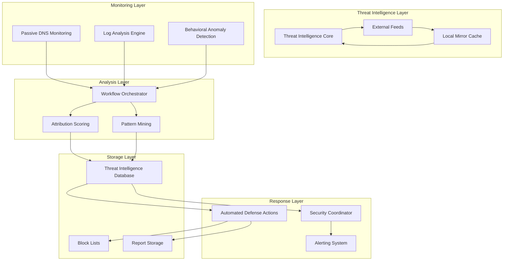

**Diagram sources**
- [threat-intelligence-automation.py:157-172](file://security/automation/threat-intelligence-automation.py#L157-L172)
- [workflow_orchestrator.py:335-466](file://intelligence/workflow_orchestrator.py#L335-L466)

**Section sources**
- [threat-intelligence-automation.py:70-118](file://security/automation/threat-intelligence-automation.py#L70-L118)
- [workflow_orchestrator.py:335-369](file://intelligence/workflow_orchestrator.py#L335-L369)

## Threat Intelligence Automation Core

The core threat intelligence automation system provides continuous monitoring, analysis, and response capabilities through a sophisticated workflow engine.

### Threat Intelligence Data Model

The system uses a comprehensive data model to represent threat intelligence information:

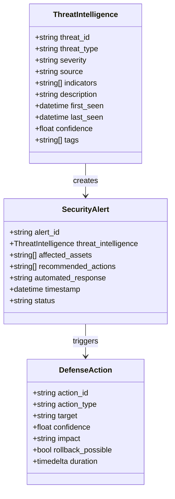

**Diagram sources**
- [threat-intelligence-automation.py:31-68](file://security/automation/threat-intelligence-automation.py#L31-L68)

### Automated Threat Analysis Pipeline

The system implements a continuous threat analysis pipeline that operates on configurable intervals:

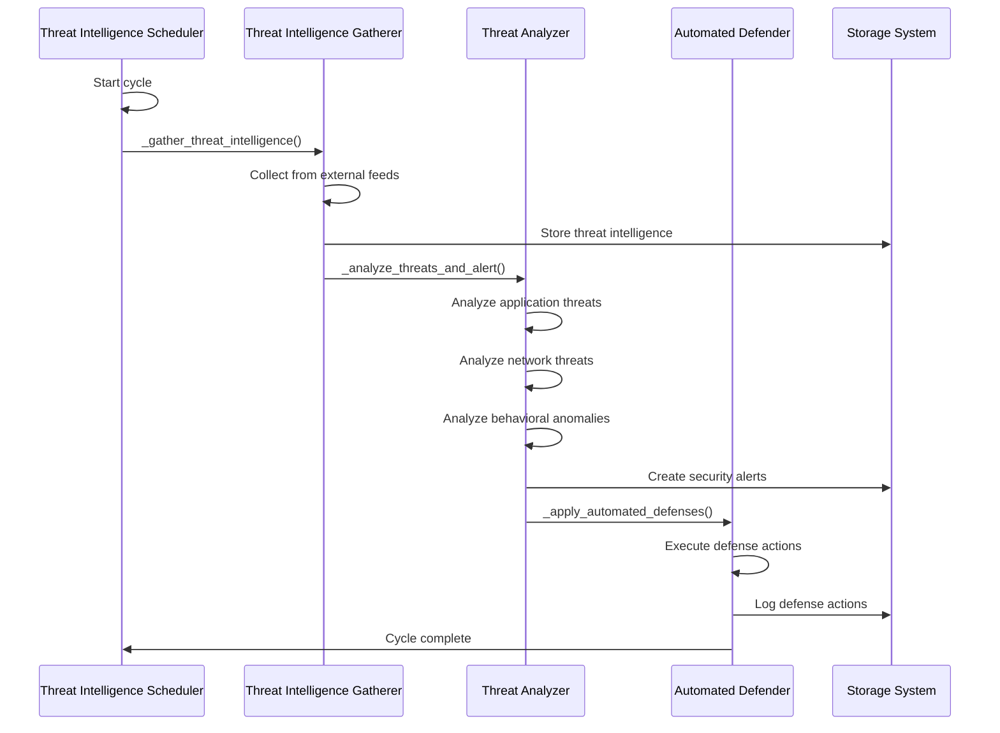

**Diagram sources**
- [threat-intelligence-automation.py:157-172](file://security/automation/threat-intelligence-automation.py#L157-L172)
- [threat-intelligence-automation.py:325-332](file://security/automation/threat-intelligence-automation.py#L325-L332)

**Section sources**
- [threat-intelligence-automation.py:157-172](file://security/automation/threat-intelligence-automation.py#L157-L172)
- [threat-intelligence-automation.py:325-332](file://security/automation/threat-intelligence-automation.py#L325-L332)

## Security Audit Framework

The security audit framework provides comprehensive monitoring and validation of security operations across all system components.

### Security Coordinator Integration

The Universal Security Coordinator serves as the central orchestration point for all security operations:

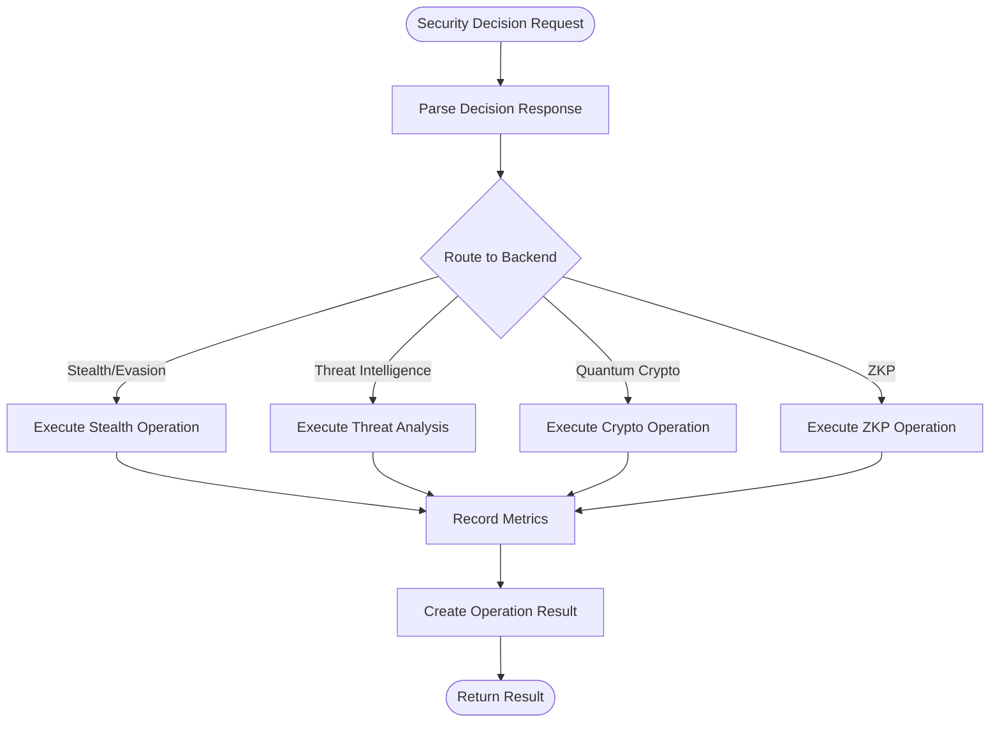

**Diagram sources**
- [security_coordinator.py:295-343](file://coordinators/security_coordinator.py#L295-L343)

### Security Level Escalation

The system supports four levels of security operations with automatic escalation based on confidence levels:

| Security Level | Confidence Threshold | Operations Enabled |
|----------------|---------------------|-------------------|
| Minimal (1) | < 0.4 | Basic stealth operations |
| Standard (2) | ≥ 0.4 | Stealth + Threat detection |
| High (3) | ≥ 0.7 | Stealth + Threat + Quantum crypto |
| Maximum (4) | ≥ 0.9 | All operations + ZKP verification |

**Section sources**
- [security_coordinator.py:344-352](file://coordinators/security_coordinator.py#L344-L352)
- [security_coordinator.py:497-614](file://coordinators/security_coordinator.py#L497-L614)

## Passive DNS Monitoring Integration

The passive DNS monitoring system provides comprehensive domain and IP resolution capabilities with multiple provider support and graceful degradation.

### DoH and CIRCL Integration

The system integrates with multiple passive DNS providers through a unified interface:

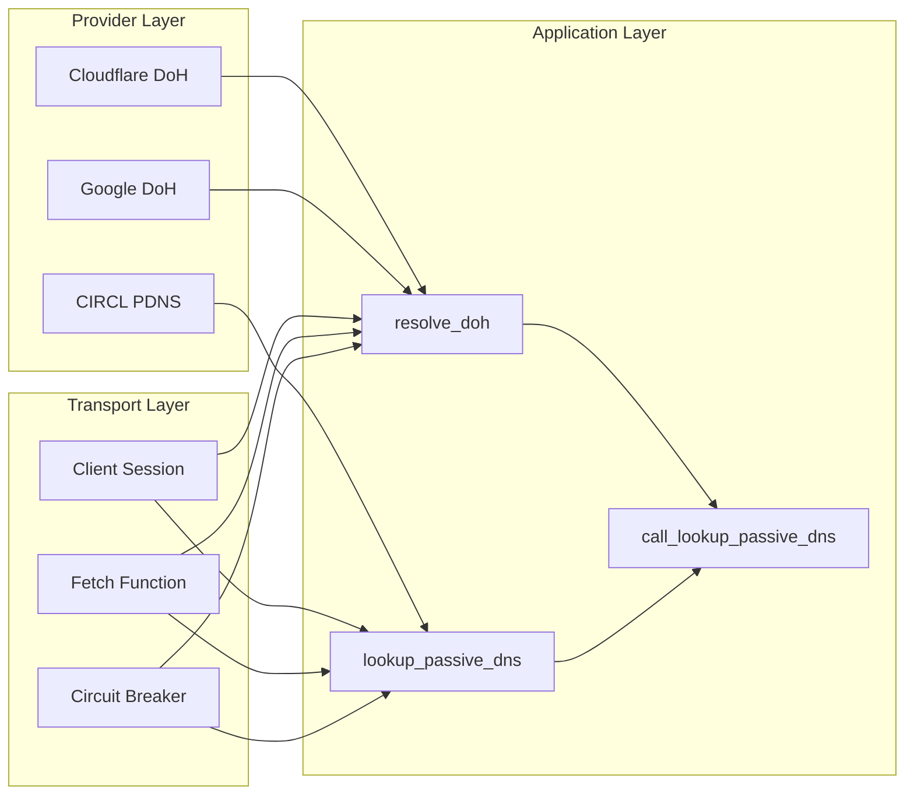

**Diagram sources**
- [passive_dns.py:104-216](file://security/passive_dns.py#L104-L216)
- [passive_dns.py:218-317](file://security/passive_dns.py#L218-L317)

### Graceful Degradation Strategy

The passive DNS system implements comprehensive error handling and graceful degradation:

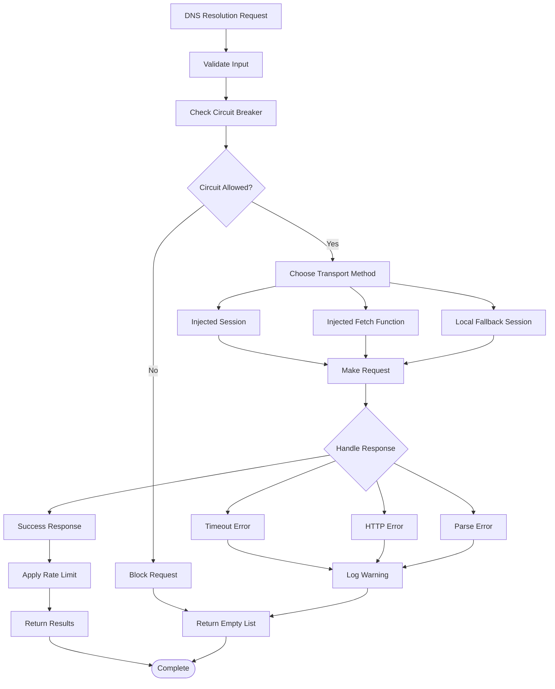

**Diagram sources**
- [passive_dns.py:348-522](file://security/passive_dns.py#L348-L522)

**Section sources**
- [passive_dns.py:104-216](file://security/passive_dns.py#L104-L216)
- [passive_dns.py:218-317](file://security/passive_dns.py#L218-L317)
- [passive_dns.py:348-522](file://security/passive_dns.py#L348-L522)

## Attribution Scoring Mechanisms

The attribution scoring system provides explainable confidence scores for identity stitching candidates through multiple factor analysis.

### Attribution Confidence Scoring

The system implements a weighted scoring mechanism across seven primary factors:

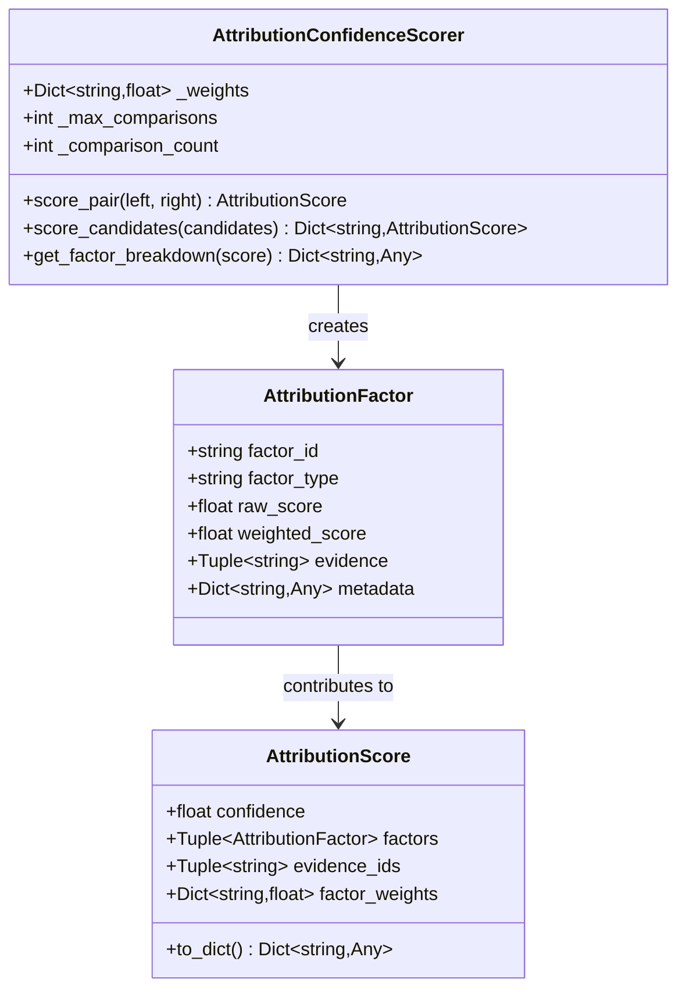

**Diagram sources**
- [attribution_scorer.py:136-154](file://intelligence/attribution_scorer.py#L136-L154)
- [attribution_scorer.py:47-75](file://intelligence/attribution_scorer.py#L47-L75)

### Factor Weight Distribution

The system uses carefully calibrated weights for different attribution factors:

| Factor Type | Weight | Purpose |
|-------------|--------|---------|
| Email Domain Match | 0.25 | Strong correlation between email domains |
| Username Pattern Similarity | 0.20 | Pattern matching between usernames |
| Temporal Overlap | 0.20 | Overlap in activity timing |
| Shared Infrastructure | 0.20 | Common platforms and services |
| PGP Key Correlation | 0.15 | Cryptographic key relationships |
| Social Profile Overlap | 0.15 | Social media and profile similarities |
| Bio Link Overlap | 0.10 | Linked domains and contact information |

**Section sources**
- [attribution_scorer.py:29-38](file://intelligence/attribution_scorer.py#L29-L38)
- [attribution_scorer.py:480-562](file://intelligence/attribution_scorer.py#L480-L562)

## Threat Pattern Recognition

The threat pattern recognition system implements advanced algorithms for detecting suspicious activities and potential security threats.

### Pattern Mining Engine

The pattern mining engine provides comprehensive analysis capabilities across multiple threat categories:

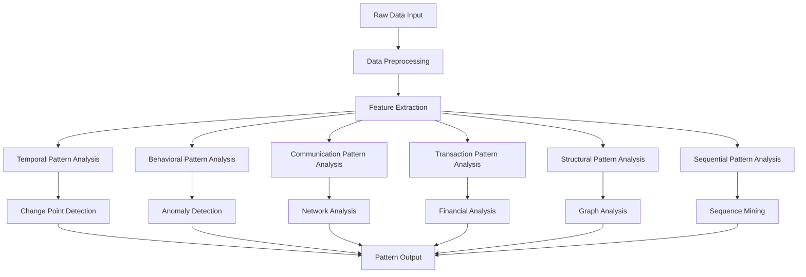

**Diagram sources**
- [pattern_mining.py:544-593](file://intelligence/pattern_mining.py#L544-L593)

### Anomaly Detection Methods

The system employs multiple anomaly detection techniques:

| Detection Method | Algorithm | Use Case |
|------------------|-----------|----------|
| Wavelet Transform | Discrete Wavelet Transform | Change point detection in time series |
| Mamba2 Forecasting | State Space Model | Predictive anomaly detection |
| EWMA Drift | Exponentially Weighted Moving Average | Drift detection in process monitoring |
| CUSUM Change | Cumulative Sum Control Chart | Change detection in statistical process control |

**Section sources**
- [pattern_mining.py:594-629](file://intelligence/pattern_mining.py#L594-L629)
- [pattern_mining.py:180-208](file://intelligence/pattern_mining.py#L180-L208)

## Automated Security Response Workflows

The automated security response system provides comprehensive defense mechanisms that can be triggered automatically based on threat analysis results.

### Defense Action Types

The system implements several types of automated defense actions:

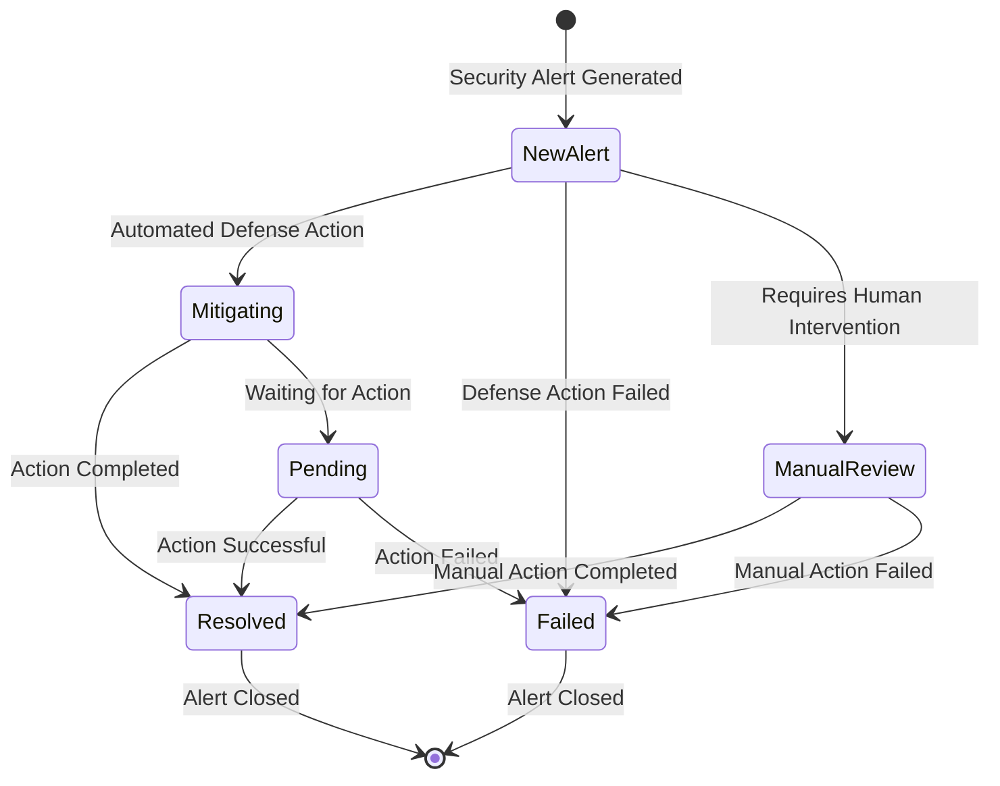

**Diagram sources**
- [threat-intelligence-automation.py:513-530](file://security/automation/threat-intelligence-automation.py#L513-L530)

### Response Trigger Logic

Defense actions are triggered based on threat characteristics and severity levels:

| Threat Type | Severity | Response Action | Conditions |
|-------------|----------|-----------------|------------|
| Malware Domain | Critical/High | Block IP/Domain | Malware domain indicators |
| IOC | Critical/High | Block IP/Domain | Known malicious indicators |
| Vulnerability | Critical/High | Update Rules | Critical vulnerabilities |
| Log Pattern | Medium | Rate Limit | Suspicious access patterns |
| Behavioral Anomaly | Medium | Enhance Monitoring | Unusual behavior patterns |
| Unknown | High | Enhance Monitoring | High confidence unknown threat |

**Section sources**
- [threat-intelligence-automation.py:382-393](file://security/automation/threat-intelligence-automation.py#L382-L393)
- [threat-intelligence-automation.py:513-530](file://security/automation/threat-intelligence-automation.py#L513-L530)

## External Threat Intelligence Feeds

The system integrates with multiple external threat intelligence feeds to provide comprehensive coverage of emerging threats.

### Feed Integration Architecture

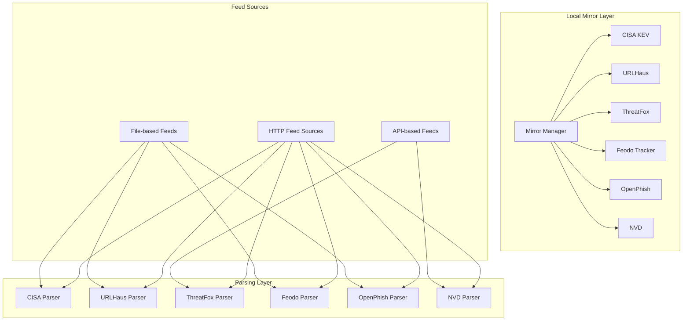

**Diagram sources**
- [ti_feed_adapter.py:89-235](file://intelligence/ti_feed_adapter.py#L89-L235)
- [ti_feed_adapter.py:601-768](file://intelligence/ti_feed_adapter.py#L601-L768)

### Supported Feed Types

The system supports integration with various threat intelligence feed types:

| Feed Type | Source | Parsing Method | Priority |
|-----------|--------|----------------|----------|
| CISA KEV | Known Exploited Vulnerabilities | JSON Parser | 95 |
| URLHaus | Malicious URLs | CSV Parser | 95 |
| ThreatFox | IOC Indicators | JSON Parser | 95 |
| Feodo Tracker | Malware IPs | JSON Parser | 95 |
| OpenPhish | Phishing URLs | Text Parser | 95 |
| NVD | National Vulnerability Database | JSON Parser | 95 |

**Section sources**
- [ti_feed_adapter.py:43-82](file://intelligence/ti_feed_adapter.py#L43-L82)
- [ti_feed_adapter.py:242-400](file://intelligence/ti_feed_adapter.py#L242-L400)

## Security Monitoring and Alerting

The security monitoring and alerting system provides comprehensive visibility into security events and automated response capabilities.

### Alert Generation Process

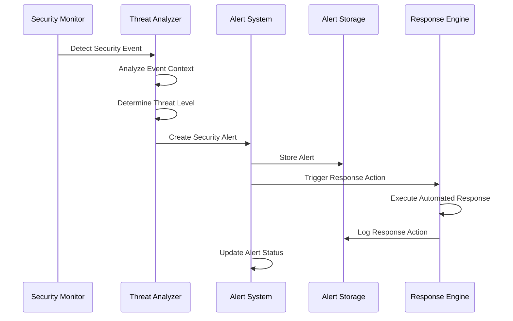

**Diagram sources**
- [threat-intelligence-automation.py:325-332](file://security/automation/threat-intelligence-automation.py#L325-L332)
- [threat-intelligence-automation.py:513-530](file://security/automation/threat-intelligence-automation.py#L513-L530)

### Alert Classification System

The system classifies alerts based on multiple criteria:

| Alert Type | Severity | Trigger Conditions | Response Action |
|------------|----------|-------------------|-----------------|
| Application Threat | Critical/High | Malware domain IOC matches app endpoints | Block IP/Domain |
| Network Threat | Medium | Suspicious access patterns detected | Rate Limit |
| Behavioral Anomaly | Medium | Unusual behavior patterns | Enhance Monitoring |
| Vulnerability | Critical/High | Critical vulnerability detected | Update Rules |
| Log Pattern | Medium | Suspicious log patterns | Rate Limit |
| Unknown Threat | High | High confidence unknown threat | Enhance Monitoring |

**Section sources**
- [threat-intelligence-automation.py:333-483](file://security/automation/threat-intelligence-automation.py#L333-L483)
- [threat-intelligence-automation.py:644-705](file://security/automation/threat-intelligence-automation.py#L644-L705)

## Incident Response Automation

The incident response automation system provides comprehensive capabilities for managing security incidents from detection to resolution.

### Response Workflow Orchestration

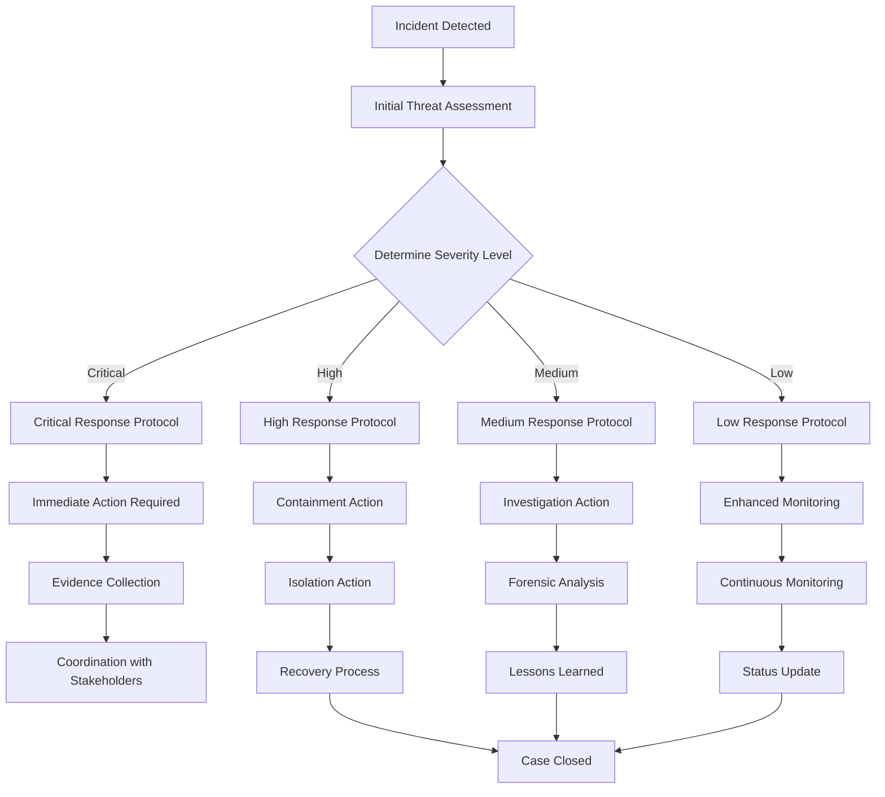

**Diagram sources**
- [workflow_orchestrator.py:385-466](file://intelligence/workflow_orchestrator.py#L385-L466)

### Multi-Layered Response Strategy

The system implements a multi-layered response strategy that escalates based on threat severity:

| Response Layer | Security Level | Response Actions | Duration |
|----------------|----------------|------------------|----------|
| Layer 1 | Minimal (1) | Basic stealth measures | Temporary |
| Layer 2 | Standard (2) | Stealth + Threat detection | Temporary |
| Layer 3 | High (3) | Stealth + Threat + Quantum crypto | Extended |
| Layer 4 | Maximum (4) | All layers + ZKP verification | Permanent |

**Section sources**
- [workflow_orchestrator.py:497-614](file://intelligence/workflow_orchestrator.py#L497-L614)
- [security_coordinator.py:497-614](file://coordinators/security_coordinator.py#L497-L614)

## Continuous Threat Assessment

The continuous threat assessment system provides ongoing evaluation of the security posture and threat landscape.

### Threat Assessment Metrics

The system tracks multiple metrics for comprehensive threat assessment:

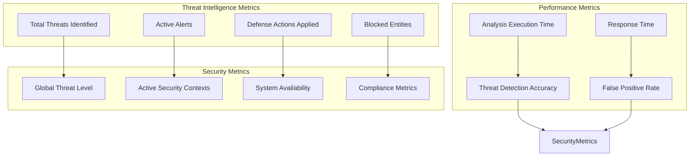

**Diagram sources**
- [threat-intelligence-automation.py:644-705](file://security/automation/threat-intelligence-automation.py#L644-L705)

### Assessment Reporting

The system generates comprehensive reports for threat assessment:

| Report Type | Content | Frequency | Audience |
|-------------|---------|-----------|----------|
| Daily Threat Report | Summary of daily threats and responses | Daily | Security Team |
| Weekly Security Digest | Weekly security highlights and trends | Weekly | Management |
| Monthly Comprehensive Report | Detailed security analysis and recommendations | Monthly | Executive Team |
| Quarterly Strategic Assessment | Long-term security strategy evaluation | Quarterly | Board of Directors |

**Section sources**
- [threat-intelligence-automation.py:644-733](file://security/automation/threat-intelligence-automation.py#L644-L733)

## Performance Considerations

The threat intelligence automation system is designed with performance optimization in mind, utilizing asynchronous processing and efficient data structures.

### Asynchronous Processing Architecture

The system leverages Python's asyncio library for non-blocking operations:

- **Non-blocking I/O**: All network operations use aiohttp for asynchronous HTTP requests
- **Graceful Degradation**: Failed operations don't block the entire system
- **Resource Management**: Automatic cleanup of sessions and connections
- **Circuit Breaker Pattern**: Prevents cascading failures during system overload

### Memory Optimization Strategies

The system implements several memory optimization techniques:

- **Streaming Data Processing**: Processes large datasets without loading entire files into memory
- **Efficient Data Structures**: Uses deques and counters for optimal performance
- **Memory Limits**: Configurable memory usage with automatic cleanup
- **Garbage Collection**: Proactive garbage collection for long-running processes

### Scalability Features

The system supports horizontal scaling through:

- **Parallel Processing**: Multiple modules can run concurrently
- **Load Balancing**: Automatic distribution of workload across available resources
- **Caching Mechanisms**: In-memory caching for frequently accessed data
- **Database Optimization**: Efficient storage and retrieval of threat intelligence data

## Troubleshooting Guide

Common issues and their solutions in the threat intelligence automation system:

### Threat Intelligence Feed Issues

**Problem**: External feeds failing to load
**Solution**: 
- Check network connectivity and proxy settings
- Verify API keys and authentication credentials
- Review circuit breaker status
- Check local mirror availability

**Problem**: Threat intelligence data not updating
**Solution**:
- Verify feed URLs and endpoints
- Check rate limiting and quota limits
- Review parsing errors in log files
- Validate data format compatibility

### Passive DNS Resolution Problems

**Problem**: DNS resolution failures
**Solution**:
- Check provider availability and rate limits
- Verify circuit breaker decisions
- Review timeout configurations
- Test alternative DNS providers

**Problem**: Inconsistent DNS results
**Solution**:
- Check for DNS poisoning or cache poisoning
- Verify TTL settings and caching behavior
- Review network path stability
- Test with multiple DNS providers

### Security Response Failures

**Problem**: Automated defense actions not executing
**Solution**:
- Verify security configuration settings
- Check permissions for defense operations
- Review response action logs
- Test manual execution of defense actions

**Problem**: False positive security alerts
**Solution**:
- Adjust confidence thresholds
- Review alert categorization logic
- Fine-tune detection algorithms
- Implement manual review processes

### Performance Issues

**Problem**: Slow threat analysis performance
**Solution**:
- Optimize database queries and indexing
- Review memory usage and garbage collection
- Check CPU utilization and bottleneck identification
- Implement caching strategies

**Problem**: High memory consumption
**Solution**:
- Review memory optimization settings
- Check for memory leaks in long-running processes
- Implement memory monitoring and alerts
- Optimize data structures and algorithms

## Conclusion

The Threat Intelligence Automation system provides a comprehensive solution for modern cybersecurity challenges. Through its multi-layered architecture, the system effectively combines threat intelligence feeds, passive DNS monitoring, attribution scoring, and automated response mechanisms to create a robust security ecosystem.

Key strengths of the system include:

- **Comprehensive Coverage**: Integration of multiple threat intelligence sources and monitoring capabilities
- **Automated Response**: Intelligent triggering of defense actions based on threat analysis
- **Explainable AI**: Transparent attribution scoring with detailed factor breakdowns
- **Scalable Architecture**: Designed for growth and adaptation to evolving threats
- **Performance Optimization**: Asynchronous processing and memory-efficient algorithms

The system's modular design allows for easy integration with existing security infrastructure while providing the flexibility to adapt to specific organizational needs. Through continuous threat assessment and automated response capabilities, the system helps organizations maintain a strong security posture in an increasingly complex threat landscape.

Future enhancements could include machine learning model integration for improved threat prediction, expanded threat intelligence feed support, and enhanced reporting capabilities for compliance and governance requirements.