# Vault Management

<cite>
**Referenced Files in This Document**
- [vault_manager.py](file://security/vault_manager.py)
- [key_manager.py](file://security/key_manager.py)
- [ram_vault.py](file://security/ram_vault.py)
- [destruction.py](file://security/destruction.py)
- [audit.py](file://security/audit.py)
- [encryption.py](file://security/encryption.py)
- [quantum_safe.py](file://security/quantum_safe.py)
- [paths.py](file://paths.py)
- [security_coordinator.py](file://coordinators/security_coordinator.py)
- [nym_policy.py](file://policy/nym_policy.py)
- [test_vault_manager.py](file://tests/test_vault_manager.py)
</cite>

## Table of Contents
1. [Introduction](#introduction)
2. [Project Structure](#project-structure)
3. [Core Components](#core-components)
4. [Architecture Overview](#architecture-overview)
5. [Detailed Component Analysis](#detailed-component-analysis)
6. [Dependency Analysis](#dependency-analysis)
7. [Performance Considerations](#performance-considerations)
8. [Troubleshooting Guide](#troubleshooting-guide)
9. [Conclusion](#conclusion)
10. [Appendices](#appendices)

## Introduction
This document provides comprehensive documentation for secure vault management and lifecycle operations within the system. It covers vault creation, access control, secure storage mechanisms, and destruction protocols. It also documents the vault manager architecture, audit logging, and compliance tracking systems. Implementation details include secure key derivation, access token management, and automated cleanup procedures. Examples illustrate vault configuration, access patterns, and incident response workflows. Security policies, compliance requirements, and operational best practices are addressed throughout.

## Project Structure
The vault management system spans several modules:
- Security core: vault export/import, key management, RAM-backed vault, secure destruction, audit logging, encryption utilities, and quantum-safe cryptography
- Infrastructure: canonical path management for RAMDISK and secure directories
- Coordination: security coordinator orchestrating multi-layer security operations
- Policy: transport selection policy for anonymity and risk management
- Testing: focused test coverage for vault manager functionality

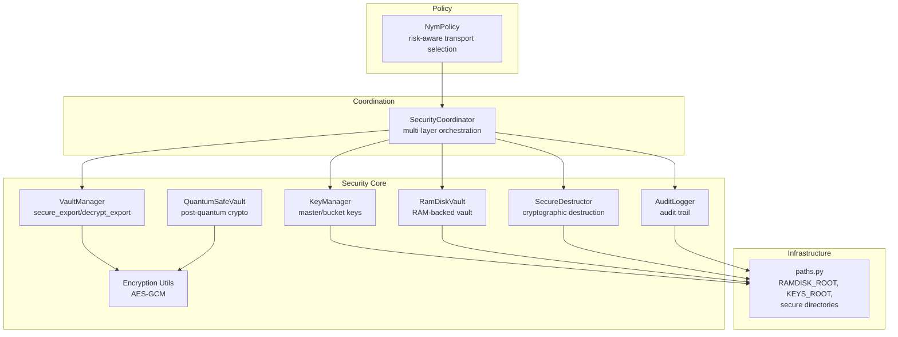

**Diagram sources**
- [vault_manager.py:1-341](file://security/vault_manager.py#L1-L341)
- [key_manager.py:1-175](file://security/key_manager.py#L1-L175)
- [ram_vault.py:1-154](file://security/ram_vault.py#L1-L154)
- [destruction.py:1-292](file://security/destruction.py#L1-L292)
- [audit.py:1-360](file://security/audit.py#L1-L360)
- [encryption.py:1-23](file://security/encryption.py#L1-L23)
- [quantum_safe.py:1-1103](file://security/quantum_safe.py#L1-L1103)
- [paths.py:1-531](file://paths.py#L1-L531)
- [security_coordinator.py:1-800](file://coordinators/security_coordinator.py#L1-L800)
- [nym_policy.py:1-142](file://policy/nym_policy.py#L1-L142)

**Section sources**
- [vault_manager.py:1-341](file://security/vault_manager.py#L1-L341)
- [paths.py:1-531](file://paths.py#L1-L531)

## Core Components
- VaultManager: Provides encrypted export/import of vault contents and secure shredding of originals. Supports pyzipper AES and Fernet-based encryption backends with fail-fast enforcement of real encryption.
- KeyManager: Manages master keys and derived bucket keys using PBKDF2 and HKDF, with LMDB persistence and optional memory locking.
- RamDiskVault: Creates and mounts a RAM-backed HFS+ volume for transient secure storage with validation and cleanup.
- SecureDestructor: Implements DoD/NIST/Gutmann destruction standards with overwrite patterns, verification, and optional memory wiping.
- AuditLogger: Maintains an append-only audit trail with HMAC integrity protection and SQLite persistence.
- Encryption Utilities: Provides AES-GCM encrypt/decrypt helpers for symmetric encryption.
- QuantumSafeVault: Implements post-quantum cryptography primitives (ML-KEM, ML-DSA) and steganography with neural signature generation.
- SecurityCoordinator: Orchestrates multi-layer security operations (stealth, threat, crypto, ZKP) and maintains security contexts.
- NymPolicy: Risk-aware transport selection policy integrating anonymity and latency considerations.

**Section sources**
- [vault_manager.py:36-341](file://security/vault_manager.py#L36-L341)
- [key_manager.py:53-175](file://security/key_manager.py#L53-L175)
- [ram_vault.py:9-154](file://security/ram_vault.py#L9-L154)
- [destruction.py:51-292](file://security/destruction.py#L51-L292)
- [audit.py:115-360](file://security/audit.py#L115-L360)
- [encryption.py:1-23](file://security/encryption.py#L1-L23)
- [quantum_safe.py:754-1103](file://security/quantum_safe.py#L754-L1103)
- [security_coordinator.py:73-800](file://coordinators/security_coordinator.py#L73-L800)
- [nym_policy.py:62-142](file://policy/nym_policy.py#L62-L142)

## Architecture Overview
The vault lifecycle integrates secure storage, encryption, auditing, and destruction:
- Creation: Optionally mount a RAM-backed vault; write sensitive data; persist keys in secure LMDB.
- Access Control: Enforce path hygiene and permissions; derive bucket keys from master keys; audit access events.
- Secure Storage: Export vault contents to encrypted archives (.enc) using pyzipper AES or Fernet; shred originals.
- Destruction: Apply DoD/NIST/Gutmann standards; optionally wipe memory buffers; maintain audit records.
- Compliance Tracking: Maintain HMAC-protected audit logs; generate compliance reports; enforce retention.

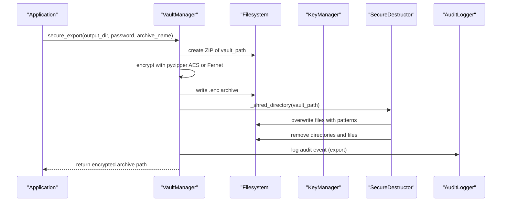

**Diagram sources**
- [vault_manager.py:212-253](file://security/vault_manager.py#L212-L253)
- [destruction.py:105-164](file://security/destruction.py#L105-L164)
- [audit.py:174-246](file://security/audit.py#L174-L246)

## Detailed Component Analysis

### VaultManager: Secure Export and Import
VaultManager handles encrypted export/import of vault contents and secure shredding of originals. It prioritizes pyzipper AES (if available) and falls back to Fernet encryption. It enforces fail-fast behavior if neither cryptography nor pyzipper is available. It rejects legacy XOR-encrypted exports and supports format sniffing to decrypt either ZIP AES or Fernet blobs.

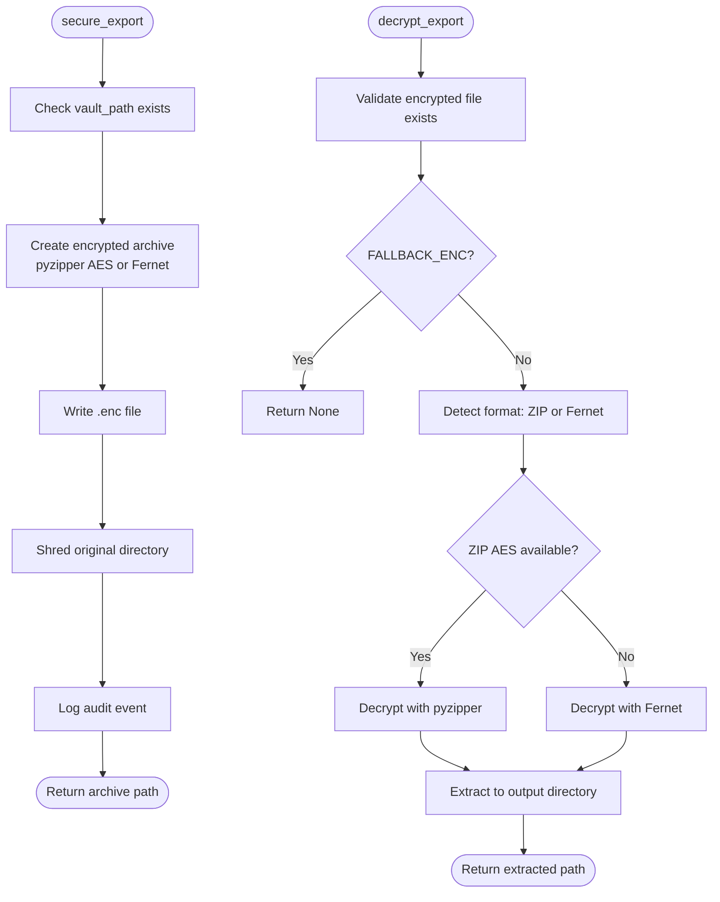

**Diagram sources**
- [vault_manager.py:212-253](file://security/vault_manager.py#L212-L253)
- [vault_manager.py:255-331](file://security/vault_manager.py#L255-L331)

**Section sources**
- [vault_manager.py:36-341](file://security/vault_manager.py#L36-L341)
- [test_vault_manager.py:1-189](file://tests/test_vault_manager.py#L1-L189)

### KeyManager: Secure Key Derivation and Rotation
KeyManager manages master keys and derived bucket keys using PBKDF2 for key derivation and HKDF for key derivation per bucket. Keys are persisted in LMDB with secure permissions. It supports master key rotation and caching of derived keys for performance.

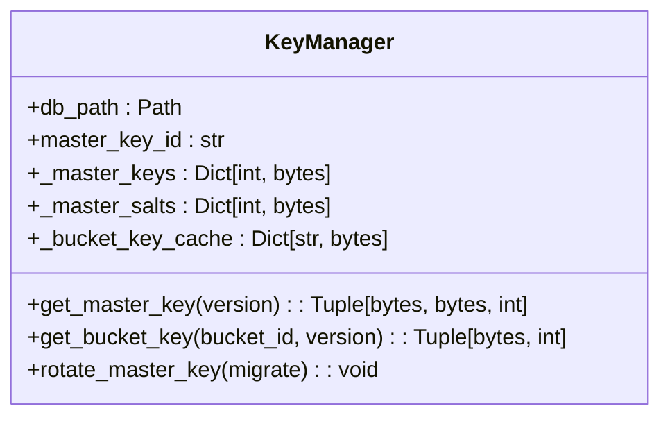

**Diagram sources**
- [key_manager.py:53-175](file://security/key_manager.py#L53-L175)

**Section sources**
- [key_manager.py:53-175](file://security/key_manager.py#L53-L175)
- [paths.py:257-376](file://paths.py#L257-L376)

### RamDiskVault: RAM-Backed Secure Storage
RamDiskVault creates and mounts a RAM-backed HFS+ volume for transient secure storage. It validates inputs, formats the device, mounts it, and provides unmount and cleanup routines. It ensures the device is detached on errors and supports context manager usage.

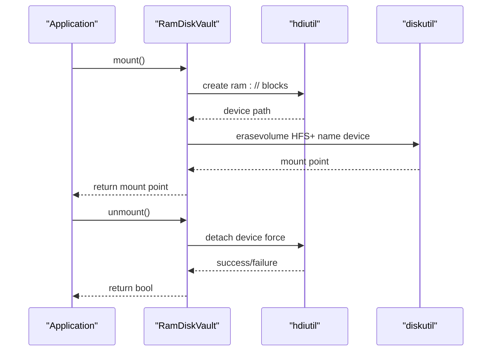

**Diagram sources**
- [ram_vault.py:28-115](file://security/ram_vault.py#L28-L115)

**Section sources**
- [ram_vault.py:9-154](file://security/ram_vault.py#L9-L154)
- [paths.py:107-141](file://paths.py#L107-L141)

### SecureDestructor: Cryptographic Data Destruction
SecureDestructor implements DoD 5220.22-M, NIST 800-88, and Gutmann destruction standards. It overwrites files with configurable patterns, verifies destruction, and optionally wipes free space. It tracks statistics and supports directory destruction.

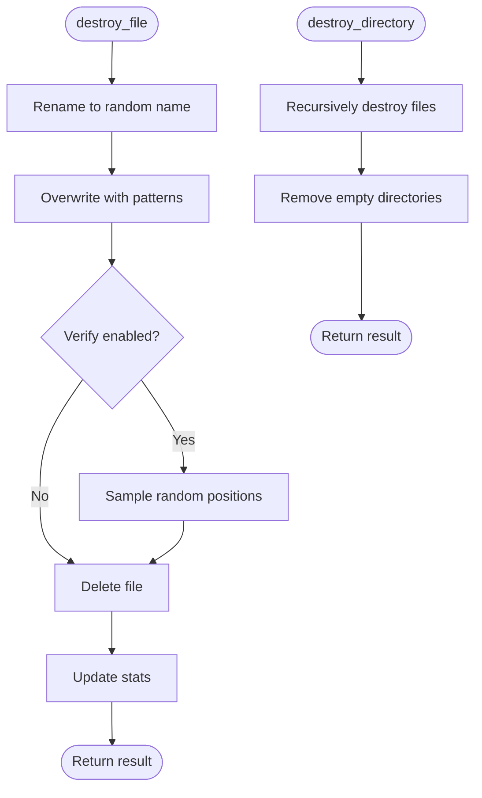

**Diagram sources**
- [destruction.py:105-260](file://security/destruction.py#L105-L260)

**Section sources**
- [destruction.py:51-292](file://security/destruction.py#L51-L292)

### AuditLogger: Audit Trail and Compliance
AuditLogger maintains an append-only audit trail with HMAC integrity protection and SQLite persistence. It supports filtering, reporting, and retention policies. Events include timestamps, types, actions, resources, user/session identifiers, details, and severity levels.

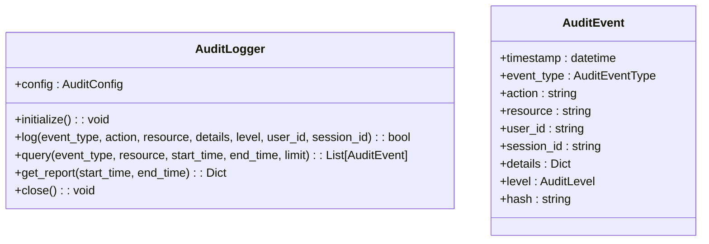

**Diagram sources**
- [audit.py:115-360](file://security/audit.py#L115-L360)

**Section sources**
- [audit.py:115-360](file://security/audit.py#L115-L360)

### Encryption Utilities: AES-GCM
Encryption utilities provide lightweight AES-GCM encrypt/decrypt helpers for symmetric encryption with associated data support.

**Section sources**
- [encryption.py:1-23](file://security/encryption.py#L1-L23)

### QuantumSafeVault: Post-Quantum Cryptography
QuantumSafeVault implements ML-KEM (Kyber) for key encapsulation and ML-DSA (Dilithium) for digital signatures. It integrates neuromorphic cryptography with SNN-based encryption and neural signatures. It supports steganography with DCT, LSB, and neural methods.

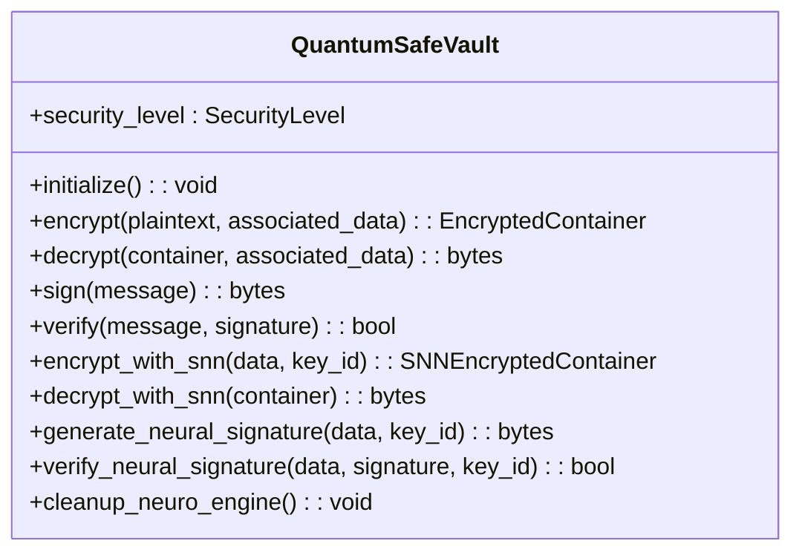

**Diagram sources**
- [quantum_safe.py:754-1103](file://security/quantum_safe.py#L754-L1103)

**Section sources**
- [quantum_safe.py:1-1103](file://security/quantum_safe.py#L1-L1103)

### SecurityCoordinator: Multi-Layer Orchestration
SecurityCoordinator orchestrates multi-layer security operations (stealth, threat, crypto, ZKP), maintains security contexts, and integrates with audit logging. It routes decisions to appropriate subsystems and tracks metrics.

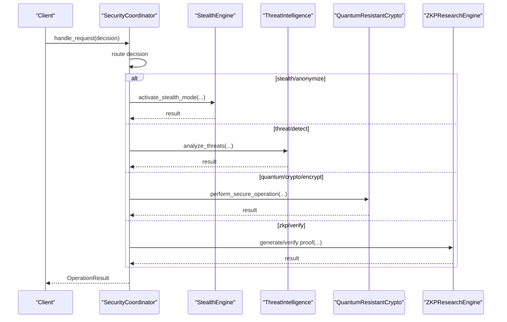

**Diagram sources**
- [security_coordinator.py:231-491](file://coordinators/security_coordinator.py#L231-L491)

**Section sources**
- [security_coordinator.py:73-800](file://coordinators/security_coordinator.py#L73-L800)

### NymPolicy: Risk-Aware Transport Selection
NymPolicy selects anonymity transports (Tor/Nym) based on risk level, time budget, sensitivity, and latency. It uses LinUCB bandits to balance exploration and exploitation, updating rewards based on success and latency costs.

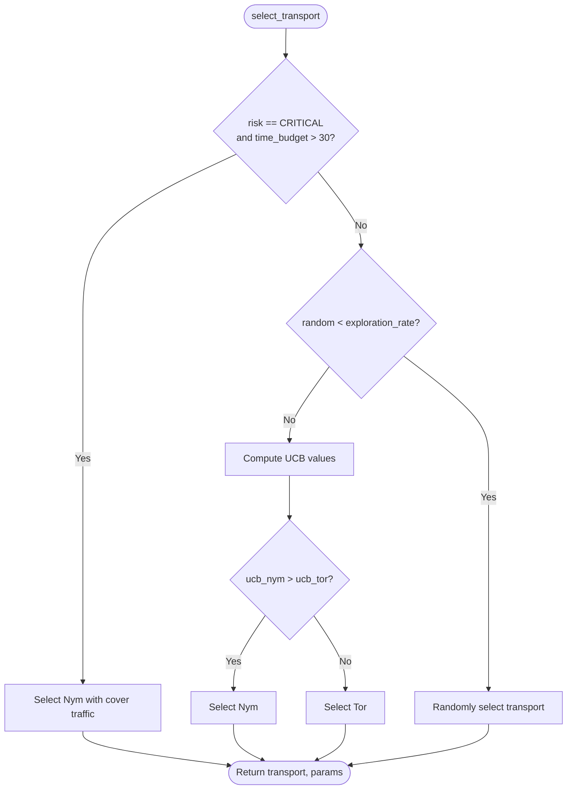

**Diagram sources**
- [nym_policy.py:91-122](file://policy/nym_policy.py#L91-L122)

**Section sources**
- [nym_policy.py:62-142](file://policy/nym_policy.py#L62-L142)

## Dependency Analysis
The vault management system exhibits clear separation of concerns:
- VaultManager depends on cryptography/pyzipper for encryption and on SecureDestructor for shredding.
- KeyManager depends on LMDB for persistence and on cryptography for key derivation.
- RamDiskVault depends on system utilities for RAM disk management and on paths for canonical locations.
- AuditLogger depends on SQLite and HMAC for integrity.
- QuantumSafeVault depends on cryptography and optional post-quantum libraries.
- SecurityCoordinator integrates all subsystems and coordinates multi-layer operations.
- NymPolicy integrates transport selection with risk assessment.

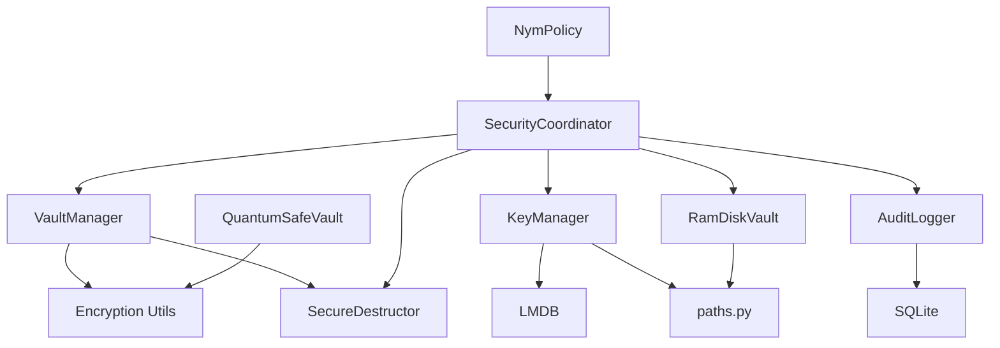

**Diagram sources**
- [vault_manager.py:14-31](file://security/vault_manager.py#L14-L31)
- [key_manager.py:9-22](file://security/key_manager.py#L9-L22)
- [paths.py:202-251](file://paths.py#L202-L251)
- [audit.py:135-172](file://security/audit.py#L135-L172)
- [quantum_safe.py:16-28](file://security/quantum_safe.py#L16-L28)
- [security_coordinator.py:133-193](file://coordinators/security_coordinator.py#L133-L193)
- [nym_policy.py:15-31](file://policy/nym_policy.py#L15-L31)

**Section sources**
- [vault_manager.py:14-31](file://security/vault_manager.py#L14-L31)
- [key_manager.py:9-22](file://security/key_manager.py#L9-L22)
- [paths.py:202-251](file://paths.py#L202-L251)
- [audit.py:135-172](file://security/audit.py#L135-L172)
- [quantum_safe.py:16-28](file://security/quantum_safe.py#L16-L28)
- [security_coordinator.py:133-193](file://coordinators/security_coordinator.py#L133-L193)
- [nym_policy.py:15-31](file://policy/nym_policy.py#L15-L31)

## Performance Considerations
- Vault export/import: Prefer pyzipper AES for large archives; Fernet adds overhead due to intermediate ZIP creation and encryption steps.
- Key derivation: PBKDF2 iterations are tuned for security; consider hardware acceleration for high-throughput environments.
- RAM-backed storage: Mounting and formatting RAM disks introduces overhead; use sparingly for sensitive operations.
- Destruction: DoD/NIST/Gutmann standards vary in passes; choose appropriate standard for threat model and performance constraints.
- Audit logging: SQLite writes incur I/O overhead; consider batching or asynchronous writes for high-frequency events.
- Quantum-safe cryptography: Post-quantum algorithms are computationally intensive; use selectively for high-value assets.

[No sources needed since this section provides general guidance]

## Troubleshooting Guide
Common issues and resolutions:
- VaultManager instantiation fails without crypto dependencies: Install cryptography and/or pyzipper; the module enforces real encryption and fails fast if unavailable.
- FALLBACK_ENC export rejected: Legacy XOR-encrypted exports are no longer supported; re-export using current encryption backends.
- Decryption failures: Verify password correctness; ensure the correct backend (pyzipper vs Fernet) matches the archive format.
- Non-existent vault or encrypted file: Check paths; ensure vault_path exists and encrypted file is present.
- RAM disk mount failures: Validate size and name constraints; confirm system utilities availability; check for timeouts.
- Secure destruction errors: Review overwrite patterns and verify device detachment; ensure sufficient privileges.
- Audit logging failures: Confirm database initialization and permissions; check retention and HMAC key configuration.
- KeyManager missing cryptography: Ensure cryptography package is installed; verify LMDB environment setup.

**Section sources**
- [vault_manager.py:64-73](file://security/vault_manager.py#L64-L73)
- [vault_manager.py:269-271](file://security/vault_manager.py#L269-L271)
- [test_vault_manager.py:34-189](file://tests/test_vault_manager.py#L34-L189)
- [ram_vault.py:28-78](file://security/ram_vault.py#L28-L78)
- [destruction.py:105-164](file://security/destruction.py#L105-L164)
- [audit.py:144-172](file://security/audit.py#L144-L172)
- [key_manager.py:55-56](file://security/key_manager.py#L55-L56)

## Conclusion
The vault management system provides a robust, multi-layered approach to secure data handling. It combines encrypted export/import, secure key derivation, RAM-backed storage, cryptographic destruction, and comprehensive audit logging. The architecture supports compliance requirements and operational best practices, with clear separation of concerns and modular components. Integration with the security coordinator and transport policy further strengthens the system’s resilience against evolving threats.

[No sources needed since this section summarizes without analyzing specific files]

## Appendices

### Vault Configuration Examples
- Vault creation: Use RamDiskVault to mount a RAM-backed volume; write sensitive data; persist keys via KeyManager.
- Export configuration: Choose pyzipper AES for large archives or Fernet for compatibility; specify strong passwords.
- Destruction configuration: Select DoD/NIST/Gutmann standard based on threat model; enable verification for critical assets.
- Audit configuration: Enable HMAC integrity protection; configure retention and console/file logging.

**Section sources**
- [ram_vault.py:13-27](file://security/ram_vault.py#L13-L27)
- [vault_manager.py:117-126](file://security/vault_manager.py#L117-L126)
- [destruction.py:26-49](file://security/destruction.py#L26-L49)
- [audit.py:104-113](file://security/audit.py#L104-L113)

### Access Patterns and Security Controls
- Access control: Enforce secure permissions on KEYS_ROOT and other sensitive directories; restrict file descriptors and memory exposure.
- Token management: Use KeyManager for master/bucket key derivation; rotate keys periodically; cache derived keys for performance.
- Transport selection: Apply NymPolicy for risk-aware anonymity; balance latency and sensitivity.

**Section sources**
- [paths.py:373-375](file://paths.py#L373-L375)
- [key_manager.py:127-163](file://security/key_manager.py#L127-L163)
- [nym_policy.py:91-122](file://policy/nym_policy.py#L91-L122)

### Incident Response Workflows
- Detection: Use SecurityCoordinator to analyze threats and activate stealth measures.
- Containment: Export affected vaults securely; shred originals; isolate compromised assets.
- Eradication: Rotate master keys; update transport policies; re-derive bucket keys.
- Recovery: Restore from verified backups; re-enable services; monitor audit logs.
- Lessons learned: Update policies; re-evaluate threat models; enhance training.

**Section sources**
- [security_coordinator.py:387-420](file://coordinators/security_coordinator.py#L387-L420)
- [vault_manager.py:212-253](file://security/vault_manager.py#L212-L253)
- [destruction.py:217-260](file://security/destruction.py#L217-L260)
- [audit.py:247-310](file://security/audit.py#L247-L310)