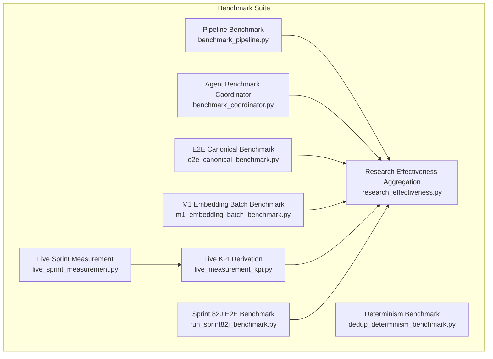
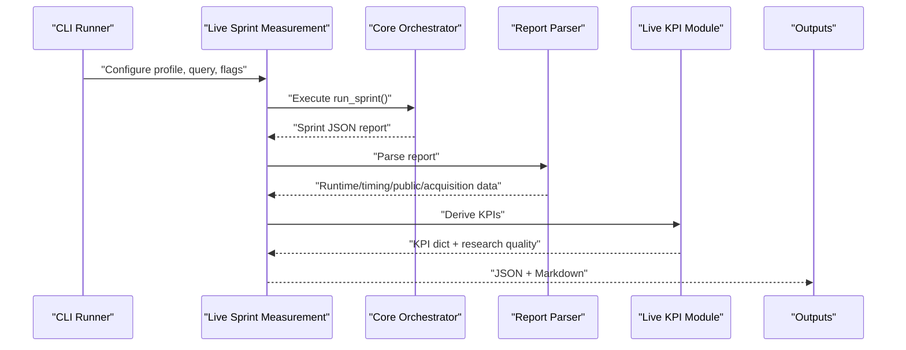
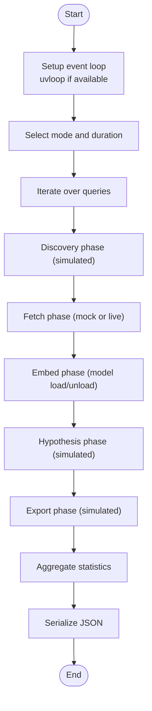
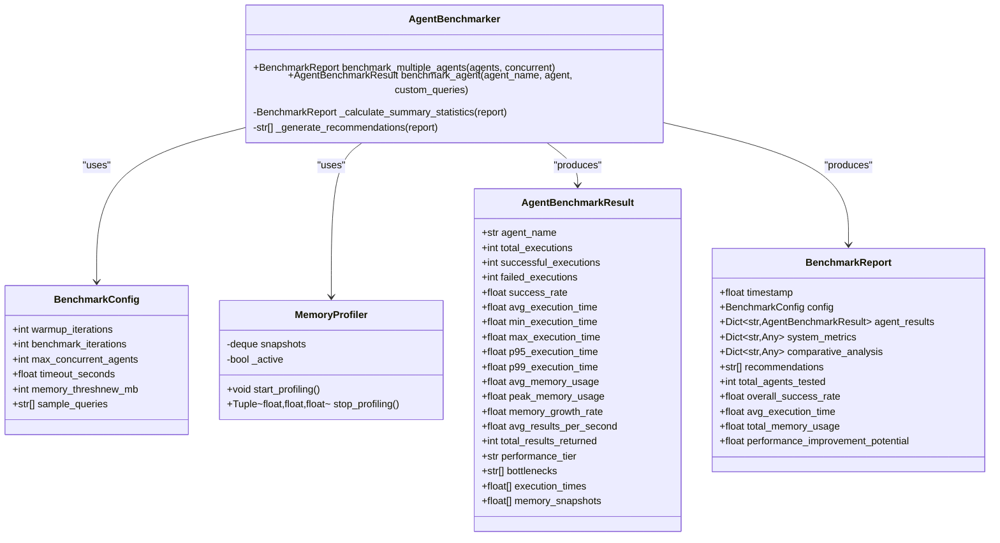
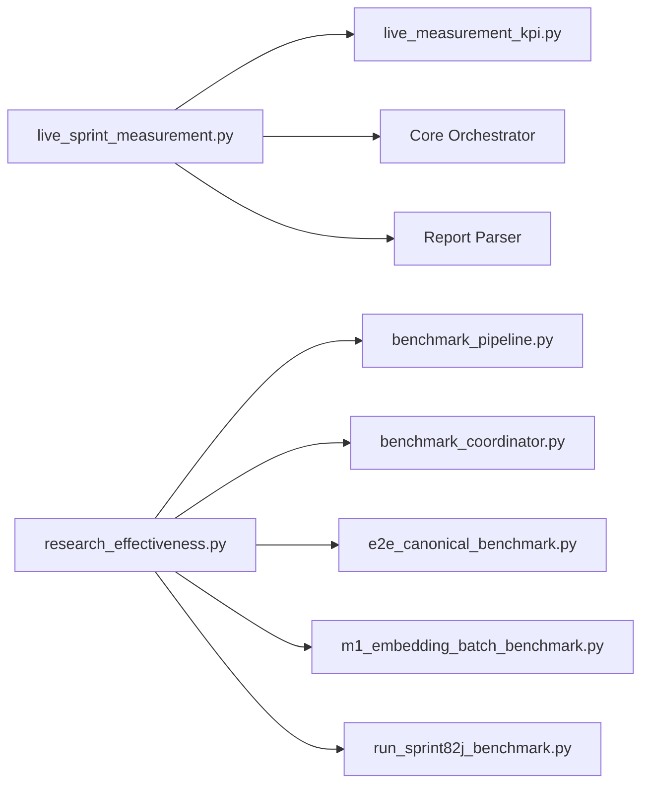

# Benchmark System

<cite>
**Referenced Files in This Document**
- [benchmark_pipeline.py](file://benchmarks/benchmark_pipeline.py)
- [benchmark_coordinator.py](file://coordinators/benchmark_coordinator.py)
- [dedup_determinism_benchmark.py](file://benchmarks/dedup_determinism_benchmark.py)
- [e2e_canonical_benchmark.py](file://benchmarks/e2e_canonical_benchmark.py)
- [m1_embedding_batch_benchmark.py](file://benchmarks/m1_embedding_batch_benchmark.py)
- [research_effectiveness.py](file://benchmarks/research_effectiveness.py)
- [live_measurement_kpi.py](file://benchmarks/live_measurement_kpi.py)
- [live_sprint_measurement.py](file://benchmarks/live_sprint_measurement.py)
- [run_sprint82j_benchmark.py](file://benchmarks/run_sprint82j_benchmark.py)
</cite>

## Table of Contents
1. [Introduction](#introduction)
2. [Project Structure](#project-structure)
3. [Core Components](#core-components)
4. [Architecture Overview](#architecture-overview)
5. [Detailed Component Analysis](#detailed-component-analysis)
6. [Dependency Analysis](#dependency-analysis)
7. [Performance Considerations](#performance-considerations)
8. [Troubleshooting Guide](#troubleshooting-guide)
9. [Conclusion](#conclusion)

## Introduction
This document describes the Hledac Universal benchmark system architecture and implementation. It explains the benchmark pipeline design, performance measurement methodologies, and result tracking mechanisms. It documents the benchmark execution workflow, data collection processes, and statistical analysis procedures. It also details the benchmark suite organization, individual benchmark implementations, and performance regression detection. Practical examples show how to run benchmarks, interpret results, compare performance across configurations, schedule benchmarks, visualize results, and integrate performance measurements into CI/CD pipelines.

## Project Structure
The benchmark system is organized around several specialized modules:
- Pipeline-level benchmarks: end-to-end pipeline timing and throughput
- Agent performance benchmarks: multi-agent comparative analysis
- Component-specific benchmarks: determinism, canonical E2E, embedding batch sizing
- Live measurement harness: reproducible live sprint execution with KPI derivation
- Research effectiveness aggregation: composite scorecards from benchmark logs

**Diagram sources**
- [benchmark_pipeline.py:1-381](file://benchmarks/benchmark_pipeline.py#L1-L381)
- [benchmark_coordinator.py:1-795](file://coordinators/benchmark_coordinator.py#L1-L795)
- [dedup_determinism_benchmark.py:1-390](file://benchmarks/dedup_determinism_benchmark.py#L1-L390)
- [e2e_canonical_benchmark.py:1-484](file://benchmarks/e2e_canonical_benchmark.py#L1-L484)
- [m1_embedding_batch_benchmark.py:1-353](file://benchmarks/m1_embedding_batch_benchmark.py#L1-L353)
- [research_effectiveness.py:1-757](file://benchmarks/research_effectiveness.py#L1-L757)
- [live_measurement_kpi.py:1-935](file://benchmarks/live_measurement_kpi.py#L1-L935)
- [live_sprint_measurement.py:1-732](file://benchmarks/live_sprint_measurement.py#L1-L732)
- [run_sprint82j_benchmark.py:1-1783](file://benchmarks/run_sprint82j_benchmark.py#L1-L1783)

**Section sources**
- [benchmark_pipeline.py:1-381](file://benchmarks/benchmark_pipeline.py#L1-L381)
- [benchmark_coordinator.py:1-795](file://coordinators/benchmark_coordinator.py#L1-L795)
- [dedup_determinism_benchmark.py:1-390](file://benchmarks/dedup_determinism_benchmark.py#L1-L390)
- [e2e_canonical_benchmark.py:1-484](file://benchmarks/e2e_canonical_benchmark.py#L1-L484)
- [m1_embedding_batch_benchmark.py:1-353](file://benchmarks/m1_embedding_batch_benchmark.py#L1-L353)
- [research_effectiveness.py:1-757](file://benchmarks/research_effectiveness.py#L1-L757)
- [live_measurement_kpi.py:1-935](file://benchmarks/live_measurement_kpi.py#L1-L935)
- [live_sprint_measurement.py:1-732](file://benchmarks/live_sprint_measurement.py#L1-L732)
- [run_sprint82j_benchmark.py:1-1783](file://benchmarks/run_sprint82j_benchmark.py#L1-L1783)

## Core Components
- Pipeline Benchmark: measures end-to-end pipeline phases (discovery, fetch, embed, hypothesis, export) and memory deltas across multiple runs and queries.
- Agent Benchmark Coordinator: comprehensive multi-agent benchmarking with memory profiling, latency percentiles, throughput, and comparative analysis.
- Determinism Benchmark: validates determinism and performance characteristics of deduplication components.
- E2E Canonical Benchmark: hermetic end-to-end benchmark focusing on findings/minute, dedup ratio, sidecar execution metrics, and memory ceilings.
- M1 Embedding Batch Benchmark: measures embedding throughput, latency, and memory footprint across batch sizes with dry-run and live modes.
- Live Sprint Measurement: reproducible live sprint execution with safety gates, readiness checks, and KPI derivation.
- Research Effectiveness Aggregation: computes composite scorecards (breadth, depth, quality, friction, power score) from benchmark logs.

**Section sources**
- [benchmark_pipeline.py:53-342](file://benchmarks/benchmark_pipeline.py#L53-L342)
- [benchmark_coordinator.py:183-795](file://coordinators/benchmark_coordinator.py#L183-L795)
- [dedup_determinism_benchmark.py:85-390](file://benchmarks/dedup_determinism_benchmark.py#L85-L390)
- [e2e_canonical_benchmark.py:211-450](file://benchmarks/e2e_canonical_benchmark.py#L211-L450)
- [m1_embedding_batch_benchmark.py:123-353](file://benchmarks/m1_embedding_batch_benchmark.py#L123-L353)
- [live_sprint_measurement.py:436-732](file://benchmarks/live_sprint_measurement.py#L436-L732)
- [research_effectiveness.py:128-757](file://benchmarks/research_effectiveness.py#L128-L757)

## Architecture Overview
The benchmark system integrates modular components to collect, correlate, and aggregate performance data. Live sprint measurements feed KPI derivations, while standalone benchmarks serialize structured results. Research effectiveness aggregation consolidates multiple runs into composite scorecards.

**Diagram sources**
- [live_sprint_measurement.py:536-628](file://benchmarks/live_sprint_measurement.py#L536-L628)
- [live_measurement_kpi.py:180-266](file://benchmarks/live_measurement_kpi.py#L180-L266)

**Section sources**
- [live_sprint_measurement.py:436-628](file://benchmarks/live_sprint_measurement.py#L436-L628)
- [live_measurement_kpi.py:180-266](file://benchmarks/live_measurement_kpi.py#L180-L266)

## Detailed Component Analysis

### Pipeline Benchmark (benchmark_pipeline.py)
- Purpose: Measure end-to-end pipeline phases and memory usage across multiple runs and queries.
- Methodology: Iterative runs with configurable duration and mode; collects per-phase timings and RSS deltas; calculates descriptive statistics (mean, min, max, stddev).
- Outputs: JSON with metadata, statistics, and raw results; console summary table and memory delta summary.

**Diagram sources**
- [benchmark_pipeline.py:53-342](file://benchmarks/benchmark_pipeline.py#L53-L342)

**Section sources**
- [benchmark_pipeline.py:53-342](file://benchmarks/benchmark_pipeline.py#L53-L342)

### Agent Benchmark Coordinator (benchmark_coordinator.py)
- Purpose: Comprehensive multi-agent benchmarking with memory profiling, latency percentiles, throughput, and comparative analysis.
- Methodology: Warmup, benchmark iterations, memory snapshots, garbage collection between iterations; calculates success rates, execution times, memory usage, and performance tiers; generates comparative analysis and recommendations.
- Outputs: Structured report with agent results, system metrics, comparative analysis, and recommendations.

**Diagram sources**
- [benchmark_coordinator.py:52-120](file://coordinators/benchmark_coordinator.py#L52-L120)
- [benchmark_coordinator.py:183-475](file://coordinators/benchmark_coordinator.py#L183-L475)
- [benchmark_coordinator.py:668-795](file://coordinators/benchmark_coordinator.py#L668-L795)

**Section sources**
- [benchmark_coordinator.py:183-795](file://coordinators/benchmark_coordinator.py#L183-L795)

### Determinism Benchmark (dedup_determinism_benchmark.py)
- Purpose: Validate determinism and performance of deduplication components (fallback embedding, MinHash ngram caps).
- Methodology: Synthetic text generation, determinism checks, ngram cap enforcement verification, and performance timing across sizes.
- Outputs: JSON and Markdown reports summarizing PASS/FAIL outcomes and performance metrics.

**Section sources**
- [dedup_determinism_benchmark.py:85-390](file://benchmarks/dedup_determinism_benchmark.py#L85-L390)

### E2E Canonical Benchmark (e2e_canonical_benchmark.py)
- Purpose: Hermetic end-to-end benchmark measuring findings/minute, dedup ratio, sidecar execution times, and memory ceilings.
- Methodology: Synthetic findings, mock store with quality gate, light sidecar runners, and aggregated metrics across runs.
- Outputs: JSON with metadata, run-level metrics, and aggregate statistics; console summary and status pass/fail.

**Section sources**
- [e2e_canonical_benchmark.py:211-450](file://benchmarks/e2e_canonical_benchmark.py#L211-L450)

### M1 Embedding Batch Benchmark (m1_embedding_batch_benchmark.py)
- Purpose: Measure embedding throughput, latency, and memory footprint across batch sizes with dry-run and live modes.
- Methodology: Synthetic text generation, simulated or real model encoding, memory and swap tracking, and result aggregation.
- Outputs: JSON and Markdown reports with batch size comparisons and OOM/failure flags.

**Section sources**
- [m1_embedding_batch_benchmark.py:123-353](file://benchmarks/m1_embedding_batch_benchmark.py#L123-L353)

### Live Sprint Measurement (live_sprint_measurement.py)
- Purpose: Reproducible live sprint execution with safety gates, readiness checks, and KPI derivation.
- Methodology: Dry-run validation, preflight checks (memory/swap), live execution, report parsing, KPI derivation, and quality verdict.
- Outputs: JSON and Markdown summaries; structured result with measurements, KPIs, and recommendations.

**Section sources**
- [live_sprint_measurement.py:436-732](file://benchmarks/live_sprint_measurement.py#L436-L732)

### Live KPI Derivation (live_measurement_kpi.py)
- Purpose: Derive canonical KPIs from parsed sprint reports, including findings rates, acceptance metrics, feed dominance, and next action recommendations.
- Methodology: Dataclass-based input, pure derivation functions, and integration with next action and quality modules.
- Outputs: KPI dictionary enriched with research quality metrics.

**Section sources**
- [live_measurement_kpi.py:180-800](file://benchmarks/live_measurement_kpi.py#L180-L800)

### Research Effectiveness Aggregation (research_effectiveness.py)
- Purpose: Compute composite scorecards (Research Breadth, Depth, Quality, Friction, Power Score) from benchmark/evidence data.
- Methodology: Normalization helpers, HHI computation, index calculations, and fail-open aggregation across files.
- Outputs: JSON and Markdown scorecards with component breakdowns and tier classifications.

**Section sources**
- [research_effectiveness.py:128-757](file://benchmarks/research_effectiveness.py#L128-L757)

### Sprint 82J E2E Benchmark (run_sprint82j_benchmark.py)
- Purpose: Real end-to-end profiling benchmark capturing phase timings, acquisition stats, gating metrics, lane metrics, memory/thermal stats, synthesis metrics, and log summaries.
- Methodology: Real orchestrator with fallback to minimal mock, comprehensive metric extraction, and silent benchmark harness with checkpoints.
- Outputs: Structured benchmark results with FPS metrics, bottleneck diagnostics, and economic metrics for network reconnaissance.

**Section sources**
- [run_sprint82j_benchmark.py:439-1783](file://benchmarks/run_sprint82j_benchmark.py#L439-L1783)

## Dependency Analysis
The benchmark system exhibits clear separation of concerns:
- Live measurement depends on KPI derivation and quality modules.
- Research effectiveness aggregation consumes outputs from multiple benchmarks.
- Pipeline and component benchmarks produce JSON consumable by aggregation tools.
- Agent benchmarking is self-contained with internal statistics and recommendations.

**Diagram sources**
- [live_sprint_measurement.py:536-628](file://benchmarks/live_sprint_measurement.py#L536-L628)
- [live_measurement_kpi.py:180-266](file://benchmarks/live_measurement_kpi.py#L180-L266)
- [research_effectiveness.py:639-757](file://benchmarks/research_effectiveness.py#L639-L757)
- [benchmark_pipeline.py:314-342](file://benchmarks/benchmark_pipeline.py#L314-L342)
- [benchmark_coordinator.py:735-795](file://coordinators/benchmark_coordinator.py#L735-L795)
- [e2e_canonical_benchmark.py:444-450](file://benchmarks/e2e_canonical_benchmark.py#L444-L450)
- [m1_embedding_batch_benchmark.py:320-353](file://benchmarks/m1_embedding_batch_benchmark.py#L320-L353)
- [run_sprint82j_benchmark.py:1783-1783](file://benchmarks/run_sprint82j_benchmark.py#L1783-L1783)

**Section sources**
- [live_sprint_measurement.py:536-628](file://benchmarks/live_sprint_measurement.py#L536-L628)
- [live_measurement_kpi.py:180-266](file://benchmarks/live_measurement_kpi.py#L180-L266)
- [research_effectiveness.py:639-757](file://benchmarks/research_effectiveness.py#L639-L757)
- [benchmark_pipeline.py:314-342](file://benchmarks/benchmark_pipeline.py#L314-L342)
- [benchmark_coordinator.py:735-795](file://coordinators/benchmark_coordinator.py#L735-L795)
- [e2e_canonical_benchmark.py:444-450](file://benchmarks/e2e_canonical_benchmark.py#L444-L450)
- [m1_embedding_batch_benchmark.py:320-353](file://benchmarks/m1_embedding_batch_benchmark.py#L320-L353)
- [run_sprint82j_benchmark.py:1783-1783](file://benchmarks/run_sprint82j_benchmark.py#L1783-L1783)

## Performance Considerations
- Event loop optimization: uvloop activation improves async performance for pipeline and live measurements.
- Memory profiling: integrated memory monitoring and periodic garbage collection reduce noise in agent benchmarks.
- Deterministic synthetic data: synthetic text generation ensures reproducible and hermetic benchmarks for dedup and embedding tests.
- Safety gates: memory and swap thresholds prevent live runs under constrained conditions; preflight checks mitigate hardware constraints.
- Statistical robustness: multiple runs and percentile calculations (p95/p99) provide reliable latency estimates.

[No sources needed since this section provides general guidance]

## Troubleshooting Guide
Common issues and resolutions:
- Memory pressure: preflight checks detect critical or emergency UMA states; resolve memory pressure or use smoke profiles.
- Swap thresholds: active profiles abort when swap exceeds thresholds; restart to clear swap or use allow flags for diagnostics.
- Model loading failures: embedding benchmarks report model load failures and OOM conditions; verify MLX availability and memory limits.
- Determinism failures: determinism benchmarks validate embedding and MinHash behavior; check environment overrides and ngram caps.
- Live execution aborts: quality gates derive run quality verdicts; review terminality, scheduler exit, and acquisition outcomes.

**Section sources**
- [live_sprint_measurement.py:351-434](file://benchmarks/live_sprint_measurement.py#L351-L434)
- [live_sprint_measurement.py:436-628](file://benchmarks/live_sprint_measurement.py#L436-L628)
- [m1_embedding_batch_benchmark.py:169-241](file://benchmarks/m1_embedding_batch_benchmark.py#L169-L241)
- [dedup_determinism_benchmark.py:85-191](file://benchmarks/dedup_determinism_benchmark.py#L85-L191)

## Conclusion
The Hledac Universal benchmark system provides a comprehensive framework for measuring pipeline performance, agent capabilities, component correctness, and live sprint outcomes. Its modular design enables reproducible measurements, robust statistical analysis, and actionable insights through composite scorecards. The system supports both hermetic and live execution modes, integrates safety gates, and offers clear pathways for CI/CD integration and trend analysis.