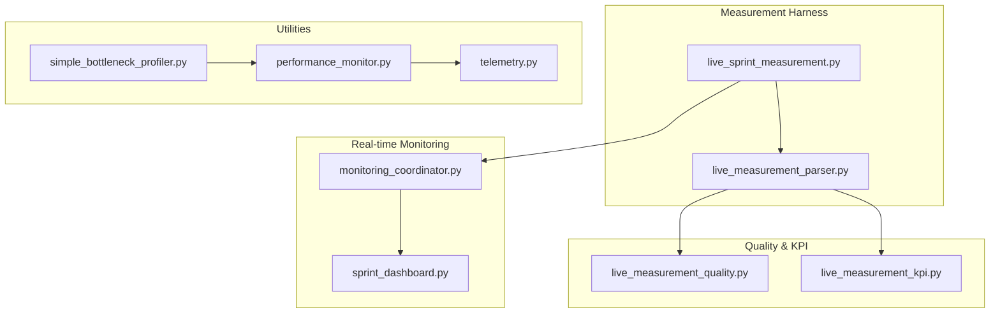
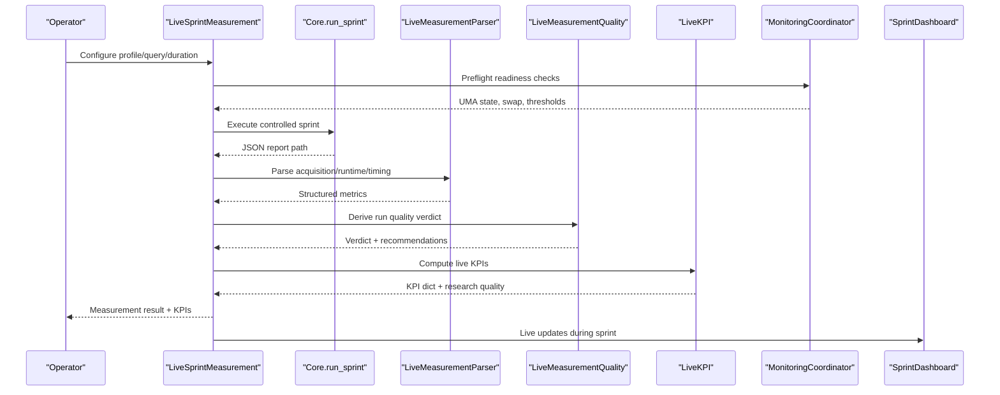
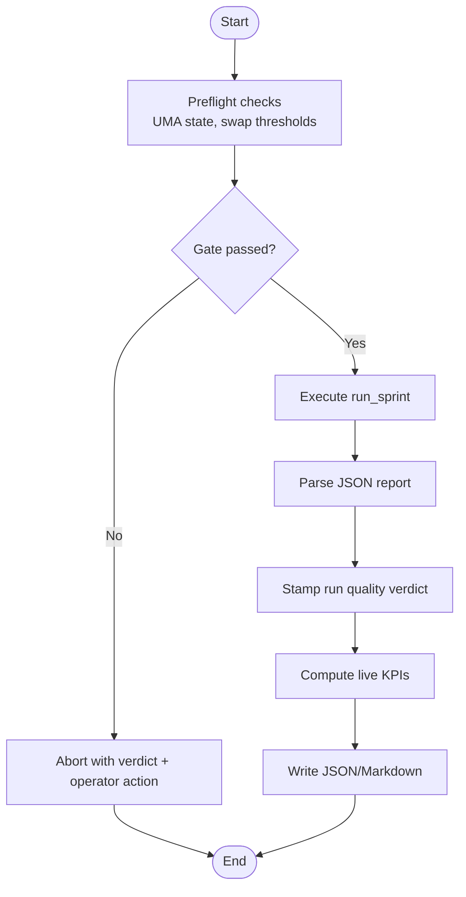
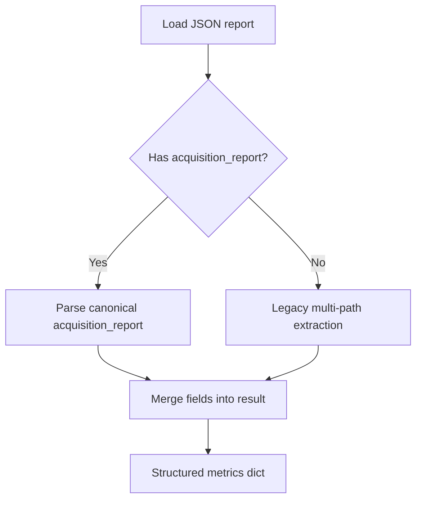
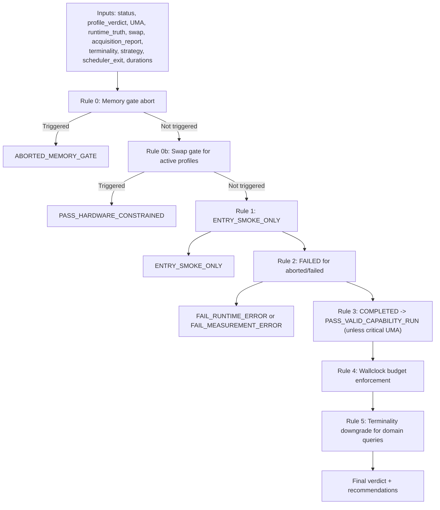
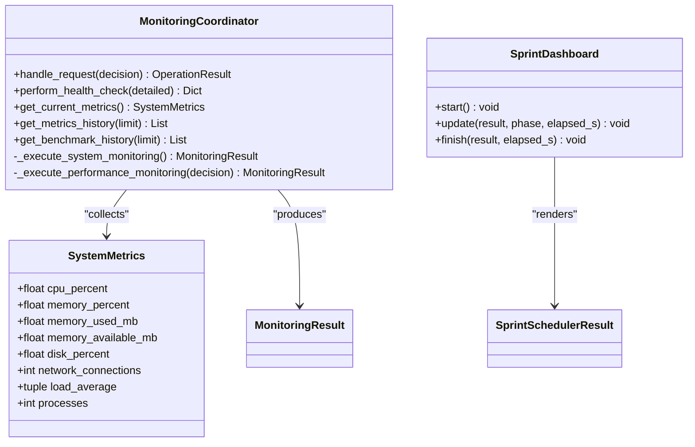
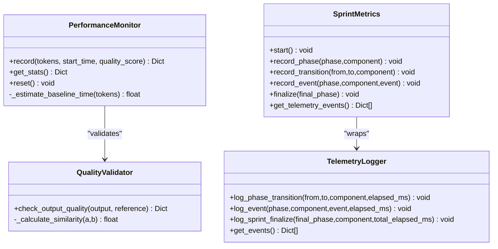
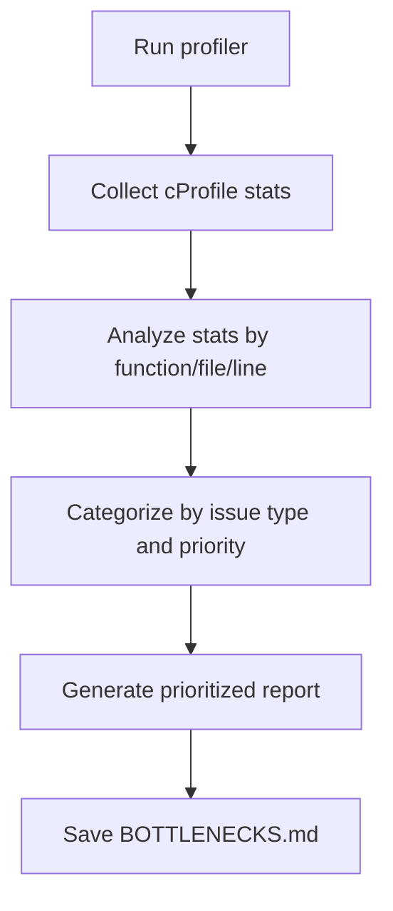
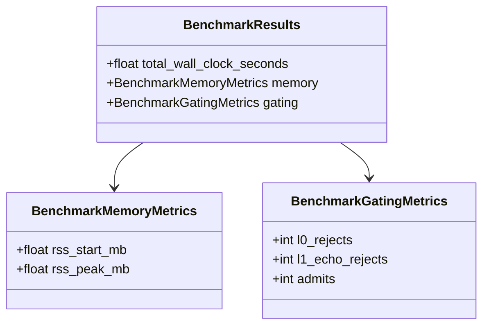
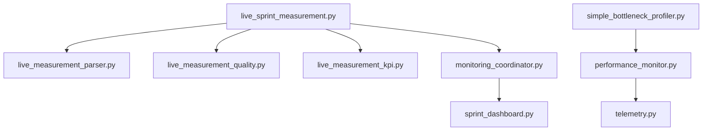

# Performance Measurement

<cite>
**Referenced Files in This Document**
- [live_sprint_measurement.py](file://benchmarks/live_sprint_measurement.py)
- [live_measurement_parser.py](file://benchmarks/live_measurement_parser.py)
- [live_measurement_kpi.py](file://benchmarks/live_measurement_kpi.py)
- [live_measurement_quality.py](file://benchmarks/live_measurement_quality.py)
- [monitoring_coordinator.py](file://coordinators/monitoring_coordinator.py)
- [sprint_dashboard.py](file://monitoring/sprint_dashboard.py)
- [performance_monitor.py](file://utils/performance_monitor.py)
- [telemetry.py](file://runtime/telemetry.py)
- [simple_bottleneck_profiler.py](file://tests/profiling/simple_bottleneck_profiler.py)
- [test_sprint82j_benchmark.py](file://tests/test_sprint82j_benchmark.py)
- [sprint_scheduler.py](file://runtime/sprint_scheduler.py)
</cite>

## Table of Contents
1. [Introduction](#introduction)
2. [Project Structure](#project-structure)
3. [Core Components](#core-components)
4. [Architecture Overview](#architecture-overview)
5. [Detailed Component Analysis](#detailed-component-analysis)
6. [Dependency Analysis](#dependency-analysis)
7. [Performance Considerations](#performance-considerations)
8. [Troubleshooting Guide](#troubleshooting-guide)
9. [Conclusion](#conclusion)

## Introduction
This document explains Hledac Universal's performance measurement capabilities and KPI tracking. It covers live measurement systems, quality metrics computation, parser performance evaluation, sprint-level tracking, real-time monitoring, bottleneck identification, instrumentation, data collection strategies, and profiling techniques. It also provides practical guidance for measuring inference latency, memory usage, throughput, and accuracy metrics, along with optimization workflows, hot spot detection, and resource utilization analysis.

## Project Structure
The performance measurement stack is organized around:
- Live sprint measurement harness that executes controlled sprints and captures structured telemetry
- Parser that extracts canonical acquisition and runtime signals from sprint reports
- Quality and KPI derivation modules that transform signals into actionable metrics
- Real-time monitoring and dashboarding for live sprint visibility
- Utility monitors for system telemetry and performance tracking
- Telemetry seam for structured logging and event attribution

**Diagram sources**
- [live_sprint_measurement.py:1-732](file://benchmarks/live_sprint_measurement.py#L1-L732)
- [live_measurement_parser.py:1-403](file://benchmarks/live_measurement_parser.py#L1-L403)
- [live_measurement_quality.py:1-272](file://benchmarks/live_measurement_quality.py#L1-L272)
- [live_measurement_kpi.py:1-935](file://benchmarks/live_measurement_kpi.py#L1-L935)
- [monitoring_coordinator.py:1-1209](file://coordinators/monitoring_coordinator.py#L1-L1209)
- [sprint_dashboard.py:1-269](file://monitoring/sprint_dashboard.py#L1-L269)
- [performance_monitor.py:1-537](file://utils/performance_monitor.py#L1-L537)
- [telemetry.py:1-370](file://runtime/telemetry.py#L1-L370)
- [simple_bottleneck_profiler.py:1-658](file://tests/profiling/simple_bottleneck_profiler.py#L1-L658)

**Section sources**
- [live_sprint_measurement.py:1-732](file://benchmarks/live_sprint_measurement.py#L1-L732)
- [live_measurement_parser.py:1-403](file://benchmarks/live_measurement_parser.py#L1-L403)
- [live_measurement_quality.py:1-272](file://benchmarks/live_measurement_quality.py#L1-L272)
- [live_measurement_kpi.py:1-935](file://benchmarks/live_measurement_kpi.py#L1-L935)
- [monitoring_coordinator.py:1-1209](file://coordinators/monitoring_coordinator.py#L1-L1209)
- [sprint_dashboard.py:1-269](file://monitoring/sprint_dashboard.py#L1-L269)
- [performance_monitor.py:1-537](file://utils/performance_monitor.py#L1-L537)
- [telemetry.py:1-370](file://runtime/telemetry.py#L1-L370)
- [simple_bottleneck_profiler.py:1-658](file://tests/profiling/simple_bottleneck_profiler.py#L1-L658)

## Core Components
- Live sprint measurement harness: orchestrates controlled sprints, validates readiness, captures UMA state, and writes structured results with KPIs and quality verdicts.
- Live measurement parser: extracts canonical acquisition report, runtime truth, timing truth, and guard observations from sprint JSON reports.
- Quality and KPI modules: compute run quality verdicts, derive live KPIs (findings/min, feed dominance, next action, wallclock budget enforcement), and integrate research quality scoring.
- Monitoring coordinator: performs system and performance benchmarking, collects historical metrics, and triggers alerts.
- Sprint dashboard: renders live sprint progress and key metrics in the terminal.
- Performance monitor: tracks generations, tokens/sec, speedup vs. baseline, and integrates quality validation.
- Telemetry: minimal structured logging with session-scoped events and bounded history.
- Bottleneck profiler: identifies hot spots using built-in profiling tools.

**Section sources**
- [live_sprint_measurement.py:295-628](file://benchmarks/live_sprint_measurement.py#L295-L628)
- [live_measurement_parser.py:37-223](file://benchmarks/live_measurement_parser.py#L37-L223)
- [live_measurement_quality.py:109-235](file://benchmarks/live_measurement_quality.py#L109-L235)
- [live_measurement_kpi.py:180-800](file://benchmarks/live_measurement_kpi.py#L180-L800)
- [monitoring_coordinator.py:394-509](file://coordinators/monitoring_coordinator.py#L394-L509)
- [sprint_dashboard.py:66-269](file://monitoring/sprint_dashboard.py#L66-L269)
- [performance_monitor.py:69-140](file://utils/performance_monitor.py#L69-L140)
- [telemetry.py:107-370](file://runtime/telemetry.py#L107-L370)
- [simple_bottleneck_profiler.py:51-658](file://tests/profiling/simple_bottleneck_profiler.py#L51-L658)

## Architecture Overview
The measurement architecture combines deterministic harness execution with robust parsing and quality/KPI derivation, while providing real-time monitoring and dashboards.

**Diagram sources**
- [live_sprint_measurement.py:436-628](file://benchmarks/live_sprint_measurement.py#L436-L628)
- [live_measurement_parser.py:376-403](file://benchmarks/live_measurement_parser.py#L376-L403)
- [live_measurement_quality.py:109-235](file://benchmarks/live_measurement_quality.py#L109-L235)
- [live_measurement_kpi.py:180-287](file://benchmarks/live_measurement_kpi.py#L180-L287)
- [monitoring_coordinator.py:394-466](file://coordinators/monitoring_coordinator.py#L394-L466)
- [sprint_dashboard.py:96-136](file://monitoring/sprint_dashboard.py#L96-L136)

## Detailed Component Analysis

### Live Sprint Measurement Harness
- Profiles: smoke180, active300, active600 with canonical acquisition profiles and expected windows.
- Safety gates: memory gate aborts, swap threshold checks, and hardware-constrained flags.
- Execution: orchestrates run_sprint, captures UMA pre/post, parses report, stamps profile and quality verdict, computes live KPIs, and writes JSON/markdown outputs.
- Instrumentation: records runtime authority evidence, module/file timestamps, and environment state.

**Diagram sources**
- [live_sprint_measurement.py:295-628](file://benchmarks/live_sprint_measurement.py#L295-L628)

**Section sources**
- [live_sprint_measurement.py:66-127](file://benchmarks/live_sprint_measurement.py#L66-L127)
- [live_sprint_measurement.py:295-628](file://benchmarks/live_sprint_measurement.py#L295-L628)

### Live Measurement Parser
- Canonical acquisition report parsing prioritizes acquisition_report schema, then falls back to legacy extraction.
- Extracts runtime truth, timing truth, public pipeline, acquisition strategy, windup/return guards, scheduler exit, and acquisition prelude/terminality fields.
- Provides pure predicates for terminality and scheduler exit presence.

**Diagram sources**
- [live_measurement_parser.py:37-223](file://benchmarks/live_measurement_parser.py#L37-L223)
- [live_measurement_parser.py:229-369](file://benchmarks/live_measurement_parser.py#L229-L369)

**Section sources**
- [live_measurement_parser.py:37-223](file://benchmarks/live_measurement_parser.py#L37-L223)
- [live_measurement_parser.py:229-369](file://benchmarks/live_measurement_parser.py#L229-L369)

### Live Measurement Quality and KPI Derivation
- Quality verdict derivation:
  - Memory gate aborts take priority.
  - Swap gate triggers hardware-constrained verdict for active profiles.
  - Entry smoke-only for smoke profiles.
  - Runtime errors and aborted runs downgrade to failure.
  - Completed runs derive PASS_VALID_CAPABILITY_RUN unless hardware-constrained.
  - Wallclock budget enforcement overrides terminality failures.
  - Terminality downgrade for domain queries requires schema version, terminality satisfaction, non-empty source outcomes, and non-empty scheduler exit path.
- KPI derivation:
  - Computes findings totals, accepted findings, cycles, findings per minute, feed dominance, next action, wallclock budget enforcement, nonfeed starvation indicators, guard observations, scheduler deadlines, and CT bridge telemetry.

**Diagram sources**
- [live_measurement_quality.py:109-235](file://benchmarks/live_measurement_quality.py#L109-L235)
- [live_measurement_kpi.py:180-800](file://benchmarks/live_measurement_kpi.py#L180-L800)

**Section sources**
- [live_measurement_quality.py:109-235](file://benchmarks/live_measurement_quality.py#L109-L235)
- [live_measurement_kpi.py:180-800](file://benchmarks/live_measurement_kpi.py#L180-L800)

### Real-time Monitoring and Dashboard
- Monitoring coordinator:
  - System metrics via psutil (CPU, memory, disk, connections).
  - Performance benchmarking (CPU-bound, memory-bound, general).
  - Historical metrics tracking (last N entries), alert thresholds, and background collection.
  - Routes monitoring decisions to advanced, watchdog, system, or performance backends.
- Sprint dashboard:
  - Live rendering of phase, elapsed/remaining time, findings, cycles, sources, branch/blocker status, governor state, and kill-chain tags.

**Diagram sources**
- [monitoring_coordinator.py:394-509](file://coordinators/monitoring_coordinator.py#L394-L509)
- [monitoring_coordinator.py:515-541](file://coordinators/monitoring_coordinator.py#L515-L541)
- [sprint_dashboard.py:66-269](file://monitoring/sprint_dashboard.py#L66-L269)

**Section sources**
- [monitoring_coordinator.py:394-509](file://coordinators/monitoring_coordinator.py#L394-L509)
- [monitoring_coordinator.py:515-541](file://coordinators/monitoring_coordinator.py#L515-L541)
- [sprint_dashboard.py:66-269](file://monitoring/sprint_dashboard.py#L66-L269)

### Performance Monitor and Telemetry
- Performance monitor:
  - Tracks generations, tokens, duration, speedup vs. baseline, and quality scores.
  - Provides stats for tokens/sec and average speedup.
- Telemetry:
  - Structured logging with session-scoped events, bounded history, and JSON formatter.
  - SprintMetrics wraps TelemetryLogger for phase transitions and named events.

**Diagram sources**
- [performance_monitor.py:69-140](file://utils/performance_monitor.py#L69-L140)
- [performance_monitor.py:142-198](file://utils/performance_monitor.py#L142-L198)
- [telemetry.py:107-370](file://runtime/telemetry.py#L107-L370)

**Section sources**
- [performance_monitor.py:69-140](file://utils/performance_monitor.py#L69-L140)
- [performance_monitor.py:142-198](file://utils/performance_monitor.py#L142-L198)
- [telemetry.py:107-370](file://runtime/telemetry.py#L107-L370)

### Bottleneck Profiling and Hot Spot Detection
- Simple bottleneck profiler:
  - Uses Python’s built-in cProfile and pstats to profile code.
  - Identifies functions with long execution times, memory usage patterns, import bottlenecks, large file operations, and configuration loading issues.
  - Generates a prioritized report with optimization suggestions and estimated improvements.

**Diagram sources**
- [simple_bottleneck_profiler.py:51-658](file://tests/profiling/simple_bottleneck_profiler.py#L51-L658)

**Section sources**
- [simple_bottleneck_profiler.py:51-658](file://tests/profiling/simple_bottleneck_profiler.py#L51-L658)

### Benchmarking and Resource Utilization
- Benchmark results structure supports memory metrics and gating metrics for rejection/admissions analysis.
- Sprint scheduler tick metrics capture RSS and open FDs for lightweight state snapshots embedded in sprint reports.

**Diagram sources**
- [test_sprint82j_benchmark.py:44-77](file://tests/test_sprint82j_benchmark.py#L44-L77)
- [sprint_scheduler.py:8838-8872](file://runtime/sprint_scheduler.py#L8838-L8872)

**Section sources**
- [test_sprint82j_benchmark.py:44-77](file://tests/test_sprint82j_benchmark.py#L44-L77)
- [sprint_scheduler.py:8838-8872](file://runtime/sprint_scheduler.py#L8838-L8872)

## Dependency Analysis
- Measurement harness depends on:
  - Parser for canonical acquisition/runtime extraction
  - Quality module for run quality verdicts
  - KPI module for live KPI computation
  - Monitoring coordinator for preflight checks and system metrics
  - Dashboard for live rendering
- Utilities depend on:
  - Telemetry for structured logging
  - System metrics for resource awareness
- Bottleneck profiler is standalone and integrates with utility monitors.

**Diagram sources**
- [live_sprint_measurement.py:258-294](file://benchmarks/live_sprint_measurement.py#L258-L294)
- [live_measurement_parser.py:15-18](file://benchmarks/live_measurement_parser.py#L15-L18)
- [live_measurement_quality.py:17-20](file://benchmarks/live_measurement_quality.py#L17-L20)
- [live_measurement_kpi.py:26-37](file://benchmarks/live_measurement_kpi.py#L26-L37)
- [monitoring_coordinator.py:174-212](file://coordinators/monitoring_coordinator.py#L174-L212)
- [sprint_dashboard.py:21-29](file://monitoring/sprint_dashboard.py#L21-L29)
- [performance_monitor.py:20-21](file://utils/performance_monitor.py#L20-L21)
- [telemetry.py:27-29](file://runtime/telemetry.py#L27-L29)
- [simple_bottleneck_profiler.py:17-26](file://tests/profiling/simple_bottleneck_profiler.py#L17-L26)

**Section sources**
- [live_sprint_measurement.py:258-294](file://benchmarks/live_sprint_measurement.py#L258-L294)
- [live_measurement_parser.py:15-18](file://benchmarks/live_measurement_parser.py#L15-L18)
- [live_measurement_quality.py:17-20](file://benchmarks/live_measurement_quality.py#L17-L20)
- [live_measurement_kpi.py:26-37](file://benchmarks/live_measurement_kpi.py#L26-L37)
- [monitoring_coordinator.py:174-212](file://coordinators/monitoring_coordinator.py#L174-L212)
- [sprint_dashboard.py:21-29](file://monitoring/sprint_dashboard.py#L21-L29)
- [performance_monitor.py:20-21](file://utils/performance_monitor.py#L20-L21)
- [telemetry.py:27-29](file://runtime/telemetry.py#L27-L29)
- [simple_bottleneck_profiler.py:17-26](file://tests/profiling/simple_bottleneck_profiler.py#L17-L26)

## Performance Considerations
- Prefer canonical acquisition report parsing for reliable extraction of terminality and scheduler exit signals.
- Use wallclock budget enforcement to prevent runaway sprints; combine with hardware-constrained flags for accurate verdicts.
- Track findings per minute and feed dominance to assess yield and balance across sources.
- Integrate system monitoring with background collection and alert thresholds to detect critical states early.
- Apply bottleneck profiling regularly to identify hot spots and measure before/after improvements.
- Establish baselines for tokens/sec and throughput to quantify speedup and regressions.

## Troubleshooting Guide
- Memory gate aborts: resolve memory pressure or use preflight checks to abort before live execution.
- Swap gate warnings: restart to clear swap or use allow-high-swap with non-comparable results.
- Terminality failures: ensure acquisition_report schema version, terminality satisfaction, non-empty source outcomes, and non-empty scheduler exit path.
- Wallclock budget exceeded: reduce planned duration or improve runtime efficiency.
- System alerts: monitor CPU/memory/disk thresholds and adjust workload accordingly.
- Live dashboards: verify Rich availability and ensure proper initialization for live updates.

**Section sources**
- [live_sprint_measurement.py:351-434](file://benchmarks/live_sprint_measurement.py#L351-L434)
- [live_sprint_measurement.py:436-628](file://benchmarks/live_sprint_measurement.py#L436-L628)
- [live_measurement_quality.py:109-235](file://benchmarks/live_measurement_quality.py#L109-L235)
- [monitoring_coordinator.py:546-579](file://coordinators/monitoring_coordinator.py#L546-L579)
- [sprint_dashboard.py:96-136](file://monitoring/sprint_dashboard.py#L96-L136)

## Conclusion
Hledac Universal provides a comprehensive performance measurement framework: deterministic live sprint harness, robust parsing and quality/KPI derivation, real-time monitoring and dashboards, and profiling tools for hot spot detection. By leveraging structured telemetry, canonical acquisition reports, and system-aware monitoring, teams can track KPIs, enforce budgets, identify bottlenecks, and maintain performance baselines across sprints.