# Quality Assurance

<cite>
**Referenced Files in This Document**
- [core_readiness_gate.py](file://tools/core_readiness_gate.py)
- [prelive_decision_gate.py](file://tools/prelive_decision_gate.py)
- [live_multisource_validator.py](file://tools/live_multisource_validator.py)
- [live_result_sanity.py](file://tools/live_result_sanity.py)
- [research_quality_score.py](file://tools/research_quality_score.py)
- [live_sprint_measurement.py](file://benchmarks/live_sprint_measurement.py)
- [research_effectiveness.py](file://benchmarks/research_effectiveness.py)
- [sprint_dashboard.py](file://monitoring/sprint_dashboard.py)
- [validation_coordinator.py](file://coordinators/validation_coordinator.py)
- [monitoring_coordinator.py](file://coordinators/monitoring_coordinator.py)
- [run_comprehensive_tests.py](file://run_comprehensive_tests.py)
- [run_baseline.py](file://run_baseline.py)
- [test_research_depth_metric.py](file://tests/test_research_depth_metric.py)
- [f234_nonfeed_diagnostic_preflight.py](file://tools/f234_nonfeed_diagnostic_preflight.py)
- [final_prelive_readiness.py](file://tools/final_prelive_readiness.py)
- [run_live_validation_pack.py](file://tools/run_live_validation_pack.py)
- [report_truth_trace.py](file://tools/report_truth_trace.py)
- [evidence_log.py](file://evidence_log.py)
</cite>

## Table of Contents
1. [Introduction](#introduction)
2. [Project Structure](#project-structure)
3. [Core Components](#core-components)
4. [Architecture Overview](#architecture-overview)
5. [Detailed Component Analysis](#detailed-component-analysis)
6. [Dependency Analysis](#dependency-analysis)
7. [Performance Considerations](#performance-considerations)
8. [Troubleshooting Guide](#troubleshooting-guide)
9. [Conclusion](#conclusion)
10. [Appendices](#appendices)

## Introduction
This document describes the quality assurance processes and validation strategies implemented in Hledac Universal. It explains quality gates, research depth metrics, and dashboard-based monitoring systems. It documents automated validation procedures, regression testing workflows, and continuous quality assessment. It also covers sprint-level quality checks, research cycle validation, and output verification processes, with examples of quality report generation, metric interpretation, and issue tracking workflows. Finally, it provides best practices, test coverage requirements, and validation criteria for maintaining quality standards across development phases.

## Project Structure
Quality assurance in Hledac Universal is implemented through:
- Pre-live and core readiness gates that validate environment and artifacts before live execution
- Live validation and sanity checking that ensure terminality, quality gates, and trace consistency
- Research effectiveness and depth metrics that quantify research quality and breadth
- Dashboard monitoring for real-time visibility into sprint execution
- Comprehensive test runners and baseline profiles for continuous regression testing
- Validation and monitoring coordinators for integrated quality orchestration

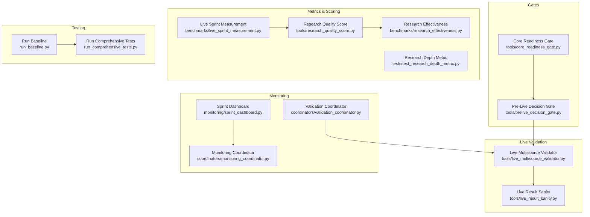

**Diagram sources**
- [core_readiness_gate.py:1-331](file://tools/core_readiness_gate.py#L1-L331)
- [prelive_decision_gate.py:1-800](file://tools/prelive_decision_gate.py#L1-L800)
- [live_multisource_validator.py:1-1066](file://tools/live_multisource_validator.py#L1-L1066)
- [live_result_sanity.py:1-929](file://tools/live_result_sanity.py#L1-L929)
- [research_quality_score.py:675-713](file://tools/research_quality_score.py#L675-L713)
- [live_sprint_measurement.py:286-293](file://benchmarks/live_sprint_measurement.py#L286-L293)
- [research_effectiveness.py:1-757](file://benchmarks/research_effectiveness.py#L1-L757)
- [test_research_depth_metric.py:1-915](file://tests/test_research_depth_metric.py#L1-L915)
- [sprint_dashboard.py:1-269](file://monitoring/sprint_dashboard.py#L1-L269)
- [validation_coordinator.py:1-493](file://coordinators/validation_coordinator.py#L1-L493)
- [monitoring_coordinator.py:424-466](file://coordinators/monitoring_coordinator.py#L424-L466)
- [run_comprehensive_tests.py:1-901](file://run_comprehensive_tests.py#L1-L901)
- [run_baseline.py:1-434](file://run_baseline.py#L1-L434)

**Section sources**
- [core_readiness_gate.py:1-331](file://tools/core_readiness_gate.py#L1-L331)
- [prelive_decision_gate.py:1-800](file://tools/prelive_decision_gate.py#L1-L800)
- [live_multisource_validator.py:1-1066](file://tools/live_multisource_validator.py#L1-L1066)
- [live_result_sanity.py:1-929](file://tools/live_result_sanity.py#L1-L929)
- [research_quality_score.py:675-713](file://tools/research_quality_score.py#L675-L713)
- [live_sprint_measurement.py:286-293](file://benchmarks/live_sprint_measurement.py#L286-L293)
- [research_effectiveness.py:1-757](file://benchmarks/research_effectiveness.py#L1-L757)
- [test_research_depth_metric.py:1-915](file://tests/test_research_depth_metric.py#L1-L915)
- [sprint_dashboard.py:1-269](file://monitoring/sprint_dashboard.py#L1-L269)
- [validation_coordinator.py:1-493](file://coordinators/validation_coordinator.py#L1-L493)
- [monitoring_coordinator.py:424-466](file://coordinators/monitoring_coordinator.py#L424-L466)
- [run_comprehensive_tests.py:1-901](file://run_comprehensive_tests.py#L1-L901)
- [run_baseline.py:1-434](file://run_baseline.py#L1-L434)

## Core Components
- Core Readiness Gate: Validates import and compilation readiness without MLX, network, or production edits; produces human and machine-readable reports.
- Pre-Live Decision Gate: Deterministic decision engine that checks artifacts, memory constraints, provider surface, and blocking/warning probes; determines readiness for live execution.
- Live Multisource Validator: Validates terminality, source outcomes, guards, and prelude conditions from benchmark/internal artifacts; supports multiple schema variants.
- Live Result Sanity: Meta-checker comparing benchmark, validation, and trace surfaces; detects stale terminality, wallclock budget violations, and quality mismatches.
- Research Quality Score: Computes research quality metrics including depth, evidence diagnostics, and quality gates; integrates with live KPIs.
- Research Effectiveness: Aggregates breadth, depth, quality, and friction metrics into a composite scorecard.
- Sprint Dashboard: Real-time terminal dashboard for live sprint monitoring with phase, findings, and governor state.
- Validation and Monitoring Coordinators: Integrated subsystems for data validation, content cleaning, and system/performance monitoring.
- Test Runners: Comprehensive test suite with HTML/JSON reports, coverage, and memory profiling; baseline runner for reproducible probe lane validation.

**Section sources**
- [core_readiness_gate.py:1-331](file://tools/core_readiness_gate.py#L1-L331)
- [prelive_decision_gate.py:1-800](file://tools/prelive_decision_gate.py#L1-L800)
- [live_multisource_validator.py:1-1066](file://tools/live_multisource_validator.py#L1-L1066)
- [live_result_sanity.py:1-929](file://tools/live_result_sanity.py#L1-L929)
- [research_quality_score.py:675-713](file://tools/research_quality_score.py#L675-L713)
- [research_effectiveness.py:1-757](file://benchmarks/research_effectiveness.py#L1-L757)
- [sprint_dashboard.py:1-269](file://monitoring/sprint_dashboard.py#L1-L269)
- [validation_coordinator.py:1-493](file://coordinators/validation_coordinator.py#L1-L493)
- [monitoring_coordinator.py:424-466](file://coordinators/monitoring_coordinator.py#L424-L466)
- [run_comprehensive_tests.py:1-901](file://run_comprehensive_tests.py#L1-L901)
- [run_baseline.py:1-434](file://run_baseline.py#L1-L434)

## Architecture Overview
The quality assurance architecture centers around deterministic gates and validators that operate on artifact surfaces. Live validation ensures terminality satisfaction and quality gates, while research metrics provide quantitative measures of depth and effectiveness. Dashboards and coordinators offer continuous monitoring and integrated validation.

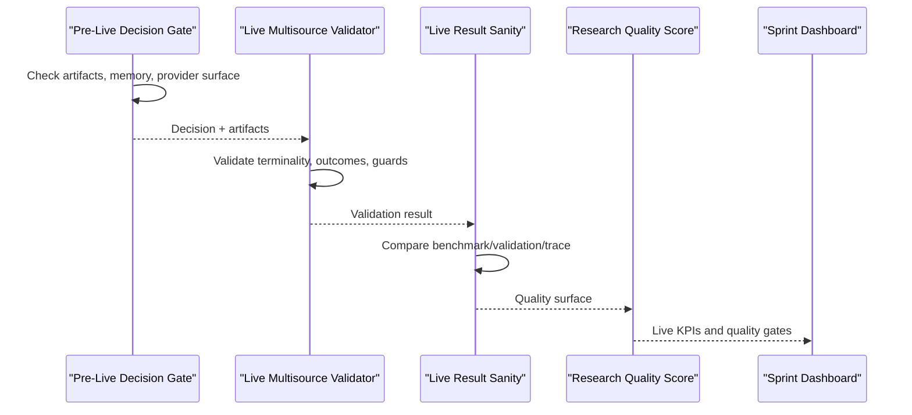

**Diagram sources**
- [prelive_decision_gate.py:690-800](file://tools/prelive_decision_gate.py#L690-L800)
- [live_multisource_validator.py:565-800](file://tools/live_multisource_validator.py#L565-L800)
- [live_result_sanity.py:723-800](file://tools/live_result_sanity.py#L723-L800)
- [research_quality_score.py:675-713](file://tools/research_quality_score.py#L675-L713)
- [sprint_dashboard.py:1-269](file://monitoring/sprint_dashboard.py#L1-L269)

## Detailed Component Analysis

### Core Readiness Gate
- Purpose: Compile and import smoke test for core runtime surfaces; no MLX, no network.
- Scope: Directories and modules configured as compile/import targets.
- Output: Verdict (READY/READY_WITH_WARNINGS/BLOCKED), compile/import errors, warnings, and optional MLX load attempt detection.

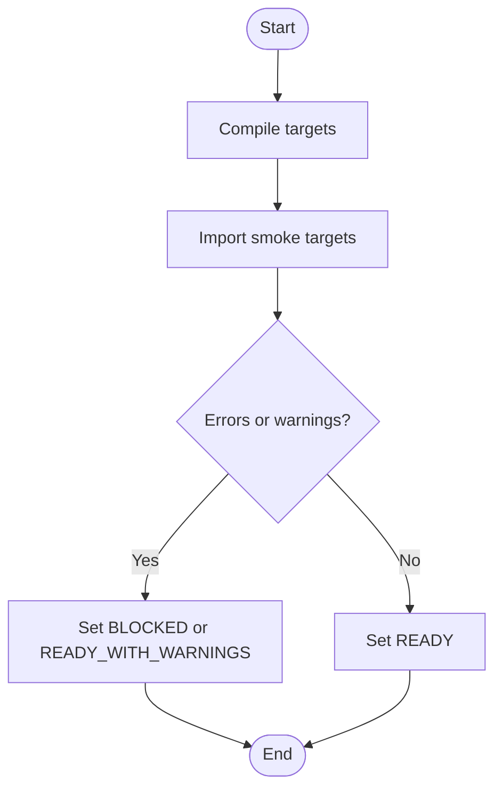

**Diagram sources**
- [core_readiness_gate.py:217-267](file://tools/core_readiness_gate.py#L217-L267)

**Section sources**
- [core_readiness_gate.py:1-331](file://tools/core_readiness_gate.py#L1-L331)

### Pre-Live Decision Gate
- Purpose: Deterministic decision without live execution; checks memory, zero-findings quality, provider surface, and blocking/warning artifacts.
- Decision outcomes: READY_FOR_LIVE, READY_FOR_LIVE_HARDWARE_TAINTED, READY_FOR_FEED_BASELINE_ONLY, BLOCKED_BY_PROVIDER_SURFACE, BLOCKED_BY_CONTRACT, BLOCKED_BY_MEMORY, BLOCKED_BY_UNKNOWN.
- Artifacts: F224 and F231 packs with blocking and warning probes; provider surface aliasing; acquisition prelude awareness.

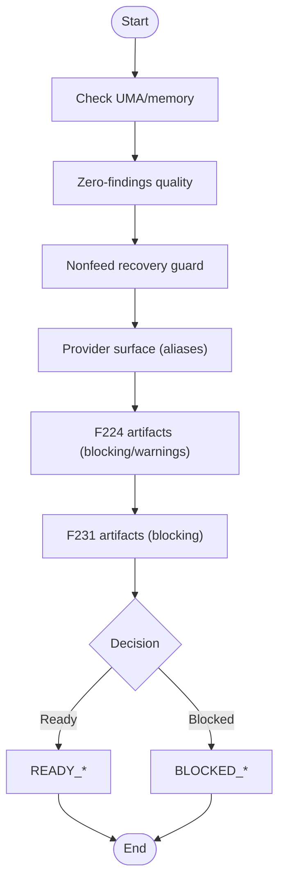

**Diagram sources**
- [prelive_decision_gate.py:690-800](file://tools/prelive_decision_gate.py#L690-L800)

**Section sources**
- [prelive_decision_gate.py:1-800](file://tools/prelive_decision_gate.py#L1-L800)

### Live Multisource Validator
- Purpose: Validate terminality, source outcomes, guards, and prelude conditions from benchmark/internal artifacts.
- Verdict taxonomy: PASS_MULTISOURCE_TERMINALITY, FAIL_TERMINALITY_NOT_CHECKED, FAIL_TERMINALITY_NOT_SATISFIED, FAIL_MISSING_SOURCE_OUTCOMES, FAIL_PUBLIC_NOT_TERMINAL, FAIL_CT_NOT_TERMINAL, FAIL_SCHEDULER_EXIT_MISSING, FAIL_RETURN_GUARD_MISSING, FAIL_HARDWARE_TAINTED, FAIL_ACQUISITION_PRELUDE_NOT_CHECKED, FAIL_ACQUISITION_PRELUDE_MISSING_LANES, FAIL_TERMINALITY_STALE_AFTER_PRELUDE, FAIL_TERMINALITY_STALE_SNAPSHOT, FAIL_PUBLIC_ACCEPTANCE_KPI, WARN_PUBLIC_ACCEPTANCE_KPI.
- Features: Shape-aware extraction, guard alias resolution, stale terminality detection, acquisition prelude rules.

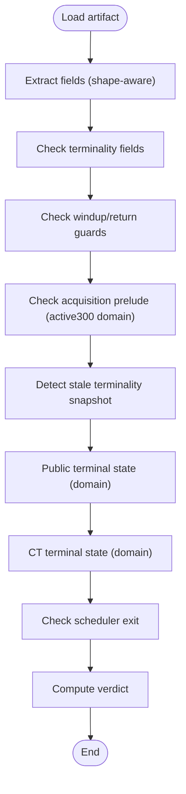

**Diagram sources**
- [live_multisource_validator.py:565-800](file://tools/live_multisource_validator.py#L565-L800)

**Section sources**
- [live_multisource_validator.py:1-1066](file://tools/live_multisource_validator.py#L1-L1066)

### Live Result Sanity
- Purpose: Meta-checker comparing benchmark, validation, and trace surfaces; detects disagreements and inconsistencies.
- Surfaces: BenchmarkSurface, ValidatorSurface, TraceSurface, QualitySurface.
- Checks: Benchmark-validator pass-through, stale terminality, shape gaps, wallclock budget, feed-only vs attempted nonfeed, nonfeed evidence missing, CT loss telemetry, public surface presence, research quality gate, hardware constrained comparable, swap gate comparable.

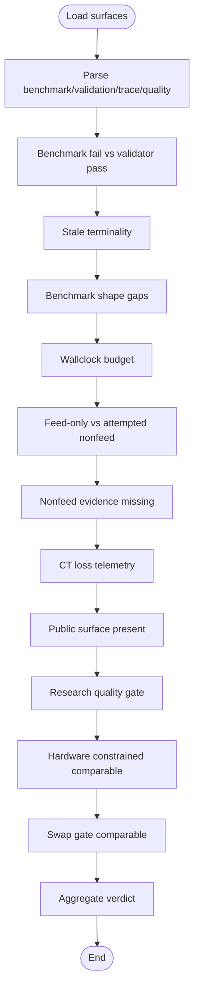

**Diagram sources**
- [live_result_sanity.py:723-800](file://tools/live_result_sanity.py#L723-L800)

**Section sources**
- [live_result_sanity.py:1-929](file://tools/live_result_sanity.py#L1-L929)

### Research Quality Score and Live KPI Integration
- Purpose: Compute research quality metrics and integrate with live KPIs to derive quality gates and comparability.
- Integration: Live sprint measurement derives live KPIs and embeds research quality; quality surface parsing supports fallback from embedded research_quality.

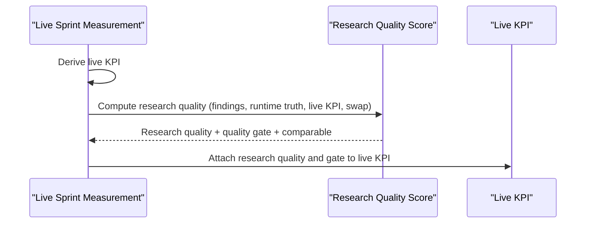

**Diagram sources**
- [live_sprint_measurement.py:286-293](file://benchmarks/live_sprint_measurement.py#L286-L293)
- [research_quality_score.py:675-713](file://tools/research_quality_score.py#L675-L713)

**Section sources**
- [live_sprint_measurement.py:286-293](file://benchmarks/live_sprint_measurement.py#L286-L293)
- [research_quality_score.py:675-713](file://tools/research_quality_score.py#L675-L713)

### Research Effectiveness Scorecard
- Purpose: Aggregate breadth, depth, quality, and friction metrics into a composite scorecard.
- Indexes: Research Breadth Index, Research Depth Index, Research Quality Index, Research Friction Index, DeepResearch Power Score.
- Outputs: JSON and human-readable markdown reports.

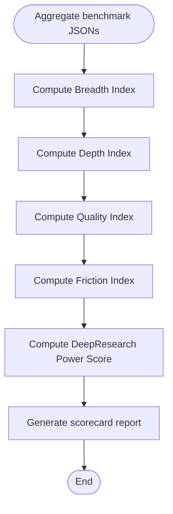

**Diagram sources**
- [research_effectiveness.py:639-668](file://benchmarks/research_effectiveness.py#L639-L668)

**Section sources**
- [research_effectiveness.py:1-757](file://benchmarks/research_effectiveness.py#L1-L757)

### Sprint Dashboard and Monitoring
- Purpose: Real-time monitoring of live sprints with phase, findings, cycles, and governor state.
- Monitoring Coordinator: Executes system and performance monitoring; returns metrics and alerts.

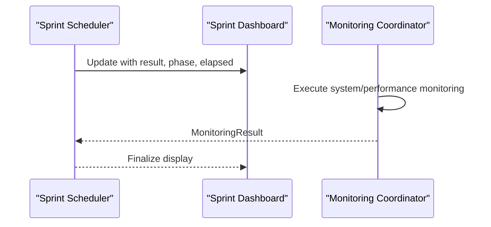

**Diagram sources**
- [sprint_dashboard.py:96-136](file://monitoring/sprint_dashboard.py#L96-L136)
- [monitoring_coordinator.py:446-466](file://coordinators/monitoring_coordinator.py#L446-L466)

**Section sources**
- [sprint_dashboard.py:1-269](file://monitoring/sprint_dashboard.py#L1-L269)
- [monitoring_coordinator.py:424-466](file://coordinators/monitoring_coordinator.py#L424-L466)

### Validation and Content Cleaning
- Purpose: Integrated validation and content cleaning with caching, MLX support, and multi-format output.
- Features: Data validation (email, URL, JSON schema), content cleaning (HTML to Markdown/JSON/Text), language detection, custom validators.

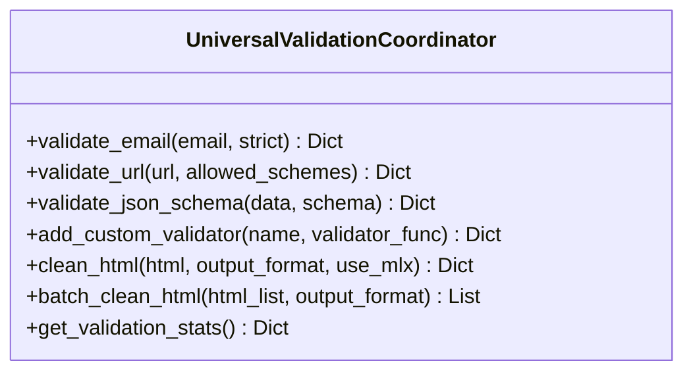

**Diagram sources**
- [validation_coordinator.py:81-493](file://coordinators/validation_coordinator.py#L81-L493)

**Section sources**
- [validation_coordinator.py:1-493](file://coordinators/validation_coordinator.py#L1-L493)

### Regression Testing and Continuous Quality
- Run Comprehensive Tests: Executes multiple test suites with HTML/JSON reports, coverage, and memory profiling.
- Run Baseline: Reproducible baseline runner for probe lanes; collects inventory and runs smoke plus probe lanes; reports known failures.

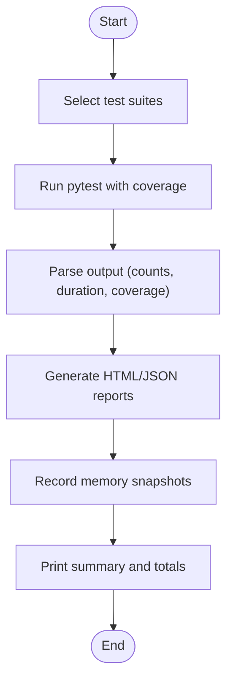

**Diagram sources**
- [run_comprehensive_tests.py:696-800](file://run_comprehensive_tests.py#L696-L800)
- [run_baseline.py:281-391](file://run_baseline.py#L281-L391)

**Section sources**
- [run_comprehensive_tests.py:1-901](file://run_comprehensive_tests.py#L1-L901)
- [run_baseline.py:1-434](file://run_baseline.py#L1-L434)

### Research Depth Metric (Hermetic Contracts)
- Purpose: Hermetic lane stability contract tests for research depth computation from canonical surfaces.
- Contracts: Output shape stability, score bounds [0.0, 100.0], level thresholds, component contributions (source diversity, non-indexed ratio, corroboration, branch diversity, pivot depth), and canonical surface usage.

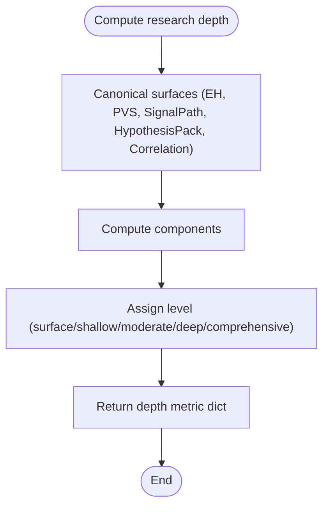

**Diagram sources**
- [test_research_depth_metric.py:1-915](file://tests/test_research_depth_metric.py#L1-L915)

**Section sources**
- [test_research_depth_metric.py:1-915](file://tests/test_research_depth_metric.py#L1-L915)

### Additional Quality Tools
- Final Prelive Readiness: Orchestrates prelive readiness checks and cleans checked reports for display.
- Run Live Validation Pack: Builds commands for benchmark, validation, and truth trace generation.
- Report Truth Trace: Generates human-readable truth trace reports with verdicts and measurements.
- Evidence Log Health: Computes health indicators and identifies weaknesses from event funnels and quality breaks.

**Section sources**
- [final_prelive_readiness.py:366-380](file://tools/final_prelive_readiness.py#L366-L380)
- [run_live_validation_pack.py:36-74](file://tools/run_live_validation_pack.py#L36-L74)
- [report_truth_trace.py:395-417](file://tools/report_truth_trace.py#L395-L417)
- [evidence_log.py:1832-1862](file://evidence_log.py#L1832-L1862)

## Dependency Analysis
Quality assurance components depend on:
- Artifact surfaces (benchmark, validation, trace, quality) for cross-checking
- Live KPIs for research quality integration
- Canonical source family outcomes for terminality validation
- Memory governor snapshots for dashboard and sanity checks

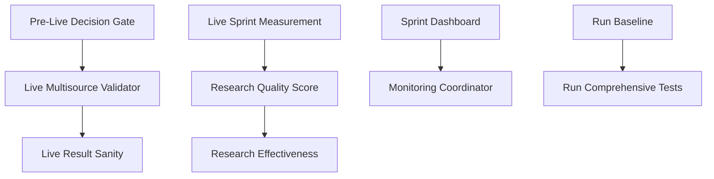

**Diagram sources**
- [prelive_decision_gate.py:690-800](file://tools/prelive_decision_gate.py#L690-L800)
- [live_multisource_validator.py:565-800](file://tools/live_multisource_validator.py#L565-L800)
- [live_result_sanity.py:723-800](file://tools/live_result_sanity.py#L723-L800)
- [live_sprint_measurement.py:286-293](file://benchmarks/live_sprint_measurement.py#L286-L293)
- [research_quality_score.py:675-713](file://tools/research_quality_score.py#L675-L713)
- [research_effectiveness.py:639-668](file://benchmarks/research_effectiveness.py#L639-L668)
- [sprint_dashboard.py:1-269](file://monitoring/sprint_dashboard.py#L1-L269)
- [monitoring_coordinator.py:424-466](file://coordinators/monitoring_coordinator.py#L424-L466)
- [run_baseline.py:281-391](file://run_baseline.py#L281-L391)
- [run_comprehensive_tests.py:696-800](file://run_comprehensive_tests.py#L696-L800)

**Section sources**
- [prelive_decision_gate.py:1-800](file://tools/prelive_decision_gate.py#L1-L800)
- [live_multisource_validator.py:1-1066](file://tools/live_multisource_validator.py#L1-L1066)
- [live_result_sanity.py:1-929](file://tools/live_result_sanity.py#L1-L929)
- [research_quality_score.py:1-713](file://tools/research_quality_score.py#L1-L713)
- [research_effectiveness.py:1-757](file://benchmarks/research_effectiveness.py#L1-L757)
- [sprint_dashboard.py:1-269](file://monitoring/sprint_dashboard.py#L1-L269)
- [monitoring_coordinator.py:424-466](file://coordinators/monitoring_coordinator.py#L424-L466)
- [run_baseline.py:1-434](file://run_baseline.py#L1-L434)
- [run_comprehensive_tests.py:1-901](file://run_comprehensive_tests.py#L1-L901)

## Performance Considerations
- Memory monitoring during test execution to track peak usage and phase transitions.
- Coverage reporting via pytest-cov when available.
- Dashboard refresh cadence optimized for readability without excessive overhead.
- Validation coordinator leverages caching and fallbacks to minimize latency.

[No sources needed since this section provides general guidance]

## Troubleshooting Guide
Common issues and resolutions:
- Hardware-constrained runs must not be marked comparable; verify research_quality_comparable consistency.
- Swap-gated active300/active600 runs must not be marked comparable; check swap_gate_triggered and comparable_result.
- Stale terminality snapshots indicate divergence between source_family_outcomes and terminality records; investigate prelude and final terminality states.
- Wallclock budget exceeded; adjust planned duration or investigate performance regressions.
- Nonfeed evidence missing despite satisfied terminality; review research quality gate and evidence depth diagnostics.

**Section sources**
- [live_result_sanity.py:682-716](file://tools/live_result_sanity.py#L682-L716)
- [live_result_sanity.py:409-427](file://tools/live_result_sanity.py#L409-L427)
- [live_result_sanity.py:488-506](file://tools/live_result_sanity.py#L488-L506)
- [f234_nonfeed_diagnostic_preflight.py:170-206](file://tools/f234_nonfeed_diagnostic_preflight.py#L170-L206)

## Conclusion
Hledac Universal employs a robust, layered quality assurance framework: deterministic pre-live gates, live validation and sanity checks, research quality and effectiveness metrics, real-time dashboards, and comprehensive test runners. These components work together to ensure reliable research outcomes, maintain quality standards across development phases, and provide actionable insights for continuous improvement.

[No sources needed since this section summarizes without analyzing specific files]

## Appendices

### Quality Gates and Decision Criteria
- Core Readiness Gate: Compile and import pass/fail; warnings treated as BLOCKED in strict mode.
- Pre-Live Decision Gate: Memory, zero-findings quality, provider surface, and artifact readiness determine readiness; hardware-tainted runs may be restricted.
- Live Multisource Validator: Terminality satisfaction, source outcomes, guards, and prelude conditions define PASS or FAIL/WARN verdicts.
- Live Result Sanity: Cross-surface agreement; detects stale terminality, budget overruns, and quality mismatches.

**Section sources**
- [core_readiness_gate.py:217-267](file://tools/core_readiness_gate.py#L217-L267)
- [prelive_decision_gate.py:690-800](file://tools/prelive_decision_gate.py#L690-L800)
- [live_multisource_validator.py:565-800](file://tools/live_multisource_validator.py#L565-L800)
- [live_result_sanity.py:723-800](file://tools/live_result_sanity.py#L723-L800)

### Research Depth Metric Interpretation
- Levels: surface (0–20), shallow (21–40), moderate (41–60), deep (61–80), comprehensive (81–100).
- Components: source diversity, non-indexed ratio, corroboration, branch diversity, pivot depth.
- Canonical surfaces: ExportHandoff, runtime truth, signal path, hypothesis pack, correlation.

**Section sources**
- [test_research_depth_metric.py:1-915](file://tests/test_research_depth_metric.py#L1-L915)

### Example Workflows
- Quality Report Generation: Use research effectiveness aggregator to produce JSON and markdown scorecards.
- Issue Tracking: Live result sanity reports discrepancies and disagreements; use these to drive fixes and prevent regressions.
- Validation Preflight: Use run_live_validation_pack to build benchmark/validation/truth trace commands; execute dry-run to preview.

**Section sources**
- [research_effectiveness.py:639-757](file://benchmarks/research_effectiveness.py#L639-L757)
- [live_result_sanity.py:142-179](file://tools/live_result_sanity.py#L142-L179)
- [run_live_validation_pack.py:36-74](file://tools/run_live_validation_pack.py#L36-L74)