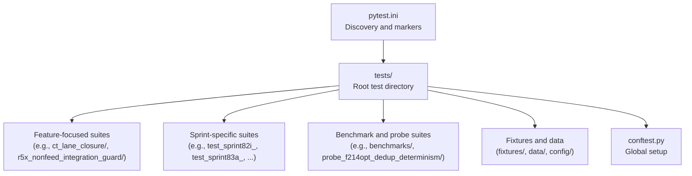
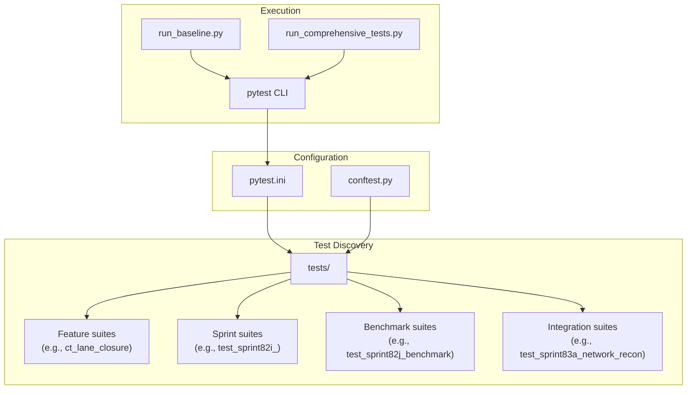
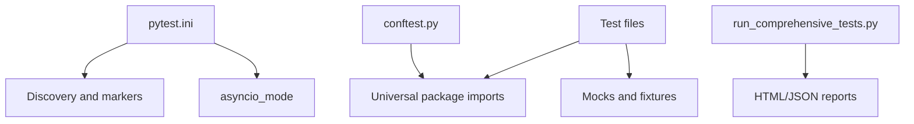
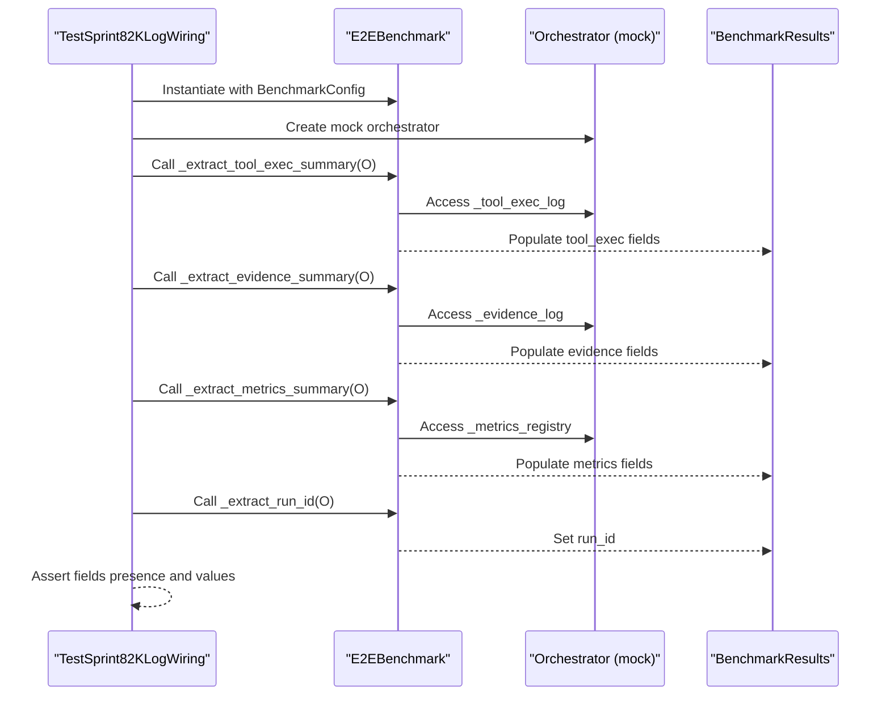
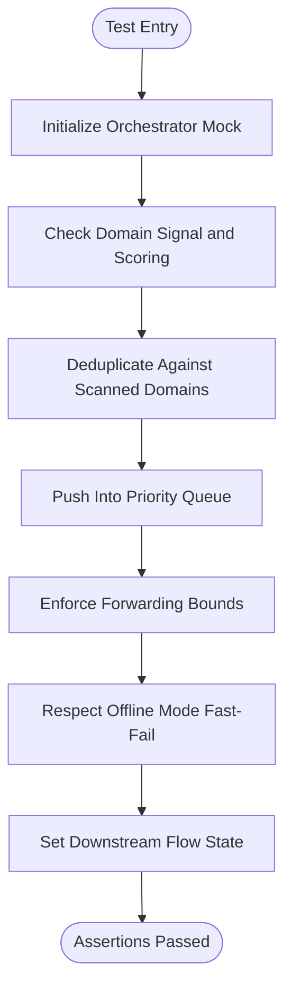

# Test Suite Organization

<cite>
**Referenced Files in This Document**
- [pytest.ini](file://pytest.ini)
- [conftest.py](file://tests/conftest.py)
- [test_sprint82j_benchmark.py](file://tests/test_sprint82j_benchmark.py)
- [test_sprint82i_benchmark.py](file://tests/test_sprint82i_benchmark.py)
- [test_sprint83a_network_recon.py](file://tests/test_sprint83a_network_recon.py)
- [test_sprint83b_network_recon_validation.py](file://tests/test_sprint83b_network_recon_validation.py)
- [test_sprint85_security_audit.py](file://tests/test_sprint85_security_audit.py)
- [test_sprint86_economics.py](file://tests/test_sprint86_economics.py)
- [test_sprint86f_wildcard_metrics.py](file://tests/test_sprint86f_wildcard_metrics.py)
- [f234_live_kpi_present.json](file://tests/fixtures/f234_live_kpi_present.json)
- [run_baseline.py](file://run_baseline.py)
- [run_comprehensive_tests.py](file://run_comprehensive_tests.py)
</cite>

## Table of Contents
1. [Introduction](#introduction)
2. [Project Structure](#project-structure)
3. [Core Components](#core-components)
4. [Architecture Overview](#architecture-overview)
5. [Detailed Component Analysis](#detailed-component-analysis)
6. [Dependency Analysis](#dependency-analysis)
7. [Performance Considerations](#performance-considerations)
8. [Troubleshooting Guide](#troubleshooting-guide)
9. [Conclusion](#conclusion)
10. [Appendices](#appendices)

## Introduction
This document explains the test suite organization and structure for Hledac Universal’s universal module. It covers pytest configuration, test discovery, markers and categories, conftest setup, fixtures, environment configuration, directory and naming conventions, and practical guidance for running, interpreting, isolating, and extending tests across sprints.

## Project Structure
The test suite lives under the universal module and is organized by functional areas and sprints. Key characteristics:
- Root discovery: pytest discovers tests under the tests directory.
- Naming conventions: files match test_*.py or *_test.py; classes Test*; functions test_*.
- Exclusions: common build and cache directories are ignored; probe_* directories are also ignored globally.
- Markers: a rich set of markers enables selective runs by category (async, slow, live, integration, smoke, ML frameworks, browser, hermetic, stress, legacy, monolith, archival).
- Async support: asyncio_mode is configured for seamless async test execution.

**Diagram sources**
- [pytest.ini](file://pytest.ini)
- [conftest.py](file://tests/conftest.py)

**Section sources**
- [pytest.ini](file://pytest.ini)

## Core Components
- pytest configuration: controls discovery, exclusions, markers, and defaults.
- conftest.py: ensures the universal package is importable during test runs.
- Test suites: organized by feature and sprint, with representative examples below.
- Fixtures and data: JSON fixtures for structured inputs and validations.
- Test runners: scripts to run and parse pytest outcomes programmatically.

**Section sources**
- [pytest.ini](file://pytest.ini)
- [conftest.py](file://tests/conftest.py)

## Architecture Overview
The test architecture centers on pytest’s conventions and selective execution via markers. Tests are grouped by sprint and feature, with fixtures enabling deterministic environments and mocks for external systems.

**Diagram sources**
- [pytest.ini](file://pytest.ini)
- [conftest.py](file://tests/conftest.py)
- [run_baseline.py](file://run_baseline.py)
- [run_comprehensive_tests.py](file://run_comprehensive_tests.py)

## Detailed Component Analysis

### pytest Configuration and Discovery
- Discovery roots and patterns:
  - testpaths: tests
  - python_files: test_*.py, *_test.py
  - python_classes: Test*
  - python_functions: test_*
- Exclusions: VCS, build artifacts, virtual environments, caches, node_modules, and probe_* directories.
- Markers: comprehensive categories for async, performance, environment, and legacy classification.
- Async mode: asyncio_mode = auto for async-friendly tests.
- Global ignores: --ignore-glob for probe_* and top-level probe_*

Practical implications:
- Keep test files named test_*.py or *_test.py to be discovered automatically.
- Use markers to categorize tests and enable selective runs (e.g., -m "not slow").
- Avoid placing tests under excluded directories (e.g., probe_*).

**Section sources**
- [pytest.ini](file://pytest.ini)

### conftest Setup and Environment
- Purpose: insert repository roots into sys.path so the universal package resolves and internal utilities are importable during tests.
- Impact: allows importing from hledac.universal.* inside tests without manual PYTHONPATH manipulation.

Guidelines:
- Place shared fixtures and autouse behaviors in tests/conftest.py.
- Keep environment setup minimal and deterministic.

**Section sources**
- [conftest.py](file://tests/conftest.py)

### Test Categories and Markers
Representative categories observed in the suite:
- asyncio: tests decorated with pytest.mark.asyncio or relying on asyncio_mode.
- slow: long-running tests; exclude with -m "not slow".
- integration: integration-style tests exercising multiple components.
- smoke: quick checks validating basic behavior.
- hermetic: tests that must run without network or external services.
- legacy/archival: historical regression tests for older contracts.

Examples of usage in tests:
- pytest.mark.asyncio on async test methods.
- pytest.mark.slow on tests that require bounded live audits.

Interpretation:
- Use -m "<marker>" to include or exclude categories.
- Combine markers with logical operators (and, or, not) for fine-grained runs.

**Section sources**
- [pytest.ini](file://pytest.ini)
- [test_sprint83a_network_recon.py](file://tests/test_sprint83a_network_recon.py)
- [test_sprint83b_network_recon_validation.py](file://tests/test_sprint83b_network_recon_validation.py)
- [test_sprint85_security_audit.py](file://tests/test_sprint85_security_audit.py)

### Directory and Naming Conventions
- Feature folders:
  - ct_lane_closure/, r5x_nonfeed_integration_guard/, security_layer_async_io/, etc.
- Sprint-named suites:
  - test_sprint82i_*, test_sprint83a_*, test_sprint85_*, test_sprint86_*, etc.
- Benchmark and probe suites:
  - benchmarks/, probe_f214opt_dedup_determinism/

Naming patterns:
- test_*.py or *_test.py
- Classes Test* for unittest-style suites
- Functions test_* for pytest-style tests

Benefits:
- Clear ownership and traceability across sprints.
- Easy grouping for targeted runs.

**Section sources**
- [pytest.ini](file://pytest.ini)
- [test_sprint82i_benchmark.py](file://tests/test_sprint82i_benchmark.py)
- [test_sprint83a_network_recon.py](file://tests/test_sprint83a_network_recon.py)
- [test_sprint85_security_audit.py](file://tests/test_sprint85_security_audit.py)
- [test_sprint86_economics.py](file://tests/test_sprint86_economics.py)

### Test Case Organization Patterns
- Unit-style with unittest.TestCase and pytest-style with pytest fixtures.
- Representative examples:
  - Benchmark smoke and metrics wiring: test_sprint82j_benchmark.py
  - Bounded context and archive challenge handling: test_sprint82i_benchmark.py
  - Network recon integration and boundedness: test_sprint83a_network_recon.py
  - Truth validation and partial failure: test_sprint83b_network_recon_validation.py
  - Security audit and timeout discipline: test_sprint85_security_audit.py
  - Economics tracking and thresholds: test_sprint86_economics.py
  - Wildcard metrics and trace bounds: test_sprint86f_wildcard_metrics.py

Patterns:
- Use mocks and patches to isolate external dependencies.
- Prefer fixtures for reusable setup and teardown.
- Separate concerns across suites by feature and sprint.

**Section sources**
- [test_sprint82j_benchmark.py](file://tests/test_sprint82j_benchmark.py)
- [test_sprint82i_benchmark.py](file://tests/test_sprint82i_benchmark.py)
- [test_sprint83a_network_recon.py](file://tests/test_sprint83a_network_recon.py)
- [test_sprint83b_network_recon_validation.py](file://tests/test_sprint83b_network_recon_validation.py)
- [test_sprint85_security_audit.py](file://tests/test_sprint85_security_audit.py)
- [test_sprint86_economics.py](file://tests/test_sprint86_economics.py)
- [test_sprint86f_wildcard_metrics.py](file://tests/test_sprint86f_wildcard_metrics.py)

### Fixtures and Test Data Management
- JSON fixtures:
  - f234_live_kpi_present.json provides structured inputs for live KPI and diagnostic scenarios.
- Fixture usage:
  - Load JSON fixtures to drive deterministic test scenarios.
  - Use pytest fixtures for reusable setup (e.g., mock orchestrators).

Guidelines:
- Store fixtures under tests/fixtures/.
- Keep fixture data minimal and focused on the scenario under test.
- Use separate fixtures for different contexts to improve readability.

**Section sources**
- [f234_live_kpi_present.json](file://tests/fixtures/f234_live_kpi_present.json)

### Test Execution and Interpretation
- Command-line execution:
  - pytest tests/ -v
  - pytest tests/test_sprint82i_benchmark.py::TestSprint82IBoundedContext::test_bounded_final_context_respects_max_chars
  - pytest -m "not slow" tests/  (exclude slow tests)
  - pytest -m "integration and not smoke" tests/  (selective category)
- Programmatic runners:
  - run_baseline.py: wraps pytest invocation, parses summary lines, and returns structured results.
  - run_comprehensive_tests.py: discovers suites, generates HTML/JSON reports, and prints formatted results.

Interpretation:
- run_baseline.py parses “X passed, Y failed, Z skipped in Ws” summaries.
- run_comprehensive_tests.py prints suite headers/results and writes detailed reports.

**Section sources**
- [pytest.ini](file://pytest.ini)
- [run_baseline.py](file://run_baseline.py)
- [run_comprehensive_tests.py](file://run_comprehensive_tests.py)

### Isolation, Mocking, and Environment Controls
- Isolation:
  - Use pytest fixtures to create isolated instances per test.
  - Avoid global mutable state; prefer passing explicit parameters to functions.
- Mocking:
  - unittest.mock and pytest-mock are used widely to stub external services and async calls.
  - Example patterns: patch HTTP clients, mock queues, and orchestrator internals.
- Environment controls:
  - Use environment variables (e.g., HLEDAC_OFFLINE) to toggle behavior under test.
  - Apply pytest.mark.hermetic for tests that must run offline.

**Section sources**
- [test_sprint82i_benchmark.py](file://tests/test_sprint82i_benchmark.py)
- [test_sprint83a_network_recon.py](file://tests/test_sprint83a_network_recon.py)
- [test_sprint85_security_audit.py](file://tests/test_sprint85_security_audit.py)

### Adding New Test Suites and Maintaining Consistency
- New suite placement:
  - Feature-focused: tests/<feature>/test_<name>.py
  - Sprint-focused: tests/test_sprintXX/<name>_test.py
- Naming and structure:
  - Follow test_*.py and Test* class conventions.
  - Use descriptive test function names indicating intent.
- Markers:
  - Assign appropriate markers (e.g., smoke, slow, integration, hermetic).
- Fixtures:
  - Centralize reusable fixtures in tests/conftest.py or per-suite fixtures.
- Reports:
  - For long suites, consider generating HTML/JSON reports via run_comprehensive_tests.py.

Consistency across sprints:
- Align test naming with sprint numbering.
- Reuse fixtures and helpers to reduce duplication.
- Keep markers uniform to enable reliable selective runs.

**Section sources**
- [pytest.ini](file://pytest.ini)
- [conftest.py](file://tests/conftest.py)
- [run_comprehensive_tests.py](file://run_comprehensive_tests.py)

## Dependency Analysis
The test suite depends on:
- pytest and pytest-asyncio for discovery and async support.
- Internal modules under hledac.universal (imported via sys.path adjustments).
- Optional plugins for HTML and JSON reporting (used by run_comprehensive_tests.py).

**Diagram sources**
- [pytest.ini](file://pytest.ini)
- [conftest.py](file://tests/conftest.py)
- [run_comprehensive_tests.py](file://run_comprehensive_tests.py)

**Section sources**
- [pytest.ini](file://pytest.ini)
- [conftest.py](file://tests/conftest.py)
- [run_comprehensive_tests.py](file://run_comprehensive_tests.py)

## Performance Considerations
- Use -m "not slow" to exclude long-running tests in local development.
- Prefer hermetic tests for faster feedback loops.
- Leverage markers to run subsets (e.g., smoke) during frequent iterations.
- For large suites, use run_comprehensive_tests.py to generate reports and track durations.

[No sources needed since this section provides general guidance]

## Troubleshooting Guide
Common issues and remedies:
- Import errors for hledac.universal:
  - Ensure conftest.py inserts repository roots into sys.path.
- Async test failures:
  - Confirm asyncio_mode and use pytest.mark.asyncio where applicable.
- Slow or flaky tests:
  - Exclude with -m "not slow" or mark with pytest.mark.slow and filter selectively.
- Offline-dependent tests failing:
  - Set HLEDAC_OFFLINE=1 or adjust environment to match test expectations.
- Reporting and parsing:
  - Use run_baseline.py for programmatic parsing of pytest summaries.
  - Use run_comprehensive_tests.py for HTML/JSON reports.

**Section sources**
- [conftest.py](file://tests/conftest.py)
- [pytest.ini](file://pytest.ini)
- [run_baseline.py](file://run_baseline.py)
- [run_comprehensive_tests.py](file://run_comprehensive_tests.py)

## Conclusion
Hledac Universal’s test suite leverages pytest’s conventions and a rich marker taxonomy to organize tests by feature and sprint. The configuration emphasizes discoverability, isolation, and selective execution. By following established naming, fixture, and reporting patterns, contributors can reliably add and maintain tests across sprints while preserving fast feedback and clear diagnostics.

[No sources needed since this section summarizes without analyzing specific files]

## Appendices

### Representative Test Flow: Benchmark Metrics Wiring

**Diagram sources**
- [test_sprint82j_benchmark.py](file://tests/test_sprint82j_benchmark.py)

### Representative Flow: Network Recon Integration

**Diagram sources**
- [test_sprint83a_network_recon.py](file://tests/test_sprint83a_network_recon.py)