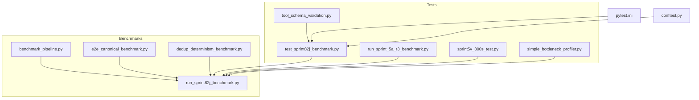
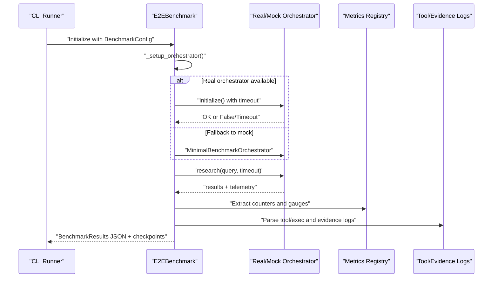
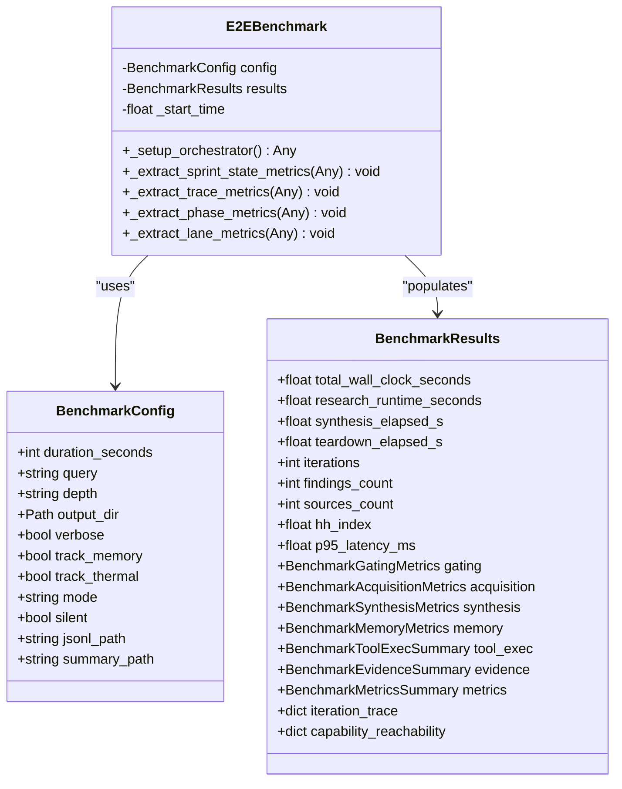
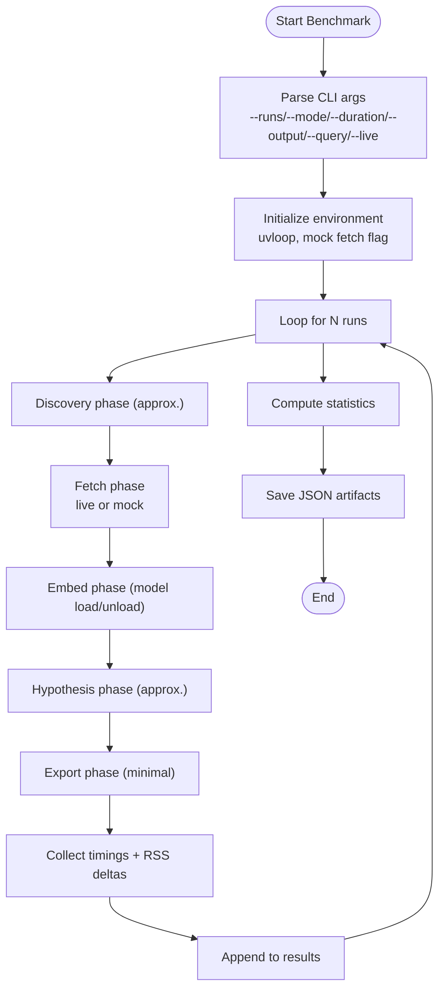
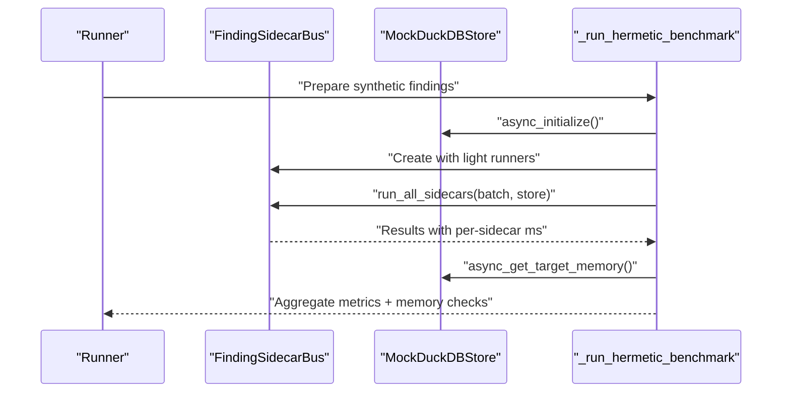
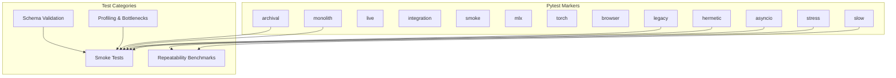
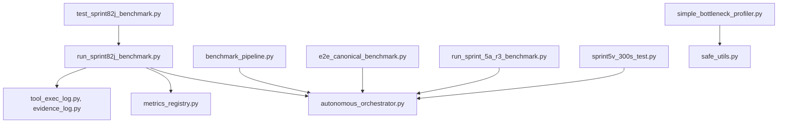

# Testing and Benchmarking

<cite>
**Referenced Files in This Document**
- [benchmark_pipeline.py](file://benchmarks/benchmark_pipeline.py)
- [e2e_canonical_benchmark.py](file://benchmarks/e2e_canonical_benchmark.py)
- [run_sprint82j_benchmark.py](file://benchmarks/run_sprint82j_benchmark.py)
- [dedup_determinism_benchmark.py](file://benchmarks/dedup_determinism_benchmark.py)
- [simple_bottleneck_profiler.py](file://tests/profiling/simple_bottleneck_profiler.py)
- [pytest.ini](file://pytest.ini)
- [conftest.py](file://tests/conftest.py)
- [test_sprint82j_benchmark.py](file://tests/test_sprint82j_benchmark.py)
- [run_sprint_5a_r3_benchmark.py](file://tests/run_sprint_5a_r3_benchmark.py)
- [sprint5v_300s_test.py](file://tests/sprint5v_300s_test.py)
- [tool_schema_validation.py](file://tests/tool_schema_validation.py)
</cite>

## Table of Contents
1. [Introduction](#introduction)
2. [Project Structure](#project-structure)
3. [Core Components](#core-components)
4. [Architecture Overview](#architecture-overview)
5. [Detailed Component Analysis](#detailed-component-analysis)
6. [Dependency Analysis](#dependency-analysis)
7. [Performance Considerations](#performance-considerations)
8. [Troubleshooting Guide](#troubleshooting-guide)
9. [Conclusion](#conclusion)
10. [Appendices](#appendices)

## Introduction
This document describes the testing and benchmarking framework for Hledac Universal. It explains the test suite organization, benchmark system architecture, quality assurance processes, and practical guidance for performance measurement, regression testing, continuous integration, and automated workflows. It also covers configuration options for different environments, performance baselines, quality gates, and strategies for test data management, mocking, and profiling.

## Project Structure
The testing and benchmarking system spans two primary areas:
- Benchmarks: Dedicated scripts and classes that measure end-to-end performance, memory, and throughput; they capture structured metrics and produce JSON artifacts for analysis and regression tracking.
- Tests: Unit and integration tests organized by sprints and categories, leveraging pytest markers and fixtures to categorize and run subsets of tests efficiently.

Key directories and files:
- benchmarks/: End-to-end and specialized benchmarks for pipeline phases, deduplication determinism, and M1-specific workloads.
- tests/: Comprehensive test suites organized by sprint and functional area, including smoke tests, repeatability benchmarks, and profiling utilities.
- pytest.ini: Centralized pytest configuration with markers and collection rules.
- tests/conftest.py: Global test configuration to ensure packages resolve correctly.

**Diagram sources**
- [benchmark_pipeline.py:1-381](file://benchmarks/benchmark_pipeline.py#L1-L381)
- [e2e_canonical_benchmark.py:1-484](file://benchmarks/e2e_canonical_benchmark.py#L1-L484)
- [run_sprint82j_benchmark.py:1-800](file://benchmarks/run_sprint82j_benchmark.py#L1-L800)
- [dedup_determinism_benchmark.py:1-390](file://benchmarks/dedup_determinism_benchmark.py#L1-L390)
- [test_sprint82j_benchmark.py:1-952](file://tests/test_sprint82j_benchmark.py#L1-L952)
- [run_sprint_5a_r3_benchmark.py:1-165](file://tests/run_sprint_5a_r3_benchmark.py#L1-L165)
- [sprint5v_300s_test.py:1-107](file://tests/sprint5v_300s_test.py#L1-L107)
- [simple_bottleneck_profiler.py:1-658](file://tests/profiling/simple_bottleneck_profiler.py#L1-L658)
- [tool_schema_validation.py:1-324](file://tests/tool_schema_validation.py#L1-L324)
- [pytest.ini:1-62](file://pytest.ini#L1-L62)
- [conftest.py:1-4](file://tests/conftest.py#L1-L4)

**Section sources**
- [pytest.ini:1-62](file://pytest.ini#L1-L62)
- [conftest.py:1-4](file://tests/conftest.py#L1-L4)

## Core Components
- Benchmark orchestration and metrics capture:
  - End-to-end benchmark harness with real orchestrator fallback and structured metrics (timing, memory, gating, synthesis, telemetry).
  - Pipeline benchmark measuring discovery, fetch, embed, hypothesis, export phases and RSS deltas.
  - Canonical end-to-end benchmark enforcing hermetic conditions and memory ceilings.
  - Specialized benchmarks for deduplication determinism and M1 workloads.
- Test suite organization:
  - Pytest configuration with markers for async, slow, live, integration, smoke, MLX, torch, browser, hermetic, stress, legacy, monolith, archival.
  - Test scaffolding for benchmark smoke tests and repeatability validations.
  - Profiling utilities for bottleneck detection and optimization roadmap generation.
- Quality gates and baselines:
  - Memory ceilings (e.g., M1 8GB), admission/gating metrics, FPS metrics, and structured JSON artifacts for regression tracking.

**Section sources**
- [run_sprint82j_benchmark.py:1-800](file://benchmarks/run_sprint82j_benchmark.py#L1-L800)
- [benchmark_pipeline.py:1-381](file://benchmarks/benchmark_pipeline.py#L1-L381)
- [e2e_canonical_benchmark.py:1-484](file://benchmarks/e2e_canonical_benchmark.py#L1-L484)
- [dedup_determinism_benchmark.py:1-390](file://benchmarks/dedup_determinism_benchmark.py#L1-L390)
- [pytest.ini:41-55](file://pytest.ini#L41-L55)

## Architecture Overview
The benchmarking architecture centers around a unified benchmark harness that:
- Initializes either a real orchestrator or a minimal mock orchestrator.
- Executes a bounded research run while collecting timing, memory, thermal, and telemetry metrics.
- Aggregates per-phase, per-lane, and per-tool metrics into structured results.
- Writes checkpoints and final artifacts for downstream analysis and regression tracking.

**Diagram sources**
- [run_sprint82j_benchmark.py:439-800](file://benchmarks/run_sprint82j_benchmark.py#L439-L800)

## Detailed Component Analysis

### End-to-End Benchmark Harness (Sprint 82J)
- Purpose: Real profiling benchmark capturing whole-run timing, per-layer acquisition stats, gating metrics, lane metrics, memory/thermal stats, synthesis metrics, bottleneck diagnosis, and observability from logs.
- Key features:
  - Real orchestrator initialization with fallback to minimal mock.
  - Structured metrics via dataclasses (BenchmarkResults, BenchmarkGatingMetrics, BenchmarkAcquisitionMetrics, etc.).
  - Silent benchmark harness with periodic JSONL checkpoints.
  - Extraction of iteration traces, capability reachability, and specialized metrics (e.g., network recon economics).
- Outputs: JSON artifacts and checkpoint streams for regression tracking and performance analysis.

**Diagram sources**
- [run_sprint82j_benchmark.py:51-376](file://benchmarks/run_sprint82j_benchmark.py#L51-L376)
- [run_sprint82j_benchmark.py:439-800](file://benchmarks/run_sprint82j_benchmark.py#L439-L800)

**Section sources**
- [run_sprint82j_benchmark.py:1-800](file://benchmarks/run_sprint82j_benchmark.py#L1-L800)

### Pipeline Benchmark (P19)
- Purpose: Measure average times for discovery, fetch, embed, hypothesis, export phases and RSS deltas across multiple runs.
- Features:
  - Configurable runs, mode, duration, and optional live fetch override.
  - Statistics aggregation (mean, min, max, stddev) and memory deltas.
  - JSON output for historical comparison and regression tracking.

**Diagram sources**
- [benchmark_pipeline.py:213-342](file://benchmarks/benchmark_pipeline.py#L213-L342)

**Section sources**
- [benchmark_pipeline.py:1-381](file://benchmarks/benchmark_pipeline.py#L1-L381)

### Canonical End-to-End Benchmark (F205E)
- Purpose: Hermetic, synthetic-data benchmark validating findings/minute, dedup ratio, sidecar execution times, and memory ceilings.
- Features:
  - Mock store with synthetic findings and quality gate enforcement.
  - Light hermetic sidecar runners simulating realistic workloads.
  - Aggregated metrics across runs and per-sidecar averages/min/max.
  - Memory ceiling checks against M1 8GB constraints.

**Diagram sources**
- [e2e_canonical_benchmark.py:211-382](file://benchmarks/e2e_canonical_benchmark.py#L211-L382)

**Section sources**
- [e2e_canonical_benchmark.py:1-484](file://benchmarks/e2e_canonical_benchmark.py#L1-L484)

### Deduplication Determinism Benchmark (F214OPT-J)
- Purpose: Validate determinism and performance of deduplication components (fallback embedding, MinHash ngram caps) using synthetic texts.
- Features:
  - Determinism checks for embeddings and MinHash signatures.
  - Environment-variable override testing for ngram caps.
  - Performance measurements across text sizes.

**Section sources**
- [dedup_determinism_benchmark.py:1-390](file://benchmarks/dedup_determinism_benchmark.py#L1-L390)

### Test Suite Organization and Quality Gates
- Pytest configuration:
  - Markers for async, slow, live, integration, smoke, MLX, torch, browser, hermetic, stress, legacy, monolith, archival.
  - Collection rules and ignore patterns for probe and artifact directories.
- Test scaffolding:
  - Benchmark smoke tests validating configuration defaults, metrics wiring, and log extraction.
  - Repeatability benchmarks generating JSON artifacts and markdown scorecards.
  - Profiling utilities for bottleneck detection and optimization roadmap.

**Diagram sources**
- [pytest.ini:41-55](file://pytest.ini#L41-L55)

**Section sources**
- [pytest.ini:1-62](file://pytest.ini#L1-L62)
- [test_sprint82j_benchmark.py:1-952](file://tests/test_sprint82j_benchmark.py#L1-L952)
- [run_sprint_5a_r3_benchmark.py:1-165](file://tests/run_sprint_5a_r3_benchmark.py#L1-L165)
- [sprint5v_300s_test.py:1-107](file://tests/sprint5v_300s_test.py#L1-L107)
- [simple_bottleneck_profiler.py:1-658](file://tests/profiling/simple_bottleneck_profiler.py#L1-L658)
- [tool_schema_validation.py:1-324](file://tests/tool_schema_validation.py#L1-L324)

### Performance Measurement Methodologies
- Timing:
  - Wall-clock and phase-level timing with monotonic timestamps.
  - FPS metrics (iterations/findings/sources per second).
  - P95 latency tracking and percentile-based metrics.
- Memory:
  - RSS sampling before/after and per-iteration deltas.
  - Memory pressure and forced throttles captured via metrics.
- Throughput and Efficiency:
  - Findings-per-minute and sidecar execution times.
  - Echo rejection rates and admission metrics.
- Observability:
  - Tool execution logs, evidence logs, and metrics registry summaries.
  - Iteration traces and capability reachability reports.

**Section sources**
- [run_sprint82j_benchmark.py:238-437](file://benchmarks/run_sprint82j_benchmark.py#L238-L437)
- [e2e_canonical_benchmark.py:333-382](file://benchmarks/e2e_canonical_benchmark.py#L333-L382)
- [benchmark_pipeline.py:161-210](file://benchmarks/benchmark_pipeline.py#L161-L210)

### Regression Testing Strategies
- Baseline artifacts:
  - JSON scorecards and markdown reports for repeatability runs.
  - Canonical benchmark outputs for hermetic validation.
- Automated checks:
  - Smoke tests verifying configuration defaults and metrics wiring.
  - Schema validation ensuring tool arguments conform to Pydantic models.
- Continuous monitoring:
  - Silent benchmark harness writes checkpoints for progress tracking.
  - Profiling scripts generate optimization roadmaps and prioritize fixes.

**Section sources**
- [run_sprint_5a_r3_benchmark.py:78-155](file://tests/run_sprint_5a_r3_benchmark.py#L78-L155)
- [test_sprint82j_benchmark.py:1-952](file://tests/test_sprint82j_benchmark.py#L1-L952)
- [simple_bottleneck_profiler.py:474-613](file://tests/profiling/simple_bottleneck_profiler.py#L474-L613)

### Continuous Integration Practices
- Test selection:
  - Use pytest markers to exclude slow or live tests in default runs.
  - Run smoke and integration tests in CI with appropriate environment flags.
- Artifact retention:
  - Store benchmark JSON artifacts and markdown reports for historical comparisons.
- Environment isolation:
  - Hermetic benchmarks enforce no network or MLX dependencies.
  - Mock fetch modes and synthetic data minimize flakiness.

**Section sources**
- [pytest.ini:41-55](file://pytest.ini#L41-L55)
- [e2e_canonical_benchmark.py:1-484](file://benchmarks/e2e_canonical_benchmark.py#L1-L484)
- [benchmark_pipeline.py:1-381](file://benchmarks/benchmark_pipeline.py#L1-L381)

### Benchmark Pipeline Implementation
- Phases:
  - Discovery, Fetch, Embed, Hypothesis, Export with approximate timing.
  - Optional live fetch override via CLI flag.
- Statistics:
  - Mean, min, max, stddev for each phase and total elapsed time.
  - Memory delta statistics (mean, min, max).
- Outputs:
  - JSON with metadata, statistics, and raw results.
  - Formatted console summary for quick review.

**Section sources**
- [benchmark_pipeline.py:213-342](file://benchmarks/benchmark_pipeline.py#L213-L342)

### Test Case Management and Automated Workflows
- Test case management:
  - Organize tests by sprint and functional area; use fixtures and parametrization.
  - Leverage pytest markers to categorize and filter tests.
- Automated workflows:
  - Repeatability benchmarks generate artifacts for baseline tracking.
  - Profiling scripts run periodically to detect regressions and suggest optimizations.

**Section sources**
- [run_sprint_5a_r3_benchmark.py:1-165](file://tests/run_sprint_5a_r3_benchmark.py#L1-L165)
- [simple_bottleneck_profiler.py:454-473](file://tests/profiling/simple_bottleneck_profiler.py#L454-L473)

### Configuration Options for Test Environments
- Benchmark configuration:
  - Duration, query, depth, output directory, verbosity, memory/thermal tracking, mode, and silent harness options.
- Environment variables:
  - HLEDAC_OFFLINE toggles offline mode for benchmarking.
  - HLEDAC_DEDUP_MAX_NGRAMS overrides ngram caps for deduplication tests.
- CLI flags:
  - Override mock fetch mode, specify runs, mode, duration, and output path.

**Section sources**
- [run_sprint82j_benchmark.py:52-66](file://benchmarks/run_sprint82j_benchmark.py#L52-L66)
- [e2e_canonical_benchmark.py:48-48](file://benchmarks/e2e_canonical_benchmark.py#L48-L48)
- [dedup_determinism_benchmark.py:171-186](file://benchmarks/dedup_determinism_benchmark.py#L171-L186)
- [benchmark_pipeline.py:345-377](file://benchmarks/benchmark_pipeline.py#L345-L377)

### Performance Baselines and Quality Gates
- Baselines:
  - Repeatability scorecards with variability metrics and verdicts.
  - Canonical benchmark aggregates for findings/minute and memory ceilings.
- Quality gates:
  - Memory ceilings (e.g., M1 8GB) validated in canonical benchmark.
  - Admission/gating metrics and echo rejection rates monitored in end-to-end benchmark.

**Section sources**
- [run_sprint_5a_r3_benchmark.py:70-130](file://tests/run_sprint_5a_r3_benchmark.py#L70-L130)
- [e2e_canonical_benchmark.py:312-382](file://benchmarks/e2e_canonical_benchmark.py#L312-L382)

### Examples: Writing Custom Tests, Benchmark Development, and Execution
- Writing custom tests:
  - Use pytest markers and fixtures; validate configuration defaults and metrics wiring.
  - Example: smoke tests for benchmark results structures and log extraction.
- Developing benchmarks:
  - Extend the unified benchmark harness with new metrics and extraction methods.
  - Use structured dataclasses for results and ensure JSON serialization.
- Executing tests and benchmarks:
  - Run pytest with markers to select subsets (e.g., -m "smoke or integration").
  - Execute benchmark scripts with CLI flags for runs, mode, duration, and output.

**Section sources**
- [test_sprint82j_benchmark.py:30-116](file://tests/test_sprint82j_benchmark.py#L30-L116)
- [run_sprint82j_benchmark.py:439-800](file://benchmarks/run_sprint82j_benchmark.py#L439-L800)
- [pytest.ini:41-55](file://pytest.ini#L41-L55)

### Test Data Management and Mock Strategies
- Test data management:
  - Synthetic data generators for benchmarks (e.g., synthetic findings, evidence packets).
  - Mock stores and orchestrators to avoid external dependencies.
- Mock strategies:
  - MinimalBenchmarkOrchestrator fallback for benchmarking scenarios.
  - MockDuckDBStore with synthetic quality gate and memory tracking.
  - Mock sidecar runners simulating realistic workloads without network/MLX.

**Section sources**
- [e2e_canonical_benchmark.py:84-206](file://benchmarks/e2e_canonical_benchmark.py#L84-L206)
- [run_sprint82j_benchmark.py:533-604](file://benchmarks/run_sprint82j_benchmark.py#L533-L604)

### Performance Profiling Techniques
- Built-in profiling:
  - cProfile-based bottleneck detection script identifies slow functions, memory usage, import performance, and configuration bottlenecks.
- Reporting:
  - Generates comprehensive markdown reports with prioritized optimization roadmap and safety guidelines.

**Section sources**
- [simple_bottleneck_profiler.py:1-658](file://tests/profiling/simple_bottleneck_profiler.py#L1-L658)

## Dependency Analysis
The benchmarking system exhibits clear separation of concerns:
- Benchmarks depend on orchestrator APIs and metrics registries.
- Tests depend on pytest configuration and fixtures.
- Profiling utilities are standalone and reusable across benchmarks.

**Diagram sources**
- [run_sprint82j_benchmark.py:469-604](file://benchmarks/run_sprint82j_benchmark.py#L469-L604)
- [benchmark_pipeline.py:74-119](file://benchmarks/benchmark_pipeline.py#L74-L119)
- [e2e_canonical_benchmark.py:221-270](file://benchmarks/e2e_canonical_benchmark.py#L221-L270)
- [test_sprint82j_benchmark.py:18-27](file://tests/test_sprint82j_benchmark.py#L18-L27)
- [run_sprint_5a_r3_benchmark.py:11-46](file://tests/run_sprint_5a_r3_benchmark.py#L11-L46)
- [sprint5v_300s_test.py:17-86](file://tests/sprint5v_300s_test.py#L17-L86)
- [simple_bottleneck_profiler.py:103-147](file://tests/profiling/simple_bottleneck_profiler.py#L103-L147)

**Section sources**
- [run_sprint82j_benchmark.py:469-604](file://benchmarks/run_sprint82j_benchmark.py#L469-L604)
- [benchmark_pipeline.py:74-119](file://benchmarks/benchmark_pipeline.py#L74-L119)
- [e2e_canonical_benchmark.py:221-270](file://benchmarks/e2e_canonical_benchmark.py#L221-L270)
- [test_sprint82j_benchmark.py:18-27](file://tests/test_sprint82j_benchmark.py#L18-L27)
- [run_sprint_5a_r3_benchmark.py:11-46](file://tests/run_sprint_5a_r3_benchmark.py#L11-L46)
- [sprint5v_300s_test.py:17-86](file://tests/sprint5v_300s_test.py#L17-L86)
- [simple_bottleneck_profiler.py:103-147](file://tests/profiling/simple_bottleneck_profiler.py#L103-L147)

## Performance Considerations
- Prefer hermetic benchmarks for reproducibility and memory stability.
- Use mock fetch modes and synthetic data to reduce flakiness.
- Track memory ceilings and throttle events to maintain system stability.
- Monitor FPS metrics and latency percentiles for responsiveness.
- Periodically run profiling scripts to identify and address bottlenecks.

[No sources needed since this section provides general guidance]

## Troubleshooting Guide
- Initialization failures:
  - Real orchestrator initialization may fail or timeout; the harness falls back to a minimal mock and records initialization errors.
- Memory leaks:
  - Investigate RSS deltas and memory pressure counters; ensure cleanup routines are executed.
- Admissions and gating anomalies:
  - Review gating metrics and echo rejection rates; adjust thresholds if necessary.
- Logging and observability:
  - Verify tool execution logs, evidence logs, and metrics registry summaries are present and parsable.

**Section sources**
- [run_sprint82j_benchmark.py:516-531](file://benchmarks/run_sprint82j_benchmark.py#L516-L531)
- [run_sprint82j_benchmark.py:606-650](file://benchmarks/run_sprint82j_benchmark.py#L606-L650)

## Conclusion
Hledac Universal’s testing and benchmarking framework combines robust end-to-end benchmarks, hermetic validations, and targeted profiling to ensure performance, reliability, and reproducibility. The unified benchmark harness captures comprehensive metrics, while pytest-based tests and profiling utilities provide strong quality gates and actionable insights for continuous improvement.

[No sources needed since this section summarizes without analyzing specific files]

## Appendices
- Example CLI invocations:
  - Pipeline benchmark: python benchmarks/benchmark_pipeline.py --runs 5 --mode public --duration 60 --output /tmp/benchmark.json --query "custom query" --live
  - Canonical benchmark: python benchmarks/e2e_canonical_benchmark.py --hermetic --runs 3 --output /tmp/e2e.json
  - End-to-end benchmark harness: python benchmarks/run_sprint82j_benchmark.py (configured via BenchmarkConfig)
- Test execution:
  - pytest -m "smoke and hermetic" tests/
  - pytest -m "stress" tests/ --ignore-glob="tests/probe_*"

[No sources needed since this section provides general guidance]