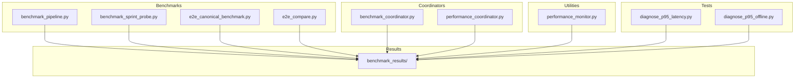
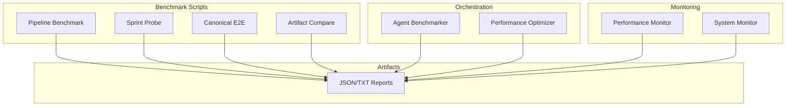
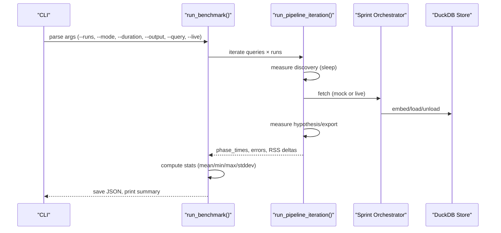
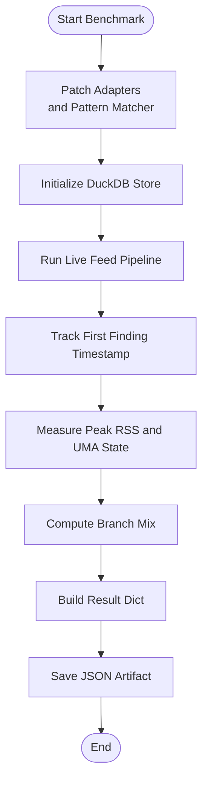
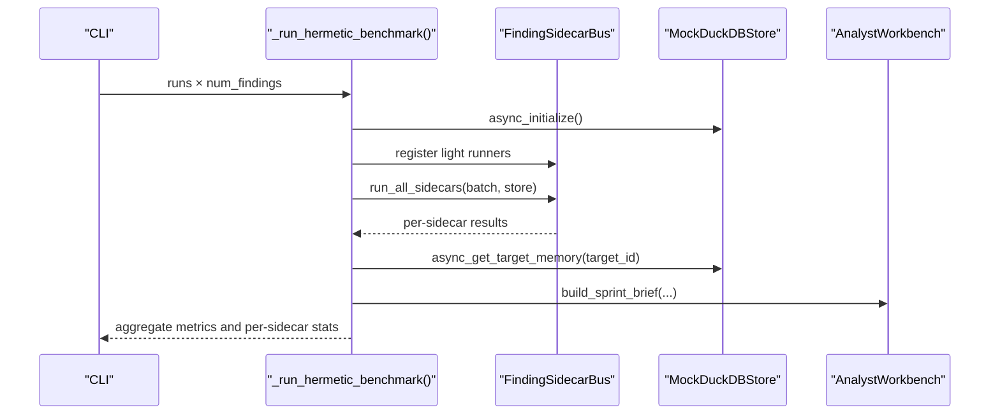
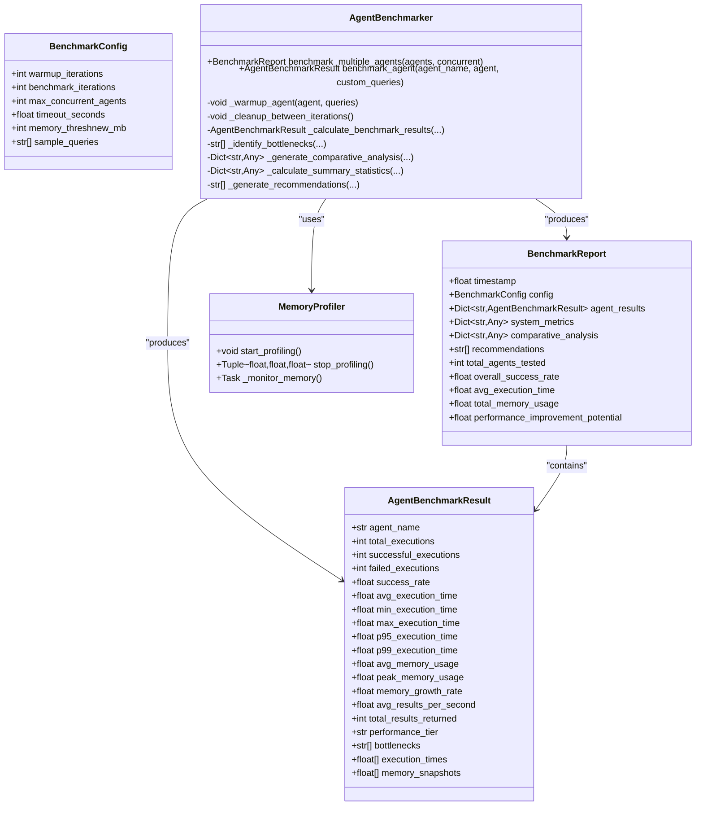
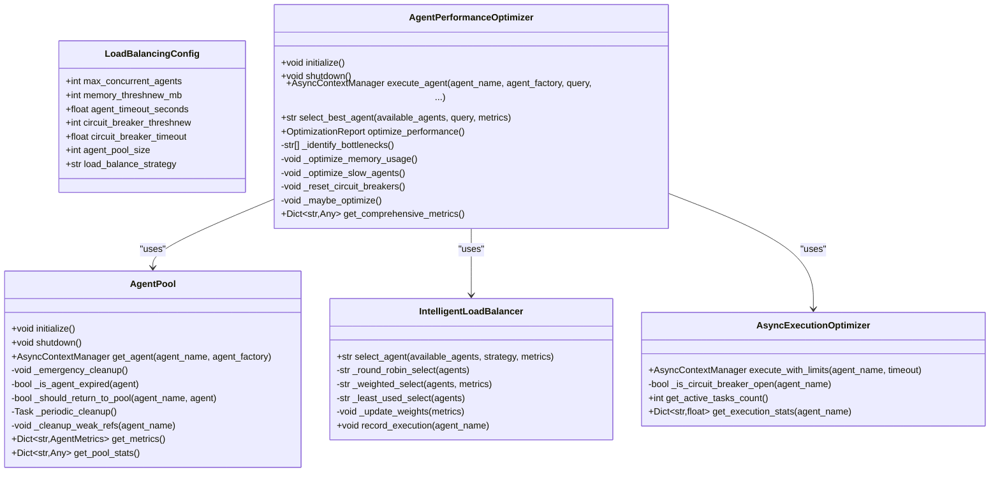
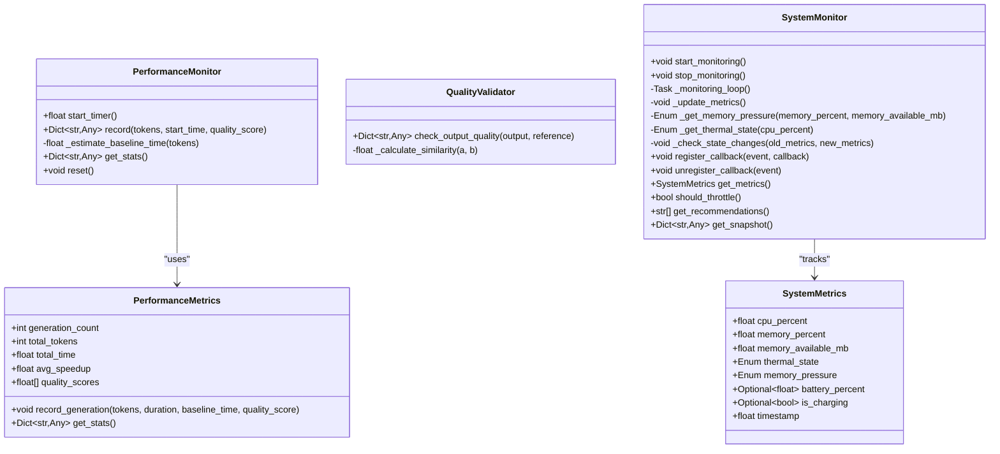
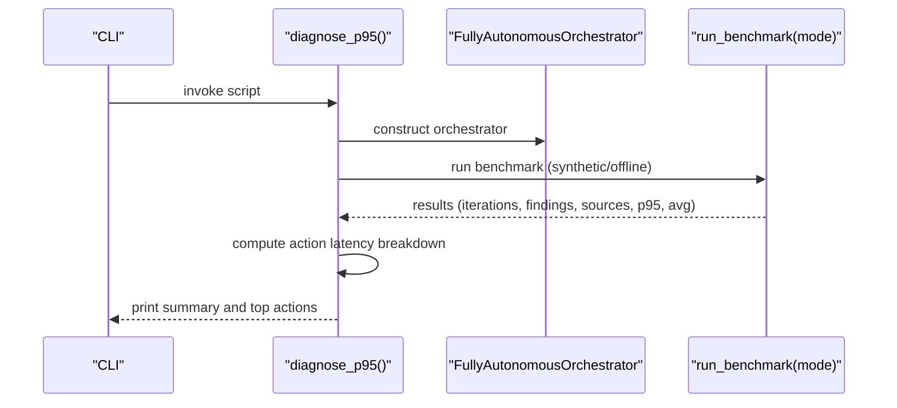
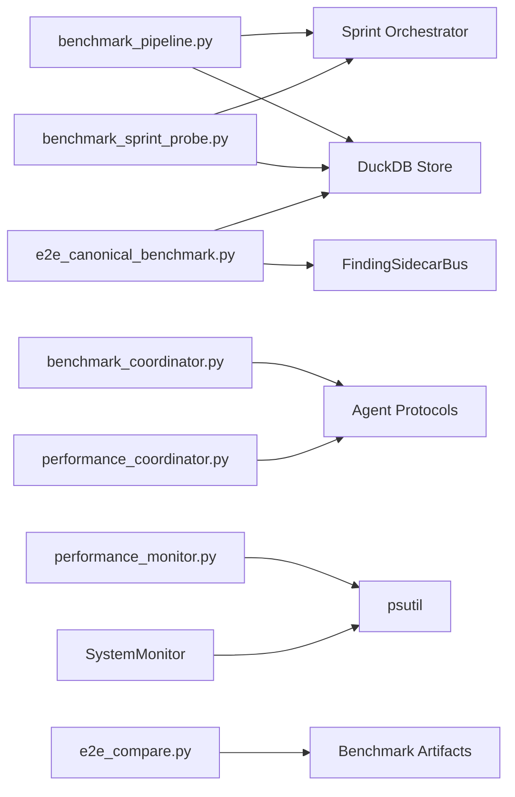

# Benchmark and Performance Testing

<cite>
**Referenced Files in This Document**
- [benchmark_pipeline.py](file://benchmarks/benchmark_pipeline.py)
- [benchmark_sprint_probe.py](file://benchmarks/benchmark_sprint_probe.py)
- [e2e_canonical_benchmark.py](file://benchmarks/e2e_canonical_benchmark.py)
- [e2e_compare.py](file://benchmarks/e2e_compare.py)
- [benchmark_coordinator.py](file://coordinators/benchmark_coordinator.py)
- [performance_coordinator.py](file://coordinators/performance_coordinator.py)
- [performance_monitor.py](file://utils/performance_monitor.py)
- [diagnose_p95_latency.py](file://tests/diagnose_p95_latency.py)
- [diagnose_p95_offline.py](file://tests/diagnose_p95_offline.py)
- [benchmark_results](file://benchmark_results)
</cite>

## Table of Contents
1. [Introduction](#introduction)
2. [Project Structure](#project-structure)
3. [Core Components](#core-components)
4. [Architecture Overview](#architecture-overview)
5. [Detailed Component Analysis](#detailed-component-analysis)
6. [Dependency Analysis](#dependency-analysis)
7. [Performance Considerations](#performance-considerations)
8. [Troubleshooting Guide](#troubleshooting-guide)
9. [Conclusion](#conclusion)
10. [Appendices](#appendices)

## Introduction
This document describes the benchmark and performance testing suite used to evaluate the Hledac universal research platform. It explains benchmark methodology, performance metrics collection, latency analysis tools, scorecards, regression detection, and comparative analysis frameworks. It also covers automated execution, result interpretation, performance trend analysis, scheduling, result storage, and monitoring integration.

## Project Structure
The benchmarking system is organized around dedicated benchmark scripts, orchestration and performance utilities, and a results directory for persistent artifacts. Key areas:
- Benchmarks: standalone scripts for pipeline, end-to-end canonical, and sprint probe paths
- Coordinators: agent benchmarking and performance optimization orchestration
- Utilities: performance monitoring, system metrics, and memory profiling
- Tests: diagnostic tools for latency analysis and offline replay modes
- Results: persistent JSON artifacts and text logs for historical comparisons

**Diagram sources**
- [benchmark_pipeline.py:1-381](file://benchmarks/benchmark_pipeline.py#L1-L381)
- [benchmark_sprint_probe.py:1-371](file://benchmarks/benchmark_sprint_probe.py#L1-L371)
- [e2e_canonical_benchmark.py:1-476](file://benchmarks/e2e_canonical_benchmark.py#L1-L476)
- [e2e_compare.py:1-281](file://benchmarks/e2e_compare.py#L1-L281)
- [benchmark_coordinator.py:1-794](file://coordinators/benchmark_coordinator.py#L1-L794)
- [performance_coordinator.py:1-807](file://coordinators/performance_coordinator.py#L1-L807)
- [performance_monitor.py:1-537](file://utils/performance_monitor.py#L1-L537)
- [diagnose_p95_latency.py:1-127](file://tests/diagnose_p95_latency.py#L1-L127)
- [diagnose_p95_offline.py:1-139](file://tests/diagnose_p95_offline.py#L1-L139)
- [benchmark_results](file://benchmark_results)

**Section sources**
- [benchmark_pipeline.py:1-381](file://benchmarks/benchmark_pipeline.py#L1-L381)
- [benchmark_sprint_probe.py:1-371](file://benchmarks/benchmark_sprint_probe.py#L1-L371)
- [e2e_canonical_benchmark.py:1-476](file://benchmarks/e2e_canonical_benchmark.py#L1-L476)
- [e2e_compare.py:1-281](file://benchmarks/e2e_compare.py#L1-L281)
- [benchmark_coordinator.py:1-794](file://coordinators/benchmark_coordinator.py#L1-L794)
- [performance_coordinator.py:1-807](file://coordinators/performance_coordinator.py#L1-L807)
- [performance_monitor.py:1-537](file://utils/performance_monitor.py#L1-L537)
- [diagnose_p95_latency.py:1-127](file://tests/diagnose_p95_latency.py#L1-L127)
- [diagnose_p95_offline.py:1-139](file://tests/diagnose_p95_offline.py#L1-L139)
- [benchmark_results](file://benchmark_results)

## Core Components
- Pipeline benchmark: measures discovery, fetch, embed, hypothesis, export, and total time; collects RSS deltas and aggregates statistics
- Sprint probe benchmark: end-to-end canonical path with hermetic adapters; reports first finding latency, peak RSS, UMA state, branch mix, and total findings
- Canonical end-to-end benchmark: hermetic sidecar bus throughput and memory profiling; validates target memory integration and analyst brief inclusion
- Agent benchmarking coordinator: comprehensive agent performance benchmarking with memory profiling, percentiles, and comparative analysis
- Performance coordinator: agent pooling, load balancing, async execution optimization, and memory-aware execution management
- Performance monitor: throughput metrics, speedup tracking, quality validation, and system monitoring for thermal/memory states
- Diagnostic tools: P95 latency root cause diagnostics for synthetic and offline replay modes

**Section sources**
- [benchmark_pipeline.py:53-158](file://benchmarks/benchmark_pipeline.py#L53-L158)
- [benchmark_sprint_probe.py:170-344](file://benchmarks/benchmark_sprint_probe.py#L170-L344)
- [e2e_canonical_benchmark.py:211-382](file://benchmarks/e2e_canonical_benchmark.py#L211-L382)
- [benchmark_coordinator.py:183-474](file://coordinators/benchmark_coordinator.py#L183-L474)
- [performance_coordinator.py:551-800](file://coordinators/performance_coordinator.py#L551-L800)
- [performance_monitor.py:69-140](file://utils/performance_monitor.py#L69-L140)
- [diagnose_p95_latency.py:13-127](file://tests/diagnose_p95_latency.py#L13-L127)
- [diagnose_p95_offline.py:13-139](file://tests/diagnose_p95_offline.py#L13-L139)

## Architecture Overview
The benchmarking suite integrates standalone benchmark scripts, orchestration layers, and monitoring utilities to produce standardized artifacts and actionable insights.

**Diagram sources**
- [benchmark_pipeline.py:213-342](file://benchmarks/benchmark_pipeline.py#L213-L342)
- [benchmark_sprint_probe.py:170-344](file://benchmarks/benchmark_sprint_probe.py#L170-L344)
- [e2e_canonical_benchmark.py:387-442](file://benchmarks/e2e_canonical_benchmark.py#L387-L442)
- [e2e_compare.py:95-219](file://benchmarks/e2e_compare.py#L95-L219)
- [benchmark_coordinator.py:734-794](file://coordinators/benchmark_coordinator.py#L734-L794)
- [performance_coordinator.py:551-800](file://coordinators/performance_coordinator.py#L551-L800)
- [performance_monitor.py:69-140](file://utils/performance_monitor.py#L69-L140)

## Detailed Component Analysis

### Pipeline Benchmark (P19)
Measures phase-wise timings and memory deltas across discovery, fetch, embed, hypothesis, and export. Provides averages, min/max, stddev, and total elapsed time. Includes mock fetch mode for fast, in-memory runs and optional live mode override.

**Diagram sources**
- [benchmark_pipeline.py:213-342](file://benchmarks/benchmark_pipeline.py#L213-L342)
- [benchmark_pipeline.py:53-158](file://benchmarks/benchmark_pipeline.py#L53-L158)

**Section sources**
- [benchmark_pipeline.py:1-381](file://benchmarks/benchmark_pipeline.py#L1-L381)

### Sprint Probe Benchmark (F192E.1)
End-to-end canonical path with hermetic adapters and pattern matcher patches. Reports first finding latency, peak RSS, UMA state, branch mix, and total findings. Enforces M1 8GB memory ceiling.

**Diagram sources**
- [benchmark_sprint_probe.py:170-344](file://benchmarks/benchmark_sprint_probe.py#L170-L344)

**Section sources**
- [benchmark_sprint_probe.py:1-371](file://benchmarks/benchmark_sprint_probe.py#L1-L371)

### Canonical End-to-End Benchmark (F205E)
Hermetic sidecar bus benchmark measuring findings per minute, dedup ratio, sidecar totals, per-sidecar metrics, and peak RSS. Validates target memory integration and analyst brief inclusion.

**Diagram sources**
- [e2e_canonical_benchmark.py:211-382](file://benchmarks/e2e_canonical_benchmark.py#L211-L382)

**Section sources**
- [e2e_canonical_benchmark.py:1-476](file://benchmarks/e2e_canonical_benchmark.py#L1-L476)

### Agent Benchmarking Coordinator
Comprehensive agent benchmarking with memory profiling, percentiles, and comparative analysis. Supports warmup, concurrent benchmarking, and performance tier classification.

**Diagram sources**
- [benchmark_coordinator.py:52-120](file://coordinators/benchmark_coordinator.py#L52-L120)
- [benchmark_coordinator.py:183-474](file://coordinators/benchmark_coordinator.py#L183-L474)
- [benchmark_coordinator.py:734-794](file://coordinators/benchmark_coordinator.py#L734-L794)

**Section sources**
- [benchmark_coordinator.py:1-794](file://coordinators/benchmark_coordinator.py#L1-L794)

### Performance Coordinator
Agent pooling, load balancing, async execution optimization, and memory-aware execution management. Includes circuit breakers, rate limiting, and periodic cleanup.

**Diagram sources**
- [performance_coordinator.py:78-114](file://coordinators/performance_coordinator.py#L78-L114)
- [performance_coordinator.py:116-335](file://coordinators/performance_coordinator.py#L116-L335)
- [performance_coordinator.py:337-550](file://coordinators/performance_coordinator.py#L337-L550)
- [performance_coordinator.py:551-800](file://coordinators/performance_coordinator.py#L551-L800)

**Section sources**
- [performance_coordinator.py:1-807](file://coordinators/performance_coordinator.py#L1-L807)

### Performance Monitor
Tracks throughput, speedup, and quality; monitors system thermal and memory pressure states; supports periodic snapshot emission for flow tracing.

**Diagram sources**
- [performance_monitor.py:23-67](file://utils/performance_monitor.py#L23-L67)
- [performance_monitor.py:69-140](file://utils/performance_monitor.py#L69-L140)
- [performance_monitor.py:227-457](file://utils/performance_monitor.py#L227-L457)

**Section sources**
- [performance_monitor.py:1-537](file://utils/performance_monitor.py#L1-L537)

### Latency Diagnostics (P95)
Diagnostic tools to isolate P95 latency root causes in synthetic and offline replay modes, including action latency breakdown and memory usage.

**Diagram sources**
- [diagnose_p95_latency.py:13-127](file://tests/diagnose_p95_latency.py#L13-L127)
- [diagnose_p95_offline.py:13-139](file://tests/diagnose_p95_offline.py#L13-L139)

**Section sources**
- [diagnose_p95_latency.py:1-127](file://tests/diagnose_p95_latency.py#L1-L127)
- [diagnose_p95_offline.py:1-139](file://tests/diagnose_p95_offline.py#L1-L139)

## Dependency Analysis
The benchmarking suite exhibits clear separation of concerns:
- Standalone scripts depend on orchestrator and store modules for canonical paths
- Coordinators encapsulate agent benchmarking and performance optimization
- Monitoring utilities integrate with system metrics and optional flow tracing
- Comparison tool consumes artifacts to detect regressions and schema mismatches

**Diagram sources**
- [benchmark_pipeline.py:74-105](file://benchmarks/benchmark_pipeline.py#L74-L105)
- [benchmark_sprint_probe.py:198-229](file://benchmarks/benchmark_sprint_probe.py#L198-L229)
- [e2e_canonical_benchmark.py:221-269](file://benchmarks/e2e_canonical_benchmark.py#L221-L269)
- [benchmark_coordinator.py:196-280](file://coordinators/benchmark_coordinator.py#L196-L280)
- [performance_coordinator.py:584-634](file://coordinators/performance_coordinator.py#L584-L634)
- [performance_monitor.py:205-396](file://utils/performance_monitor.py#L205-L396)
- [e2e_compare.py:95-219](file://benchmarks/e2e_compare.py#L95-L219)

**Section sources**
- [benchmark_pipeline.py:1-381](file://benchmarks/benchmark_pipeline.py#L1-L381)
- [benchmark_sprint_probe.py:1-371](file://benchmarks/benchmark_sprint_probe.py#L1-L371)
- [e2e_canonical_benchmark.py:1-476](file://benchmarks/e2e_canonical_benchmark.py#L1-L476)
- [benchmark_coordinator.py:1-794](file://coordinators/benchmark_coordinator.py#L1-L794)
- [performance_coordinator.py:1-807](file://coordinators/performance_coordinator.py#L1-L807)
- [performance_monitor.py:1-537](file://utils/performance_monitor.py#L1-L537)
- [e2e_compare.py:1-281](file://benchmarks/e2e_compare.py#L1-L281)

## Performance Considerations
- Event loop optimization: uvloop activation for faster async execution on M1
- Mock fetch mode: reduces variability and enables repeatable, fast runs
- Memory constraints: enforced M1 8GB ceiling checks and emergency cleanup
- Concurrency control: semaphores and circuit breakers prevent overload
- Periodic cleanup: maintains agent pools and reduces memory drift
- Percentile tracking: P95/P99 for robust latency analysis

[No sources needed since this section provides general guidance]

## Troubleshooting Guide
Common issues and remedies:
- Memory ceiling exceeded: reduce concurrency or enable emergency cleanup; verify UMA state
- Slow execution: inspect P95 action breakdown; consider load balancing adjustments
- Agent failures: review circuit breaker and rate-limiting triggers; adjust timeouts
- Artifact comparison failures: ensure required truth surfaces are present; handle schema mismatches

**Section sources**
- [benchmark_sprint_probe.py:330-335](file://benchmarks/benchmark_sprint_probe.py#L330-L335)
- [diagnose_p95_latency.py:98-109](file://tests/diagnose_p95_latency.py#L98-L109)
- [diagnose_p95_offline.py:125-129](file://tests/diagnose_p95_offline.py#L125-L129)
- [e2e_compare.py:160-219](file://benchmarks/e2e_compare.py#L160-L219)

## Conclusion
The benchmark and performance testing suite provides a comprehensive framework for evaluating throughput, latency, memory usage, and reliability across canonical paths and agent ecosystems. It supports automated execution, artifact-based regression detection, comparative analysis, and integrated monitoring for sustained performance improvements.

[No sources needed since this section summarizes without analyzing specific files]

## Appendices

### Benchmark Methodology and Metrics
- Pipeline benchmark: phase timings, total elapsed, RSS deltas, mean/min/max/stddev
- Sprint probe: first finding latency, peak RSS, UMA state, branch mix, total findings
- Canonical E2E: findings per minute, dedup ratio, sidecar totals, per-sidecar metrics, memory ceiling
- Agent benchmarking: success rate, avg/min/max execution time, P95/P99, memory usage, performance tiers, bottlenecks
- Performance monitor: tokens/sec, speedup, quality scores, thermal/memory pressure states

**Section sources**
- [benchmark_pipeline.py:161-210](file://benchmarks/benchmark_pipeline.py#L161-L210)
- [benchmark_sprint_probe.py:278-310](file://benchmarks/benchmark_sprint_probe.py#L278-L310)
- [e2e_canonical_benchmark.py:316-329](file://benchmarks/e2e_canonical_benchmark.py#L316-L329)
- [benchmark_coordinator.py:69-101](file://coordinators/benchmark_coordinator.py#L69-L101)
- [performance_monitor.py:23-67](file://utils/performance_monitor.py#L23-L67)

### Automated Execution and Scheduling
- Standalone scripts support CLI arguments for runs, duration, output, and mode overrides
- Continuous integration safety: bounded durations and cycle ceilings
- Optional uvloop activation for improved async performance

**Section sources**
- [benchmark_pipeline.py:345-381](file://benchmarks/benchmark_pipeline.py#L345-L381)
- [benchmark_sprint_probe.py:347-371](file://benchmarks/benchmark_sprint_probe.py#L347-L371)
- [e2e_canonical_benchmark.py:445-476](file://benchmarks/e2e_canonical_benchmark.py#L445-L476)

### Result Interpretation and Trend Analysis
- Aggregate statistics for pipeline and canonical benchmarks
- Comparative analysis across agents (performance tiers, bottlenecks, variance)
- Artifact comparison tool for truth surface parity and regression detection
- Persistent artifacts in benchmark_results for historical trend analysis

**Section sources**
- [benchmark_pipeline.py:295-342](file://benchmarks/benchmark_pipeline.py#L295-L342)
- [e2e_canonical_benchmark.py:333-382](file://benchmarks/e2e_canonical_benchmark.py#L333-L382)
- [benchmark_coordinator.py:569-638](file://coordinators/benchmark_coordinator.py#L569-L638)
- [e2e_compare.py:95-219](file://benchmarks/e2e_compare.py#L95-L219)
- [benchmark_results](file://benchmark_results)

### Performance Validation Patterns
- Memory pressure thresholds and thermal state transitions
- Circuit breaker resets and recovery heuristics
- Action latency breakdown for P95 root cause isolation
- Offline replay mode for deterministic latency analysis

**Section sources**
- [performance_monitor.py:346-420](file://utils/performance_monitor.py#L346-L420)
- [performance_coordinator.py:732-793](file://coordinators/performance_coordinator.py#L732-L793)
- [diagnose_p95_latency.py:76-118](file://tests/diagnose_p95_latency.py#L76-L118)
- [diagnose_p95_offline.py:103-135](file://tests/diagnose_p95_offline.py#L103-L135)