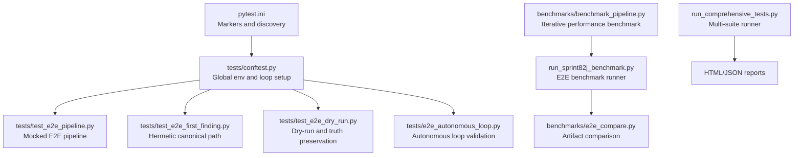
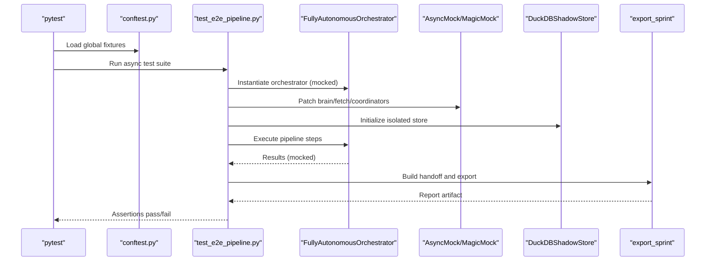
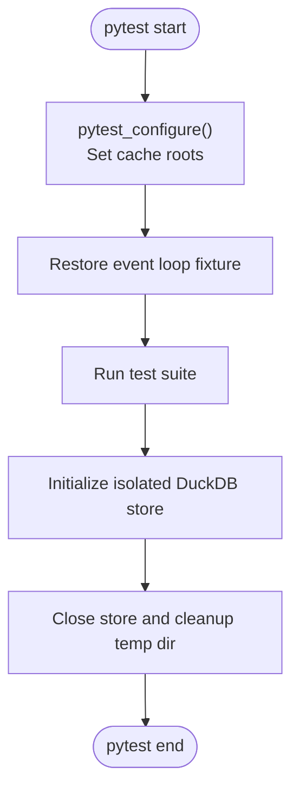
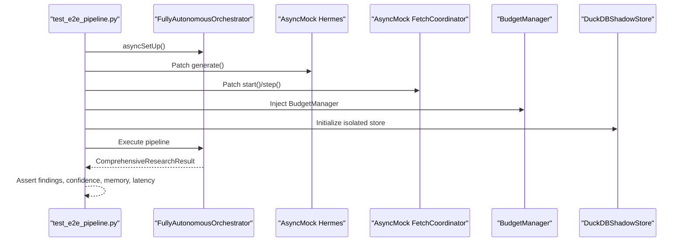
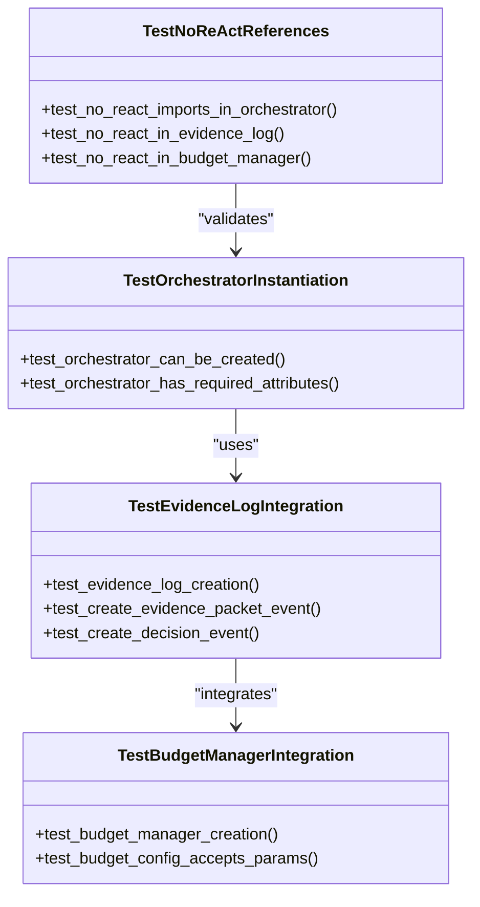
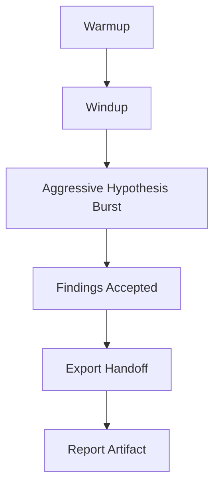
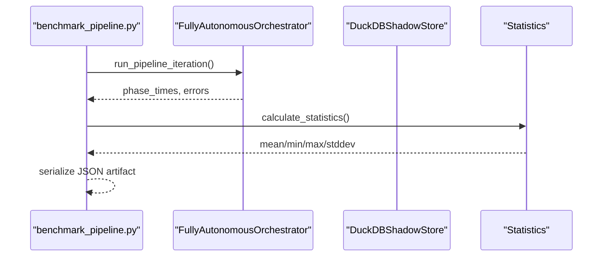
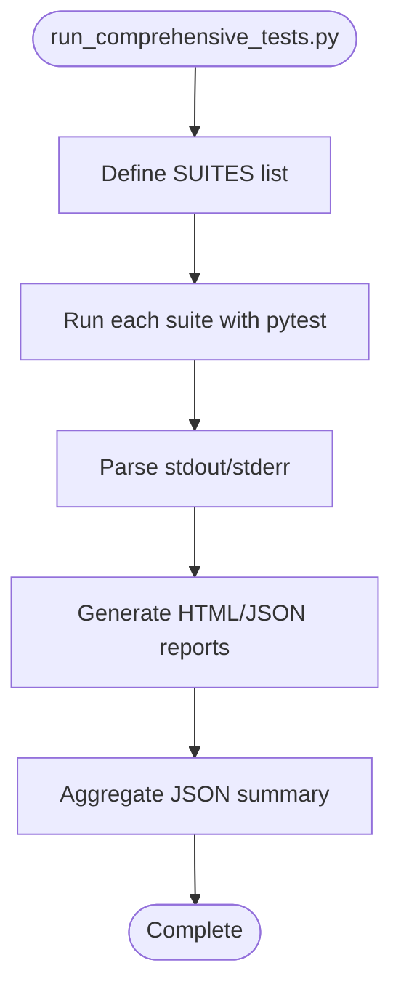
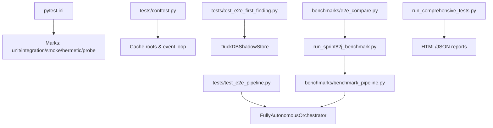

# Integration and End-to-End Testing

<cite>
**Referenced Files in This Document**
- [pytest.ini](file://pytest.ini)
- [conftest.py](file://tests/conftest.py)
- [test_e2e_pipeline.py](file://tests/test_e2e_pipeline.py)
- [test_e2e_first_finding.py](file://tests/test_e2e_first_finding.py)
- [test_e2e_dry_run.py](file://tests/test_e2e_dry_run.py)
- [e2e_autonomous_loop.py](file://tests/e2e_autonomous_loop.py)
- [benchmark_pipeline.py](file://benchmarks/benchmark_pipeline.py)
- [run_sprint82j_benchmark.py](file://benchmarks/run_sprint82j_benchmark.py)
- [e2e_compare.py](file://benchmarks/e2e_compare.py)
- [run_comprehensive_tests.py](file://run_comprehensive_tests.py)
</cite>

## Table of Contents
1. [Introduction](#introduction)
2. [Project Structure](#project-structure)
3. [Core Components](#core-components)
4. [Architecture Overview](#architecture-overview)
5. [Detailed Component Analysis](#detailed-component-analysis)
6. [Dependency Analysis](#dependency-analysis)
7. [Performance Considerations](#performance-considerations)
8. [Troubleshooting Guide](#troubleshooting-guide)
9. [Conclusion](#conclusion)

## Introduction
This document presents a comprehensive testing methodology for integration and end-to-end (E2E) validation across the autonomous research system. It covers holistic validation strategies, environment setup, test data management, and realistic simulation scenarios. The approach emphasizes:
- System-wide validation through fully mocked E2E pipelines
- Autonomous loop testing without external dependencies
- Pipeline integration validation with deterministic fixtures
- Realistic scenario testing with hermetic environments
- Performance benchmarking and regression detection
- Environment isolation and test data hygiene

## Project Structure
The testing framework is organized around pytest with specialized fixtures and markers. Key elements:
- pytest configuration defines marks for categorizing tests (unit, integration, smoke, hermetic, probe).
- Global conftest enforces cache roots and event loop restoration for stability.
- E2E test suites validate the full pipeline with mocked components to avoid flakiness.
- Benchmarks provide performance baselines and comparison logic for regression detection.

**Diagram sources**
- [pytest.ini:1-16](file://pytest.ini#L1-L16)
- [conftest.py:14-97](file://tests/conftest.py#L14-L97)
- [test_e2e_pipeline.py:26-189](file://tests/test_e2e_pipeline.py#L26-L189)
- [test_e2e_first_finding.py:297-796](file://tests/test_e2e_first_finding.py#L297-L796)
- [test_e2e_dry_run.py:19-250](file://tests/test_e2e_dry_run.py#L19-L250)
- [e2e_autonomous_loop.py:16-151](file://tests/e2e_autonomous_loop.py#L16-L151)
- [benchmark_pipeline.py:1-381](file://benchmarks/benchmark_pipeline.py#L1-L381)
- [run_sprint82j_benchmark.py:1216-1230](file://benchmarks/run_sprint82j_benchmark.py#L1216-L1230)
- [e2e_compare.py:222-233](file://benchmarks/e2e_compare.py#L222-L233)
- [run_comprehensive_tests.py:23-800](file://run_comprehensive_tests.py#L23-L800)

**Section sources**
- [pytest.ini:1-16](file://pytest.ini#L1-L16)
- [conftest.py:14-97](file://tests/conftest.py#L14-L97)

## Core Components
- Test configuration and environment:
  - pytest.ini registers marks for test classification and ensures discovery from project root.
  - conftest.py sets cache roots for model caches and restores the event loop after tests that destroy it.
- E2E pipeline validation:
  - test_e2e_pipeline.py validates the end-to-end research pipeline with mocked components, ensuring deterministic behavior and memory budgets.
  - test_e2e_first_finding.py verifies canonical persistence and export handoff with hermetic adapters and isolated stores.
  - test_e2e_dry_run.py exercises the warmup/windup/export cycle and validates truth accounting in aggressive hypothesis bursts.
- Autonomous loop validation:
  - e2e_autonomous_loop.py checks orchestrator instantiation, evidence log events, and budget manager integration without ReAct dependencies.
- Performance benchmarking:
  - benchmark_pipeline.py runs iterative benchmarks across phases and serializes results for comparison.
  - run_sprint82j_benchmark.py orchestrates E2E benchmark execution and records memory and gating metrics.
  - e2e_compare.py compares artifacts to detect regressions and noisy but valid outcomes.
- Multi-suite orchestration:
  - run_comprehensive_tests.py aggregates multiple test suites, captures memory snapshots, and generates HTML/JSON reports.

**Section sources**
- [pytest.ini:1-16](file://pytest.ini#L1-L16)
- [conftest.py:14-97](file://tests/conftest.py#L14-L97)
- [test_e2e_pipeline.py:26-189](file://tests/test_e2e_pipeline.py#L26-L189)
- [test_e2e_first_finding.py:297-796](file://tests/test_e2e_first_finding.py#L297-L796)
- [test_e2e_dry_run.py:19-250](file://tests/test_e2e_dry_run.py#L19-L250)
- [e2e_autonomous_loop.py:16-151](file://tests/e2e_autonomous_loop.py#L16-L151)
- [benchmark_pipeline.py:1-381](file://benchmarks/benchmark_pipeline.py#L1-L381)
- [run_sprint82j_benchmark.py:1216-1230](file://benchmarks/run_sprint82j_benchmark.py#L1216-L1230)
- [e2e_compare.py:222-233](file://benchmarks/e2e_compare.py#L222-L233)
- [run_comprehensive_tests.py:23-800](file://run_comprehensive_tests.py#L23-L800)

## Architecture Overview
The testing architecture integrates pytest fixtures, hermetic adapters, and benchmarking utilities to validate system behavior across realistic scenarios while maintaining isolation and determinism.

**Diagram sources**
- [conftest.py:14-97](file://tests/conftest.py#L14-L97)
- [test_e2e_pipeline.py:29-189](file://tests/test_e2e_pipeline.py#L29-L189)
- [test_e2e_first_finding.py:608-796](file://tests/test_e2e_first_finding.py#L608-L796)
- [test_e2e_dry_run.py:19-250](file://tests/test_e2e_dry_run.py#L19-L250)

## Detailed Component Analysis

### Test Environment Setup and Isolation
- Cache root enforcement:
  - Early bootstrap sets HLEDAC_CACHE_ROOT and related HF_* variables before any imports to avoid cache pollution.
- Event loop repair:
  - Autouse fixture restores or recreates the event loop after tests that call asyncio.run(), preventing subsequent test failures.
- Hermetic stores:
  - DuckDBShadowStore is initialized with isolated LMDB bypass and temp directories to prevent cross-test contamination.

**Diagram sources**
- [conftest.py:14-97](file://tests/conftest.py#L14-L97)
- [test_e2e_first_finding.py:267-291](file://tests/test_e2e_first_finding.py#L267-L291)

**Section sources**
- [conftest.py:14-97](file://tests/conftest.py#L14-L97)
- [test_e2e_first_finding.py:267-291](file://tests/test_e2e_first_finding.py#L267-L291)

### E2E Pipeline Integration Validation
- Mocked pipeline:
  - Asynchronous setup patches core components (brain, fetch coordinator, budget manager) to simulate a full research lifecycle without external I/O.
  - Assertions validate pipeline completion, finding counts, confidence ranges, memory budget adherence, and performance bounds.
- Canonical path verification:
  - test_e2e_first_finding.py validates persistence of canonical findings, export handoff, and source mix consistency using hermetic adapters and isolated stores.

**Diagram sources**
- [test_e2e_pipeline.py:29-189](file://tests/test_e2e_pipeline.py#L29-L189)

**Section sources**
- [test_e2e_pipeline.py:26-189](file://tests/test_e2e_pipeline.py#L26-L189)
- [test_e2e_first_finding.py:297-796](file://tests/test_e2e_first_finding.py#L297-L796)

### Autonomous Loop Testing
- No ReAct references:
  - Validates that orchestrator, evidence log, and budget manager do not import from React modules.
- Instantiation and attributes:
  - Ensures orchestrator creation succeeds and required attributes exist even without MLX availability.
- Evidence log and budget manager integration:
  - Creates evidence packet and decision events and validates BudgetConfig parameters.

**Diagram sources**
- [e2e_autonomous_loop.py:16-151](file://tests/e2e_autonomous_loop.py#L16-L151)

**Section sources**
- [e2e_autonomous_loop.py:16-151](file://tests/e2e_autonomous_loop.py#L16-L151)

### Pipeline Integration Validation and Realistic Scenarios
- Dry-run validation:
  - Exercises warmup, windup, and export with mocked schedulers and IO to ensure canonical truth accounting persists across aggressive hypothesis bursts.
- Scenario fixtures:
  - Uses canned feed entries, public entries, and CT log pivots to simulate realistic discovery and acceptance flows without network dependencies.

**Diagram sources**
- [test_e2e_dry_run.py:19-250](file://tests/test_e2e_dry_run.py#L19-L250)
- [test_e2e_first_finding.py:585-796](file://tests/test_e2e_first_finding.py#L585-L796)

**Section sources**
- [test_e2e_dry_run.py:19-250](file://tests/test_e2e_dry_run.py#L19-L250)
- [test_e2e_first_finding.py:585-796](file://tests/test_e2e_first_finding.py#L585-L796)

### Performance Benchmarking and Regression Detection
- Iterative benchmarking:
  - benchmark_pipeline.py runs multiple iterations with varied queries, measuring phase timings and memory deltas, and serializes statistics.
- E2E benchmarking:
  - run_sprint82j_benchmark.py initializes orchestrator, records memory and gating metrics, and orchestrates E2E execution.
- Artifact comparison:
  - e2e_compare.py compares baseline and new artifacts to determine STABLE_BASELINE, NOISY_BUT_VALID, or other verdicts based on counts and schema compatibility.

**Diagram sources**
- [benchmark_pipeline.py:53-342](file://benchmarks/benchmark_pipeline.py#L53-L342)
- [run_sprint82j_benchmark.py:1216-1230](file://benchmarks/run_sprint82j_benchmark.py#L1216-L1230)
- [e2e_compare.py:201-233](file://benchmarks/e2e_compare.py#L201-L233)

**Section sources**
- [benchmark_pipeline.py:1-381](file://benchmarks/benchmark_pipeline.py#L1-L381)
- [run_sprint82j_benchmark.py:1216-1230](file://benchmarks/run_sprint82j_benchmark.py#L1216-L1230)
- [e2e_compare.py:201-233](file://benchmarks/e2e_compare.py#L201-L233)

### Multi-Suite Orchestration and Reporting
- run_comprehensive_tests.py:
  - Executes multiple suites with timeouts, captures memory snapshots, parses pytest output, and generates HTML/JSON reports with performance and coverage metrics.

**Diagram sources**
- [run_comprehensive_tests.py:23-800](file://run_comprehensive_tests.py#L23-L800)

**Section sources**
- [run_comprehensive_tests.py:23-800](file://run_comprehensive_tests.py#L23-L800)

## Dependency Analysis
- Test categorization:
  - pytest.ini defines markers for slow, stress, timeout, unit, integration, smoke, hermetic, and probe tests to support selective execution and gating.
- Fixture coupling:
  - conftest.py provides global environment setup and event loop repair, reducing duplication across test modules.
- Benchmark coupling:
  - benchmark_pipeline.py and run_sprint82j_benchmark.py depend on orchestrator and store components to measure performance and memory usage.
- Report coupling:
  - run_comprehensive_tests.py depends on pytest HTML/JSON plugins and psutil for memory monitoring.

**Diagram sources**
- [pytest.ini:7-16](file://pytest.ini#L7-L16)
- [conftest.py:14-97](file://tests/conftest.py#L14-L97)
- [test_e2e_pipeline.py:15-44](file://tests/test_e2e_pipeline.py#L15-L44)
- [test_e2e_first_finding.py:30-36](file://tests/test_e2e_first_finding.py#L30-L36)
- [benchmark_pipeline.py:75-158](file://benchmarks/benchmark_pipeline.py#L75-L158)
- [run_sprint82j_benchmark.py:1216-1230](file://benchmarks/run_sprint82j_benchmark.py#L1216-L1230)
- [e2e_compare.py:222-233](file://benchmarks/e2e_compare.py#L222-L233)
- [run_comprehensive_tests.py:693-758](file://run_comprehensive_tests.py#L693-L758)

**Section sources**
- [pytest.ini:7-16](file://pytest.ini#L7-L16)
- [conftest.py:14-97](file://tests/conftest.py#L14-L97)
- [benchmark_pipeline.py:75-158](file://benchmarks/benchmark_pipeline.py#L75-L158)
- [run_sprint82j_benchmark.py:1216-1230](file://benchmarks/run_sprint82j_benchmark.py#L1216-L1230)
- [e2e_compare.py:222-233](file://benchmarks/e2e_compare.py#L222-L233)
- [run_comprehensive_tests.py:693-758](file://run_comprehensive_tests.py#L693-L758)

## Performance Considerations
- Deterministic randomness:
  - E2E pipeline tests use hashed seeds to ensure reproducible sampling and tie-breaking across runs.
- Memory budgeting:
  - Tests assert RSS thresholds and leverage psutil to monitor memory usage during pipeline execution.
- Benchmarking:
  - Iterative benchmarks compute mean, min, max, and stddev for each phase, enabling regression detection and capacity planning.
- Event loop optimization:
  - Use of uvloop in benchmarks improves event loop performance on supported platforms.

[No sources needed since this section provides general guidance]

## Troubleshooting Guide
- Event loop errors:
  - Symptom: "There is no current event loop in thread 'MainThread'" after tests using asyncio.run().
  - Resolution: The autouse fixture restores or recreates the event loop automatically.
- Cache root conflicts:
  - Symptom: Unexpected model cache usage in user home directories.
  - Resolution: Ensure HLEDAC_CACHE_ROOT and HF_* variables are set before imports via pytest_configure.
- Store isolation failures:
  - Symptom: Duplicate findings or cross-test contamination.
  - Resolution: Initialize DuckDBShadowStore with isolated LMDB bypass and temp directories; verify unique tmpdir per test.
- Benchmark artifact mismatches:
  - Symptom: Comparison verdict indicates noisy or unstable baseline.
  - Resolution: Use e2e_compare.py to analyze schema mismatch and count differences; adjust test queries or durations accordingly.

**Section sources**
- [conftest.py:68-97](file://tests/conftest.py#L68-L97)
- [test_e2e_first_finding.py:267-291](file://tests/test_e2e_first_finding.py#L267-L291)
- [e2e_compare.py:201-233](file://benchmarks/e2e_compare.py#L201-L233)

## Conclusion
The testing framework establishes a robust, hermetic, and deterministic approach to validating the autonomous research system. By combining mocked E2E pipelines, canonical persistence checks, and performance benchmarks, it ensures system-wide correctness, realistic scenario coverage, and reliable regression detection. The use of isolated environments, deterministic seeds, and comprehensive reporting enables scalable validation across diverse test suites and continuous integration workflows.