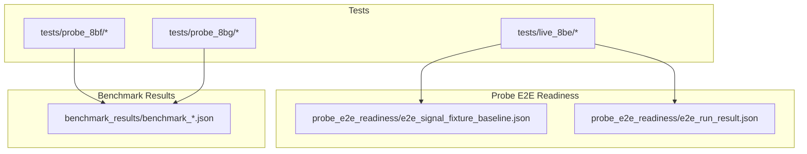
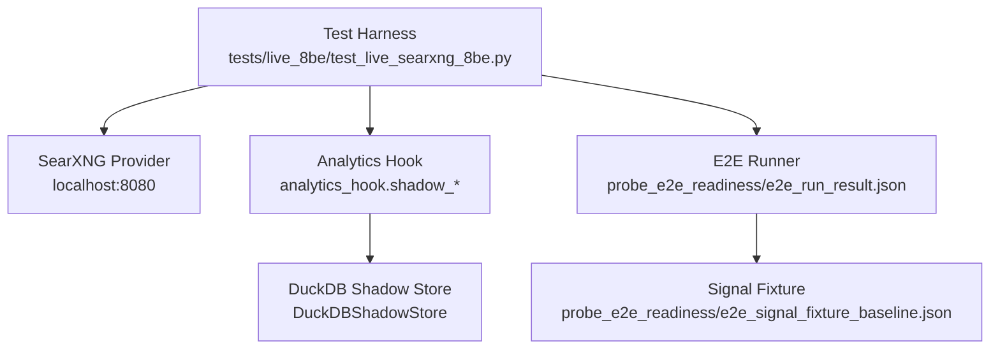
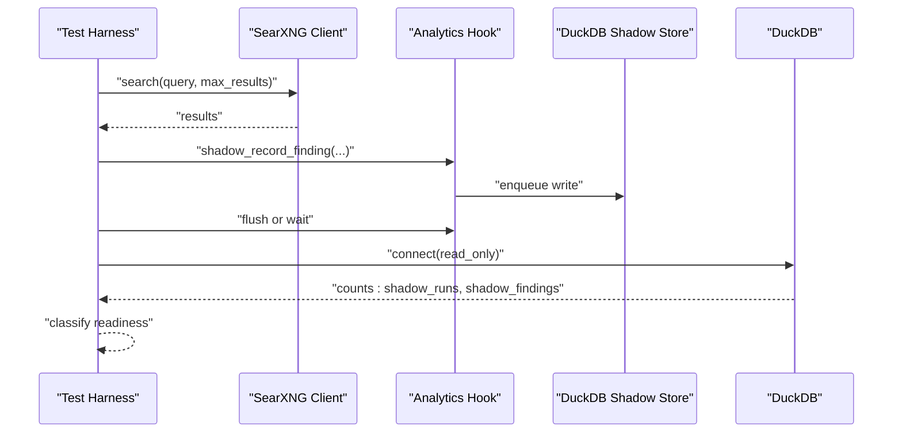
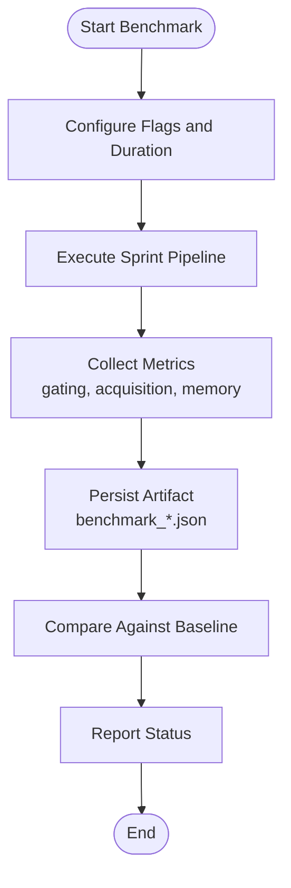
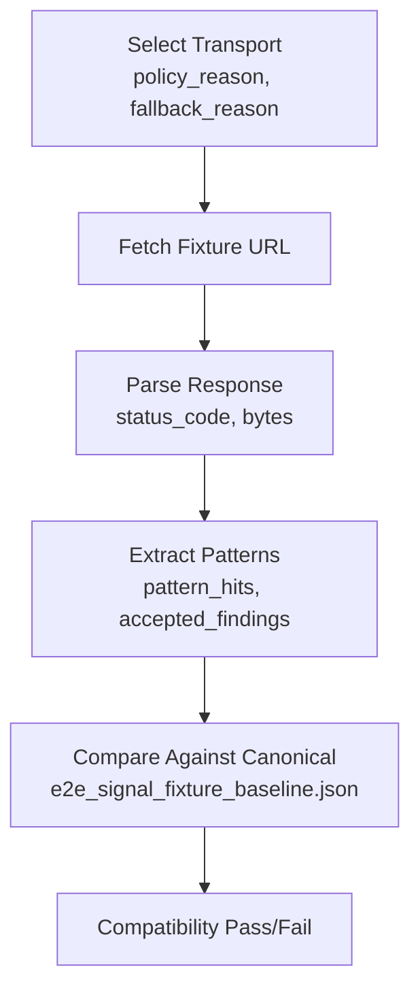
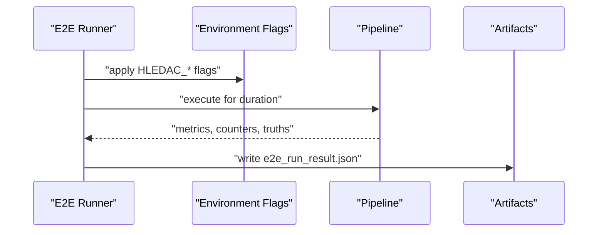
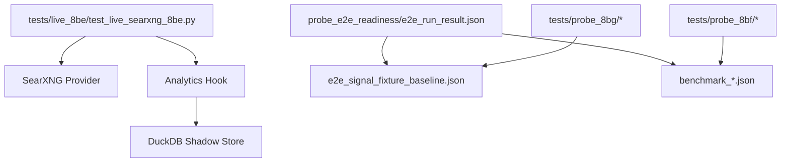

# Integration and End-to-End Probes

<cite>
**Referenced Files in This Document**
- [test_live_searxng_8be.py](file://tests/live_8be/test_live_searxng_8be.py)
- [FINAL_REPORT_8BE.md](file://tests/live_8be/FINAL_REPORT_8BE.md)
- [e2e_signal_fixture_baseline.json](file://probe_e2e_readiness/e2e_signal_fixture_baseline.json)
- [e2e_run_result.json](file://probe_e2e_readiness/e2e_run_result.json)
- [benchmark_20260311_004339.json](file://benchmark_results/benchmark_20260311_004339.json)
</cite>

## Table of Contents
1. [Introduction](#introduction)
2. [Project Structure](#project-structure)
3. [Core Components](#core-components)
4. [Architecture Overview](#architecture-overview)
5. [Detailed Component Analysis](#detailed-component-analysis)
6. [Dependency Analysis](#dependency-analysis)
7. [Performance Considerations](#performance-considerations)
8. [Troubleshooting Guide](#troubleshooting-guide)
9. [Conclusion](#conclusion)

## Introduction
This document explains the integration and end-to-end (e2e) testing system used to validate system readiness, signal fixture correctness, and whole-chain hermetic behavior. It focuses on three key probe categories:
- E2e readiness assessment: validating that external providers and internal stores are ready for production-like runs.
- Signal fixture validation: ensuring consistent, canonical behavior across transports and environments.
- Whole-chain hermetic testing: verifying that the integrated pipeline behaves deterministically under controlled conditions.

It documents sophisticated scenarios validated by probes such as probe_8be (live pipeline testing), probe_8bf (import baseline validation), and probe_8bg (compatibility testing). The document also provides examples of integration test execution, cross-component validation, and system-wide functionality verification, and explains how integration probes ensure component interoperability and system stability.

## Project Structure
The integration and e2e testing ecosystem centers around:
- Probe harnesses and reports under tests/, including specialized suites like live_8be, probe_8bf, and probe_8bg.
- E2e readiness artifacts under probe_e2e_readiness/, including canonical signal fixtures and run summaries.
- Benchmark artifacts under benchmark_results/, capturing performance baselines and gating metrics.

**Diagram sources**
- [test_live_searxng_8be.py:1-239](file://tests/live_8be/test_live_searxng_8be.py#L1-L239)
- [e2e_signal_fixture_baseline.json:1-129](file://probe_e2e_readiness/e2e_signal_fixture_baseline.json#L1-L129)
- [e2e_run_result.json:1-38](file://probe_e2e_readiness/e2e_run_result.json#L1-L38)
- [benchmark_20260311_004339.json:1-85](file://benchmark_results/benchmark_20260311_004339.json#L1-L85)

**Section sources**
- [test_live_searxng_8be.py:1-239](file://tests/live_8be/test_live_searxng_8be.py#L1-L239)
- [e2e_signal_fixture_baseline.json:1-129](file://probe_e2e_readiness/e2e_signal_fixture_baseline.json#L1-L129)
- [e2e_run_result.json:1-38](file://probe_e2e_readiness/e2e_run_result.json#L1-L38)
- [benchmark_20260311_004339.json:1-85](file://benchmark_results/benchmark_20260311_004339.json#L1-L85)

## Core Components
- E2e readiness assessment: Validates provider connectivity, response quality, and store persistence. Example: probe_8be’s live run against a local SearXNG instance with DuckDB shadow analytics verification.
- Signal fixture validation: Compares canonical outcomes across transports and configurations to detect regressions. Example: e2e_signal_fixture_baseline.json captures expected transport selection, status codes, and pattern hits.
- Whole-chain hermetic testing: Runs the integrated pipeline under controlled flags and durations, reporting acceptance counts, transport usage, and runtime truths. Example: e2e_run_result.json summarizes a sprint run with environment flags and counters.

Key integration points:
- Transport selection and fallback reasoning.
- Provider hit rates and latency.
- Analytics shadow store ingestion and persistence.
- Memory and timing truth presence for diagnostics.

**Section sources**
- [test_live_searxng_8be.py:25-135](file://tests/live_8be/test_live_searxng_8be.py#L25-L135)
- [e2e_signal_fixture_baseline.json:1-129](file://probe_e2e_readiness/e2e_signal_fixture_baseline.json#L1-L129)
- [e2e_run_result.json:1-38](file://probe_e2e_readiness/e2e_run_result.json#L1-L38)

## Architecture Overview
The integration architecture ties together external providers, internal analytics stores, and transport layers, while capturing canonical outcomes for comparison.

**Diagram sources**
- [test_live_searxng_8be.py:48-115](file://tests/live_8be/test_live_searxng_8be.py#L48-L115)
- [e2e_run_result.json:10-37](file://probe_e2e_readiness/e2e_run_result.json#L10-L37)
- [e2e_signal_fixture_baseline.json:1-129](file://probe_e2e_readiness/e2e_signal_fixture_baseline.json#L1-L129)

## Detailed Component Analysis

### Probe 8BE: Live Pipeline Testing
Probe 8BE executes a bounded live run against a local SearXNG instance, verifies analytics ingestion into DuckDB shadow storage, and classifies readiness based on provider hit rate and finding volume.

**Diagram sources**
- [test_live_searxng_8be.py:70-187](file://tests/live_8be/test_live_searxng_8be.py#L70-L187)

Key behaviors validated:
- Provider connectivity and response quality (hit rate and latency).
- Shadow analytics ingestion and persistence checks.
- Feature-flag gating and lazy import semantics.
- Classification logic for readiness states.

Operational notes:
- Environment flags and timeouts are configured at runtime.
- DuckDB connection logic handles both file-backed and in-memory modes.
- Final classification depends on hit rate thresholds and finding counts.

**Section sources**
- [test_live_searxng_8be.py:25-234](file://tests/live_8be/test_live_searxng_8be.py#L25-L234)
- [FINAL_REPORT_8BE.md:1-152](file://tests/live_8be/FINAL_REPORT_8BE.md#L1-L152)

### Probe 8BF: Import Baseline Validation
Probe 8BF validates import-related baselines and regression risks by running short-duration benchmarks and capturing gating and acquisition metrics. These results serve as canonical baselines for detecting import-time changes.

**Diagram sources**
- [benchmark_20260311_004339.json:1-85](file://benchmark_results/benchmark_20260311_004339.json#L1-L85)

Validation scope:
- Gating metrics (accepts, holds, evictions).
- Acquisition metrics (CT attempts, Wayback quick/CDX, CommonCrawl).
- Memory metrics (RSS, pressure events).
- Synthesis outcomes and latency.

**Section sources**
- [benchmark_20260311_004339.json:1-85](file://benchmark_results/benchmark_20260311_004339.json#L1-L85)

### Probe 8BG: Compatibility Testing
Probe 8BG ensures compatibility across transports and configurations by selecting a canonical transport and validating consistent outcomes. The signal fixture artifact encodes expected selections, status codes, and pattern hits.

**Diagram sources**
- [e2e_signal_fixture_baseline.json:1-129](file://probe_e2e_readiness/e2e_signal_fixture_baseline.json#L1-L129)

Validation scope:
- Transport selection and fallback decisions.
- HTTP version and status code consistency.
- Pattern hit counts and types.
- Transport counters and error absence.

**Section sources**
- [e2e_signal_fixture_baseline.json:1-129](file://probe_e2e_readiness/e2e_signal_fixture_baseline.json#L1-L129)

### E2e Readiness Runner
The e2e readiness runner coordinates a full sprint run under controlled flags, capturing environment variables, transport counters, and runtime truths. The resulting artifact serves as a canonical snapshot for comparison.

**Diagram sources**
- [e2e_run_result.json:1-38](file://probe_e2e_readiness/e2e_run_result.json#L1-L38)

Highlights:
- Controlled execution window and exit code.
- Captured transport counters and runtime truths.
- Standardized report paths and status.

**Section sources**
- [e2e_run_result.json:1-38](file://probe_e2e_readiness/e2e_run_result.json#L1-L38)

## Dependency Analysis
Integration probes depend on:
- External providers (e.g., SearXNG) for live data.
- Internal analytics hooks and stores for ingestion validation.
- Transport selection logic for canonical behavior.
- Benchmark artifacts for import-time regression detection.

**Diagram sources**
- [test_live_searxng_8be.py:58-115](file://tests/live_8be/test_live_searxng_8be.py#L58-L115)
- [e2e_run_result.json:1-38](file://probe_e2e_readiness/e2e_run_result.json#L1-L38)
- [e2e_signal_fixture_baseline.json:1-129](file://probe_e2e_readiness/e2e_signal_fixture_baseline.json#L1-L129)
- [benchmark_20260311_004339.json:1-85](file://benchmark_results/benchmark_20260311_004339.json#L1-L85)

**Section sources**
- [test_live_searxng_8be.py:58-115](file://tests/live_8be/test_live_searxng_8be.py#L58-L115)
- [e2e_run_result.json:1-38](file://probe_e2e_readiness/e2e_run_result.json#L1-L38)
- [e2e_signal_fixture_baseline.json:1-129](file://probe_e2e_readiness/e2e_signal_fixture_baseline.json#L1-L129)
- [benchmark_20260311_004339.json:1-85](file://benchmark_results/benchmark_20260311_004339.json#L1-L85)

## Performance Considerations
- Provider latency and hit rate directly impact throughput and quality. The live harness measures per-query latency and aggregates hit rates to classify readiness.
- DuckDB ingestion and flushing must be validated to avoid in-memory-only persistence, which can mask storage issues.
- Benchmark artifacts capture memory pressure and synthesis latencies, enabling detection of regressions in resource usage.

[No sources needed since this section provides general guidance]

## Troubleshooting Guide
Common issues and resolutions:
- Provider connectivity failures: Verify base URL and network reachability; confirm JSON endpoint parsing.
- Analytics ingestion failures: Confirm shadow flag is enabled, queue drains without errors, and DuckDB connection targets the correct path.
- Storage path bugs: Ensure the shadow store initializes the correct database path for both in-memory and file-backed modes.
- Transport selection anomalies: Review policy reasons and fallback logic captured in the e2e run result artifact.

Actionable references:
- Live run and classification logic: [test_live_searxng_8be.py:220-234](file://tests/live_8be/test_live_searxng_8be.py#L220-L234)
- DuckDB verification and connection logic: [test_live_searxng_8be.py:140-187](file://tests/live_8be/test_live_searxng_8be.py#L140-L187)
- Canonical transport expectations: [e2e_signal_fixture_baseline.json:1-129](file://probe_e2e_readiness/e2e_signal_fixture_baseline.json#L1-L129)
- Full run summary and counters: [e2e_run_result.json:1-38](file://probe_e2e_readiness/e2e_run_result.json#L1-L38)

**Section sources**
- [test_live_searxng_8be.py:140-187](file://tests/live_8be/test_live_searxng_8be.py#L140-L187)
- [test_live_searxng_8be.py:220-234](file://tests/live_8be/test_live_searxng_8be.py#L220-L234)
- [e2e_signal_fixture_baseline.json:1-129](file://probe_e2e_readiness/e2e_signal_fixture_baseline.json#L1-L129)
- [e2e_run_result.json:1-38](file://probe_e2e_readiness/e2e_run_result.json#L1-L38)

## Conclusion
The integration and e2e probes system provides robust, repeatable validation across live providers, canonical fixtures, and whole-chain runs. Probe 8BE demonstrates live pipeline readiness with provider hit rates and analytics persistence; probe 8BF anchors import-time stability via benchmark baselines; and probe 8BG ensures transport and configuration compatibility through canonical signal fixtures. Together, these probes guarantee component interoperability, system stability, and deterministic behavior under controlled conditions.