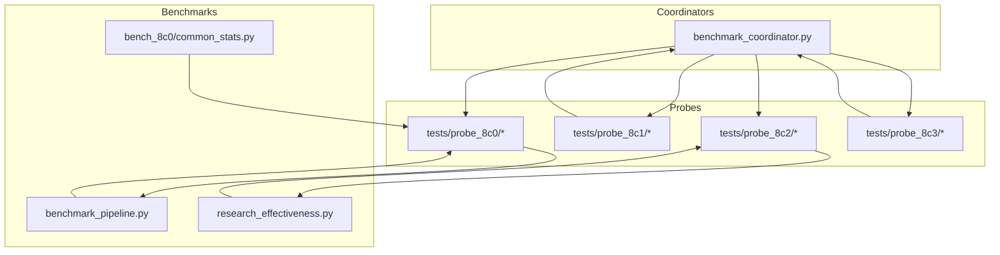
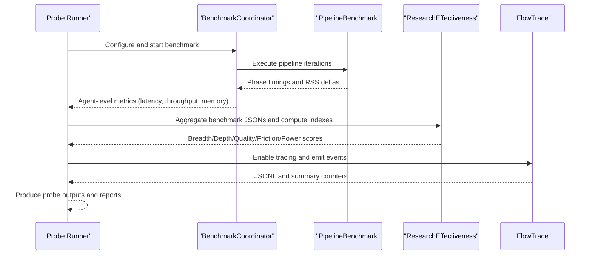
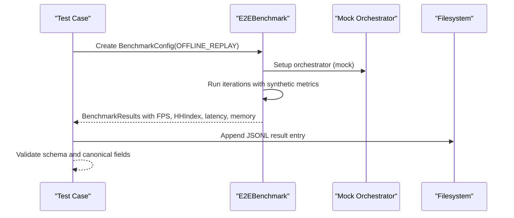
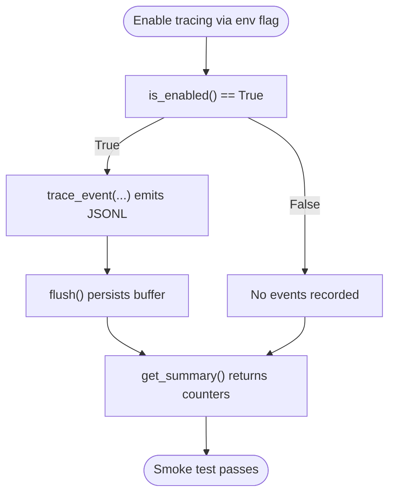
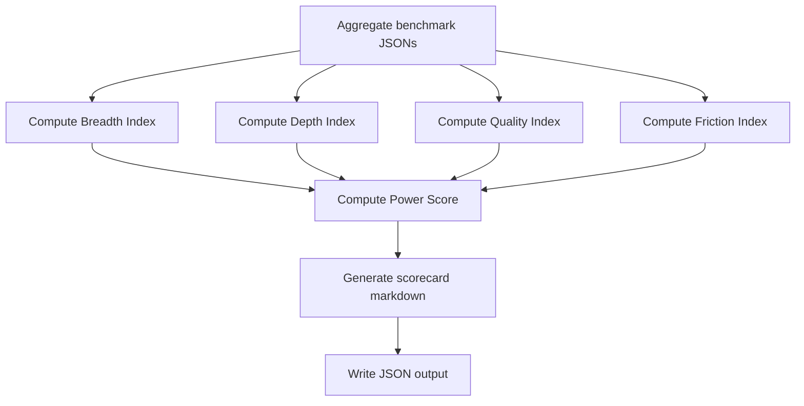
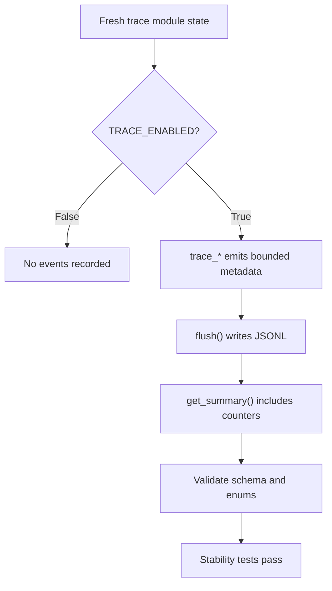
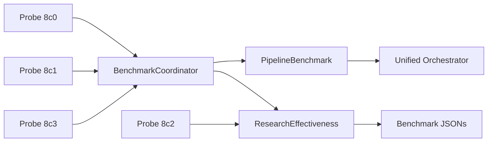

# Performance and Benchmark Probes

<cite>
**Referenced Files in This Document**
- [benchmark_coordinator.py](file://coordinators/benchmark_coordinator.py)
- [benchmark_pipeline.py](file://benchmarks/benchmark_pipeline.py)
- [research_effectiveness.py](file://benchmarks/research_effectiveness.py)
- [common_stats.py](file://benchmarks/bench_8c0/common_stats.py)
- [test_bench_e2e_baseline.py](file://tests/probe_8c0/test_bench_e2e_baseline.py)
- [test_flow_trace_smoke.py](file://tests/probe_8c1/test_flow_trace_smoke.py)
- [test_research_effectiveness.py](file://tests/probe_8c2/test_research_effectiveness.py)
- [test_8c3_schema.py](file://tests/probe_8c3/test_8c3_schema.py)
</cite>

## Table of Contents
1. [Introduction](#introduction)
2. [Project Structure](#project-structure)
3. [Core Components](#core-components)
4. [Architecture Overview](#architecture-overview)
5. [Detailed Component Analysis](#detailed-component-analysis)
6. [Dependency Analysis](#dependency-analysis)
7. [Performance Considerations](#performance-considerations)
8. [Troubleshooting Guide](#troubleshooting-guide)
9. [Conclusion](#conclusion)

## Introduction
This document describes the performance and benchmark probe system used to evaluate and monitor the Hledac platform. It focuses on four specialized probes:
- Probe 8c0: End-to-end benchmarking and canonical FPS/memory metrics
- Probe 8c1: Flow tracing for runtime observability and schema validation
- Probe 8c2: Research effectiveness scoring for breadth, depth, quality, friction, and power score
- Probe 8c3: Schema validation and stability for flow trace events

It explains measurement methodologies, execution patterns, and result interpretation, and shows how these probes integrate with the broader testing ecosystem to drive system optimization.

## Project Structure
The performance and benchmark system spans several modules:
- Coordinators: centralized benchmark orchestration and reporting
- Benchmarks: reusable benchmark suites and scorecard computations
- Tests: probe-specific suites validating behavior, schema, and determinism

**Diagram sources**
- [benchmark_coordinator.py](file://coordinators/benchmark_coordinator.py)
- [benchmark_pipeline.py](file://benchmarks/benchmark_pipeline.py)
- [research_effectiveness.py](file://benchmarks/research_effectiveness.py)
- [common_stats.py](file://benchmarks/bench_8c0/common_stats.py)
- [test_bench_e2e_baseline.py](file://tests/probe_8c0/test_bench_e2e_baseline.py)
- [test_flow_trace_smoke.py](file://tests/probe_8c1/test_flow_trace_smoke.py)
- [test_research_effectiveness.py](file://tests/probe_8c2/test_research_effectiveness.py)
- [test_8c3_schema.py](file://tests/probe_8c3/test_8c3_schema.py)

**Section sources**
- [benchmark_coordinator.py](file://coordinators/benchmark_coordinator.py)
- [benchmark_pipeline.py](file://benchmarks/benchmark_pipeline.py)
- [research_effectiveness.py](file://benchmarks/research_effectiveness.py)
- [common_stats.py](file://benchmarks/bench_8c0/common_stats.py)
- [test_bench_e2e_baseline.py](file://tests/probe_8c0/test_bench_e2e_baseline.py)
- [test_flow_trace_smoke.py](file://tests/probe_8c1/test_flow_trace_smoke.py)
- [test_research_effectiveness.py](file://tests/probe_8c2/test_research_effectiveness.py)
- [test_8c3_schema.py](file://tests/probe_8c3/test_8c3_schema.py)

## Core Components
- Benchmark Coordinator: orchestrates agent-level performance measurement, collects latency, throughput, memory, and reliability metrics, and generates comparative reports and recommendations.
- Pipeline Benchmark: measures end-to-end pipeline phases (discovery, fetch, embed, hypothesis, export) and memory deltas across repeated runs.
- Research Effectiveness: computes breadth, depth, quality, friction, and a composite power score from benchmark/aggregation artifacts.
- Probe 8c0 Utilities: standardized percentile computation, warmup/measure cycles, deterministic JSONL schema, and fixture loaders.
- Flow Trace: runtime tracing module enabling event capture with strict schema and bounded metadata, plus comprehensive event categories for challenge, fallback, evidence, and snapshots.

**Section sources**
- [benchmark_coordinator.py](file://coordinators/benchmark_coordinator.py)
- [benchmark_pipeline.py](file://benchmarks/benchmark_pipeline.py)
- [research_effectiveness.py](file://benchmarks/research_effectiveness.py)
- [common_stats.py](file://benchmarks/bench_8c0/common_stats.py)
- [test_flow_trace_smoke.py](file://tests/probe_8c1/test_flow_trace_smoke.py)

## Architecture Overview
The probes integrate with the broader system via:
- Centralized benchmarking orchestration feeding canonical metrics to probe outputs
- Pipeline benchmarking validating end-to-end throughput and memory behavior
- Research effectiveness aggregation transforming raw benchmark artifacts into interpretable indexes
- Flow tracing providing structured runtime telemetry with schema guarantees

**Diagram sources**
- [benchmark_coordinator.py](file://coordinators/benchmark_coordinator.py)
- [benchmark_pipeline.py](file://benchmarks/benchmark_pipeline.py)
- [research_effectiveness.py](file://benchmarks/research_effectiveness.py)
- [test_flow_trace_smoke.py](file://tests/probe_8c1/test_flow_trace_smoke.py)

## Detailed Component Analysis

### Probe 8c0: End-to-End Benchmarking
Probe 8c0 validates canonical FPS, HHIndex, latency percentiles, and memory metrics in an offline replay mode. It ensures the benchmark harness captures:
- Iterations, findings count, sources count
- FPS for benchmark, findings, and sources
- P95 latency in milliseconds
- HHIndex derived from action selection distributions
- Wall clock and research loop elapsed times
- Memory RSS start/peak/delta

Execution pattern:
- Offline replay mode disables live network calls
- Minimal orchestrator mock returns synthetic results
- Canonical fields validated via schema tests
- Deterministic JSONL emission for reproducible reporting

**Diagram sources**
- [test_bench_e2e_baseline.py](file://tests/probe_8c0/test_bench_e2e_baseline.py)

**Section sources**
- [test_bench_e2e_baseline.py](file://tests/probe_8c0/test_bench_e2e_baseline.py)
- [common_stats.py](file://benchmarks/bench_8c0/common_stats.py)

### Probe 8c1: Flow Tracing
Probe 8c1 validates flow tracing behavior:
- Disabled by default; enabled via environment flag
- Event emission without crashes on invalid inputs
- Summary retrieval and sampling controls
- Enumerations and canonical event schema preserved

**Diagram sources**
- [test_flow_trace_smoke.py](file://tests/probe_8c1/test_flow_trace_smoke.py)

**Section sources**
- [test_flow_trace_smoke.py](file://tests/probe_8c1/test_flow_trace_smoke.py)

### Probe 8c2: Research Effectiveness
Probe 8c2 validates research effectiveness scoring:
- Normalization helpers for source families, acquisition modes, confidence buckets, and severity
- Breadth index: source family diversity, domain/TLD/content variety
- Depth index: archive resurrection, unindexed access, hidden service hits, frontier depth
- Quality index: findings per minute, novelty, corroboration, evidence completeness
- Friction index: challenge issuance/solve rates, fallbacks after 403/429
- Power score: weighted combination with tier assignment

**Diagram sources**
- [research_effectiveness.py](file://benchmarks/research_effectiveness.py)

**Section sources**
- [test_research_effectiveness.py](file://tests/probe_8c2/test_research_effectiveness.py)
- [research_effectiveness.py](file://benchmarks/research_effectiveness.py)

### Probe 8c3: Schema Validation
Probe 8c3 ensures schema stability and safe defaults:
- Disabled-by-default behavior with no event recording
- Canonical enums enforced (frozensets)
- Core trace_event schema preserved (fields like ts, run_id, component, stage, event_type, url, target, status, elapsed_ms, metadata)
- Bounded metadata: oversized lists truncated to 20 items, nested dicts to 10 items
- Fail-open behavior: tracing errors do not crash runtime
- Counter accumulation and snapshot events validated
- Extended evidence funnel and challenge/fallback events covered

**Diagram sources**
- [test_8c3_schema.py](file://tests/probe_8c3/test_8c3_schema.py)

**Section sources**
- [test_8c3_schema.py](file://tests/probe_8c3/test_8c3_schema.py)

## Dependency Analysis
- Benchmark Coordinator depends on orchestrator abstractions and integrates with pipeline and agent benchmarks to produce comparative reports.
- Pipeline Benchmark relies on orchestrator entry points and measures phase durations and memory deltas.
- Research Effectiveness depends on aggregated benchmark artifacts and normalizers to compute indexes.
- Probe utilities depend on fixture manifests and availability checks for optional libraries.

**Diagram sources**
- [benchmark_coordinator.py](file://coordinators/benchmark_coordinator.py)
- [benchmark_pipeline.py](file://benchmarks/benchmark_pipeline.py)
- [research_effectiveness.py](file://benchmarks/research_effectiveness.py)
- [test_bench_e2e_baseline.py](file://tests/probe_8c0/test_bench_e2e_baseline.py)
- [test_flow_trace_smoke.py](file://tests/probe_8c1/test_flow_trace_smoke.py)
- [test_research_effectiveness.py](file://tests/probe_8c2/test_research_effectiveness.py)
- [test_8c3_schema.py](file://tests/probe_8c3/test_8c3_schema.py)

**Section sources**
- [benchmark_coordinator.py](file://coordinators/benchmark_coordinator.py)
- [benchmark_pipeline.py](file://benchmarks/benchmark_pipeline.py)
- [research_effectiveness.py](file://benchmarks/research_effectiveness.py)
- [test_bench_e2e_baseline.py](file://tests/probe_8c0/test_bench_e2e_baseline.py)
- [test_flow_trace_smoke.py](file://tests/probe_8c1/test_flow_trace_smoke.py)
- [test_research_effectiveness.py](file://tests/probe_8c2/test_research_effectiveness.py)
- [test_8c3_schema.py](file://tests/probe_8c3/test_8c3_schema.py)

## Performance Considerations
- Warmup and repeat cycles reduce cold-start variability; use warmup-and-measure utilities to stabilize measurements.
- Percentile computation (e.g., P95) provides robust latency insights under tail conditions.
- Memory profiling tracks RSS and growth rates; combine with system metrics to detect leaks and regressions.
- Pipeline benchmarking isolates phases and memory deltas to identify bottlenecks across discovery, fetch, embed, hypothesis, and export.
- Research effectiveness scoring offers interpretable composite metrics to guide optimization priorities.

[No sources needed since this section provides general guidance]

## Troubleshooting Guide
- Flow tracing disabled by default: enable via environment flag; verify sampling and max events settings.
- Schema violations: ensure event metadata stays within bounds; rely on fail-open behavior to avoid runtime crashes.
- Availability checks: probe utilities verify optional dependencies (e.g., MLX, uvloop); handle missing dependencies gracefully.
- Research effectiveness computation: when data is insufficient, functions return unavailable with reasons; aggregate more runs to improve coverage.

**Section sources**
- [test_flow_trace_smoke.py](file://tests/probe_8c1/test_flow_trace_smoke.py)
- [test_8c3_schema.py](file://tests/probe_8c3/test_8c3_schema.py)
- [common_stats.py](file://benchmarks/bench_8c0/common_stats.py)
- [research_effectiveness.py](file://benchmarks/research_effectiveness.py)

## Conclusion
The performance and benchmark probe system provides a comprehensive toolkit for measuring, tracing, and interpreting system performance. Probe 8c0 establishes canonical FPS and latency metrics; Probe 8c1 enables safe, schema-preserving runtime tracing; Probe 8c2 transforms raw artifacts into actionable research effectiveness indexes; and Probe 8c3 enforces schema stability and safe defaults. Together, they support continuous optimization and reliable regression detection across the platform.