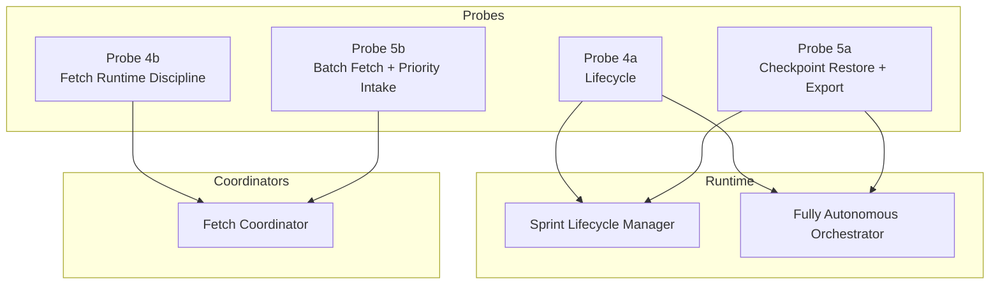
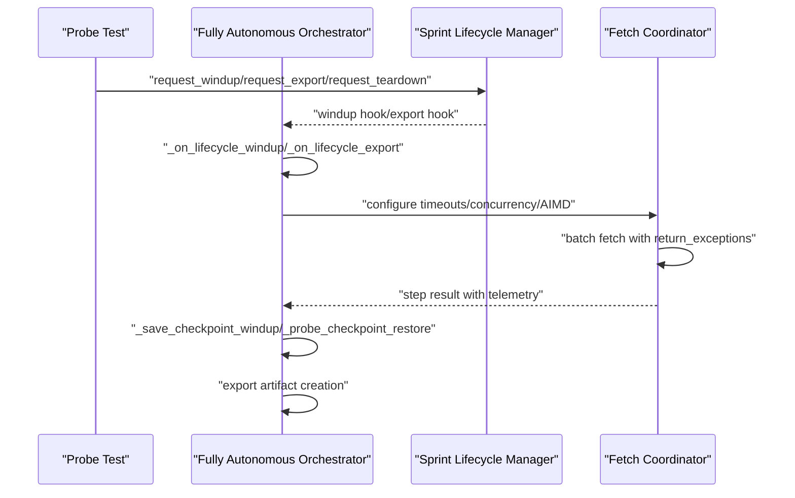
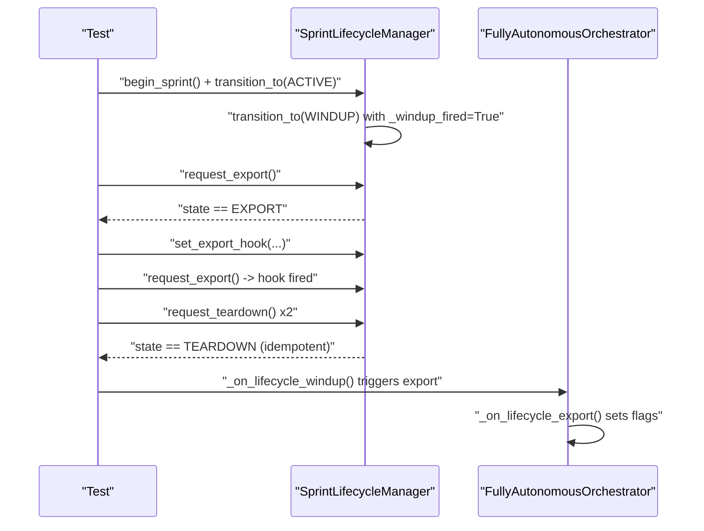
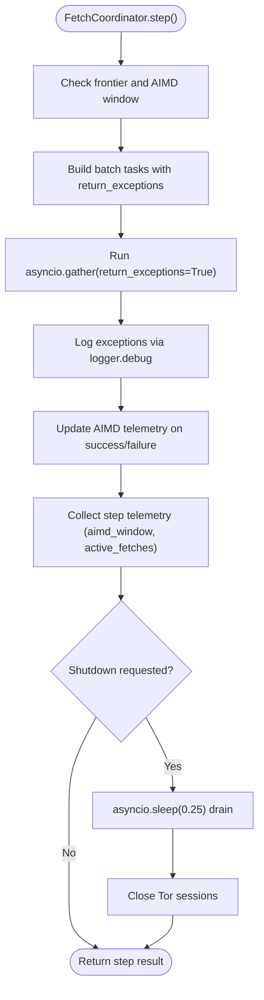
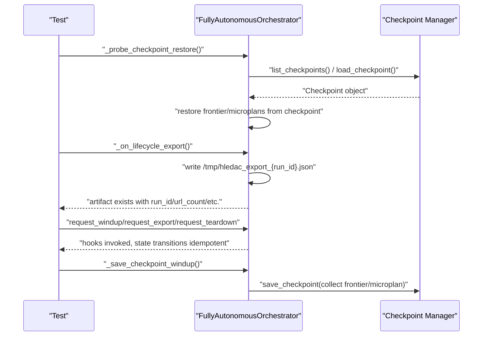
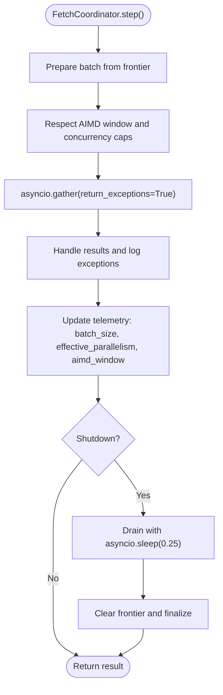
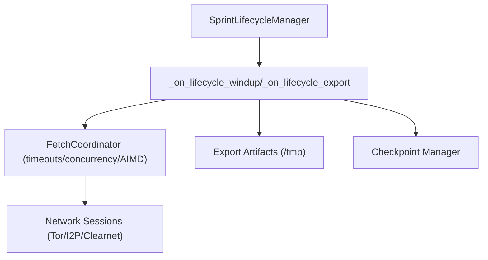

# Advanced Functionality Probes (4a-5b)

<cite>
**Referenced Files in This Document**
- [test_lifecycle_4a.py](file://tests/probe_4a/test_lifecycle_4a.py)
- [test_fetch_4b.py](file://tests/probe_4b/test_fetch_4b.py)
- [test_probe_5a.py](file://tests/probe_5a/test_probe_5a.py)
- [test_batch_fetch.py](file://tests/probe_5b/test_batch_fetch.py)
- [sprint_lifecycle.py](file://runtime/sprint_lifecycle.py)
- [sprint_lifecycle.py](file://utils/sprint_lifecycle.py)
- [fetch_coordinator.py](file://coordinators/fetch_coordinator.py)
- [autonomous_orchestrator.py](file://autonomous_orchestrator.py)
</cite>

## Table of Contents
1. [Introduction](#introduction)
2. [Project Structure](#project-structure)
3. [Core Components](#core-components)
4. [Architecture Overview](#architecture-overview)
5. [Detailed Component Analysis](#detailed-component-analysis)
6. [Dependency Analysis](#dependency-analysis)
7. [Performance Considerations](#performance-considerations)
8. [Troubleshooting Guide](#troubleshooting-guide)
9. [Conclusion](#conclusion)

## Introduction
This document presents advanced functionality probes covering the 4a through 5b series. These probes focus on sophisticated validation tests that assess complex system behaviors, performance characteristics, and advanced operational scenarios. They validate research orchestration, advanced data processing, and system resilience under varied conditions. The probes emphasize:
- Lifecycle orchestration and state transitions (4a)
- Fetch runtime discipline, concurrency control, and adaptive pacing (4b)
- Checkpoint restore, export sinks, and lifecycle telemetry (5a)
- Batch fetch pipelines, adaptive capacity consumption, and priority intake (5b)

The content provides concrete examples of test implementations, performance benchmarking strategies, edge-case handling, and quality assurance measures.

## Project Structure
The probes are organized under the tests/probe_XY directory structure, with each probe validating a specific aspect of the system. The relevant implementation modules are located under runtime, utils, coordinators, and the autonomous orchestrator.

**Diagram sources**
- [test_lifecycle_4a.py:1-220](file://tests/probe_4a/test_lifecycle_4a.py#L1-L220)
- [test_fetch_4b.py:1-351](file://tests/probe_4b/test_fetch_4b.py#L1-L351)
- [test_probe_5a.py:1-559](file://tests/probe_5a/test_probe_5a.py#L1-L559)
- [test_batch_fetch.py:1-312](file://tests/probe_5b/test_batch_fetch.py#L1-L312)
- [sprint_lifecycle.py](file://runtime/sprint_lifecycle.py)
- [sprint_lifecycle.py](file://utils/sprint_lifecycle.py)
- [fetch_coordinator.py](file://coordinators/fetch_coordinator.py)
- [autonomous_orchestrator.py](file://autonomous_orchestrator.py)

**Section sources**
- [test_lifecycle_4a.py:1-220](file://tests/probe_4a/test_lifecycle_4a.py#L1-L220)
- [test_fetch_4b.py:1-351](file://tests/probe_4b/test_fetch_4b.py#L1-L351)
- [test_probe_5a.py:1-559](file://tests/probe_5a/test_probe_5a.py#L1-L559)
- [test_batch_fetch.py:1-312](file://tests/probe_5b/test_batch_fetch.py#L1-L312)

## Core Components
- Sprint Lifecycle Manager: Manages state transitions and hooks for windup, export, and teardown, with fail-open resilience and idempotent operations.
- Fetch Coordinator: Implements timeout/concurrency matrices, AIMD adaptive concurrency control, batch fetch pipelines, and robust exception handling/logging.
- Fully Autonomous Orchestrator: Coordinates lifecycle events, checkpoint restore/save, export artifacts, and background task tracking.
- Telemetry and Metrics: Captures AIMD window, active fetches, batch size, and effective parallelism for observability.

Key responsibilities validated by probes:
- Real, observable transitions (not just flag flips)
- Fail-open behavior for missing components
- Idempotent state transitions
- Adaptive concurrency respecting hard limits
- Lightweight priority intake without new frameworks
- Export artifacts and checkpoint persistence

**Section sources**
- [test_lifecycle_4a.py:22-66](file://tests/probe_4a/test_lifecycle_4a.py#L22-L66)
- [test_lifecycle_4a.py:135-167](file://tests/probe_4a/test_lifecycle_4a.py#L135-L167)
- [test_fetch_4b.py:24-48](file://tests/probe_4b/test_fetch_4b.py#L24-L48)
- [test_fetch_4b.py:50-71](file://tests/probe_4b/test_fetch_4b.py#L50-L71)
- [test_fetch_4b.py:73-197](file://tests/probe_4b/test_fetch_4b.py#L73-L197)
- [test_fetch_4b.py:199-231](file://tests/probe_4b/test_fetch_4b.py#L199-L231)
- [test_fetch_4b.py:233-253](file://tests/probe_4b/test_fetch_4b.py#L233-L253)
- [test_fetch_4b.py:255-288](file://tests/probe_4b/test_fetch_4b.py#L255-L288)
- [test_fetch_4b.py:280-308](file://tests/probe_4b/test_fetch_4b.py#L280-L308)
- [test_probe_5a.py:34-161](file://tests/probe_5a/test_probe_5a.py#L34-L161)
- [test_probe_5a.py:168-281](file://tests/probe_5a/test_probe_5a.py#L168-L281)
- [test_probe_5a.py:288-380](file://tests/probe_5a/test_probe_5a.py#L288-L380)
- [test_probe_5a.py:386-428](file://tests/probe_5a/test_probe_5a.py#L386-L428)
- [test_probe_5a.py:435-509](file://tests/probe_5a/test_probe_5a.py#L435-L509)
- [test_probe_5a.py:516-559](file://tests/probe_5a/test_probe_5a.py#L516-L559)
- [test_batch_fetch.py:42-121](file://tests/probe_5b/test_batch_fetch.py#L42-L121)
- [test_batch_fetch.py:123-171](file://tests/probe_5b/test_batch_fetch.py#L123-L171)
- [test_batch_fetch.py:173-203](file://tests/probe_5b/test_batch_fetch.py#L173-L203)
- [test_batch_fetch.py:205-254](file://tests/probe_5b/test_batch_fetch.py#L205-L254)
- [test_batch_fetch.py:256-285](file://tests/probe_5b/test_batch_fetch.py#L256-L285)
- [test_batch_fetch.py:287-308](file://tests/probe_5b/test_batch_fetch.py#L287-L308)

## Architecture Overview
The probes validate cross-cutting concerns spanning lifecycle orchestration, fetch coordination, and export/export artifacts. The following diagram maps the primary interactions validated by the probes.

**Diagram sources**
- [test_lifecycle_4a.py:176-220](file://tests/probe_4a/test_lifecycle_4a.py#L176-L220)
- [test_probe_5a.py:288-380](file://tests/probe_5a/test_probe_5a.py#L288-L380)
- [test_batch_fetch.py:54-121](file://tests/probe_5b/test_batch_fetch.py#L54-L121)
- [fetch_coordinator.py](file://coordinators/fetch_coordinator.py)
- [autonomous_orchestrator.py](file://autonomous_orchestrator.py)

## Detailed Component Analysis

### Probe 4a: Lifecycle Completion and Resilience
This probe validates:
- Real windup → export transitions (not just flag flips)
- Export hooks and fail-open behavior
- Checkpoint save/restore wiring and resilience
- Idempotent teardown and lifecycle telemetry

Advanced validation criteria:
- Export hook invocation and fail-open on hook failure
- Checkpoint save/restore resilient to missing managers
- Idempotent state transitions across windup/export/teardown
- AO lifecycle event handlers update flags and state deterministically

Quality assurance measures:
- Mock-driven verification of state transitions
- Fail-open assertions for missing components
- Deterministic flag updates in AO lifecycle handlers

**Diagram sources**
- [test_lifecycle_4a.py:22-66](file://tests/probe_4a/test_lifecycle_4a.py#L22-L66)
- [test_lifecycle_4a.py:67-130](file://tests/probe_4a/test_lifecycle_4a.py#L67-L130)
- [test_lifecycle_4a.py:135-167](file://tests/probe_4a/test_lifecycle_4a.py#L135-L167)
- [test_lifecycle_4a.py:176-220](file://tests/probe_4a/test_lifecycle_4a.py#L176-L220)

**Section sources**
- [test_lifecycle_4a.py:22-66](file://tests/probe_4a/test_lifecycle_4a.py#L22-L66)
- [test_lifecycle_4a.py:67-130](file://tests/probe_4a/test_lifecycle_4a.py#L67-L130)
- [test_lifecycle_4a.py:135-167](file://tests/probe_4a/test_lifecycle_4a.py#L135-L167)
- [test_lifecycle_4a.py:176-220](file://tests/probe_4a/test_lifecycle_4a.py#L176-L220)

### Probe 4b: Fetch Runtime Discipline (Timeouts, Concurrency, AIMD)
This probe validates:
- Correctness of timeout and concurrency matrices
- AIMD adaptive concurrency controller behavior
- Gather hygiene with return_exceptions and logging
- Clean shutdown with drain and session cleanup
- Async discipline: no sync calls in async paths
- Import/boot stability

Advanced validation criteria:
- AIMD parameters and thresholds are correctly enforced
- Concurrency respects global and per-transport caps
- Timeout matrix constants are consumed in transport-specific sessions
- Gather paths use return_exceptions and log failures
- Shutdown includes drain and session cleanup

Quality assurance measures:
- Parameterized tests for AIMD growth/shrink
- Telemetry assertions for window and counts
- Shutdown timing and state assertions

**Diagram sources**
- [test_fetch_4b.py:73-197](file://tests/probe_4b/test_fetch_4b.py#L73-L197)
- [test_fetch_4b.py:199-231](file://tests/probe_4b/test_fetch_4b.py#L199-L231)
- [test_fetch_4b.py:233-253](file://tests/probe_4b/test_fetch_4b.py#L233-L253)
- [test_fetch_4b.py:255-288](file://tests/probe_4b/test_fetch_4b.py#L255-L288)
- [test_fetch_4b.py:280-308](file://tests/probe_4b/test_fetch_4b.py#L280-L308)

**Section sources**
- [test_fetch_4b.py:24-48](file://tests/probe_4b/test_fetch_4b.py#L24-L48)
- [test_fetch_4b.py:50-71](file://tests/probe_4b/test_fetch_4b.py#L50-L71)
- [test_fetch_4b.py:73-197](file://tests/probe_4b/test_fetch_4b.py#L73-L197)
- [test_fetch_4b.py:199-231](file://tests/probe_4b/test_fetch_4b.py#L199-L231)
- [test_fetch_4b.py:233-253](file://tests/probe_4b/test_fetch_4b.py#L233-L253)
- [test_fetch_4b.py:255-288](file://tests/probe_4b/test_fetch_4b.py#L255-L288)
- [test_fetch_4b.py:280-308](file://tests/probe_4b/test_fetch_4b.py#L280-L308)

### Probe 5a: Checkpoint Restore + Export Sink
This probe validates:
- Checkpoint restore consumes _last_checkpoint and restores frontier/microplans
- Export sink creates a structured artifact with idempotent last-write-wins semantics
- Windup → export → teardown state transitions with hooks
- Background task tracking via lifecycle.track_task
- Checkpoint save collects real data and is fail-open

Advanced validation criteria:
- Restore path uses frontier_data and microplan_head
- Export artifact includes run metadata and versioning
- State transitions are idempotent and hooks fire at thresholds
- Save path collects real data and tolerates missing managers

Quality assurance measures:
- Mocked checkpoint manager for deterministic restore
- Filesystem assertions for artifact creation and overwrite behavior
- Hook invocation timing and state assertions

**Diagram sources**
- [test_probe_5a.py:34-161](file://tests/probe_5a/test_probe_5a.py#L34-L161)
- [test_probe_5a.py:168-281](file://tests/probe_5a/test_probe_5a.py#L168-L281)
- [test_probe_5a.py:288-380](file://tests/probe_5a/test_probe_5a.py#L288-L380)
- [test_probe_5a.py:386-428](file://tests/probe_5a/test_probe_5a.py#L386-L428)
- [test_probe_5a.py:435-509](file://tests/probe_5a/test_probe_5a.py#L435-L509)

**Section sources**
- [test_probe_5a.py:34-161](file://tests/probe_5a/test_probe_5a.py#L34-L161)
- [test_probe_5a.py:168-281](file://tests/probe_5a/test_probe_5a.py#L168-L281)
- [test_probe_5a.py:288-380](file://tests/probe_5a/test_probe_5a.py#L288-L380)
- [test_probe_5a.py:386-428](file://tests/probe_5a/test_probe_5a.py#L386-L428)
- [test_probe_5a.py:435-509](file://tests/probe_5a/test_probe_5a.py#L435-L509)
- [test_probe_5a.py:516-559](file://tests/probe_5a/test_probe_5a.py#L516-L559)

### Probe 5b: Batch Fetch Pipeline + Adaptive Capacity + Priority Intake
This probe validates:
- Batch fetch is truly parallel and respects AIMD window
- Gather uses return_exceptions and logs failures
- Lightweight priority intake favors API over Tor
- Telemetry includes batch size and effective parallelism
- Shutdown drain and frontier clearing remain intact
- Timeout/concurrency/AIMD matrix constants are defined and used

Advanced validation criteria:
- Parallelism measured via timing and call counts
- AIMD window controls effective parallelism
- Priority intake ensures API URLs are processed before Tor
- Telemetry captures batch metrics and AIMD state
- Shutdown preserves drain and clears state

Quality assurance measures:
- Timing-based assertions for parallelism
- Mocked fetch to simulate success/failure
- Telemetry assertions for completeness

**Diagram sources**
- [test_batch_fetch.py:54-121](file://tests/probe_5b/test_batch_fetch.py#L54-L121)
- [test_batch_fetch.py:123-171](file://tests/probe_5b/test_batch_fetch.py#L123-L171)
- [test_batch_fetch.py:173-203](file://tests/probe_5b/test_batch_fetch.py#L173-L203)
- [test_batch_fetch.py:205-254](file://tests/probe_5b/test_batch_fetch.py#L205-L254)
- [test_batch_fetch.py:256-285](file://tests/probe_5b/test_batch_fetch.py#L256-L285)
- [test_batch_fetch.py:287-308](file://tests/probe_5b/test_batch_fetch.py#L287-L308)

**Section sources**
- [test_batch_fetch.py:42-121](file://tests/probe_5b/test_batch_fetch.py#L42-L121)
- [test_batch_fetch.py:123-171](file://tests/probe_5b/test_batch_fetch.py#L123-L171)
- [test_batch_fetch.py:173-203](file://tests/probe_5b/test_batch_fetch.py#L173-L203)
- [test_batch_fetch.py:205-254](file://tests/probe_5b/test_batch_fetch.py#L205-L254)
- [test_batch_fetch.py:256-285](file://tests/probe_5b/test_batch_fetch.py#L256-L285)
- [test_batch_fetch.py:287-308](file://tests/probe_5b/test_batch_fetch.py#L287-L308)

## Dependency Analysis
The probes exercise dependencies between lifecycle management, fetch coordination, and the autonomous orchestrator. The following diagram highlights key dependencies and interactions.

**Diagram sources**
- [test_lifecycle_4a.py:176-220](file://tests/probe_4a/test_lifecycle_4a.py#L176-L220)
- [test_probe_5a.py:168-281](file://tests/probe_5a/test_probe_5a.py#L168-L281)
- [test_batch_fetch.py:54-121](file://tests/probe_5b/test_batch_fetch.py#L54-L121)
- [fetch_coordinator.py](file://coordinators/fetch_coordinator.py)
- [autonomous_orchestrator.py](file://autonomous_orchestrator.py)

**Section sources**
- [test_lifecycle_4a.py:176-220](file://tests/probe_4a/test_lifecycle_4a.py#L176-L220)
- [test_probe_5a.py:168-281](file://tests/probe_5a/test_probe_5a.py#L168-L281)
- [test_batch_fetch.py:54-121](file://tests/probe_5b/test_batch_fetch.py#L54-L121)

## Performance Considerations
- Parallelism validation: Batch fetch tests measure elapsed time to confirm parallel execution rather than sequential processing.
- Adaptive concurrency: AIMD tests validate window growth on successes and shrink on failures, bounded by configured min/max.
- Telemetry capture: Probes assert inclusion of batch_size, effective_parallelism, and AIMD window in step results to support observability-driven tuning.
- Shutdown drain: Assertions ensure a bounded drain period during shutdown to prevent abrupt termination of active operations.

[No sources needed since this section provides general guidance]

## Troubleshooting Guide
Common issues and diagnostics:
- Missing checkpoint manager or frontier: Probes assert fail-open behavior so that operations do not raise when components are absent.
- Export artifact creation: Validate filesystem presence and content; last-write-wins semantics ensure latest data overwrites previous artifacts.
- Lifecycle hook timing: Verify that windup/export hooks fire at appropriate thresholds and that state transitions are idempotent.
- Fetch hygiene: Confirm gather uses return_exceptions and exceptions are logged; ensure DNS resolution uses async paths to avoid blocking.

**Section sources**
- [test_lifecycle_4a.py:75-130](file://tests/probe_4a/test_lifecycle_4a.py#L75-L130)
- [test_probe_5a.py:168-281](file://tests/probe_5a/test_probe_5a.py#L168-L281)
- [test_fetch_4b.py:199-231](file://tests/probe_4b/test_fetch_4b.py#L199-L231)
- [test_batch_fetch.py:256-285](file://tests/probe_5b/test_batch_fetch.py#L256-L285)

## Conclusion
The 4a–5b probes comprehensively validate advanced system behaviors:
- Lifecycle orchestration with real transitions, hooks, and idempotency
- Fetch runtime discipline with timeouts, concurrency matrices, and AIMD control
- Checkpoint restore/export and artifact creation with fail-open resilience
- Batch fetch pipelines with adaptive capacity and priority intake
These validations provide strong quality assurance for research orchestration, advanced data processing, and system resilience under varied conditions.