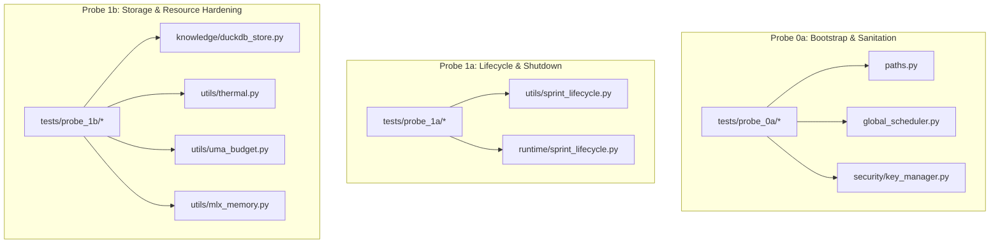
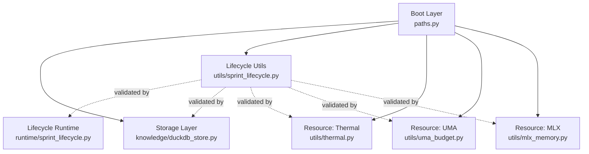
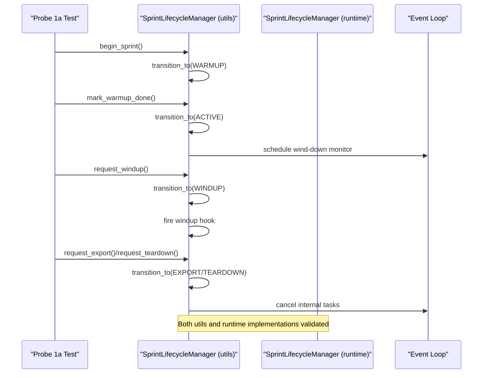
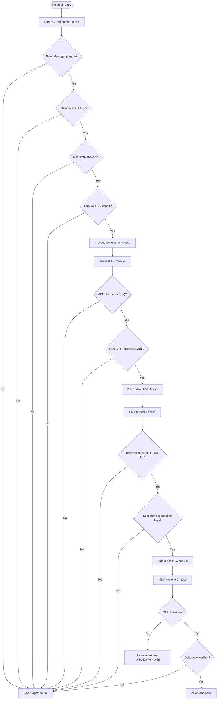
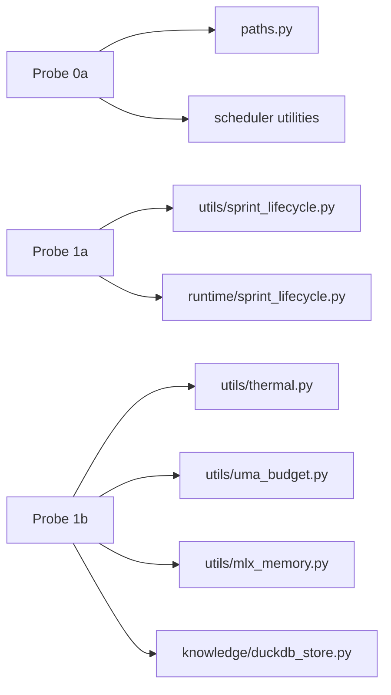

# Basic Functionality Probes (0a-1b)

<cite>
**Referenced Files in This Document**
- [test_sprint_0a.py](file://tests/probe_0a/test_sprint_0a.py)
- [REPORT_0A.md](file://tests/probe_0a/REPORT_0A.md)
- [test_sprint_1a.py](file://tests/probe_1a/test_sprint_1a.py)
- [paths.py](file://paths.py)
- [sprint_lifecycle.py](file://utils/sprint_lifecycle.py)
- [sprint_lifecycle.py](file://runtime/sprint_lifecycle.py)
- [test_duckdb_hardening.py](file://tests/probe_1b/test_duckdb_hardening.py)
- [test_import_regression.py](file://tests/probe_1b/test_import_regression.py)
- [test_mlx_memory.py](file://tests/probe_1b/test_mlx_memory.py)
- [test_thermal.py](file://tests/probe_1b/test_thermal.py)
- [test_uma_budget.py](file://tests/probe_1b/test_uma_budget.py)
- [thermal.py](file://utils/thermal.py)
- [uma_budget.py](file://utils/uma_budget.py)
- [mlx_memory.py](file://utils/mlx_memory.py)
- [duckdb_store.py](file://knowledge/duckdb_store.py)
</cite>

## Table of Contents
1. [Introduction](#introduction)
2. [Project Structure](#project-structure)
3. [Core Components](#core-components)
4. [Architecture Overview](#architecture-overview)
5. [Detailed Component Analysis](#detailed-component-analysis)
6. [Dependency Analysis](#dependency-analysis)
7. [Performance Considerations](#performance-considerations)
8. [Troubleshooting Guide](#troubleshooting-guide)
9. [Conclusion](#conclusion)

## Introduction
This document describes the basic functionality probes that validate the foundational behavior of the system across probes 0a through 1b. These probes establish baseline functionality for:
- Core system initialization and boot hygiene
- Basic pipeline operations and lifecycle management
- Essential component verification for storage, memory, and thermal monitoring

They serve as quality gates ensuring that subsequent research operations, data ingestion, and storage mechanisms behave predictably and safely under controlled conditions.

## Project Structure
The probes are organized by sprint scope:
- Probe 0a: Bootstrap & Sanitation — validates paths, temp directory wiring, scheduler registries, mlock fail-open, and signal handling.
- Probe 1a: Lifecycle & Shutdown — validates lifecycle state transitions, timing, wind-down triggers, signal registration, background task tracking, and checkpoint seam readiness.
- Probe 1b: Storage & Resource Hardening — validates DuckDB hardening invariants, import stability, MLX memory hygiene, thermal monitoring, and UMA budget accounting.

**Diagram sources**
- [test_sprint_0a.py:1-343](file://tests/probe_0a/test_sprint_0a.py#L1-L343)
- [paths.py:1-531](file://paths.py#L1-L531)
- [test_sprint_1a.py:1-361](file://tests/probe_1a/test_sprint_1a.py#L1-L361)
- [sprint_lifecycle.py:1-572](file://utils/sprint_lifecycle.py#L1-L572)
- [sprint_lifecycle.py:1-531](file://runtime/sprint_lifecycle.py#L1-L531)
- [test_duckdb_hardening.py:1-128](file://tests/probe_1b/test_duckdb_hardening.py#L1-L128)
- [test_thermal.py:1-72](file://tests/probe_1b/test_thermal.py#L1-L72)
- [test_uma_budget.py:1-125](file://tests/probe_1b/test_uma_budget.py#L1-L125)
- [test_mlx_memory.py:1-146](file://tests/probe_1b/test_mlx_memory.py#L1-L146)
- [duckdb_store.py:1-800](file://knowledge/duckdb_store.py#L1-L800)

**Section sources**
- [test_sprint_0a.py:1-343](file://tests/probe_0a/test_sprint_0a.py#L1-L343)
- [test_sprint_1a.py:1-361](file://tests/probe_1a/test_sprint_1a.py#L1-L361)
- [test_duckdb_hardening.py:1-128](file://tests/probe_1b/test_duckdb_hardening.py#L1-L128)
- [test_import_regression.py:1-82](file://tests/probe_1b/test_import_regression.py#L1-L82)
- [test_mlx_memory.py:1-146](file://tests/probe_1b/test_mlx_memory.py#L1-L146)
- [test_thermal.py:1-72](file://tests/probe_1b/test_thermal.py#L1-L72)
- [test_uma_budget.py:1-125](file://tests/probe_1b/test_uma_budget.py#L1-L125)

## Core Components
- Paths and boot hygiene: canonical path authority, temp directory wiring, stale lock/socket cleanup, and LMDB map-size configuration.
- Scheduler bounded registries: OrderedDict-backed registries with FIFO eviction and bounded put semantics.
- Lifecycle manager: state machine with fail-open behavior, wind-down triggers, signal registration, background task tracking, and checkpoint seam preparation.
- Storage hardening: DuckDB lazy import, memory limits, temp directory constraints, and GPU pragma prevention.
- Resource hardening: thermal monitoring, UMA budget accounting, and MLX memory hygiene with debounce and fail-open behavior.

**Section sources**
- [paths.py:1-531](file://paths.py#L1-L531)
- [sprint_lifecycle.py:1-572](file://utils/sprint_lifecycle.py#L1-L572)
- [sprint_lifecycle.py:1-531](file://runtime/sprint_lifecycle.py#L1-L531)
- [duckdb_store.py:1-800](file://knowledge/duckdb_store.py#L1-L800)
- [thermal.py:1-203](file://utils/thermal.py#L1-L203)
- [uma_budget.py:1-489](file://utils/uma_budget.py#L1-L489)
- [mlx_memory.py:1-291](file://utils/mlx_memory.py#L1-L291)

## Architecture Overview
The probes validate a layered architecture:
- Boot layer: paths.py sets runtime roots and temp directory, initializes directories, and cleans stale artifacts.
- Lifecycle layer: two implementations exist (utils shim and runtime canonical), both validated by probe 1a tests.
- Storage layer: DuckDB sidecar with lazy import, RAMDISK-first mode, and constrained memory/temp settings.
- Resource layer: thermal, UMA, and MLX helpers provide fail-open, debounce, and pressure-level reporting.

**Diagram sources**
- [paths.py:1-531](file://paths.py#L1-L531)
- [sprint_lifecycle.py:1-572](file://utils/sprint_lifecycle.py#L1-L572)
- [sprint_lifecycle.py:1-531](file://runtime/sprint_lifecycle.py#L1-L531)
- [duckdb_store.py:1-800](file://knowledge/duckdb_store.py#L1-L800)
- [thermal.py:1-203](file://utils/thermal.py#L1-L203)
- [uma_budget.py:1-489](file://utils/uma_budget.py#L1-L489)
- [mlx_memory.py:1-291](file://utils/mlx_memory.py#L1-L291)

## Detailed Component Analysis

### Probe 0a: Bootstrap & Sanitation
Objective: Establish baseline boot hygiene and core system initialization invariants.

Key validations:
- Paths SSOT wiring and temp directory bootstrap to RAMDISK or fallback.
- LMDB max size environment surface and default behavior.
- LIGHTRAG_ROOT definition and path semantics.
- Stale lock and socket cleanup safety.
- Assert ramdisk alive behavior.
- Tempfile usage across modules via explicit dir= parameters.
- Bounded scheduler registries using OrderedDict and FIFO eviction.
- mlock fail-open behavior and robustness against Python str inputs.
- Signal handler registration smoke test.
- Background tasks lifecycle pattern using add_done_callback.
- Cleanup artifacts idempotency.
- Fast import behavior for paths.py without network/disk blocking.
- Config from_env modes coverage.

Common failure scenarios:
- RAMDISK not mounted leads to fallback warnings and degraded OPSEC mode.
- Stale LMDB locks cause lock errors; safe cleanup required.
- Missing or misconfigured GHOST_LMDB_MAX_SIZE_MB environment variable.
- Legacy modules not using dir=tempfile.gettempdir() causing temp file placement on system tmp.
- Scheduler registry exceeding bounds without eviction.
- mlock unavailable or failing due to platform constraints.
- Signal registration failures or race conditions during import.
- Background tasks not discarded on completion leading to leaks.
- Import timing issues causing slow or blocking imports.

Expected outcomes:
- All tests pass with no exceptions.
- Invariants verified consistently across environments.
- Fail-open behavior ensures graceful degradation.

**Section sources**
- [test_sprint_0a.py:1-343](file://tests/probe_0a/test_sprint_0a.py#L1-L343)
- [REPORT_0A.md:1-108](file://tests/probe_0a/REPORT_0A.md#L1-L108)
- [paths.py:1-531](file://paths.py#L1-L531)

### Probe 1a: Lifecycle & Shutdown
Objective: Validate lifecycle state transitions, timing, wind-down triggers, signal handling, and checkpoint seam readiness.

Key validations:
- State transitions from BOOT → WARMUP → ACTIVE → WINDUP → EXPORT → TEARDOWN.
- Remaining time calculation and environment-driven durations.
- T-3min wind-down trigger and hook invocation.
- Signal handler registration smoke and idempotency.
- Background task tracking with exception logging and discard on completion.
- Fail-open behavior when lifecycle is not fully initialized.
- Checkpoint seam readiness and restoration from checkpoint data.
- Unified shutdown integration from any winding-down state.
- Singleton pattern for lifecycle manager.

Common failure scenarios:
- Invalid state transitions or non-monotonic progress.
- Wind-down not triggered due to missing event loop or incorrect timing.
- Signal handlers not registered or overridden unexpectedly.
- Background tasks not cleaned up, causing leaks or lingering resources.
- Checkpoint data corruption or missing fields.
- UMA watchdog import failures or event loop issues.
- Cancel not stopping internal tasks cleanly.

Expected outcomes:
- Lifecycle transitions are monotonic and idempotent.
- Wind-down fires only once and hooks execute reliably.
- Signal handlers are registered and do not block.
- Background tasks are tracked and discarded automatically.
- Checkpoint seam is prepared and restoreable.
- Shutdown proceeds from any winding-down state to TEARDOWN.

**Diagram sources**
- [test_sprint_1a.py:1-361](file://tests/probe_1a/test_sprint_1a.py#L1-L361)
- [sprint_lifecycle.py:1-572](file://utils/sprint_lifecycle.py#L1-L572)
- [sprint_lifecycle.py:1-531](file://runtime/sprint_lifecycle.py#L1-L531)

**Section sources**
- [test_sprint_1a.py:1-361](file://tests/probe_1a/test_sprint_1a.py#L1-L361)
- [sprint_lifecycle.py:1-572](file://utils/sprint_lifecycle.py#L1-L572)
- [sprint_lifecycle.py:1-531](file://runtime/sprint_lifecycle.py#L1-L531)

### Probe 1b: Storage & Resource Hardening
Objective: Validate storage hardening invariants and resource monitoring APIs.

Key validations:
- DuckDB hardening invariants:
  - No enable_gpu pragma in source.
  - Memory limit ≤ 1GB and max_temp ∈ {0GB, 0, 1GB}.
  - Invariant validation returns expected structure.
  - Lazy import of DuckDB and proper initialize/async_initialize signatures.
  - RAMDISK_ACTIVE temp directory logic remains valid.
- Import regression tests:
  - thermal.py, uma_budget.py, mlx_memory.py, and duckdb_store.py import without error.
- MLX memory hygiene:
  - Fail-open behavior when MLX is unavailable.
  - Debounce behavior for cache clear and limit changes.
  - Configure limits returns structured result.
- Thermal monitoring:
  - API returns tuple with level and name; bounds enforced.
  - Fail-open on non-macOS systems.
- UMA budget accounting:
  - Thresholds for M1 8GB UMA.
  - Snapshot completeness and pressure level logic.
  - Fail-open when psutil unavailable.

Common failure scenarios:
- DuckDB pragma misuse or excessive memory limits.
- DuckDB import at module level causing boot delays.
- MLX unavailable causing silent failures.
- Thermal sensor unavailable on non-macOS.
- UMA thresholds mismatch or psutil import failure.
- Debounce intervals too aggressive or too lenient.

Expected outcomes:
- All hardening invariants pass.
- APIs return expected types and structures.
- Fail-open behavior ensures graceful degradation.
- Debounce protects against rapid repeated operations.

**Diagram sources**
- [test_duckdb_hardening.py:1-128](file://tests/probe_1b/test_duckdb_hardening.py#L1-L128)
- [test_thermal.py:1-72](file://tests/probe_1b/test_thermal.py#L1-L72)
- [test_uma_budget.py:1-125](file://tests/probe_1b/test_uma_budget.py#L1-L125)
- [test_mlx_memory.py:1-146](file://tests/probe_1b/test_mlx_memory.py#L1-L146)
- [thermal.py:1-203](file://utils/thermal.py#L1-L203)
- [uma_budget.py:1-489](file://utils/uma_budget.py#L1-L489)
- [mlx_memory.py:1-291](file://utils/mlx_memory.py#L1-L291)
- [duckdb_store.py:1-800](file://knowledge/duckdb_store.py#L1-L800)

**Section sources**
- [test_duckdb_hardening.py:1-128](file://tests/probe_1b/test_duckdb_hardening.py#L1-L128)
- [test_import_regression.py:1-82](file://tests/probe_1b/test_import_regression.py#L1-L82)
- [test_mlx_memory.py:1-146](file://tests/probe_1b/test_mlx_memory.py#L1-L146)
- [test_thermal.py:1-72](file://tests/probe_1b/test_thermal.py#L1-L72)
- [test_uma_budget.py:1-125](file://tests/probe_1b/test_uma_budget.py#L1-L125)
- [thermal.py:1-203](file://utils/thermal.py#L1-L203)
- [uma_budget.py:1-489](file://utils/uma_budget.py#L1-L489)
- [mlx_memory.py:1-291](file://utils/mlx_memory.py#L1-L291)
- [duckdb_store.py:1-800](file://knowledge/duckdb_store.py#L1-L800)

## Dependency Analysis
- Probe 0a depends on paths.py for runtime roots and temp directory wiring, and on scheduler utilities for bounded registries.
- Probe 1a depends on both utils and runtime lifecycle managers, validating compatibility between the two implementations.
- Probe 1b depends on resource helpers (thermal, UMA, MLX) and storage layer (DuckDB) for hardening invariants.

**Diagram sources**
- [test_sprint_0a.py:1-343](file://tests/probe_0a/test_sprint_0a.py#L1-L343)
- [paths.py:1-531](file://paths.py#L1-L531)
- [test_sprint_1a.py:1-361](file://tests/probe_1a/test_sprint_1a.py#L1-L361)
- [sprint_lifecycle.py:1-572](file://utils/sprint_lifecycle.py#L1-L572)
- [sprint_lifecycle.py:1-531](file://runtime/sprint_lifecycle.py#L1-L531)
- [test_duckdb_hardening.py:1-128](file://tests/probe_1b/test_duckdb_hardening.py#L1-L128)
- [test_thermal.py:1-72](file://tests/probe_1b/test_thermal.py#L1-L72)
- [test_uma_budget.py:1-125](file://tests/probe_1b/test_uma_budget.py#L1-L125)
- [test_mlx_memory.py:1-146](file://tests/probe_1b/test_mlx_memory.py#L1-L146)
- [duckdb_store.py:1-800](file://knowledge/duckdb_store.py#L1-L800)

**Section sources**
- [test_sprint_0a.py:1-343](file://tests/probe_0a/test_sprint_0a.py#L1-L343)
- [test_sprint_1a.py:1-361](file://tests/probe_1a/test_sprint_1a.py#L1-L361)
- [test_duckdb_hardening.py:1-128](file://tests/probe_1b/test_duckdb_hardening.py#L1-L128)

## Performance Considerations
- Boot hygiene: paths.py import must remain fast and free of network/disk blocking to avoid regressions.
- DuckDB: lazy import and constrained memory/temp settings reduce startup overhead and resource contention.
- Resource monitoring: thermal, UMA, and MLX helpers use fail-open and debounce to minimize overhead and prevent thrashing.
- Scheduler: bounded registries with FIFO eviction prevent memory growth and maintain predictable behavior under load.

## Troubleshooting Guide
Common issues and resolutions:
- RAMDISK not available:
  - Symptom: fallback warnings and degraded OPSEC mode.
  - Resolution: set GHOST_RAMDISK or mount /Volumes/ghost_tmp; verify assert_ramdisk_alive.
- Stale LMDB locks:
  - Symptom: LockError on open.
  - Resolution: run cleanup_stale_lmdb_locks before opening; rely on safe retry logic.
- Slow paths.py import:
  - Symptom: import takes long due to blocking operations.
  - Resolution: ensure no network/disk calls in import path; verify fast import test passes.
- Signal registration failures:
  - Symptom: handlers not registered or overridden.
  - Resolution: register handlers early and ensure idempotency; validate with smoke tests.
- Background task leaks:
  - Symptom: tasks not discarded after completion.
  - Resolution: use add_done_callback with discard pattern; verify lifecycle manager tracks tasks.
- DuckDB pragma misuse:
  - Symptom: enable_gpu pragma present.
  - Resolution: remove pragma; confirm invariant validation passes.
- MLX unavailable:
  - Symptom: MLX functions return None or False.
  - Resolution: rely on fail-open behavior; verify debounce and configure limits work.
- Thermal sensor unavailable:
  - Symptom: thermal API returns nominal on non-macOS.
  - Resolution: expect fail-open behavior; verify bounds and API contract.
- UMA thresholds mismatch:
  - Symptom: pressure levels incorrect.
  - Resolution: verify thresholds for M1 8GB; ensure psutil import succeeds.

**Section sources**
- [paths.py:1-531](file://paths.py#L1-L531)
- [sprint_lifecycle.py:1-572](file://utils/sprint_lifecycle.py#L1-L572)
- [test_duckdb_hardening.py:1-128](file://tests/probe_1b/test_duckdb_hardening.py#L1-L128)
- [test_thermal.py:1-72](file://tests/probe_1b/test_thermal.py#L1-L72)
- [test_uma_budget.py:1-125](file://tests/probe_1b/test_uma_budget.py#L1-L125)
- [test_mlx_memory.py:1-146](file://tests/probe_1b/test_mlx_memory.py#L1-L146)

## Conclusion
Probes 0a through 1b establish robust baseline functionality for boot hygiene, lifecycle management, storage hardening, and resource monitoring. They provide quality gates ensuring predictable behavior, fail-open resilience, and safe degradation when components are unavailable. Passing these probes is essential before advancing to more complex integration and performance validations.