# Benchmark and Performance Probes

<cite>
**Referenced Files in This Document**
- [benchmark_pipeline.py](file://benchmarks/benchmark_pipeline.py)
- [benchmark_sprint_probe.py](file://benchmarks/benchmark_sprint_probe.py)
- [e2e_canonical_benchmark.py](file://benchmarks/e2e_canonical_benchmark.py)
- [e2e_compare.py](file://benchmarks/e2e_compare.py)
- [research_effectiveness.py](file://benchmarks/research_effectiveness.py)
- [run_sprint82j_benchmark.py](file://benchmarks/run_sprint82j_benchmark.py)
- [e2e_signal_fixture.py](file://benchmarks/e2e_signal_fixture.py)
- [e2e_signal_fixture_compare.py](file://benchmarks/e2e_signal_fixture_compare.py)
- [m1_sustained_sprint.py](file://benchmarks/m1_sustained_sprint.py)
- [m1_phase4_budget.py](file://benchmarks/m1_phase4_budget.py)
- [benchmark_coordinator.py](file://coordinators/benchmark_coordinator.py)
- [benchmark_20260311_004339.json](file://benchmark_results/benchmark_20260311_004339.json)
- [test_sprint82j_benchmark.py](file://tests/test_sprint82j_benchmark.py)
</cite>

## Table of Contents
1. [Introduction](#introduction)
2. [Project Structure](#project-structure)
3. [Core Components](#core-components)
4. [Architecture Overview](#architecture-overview)
5. [Detailed Component Analysis](#detailed-component-analysis)
6. [Dependency Analysis](#dependency-analysis)
7. [Performance Considerations](#performance-considerations)
8. [Troubleshooting Guide](#troubleshooting-guide)
9. [Conclusion](#conclusion)

## Introduction
This document describes the benchmark and performance probe categories used to validate system performance, computational efficiency, memory usage, throughput, and scaling characteristics. It documents the systematic approach to measuring performance, validating results, and detecting regressions across specialized probe suites. The probes cover end-to-end pipeline performance, agent performance benchmarking, research effectiveness scoring, transport lane validation, and M1 memory-constrained budgets.

## Project Structure
The benchmark suite is organized around focused probe categories:
- Pipeline and end-to-end benchmarks: measure timing, memory, and throughput across integrated stages.
- Agent performance benchmarking: multi-dimensional agent evaluation with memory and latency tracking.
- Research effectiveness scoring: composite metrics aggregating breadth, depth, quality, and friction.
- Transport and signal fixture validation: deterministic fixture-based comparisons across transport lanes.
- M1 memory-constrained benchmarks: sustained throughput and budget adherence under strict memory ceilings.

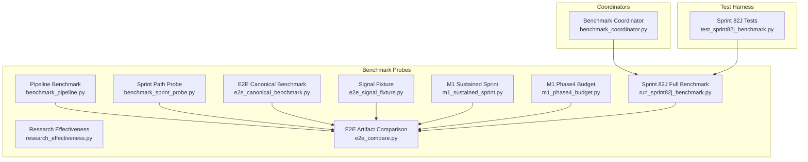

**Diagram sources**
- [benchmark_pipeline.py:1-381](file://benchmarks/benchmark_pipeline.py#L1-L381)
- [benchmark_sprint_probe.py:1-371](file://benchmarks/benchmark_sprint_probe.py#L1-L371)
- [e2e_canonical_benchmark.py:1-476](file://benchmarks/e2e_canonical_benchmark.py#L1-L476)
- [research_effectiveness.py:1-757](file://benchmarks/research_effectiveness.py#L1-L757)
- [e2e_signal_fixture.py:1-563](file://benchmarks/e2e_signal_fixture.py#L1-L563)
- [m1_sustained_sprint.py:1-320](file://benchmarks/m1_sustained_sprint.py#L1-L320)
- [m1_phase4_budget.py:1-235](file://benchmarks/m1_phase4_budget.py#L1-L235)
- [e2e_compare.py:1-281](file://benchmarks/e2e_compare.py#L1-L281)
- [run_sprint82j_benchmark.py:1-1783](file://benchmarks/run_sprint82j_benchmark.py#L1-L1783)
- [benchmark_coordinator.py:1-794](file://coordinators/benchmark_coordinator.py#L1-L794)
- [test_sprint82j_benchmark.py:1-952](file://tests/test_sprint82j_benchmark.py#L1-L952)

**Section sources**
- [benchmark_pipeline.py:1-381](file://benchmarks/benchmark_pipeline.py#L1-L381)
- [benchmark_sprint_probe.py:1-371](file://benchmarks/benchmark_sprint_probe.py#L1-L371)
- [e2e_canonical_benchmark.py:1-476](file://benchmarks/e2e_canonical_benchmark.py#L1-L476)
- [research_effectiveness.py:1-757](file://benchmarks/research_effectiveness.py#L1-L757)
- [e2e_signal_fixture.py:1-563](file://benchmarks/e2e_signal_fixture.py#L1-L563)
- [m1_sustained_sprint.py:1-320](file://benchmarks/m1_sustained_sprint.py#L1-L320)
- [m1_phase4_budget.py:1-235](file://benchmarks/m1_phase4_budget.py#L1-L235)
- [e2e_compare.py:1-281](file://benchmarks/e2e_compare.py#L1-L281)
- [run_sprint82j_benchmark.py:1-1783](file://benchmarks/run_sprint82j_benchmark.py#L1-L1783)
- [benchmark_coordinator.py:1-794](file://coordinators/benchmark_coordinator.py#L1-L794)
- [test_sprint82j_benchmark.py:1-952](file://tests/test_sprint82j_benchmark.py#L1-L952)

## Core Components
- Pipeline Benchmark (P19): Measures per-phase timing and memory deltas across discovery, fetch, embed, hypothesis, and export. Produces JSON artifacts with statistical summaries and memory statistics.
- Sprint Path Probe (F192E.1): End-to-end canonical path benchmark with memory ceiling checks and branch mix analysis.
- E2E Canonical Benchmark (F205E): Hermetic sidecar bus throughput benchmark with deduplication and memory safety.
- Research Effectiveness Scoring: Computes breadth, depth, quality, friction, and composite power score from aggregated benchmark artifacts.
- Signal Fixture (F206X): Deterministic local fixture validating transport lanes and pattern matching across httpx, curl_cffi, and baseline paths.
- M1 Sustained Sprint: Hermetic sustained throughput benchmark with memory and governor state tracking.
- M1 Phase4 Budget: Mission budget verification for peak RSS and streaming embedder fallback behavior.
- E2E Artifact Comparison: Automated comparison tool for truth surfaces and stability validation.
- Sprint 82J Full Benchmark: Real orchestrator profiling with phase timings, gating metrics, memory, thermal, synthesis, and observability extraction.
- Benchmark Coordinator: Multi-agent benchmarking with memory profiling, latency, throughput, and comparative analysis.

**Section sources**
- [benchmark_pipeline.py:1-381](file://benchmarks/benchmark_pipeline.py#L1-L381)
- [benchmark_sprint_probe.py:1-371](file://benchmarks/benchmark_sprint_probe.py#L1-L371)
- [e2e_canonical_benchmark.py:1-476](file://benchmarks/e2e_canonical_benchmark.py#L1-L476)
- [research_effectiveness.py:1-757](file://benchmarks/research_effectiveness.py#L1-L757)
- [e2e_signal_fixture.py:1-563](file://benchmarks/e2e_signal_fixture.py#L1-L563)
- [m1_sustained_sprint.py:1-320](file://benchmarks/m1_sustained_sprint.py#L1-L320)
- [m1_phase4_budget.py:1-235](file://benchmarks/m1_phase4_budget.py#L1-L235)
- [e2e_compare.py:1-281](file://benchmarks/e2e_compare.py#L1-L281)
- [run_sprint82j_benchmark.py:1-1783](file://benchmarks/run_sprint82j_benchmark.py#L1-L1783)
- [benchmark_coordinator.py:1-794](file://coordinators/benchmark_coordinator.py#L1-L794)

## Architecture Overview
The benchmark ecosystem integrates measurement, artifact generation, comparison, and scoring:

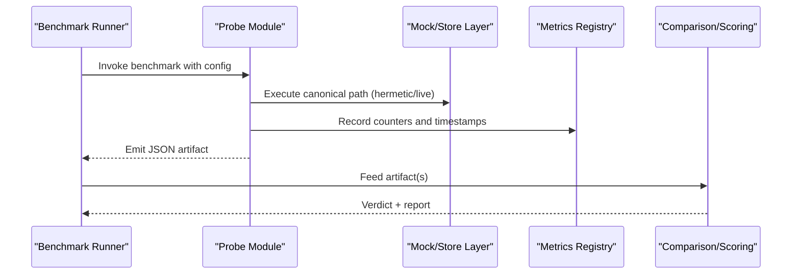

**Diagram sources**
- [benchmark_pipeline.py:213-342](file://benchmarks/benchmark_pipeline.py#L213-L342)
- [benchmark_sprint_probe.py:170-344](file://benchmarks/benchmark_sprint_probe.py#L170-L344)
- [e2e_canonical_benchmark.py:387-442](file://benchmarks/e2e_canonical_benchmark.py#L387-L442)
- [e2e_compare.py:95-219](file://benchmarks/e2e_compare.py#L95-L219)
- [research_effectiveness.py:639-668](file://benchmarks/research_effectiveness.py#L639-L668)

## Detailed Component Analysis

### Pipeline Benchmark (P19)
Measures per-phase timing and memory usage across a canonical pipeline. It supports mock fetch mode for fast, network-free runs and records RSS deltas for memory footprint analysis.

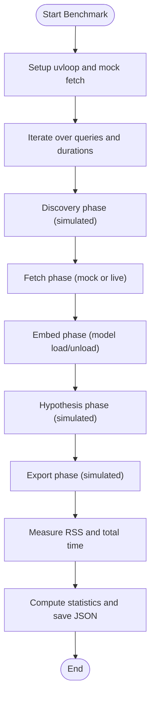

**Diagram sources**
- [benchmark_pipeline.py:53-158](file://benchmarks/benchmark_pipeline.py#L53-L158)
- [benchmark_pipeline.py:213-342](file://benchmarks/benchmark_pipeline.py#L213-L342)

**Section sources**
- [benchmark_pipeline.py:1-381](file://benchmarks/benchmark_pipeline.py#L1-L381)

### Sprint Path Probe (F192E.1)
Validates the canonical sprint path with hermetic feed and pattern matching, measuring first finding latency, peak RSS, UMA state, and branch mix.

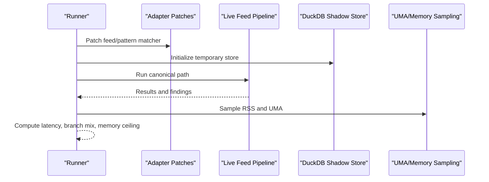

**Diagram sources**
- [benchmark_sprint_probe.py:170-344](file://benchmarks/benchmark_sprint_probe.py#L170-L344)

**Section sources**
- [benchmark_sprint_probe.py:1-371](file://benchmarks/benchmark_sprint_probe.py#L1-L371)

### E2E Canonical Benchmark (F205E)
Hermetic sidecar bus benchmark exercising multiple runners with synthetic findings and mock store to measure throughput, deduplication, and memory safety.

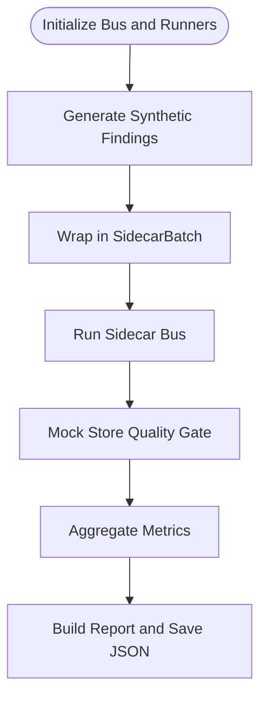

**Diagram sources**
- [e2e_canonical_benchmark.py:211-382](file://benchmarks/e2e_canonical_benchmark.py#L211-L382)

**Section sources**
- [e2e_canonical_benchmark.py:1-476](file://benchmarks/e2e_canonical_benchmark.py#L1-L476)

### Research Effectiveness Scoring
Aggregates benchmark artifacts into composite scorecards: breadth, depth, quality, friction, and a power score. Provides normalized metrics and markdown reports.

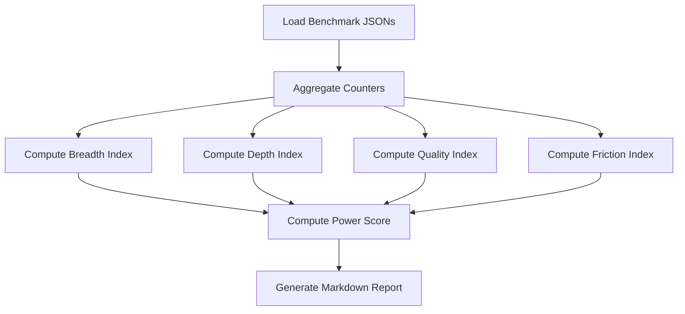

**Diagram sources**
- [research_effectiveness.py:567-668](file://benchmarks/research_effectiveness.py#L567-L668)

**Section sources**
- [research_effectiveness.py:1-757](file://benchmarks/research_effectiveness.py#L1-L757)

### Signal Fixture Validation (F206X)
Deterministic fixture validates transport lanes (httpx_h2, curl_cffi, baseline) and ensures non-empty signal across lanes.

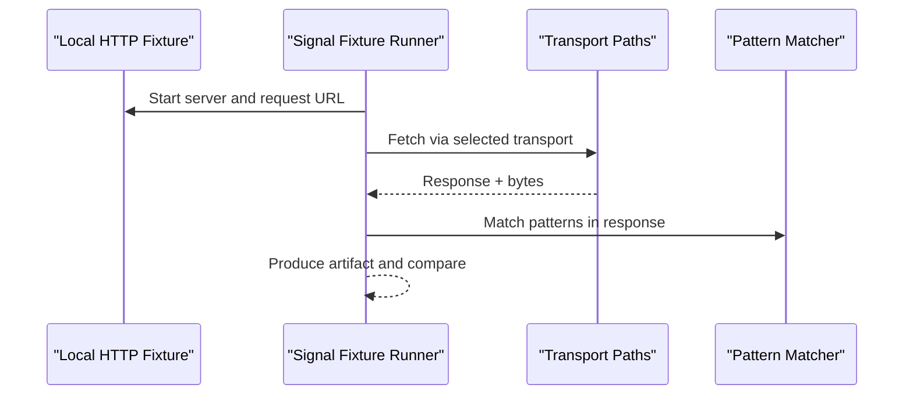

**Diagram sources**
- [e2e_signal_fixture.py:245-376](file://benchmarks/e2e_signal_fixture.py#L245-L376)
- [e2e_signal_fixture_compare.py:27-111](file://benchmarks/e2e_signal_fixture_compare.py#L27-L111)

**Section sources**
- [e2e_signal_fixture.py:1-563](file://benchmarks/e2e_signal_fixture.py#L1-L563)
- [e2e_signal_fixture_compare.py:1-140](file://benchmarks/e2e_signal_fixture_compare.py#L1-L140)

### M1 Memory-Constrained Benchmarks
- Sustained Sprint: Measures sustained throughput and memory safety without network I/O.
- Phase4 Budget: Validates mission budget adherence and streaming embedder fallback behavior.

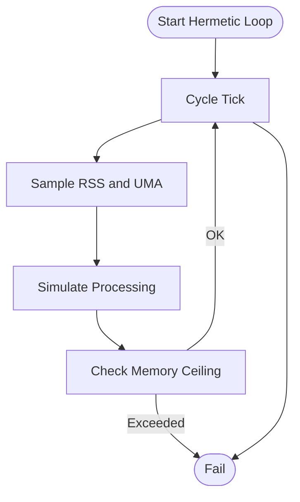

**Diagram sources**
- [m1_sustained_sprint.py:147-254](file://benchmarks/m1_sustained_sprint.py#L147-L254)
- [m1_phase4_budget.py:111-179](file://benchmarks/m1_phase4_budget.py#L111-L179)

**Section sources**
- [m1_sustained_sprint.py:1-320](file://benchmarks/m1_sustained_sprint.py#L1-L320)
- [m1_phase4_budget.py:1-235](file://benchmarks/m1_phase4_budget.py#L1-L235)

### E2E Artifact Comparison
Automates truth surface validation and stability checks across artifacts, supporting both probe aggregates and canonical reports.

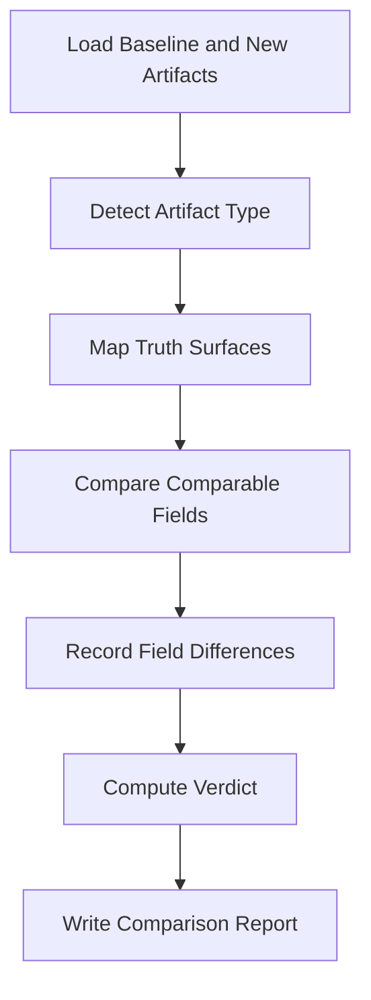

**Diagram sources**
- [e2e_compare.py:95-219](file://benchmarks/e2e_compare.py#L95-L219)

**Section sources**
- [e2e_compare.py:1-281](file://benchmarks/e2e_compare.py#L1-L281)

### Sprint 82J Full Benchmark
Real orchestrator profiling capturing phase timings, gating metrics, memory, thermal, synthesis, and observability.

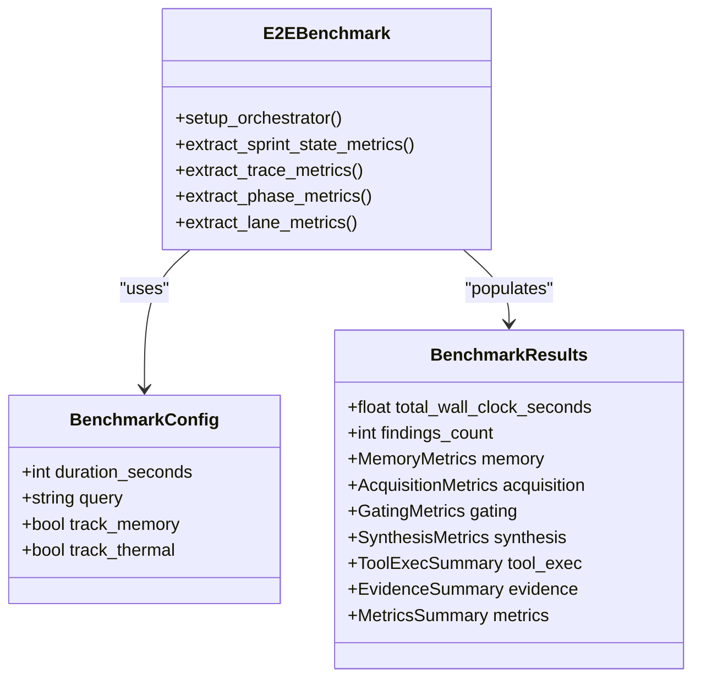

**Diagram sources**
- [run_sprint82j_benchmark.py:51-376](file://benchmarks/run_sprint82j_benchmark.py#L51-L376)
- [run_sprint82j_benchmark.py:439-800](file://benchmarks/run_sprint82j_benchmark.py#L439-L800)

**Section sources**
- [run_sprint82j_benchmark.py:1-1783](file://benchmarks/run_sprint82j_benchmark.py#L1-L1783)

### Benchmark Coordinator (Multi-Agent)
Comprehensive agent benchmarking with memory profiling, latency, throughput, and comparative analysis.

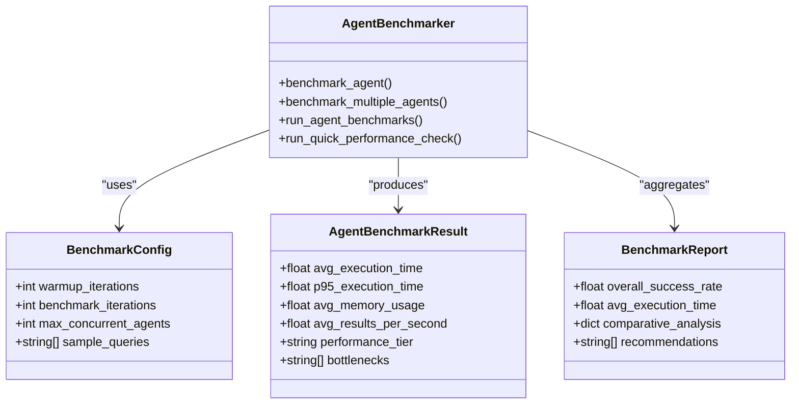

**Diagram sources**
- [benchmark_coordinator.py:52-119](file://coordinators/benchmark_coordinator.py#L52-L119)
- [benchmark_coordinator.py:183-362](file://coordinators/benchmark_coordinator.py#L183-L362)
- [benchmark_coordinator.py:734-794](file://coordinators/benchmark_coordinator.py#L734-L794)

**Section sources**
- [benchmark_coordinator.py:1-794](file://coordinators/benchmark_coordinator.py#L1-L794)

## Dependency Analysis
The benchmark suite exhibits clear separation of concerns:
- Probes depend on orchestration and pipeline modules for canonical paths.
- Comparison and scoring utilities operate on JSON artifacts.
- Memory and governor sampling integrate with system metrics.
- Test harness validates benchmark structures and extraction logic.

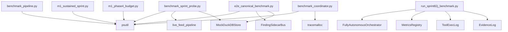

**Diagram sources**
- [benchmark_pipeline.py:31-40](file://benchmarks/benchmark_pipeline.py#L31-L40)
- [benchmark_sprint_probe.py:30-40](file://benchmarks/benchmark_sprint_probe.py#L30-L40)
- [e2e_canonical_benchmark.py:36-43](file://benchmarks/e2e_canonical_benchmark.py#L36-L43)
- [m1_sustained_sprint.py:40-46](file://benchmarks/m1_sustained_sprint.py#L40-L46)
- [m1_phase4_budget.py:41-44](file://benchmarks/m1_phase4_budget.py#L41-L44)
- [run_sprint82j_benchmark.py:22-35](file://benchmarks/run_sprint82j_benchmark.py#L22-L35)
- [benchmark_coordinator.py:28-47](file://coordinators/benchmark_coordinator.py#L28-L47)

**Section sources**
- [benchmark_pipeline.py:1-381](file://benchmarks/benchmark_pipeline.py#L1-L381)
- [benchmark_sprint_probe.py:1-371](file://benchmarks/benchmark_sprint_probe.py#L1-L371)
- [e2e_canonical_benchmark.py:1-476](file://benchmarks/e2e_canonical_benchmark.py#L1-L476)
- [m1_sustained_sprint.py:1-320](file://benchmarks/m1_sustained_sprint.py#L1-L320)
- [m1_phase4_budget.py:1-235](file://benchmarks/m1_phase4_budget.py#L1-L235)
- [run_sprint82j_benchmark.py:1-1783](file://benchmarks/run_sprint82j_benchmark.py#L1-L1783)
- [benchmark_coordinator.py:1-794](file://coordinators/benchmark_coordinator.py#L1-L794)

## Performance Considerations
- Event loop optimization: uvloop activation improves throughput on supported platforms.
- Memory safety: bounded memory ceilings and periodic sampling prevent runaway memory growth.
- Mock modes: hermetic benchmarks eliminate network variability and enable reproducible baselines.
- Granular metrics: per-phase timings, per-sidecar latencies, and FPS metrics support targeted optimization.
- Regression detection: automated comparison and scoring provide early warnings for performance drift.

## Troubleshooting Guide
Common issues and resolutions:
- Memory ceiling exceeded: verify M1 8GB/Mission budget constraints and reduce workload or increase limits cautiously.
- Transport lane failures: confirm fixture availability and environment flags for httpx_h2 and curl_cffi.
- Missing truth surfaces: ensure artifacts include required keys and compare artifacts of compatible types.
- Agent benchmark failures: review warmup iterations, timeouts, and memory profiling hooks.
- Test harness errors: validate dataclass fields and extraction logic for orchestrator logs and metrics.

**Section sources**
- [benchmark_sprint_probe.py:329-335](file://benchmarks/benchmark_sprint_probe.py#L329-L335)
- [e2e_signal_fixture.py:486-498](file://benchmarks/e2e_signal_fixture.py#L486-L498)
- [e2e_compare.py:160-182](file://benchmarks/e2e_compare.py#L160-L182)
- [benchmark_coordinator.py:364-386](file://coordinators/benchmark_coordinator.py#L364-L386)
- [test_sprint82j_benchmark.py:1-952](file://tests/test_sprint82j_benchmark.py#L1-L952)

## Conclusion
The benchmark and performance probe suite provides a comprehensive, systematic approach to measuring and validating system performance. By combining hermetic benchmarks, real orchestrator profiling, comparative analysis, and research effectiveness scoring, teams can ensure optimal operational efficiency, detect regressions early, and maintain scalability under memory-constrained environments.