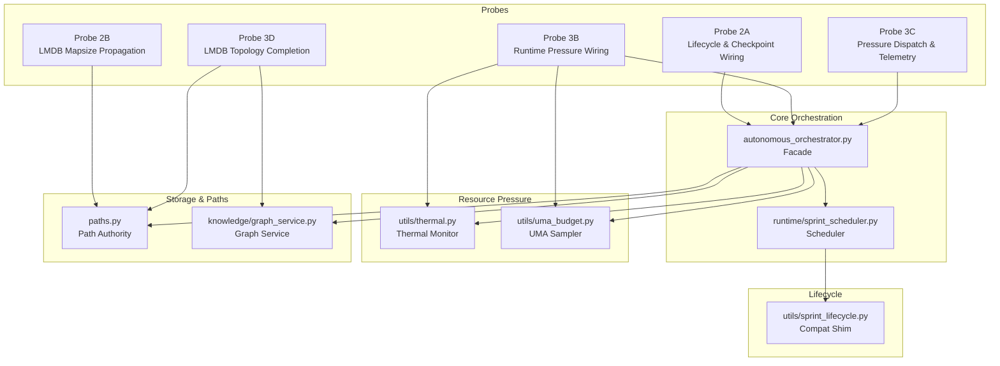
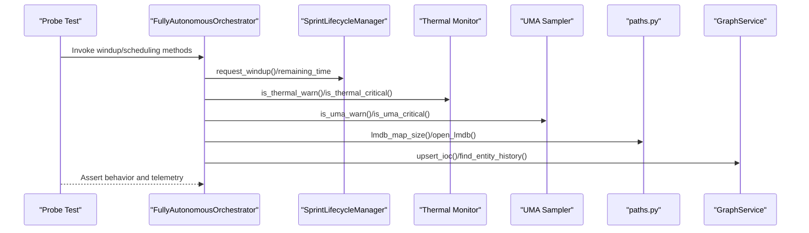
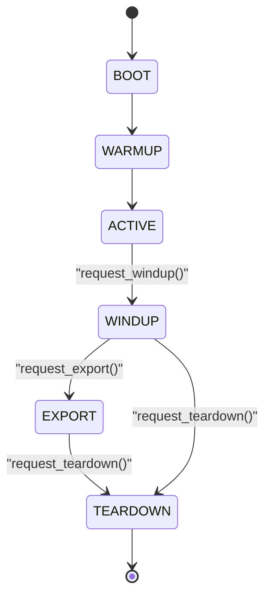
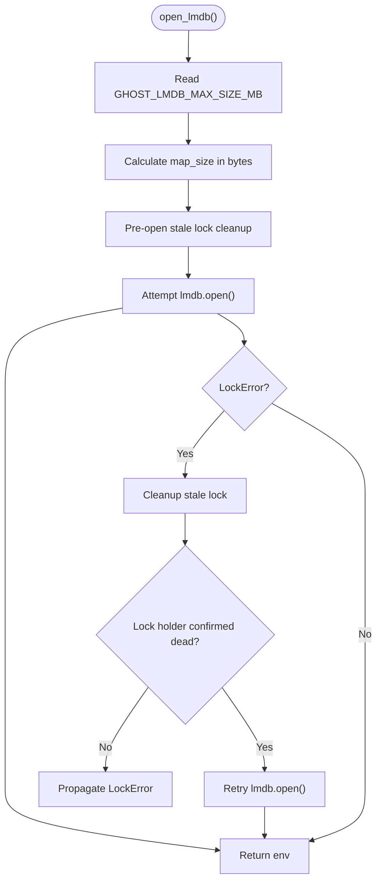
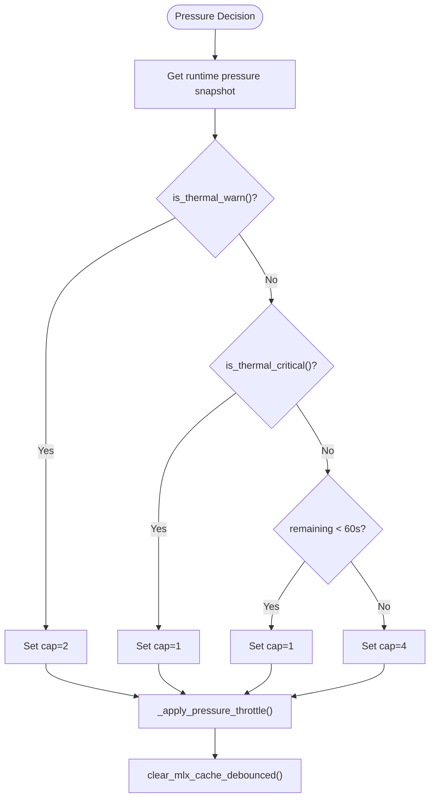
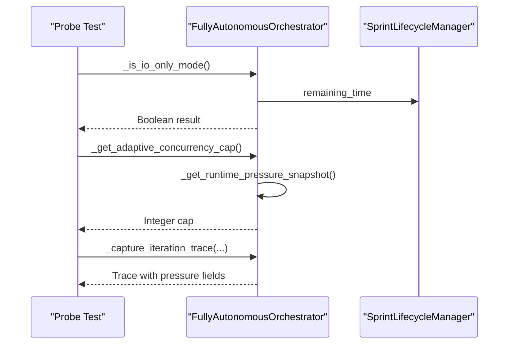
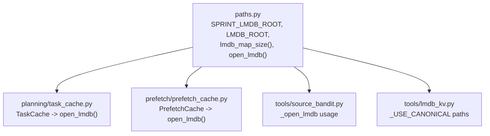
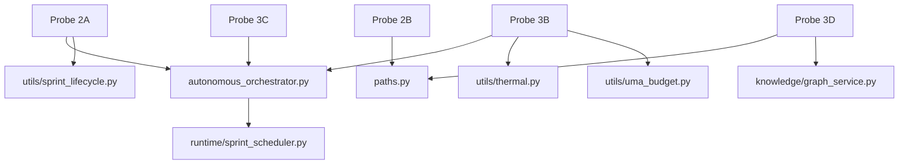

# Integration and Validation Probes (2a-3d)

<cite>
**Referenced Files in This Document**
- [test_sprint_2a.py](file://tests/probe_2a/test_sprint_2a.py)
- [test_sprint_2b.py](file://tests/probe_2b/test_sprint_2b.py)
- [probe_3b.py](file://tests/probe_3b/probe_3b.py)
- [test_pressure_dispatch.py](file://tests/probe_3c/test_pressure_dispatch.py)
- [test_sprint_3d.py](file://tests/probe_3d/test_sprint_3d.py)
- [autonomous_orchestrator.py](file://autonomous_orchestrator.py)
- [paths.py](file://paths.py)
- [sprint_lifecycle.py](file://utils/sprint_lifecycle.py)
- [thermal.py](file://utils/thermal.py)
- [uma_budget.py](file://utils/uma_budget.py)
- [graph_service.py](file://knowledge/graph_service.py)
- [sprint_scheduler.py](file://runtime/sprint_scheduler.py)
- [base.py](file://coordinators/base.py)
</cite>

## Table of Contents
1. [Introduction](#introduction)
2. [Project Structure](#project-structure)
3. [Core Components](#core-components)
4. [Architecture Overview](#architecture-overview)
5. [Detailed Component Analysis](#detailed-component-analysis)
6. [Dependency Analysis](#dependency-analysis)
7. [Performance Considerations](#performance-considerations)
8. [Troubleshooting Guide](#troubleshooting-guide)
9. [Conclusion](#conclusion)

## Introduction
This document presents comprehensive integration and validation probes covering probe_2a through probe_3d series. These tests validate intermediate complexity scenarios that ensure proper integration between major system components, focusing on:
- Pipeline coordination and lifecycle management
- Knowledge graph integration and cross-sprint persistence
- Multi-source data processing workflows
- Runtime pressure wiring and I/O-only mode behavior
- LMDB topology completion and path propagation

Each probe category targets specific validation objectives to guarantee robust integration before advancing to advanced functionality testing.

## Project Structure
The probe suite spans multiple modules:
- Tests: probe_2a, probe_2b, probe_3b, probe_3c, probe_3d
- Core orchestration: autonomous_orchestrator.py facade and runtime scheduler
- Lifecycle management: utils/sprint_lifecycle.py and runtime/sprint_scheduler.py
- Resource pressure: utils/thermal.py and utils/uma_budget.py
- Storage and paths: paths.py and knowledge/graph_service.py
- Coordination framework: coordinators/base.py

**Diagram sources**
- [test_sprint_2a.py:1-210](file://tests/probe_2a/test_sprint_2a.py#L1-L210)
- [test_sprint_2b.py:1-184](file://tests/probe_2b/test_sprint_2b.py#L1-L184)
- [probe_3b.py:1-338](file://tests/probe_3b/probe_3b.py#L1-L338)
- [test_pressure_dispatch.py:1-375](file://tests/probe_3c/test_pressure_dispatch.py#L1-L375)
- [test_sprint_3d.py:1-211](file://tests/probe_3d/test_sprint_3d.py#L1-L211)
- [autonomous_orchestrator.py:1-272](file://autonomous_orchestrator.py#L1-L272)
- [paths.py:1-531](file://paths.py#L1-L531)
- [sprint_lifecycle.py:1-572](file://utils/sprint_lifecycle.py#L1-L572)
- [thermal.py:1-203](file://utils/thermal.py#L1-L203)
- [uma_budget.py:1-489](file://utils/uma_budget.py#L1-L489)
- [graph_service.py:1-311](file://knowledge/graph_service.py#L1-L311)
- [sprint_scheduler.py:1-800](file://runtime/sprint_scheduler.py#L1-L800)

**Section sources**
- [test_sprint_2a.py:1-210](file://tests/probe_2a/test_sprint_2a.py#L1-L210)
- [test_sprint_2b.py:1-184](file://tests/probe_2b/test_sprint_2b.py#L1-L184)
- [probe_3b.py:1-338](file://tests/probe_3b/probe_3b.py#L1-L338)
- [test_pressure_dispatch.py:1-375](file://tests/probe_3c/test_pressure_dispatch.py#L1-L375)
- [test_sprint_3d.py:1-211](file://tests/probe_3d/test_sprint_3d.py#L1-L211)
- [autonomous_orchestrator.py:1-272](file://autonomous_orchestrator.py#L1-L272)
- [paths.py:1-531](file://paths.py#L1-L531)
- [sprint_lifecycle.py:1-572](file://utils/sprint_lifecycle.py#L1-L572)
- [thermal.py:1-203](file://utils/thermal.py#L1-L203)
- [uma_budget.py:1-489](file://utils/uma_budget.py#L1-L489)
- [graph_service.py:1-311](file://knowledge/graph_service.py#L1-L311)
- [sprint_scheduler.py:1-800](file://runtime/sprint_scheduler.py#L1-L800)

## Core Components
This section outlines the key components validated by the probe suite and their roles in integration testing.

- Lifecycle and checkpoint wiring: Validates windup behavior, checkpoint restore/load semantics, signal handling, and remaining time calculations.
- LMDB mapsize propagation: Ensures environment-driven map sizes, lock recovery, and consumer file migrations.
- Runtime pressure wiring: Verifies thermal and UMA pressure snapshots, I/O-only mode activation, adaptive concurrency caps, and MLX cleanup canonical seams.
- Pressure dispatch and telemetry: Confirms dispatch preferences under I/O-only mode, adaptive cap consumption, windup influence, and telemetry inclusion.
- LMDB topology completion: Guarantees path authority correctness, environment-driven map sizes, and migration of consumers to canonical helpers.

**Section sources**
- [test_sprint_2a.py:23-210](file://tests/probe_2a/test_sprint_2a.py#L23-L210)
- [test_sprint_2b.py:27-184](file://tests/probe_2b/test_sprint_2b.py#L27-L184)
- [probe_3b.py:24-338](file://tests/probe_3b/probe_3b.py#L24-L338)
- [test_pressure_dispatch.py:63-375](file://tests/probe_3c/test_pressure_dispatch.py#L63-L375)
- [test_sprint_3d.py:25-211](file://tests/probe_3d/test_sprint_3d.py#L25-L211)

## Architecture Overview
The integration architecture integrates lifecycle management, resource pressure monitoring, storage paths, and orchestration. Probes validate:
- Lifecycle state transitions and signal handling
- Pressure-driven dispatch and throttling
- Storage path propagation and LMDB topology
- Knowledge graph persistence and analytics

**Diagram sources**
- [test_sprint_2a.py:23-210](file://tests/probe_2a/test_sprint_2a.py#L23-L210)
- [test_pressure_dispatch.py:63-375](file://tests/probe_3c/test_pressure_dispatch.py#L63-L375)
- [probe_3b.py:24-338](file://tests/probe_3b/probe_3b.py#L24-L338)
- [paths.py:169-251](file://paths.py#L169-L251)
- [graph_service.py:45-127](file://knowledge/graph_service.py#L45-L127)
- [sprint_lifecycle.py:85-307](file://utils/sprint_lifecycle.py#L85-L307)

## Detailed Component Analysis

### Probe 2A: Lifecycle Activation and Checkpoint Wiring
Validation objectives:
- Windup flag consumption and behavior changes
- Export stage triggers and canonical seams
- Checkpoint save/load wiring to lifecycle
- Background task tracking with exception logging
- SIGINT/SIGTERM unified shutdown path
- Remaining time exposure and calculations
- Lifecycle state machine transitions (idempotent windup, export gating, teardown)

Concrete test scenarios:
- Windup skip in path discovery handler returns early with windup metadata
- Default windup flag is False on new instances
- Checkpoint restore/load methods are fail-open when no manager is present
- Background task error logging is static and logs exceptions
- Signal handlers register both SIGINT and SIGTERM
- Remaining time is calculated as sprint duration minus elapsed
- State transitions enforce idempotency and export gating from WINDUP

**Diagram sources**
- [sprint_lifecycle.py:51-58](file://utils/sprint_lifecycle.py#L51-L58)
- [sprint_lifecycle.py:246-307](file://utils/sprint_lifecycle.py#L246-L307)

**Section sources**
- [test_sprint_2a.py:23-210](file://tests/probe_2a/test_sprint_2a.py#L23-L210)
- [sprint_lifecycle.py:85-307](file://utils/sprint_lifecycle.py#L85-L307)

### Probe 2B: LMDB Mapsize Propagation and State/Cache Hygiene
Validation objectives:
- Environment-driven map size retrieval and defaults
- LMDB environment creation respecting env-driven map size
- Explicit map size overrides
- Single-retry lock recovery on stale locks
- Fail-open behavior for invalid paths
- Consumer file migrations to use canonical open_lmdb
- No hardcoded map sizes in migrated files
- Import/boot hygiene for paths and consumers

Concrete test scenarios:
- Default map size is 512 MB when environment is unset
- Map size respects GHOST_LMDB_MAX_SIZE_MB environment variable
- Invalid or negative values fall back to 512 MB
- open_lmdb uses env-driven map size when map_size=None
- Explicit map_size overrides env-driven setting
- Stale lock recovery removes stale lock and retries once
- Invalid paths raise rather than silently failing
- Consumer files import open_lmdb from paths and avoid hardcoded map sizes
- Import checks pass for paths and migrated consumers

**Diagram sources**
- [paths.py:202-251](file://paths.py#L202-L251)

**Section sources**
- [test_sprint_2b.py:27-184](file://tests/probe_2b/test_sprint_2b.py#L27-L184)
- [paths.py:169-251](file://paths.py#L169-L251)

### Probe 3B: Runtime Pressure Wiring and I/O-Only Mode
Validation objectives:
- Thermal monitor availability and snapshot formatting
- Runtime pressure snapshot construction and fail-open behavior
- I/O-only mode activation thresholds and fail-open semantics
- Adaptive concurrency cap values under different pressure conditions
- Pressure throttle invoking MLX cleanup canonical seam
- Import/boot regression checks
- Forbidden file modifications verification

Concrete test scenarios:
- Thermal monitor functions exist and return boolean results
- Thermal snapshot includes is_warn and is_critical fields
- Pressure snapshot includes thermal, UMA, and lifecycle fields
- Snapshot is fail-open on thermal sensor failures
- I/O-only mode returns False by default and activates below 60s remaining
- I/O-only mode is fail-open on pressure snapshot errors
- Concurrency caps: default 4, warn 2, critical 1, windup+warn 1
- Concurrency cap is fail-open on pressure snapshot errors
- Pressure throttle invokes MLX cleanup debounced method
- Module imports succeed for thermal, UMA, MLX memory, and lifecycle
- Paths and main modules remain unmodified

**Diagram sources**
- [probe_3b.py:52-242](file://tests/probe_3b/probe_3b.py#L52-L242)
- [thermal.py:172-187](file://utils/thermal.py#L172-L187)
- [uma_budget.py:211-232](file://utils/uma_budget.py#L211-L232)

**Section sources**
- [probe_3b.py:24-338](file://tests/probe_3b/probe_3b.py#L24-L338)
- [thermal.py:172-187](file://utils/thermal.py#L172-L187)
- [uma_budget.py:211-232](file://utils/uma_budget.py#L211-L232)

### Probe 3C: Pressure Dispatch and Telemetry
Validation objectives:
- I/O-only mode changing dispatch preferences
- Adaptive concurrency cap consumption
- Windup influence on remaining time behavior
- Telemetry inclusion of pressure fields
- Fail-open behavior for sensor failures
- Import/boot regression checks

Concrete test scenarios:
- I/O-only mode blocks expensive actions and penalizes scores accordingly
- I/O-only mode preserves penalties for I/O actions
- Adaptive cap returns 4 by default, 2 on warn, 1 on critical or I/O-only
- Windup combined with pressure reduces cap to 1
- Telemetry captures io_only_mode, adaptive_concurrency_cap, thermal_is_critical, uma_is_critical, windup_active, remaining_seconds
- Fail-open returns False for I/O-only mode and cap=4 for pressure snapshot errors
- Import checks confirm AO and dispatch-related methods exist

**Diagram sources**
- [test_pressure_dispatch.py:63-282](file://tests/probe_3c/test_pressure_dispatch.py#L63-L282)
- [sprint_lifecycle.py:160-169](file://utils/sprint_lifecycle.py#L160-L169)

**Section sources**
- [test_pressure_dispatch.py:63-375](file://tests/probe_3c/test_pressure_dispatch.py#L63-L375)
- [sprint_lifecycle.py:160-169](file://utils/sprint_lifecycle.py#L160-L169)

### Probe 3D: LMDB Topology Completion
Validation objectives:
- Sprint vs persistent root helpers in paths.py
- Environment-driven map size fallbacks
- Migration of consumers to use canonical open_lmdb
- No new hardcoded LMDB surface in migrated files
- Import and parse hygiene
- Fail-open and backward compatibility

Concrete test scenarios:
- SPRINT_LMDB_ROOT is defined, beneath LMDB_ROOT, and included in __all__
- Environment-driven map size respects valid/empty/invalid inputs
- open_lmdb uses env-driven map size and accepts explicit overrides
- Task cache, prefetch cache, and source bandit migrate to canonical helpers
- LMDBKV store uses canonical paths and avoids module-level bare lmdb.open
- Topology manifest exists and references Sprint 3D and SPRINT_LMDB_ROOT
- Import checks pass for paths, open_lmdb, and sprint directory creation

**Diagram sources**
- [test_sprint_3d.py:25-211](file://tests/probe_3d/test_sprint_3d.py#L25-L211)
- [paths.py:257-271](file://paths.py#L257-L271)
- [paths.py:169-251](file://paths.py#L169-L251)

**Section sources**
- [test_sprint_3d.py:25-211](file://tests/probe_3d/test_sprint_3d.py#L25-L211)
- [paths.py:257-271](file://paths.py#L257-L271)
- [paths.py:169-251](file://paths.py#L169-L251)

## Dependency Analysis
The probe suite validates dependencies across modules:
- Test dependencies: probe-specific assertions and mocks
- Runtime dependencies: lifecycle manager, thermal monitor, UMA sampler, paths authority, graph service
- Orchestration dependencies: autonomous orchestrator facade and runtime scheduler

**Diagram sources**
- [test_sprint_2a.py:23-210](file://tests/probe_2a/test_sprint_2a.py#L23-L210)
- [test_sprint_2b.py:27-184](file://tests/probe_2b/test_sprint_2b.py#L27-L184)
- [probe_3b.py:24-338](file://tests/probe_3b/probe_3b.py#L24-L338)
- [test_pressure_dispatch.py:63-375](file://tests/probe_3c/test_pressure_dispatch.py#L63-L375)
- [test_sprint_3d.py:25-211](file://tests/probe_3d/test_sprint_3d.py#L25-L211)
- [autonomous_orchestrator.py:1-272](file://autonomous_orchestrator.py#L1-L272)
- [paths.py:1-531](file://paths.py#L1-L531)
- [sprint_lifecycle.py:1-572](file://utils/sprint_lifecycle.py#L1-L572)
- [thermal.py:1-203](file://utils/thermal.py#L1-L203)
- [uma_budget.py:1-489](file://utils/uma_budget.py#L1-L489)
- [graph_service.py:1-311](file://knowledge/graph_service.py#L1-L311)
- [sprint_scheduler.py:1-800](file://runtime/sprint_scheduler.py#L1-L800)

**Section sources**
- [test_sprint_2a.py:23-210](file://tests/probe_2a/test_sprint_2a.py#L23-L210)
- [test_sprint_2b.py:27-184](file://tests/probe_2b/test_sprint_2b.py#L27-L184)
- [probe_3b.py:24-338](file://tests/probe_3b/probe_3b.py#L24-L338)
- [test_pressure_dispatch.py:63-375](file://tests/probe_3c/test_pressure_dispatch.py#L63-L375)
- [test_sprint_3d.py:25-211](file://tests/probe_3d/test_sprint_3d.py#L25-L211)
- [autonomous_orchestrator.py:1-272](file://autonomous_orchestrator.py#L1-L272)
- [paths.py:1-531](file://paths.py#L1-L531)
- [sprint_lifecycle.py:1-572](file://utils/sprint_lifecycle.py#L1-L572)
- [thermal.py:1-203](file://utils/thermal.py#L1-L203)
- [uma_budget.py:1-489](file://utils/uma_budget.py#L1-L489)
- [graph_service.py:1-311](file://knowledge/graph_service.py#L1-L311)
- [sprint_scheduler.py:1-800](file://runtime/sprint_scheduler.py#L1-L800)

## Performance Considerations
- Fail-open design prevents cascading failures in pressure and sensor readings
- Canonical LMDB helpers centralize map size and lock recovery logic
- Thermal and UMA sampling are lightweight and fail-open
- I/O-only mode reduces concurrency to protect system stability
- Import hygiene ensures no heavy imports on cold paths

[No sources needed since this section provides general guidance]

## Troubleshooting Guide
Common issues and resolutions:
- Windup behavior not taking effect: verify windup flag defaults to False and request_windup is idempotent
- Checkpoint restore/load raising errors: confirm fail-open behavior when no checkpoint manager is present
- Background task exceptions not logged: ensure _log_task_error is static and uses facade logger
- SIGINT/SIGTERM not unified: confirm signal handlers are registered for both signals
- Remaining time incorrect: validate remaining_time property uses monotonic time and sprint duration
- LMDB lock errors persist: rely on single-retry lock recovery; ensure stale lock cleanup succeeds
- Thermal/UMA sensors unavailable: expect fail-open behavior returning nominal levels and normal pressure
- I/O-only mode not activating: check remaining time threshold and pressure snapshot logic
- Adaptive concurrency cap not applied: verify pressure snapshot composition and cap selection logic
- Consumer files still use hardcoded LMDB: ensure migration to canonical open_lmdb and removal of hardcoded map sizes

**Section sources**
- [test_sprint_2a.py:114-157](file://tests/probe_2a/test_sprint_2a.py#L114-L157)
- [test_sprint_2b.py:84-111](file://tests/probe_2b/test_sprint_2b.py#L84-L111)
- [probe_3b.py:216-242](file://tests/probe_3b/probe_3b.py#L216-L242)
- [test_pressure_dispatch.py:284-306](file://tests/probe_3c/test_pressure_dispatch.py#L284-L306)

## Conclusion
The probe_2a–3d suite systematically validates integration and validation across lifecycle management, pressure-driven dispatch, LMDB topology, and knowledge graph persistence. By enforcing fail-open semantics, canonical path usage, and telemetry inclusion, these probes ensure robust integration before advancing to advanced functionality testing. The modular design and comprehensive assertions provide strong guarantees for component interactions and cross-module functionality.