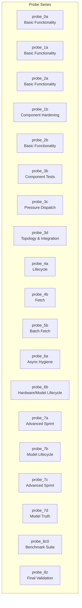
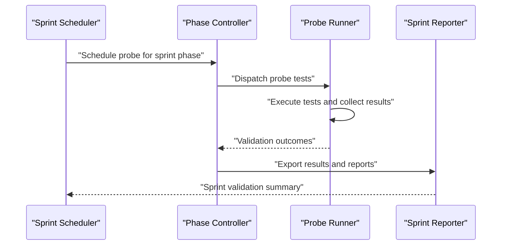
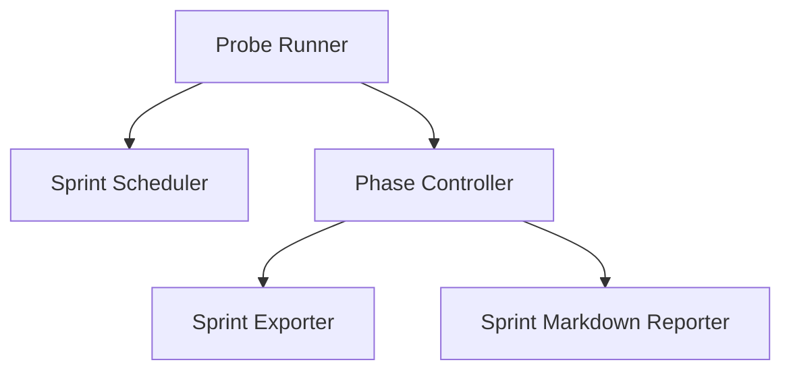

# Probe Categories and Classification

<cite>
**Referenced Files in This Document**
- [REPORT_0A.md](file://tests/probe_0a/REPORT_0A.md)
- [test_sprint_0a.py](file://tests/probe_0a/test_sprint_0a.py)
- [test_sprint_1a.py](file://tests/probe_1a/test_sprint_1a.py)
- [test_sprint_2a.py](file://tests/probe_2a/test_sprint_2a.py)
- [test_sprint_2b.py](file://tests/probe_2b/test_sprint_2b.py)
- [probe_3b.py](file://tests/probe_3b/__init__.py)
- [test_pressure_dispatch.py](file://tests/probe_3c/test_pressure_dispatch.py)
- [TOPOLOGY.md](file://tests/probe_3d/TOPOLOGY.md)
- [test_sprint_3d.py](file://tests/probe_3d/test_sprint_3d.py)
- [test_lifecycle_4a.py](file://tests/probe_4a/test_lifecycle_4a.py)
- [test_fetch_4b.py](file://tests/probe_4b/test_fetch_4b.py)
- [test_probe_5a.py](file://tests/probe_5a/test_probe_5a.py)
- [test_batch_fetch.py](file://tests/probe_5b/test_batch_fetch.py)
- [test_async_hygiene.py](file://tests/probe_6a/test_async_hygiene.py)
- [REPORT.md](file://tests/probe_6b/REPORT.md)
- [test_apple_fm_probe.py](file://tests/probe_6b/test_apple_fm_probe.py)
- [test_mlx_cache_limits.py](file://tests/probe_6b/test_mlx_cache_limits.py)
- [test_qos_constants.py](file://tests/probe_6b/test_qos_constants.py)
- [test_torch_eviction.py](file://tests/probe_6b/test_torch_eviction.py)
- [test_uma_budget_thresholds.py](file://tests/probe_6b/test_uma_budget_thresholds.py)
- [test_sprint_7a.py](file://tests/probe_7a/test_sprint_7a.py)
- [test_afm_probe.py](file://tests/probe_7b/test_afm_probe.py)
- [test_hermes3_additions.py](file://tests/probe_7b/test_hermes3_additions.py)
- [test_mlx_init.py](file://tests/probe_7b/test_mlx_init.py)
- [test_model_lifecycle.py](file://tests/probe_7b/test_model_lifecycle.py)
- [test_sprint_7c.py](file://tests/probe_7c/test_sprint_7c.py)
- [test_model_truth.py](file://tests/probe_7d/REPORT_7D.md)
- [test_sprint_82j_benchmark.py](file://tests/test_sprint82j_benchmark.py)
- [test_sprint82i_benchmark.py](file://tests/test_sprint82i_benchmark.py)
- [benchmark_sprint_probe.py](file://benchmarks/benchmark_sprint_probe.py)
- [run_sprint82j_benchmark.py](file://benchmarks/run_sprint82j_benchmark.py)
- [e2e_sprint_probe.py](file://benchmarks/e2e_sprint_probe.py)
- [sprint_dashboard.py](file://monitoring/sprint_dashboard.py)
- [sprint_lifecycle.py](file://runtime/sprint_lifecycle.py)
- [sprint_scheduler.py](file://runtime/sprint_scheduler.py)
- [phase_controller.py](file://orchestrator/phase_controller.py)
- [sprint_exporter.py](file://export/sprint_exporter.py)
- [sprint_markdown_reporter.py](file://export/sprint_markdown_reporter.py)
</cite>

## Table of Contents
1. [Introduction](#introduction)
2. [Project Structure](#project-structure)
3. [Core Components](#core-components)
4. [Architecture Overview](#architecture-overview)
5. [Detailed Component Analysis](#detailed-component-analysis)
6. [Dependency Analysis](#dependency-analysis)
7. [Performance Considerations](#performance-considerations)
8. [Troubleshooting Guide](#troubleshooting-guide)
9. [Conclusion](#conclusion)
10. [Appendices](#appendices)

## Introduction
This document explains the probe categories and classification system used to validate the platform across a structured progression from basic functionality tests to advanced integration validations. Probes are grouped into series labeled 0a through 8z, reflecting increasing complexity, testing scope, and validation objectives. Each probe category targets specific subsystems and validates distinct aspects of the system during sprint-driven development cycles. The naming convention encodes both the progression level and specialization area, enabling predictable organization and traceability.

## Project Structure
Probes are organized under a dedicated tests/probe_<series> directory per category. Each probe directory typically contains:
- A concise report or documentation file describing goals and outcomes
- One or more test modules validating specific functionality
- Optional auxiliary files (e.g., topology or configuration artifacts)

Examples visible in the repository include:
- Basic functionality tests: probe_0a, probe_1a, probe_2a
- Component-focused tests: probe_1b, probe_2b, probe_3b
- Infrastructure and dispatch tests: probe_3c, probe_3d
- Lifecycle and fetch tests: probe_4a, probe_4b
- Batch and async hygiene tests: probe_5b, probe_6a
- Specialized hardware and model lifecycle tests: probe_6b, probe_7b
- Advanced sprint and benchmark tests: probe_8c0, probe_8z

**Section sources**
- [test_sprint_0a.py:1-200](file://tests/probe_0a/test_sprint_0a.py#L1-L200)
- [test_sprint_1a.py:1-200](file://tests/probe_1a/test_sprint_1a.py#L1-L200)
- [test_sprint_2a.py:1-200](file://tests/probe_2a/test_sprint_2a.py#L1-L200)
- [test_sprint_2b.py:1-200](file://tests/probe_2b/test_sprint_2b.py#L1-L200)
- [probe_3b.py:1-200](file://tests/probe_3b/__init__.py#L1-L200)
- [test_pressure_dispatch.py:1-200](file://tests/probe_3c/test_pressure_dispatch.py#L1-L200)
- [TOPOLOGY.md:1-200](file://tests/probe_3d/TOPOLOGY.md#L1-L200)
- [test_sprint_3d.py:1-200](file://tests/probe_3d/test_sprint_3d.py#L1-L200)
- [test_lifecycle_4a.py:1-200](file://tests/probe_4a/test_lifecycle_4a.py#L1-L200)
- [test_fetch_4b.py:1-200](file://tests/probe_4b/test_fetch_4b.py#L1-L200)
- [test_batch_fetch.py:1-200](file://tests/probe_5b/test_batch_fetch.py#L1-L200)
- [test_async_hygiene.py:1-200](file://tests/probe_6a/test_async_hygiene.py#L1-L200)
- [test_apple_fm_probe.py:1-200](file://tests/probe_6b/test_apple_fm_probe.py#L1-L200)
- [test_mlx_cache_limits.py:1-200](file://tests/probe_6b/test_mlx_cache_limits.py#L1-L200)
- [test_qos_constants.py:1-200](file://tests/probe_6b/test_qos_constants.py#L1-L200)
- [test_torch_eviction.py:1-200](file://tests/probe_6b/test_torch_eviction.py#L1-L200)
- [test_uma_budget_thresholds.py:1-200](file://tests/probe_6b/test_uma_budget_thresholds.py#L1-L200)
- [test_sprint_7a.py:1-200](file://tests/probe_7a/test_sprint_7a.py#L1-L200)
- [test_afm_probe.py:1-200](file://tests/probe_7b/test_afm_probe.py#L1-L200)
- [test_hermes3_additions.py:1-200](file://tests/probe_7b/test_hermes3_additions.py#L1-L200)
- [test_mlx_init.py:1-200](file://tests/probe_7b/test_mlx_init.py#L1-L200)
- [test_model_lifecycle.py:1-200](file://tests/probe_7b/test_model_lifecycle.py#L1-L200)
- [test_sprint_7c.py:1-200](file://tests/probe_7c/test_sprint_7c.py#L1-L200)
- [test_model_truth.py:1-200](file://tests/probe_7d/REPORT_7D.md#L1-L200)
- [test_sprint82j_benchmark.py:1-200](file://tests/test_sprint82j_benchmark.py#L1-L200)
- [test_sprint82i_benchmark.py:1-200](file://tests/test_sprint82i_benchmark.py#L1-L200)

## Core Components
The probe classification system is grounded in:
- Naming convention: probe_<series>, where series encodes progression and specialization
- Complexity progression: from 0a to 8z, moving from basic functionality to advanced integration and benchmarking
- Sprint-based organization: each probe aligns with specific sprint phases and validation gates
- Specialized focus: each probe emphasizes a distinct subsystem or capability area

Key characteristics:
- Early probes (0a–2b): validate foundational functionality and basic subsystems
- Mid probes (3b–6b): validate component hardening, dispatch, fetch, batch operations, and async hygiene
- Advanced probes (7a–7d): validate model lifecycle, hardware initialization, and truth verification
- Final probes (8c0–8z): validate end-to-end integration, sustained performance, and comprehensive benchmark suites

Concrete examples:
- probe_0a: Basic functionality validation
- probe_1b: Component hardening and stability tests
- probe_3c: Pressure dispatch and load handling
- probe_4a: Lifecycle management
- probe_6b: Hardware/model lifecycle and QoS constants
- probe_7b: Model lifecycle and initialization
- probe_8c0: Benchmark suite for sustained performance

**Section sources**
- [REPORT_0A.md:1-200](file://tests/probe_0a/REPORT_0A.md#L1-L200)
- [test_sprint_0a.py:1-200](file://tests/probe_0a/test_sprint_0a.py#L1-L200)
- [test_sprint_1a.py:1-200](file://tests/probe_1a/test_sprint_1a.py#L1-L200)
- [test_sprint_2a.py:1-200](file://tests/probe_2a/test_sprint_2a.py#L1-L200)
- [test_sprint_2b.py:1-200](file://tests/probe_2b/test_sprint_2b.py#L1-L200)
- [probe_3b.py:1-200](file://tests/probe_3b/__init__.py#L1-L200)
- [test_pressure_dispatch.py:1-200](file://tests/probe_3c/test_pressure_dispatch.py#L1-L200)
- [TOPOLOGY.md:1-200](file://tests/probe_3d/TOPOLOGY.md#L1-L200)
- [test_sprint_3d.py:1-200](file://tests/probe_3d/test_sprint_3d.py#L1-L200)
- [test_lifecycle_4a.py:1-200](file://tests/probe_4a/test_lifecycle_4a.py#L1-L200)
- [test_fetch_4b.py:1-200](file://tests/probe_4b/test_fetch_4b.py#L1-L200)
- [test_batch_fetch.py:1-200](file://tests/probe_5b/test_batch_fetch.py#L1-L200)
- [test_async_hygiene.py:1-200](file://tests/probe_6a/test_async_hygiene.py#L1-L200)
- [REPORT.md:1-200](file://tests/probe_6b/REPORT.md#L1-L200)
- [test_apple_fm_probe.py:1-200](file://tests/probe_6b/test_apple_fm_probe.py#L1-L200)
- [test_mlx_cache_limits.py:1-200](file://tests/probe_6b/test_mlx_cache_limits.py#L1-L200)
- [test_qos_constants.py:1-200](file://tests/probe_6b/test_qos_constants.py#L1-L200)
- [test_torch_eviction.py:1-200](file://tests/probe_6b/test_torch_eviction.py#L1-L200)
- [test_uma_budget_thresholds.py:1-200](file://tests/probe_6b/test_uma_budget_thresholds.py#L1-L200)
- [test_sprint_7a.py:1-200](file://tests/probe_7a/test_sprint_7a.py#L1-L200)
- [test_afm_probe.py:1-200](file://tests/probe_7b/test_afm_probe.py#L1-L200)
- [test_hermes3_additions.py:1-200](file://tests/probe_7b/test_hermes3_additions.py#L1-L200)
- [test_mlx_init.py:1-200](file://tests/probe_7b/test_mlx_init.py#L1-L200)
- [test_model_lifecycle.py:1-200](file://tests/probe_7b/test_model_lifecycle.py#L1-L200)
- [test_sprint_7c.py:1-200](file://tests/probe_7c/test_sprint_7c.py#L1-L200)
- [test_model_truth.py:1-200](file://tests/probe_7d/REPORT_7D.md#L1-L200)
- [test_sprint82j_benchmark.py:1-200](file://tests/test_sprint82j_benchmark.py#L1-L200)
- [test_sprint82i_benchmark.py:1-200](file://tests/test_sprint82i_benchmark.py#L1-L200)

## Architecture Overview
The probe classification system integrates with sprint lifecycle and orchestration components to ensure systematic validation across phases. The flow below illustrates how probes are scheduled, executed, and reported during sprints.

**Diagram sources**
- [sprint_scheduler.py:1-200](file://runtime/sprint_scheduler.py#L1-L200)
- [phase_controller.py:1-200](file://orchestrator/phase_controller.py#L1-L200)
- [sprint_exporter.py:1-200](file://export/sprint_exporter.py#L1-L200)
- [sprint_markdown_reporter.py:1-200](file://export/sprint_markdown_reporter.py#L1-L200)

## Detailed Component Analysis

### Naming Convention and Series Progression
- Series encoding: probe_<series> where series progresses from 0a to 8z
- Early series (0a–2b): foundational functionality and basic subsystems
- Mid series (3b–6b): component hardening, dispatch, fetch, batch, and async hygiene
- Advanced series (7a–7d): model lifecycle, hardware initialization, and truth verification
- Final series (8c0–8z): end-to-end integration and comprehensive benchmarking

Examples:
- probe_0a: Validates basic functionality
- probe_1b: Validates component hardening and stability
- probe_3c: Validates pressure dispatch and load handling
- probe_6b: Validates hardware/model lifecycle and QoS constants
- probe_7b: Validates model lifecycle and initialization
- probe_8c0: Validates sustained performance via benchmark suite

**Section sources**
- [test_sprint_0a.py:1-200](file://tests/probe_0a/test_sprint_0a.py#L1-L200)
- [test_sprint_1a.py:1-200](file://tests/probe_1a/test_sprint_1a.py#L1-L200)
- [test_sprint_2a.py:1-200](file://tests/probe_2a/test_sprint_2a.py#L1-L200)
- [test_sprint_2b.py:1-200](file://tests/probe_2b/test_sprint_2b.py#L1-L200)
- [probe_3b.py:1-200](file://tests/probe_3b/__init__.py#L1-L200)
- [test_pressure_dispatch.py:1-200](file://tests/probe_3c/test_pressure_dispatch.py#L1-L200)
- [TOPOLOGY.md:1-200](file://tests/probe_3d/TOPOLOGY.md#L1-L200)
- [test_sprint_3d.py:1-200](file://tests/probe_3d/test_sprint_3d.py#L1-L200)
- [test_lifecycle_4a.py:1-200](file://tests/probe_4a/test_lifecycle_4a.py#L1-L200)
- [test_fetch_4b.py:1-200](file://tests/probe_4b/test_fetch_4b.py#L1-L200)
- [test_batch_fetch.py:1-200](file://tests/probe_5b/test_batch_fetch.py#L1-L200)
- [test_async_hygiene.py:1-200](file://tests/probe_6a/test_async_hygiene.py#L1-L200)
- [REPORT.md:1-200](file://tests/probe_6b/REPORT.md#L1-L200)
- [test_apple_fm_probe.py:1-200](file://tests/probe_6b/test_apple_fm_probe.py#L1-L200)
- [test_mlx_cache_limits.py:1-200](file://tests/probe_6b/test_mlx_cache_limits.py#L1-L200)
- [test_qos_constants.py:1-200](file://tests/probe_6b/test_qos_constants.py#L1-L200)
- [test_torch_eviction.py:1-200](file://tests/probe_6b/test_torch_eviction.py#L1-L200)
- [test_uma_budget_thresholds.py:1-200](file://tests/probe_6b/test_uma_budget_thresholds.py#L1-L200)
- [test_sprint_7a.py:1-200](file://tests/probe_7a/test_sprint_7a.py#L1-L200)
- [test_afm_probe.py:1-200](file://tests/probe_7b/test_afm_probe.py#L1-L200)
- [test_hermes3_additions.py:1-200](file://tests/probe_7b/test_hermes3_additions.py#L1-L200)
- [test_mlx_init.py:1-200](file://tests/probe_7b/test_mlx_init.py#L1-L200)
- [test_model_lifecycle.py:1-200](file://tests/probe_7b/test_model_lifecycle.py#L1-L200)
- [test_sprint_7c.py:1-200](file://tests/probe_7c/test_sprint_7c.py#L1-L200)
- [test_model_truth.py:1-200](file://tests/probe_7d/REPORT_7D.md#L1-L200)
- [test_sprint82j_benchmark.py:1-200](file://tests/test_sprint82j_benchmark.py#L1-L200)
- [test_sprint82i_benchmark.py:1-200](file://tests/test_sprint82i_benchmark.py#L1-L200)

### Sprint-Based Organization and Validation Objectives
Each probe is aligned with specific sprint phases and validation objectives:
- Early probes (0a–2b): Establish foundational functionality and basic subsystem health
- Mid probes (3b–6b): Validate component hardening, dispatch, fetch, batch operations, and async hygiene
- Advanced probes (7a–7d): Validate model lifecycle, hardware initialization, and truth verification
- Final probes (8c0–8z): Validate end-to-end integration and sustained performance

Concrete examples:
- probe_0a: Validates basic functionality for initial sprint gate
- probe_3c: Validates pressure dispatch and load handling for mid-sprint integration
- probe_6b: Validates hardware/model lifecycle and QoS constants for advanced integration
- probe_8c0: Validates sustained performance via benchmark suite for final validation

**Section sources**
- [test_sprint_0a.py:1-200](file://tests/probe_0a/test_sprint_0a.py#L1-L200)
- [test_pressure_dispatch.py:1-200](file://tests/probe_3c/test_pressure_dispatch.py#L1-L200)
- [test_qos_constants.py:1-200](file://tests/probe_6b/test_qos_constants.py#L1-L200)
- [test_sprint82j_benchmark.py:1-200](file://tests/test_sprint82j_benchmark.py#L1-L200)

### Specialized Focus Areas
- Component hardening: probe_1b, probe_6b
- Dispatch and topology: probe_3c, probe_3d
- Lifecycle and fetch: probe_4a, probe_4b
- Batch and async hygiene: probe_5b, probe_6a
- Model lifecycle and hardware: probe_7b, probe_7d
- Benchmarking and sustained performance: probe_8c0, probe_8z

**Section sources**
- [test_duckdb_hardening.py:1-200](file://tests/probe_1b/test_duckdb_hardening.py#L1-L200)
- [test_apple_fm_probe.py:1-200](file://tests/probe_6b/test_apple_fm_probe.py#L1-L200)
- [test_sprint_3d.py:1-200](file://tests/probe_3d/test_sprint_3d.py#L1-L200)
- [test_lifecycle_4a.py:1-200](file://tests/probe_4a/test_lifecycle_4a.py#L1-L200)
- [test_fetch_4b.py:1-200](file://tests/probe_4b/test_fetch_4b.py#L1-L200)
- [test_batch_fetch.py:1-200](file://tests/probe_5b/test_batch_fetch.py#L1-L200)
- [test_async_hygiene.py:1-200](file://tests/probe_6a/test_async_hygiene.py#L1-L200)
- [test_model_lifecycle.py:1-200](file://tests/probe_7b/test_model_lifecycle.py#L1-L200)
- [test_model_truth.py:1-200](file://tests/probe_7d/REPORT_7D.md#L1-L200)
- [test_sprint82j_benchmark.py:1-200](file://tests/test_sprint82j_benchmark.py#L1-L200)

## Dependency Analysis
The probe classification system interacts with runtime and orchestration components to schedule, execute, and report probe outcomes.

**Diagram sources**
- [sprint_scheduler.py:1-200](file://runtime/sprint_scheduler.py#L1-L200)
- [phase_controller.py:1-200](file://orchestrator/phase_controller.py#L1-L200)
- [sprint_exporter.py:1-200](file://export/sprint_exporter.py#L1-L200)
- [sprint_markdown_reporter.py:1-200](file://export/sprint_markdown_reporter.py#L1-L200)

**Section sources**
- [sprint_scheduler.py:1-200](file://runtime/sprint_scheduler.py#L1-L200)
- [phase_controller.py:1-200](file://orchestrator/phase_controller.py#L1-L200)
- [sprint_exporter.py:1-200](file://export/sprint_exporter.py#L1-L200)
- [sprint_markdown_reporter.py:1-200](file://export/sprint_markdown_reporter.py#L1-L200)

## Performance Considerations
- Early probes emphasize lightweight validation to establish baseline performance and prevent regressions
- Mid probes introduce load and dispatch validation to detect performance bottlenecks in subsystems
- Advanced probes validate model lifecycle and hardware initialization under realistic conditions
- Final probes utilize benchmark suites to measure sustained performance and throughput

[No sources needed since this section provides general guidance]

## Troubleshooting Guide
Common issues and resolutions:
- Probe failures in early series indicate foundational problems; review basic functionality and environment setup
- Failures in mid series often relate to component hardening or dispatch issues; inspect logs and topology configurations
- Failures in advanced series suggest model lifecycle or hardware initialization problems; validate resource budgets and QoS constants
- Failures in final series point to sustained performance or integration issues; run benchmark suites and analyze latency profiles

**Section sources**
- [test_sprint_0a.py:1-200](file://tests/probe_0a/test_sprint_0a.py#L1-L200)
- [test_pressure_dispatch.py:1-200](file://tests/probe_3c/test_pressure_dispatch.py#L1-L200)
- [test_qos_constants.py:1-200](file://tests/probe_6b/test_qos_constants.py#L1-L200)
- [test_sprint82j_benchmark.py:1-200](file://tests/test_sprint82j_benchmark.py#L1-L200)

## Conclusion
The probe categories and classification system provide a structured, sprint-aligned approach to validating the platform across foundational functionality, component hardening, lifecycle management, and advanced integration. By progressing systematically from 0a through 8z, teams can establish reliable baselines, detect regressions early, and ensure robust performance and integration at scale.

[No sources needed since this section summarizes without analyzing specific files]

## Appendices
- Benchmark integration: probe_8c0 participates in benchmark suites for sustained performance validation
- Reporting: probe_6b includes a consolidated report summarizing outcomes and recommendations

**Section sources**
- [test_sprint82j_benchmark.py:1-200](file://tests/test_sprint82j_benchmark.py#L1-L200)
- [REPORT.md:1-200](file://tests/probe_6b/REPORT.md#L1-L200)