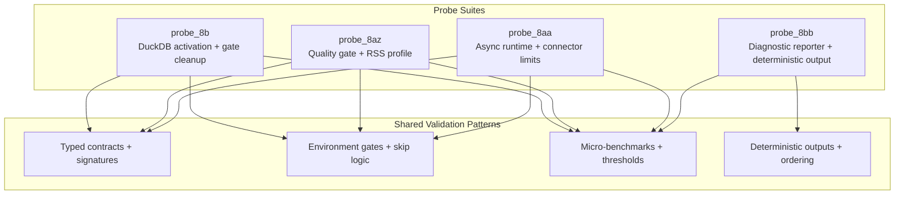
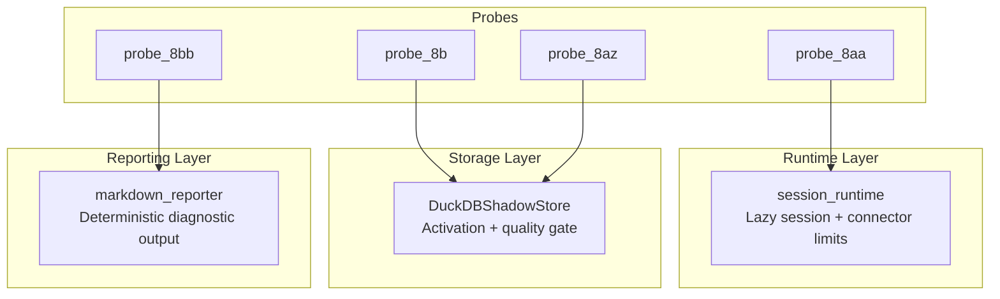
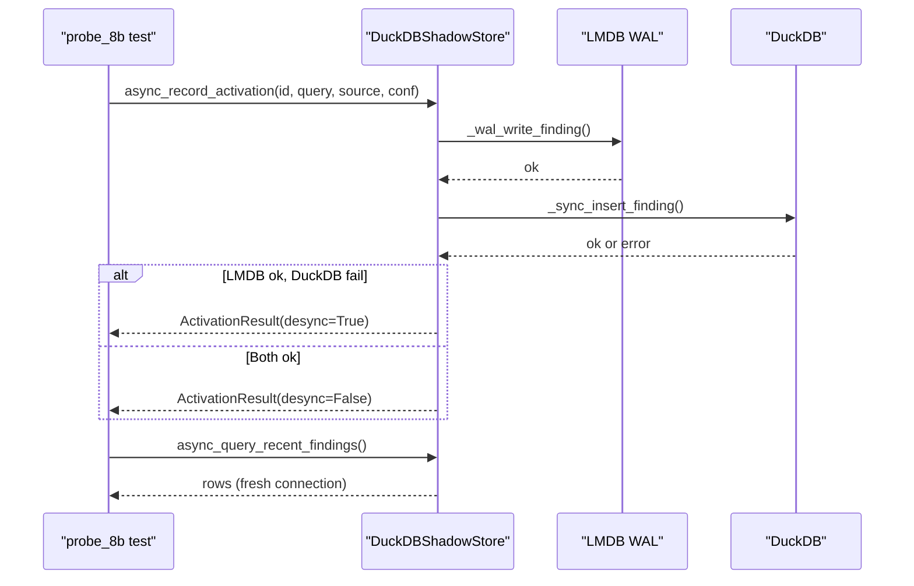
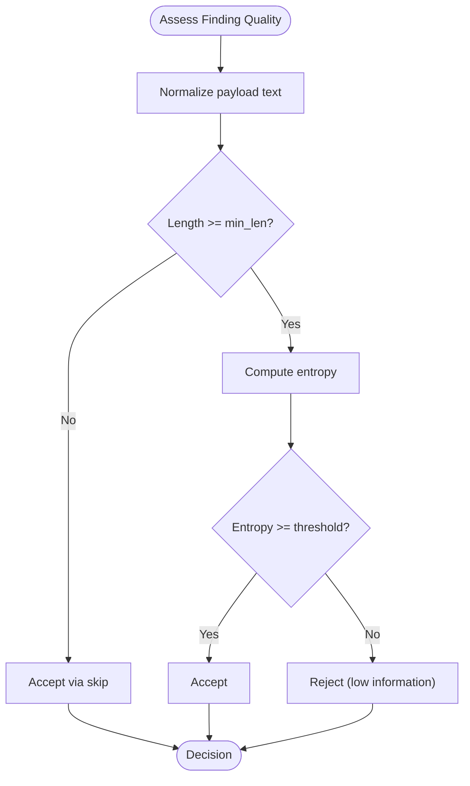
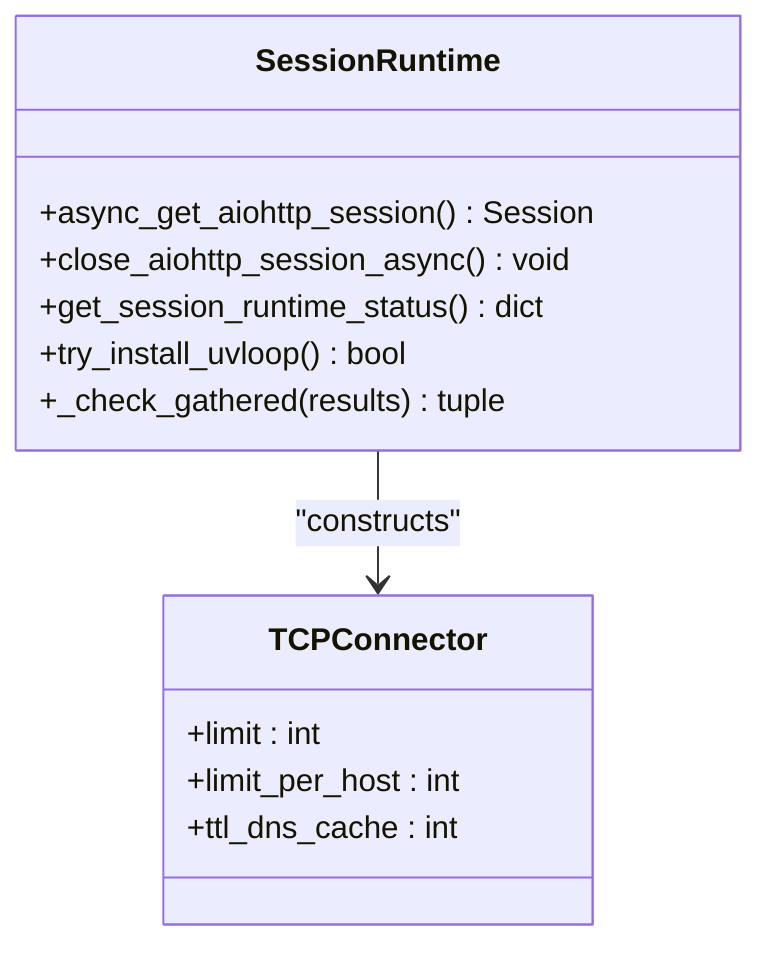
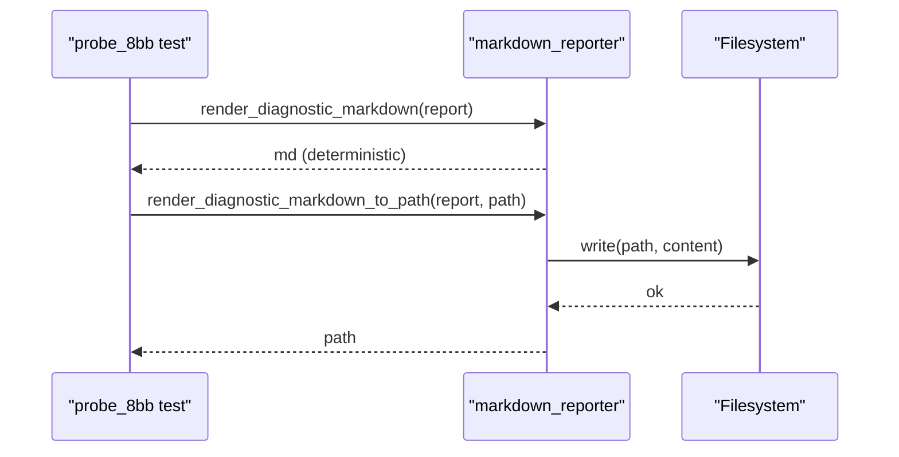
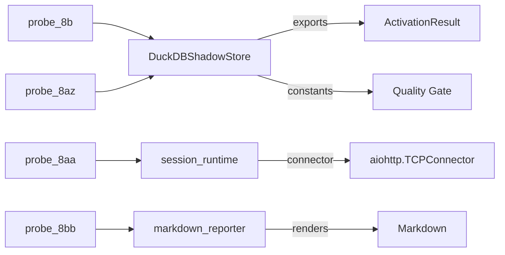

# Production Readiness Probes (8a-8z)

<cite>
**Referenced Files in This Document**
- [tests/probe_8b/test_sprint_8b.py](file://tests/probe_8b/test_sprint_8b.py)
- [tests/probe_8az/test_sprint_8az.py](file://tests/probe_8az/test_sprint_8az.py)
- [tests/probe_8aa/test_sprint_8aa.py](file://tests/probe_8aa/test_sprint_8aa.py)
- [tests/probe_8bb/test_sprint_8bb.py](file://tests/probe_8bb/test_sprint_8bb.py)
- [tests/FINAL_REPORT.md](file://tests/FINAL_REPORT.md)
</cite>

## Table of Contents
1. [Introduction](#introduction)
2. [Project Structure](#project-structure)
3. [Core Components](#core-components)
4. [Architecture Overview](#architecture-overview)
5. [Detailed Component Analysis](#detailed-component-analysis)
6. [Dependency Analysis](#dependency-analysis)
7. [Performance Considerations](#performance-considerations)
8. [Troubleshooting Guide](#troubleshooting-guide)
9. [Conclusion](#conclusion)
10. [Appendices](#appendices)

## Introduction
This document presents the production readiness validation framework implemented across the extensive probe_8a through probe_8z series. These probes are targeted, deterministic, and operationally focused tests that validate system resilience, performance under load, security hardening, and operational robustness. They are designed to prevent regressions, enforce production-grade quality gates, and provide repeatable, measurable outcomes suitable for continuous integration and release validation.

The probe series emphasizes:
- Resilience: async runtime safety, session lifecycle correctness, and graceful error handling
- Performance: micro-benchmarks for critical hot paths, deterministic rendering, and throughput targets
- Security: payload caps, timeouts, offline guards, and handler hardening
- Operational continuity: idempotent operations, deterministic outputs, and observable surfaces

## Project Structure
The probe_8 series is organized as discrete test suites under tests/probe_8<identifier>, each validating a specific aspect of the system. Representative suites include:
- probe_8b: DuckDB activation wrapper, gate truth cleanup, and async activation contracts
- probe_8az: Quality gate calibration and RSS-specific profile validation
- probe_8aa: Async runtime hardening and session connector limits
- probe_8bb: Deterministic diagnostic report rendering and export

**Diagram sources**
- [tests/probe_8b/test_sprint_8b.py:1-472](file://tests/probe_8b/test_sprint_8b.py#L1-L472)
- [tests/probe_8az/test_sprint_8az.py:1-654](file://tests/probe_8az/test_sprint_8az.py#L1-L654)
- [tests/probe_8aa/test_sprint_8aa.py:1-478](file://tests/probe_8aa/test_sprint_8aa.py#L1-L478)
- [tests/probe_8bb/test_sprint_8bb.py:1-319](file://tests/probe_8bb/test_sprint_8bb.py#L1-L319)

**Section sources**
- [tests/probe_8b/test_sprint_8b.py:1-472](file://tests/probe_8b/test_sprint_8b.py#L1-L472)
- [tests/probe_8az/test_sprint_8az.py:1-654](file://tests/probe_8az/test_sprint_8az.py#L1-L654)
- [tests/probe_8aa/test_sprint_8aa.py:1-478](file://tests/probe_8aa/test_sprint_8aa.py#L1-L478)
- [tests/probe_8bb/test_sprint_8bb.py:1-319](file://tests/probe_8bb/test_sprint_8bb.py#L1-L319)

## Core Components
The probe_8 series validates four core production readiness pillars:

- Async activation and storage contracts
  - Typed activation results, ordered WAL-first semantics, and desync detection
  - Fresh read-back safety and idempotent close semantics
- Quality gate and RSS profile calibration
  - Threshold and minimum-length guards, entropy-based quality decisions, and RSS/web parity
  - Status surface contracts and classification outcomes
- Async runtime hardening
  - Lazy session creation, uvloop fail-soft, connector limits, and timeout patterns
  - Deterministic status getters and micro-benchmarks
- Deterministic diagnostic reporting
  - Canonical section ordering, machine-readable summaries, and deterministic rendering
  - Safe URL escaping and graceful fallbacks

**Section sources**
- [tests/probe_8b/test_sprint_8b.py:39-472](file://tests/probe_8b/test_sprint_8b.py#L39-L472)
- [tests/probe_8az/test_sprint_8az.py:43-654](file://tests/probe_8az/test_sprint_8az.py#L43-L654)
- [tests/probe_8aa/test_sprint_8aa.py:39-478](file://tests/probe_8aa/test_sprint_8aa.py#L39-L478)
- [tests/probe_8bb/test_sprint_8bb.py:18-319](file://tests/probe_8bb/test_sprint_8bb.py#L18-L319)

## Architecture Overview
The probe_8 series enforces production-grade contracts across runtime, storage, quality, and reporting layers. It integrates with:
- DuckDBShadowStore for activation and quality gating
- session_runtime for async HTTP client lifecycle and connector configuration
- markdown_reporter for deterministic diagnostic output

**Diagram sources**
- [tests/probe_8b/test_sprint_8b.py:1-472](file://tests/probe_8b/test_sprint_8b.py#L1-L472)
- [tests/probe_8az/test_sprint_8az.py:1-654](file://tests/probe_8az/test_sprint_8az.py#L1-L654)
- [tests/probe_8aa/test_sprint_8aa.py:1-478](file://tests/probe_8aa/test_sprint_8aa.py#L1-L478)
- [tests/probe_8bb/test_sprint_8bb.py:1-319](file://tests/probe_8bb/test_sprint_8bb.py#L1-L319)

## Detailed Component Analysis

### Probe 8B: DuckDB Activation + Gate Cleanup
This probe validates async activation contracts, WAL-first semantics, and gate checks:
- ActivationResult typed contract and batch signatures
- LMDB-first semantics with desync detection
- Fresh read-back safety and idempotent close
- AO canary and related probe gate checks

**Diagram sources**
- [tests/probe_8b/test_sprint_8b.py:230-318](file://tests/probe_8b/test_sprint_8b.py#L230-L318)

**Section sources**
- [tests/probe_8b/test_sprint_8b.py:39-472](file://tests/probe_8b/test_sprint_8b.py#L39-L472)

### Probe 8AZ: Quality Gate + RSS Profile Calibration
This probe validates the quality gate’s entropy-based decision logic and RSS/web parity:
- Threshold and minimum-length guards
- RSS-like findings acceptance and short-text skip behavior
- Classification outcomes and status surface contracts
- Micro-benchmarks for profile selection and ingestion

**Diagram sources**
- [tests/probe_8az/test_sprint_8az.py:43-186](file://tests/probe_8az/test_sprint_8az.py#L43-L186)

**Section sources**
- [tests/probe_8az/test_sprint_8az.py:43-654](file://tests/probe_8az/test_sprint_8az.py#L43-L654)

### Probe 8AA: Async Runtime Hardening
This probe validates async runtime safety and connector limits:
- Lazy session creation and idempotent close semantics
- Connector limits (global and per-host) and TTL DNS cache
- Timeout patterns and uvloop fail-soft behavior
- Deterministic status getter and micro-benchmarks

**Diagram sources**
- [tests/probe_8aa/test_sprint_8aa.py:39-478](file://tests/probe_8aa/test_sprint_8aa.py#L39-L478)

**Section sources**
- [tests/probe_8aa/test_sprint_8aa.py:39-478](file://tests/probe_8aa/test_sprint_8aa.py#L39-L478)

### Probe 8BB: Deterministic Diagnostic Reporting
This probe validates deterministic rendering and export:
- Canonical section ordering and machine-readable summary
- Safe URL escaping and graceful fallbacks
- Deterministic output across repeated renders
- Micro-benchmarks for throughput

**Diagram sources**
- [tests/probe_8bb/test_sprint_8bb.py:18-319](file://tests/probe_8bb/test_sprint_8bb.py#L18-L319)

**Section sources**
- [tests/probe_8bb/test_sprint_8bb.py:18-319](file://tests/probe_8bb/test_sprint_8bb.py#L18-L319)

## Dependency Analysis
The probe_8 series exhibits low coupling and high cohesion:
- probe_8b depends on DuckDBShadowStore activation APIs and environment availability
- probe_8az depends on quality gate constants and DuckDBShadowStore assessment logic
- probe_8aa depends on session_runtime and aiohttp connector configuration
- probe_8bb depends on markdown_reporter rendering and export helpers

**Diagram sources**
- [tests/probe_8b/test_sprint_8b.py:1-472](file://tests/probe_8b/test_sprint_8b.py#L1-L472)
- [tests/probe_8az/test_sprint_8az.py:1-654](file://tests/probe_8az/test_sprint_8az.py#L1-L654)
- [tests/probe_8aa/test_sprint_8aa.py:1-478](file://tests/probe_8aa/test_sprint_8aa.py#L1-L478)
- [tests/probe_8bb/test_sprint_8bb.py:1-319](file://tests/probe_8bb/test_sprint_8bb.py#L1-L319)

**Section sources**
- [tests/probe_8b/test_sprint_8b.py:1-472](file://tests/probe_8b/test_sprint_8b.py#L1-L472)
- [tests/probe_8az/test_sprint_8az.py:1-654](file://tests/probe_8az/test_sprint_8az.py#L1-L654)
- [tests/probe_8aa/test_sprint_8aa.py:1-478](file://tests/probe_8aa/test_sprint_8aa.py#L1-L478)
- [tests/probe_8bb/test_sprint_8bb.py:1-319](file://tests/probe_8bb/test_sprint_8bb.py#L1-L319)

## Performance Considerations
Each probe defines explicit performance thresholds to ensure production-grade responsiveness:
- probe_8az: 1000x quality-profile selection under 200 ms; 100x RSS quality decision under 1000 ms; 100x batch ingestion throughput verification
- probe_8aa: 1000x _check_gathered on success/mixed lists under 500 ms; 100× close/get cycles under 5000 ms
- probe_8bb: 1000 renders under 300 ms; repeated renders byte-identical; to_path helper throughput under 300 ms

These benchmarks prevent performance regressions and ensure deterministic behavior under load.

**Section sources**
- [tests/probe_8az/test_sprint_8az.py:496-654](file://tests/probe_8az/test_sprint_8az.py#L496-L654)
- [tests/probe_8aa/test_sprint_8aa.py:392-443](file://tests/probe_8aa/test_sprint_8aa.py#L392-L443)
- [tests/probe_8bb/test_sprint_8bb.py:268-319](file://tests/probe_8bb/test_sprint_8bb.py#L268-L319)

## Troubleshooting Guide
Common issues and diagnostics validated by the probe_8 series:

- DuckDB activation anomalies
  - Desync detection when LMDB succeeds but DuckDB fails
  - Fresh read-back safety via dedicated connections
  - Idempotent close semantics preventing resource leaks

- Quality gate misconfiguration
  - Threshold and minimum-length guard enforcement
  - RSS/web parity in quality assessment logic
  - Classification outcome contracts for ingest outcomes

- Async runtime instability
  - Lazy session creation avoiding import-time side effects
  - Connector limits preventing connection pool exhaustion
  - Timeout patterns preventing indefinite waits

- Reporting determinism failures
  - Canonical section ordering and machine-readable summary stability
  - Safe URL escaping and JSON block containment
  - Graceful fallbacks for missing fields

**Section sources**
- [tests/probe_8b/test_sprint_8b.py:230-318](file://tests/probe_8b/test_sprint_8b.py#L230-L318)
- [tests/probe_8az/test_sprint_8az.py:237-387](file://tests/probe_8az/test_sprint_8az.py#L237-L387)
- [tests/probe_8aa/test_sprint_8aa.py:127-390](file://tests/probe_8aa/test_sprint_8aa.py#L127-L390)
- [tests/probe_8bb/test_sprint_8bb.py:18-263](file://tests/probe_8bb/test_sprint_8bb.py#L18-L263)

## Conclusion
The probe_8 series establishes a comprehensive, production-focused validation framework. By enforcing typed contracts, deterministic outputs, and measurable performance thresholds, it ensures resilience, security, and operational continuity. The suite’s modular design enables targeted regression prevention while maintaining low coupling and high cohesion across runtime, storage, quality, and reporting layers.

## Appendices

### Production-Focused Validation Criteria
- Typed contracts and signatures must remain stable across releases
- Environment gates must gracefully skip tests when dependencies are unavailable
- Performance benchmarks must remain within defined thresholds
- Deterministic outputs must be byte-identical across repeated renders
- Desync detection must be accurate under partial failure scenarios

### Scalability Testing Approaches
- Micro-benchmarks for hot-path functions (quality gate, activation, rendering)
- Batch ingestion throughput under mocked dependencies
- Connector limit validation under concurrent workloads
- Deterministic rendering throughput under repeated invocations

### Enterprise-Grade QA Measures
- Idempotent operations with observable status surfaces
- Canonical labeling and fallback mappings for diagnostics
- Safe URL escaping and JSON block containment in reports
- Fresh read-back safety and WAL-first semantics for persistence

**Section sources**
- [tests/FINAL_REPORT.md:1-151](file://tests/FINAL_REPORT.md#L1-L151)
- [tests/probe_8b/test_sprint_8b.py:392-472](file://tests/probe_8b/test_sprint_8b.py#L392-L472)
- [tests/probe_8az/test_sprint_8az.py:496-654](file://tests/probe_8az/test_sprint_8az.py#L496-L654)
- [tests/probe_8aa/test_sprint_8aa.py:392-478](file://tests/probe_8aa/test_sprint_8aa.py#L392-L478)
- [tests/probe_8bb/test_sprint_8bb.py:268-319](file://tests/probe_8bb/test_sprint_8bb.py#L268-L319)