# Specialized Capability Probes (6b-7i)

<cite>
**Referenced Files in This Document**
- [deep_probe.py](file://deep_probe.py)
- [capabilities.py](file://capabilities.py)
- [test_apple_fm_probe.py](file://tests/probe_6b/test_apple_fm_probe.py)
- [test_mlx_cache_limits.py](file://tests/probe_6b/test_mlx_cache_limits.py)
- [test_qos_constants.py](file://tests/probe_6b/test_qos_constants.py)
- [test_torch_eviction.py](file://tests/probe_6b/test_torch_eviction.py)
- [test_uma_budget_thresholds.py](file://tests/probe_6b/test_uma_budget_thresholds.py)
- [test_afm_probe.py](file://tests/probe_7b/test_afm_probe.py)
- [test_hermes3_additions.py](file://tests/probe_7b/test_hermes3_additions.py)
- [test_mlx_init.py](file://tests/probe_7b/test_mlx_init.py)
- [test_model_lifecycle.py](file://tests/probe_7b/test_model_lifecycle.py)
- [test_unload_lifecycle_7k.py](file://tests/probe_7k/test_unload_lifecycle_7k.py)
</cite>

## Table of Contents
1. [Introduction](#introduction)
2. [Project Structure](#project-structure)
3. [Core Components](#core-components)
4. [Architecture Overview](#architecture-overview)
5. [Detailed Component Analysis](#detailed-component-analysis)
6. [Dependency Analysis](#dependency-analysis)
7. [Performance Considerations](#performance-considerations)
8. [Troubleshooting Guide](#troubleshooting-guide)
9. [Conclusion](#conclusion)

## Introduction
This document presents specialized capability probes covering the 6b through 7k series, focusing on domain-specific validations for machine learning integration, advanced pattern matching, intelligence gathering, and system-level quality gates. The probes target:
- Apple Foundation Models (AFM) availability and correctness
- MLX memory and cache constraints
- Thread pool Quality of Service (QoS) constants
- Torch module eviction and lazy fallback patterns
- Unified Memory Accounting (UMA) pressure thresholds
- Hermes3 engine enhancements and structured generation
- Model lifecycle safety and unload ordering
- Batch worker lifecycle and emergency unload protocols

Each probe defines precise validation criteria, specialized test scenarios, and domain-specific quality gates to ensure robust operation across heterogeneous environments.

## Project Structure
The specialized probes are organized under the tests directory by sprint series:
- probe_6b: Platform gating, MLX limits, QoS, torch eviction, UMA thresholds
- probe_7b: AFM probe enhancements, Hermes3 additions, MLX init, model lifecycle
- probe_7k: Lifecycle closure and batch worker shutdown safety

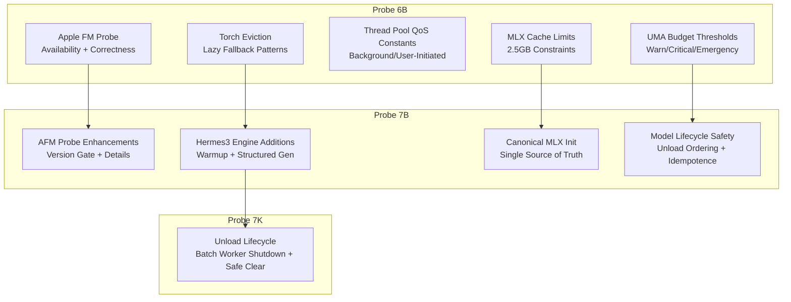

**Diagram sources**
- [test_apple_fm_probe.py:1-134](file://tests/probe_6b/test_apple_fm_probe.py#L1-L134)
- [test_mlx_cache_limits.py:1-66](file://tests/probe_6b/test_mlx_cache_limits.py#L1-L66)
- [test_qos_constants.py:1-59](file://tests/probe_6b/test_qos_constants.py#L1-L59)
- [test_torch_eviction.py:1-113](file://tests/probe_6b/test_torch_eviction.py#L1-L113)
- [test_uma_budget_thresholds.py:1-106](file://tests/probe_6b/test_uma_budget_thresholds.py#L1-L106)
- [test_afm_probe.py:1-164](file://tests/probe_7b/test_afm_probe.py#L1-L164)
- [test_hermes3_additions.py:1-104](file://tests/probe_7b/test_hermes3_additions.py#L1-L104)
- [test_mlx_init.py:1-91](file://tests/probe_7b/test_mlx_init.py#L1-L91)
- [test_model_lifecycle.py:1-99](file://tests/probe_7b/test_model_lifecycle.py#L1-L99)
- [test_unload_lifecycle_7k.py:1-332](file://tests/probe_7k/test_unload_lifecycle_7k.py#L1-L332)

**Section sources**
- [test_apple_fm_probe.py:1-134](file://tests/probe_6b/test_apple_fm_probe.py#L1-L134)
- [test_mlx_cache_limits.py:1-66](file://tests/probe_6b/test_mlx_cache_limits.py#L1-L66)
- [test_qos_constants.py:1-59](file://tests/probe_6b/test_qos_constants.py#L1-L59)
- [test_torch_eviction.py:1-113](file://tests/probe_6b/test_torch_eviction.py#L1-L113)
- [test_uma_budget_thresholds.py:1-106](file://tests/probe_6b/test_uma_budget_thresholds.py#L1-L106)
- [test_afm_probe.py:1-164](file://tests/probe_7b/test_afm_probe.py#L1-L164)
- [test_hermes3_additions.py:1-104](file://tests/probe_7b/test_hermes3_additions.py#L1-L104)
- [test_mlx_init.py:1-91](file://tests/probe_7b/test_mlx_init.py#L1-L91)
- [test_model_lifecycle.py:1-99](file://tests/probe_7b/test_model_lifecycle.py#L1-L99)
- [test_unload_lifecycle_7k.py:1-332](file://tests/probe_7k/test_unload_lifecycle_7k.py#L1-L332)

## Core Components
This section outlines the specialized components validated by the probes and their roles in domain-specific functionality.

- Apple FM Probe
  - Validates platform gating (Darwin, arm64, macOS 26+) and correctness checks
  - Exposes structured result with details and error reporting
  - Ensures fail-open behavior for non-applicable platforms

- MLX Cache and Initialization
  - Enforces canonical MLX buffer initialization with 2.5GB cache/wired limits
  - Validates idempotent initialization and cleanup routines
  - Guards against eager imports and supports lazy fallbacks

- Thread Pool QoS
  - Verifies QoS class constants for background and user-initiated threads
  - Prevents misuse of inappropriate QoS values in inference contexts

- Torch Module Eviction
  - Confirms absence of module-level torch imports in patched modules
  - Validates lazy fallback patterns and MPS availability checks

- UMA Budget Thresholds
  - Defines warn/critical/emergency memory pressure levels
  - Provides snapshot and predicate APIs for pressure assessment

- Hermes3 Engine Additions
  - Adds warmup prefix cache seam and structured generation wrapper
  - Includes capability probes for outlines/xgrammar support

- Model Lifecycle Safety
  - Ensures unload ordering, idempotence, and fail-open behavior
  - Validates prompt cache eviction and engine extraction

- Unload Lifecycle (7K)
  - Guarantees batch worker shutdown, queue nullification, and pending futures resolution
  - Implements safe clear protocol and emergency unload safeguards

**Section sources**
- [test_apple_fm_probe.py:1-134](file://tests/probe_6b/test_apple_fm_probe.py#L1-L134)
- [test_mlx_cache_limits.py:1-66](file://tests/probe_6b/test_mlx_cache_limits.py#L1-L66)
- [test_qos_constants.py:1-59](file://tests/probe_6b/test_qos_constants.py#L1-L59)
- [test_torch_eviction.py:1-113](file://tests/probe_6b/test_torch_eviction.py#L1-L113)
- [test_uma_budget_thresholds.py:1-106](file://tests/probe_6b/test_uma_budget_thresholds.py#L1-L106)
- [test_afm_probe.py:1-164](file://tests/probe_7b/test_afm_probe.py#L1-L164)
- [test_hermes3_additions.py:1-104](file://tests/probe_7b/test_hermes3_additions.py#L1-L104)
- [test_mlx_init.py:1-91](file://tests/probe_7b/test_mlx_init.py#L1-L91)
- [test_model_lifecycle.py:1-99](file://tests/probe_7b/test_model_lifecycle.py#L1-L99)
- [test_unload_lifecycle_7k.py:1-332](file://tests/probe_7k/test_unload_lifecycle_7k.py#L1-L332)

## Architecture Overview
The probes operate at the intersection of platform constraints, runtime systems, and AI model orchestration. They validate:
- Platform gating and correctness for Apple Foundation Models
- Memory and cache boundaries for MLX
- Threading quality gates for responsiveness
- Module import discipline to prevent eager initialization
- Unified memory accounting for pressure-aware operation
- Model lifecycle safety and batch worker lifecycle controls

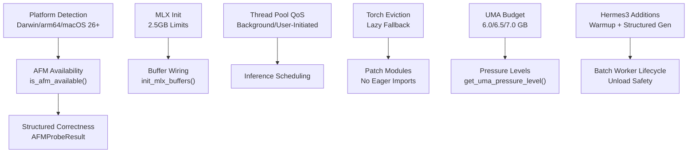

**Diagram sources**
- [test_apple_fm_probe.py:1-134](file://tests/probe_6b/test_apple_fm_probe.py#L1-L134)
- [test_mlx_cache_limits.py:1-66](file://tests/probe_6b/test_mlx_cache_limits.py#L1-L66)
- [test_qos_constants.py:1-59](file://tests/probe_6b/test_qos_constants.py#L1-L59)
- [test_torch_eviction.py:1-113](file://tests/probe_6b/test_torch_eviction.py#L1-L113)
- [test_uma_budget_thresholds.py:1-106](file://tests/probe_6b/test_uma_budget_thresholds.py#L1-L106)
- [test_hermes3_additions.py:1-104](file://tests/probe_7b/test_hermes3_additions.py#L1-L104)
- [test_unload_lifecycle_7k.py:1-332](file://tests/probe_7k/test_unload_lifecycle_7k.py#L1-L332)

## Detailed Component Analysis

### Apple FM Probe Validation (6b)
The Apple FM Probe validates platform gating, correctness, and structured reporting. Specialized criteria include:
- Platform gating: Darwin system, arm64 machine, macOS version ≥ 26.0
- Correctness validation: structured JSON acceptance with fail-open behavior
- Export coverage: availability API, structured result, NL framework check

Concrete test scenarios:
- Non-Darwin returns False (not fail-open)
- Non-arm64 returns False
- macOS 25 fails 26.0 gate with explicit error
- macOS 26 passes version gate; correctness probe mocked via JSON test
- AFMProbeResult includes apple_intelligence_enabled and details dictionary

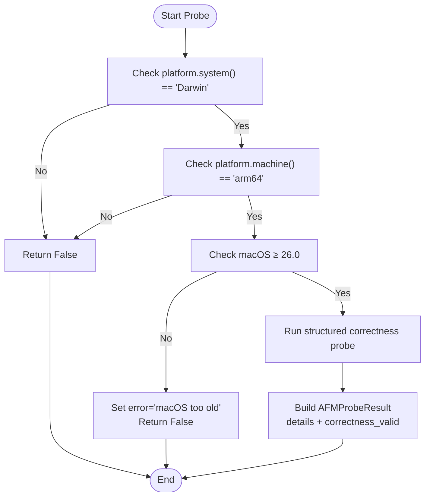

**Diagram sources**
- [test_apple_fm_probe.py:54-99](file://tests/probe_6b/test_apple_fm_probe.py#L54-L99)
- [test_afm_probe.py:19-48](file://tests/probe_7b/test_afm_probe.py#L19-L48)

**Section sources**
- [test_apple_fm_probe.py:1-134](file://tests/probe_6b/test_apple_fm_probe.py#L1-L134)
- [test_afm_probe.py:1-164](file://tests/probe_7b/test_afm_probe.py#L1-L164)

### MLX Cache Limits and Initialization (6b/7b)
The MLX cache probe ensures canonical initialization with strict limits and idempotent behavior:
- 2.5GB cache and wired limits enforced
- init_mlx_buffers invoked at module load
- Cleanup routines (sync/aggressive) and eviction exposed
- Constants validated for byte-equivalence

Domain-specific quality gates:
- Single source of truth for MLX initialization
- Idempotence and safety across reloads
- Immediate cleanup hooks for memory pressure

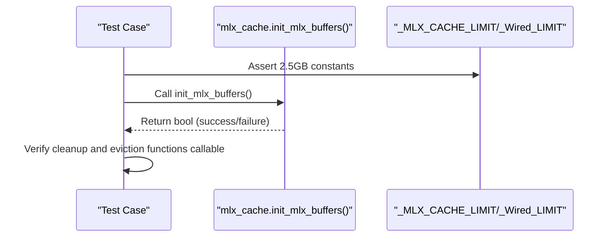

**Diagram sources**
- [test_mlx_cache_limits.py:17-52](file://tests/probe_6b/test_mlx_cache_limits.py#L17-L52)
- [test_mlx_init.py:18-87](file://tests/probe_7b/test_mlx_init.py#L18-L87)

**Section sources**
- [test_mlx_cache_limits.py:1-66](file://tests/probe_6b/test_mlx_cache_limits.py#L1-L66)
- [test_mlx_init.py:1-91](file://tests/probe_7b/test_mlx_init.py#L1-L91)

### Thread Pool QoS Constants (6b)
The QoS probe validates threading quality classes for background and user-initiated tasks:
- Background class equals 0x09
- User-initiated class equals 0x19
- Explicit exclusion of inappropriate QoS for inference paths

Specialized validation criteria:
- Source inspection for constant definitions
- Prevention of 0x21 usage in inference contexts

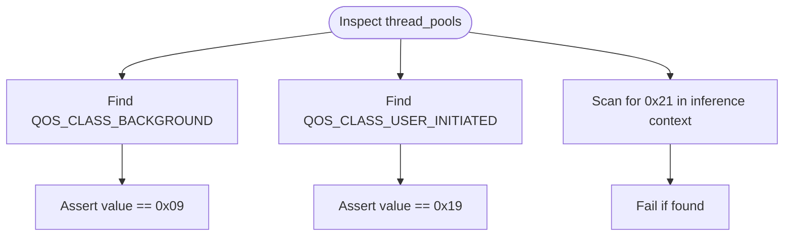

**Diagram sources**
- [test_qos_constants.py:17-54](file://tests/probe_6b/test_qos_constants.py#L17-L54)

**Section sources**
- [test_qos_constants.py:1-59](file://tests/probe_6b/test_qos_constants.py#L1-L59)

### Torch Eviction and Lazy Fallback (6b)
The torch eviction probe enforces module import discipline and lazy fallback patterns:
- No module-level torch imports in patched modules
- Lazy fallback patterns verified (e.g., _get_torch, _check_mps_available)
- Patched modules validated for absence of eager torch

Specialized validation criteria:
- AST-based import scanning for module-level torch
- Signature verification for lazy helpers

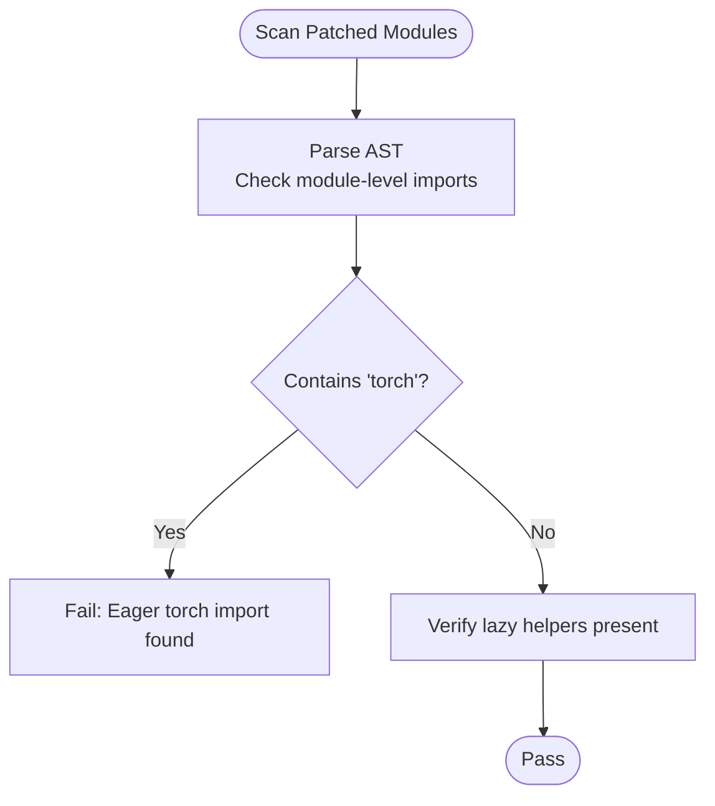

**Diagram sources**
- [test_torch_eviction.py:15-96](file://tests/probe_6b/test_torch_eviction.py#L15-L96)

**Section sources**
- [test_torch_eviction.py:1-113](file://tests/probe_6b/test_torch_eviction.py#L1-L113)

### UMA Budget Thresholds (6b)
The UMA probe defines and validates memory pressure thresholds:
- Warn: 6.0 GB
- Critical: 6.5 GB
- Emergency: 7.0 GB
- Snapshot includes emergency threshold and is_emergency flag

Specialized validation criteria:
- Threshold constants in MB-equivalent values
- Pressure level predicates for emergency/critical/warn/normal
- Snapshot completeness and boolean flags

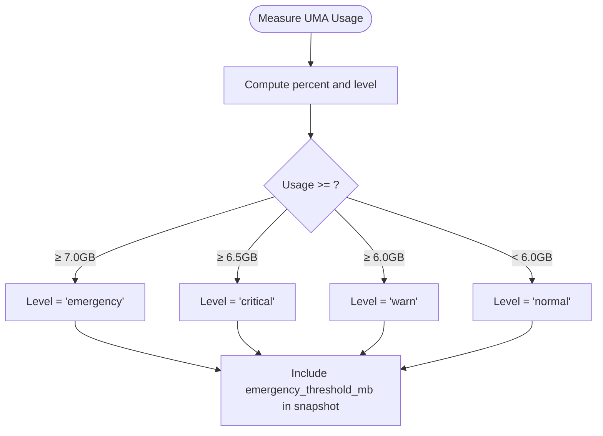

**Diagram sources**
- [test_uma_budget_thresholds.py:18-93](file://tests/probe_6b/test_uma_budget_thresholds.py#L18-L93)

**Section sources**
- [test_uma_budget_thresholds.py:1-106](file://tests/probe_6b/test_uma_budget_thresholds.py#L1-L106)

### Hermes3 Engine Additions (7b)
The Hermes3 probe extends the engine with:
- warmup_prefix_cache seam for cache warming
- generate_structured_safe wrapper with fallback chain
- Capability probes for outlines and xgrammar support

Specialized validation criteria:
- Methods exist and return appropriate types
- Wrapper returns fallback schema instances when model not loaded
- Capability probes return boolean indicators

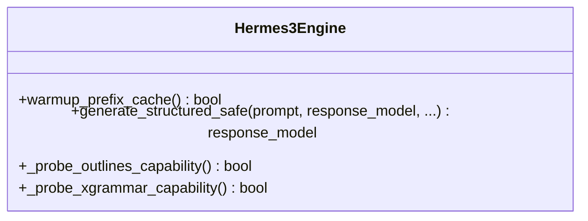

**Diagram sources**
- [test_hermes3_additions.py:20-100](file://tests/probe_7b/test_hermes3_additions.py#L20-L100)

**Section sources**
- [test_hermes3_additions.py:1-104](file://tests/probe_7b/test_hermes3_additions.py#L1-L104)

### Model Lifecycle Safety (7b)
The model lifecycle probe ensures:
- unload_model is fail-open, idempotent, and accepts aggressive flag
- Extraction of model/tokenizer/prompt_cache from engine objects
- preload_model_hint callable for hints

Specialized validation criteria:
- None inputs handled gracefully
- Multiple invocations safe
- Engine object extraction verified

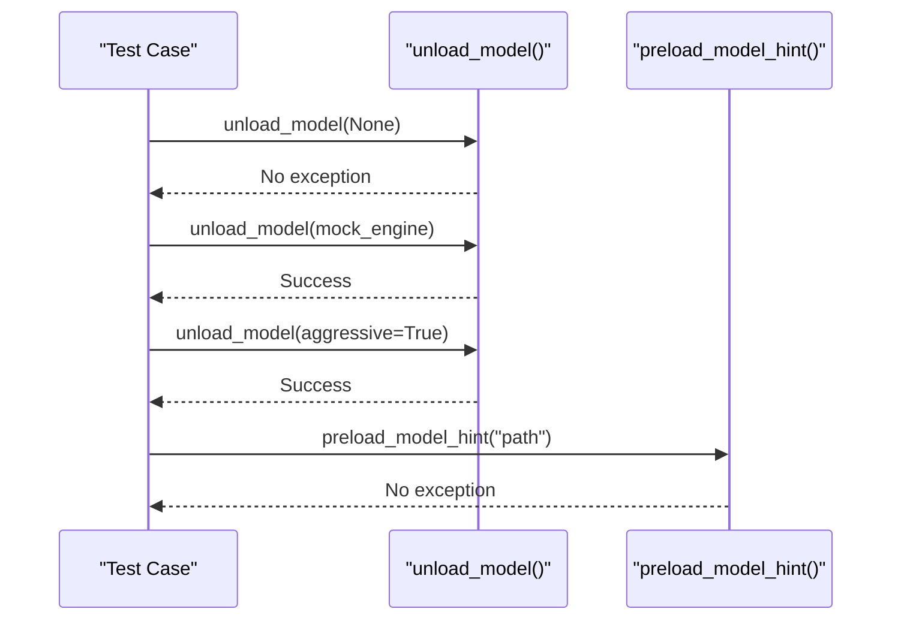

**Diagram sources**
- [test_model_lifecycle.py:18-95](file://tests/probe_7b/test_model_lifecycle.py#L18-L95)

**Section sources**
- [test_model_lifecycle.py:1-99](file://tests/probe_7b/test_model_lifecycle.py#L1-L99)

### Unload Lifecycle and Batch Worker Shutdown (7k)
The 7k probe focuses on lifecycle closure:
- _warmup_cache set to None after unload
- _batch_queue and _batch_worker_task nullified after unload
- Pending futures resolved or failed appropriately during emergency unload
- Safe clear protocol requires worker done, queue None, pending futures empty
- Import time guard ensures hermes3_engine import completes within 3000ms

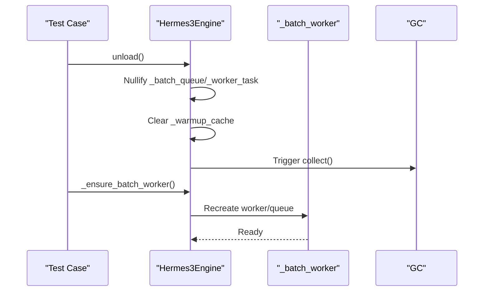

**Diagram sources**
- [test_unload_lifecycle_7k.py:87-196](file://tests/probe_7k/test_unload_lifecycle_7k.py#L87-L196)

**Section sources**
- [test_unload_lifecycle_7k.py:1-332](file://tests/probe_7k/test_unload_lifecycle_7k.py#L1-L332)

## Dependency Analysis
The probes depend on internal modules and validate cross-cutting concerns:
- Apple FM Probe depends on platform detection and structured correctness
- MLX probes depend on utils.mlx_cache and constants
- QoS probes depend on thread_pools constants
- Torch eviction probes depend on AST parsing and module inspection
- UMA probes depend on utils.uma_budget pressure computation
- Hermes3 probes depend on brain.hermes3_engine additions
- Lifecycle probes depend on brain.model_lifecycle and engine internals
- 7k probes depend on engine unload semantics and worker lifecycle

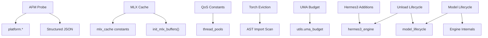

**Diagram sources**
- [test_apple_fm_probe.py:54-99](file://tests/probe_6b/test_apple_fm_probe.py#L54-L99)
- [test_mlx_cache_limits.py:17-52](file://tests/probe_6b/test_mlx_cache_limits.py#L17-L52)
- [test_qos_constants.py:17-54](file://tests/probe_6b/test_qos_constants.py#L17-L54)
- [test_torch_eviction.py:15-96](file://tests/probe_6b/test_torch_eviction.py#L15-L96)
- [test_uma_budget_thresholds.py:18-93](file://tests/probe_6b/test_uma_budget_thresholds.py#L18-L93)
- [test_hermes3_additions.py:20-100](file://tests/probe_7b/test_hermes3_additions.py#L20-L100)
- [test_model_lifecycle.py:18-95](file://tests/probe_7b/test_model_lifecycle.py#L18-L95)
- [test_unload_lifecycle_7k.py:87-196](file://tests/probe_7k/test_unload_lifecycle_7k.py#L87-L196)

**Section sources**
- [test_apple_fm_probe.py:1-134](file://tests/probe_6b/test_apple_fm_probe.py#L1-L134)
- [test_mlx_cache_limits.py:1-66](file://tests/probe_6b/test_mlx_cache_limits.py#L1-L66)
- [test_qos_constants.py:1-59](file://tests/probe_6b/test_qos_constants.py#L1-L59)
- [test_torch_eviction.py:1-113](file://tests/probe_6b/test_torch_eviction.py#L1-L113)
- [test_uma_budget_thresholds.py:1-106](file://tests/probe_6b/test_uma_budget_thresholds.py#L1-L106)
- [test_hermes3_additions.py:1-104](file://tests/probe_7b/test_hermes3_additions.py#L1-L104)
- [test_model_lifecycle.py:1-99](file://tests/probe_7b/test_model_lifecycle.py#L1-L99)
- [test_unload_lifecycle_7k.py:1-332](file://tests/probe_7k/test_unload_lifecycle_7k.py#L1-L332)

## Performance Considerations
- Import time guard for hermes3_engine prevents startup regressions
- Canonical MLX initialization reduces redundant setup overhead
- Lazy fallback patterns minimize eager module loading costs
- Batch worker shutdown timeouts bound teardown latency
- Memory thresholds enable proactive pressure mitigation

[No sources needed since this section provides general guidance]

## Troubleshooting Guide
Common issues and resolutions:
- AFM availability failures on non-Darwin or non-arm64 platforms
- MLX initialization errors due to missing MLX or repeated initialization attempts
- QoS misuse causing unexpected scheduling behavior
- Torch eager imports causing import delays or failures
- UMA pressure misclassification due to incorrect thresholds
- Hermes3 structured generation fallback not triggered
- Model unload not idempotent or failing on None inputs
- Batch worker shutdown hanging or exceeding timeouts

Validation steps:
- Confirm platform detection and version gating
- Verify MLX constants and initialization calls
- Inspect QoS constants and usage sites
- Scan modules for eager torch imports
- Cross-check UMA thresholds and pressure levels
- Ensure structured generation wrappers are callable
- Validate unload idempotence and engine extraction
- Monitor batch worker shutdown completion and queue state

**Section sources**
- [test_apple_fm_probe.py:54-99](file://tests/probe_6b/test_apple_fm_probe.py#L54-L99)
- [test_mlx_cache_limits.py:31-52](file://tests/probe_6b/test_mlx_cache_limits.py#L31-L52)
- [test_qos_constants.py:38-54](file://tests/probe_6b/test_qos_constants.py#L38-L54)
- [test_torch_eviction.py:38-76](file://tests/probe_6b/test_torch_eviction.py#L38-L76)
- [test_uma_budget_thresholds.py:58-93](file://tests/probe_6b/test_uma_budget_thresholds.py#L58-L93)
- [test_hermes3_additions.py:41-64](file://tests/probe_7b/test_hermes3_additions.py#L41-L64)
- [test_model_lifecycle.py:23-58](file://tests/probe_7b/test_model_lifecycle.py#L23-L58)
- [test_unload_lifecycle_7k.py:209-221](file://tests/probe_7k/test_unload_lifecycle_7k.py#L209-L221)

## Conclusion
The specialized capability probes (6b-7k) establish rigorous validation for machine learning integration, platform gating, threading quality, module discipline, memory accounting, and lifecycle safety. They define domain-specific quality gates, fail-open behaviors, and idempotent operations to ensure reliable operation across diverse environments. The structured test scenarios and specialized criteria provide strong assurance for advanced pattern matching, intelligence gathering, and system stability.