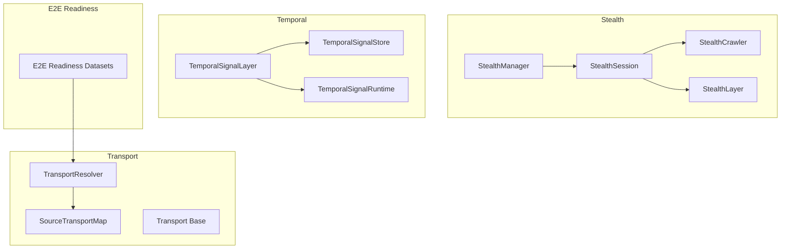
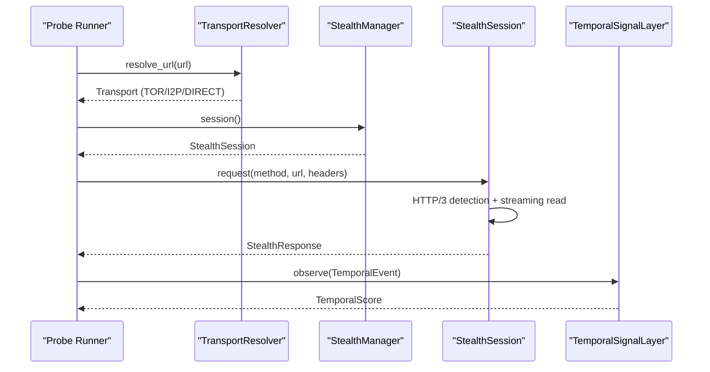
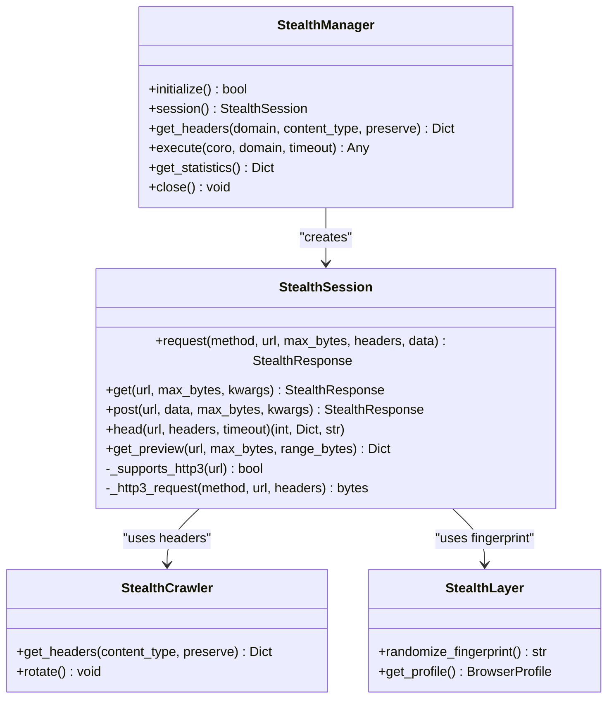
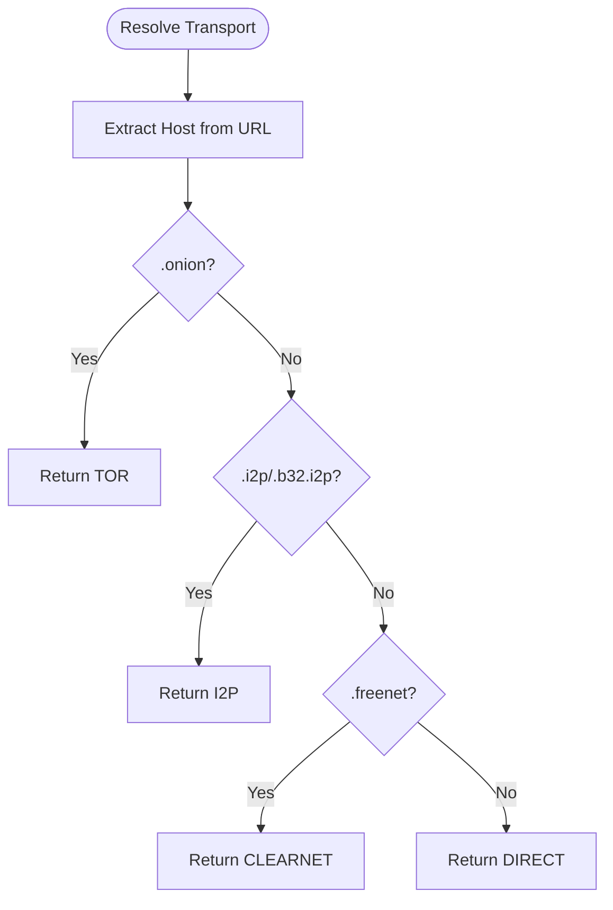
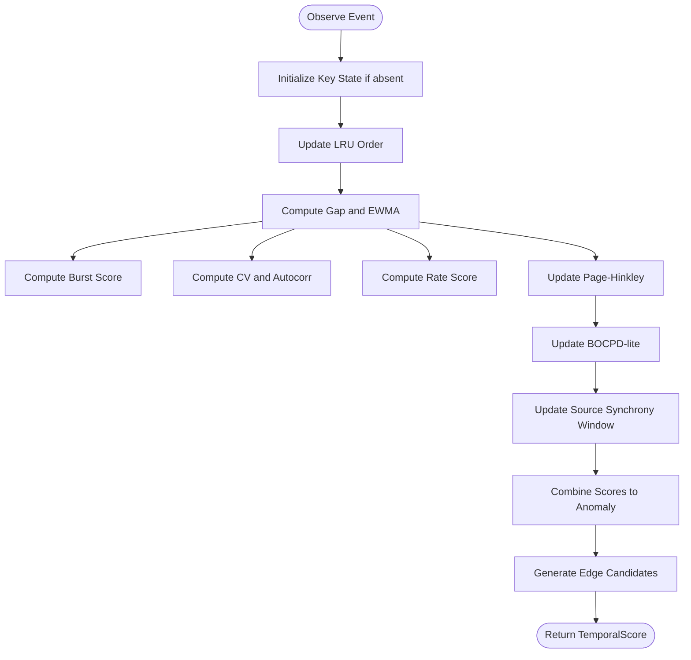
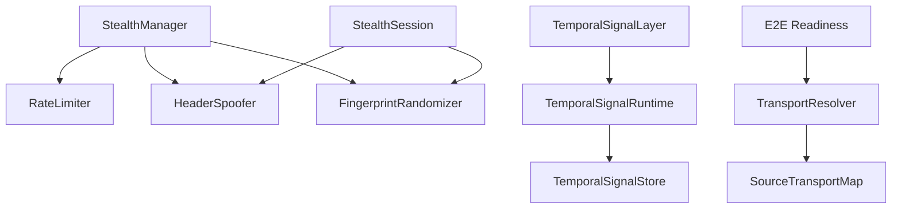

# Specialized Domain Probes

<cite>
**Referenced Files in This Document**
- [deep_probe.py](file://deep_probe.py)
- [stealth_manager.py](file://stealth/stealth_manager.py)
- [stealth_session.py](file://stealth/stealth_session.py)
- [stealth_crawler.py](file://intelligence/stealth_crawler.py)
- [stealth_layer.py](file://layers/stealth_layer.py)
- [transport_resolver.py](file://transport/transport_resolver.py)
- [base.py](file://transport/base.py)
- [temporal_signal_layer.py](file://layers/temporal_signal_layer.py)
- [temporal_signal_store.py](file://layers/temporal_signal_store.py)
- [temporal_signal_runtime.py](file://layers/temporal_signal_runtime.py)
- [test_temporal_signal_layer.py](file://tests/probe_temporal_signal_layer/test_temporal_signal_layer.py)
- [probe_e2e_readiness](file://probe_e2e_readiness/)
- [probe_transport_cap_2026](file://probe_transport_cap_2026/)
- [probe_temporal_signal_layer](file://probe_temporal_signal_layer/)
- [probe_temporal_signal_store](file://probe_temporal_signal_store/)
- [probe_temporal_signal_wiring](file://probe_temporal_signal_wiring/)
- [probe_curl_cffi_stealth_lane](file://probe_curl_cffi_stealth_lane/)
</cite>

## Table of Contents
1. [Introduction](#introduction)
2. [Project Structure](#project-structure)
3. [Core Components](#core-components)
4. [Architecture Overview](#architecture-overview)
5. [Detailed Component Analysis](#detailed-component-analysis)
6. [Dependency Analysis](#dependency-analysis)
7. [Performance Considerations](#performance-considerations)
8. [Troubleshooting Guide](#troubleshooting-guide)
9. [Conclusion](#conclusion)

## Introduction
This document presents specialized domain probe categories that validate advanced OSINT research domains: stealth operations, end-to-end readiness, transport capabilities, temporal signal processing, and advanced system integration. Each category targets distinct validation needs:
- Stealth operations: HTTP header spoofing, fingerprint randomization, rate limiting, and human-like behavior simulation under memory constraints.
- End-to-end readiness: Cross-stack transport validation across HTTP/1.1, HTTP/2, and curl_cffi transports with canonical baselines.
- Transport capabilities: Autonomous transport selection among Tor, I2P, and direct connectivity with mandatory routing for .onion domains.
- Temporal signal processing: Burst detection, periodicity scoring, change-point detection, and source synchrony with bounded memory and deterministic behavior.
- Advanced system integration: Persistent temporal state, cross-run snapshotting, and advisory priority hints for orchestration.

These probes collectively ensure robustness across network security, temporal analysis, stealth operations, and system-wide integration scenarios.

## Project Structure
The specialized probes are organized around focused modules and test suites:
- Stealth: Unified stealth manager, session, crawler, and layer integrations.
- Transport: Transport resolver and classification for .onion, .i2p, and .freenet domains.
- Temporal: Event-driven layer with bounded state, persistence, and runtime helpers.
- E2E readiness: Comparative datasets and reports validating transport stacks.
- Integration probes: Dedicated test suites for temporal layer, store, and wiring.

**Diagram sources**
- [stealth_manager.py:85-337](file://stealth/stealth_manager.py#L85-337)
- [stealth_session.py:367-803](file://stealth/stealth_session.py#L367-803)
- [stealth_crawler.py](file://intelligence/stealth_crawler.py)
- [stealth_layer.py](file://layers/stealth_layer.py)
- [transport_resolver.py:95-322](file://transport/transport_resolver.py#L95-322)
- [base.py:4-24](file://transport/base.py#L4-24)
- [temporal_signal_layer.py:137-691](file://layers/temporal_signal_layer.py#L137-691)
- [temporal_signal_store.py:38-149](file://layers/temporal_signal_store.py#L38-149)
- [temporal_signal_runtime.py:134-289](file://layers/temporal_signal_runtime.py#L134-289)
- [probe_e2e_readiness](file://probe_e2e_readiness/)

**Section sources**
- [stealth_manager.py:85-337](file://stealth/stealth_manager.py#L85-337)
- [transport_resolver.py:95-322](file://transport/transport_resolver.py#L95-322)
- [temporal_signal_layer.py:137-691](file://layers/temporal_signal_layer.py#L137-691)

## Core Components
- StealthManager: Integrates rate limiting, header spoofing, and fingerprint randomization with session lifecycle and retry/backoff policies.
- StealthSession: HTTP/3 autodetection, streaming reads with bounded memory, and Tor identity rotation.
- TransportResolver: Autonomous selection among Nym, Tor, Direct, and InMemory transports with mandatory routing for .onion.
- TemporalSignalLayer: Burst, periodicity, change-point, and source synchrony scoring with bounded memory and deterministic behavior.
- TemporalSignalStore/Runtime: SQLite WAL persistence for snapshots, cross-run continuity, and advisory priority hints.

**Section sources**
- [stealth_manager.py:85-337](file://stealth/stealth_manager.py#L85-337)
- [stealth_session.py:367-803](file://stealth/stealth_session.py#L367-803)
- [transport_resolver.py:95-322](file://transport/transport_resolver.py#L95-322)
- [temporal_signal_layer.py:137-691](file://layers/temporal_signal_layer.py#L137-691)
- [temporal_signal_store.py:38-149](file://layers/temporal_signal_store.py#L38-149)
- [temporal_signal_runtime.py:134-289](file://layers/temporal_signal_runtime.py#L134-289)

## Architecture Overview
The specialized probes integrate stealth, transport, and temporal domains into a cohesive validation pipeline. Transport classification drives routing decisions, stealth ensures operational security, and temporal scoring enables anomaly detection and prioritization.

**Diagram sources**
- [transport_resolver.py:152-175](file://transport/transport_resolver.py#L152-175)
- [stealth_manager.py:261-274](file://stealth/stealth_manager.py#L261-274)
- [stealth_session.py:519-684](file://stealth/stealth_session.py#L519-684)
- [temporal_signal_layer.py:170-378](file://layers/temporal_signal_layer.py#L170-378)

## Detailed Component Analysis

### Stealth Operations Probe
Validates HTTP header spoofing, fingerprint randomization, rate limiting, and human-like behavior under memory constraints. Key validations:
- Header rotation and auto-rotation triggers.
- Rate limiting enforcement and backoff on transient failures.
- HTTP/3 detection and fallback to aiohttp.
- Streaming reads with bounded memory and truncated previews.
- Tor identity rotation every N requests.

**Diagram sources**
- [stealth_manager.py:85-337](file://stealth/stealth_manager.py#L85-337)
- [stealth_session.py:367-803](file://stealth/stealth_session.py#L367-803)
- [stealth_crawler.py](file://intelligence/stealth_crawler.py)
- [stealth_layer.py](file://layers/stealth_layer.py)

Concrete validation criteria:
- Auto-rotation occurs at configured intervals.
- Rate limits are enforced per domain with backoff on transient failures.
- HTTP/3 detection caches results and falls back gracefully.
- Streaming reads truncate at configured byte limits.
- Tor identity rotates every N requests.

Unique challenges:
- Balancing stealth with performance under M1 8GB constraints.
- Ensuring deterministic behavior for reproducibility.
- Handling transient network errors with exponential backoff and jitter.

**Section sources**
- [stealth_manager.py:147-337](file://stealth/stealth_manager.py#L147-337)
- [stealth_session.py:367-803](file://stealth/stealth_session.py#L367-803)

### End-to-End Readiness Probe
Validates transport stacks across HTTP clients and protocols. Uses comparative datasets and canonical baselines to assess:
- HTTP/2 with curl_cffi and httpx_h2.
- Truth baselines and repeatable runs.
- Canonical reports and memory authority matrices.

Validation methodology:
- Compare transport configurations and outcomes.
- Evaluate canonical baselines against truth runs.
- Assess memory authority matrix for resource allocation.

Integration verification:
- Cross-client comparability and reproducibility.
- Consistent canonical reporting across environments.

**Section sources**
- [probe_e2e_readiness](file://probe_e2e_readiness/)

### Transport Capabilities Probe
Validates autonomous transport selection and mandatory routing for darknet domains. Key validations:
- .onion domains are mandatory TOR.
- .i2p and .b32.i2p route to I2P.
- .freenet treated as clearnet with HTTP proxy.
- Transport resolver prioritizes Nym > Tor > Direct > InMemory.

**Diagram sources**
- [transport_resolver.py:152-175](file://transport/transport_resolver.py#L152-175)
- [transport_resolver.py:268-301](file://transport/transport_resolver.py#L268-301)

Unique challenges:
- Ensuring mandatory routing for .onion without configuration toggles.
- Maintaining deterministic classification with fast dictionary lookups.
- Isolating resolver lifecycle from production fetch path until preconditions are met.

**Section sources**
- [transport_resolver.py:95-322](file://transport/transport_resolver.py#L95-322)

### Temporal Signal Processing Probe
Validates burst detection, periodicity scoring, change-point detection, and source synchrony with bounded memory and deterministic behavior. Core validations:
- No heavy imports (numpy/pandas/mlx) in hot-path.
- First event yields "insufficient_history".
- Regular intervals produce high periodicity.
- Jittered intervals maintain periodicity resilience.
- Rapid clusters produce high burst scores.
- Long quiet followed by spikes elevate change-point scores.
- Autocorrelation bounded by ring size.
- Jaccard source synchrony across windows.
- Edge candidates for co-burst and source synchrony.
- Eviction and LRU ordering for max_keys.
- Snapshot/from_snapshot roundtrip with deterministic output.
- Confirmation feedback bounds weight growth/decay.
- Out-of-order timestamps handled safely.
- Reset clears state deterministically.
- observe_many preserves order and reentrancy.
- No global randomness for reproducibility.

**Diagram sources**
- [temporal_signal_layer.py:170-378](file://layers/temporal_signal_layer.py#L170-378)

Persistence and runtime:
- Store snapshots in SQLite WAL mode for crash-resilience.
- Runtime helpers manage lazy layer creation and snapshot restoration.
- Advisory priority hints derive from component scores with deterministic sorting.

**Section sources**
- [temporal_signal_layer.py:137-691](file://layers/temporal_signal_layer.py#L137-691)
- [temporal_signal_store.py:38-149](file://layers/temporal_signal_store.py#L38-149)
- [temporal_signal_runtime.py:134-289](file://layers/temporal_signal_runtime.py#L134-289)
- [test_temporal_signal_layer.py:48-534](file://tests/probe_temporal_signal_layer/test_temporal_signal_layer.py#L48-534)

### Advanced System Integration Probe
Validates cross-run persistence, snapshotting, and advisory priority hints:
- TemporalSignalStore persists snapshots atomically with fail-soft error handling.
- TemporalSignalRuntime lazily creates layer, restores from store, and saves snapshots.
- Advisory priority hints provide deterministic, bounded prioritization for orchestration.

Integration verification:
- Environment flag controls store enablement.
- Snapshot merges states and edge candidates safely.
- Priority hints exclude scheduler mutation and schema changes.

**Section sources**
- [temporal_signal_store.py:38-149](file://layers/temporal_signal_store.py#L38-149)
- [temporal_signal_runtime.py:56-132](file://layers/temporal_signal_runtime.py#L56-132)
- [temporal_signal_runtime.py:207-289](file://layers/temporal_signal_runtime.py#L207-289)

## Dependency Analysis
Inter-module dependencies and coupling:
- StealthManager depends on RateLimiter, HeaderSpoofer, and FingerprintRandomizer.
- StealthSession composes HTTP/3 detection and streaming read logic.
- TransportResolver relies on SourceTransportMap for domain suffix classification.
- TemporalSignalLayer integrates with TemporalSignalStore via runtime helpers.
- E2E readiness probes consume comparative datasets and canonical reports.

**Diagram sources**
- [stealth_manager.py:103-122](file://stealth/stealth_manager.py#L103-122)
- [stealth_session.py:388-448](file://stealth/stealth_session.py#L388-448)
- [transport_resolver.py:69-85](file://transport/transport_resolver.py#L69-85)
- [temporal_signal_layer.py:137-167](file://layers/temporal_signal_layer.py#L137-167)
- [temporal_signal_runtime.py:39-53](file://layers/temporal_signal_runtime.py#L39-53)
- [temporal_signal_store.py:38-58](file://layers/temporal_signal_store.py#L38-58)
- [probe_e2e_readiness](file://probe_e2e_readiness/)

**Section sources**
- [stealth_manager.py:103-122](file://stealth/stealth_manager.py#L103-122)
- [transport_resolver.py:69-85](file://transport/transport_resolver.py#L69-85)
- [temporal_signal_layer.py:137-167](file://layers/temporal_signal_layer.py#L137-167)

## Performance Considerations
- Stealth operations cap memory usage with streaming reads and truncated previews, ensuring M1 8GB safety.
- TemporalSignalLayer avoids heavy imports and bounds state sizes via LRU eviction and ring buffers.
- TransportResolver performs fast dictionary lookups for domain suffix classification without network calls.
- TemporalSignalStore uses SQLite WAL mode for crash-resilience with minimal synchronous writes.

[No sources needed since this section provides general guidance]

## Troubleshooting Guide
Common issues and resolutions:
- Stealth timeouts and transient errors: Exponential backoff with jitter and retry-after headers.
- Transport resolver failures: Graceful fallback to lower-priority transports or InMemory for testing.
- Temporal store errors: Fail-soft behavior prevents pipeline crashes; errors are logged and swallowed.
- Out-of-order timestamps: Layer handles safely without crashing; negative gaps are not appended to ring.

**Section sources**
- [stealth_session.py:500-518](file://stealth/stealth_session.py#L500-518)
- [transport_resolver.py:187-239](file://transport/transport_resolver.py#L187-239)
- [temporal_signal_store.py:76-103](file://layers/temporal_signal_store.py#L76-103)
- [temporal_signal_layer.py:336-354](file://layers/temporal_signal_layer.py#L336-354)

## Conclusion
The specialized domain probe categories comprehensively validate stealth operations, transport capabilities, temporal signal processing, and advanced system integration. They ensure robustness across network security, temporal analysis, stealth operations, and system-wide integration scenarios through deterministic behavior, bounded memory usage, and fail-soft error handling. These probes provide concrete validation criteria and integration verification approaches that scale across diverse environments and constraints.