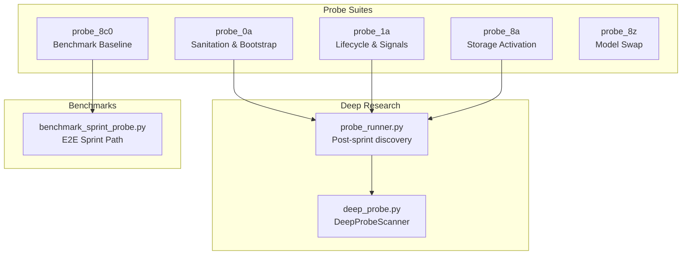
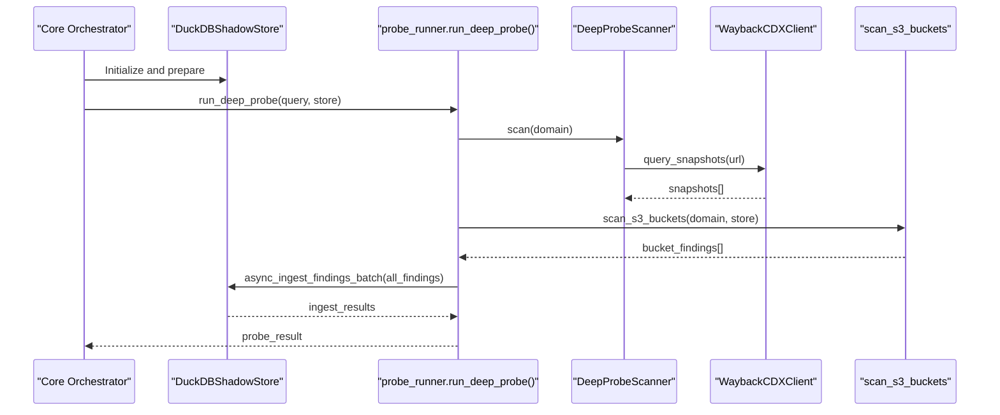
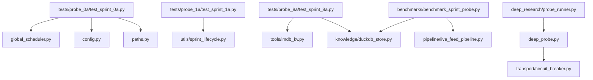

# Probe Testing System

<cite>
**Referenced Files in This Document**
- [deep_probe.py](file://deep_probe.py)
- [probe_runner.py](file://deep_research/probe_runner.py)
- [test_sprint_0a.py](file://tests/probe_0a/test_sprint_0a.py)
- [test_sprint_1a.py](file://tests/probe_1a/test_sprint_1a.py)
- [test_sprint_8a.py](file://tests/probe_8a/test_sprint_8a.py)
- [benchmark_sprint_probe.py](file://benchmarks/benchmark_sprint_probe.py)
- [apple_fm_probe.py](file://brain/apple_fm_probe.py)
- [test_apple_fm_probe.py](file://tests/probe_6b/test_apple_fm_probe.py)
- [test_model_swap_manager.py](file://tests/probe_8z/test_model_swap_manager.py)
- [test_bench_e2e_baseline.py](file://tests/probe_8c0/test_bench_e2e_baseline.py)
- [test_bench_hermes_mlx.py](file://tests/probe_8c0/test_bench_hermes_mlx.py)
- [test_bench_html_parse.py](file://tests/probe_8c0/test_bench_html_parse.py)
</cite>

## Table of Contents
1. [Introduction](#introduction)
2. [Project Structure](#project-structure)
3. [Core Components](#core-components)
4. [Architecture Overview](#architecture-overview)
5. [Detailed Component Analysis](#detailed-component-analysis)
6. [Dependency Analysis](#dependency-analysis)
7. [Performance Considerations](#performance-considerations)
8. [Troubleshooting Guide](#troubleshooting-guide)
9. [Conclusion](#conclusion)

## Introduction
This document describes the probe testing system used to validate and benchmark the research pipeline across sprints. It explains the probe architecture, categorization by sprint numbers, and specialized testing methodologies. It documents the probe naming convention (probe_0a through probe_8z series), their focus areas, and execution patterns. Concrete examples illustrate test scenarios, validation logic, and quality gates. The document also covers how probes validate performance, security, integration, and functionality, along with probe-specific configurations, data fixtures, and reporting mechanisms.

## Project Structure
The probe system is organized around:
- Probe test suites under tests/probe_<series>/, each named by sprint and letter (e.g., probe_0a, probe_1a, probe_8a, probe_8c0, probe_8z).
- Deep research probe runner that executes post-sprint discovery activities.
- Deep probe scanner implementing discovery strategies (Wayback, path prediction, S3 bucket scanning).
- Benchmarks and fixtures validating end-to-end performance and memory ceilings.

**Diagram sources**
- [probe_runner.py:1-302](file://deep_research/probe_runner.py#L1-L302)
- [deep_probe.py:1-800](file://deep_probe.py#L1-L800)
- [benchmark_sprint_probe.py:1-371](file://benchmarks/benchmark_sprint_probe.py#L1-L371)

**Section sources**
- [probe_runner.py:1-302](file://deep_research/probe_runner.py#L1-L302)
- [deep_probe.py:1-800](file://deep_probe.py#L1-L800)
- [benchmark_sprint_probe.py:1-371](file://benchmarks/benchmark_sprint_probe.py#L1-L371)

## Core Components
- Probe test suites: Each suite validates specific aspects of the system aligned with a sprint goal. Examples include bootstrap correctness, lifecycle transitions, and storage activation.
- Deep research probe runner: Executes post-sprint discovery (Wayback, S3 buckets, IPFS) with bounded timeouts and fail-safe patterns.
- DeepProbeScanner: Implements discovery strategies (path prediction, dorking, Wayback integration) and S3 bucket scanning with concurrency controls and circuit breakers.
- Benchmarks: Validate end-to-end performance, memory ceilings, and branch mixes for the canonical sprint path.

**Section sources**
- [test_sprint_0a.py:1-343](file://tests/probe_0a/test_sprint_0a.py#L1-L343)
- [test_sprint_1a.py:1-361](file://tests/probe_1a/test_sprint_1a.py#L1-L361)
- [test_sprint_8a.py:1-606](file://tests/probe_8a/test_sprint_8a.py#L1-L606)
- [probe_runner.py:1-302](file://deep_research/probe_runner.py#L1-L302)
- [deep_probe.py:1-800](file://deep_probe.py#L1-L800)
- [benchmark_sprint_probe.py:1-371](file://benchmarks/benchmark_sprint_probe.py#L1-L371)

## Architecture Overview
The probe architecture integrates tightly with the sprint lifecycle:
- Pre-sprint: probe_0a and probe_1a validate bootstrap, environment, and lifecycle behavior.
- During sprint: canonical pipelines run (feed, public, CT log).
- Post-sprint: probe_runner executes deep research (Wayback, S3, IPFS) as fire-and-forget work that does not block export.
- Validation: probe_8a ensures storage activation and persistence correctness; probe_8c0 benchmarks baseline performance; probe_8z validates model swap behavior.

**Diagram sources**
- [probe_runner.py:51-196](file://deep_research/probe_runner.py#L51-L196)
- [deep_probe.py:545-729](file://deep_probe.py#L545-L729)

## Detailed Component Analysis

### Probe Naming Convention and Categories
- probe_0a: Bootstrap and sanitation (paths, tempdirs, LMDB locks, scheduler registries, mlock fail-open, signal handlers).
- probe_1a: Sprint lifecycle, timers, wind-down triggers, signal registration, background tasks, checkpoint seam, and singleton behavior.
- probe_8a: Storage activation contract, LMDB/DuckDB persistence order, batch ingestion, partial failure guarantees, and performance thresholds.
- probe_8c0: Benchmark baseline and event-loop stability for end-to-end pipelines.
- probe_8z: Model swap manager behavior and related validations.

These names map to sprint goals and validation themes. The series extends through probe_8z, indicating progression across functional domains.

**Section sources**
- [test_sprint_0a.py:1-343](file://tests/probe_0a/test_sprint_0a.py#L1-L343)
- [test_sprint_1a.py:1-361](file://tests/probe_1a/test_sprint_1a.py#L1-L361)
- [test_sprint_8a.py:1-606](file://tests/probe_8a/test_sprint_8a.py#L1-L606)
- [test_bench_e2e_baseline.py](file://tests/probe_8c0/test_bench_e2e_baseline.py)
- [test_bench_hermes_mlx.py](file://tests/probe_8c0/test_bench_hermes_mlx.py)
- [test_bench_html_parse.py](file://tests/probe_8c0/test_bench_html_parse.py)
- [test_model_swap_manager.py](file://tests/probe_8z/test_model_swap_manager.py)

### Probe 0A: Bootstrap and Sanitation
Focus: Environment bootstrap, temp directory wiring, LMDB cleanup, scheduler bounded registries, mlock fail-open, signal handler registration, and background task lifecycle.

Key validations:
- paths.py SSOT wiring sets tempfile.tempdir to RAMDISK or fallback.
- LMDB max size environment variable defaults and parsing.
- Stale LMDB lock and socket cleanup.
- Scheduler registries bounded via OrderedDict with FIFO eviction.
- mlock helper returns boolean and avoids Python str buffers.
- Signal handlers can be registered without crashing.
- Background tasks use add_done_callback for automatic cleanup.
- Import-time remains non-blocking.

Execution pattern:
- Uses pytest fixtures and mocks to isolate environment and confirm invariants.

Quality gates:
- No exceptions on repeated cleanup calls.
- Import time under threshold.
- Scheduler registry sizes bounded.

**Section sources**
- [test_sprint_0a.py:32-343](file://tests/probe_0a/test_sprint_0a.py#L32-L343)

### Probe 1A: Lifecycle, Signals, and Checkpoint Seam
Focus: SprintLifecycleManager state transitions, timers, wind-down triggers, signal registration, background task tracking, checkpoint seam, and singleton behavior.

Key validations:
- State machine transitions from BOOT → WARMUP → ACTIVE → WINDUP → EXPORT/TEARDOWN.
- Remaining time decreases monotonically; environment-driven durations honored.
- Wind-down monitor idempotence and hooks firing.
- Signal handlers registration idempotent; shutdown requested flag managed.
- Background tasks tracked and discarded automatically; exceptions logged.
- Checkpoint seam prepared and loadable; singleton pattern enforced.

Execution pattern:
- Uses AsyncMock and manual state manipulation to exercise lifecycle transitions and hooks.

Quality gates:
- Idempotent operations do not raise.
- State transitions are monotonic and constrained.
- Checkpoint restoration yields expected state.

**Section sources**
- [test_sprint_1a.py:35-361](file://tests/probe_1a/test_sprint_1a.py#L35-L361)

### Probe 8A: Storage Activation and Persistence
Focus: DuckDB/LMDB activation order, batch ingestion, partial failure guarantees, connection patterns, and performance thresholds.

Key validations:
- AO canary existence and execution.
- Storage contract schema documented and present.
- Activation helper attempts LMDB first, then DuckDB.
- LMDB batch writes/read-back for N=1, N=10, N=50.
- DuckDB bulk inserts via fresh connections; read-back verified.
- Partial failure: LMDB persists even when DuckDB fails.
- Persistent connection pattern used for run records.
- Close/reopen does not leave LMDB locked.
- RAG engine priority patch present.
- Batch activation N=50 performance under 200ms threshold (reported, not gated).
- LMDB key format standardized.

Execution pattern:
- Isolated temporary directories per test; DuckDBShadowStore and LMDBKVStore created per test.
- Fresh DuckDB connections used for read-back verification.

Quality gates:
- Data integrity across LMDB and DuckDB.
- Partial failure resilience.
- Connection reuse and lock release safety.
- Performance targets met (timing reported).

**Section sources**
- [test_sprint_8a.py:119-606](file://tests/probe_8a/test_sprint_8a.py#L119-L606)

### Deep Research Probe Runner and DeepProbeScanner
Focus: Post-sprint discovery using Wayback, S3 bucket scanning, and IPFS search with bounded runtime and fail-safe behavior.

Key validations:
- Discovery uses bounded constants (timeout, depth, bucket scan cap).
- All findings use source_type="deep_probe".
- External calls are fail-safe; exceptions logged and not propagated.
- Findings persisted via async_ingest_findings_batch().
- DHT findings are ephemeral; only bucket/IPFS findings persist.

Execution pattern:
- Concurrent tasks race against a timeout using asyncio.gather.
- Domain extraction from query; fallback to generic scan if no domain found.
- CanonicalFinding normalization for persistence.

Quality gates:
- Export completes before probe starts (non-blocking).
- All methods fail-safe.
- Ingestion via canonical path.

**Section sources**
- [probe_runner.py:51-196](file://deep_research/probe_runner.py#L51-L196)
- [deep_probe.py:545-729](file://deep_probe.py#L545-L729)

### Benchmark Suite (probe_8c0)
Focus: End-to-end sprint path benchmark measuring first-finding latency, memory ceiling, branch mix, and total findings.

Key validations:
- Hermetic adapters patched to guarantee deterministic entries.
- Memory ceiling enforced for M1 8GB (6.5 GB RSS).
- Branch mix computed across feed, public, and CT log pipelines.
- Primary signal source determined from persisted findings.

Execution pattern:
- Temporary DuckDB store; baseline RSS and UMA sampled.
- Live feed pipeline executed with controlled inputs.
- Results saved to JSON with metadata and performance metrics.

Quality gates:
- Memory ceiling not exceeded.
- Swap detection avoided.
- Pipeline stages produce expected findings.

**Section sources**
- [benchmark_sprint_probe.py:170-344](file://benchmarks/benchmark_sprint_probe.py#L170-L344)

### Specialized Probes
- Apple FM Probe: Validates Apple FM model behavior and related pathways.
- Model Swap Manager Probe: Ensures model swap manager operates correctly.

Execution pattern:
- Dedicated test files under probe_6b and probe_8z respectively.

Quality gates:
- Model behavior validated via targeted assertions.
- Swap manager maintains consistency and availability.

**Section sources**
- [apple_fm_probe.py](file://brain/apple_fm_probe.py)
- [test_apple_fm_probe.py](file://tests/probe_6b/test_apple_fm_probe.py)
- [test_model_swap_manager.py](file://tests/probe_8z/test_model_swap_manager.py)

## Dependency Analysis
The probe system exhibits layered dependencies:
- Probe tests depend on core modules (paths, config, orchestrator, knowledge store).
- Deep research probe runner depends on DeepProbeScanner and DuckDBShadowStore.
- DeepProbeScanner depends on transport circuit breaker and async HTTP clients.
- Benchmarks depend on pipeline modules and resource governor.

**Diagram sources**
- [test_sprint_0a.py:1-343](file://tests/probe_0a/test_sprint_0a.py#L1-L343)
- [test_sprint_1a.py:1-361](file://tests/probe_1a/test_sprint_1a.py#L1-L361)
- [test_sprint_8a.py:1-606](file://tests/probe_8a/test_sprint_8a.py#L1-L606)
- [probe_runner.py:1-302](file://deep_research/probe_runner.py#L1-L302)
- [deep_probe.py:1-800](file://deep_probe.py#L1-L800)
- [benchmark_sprint_probe.py:1-371](file://benchmarks/benchmark_sprint_probe.py#L1-L371)

**Section sources**
- [test_sprint_0a.py:1-343](file://tests/probe_0a/test_sprint_0a.py#L1-L343)
- [test_sprint_1a.py:1-361](file://tests/probe_1a/test_sprint_1a.py#L1-L361)
- [test_sprint_8a.py:1-606](file://tests/probe_8a/test_sprint_8a.py#L1-L606)
- [probe_runner.py:1-302](file://deep_research/probe_runner.py#L1-L302)
- [deep_probe.py:1-800](file://deep_probe.py#L1-L800)
- [benchmark_sprint_probe.py:1-371](file://benchmarks/benchmark_sprint_probe.py#L1-L371)

## Performance Considerations
- Concurrency and timeouts: Deep research probe runner uses bounded constants and races tasks against a timeout to prevent blocking.
- Memory ceilings: Benchmarks enforce M1 8GB RSS ceilings and detect swap usage to avoid regressions.
- Batch performance: Probe 8A reports batch activation timing thresholds; failures are flagged for review.
- Event loop stability: Probe 8c0 benchmarks validate event loop behavior and HTML parsing throughput.

Recommendations:
- Keep probe runtime bounded; leverage fail-safe patterns.
- Monitor RSS and swap; adjust concurrency and limits accordingly.
- Use fresh connections for read-back verification to avoid cache inconsistencies.

[No sources needed since this section provides general guidance]

## Troubleshooting Guide
Common issues and resolutions:
- Storage initialization failures: Verify LMDB and DuckDB paths; ensure close/reopen sequences release locks.
- DuckDB ingestion errors: Confirm canonical path usage and fresh connection reads for verification.
- Deep probe timeouts: Reduce depth or increase timeout for complex domains; validate circuit breaker behavior.
- Memory pressure: Enforce memory ceilings; avoid large buffers; use bounded registries and semaphores.

Validation utilities:
- Use probe_8a’s fresh connection read-back to verify persistence.
- Employ probe_8c0’s hermetic adapters to reproduce deterministic conditions.
- Inspect probe_runner logs for fail-safe exceptions and error lists.

**Section sources**
- [test_sprint_8a.py:377-491](file://tests/probe_8a/test_sprint_8a.py#L377-L491)
- [probe_runner.py:169-196](file://deep_research/probe_runner.py#L169-L196)
- [benchmark_sprint_probe.py:329-335](file://benchmarks/benchmark_sprint_probe.py#L329-L335)

## Conclusion
The probe testing system provides a structured, sprint-aligned validation framework covering bootstrap correctness, lifecycle behavior, storage activation, deep research discovery, and end-to-end performance. The naming convention (probe_0a through probe_8z) reflects functional progression and quality gates. Specialized probes ensure robustness across performance, security, integration, and functionality, with concrete examples and quality gates guiding continuous improvement.