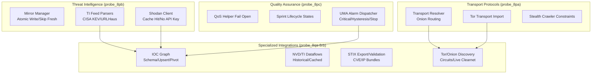
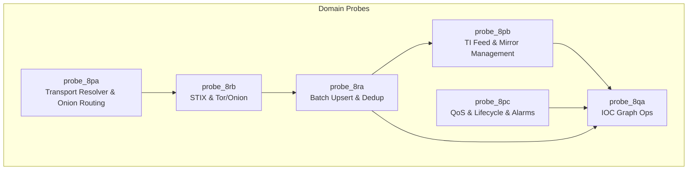
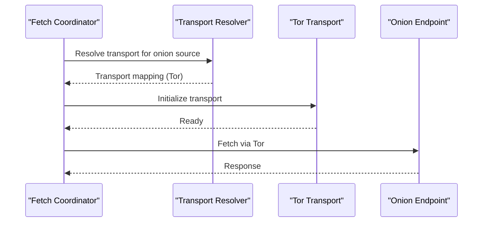
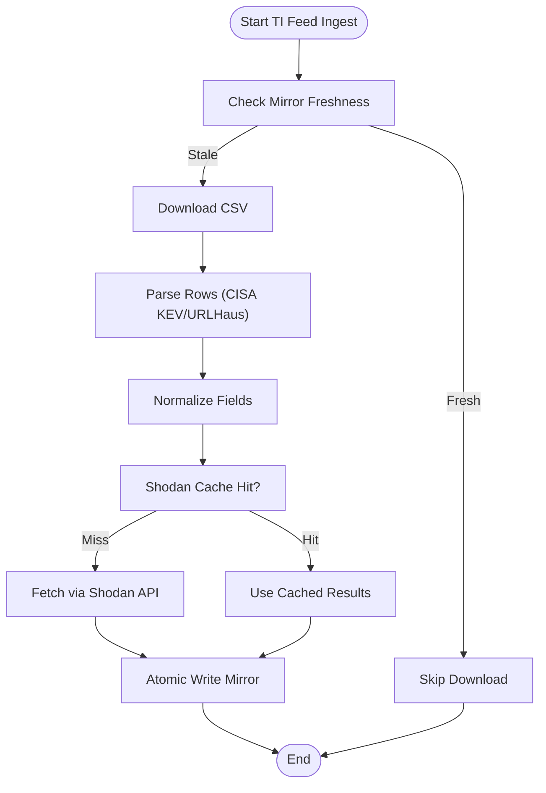
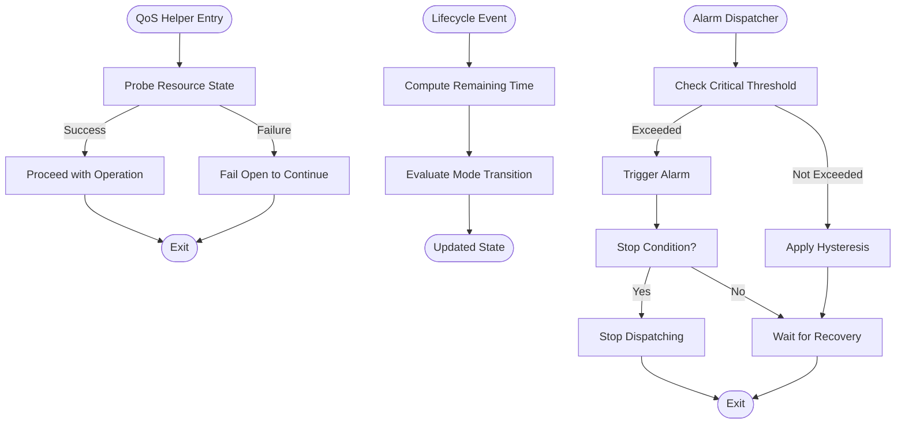
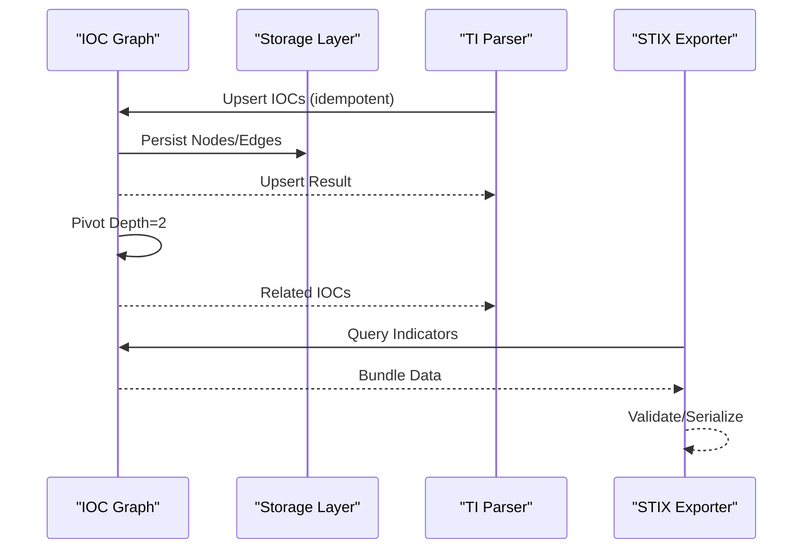
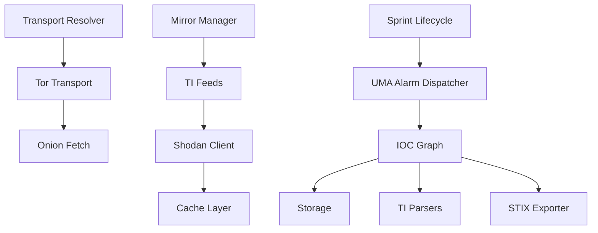

# Specialized Domain Probes

<cite>
**Referenced Files in This Document**
- [test_fetch_coordinator_rdns.py](file://tests/probe_8pa/test_fetch_coordinator_rdns.py)
- [test_source_transport_map_mandatory.py](file://tests/probe_8pa/test_source_transport_map_mandatory.py)
- [test_stealth_crawler_no_bare_requests.py](file://tests/probe_8pa/test_stealth_crawler_no_bare_requests.py)
- [test_tor_transport_graceful_import.py](file://tests/probe_8pa/test_tor_transport_graceful_import.py)
- [test_transport_resolver_onion_routing.py](file://tests/probe_8pa/test_transport_resolver_onion_routing.py)
- [test_mirror_manager_atomic_write.py](file://tests/probe_8pb/test_mirror_manager_atomic_write.py)
- [test_mirror_manager_skip_fresh.py](file://tests/probe_8pb/test_mirror_manager_skip_fresh.py)
- [test_parse_cisa_kev.py](file://tests/probe_8pb/test_parse_cisa_kev.py)
- [test_parse_urlhaus_csv.py](file://tests/probe_8pb/test_parse_urlhaus_csv.py)
- [test_shodan_client_cache_hit.py](file://tests/probe_8pb/test_shodan_client_cache_hit.py)
- [test_shodan_client_no_api_key.py](file://tests/probe_8pb/test_shodan_client_no_api_key.py)
- [test_ti_feed_mirror_priority.py](file://tests/probe_8pb/test_ti_feed_mirror_priority.py)
- [test_qos_helper_fail_open.py](file://tests/probe_8pc/test_qos_helper_fail_open.py)
- [test_sprint_lifecycle_remaining_time.py](file://tests/probe_8pc/test_sprint_lifecycle_remaining_time.py)
- [test_sprint_mode_lifecycle_states.py](file://tests/probe_8pc/test_sprint_mode_lifecycle_states.py)
- [test_uma_alarm_dispatcher_critical.py](file://tests/probe_8pc/test_uma_alarm_dispatcher_critical.py)
- [test_uma_alarm_dispatcher_hysteresis.py](file://tests/probe_8pc/test_uma_alarm_dispatcher_hysteresis.py)
- [test_uma_alarm_dispatcher_stop.py](file://tests/probe_8pc/test_uma_alarm_dispatcher_stop.py)
- [test_ioc_graph_fail_open.py](file://tests/probe_8qa/test_ioc_graph_fail_open.py)
- [test_ioc_graph_observed_temporal.py](file://tests/probe_8qa/test_ioc_graph_observed_temporal.py)
- [test_ioc_graph_pivot_depth2.py](file://tests/probe_8qa/test_ioc_graph_pivot_depth2.py)
- [test_ioc_graph_schema_init.py](file://tests/probe_8qa/test_ioc_graph_schema_init.py)
- [test_ioc_graph_upsert_idempotent.py](file://tests/probe_8qa/test_ioc_graph_upsert_idempotent.py)
- [test_ioc_graph_upsert_updates_last_seen.py](file://tests/probe_8qa/test_ioc_graph_upsert_updates_last_seen.py)
- [test_batch_upsert.py](file://tests/probe_8ra/test_batch_upsert.py)
- [test_batch_vs_single.py](file://tests/probe_8ra/test_batch_vs_single.py)
- [test_dedup_cross_sprint.py](file://tests/probe_8ra/test_dedup_cross_sprint.py)
- [test_dedup_lmdb_persist.py](file://tests/probe_8ra/test_dedup_lmdb_persist.py)
- [test_nvd_historical_cached.py](file://tests/probe_8ra/test_nvd_historical_cached.py)
- [test_nvd_size_gate.py](file://tests/probe_8ra/test_nvd_size_gate.py)
- [test_sprint_delta_written.py](file://tests/probe_8ra/test_sprint_delta_written.py)
- [test_threatfox_parse.py](file://tests/probe_8ra/test_threatfox_parse.py)
- [test_threatfox_stale_fallback.py](file://tests/probe_8ra/test_threatfox_stale_fallback.py)
- [test_uma_wiring.py](file://tests/probe_8ra/test_uma_wiring.py)
- [test_ahmia_discovery_mock.py](file://tests/probe_8rb/test_ahmia_discovery_mock.py)
- [test_onion_abort_without_tor.py](file://tests/probe_8rb/test_onion_abort_without_tor.py)
- [test_onion_seed_manager_curated_first.py](file://tests/probe_8rb/test_onion_seed_manager_curated_first.py)
- [test_onion_seed_manager_load_save.py](file://tests/probe_8rb/test_onion_seed_manager_load_save.py)
- [test_stix_bundle_validates.py](file://tests/probe_8rb/test_stix_bundle_validates.py)
- [test_stix_empty_graph.py](file://tests/probe_8rb/test_stix_empty_graph.py)
- [test_stix_export_cve.py](file://tests/probe_8rb/test_stix_export_cve.py)
- [test_stix_export_ip.py](file://tests/probe_8rb/test_stix_export_ip.py)
- [test_tor_circuit_established_mock.py](file://tests/probe_8rb/test_tor_circuit_established_mock.py)
- [test_tor_circuit_not_established.py](file://tests/probe_8rb/test_tor_circuit_not_established.py)
- [test_tor_live_clearnet.py](file://tests/probe_8rb/test_tor_live_clearnet.py)
</cite>

## Table of Contents
1. [Introduction](#introduction)
2. [Project Structure](#project-structure)
3. [Core Components](#core-components)
4. [Architecture Overview](#architecture-overview)
5. [Detailed Component Analysis](#detailed-component-analysis)
6. [Dependency Analysis](#dependency-analysis)
7. [Performance Considerations](#performance-considerations)
8. [Troubleshooting Guide](#troubleshooting-guide)
9. [Conclusion](#conclusion)

## Introduction
This document presents specialized domain probe validation for targeted categories:
- Transport protocols (probe_8pa): Validates transport resolver behavior, Tor routing, and stealth crawler constraints.
- Threat Intelligence (probe_8pb): Validates TI feed ingestion, mirror management, parsers, and client caching.
- Quality Assurance (probe_8pc): Validates QoS helpers, lifecycle states, and UMA alarm dispatcher behavior.
- Specialized Integrations (probe_8qa through probe_8rb): Validates IOC graph operations, NVD/TI data flows, STIX export, and Tor/Onion ecosystem wiring.

Each domain probe group defines focused validation scenarios grounded in concrete tests that exercise real domain logic, data handling, and integration patterns with external systems.

## Project Structure
Probe validations are organized by sprint and domain:
- probe_8pa: Transport resolver, Tor transport, stealth crawler, and DNS resolution behavior.
- probe_8pb: TI feed ingestion, mirror manager, parsers, and client caching.
- probe_8pc: QoS, lifecycle, and alarm dispatcher behaviors.
- probe_8qa: IOC graph schema, upserts, pivoting, and temporal observation.
- probe_8ra: Batch upserts, deduplication, NVD historical caching, and UMA wiring.
- probe_8rb: STIX export/validation and Tor/Onion discovery/circuits.

[No sources needed since this diagram shows conceptual workflow, not actual code structure]

## Core Components
This section outlines the validated components and their roles across domains.

- Transport Resolver and Onion Routing
  - Ensures transport resolver honors source-to-transport mappings and resolves onion routes correctly.
  - Validates graceful import behavior for Tor transport and absence of bare requests in stealth mode.

- TI Feed Validation
  - Mirror manager atomic writes and freshness skipping.
  - Feed parsers for structured CSV feeds (e.g., CISA KEV, URLHaus).
  - Shodan client cache hit behavior and fallback when API key is absent.

- Alarm Dispatcher and Lifecycle
  - QoS helper fail-open behavior.
  - Sprint lifecycle remaining time and mode transitions.
  - UMA alarm dispatcher critical thresholds, hysteresis, and stop conditions.

- IOC Graph Operations
  - Schema initialization and idempotent upserts.
  - Upsert updates last seen timestamps.
  - Temporal observation and pivot depth traversal.

- NVD/TI Dataflows and Deduplication
  - Batch vs single upsert performance and correctness.
  - Cross-sprint deduplication and LMDB persistence.
  - Historical caching and size gating for NVD feeds.

- STIX Export and Tor/Onion Wiring
  - STIX bundle validation and empty graph handling.
  - STIX export for CVE/IP indicators.
  - Tor circuit establishment and discovery without Tor.

**Section sources**
- [test_transport_resolver_onion_routing.py](file://tests/probe_8pa/test_transport_resolver_onion_routing.py)
- [test_tor_transport_graceful_import.py](file://tests/probe_8pa/test_tor_transport_graceful_import.py)
- [test_stealth_crawler_no_bare_requests.py](file://tests/probe_8pa/test_stealth_crawler_no_bare_requests.py)
- [test_source_transport_map_mandatory.py](file://tests/probe_8pa/test_source_transport_map_mandatory.py)
- [test_fetch_coordinator_rdns.py](file://tests/probe_8pa/test_fetch_coordinator_rdns.py)
- [test_mirror_manager_atomic_write.py](file://tests/probe_8pb/test_mirror_manager_atomic_write.py)
- [test_mirror_manager_skip_fresh.py](file://tests/probe_8pb/test_mirror_manager_skip_fresh.py)
- [test_parse_cisa_kev.py](file://tests/probe_8pb/test_parse_cisa_kev.py)
- [test_parse_urlhaus_csv.py](file://tests/probe_8pb/test_parse_urlhaus_csv.py)
- [test_shodan_client_cache_hit.py](file://tests/probe_8pb/test_shodan_client_cache_hit.py)
- [test_shodan_client_no_api_key.py](file://tests/probe_8pb/test_shodan_client_no_api_key.py)
- [test_ti_feed_mirror_priority.py](file://tests/probe_8pb/test_ti_feed_mirror_priority.py)
- [test_qos_helper_fail_open.py](file://tests/probe_8pc/test_qos_helper_fail_open.py)
- [test_sprint_lifecycle_remaining_time.py](file://tests/probe_8pc/test_sprint_lifecycle_remaining_time.py)
- [test_sprint_mode_lifecycle_states.py](file://tests/probe_8pc/test_sprint_mode_lifecycle_states.py)
- [test_uma_alarm_dispatcher_critical.py](file://tests/probe_8pc/test_uma_alarm_dispatcher_critical.py)
- [test_uma_alarm_dispatcher_hysteresis.py](file://tests/probe_8pc/test_uma_alarm_dispatcher_hysteresis.py)
- [test_uma_alarm_dispatcher_stop.py](file://tests/probe_8pc/test_uma_alarm_dispatcher_stop.py)
- [test_ioc_graph_fail_open.py](file://tests/probe_8qa/test_ioc_graph_fail_open.py)
- [test_ioc_graph_observed_temporal.py](file://tests/probe_8qa/test_ioc_graph_observed_temporal.py)
- [test_ioc_graph_pivot_depth2.py](file://tests/probe_8qa/test_ioc_graph_pivot_depth2.py)
- [test_ioc_graph_schema_init.py](file://tests/probe_8qa/test_ioc_graph_schema_init.py)
- [test_ioc_graph_upsert_idempotent.py](file://tests/probe_8qa/test_ioc_graph_upsert_idempotent.py)
- [test_ioc_graph_upsert_updates_last_seen.py](file://tests/probe_8qa/test_ioc_graph_upsert_updates_last_seen.py)
- [test_batch_upsert.py](file://tests/probe_8ra/test_batch_upsert.py)
- [test_batch_vs_single.py](file://tests/probe_8ra/test_batch_vs_single.py)
- [test_dedup_cross_sprint.py](file://tests/probe_8ra/test_dedup_cross_sprint.py)
- [test_dedup_lmdb_persist.py](file://tests/probe_8ra/test_dedup_lmdb_persist.py)
- [test_nvd_historical_cached.py](file://tests/probe_8ra/test_nvd_historical_cached.py)
- [test_nvd_size_gate.py](file://tests/probe_8ra/test_nvd_size_gate.py)
- [test_sprint_delta_written.py](file://tests/probe_8ra/test_sprint_delta_written.py)
- [test_threatfox_parse.py](file://tests/probe_8ra/test_threatfox_parse.py)
- [test_threatfox_stale_fallback.py](file://tests/probe_8ra/test_threatfox_stale_fallback.py)
- [test_uma_wiring.py](file://tests/probe_8ra/test_uma_wiring.py)
- [test_stix_bundle_validates.py](file://tests/probe_8rb/test_stix_bundle_validates.py)
- [test_stix_empty_graph.py](file://tests/probe_8rb/test_stix_empty_graph.py)
- [test_stix_export_cve.py](file://tests/probe_8rb/test_stix_export_cve.py)
- [test_stix_export_ip.py](file://tests/probe_8rb/test_stix_export_ip.py)
- [test_tor_circuit_established_mock.py](file://tests/probe_8rb/test_tor_circuit_established_mock.py)
- [test_tor_circuit_not_established.py](file://tests/probe_8rb/test_tor_circuit_not_established.py)
- [test_tor_live_clearnet.py](file://tests/probe_8rb/test_tor_live_clearnet.py)
- [test_ahmia_discovery_mock.py](file://tests/probe_8rb/test_ahmia_discovery_mock.py)
- [test_onion_abort_without_tor.py](file://tests/probe_8rb/test_onion_abort_without_tor.py)
- [test_onion_seed_manager_curated_first.py](file://tests/probe_8rb/test_onion_seed_manager_curated_first.py)
- [test_onion_seed_manager_load_save.py](file://tests/probe_8rb/test_onion_seed_manager_load_save.py)

## Architecture Overview
The specialized domain probes validate end-to-end flows across transport, TI ingestion, lifecycle, alarms, IOC graphs, NVD/TI dataflows, and STIX export. The following diagram maps probe categories to their primary concerns and integration touchpoints.

[No sources needed since this diagram shows conceptual workflow, not actual code structure]

## Detailed Component Analysis

### Transport Protocols (probe_8pa)
Focus areas:
- Transport resolver behavior and mandatory source-to-transport mapping.
- Onion routing resolution via transport resolver.
- Graceful import of Tor transport and enforcement of stealth crawler constraints.

Key validation scenarios:
- Transport resolver honors source-to-transport mapping and resolves onion routes.
- Tor transport import does not crash and integrates cleanly.
- Stealth crawler avoids issuing bare requests outside stealth constraints.

Concrete examples from tests:
- Transport resolver onion routing validation ensures proper route selection for onion sources.
- Tor transport graceful import prevents runtime failures when optional transports are unavailable.
- Stealth crawler constraints prevent direct HTTP requests when stealth mode requires proxying.

**Diagram sources**
- [test_transport_resolver_onion_routing.py](file://tests/probe_8pa/test_transport_resolver_onion_routing.py)
- [test_tor_transport_graceful_import.py](file://tests/probe_8pa/test_tor_transport_graceful_import.py)
- [test_stealth_crawler_no_bare_requests.py](file://tests/probe_8pa/test_stealth_crawler_no_bare_requests.py)

**Section sources**
- [test_transport_resolver_onion_routing.py](file://tests/probe_8pa/test_transport_resolver_onion_routing.py)
- [test_tor_transport_graceful_import.py](file://tests/probe_8pa/test_tor_transport_graceful_import.py)
- [test_stealth_crawler_no_bare_requests.py](file://tests/probe_8pa/test_stealth_crawler_no_bare_requests.py)
- [test_source_transport_map_mandatory.py](file://tests/probe_8pa/test_source_transport_map_mandatory.py)
- [test_fetch_coordinator_rdns.py](file://tests/probe_8pa/test_fetch_coordinator_rdns.py)

### Threat Intelligence (probe_8pb)
Focus areas:
- Mirror manager atomic writes and skipping fresh entries.
- TI feed parsers for structured CSV feeds (CISA KEV, URLHaus).
- Shodan client cache hit behavior and fallback when API key is absent.
- TI feed mirror priority handling.

Key validation scenarios:
- Atomic write ensures integrity during mirror updates.
- Skip-fresh logic avoids redundant downloads for recent mirrors.
- Parsers correctly ingest and normalize feed rows.
- Shodan client respects cache hits and gracefully handles missing API keys.
- Mirror priority determines which source is preferred.

**Diagram sources**
- [test_mirror_manager_atomic_write.py](file://tests/probe_8pb/test_mirror_manager_atomic_write.py)
- [test_mirror_manager_skip_fresh.py](file://tests/probe_8pb/test_mirror_manager_skip_fresh.py)
- [test_parse_cisa_kev.py](file://tests/probe_8pb/test_parse_cisa_kev.py)
- [test_parse_urlhaus_csv.py](file://tests/probe_8pb/test_parse_urlhaus_csv.py)
- [test_shodan_client_cache_hit.py](file://tests/probe_8pb/test_shodan_client_cache_hit.py)
- [test_shodan_client_no_api_key.py](file://tests/probe_8pb/test_shodan_client_no_api_key.py)
- [test_ti_feed_mirror_priority.py](file://tests/probe_8pb/test_ti_feed_mirror_priority.py)

**Section sources**
- [test_mirror_manager_atomic_write.py](file://tests/probe_8pb/test_mirror_manager_atomic_write.py)
- [test_mirror_manager_skip_fresh.py](file://tests/probe_8pb/test_mirror_manager_skip_fresh.py)
- [test_parse_cisa_kev.py](file://tests/probe_8pb/test_parse_cisa_kev.py)
- [test_parse_urlhaus_csv.py](file://tests/probe_8pb/test_parse_urlhaus_csv.py)
- [test_shodan_client_cache_hit.py](file://tests/probe_8pb/test_shodan_client_cache_hit.py)
- [test_shodan_client_no_api_key.py](file://tests/probe_8pb/test_shodan_client_no_api_key.py)
- [test_ti_feed_mirror_priority.py](file://tests/probe_8pb/test_ti_feed_mirror_priority.py)

### Quality Assurance (probe_8pc)
Focus areas:
- QoS helper fail-open behavior to avoid blocking on transient failures.
- Sprint lifecycle remaining time and mode transitions.
- UMA alarm dispatcher critical thresholds, hysteresis, and stop conditions.

Key validation scenarios:
- QoS helper continues operation even when underlying resource checks fail.
- Remaining time and mode transitions are consistent across lifecycle events.
- Alarm dispatcher reacts to critical conditions with hysteresis and stops when appropriate.

**Diagram sources**
- [test_qos_helper_fail_open.py](file://tests/probe_8pc/test_qos_helper_fail_open.py)
- [test_sprint_lifecycle_remaining_time.py](file://tests/probe_8pc/test_sprint_lifecycle_remaining_time.py)
- [test_sprint_mode_lifecycle_states.py](file://tests/probe_8pc/test_sprint_mode_lifecycle_states.py)
- [test_uma_alarm_dispatcher_critical.py](file://tests/probe_8pc/test_uma_alarm_dispatcher_critical.py)
- [test_uma_alarm_dispatcher_hysteresis.py](file://tests/probe_8pc/test_uma_alarm_dispatcher_hysteresis.py)
- [test_uma_alarm_dispatcher_stop.py](file://tests/probe_8pc/test_uma_alarm_dispatcher_stop.py)

**Section sources**
- [test_qos_helper_fail_open.py](file://tests/probe_8pc/test_qos_helper_fail_open.py)
- [test_sprint_lifecycle_remaining_time.py](file://tests/probe_8pc/test_sprint_lifecycle_remaining_time.py)
- [test_sprint_mode_lifecycle_states.py](file://tests/probe_8pc/test_sprint_mode_lifecycle_states.py)
- [test_uma_alarm_dispatcher_critical.py](file://tests/probe_8pc/test_uma_alarm_dispatcher_critical.py)
- [test_uma_alarm_dispatcher_hysteresis.py](file://tests/probe_8pc/test_uma_alarm_dispatcher_hysteresis.py)
- [test_uma_alarm_dispatcher_stop.py](file://tests/probe_8pc/test_uma_alarm_dispatcher_stop.py)

### Specialized Integrations (probe_8qa through probe_8rb)
Focus areas:
- IOC graph schema initialization, idempotent upserts, and temporal observation.
- Batch vs single upsert performance and correctness.
- Cross-sprint deduplication and LMDB persistence.
- NVD historical caching and size gating.
- STIX export/validation for CVE/IP indicators.
- Tor/Onion discovery and circuit establishment.

Key validation scenarios:
- IOC graph schema initializes correctly and upserts are idempotent with updated last-seen timestamps.
- Pivot depth traversal yields expected neighbor relationships.
- Batch upsert maintains 1:1 mapping and preserves ordering.
- Cross-sprint deduplication persists across restarts.
- NVD historical caching reduces latency and size-gated feeds prevent oversized loads.
- STIX bundles validate and export supported indicator types.
- Tor circuits establish when available; discovery aborts without Tor.

**Diagram sources**
- [test_ioc_graph_fail_open.py](file://tests/probe_8qa/test_ioc_graph_fail_open.py)
- [test_ioc_graph_observed_temporal.py](file://tests/probe_8qa/test_ioc_graph_observed_temporal.py)
- [test_ioc_graph_pivot_depth2.py](file://tests/probe_8qa/test_ioc_graph_pivot_depth2.py)
- [test_ioc_graph_schema_init.py](file://tests/probe_8qa/test_ioc_graph_schema_init.py)
- [test_ioc_graph_upsert_idempotent.py](file://tests/probe_8qa/test_ioc_graph_upsert_idempotent.py)
- [test_ioc_graph_upsert_updates_last_seen.py](file://tests/probe_8qa/test_ioc_graph_upsert_updates_last_seen.py)
- [test_batch_upsert.py](file://tests/probe_8ra/test_batch_upsert.py)
- [test_batch_vs_single.py](file://tests/probe_8ra/test_batch_vs_single.py)
- [test_dedup_cross_sprint.py](file://tests/probe_8ra/test_dedup_cross_sprint.py)
- [test_dedup_lmdb_persist.py](file://tests/probe_8ra/test_dedup_lmdb_persist.py)
- [test_nvd_historical_cached.py](file://tests/probe_8ra/test_nvd_historical_cached.py)
- [test_nvd_size_gate.py](file://tests/probe_8ra/test_nvd_size_gate.py)
- [test_sprint_delta_written.py](file://tests/probe_8ra/test_sprint_delta_written.py)
- [test_threatfox_parse.py](file://tests/probe_8ra/test_threatfox_parse.py)
- [test_threatfox_stale_fallback.py](file://tests/probe_8ra/test_threatfox_stale_fallback.py)
- [test_uma_wiring.py](file://tests/probe_8ra/test_uma_wiring.py)
- [test_stix_bundle_validates.py](file://tests/probe_8rb/test_stix_bundle_validates.py)
- [test_stix_empty_graph.py](file://tests/probe_8rb/test_stix_empty_graph.py)
- [test_stix_export_cve.py](file://tests/probe_8rb/test_stix_export_cve.py)
- [test_stix_export_ip.py](file://tests/probe_8rb/test_stix_export_ip.py)
- [test_tor_circuit_established_mock.py](file://tests/probe_8rb/test_tor_circuit_established_mock.py)
- [test_tor_circuit_not_established.py](file://tests/probe_8rb/test_tor_circuit_not_established.py)
- [test_tor_live_clearnet.py](file://tests/probe_8rb/test_tor_live_clearnet.py)
- [test_ahmia_discovery_mock.py](file://tests/probe_8rb/test_ahmia_discovery_mock.py)
- [test_onion_abort_without_tor.py](file://tests/probe_8rb/test_onion_abort_without_tor.py)
- [test_onion_seed_manager_curated_first.py](file://tests/probe_8rb/test_onion_seed_manager_curated_first.py)
- [test_onion_seed_manager_load_save.py](file://tests/probe_8rb/test_onion_seed_manager_load_save.py)

**Section sources**
- [test_ioc_graph_fail_open.py](file://tests/probe_8qa/test_ioc_graph_fail_open.py)
- [test_ioc_graph_observed_temporal.py](file://tests/probe_8qa/test_ioc_graph_observed_temporal.py)
- [test_ioc_graph_pivot_depth2.py](file://tests/probe_8qa/test_ioc_graph_pivot_depth2.py)
- [test_ioc_graph_schema_init.py](file://tests/probe_8qa/test_ioc_graph_schema_init.py)
- [test_ioc_graph_upsert_idempotent.py](file://tests/probe_8qa/test_ioc_graph_upsert_idempotent.py)
- [test_ioc_graph_upsert_updates_last_seen.py](file://tests/probe_8qa/test_ioc_graph_upsert_updates_last_seen.py)
- [test_batch_upsert.py](file://tests/probe_8ra/test_batch_upsert.py)
- [test_batch_vs_single.py](file://tests/probe_8ra/test_batch_vs_single.py)
- [test_dedup_cross_sprint.py](file://tests/probe_8ra/test_dedup_cross_sprint.py)
- [test_dedup_lmdb_persist.py](file://tests/probe_8ra/test_dedup_lmdb_persist.py)
- [test_nvd_historical_cached.py](file://tests/probe_8ra/test_nvd_historical_cached.py)
- [test_nvd_size_gate.py](file://tests/probe_8ra/test_nvd_size_gate.py)
- [test_sprint_delta_written.py](file://tests/probe_8ra/test_sprint_delta_written.py)
- [test_threatfox_parse.py](file://tests/probe_8ra/test_threatfox_parse.py)
- [test_threatfox_stale_fallback.py](file://tests/probe_8ra/test_threatfox_stale_fallback.py)
- [test_uma_wiring.py](file://tests/probe_8ra/test_uma_wiring.py)
- [test_stix_bundle_validates.py](file://tests/probe_8rb/test_stix_bundle_validates.py)
- [test_stix_empty_graph.py](file://tests/probe_8rb/test_stix_empty_graph.py)
- [test_stix_export_cve.py](file://tests/probe_8rb/test_stix_export_cve.py)
- [test_stix_export_ip.py](file://tests/probe_8rb/test_stix_export_ip.py)
- [test_tor_circuit_established_mock.py](file://tests/probe_8rb/test_tor_circuit_established_mock.py)
- [test_tor_circuit_not_established.py](file://tests/probe_8rb/test_tor_circuit_not_established.py)
- [test_tor_live_clearnet.py](file://tests/probe_8rb/test_tor_live_clearnet.py)
- [test_ahmia_discovery_mock.py](file://tests/probe_8rb/test_ahmia_discovery_mock.py)
- [test_onion_abort_without_tor.py](file://tests/probe_8rb/test_onion_abort_without_tor.py)
- [test_onion_seed_manager_curated_first.py](file://tests/probe_8rb/test_onion_seed_manager_curated_first.py)
- [test_onion_seed_manager_load_save.py](file://tests/probe_8rb/test_onion_seed_manager_load_save.py)

## Dependency Analysis
The specialized domain probes depend on:
- Transport resolver and Tor transport for onion routing.
- TI feed ingestion and mirror management for parser and client validation.
- IOC graph storage and pivoting for specialized integration tests.
- STIX exporter for validation and serialization.
- UMA alarm dispatcher for lifecycle and QoS integration.

[No sources needed since this diagram shows conceptual workflow, not actual code structure]

## Performance Considerations
- Transport resolver and onion routing should minimize latency while ensuring robust fallbacks.
- TI feed ingestion benefits from atomic mirror writes and cache hits to reduce repeated downloads.
- IOC graph upserts should preserve ordering and leverage batch operations for throughput.
- STIX export should validate efficiently and serialize compact bundles.
- Alarm dispatcher must react quickly to critical thresholds with minimal overhead.

[No sources needed since this section provides general guidance]

## Troubleshooting Guide
Common issues and diagnostics:
- Transport resolver failures: Verify source-to-transport mapping and onion route availability.
- Tor transport import errors: Confirm optional transport availability and graceful fallback behavior.
- TI feed mirror conflicts: Ensure atomic write and freshness checks are functioning.
- Shodan client cache misses: Validate API key presence and fallback logic.
- IOC graph upsert anomalies: Check idempotency and last-seen updates.
- STIX export validation failures: Inspect bundle content and supported indicator types.
- UMA dispatcher false positives/negatives: Review critical thresholds and hysteresis settings.

**Section sources**
- [test_transport_resolver_onion_routing.py](file://tests/probe_8pa/test_transport_resolver_onion_routing.py)
- [test_tor_transport_graceful_import.py](file://tests/probe_8pa/test_tor_transport_graceful_import.py)
- [test_mirror_manager_atomic_write.py](file://tests/probe_8pb/test_mirror_manager_atomic_write.py)
- [test_mirror_manager_skip_fresh.py](file://tests/probe_8pb/test_mirror_manager_skip_fresh.py)
- [test_shodan_client_cache_hit.py](file://tests/probe_8pb/test_shodan_client_cache_hit.py)
- [test_shodan_client_no_api_key.py](file://tests/probe_8pb/test_shodan_client_no_api_key.py)
- [test_ioc_graph_fail_open.py](file://tests/probe_8qa/test_ioc_graph_fail_open.py)
- [test_ioc_graph_upsert_updates_last_seen.py](file://tests/probe_8qa/test_ioc_graph_upsert_updates_last_seen.py)
- [test_stix_bundle_validates.py](file://tests/probe_8rb/test_stix_bundle_validates.py)
- [test_uma_alarm_dispatcher_critical.py](file://tests/probe_8pc/test_uma_alarm_dispatcher_critical.py)
- [test_uma_alarm_dispatcher_hysteresis.py](file://tests/probe_8pc/test_uma_alarm_dispatcher_hysteresis.py)
- [test_uma_alarm_dispatcher_stop.py](file://tests/probe_8pc/test_uma_alarm_dispatcher_stop.py)

## Conclusion
The specialized domain probes systematically validate transport resolver behavior, TI feed ingestion and parsing, lifecycle and alarm dispatching, and specialized integrations across IOC graphs, NVD/TI dataflows, and STIX export. These validations ensure robustness, correctness, and performance across critical operational domains, with concrete test coverage for real-world scenarios and integration patterns.