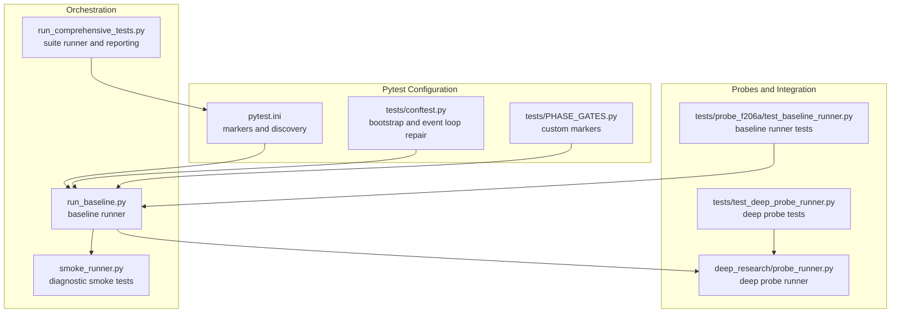
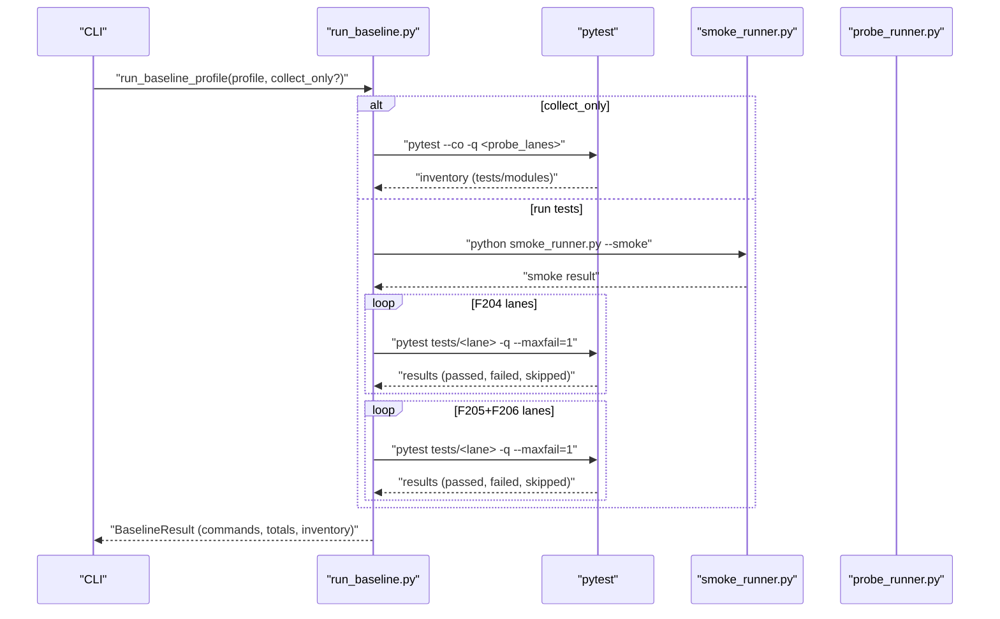
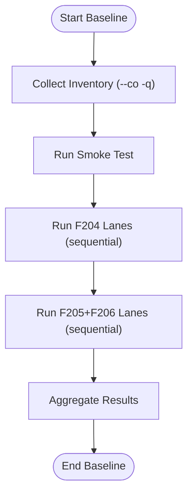
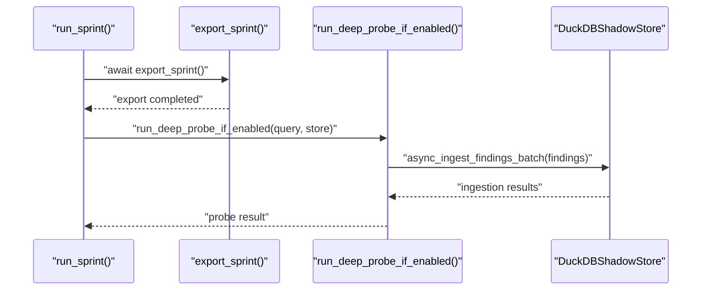
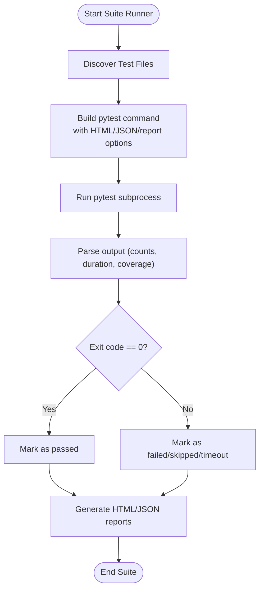
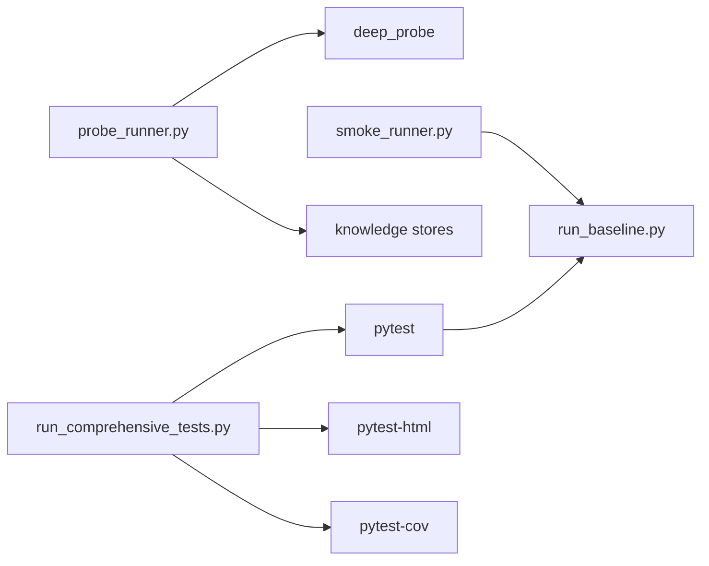

# Test Execution and Orchestration

<cite>
**Referenced Files in This Document**
- [pytest.ini](file://pytest.ini)
- [conftest.py](file://tests/conftest.py)
- [PHASE_GATES.py](file://tests/PHASE_GATES.py)
- [run_baseline.py](file://run_baseline.py)
- [smoke_runner.py](file://smoke_runner.py)
- [probe_runner.py](file://deep_research/probe_runner.py)
- [test_deep_probe_runner.py](file://tests/test_deep_probe_runner.py)
- [test_baseline_runner.py](file://tests/probe_f206a/test_baseline_runner.py)
- [run_comprehensive_tests.py](file://run_comprehensive_tests.py)
</cite>

## Table of Contents
1. [Introduction](#introduction)
2. [Project Structure](#project-structure)
3. [Core Components](#core-components)
4. [Architecture Overview](#architecture-overview)
5. [Detailed Component Analysis](#detailed-component-analysis)
6. [Dependency Analysis](#dependency-analysis)
7. [Performance Considerations](#performance-considerations)
8. [Troubleshooting Guide](#troubleshooting-guide)
9. [Conclusion](#conclusion)

## Introduction
This document explains the test execution and orchestration framework used to manage probe-based test suites and end-to-end validation in the project. It covers:
- Pytest configuration and test discovery
- Test runner orchestration for probe lanes and baseline profiles
- Batch execution patterns and result aggregation
- Parameterization strategies and lifecycle integration
- Parallel processing capabilities and comprehensive suite management
- Integration between individual probes and the unified testing infrastructure

The goal is to provide a practical guide for running, interpreting, and extending the test system, with concrete examples from the baseline runner, smoke tests, and deep probe runner.

## Project Structure
The testing system is organized around:
- Central pytest configuration and markers
- Global test configuration hooks
- Probe lane runners and baseline orchestration
- Deep probe post-sprint research integration
- Comprehensive suite runner with reporting and performance tracking

**Diagram sources**
- [pytest.ini:1-16](file://pytest.ini#L1-L16)
- [conftest.py:1-97](file://tests/conftest.py#L1-L97)
- [PHASE_GATES.py:1-39](file://tests/PHASE_GATES.py#L1-L39)
- [run_baseline.py:1-434](file://run_baseline.py#L1-L434)
- [smoke_runner.py:1-327](file://smoke_runner.py#L1-L327)
- [run_comprehensive_tests.py:1-879](file://run_comprehensive_tests.py#L1-L879)
- [probe_runner.py:1-302](file://deep_research/probe_runner.py#L1-L302)
- [test_deep_probe_runner.py:1-311](file://tests/test_deep_probe_runner.py#L1-L311)
- [test_baseline_runner.py:1-184](file://tests/probe_f206a/test_baseline_runner.py#L1-L184)

**Section sources**
- [pytest.ini:1-16](file://pytest.ini#L1-L16)
- [conftest.py:1-97](file://tests/conftest.py#L1-L97)
- [PHASE_GATES.py:1-39](file://tests/PHASE_GATES.py#L1-L39)
- [run_baseline.py:1-434](file://run_baseline.py#L1-L434)
- [smoke_runner.py:1-327](file://smoke_runner.py#L1-L327)
- [run_comprehensive_tests.py:1-879](file://run_comprehensive_tests.py#L1-L879)
- [probe_runner.py:1-302](file://deep_research/probe_runner.py#L1-L302)
- [test_deep_probe_runner.py:1-311](file://tests/test_deep_probe_runner.py#L1-L311)
- [test_baseline_runner.py:1-184](file://tests/probe_f206a/test_baseline_runner.py#L1-L184)

## Core Components
- Pytest configuration and markers define the taxonomy and selection criteria for tests across probe lanes and phases.
- Global conftest sets up environment variables and event loop repair to stabilize async tests.
- Baseline runner orchestrates probe lane collections and executions, with smoke tests and result aggregation.
- Deep probe runner integrates post-sprint research that does not block export.
- Comprehensive suite runner executes multiple suites with detailed reporting, memory monitoring, and performance benchmarks.

Key responsibilities:
- Discovery and selection: pytest.ini and PHASE_GATES.py register markers and enable selective execution.
- Bootstrap and stability: conftest enforces cache roots and repairs event loops.
- Orchestration: run_baseline coordinates inventory, smoke, and probe lane runs.
- Integration: probe_runner ensures non-blocking post-sprint research.
- Reporting: run_comprehensive_tests aggregates results, generates reports, and tracks memory/performance.

**Section sources**
- [pytest.ini:1-16](file://pytest.ini#L1-L16)
- [conftest.py:14-97](file://tests/conftest.py#L14-L97)
- [run_baseline.py:281-391](file://run_baseline.py#L281-L391)
- [probe_runner.py:51-196](file://deep_research/probe_runner.py#L51-L196)
- [run_comprehensive_tests.py:192-796](file://run_comprehensive_tests.py#L192-L796)

## Architecture Overview
The test execution lifecycle integrates discovery, orchestration, execution, and aggregation:

**Diagram sources**
- [run_baseline.py:281-391](file://run_baseline.py#L281-L391)
- [smoke_runner.py:293-327](file://smoke_runner.py#L293-L327)
- [pytest.ini:7-16](file://pytest.ini#L7-L16)

## Detailed Component Analysis

### Pytest Configuration and Test Discovery
- Markers: slow, stress, timeout, unit, integration, smoke, hermetic, probe define selectable categories across probe lanes.
- Discovery: pytest.ini sets no rootdir override; discovery uses project root.
- Custom markers: PHASE_GATES.py registers probe_gate, ao_canary, phase_gate, manual_only for layered execution.

Parameterization strategies:
- Use markers to select subsets: pytest -m "probe_gate or phase_gate"
- Exclude slow or stress tests: pytest -m "not slow"
- Target specific probe lanes: pytest tests/probe_f206a/ -v

**Section sources**
- [pytest.ini:1-16](file://pytest.ini#L1-L16)
- [PHASE_GATES.py:26-39](file://tests/PHASE_GATES.py#L26-L39)

### Global Test Configuration (Bootstrap and Stability)
- Cache root enforcement: conftest sets HLEDAC_CACHE_ROOT and related HF_* variables before any imports.
- Event loop repair: autouse fixture restores or creates a fresh event loop after each test to prevent issues from asyncio.run() closing the loop.

Best practices:
- Keep cache roots under a controlled runtime root to avoid polluting user home directories.
- Always restore the event loop after tests that use asyncio.run().

**Section sources**
- [conftest.py:14-57](file://tests/conftest.py#L14-L57)
- [conftest.py:68-97](file://tests/conftest.py#L68-L97)

### Baseline Runner Orchestration
Responsibilities:
- Inventory collection: runs pytest --co -q on probe lanes to enumerate tests and modules.
- Smoke test: executes smoke_runner.py --smoke to validate core imports and runtime conditions.
- Probe lane execution: runs lanes in two batches (F204 first, then F205+F206) with --maxfail=1 to stop quickly on failures.
- Result aggregation: collects return codes, counts, durations, and known failure patterns.

Execution patterns:
- Sequential per-lane execution with per-lane timeouts.
- Known failure patterns are tracked separately to avoid masking regressions.

**Diagram sources**
- [run_baseline.py:281-391](file://run_baseline.py#L281-L391)

**Section sources**
- [run_baseline.py:132-209](file://run_baseline.py#L132-L209)
- [run_baseline.py:212-241](file://run_baseline.py#L212-L241)
- [run_baseline.py:244-278](file://run_baseline.py#L244-L278)
- [run_baseline.py:281-391](file://run_baseline.py#L281-L391)

### Smoke Runner Diagnostics
Purpose:
- Lightweight smoke test validating core imports and runtime components without network.
- Optional profiling and memory tracking for diagnostics.

Lifecycle integration:
- Used as a pre-check before full test runs.
- Can be invoked standalone or integrated into orchestration.

**Section sources**
- [smoke_runner.py:59-150](file://smoke_runner.py#L59-L150)
- [smoke_runner.py:153-246](file://smoke_runner.py#L153-L246)
- [smoke_runner.py:249-290](file://smoke_runner.py#L249-L290)

### Deep Probe Runner Integration
Post-sprint research:
- Non-blocking: runs after export_sprint completes.
- Fail-safe: wraps external calls and persists findings via canonical ingestion.
- Bounded: enforces timeouts and depth limits.

**Diagram sources**
- [probe_runner.py:51-196](file://deep_research/probe_runner.py#L51-L196)
- [test_deep_probe_runner.py:204-266](file://tests/test_deep_probe_runner.py#L204-L266)

**Section sources**
- [probe_runner.py:51-196](file://deep_research/probe_runner.py#L51-L196)
- [test_deep_probe_runner.py:25-48](file://tests/test_deep_probe_runner.py#L25-L48)
- [test_deep_probe_runner.py:204-266](file://tests/test_deep_probe_runner.py#L204-L266)

### Comprehensive Suite Runner and Reporting
Capabilities:
- Executes predefined suites with per-suite timeouts.
- Generates HTML and JSON reports, captures memory snapshots, and computes performance benchmarks.
- Parses pytest output to extract counts and durations.
- Supports graceful shutdown on interrupts.

**Diagram sources**
- [run_comprehensive_tests.py:674-758](file://run_comprehensive_tests.py#L674-L758)
- [run_comprehensive_tests.py:270-301](file://run_comprehensive_tests.py#L270-L301)

**Section sources**
- [run_comprehensive_tests.py:23-32](file://run_comprehensive_tests.py#L23-L32)
- [run_comprehensive_tests.py:674-758](file://run_comprehensive_tests.py#L674-L758)
- [run_comprehensive_tests.py:270-301](file://run_comprehensive_tests.py#L270-L301)

### Baseline Runner Test Coverage
- Validates JSON schema and required keys.
- Ensures collect-only mode does not execute tests.
- Confirms smoke step inclusion and profile matching.
- Integrates run_baseline.py as a subprocess for end-to-end validation.

**Section sources**
- [test_baseline_runner.py:70-158](file://tests/probe_f206a/test_baseline_runner.py#L70-L158)
- [test_baseline_runner.py:160-184](file://tests/probe_f206a/test_baseline_runner.py#L160-L184)

## Dependency Analysis
High-level dependencies:
- run_baseline depends on pytest for discovery and execution, and on smoke_runner for diagnostics.
- probe_runner depends on deep_probe and knowledge stores for canonical ingestion.
- run_comprehensive_tests depends on pytest-html and pytest-cov for reporting and coverage.

**Diagram sources**
- [run_baseline.py:132-209](file://run_baseline.py#L132-L209)
- [smoke_runner.py:293-327](file://smoke_runner.py#L293-L327)
- [probe_runner.py:78-196](file://deep_research/probe_runner.py#L78-L196)
- [run_comprehensive_tests.py:704-711](file://run_comprehensive_tests.py#L704-L711)

**Section sources**
- [run_baseline.py:132-209](file://run_baseline.py#L132-L209)
- [probe_runner.py:78-196](file://deep_research/probe_runner.py#L78-L196)
- [run_comprehensive_tests.py:704-711](file://run_comprehensive_tests.py#L704-L711)

## Performance Considerations
- Use --maxfail=1 in baseline runs to accelerate failure detection.
- Prefer marker-based selection to reduce test load (e.g., probe_gate vs. full suites).
- Monitor memory with run_comprehensive_tests’ MemoryMonitor for suites that stress resources.
- Keep cache roots under a controlled runtime root to avoid filesystem overhead.

[No sources needed since this section provides general guidance]

## Troubleshooting Guide
Common issues and resolutions:
- Event loop closed after asyncio.run(): Use the autouse fixture from conftest to restore the loop.
- Cache pollution in user home: Ensure HLEDAC_CACHE_ROOT is set via conftest before imports.
- Slow or hanging tests: Use --maxfail=1 and marker selection to isolate failing lanes.
- Timeout during baseline or suite runs: Increase timeouts or split suites; monitor memory usage.
- Missing smoke_runner: Verify Python executable path and availability of diagnostic entrypoints.

**Section sources**
- [conftest.py:68-97](file://tests/conftest.py#L68-L97)
- [conftest.py:14-57](file://tests/conftest.py#L14-L57)
- [run_baseline.py:341](file://run_baseline.py#L341)
- [run_comprehensive_tests.py:739-744](file://run_comprehensive_tests.py#L739-L744)

## Conclusion
The testing framework combines robust pytest configuration, reliable orchestration, and diagnostic tooling to deliver a scalable and observable test execution system. Baseline runner and smoke tests provide quick feedback, while deep probe integration ensures post-sprint research remains non-blocking and fail-safe. The comprehensive suite runner augments this with detailed reporting, memory monitoring, and performance tracking, enabling confident and efficient test suite management.