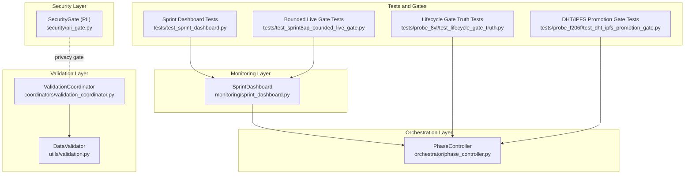
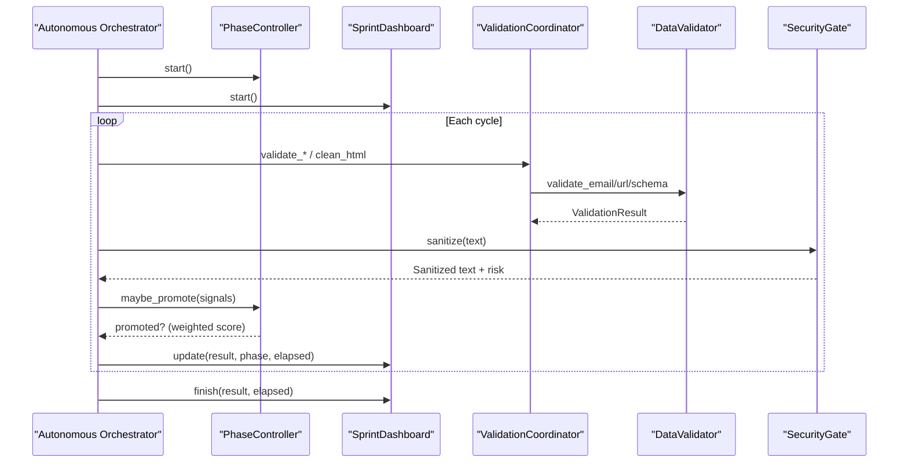
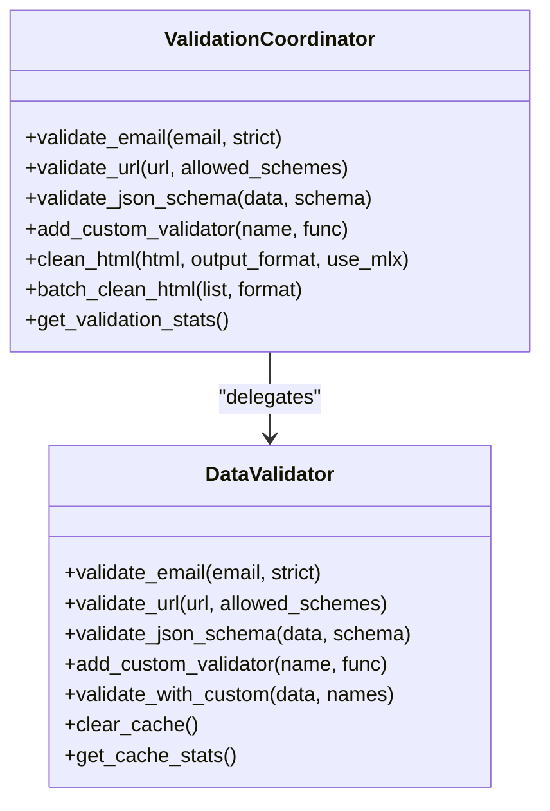
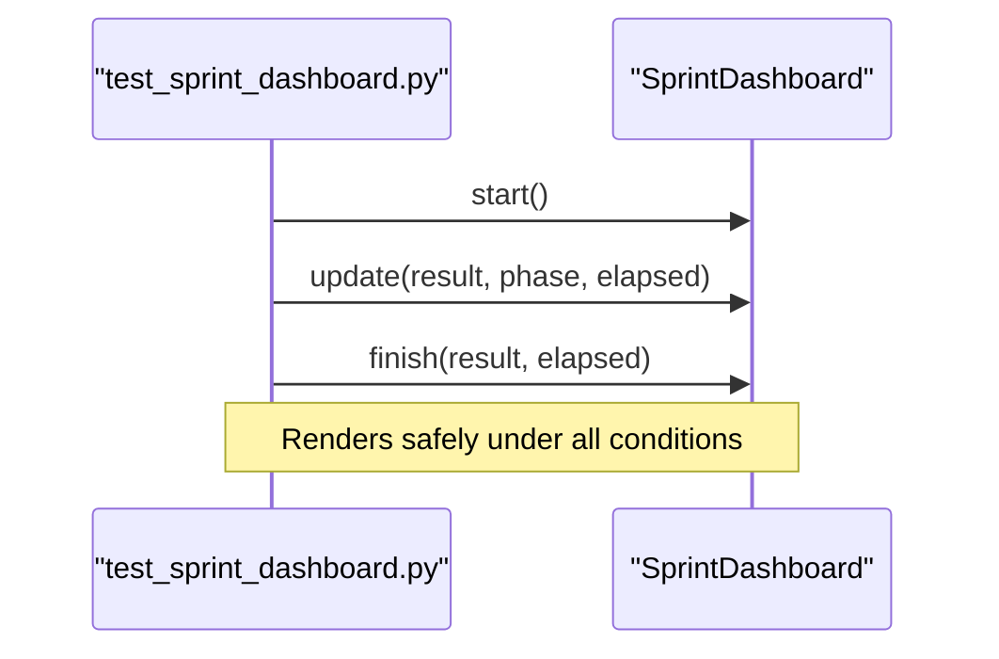
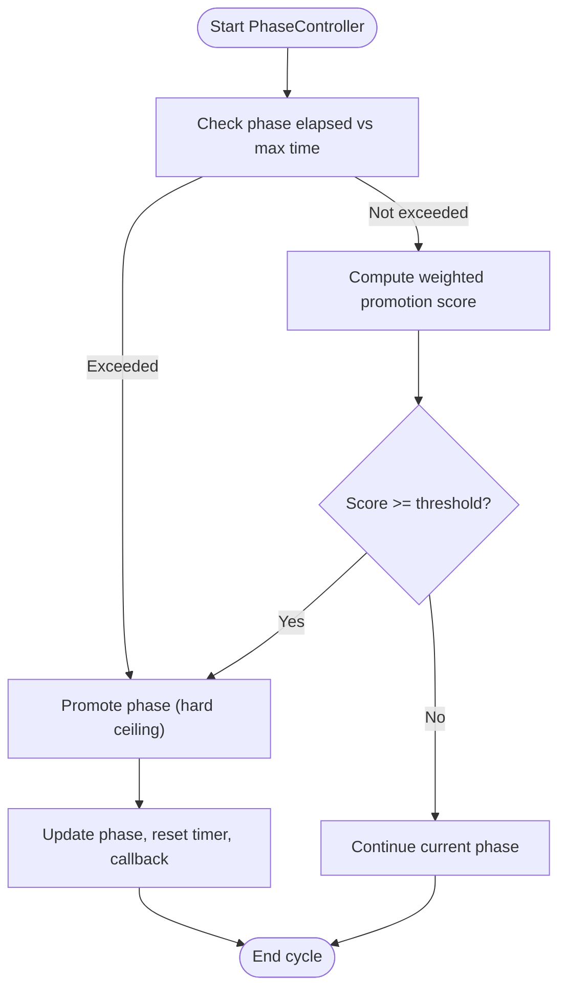
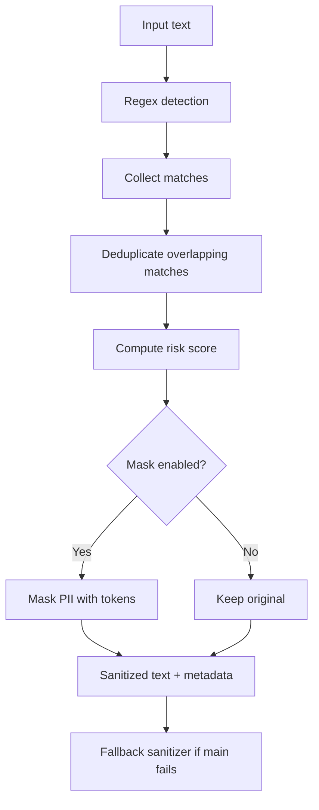
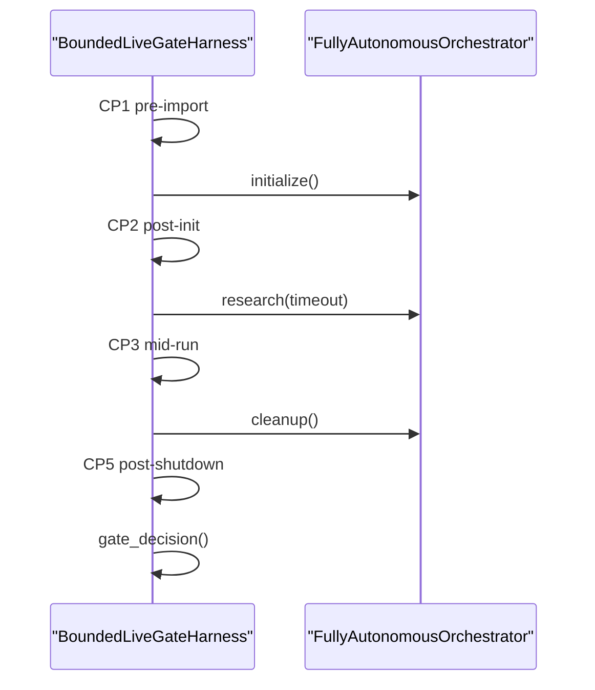
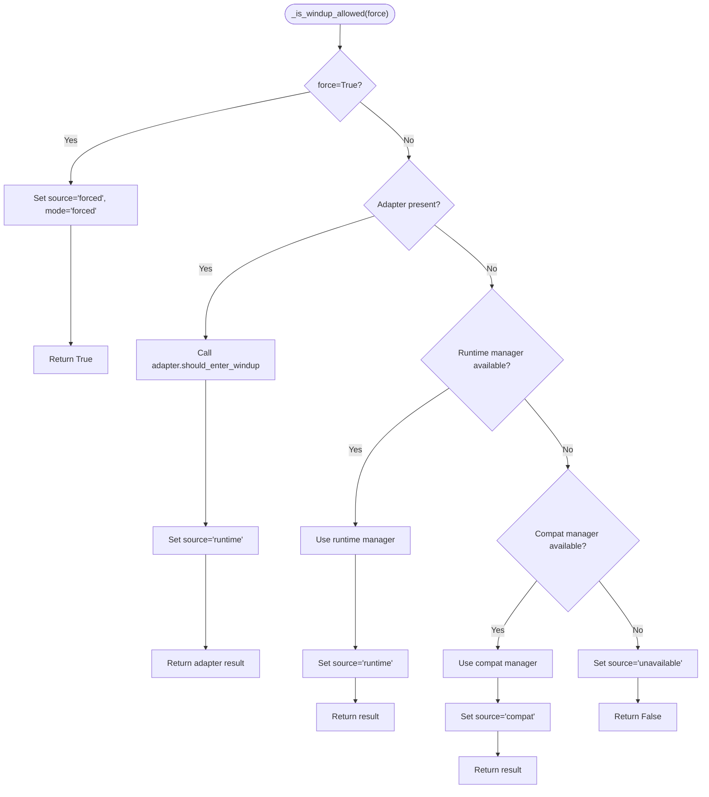
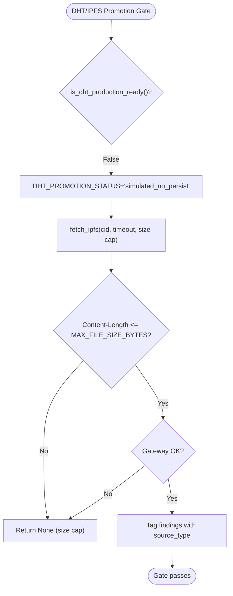
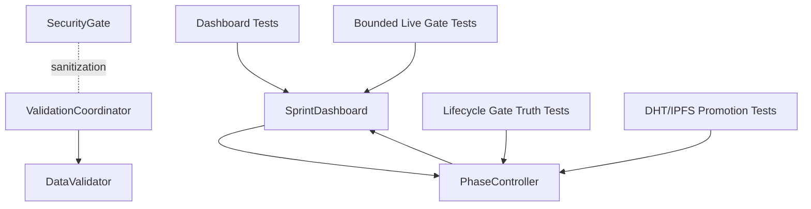

# Quality Gates and Validation

<cite>
**Referenced Files in This Document**
- [validation_coordinator.py](file://coordinators/validation_coordinator.py)
- [validation.py](file://utils/validation.py)
- [sprint_dashboard.py](file://monitoring/sprint_dashboard.py)
- [phase_controller.py](file://orchestrator/phase_controller.py)
- [pii_gate.py](file://security/pii_gate.py)
- [test_sprint_dashboard.py](file://tests/test_sprint_dashboard.py)
- [test_sprint8ap_bounded_live_gate.py](file://tests/test_sprint8ap_bounded_live_gate.py)
- [test_lifecycle_gate_truth.py](file://tests/probe_8vl/test_lifecycle_gate_truth.py)
- [test_dht_ipfs_promotion_gate.py](file://tests/probe_f206f/test_dht_ipfs_promotion_gate.py)
</cite>

## Table of Contents
1. [Introduction](#introduction)
2. [Project Structure](#project-structure)
3. [Core Components](#core-components)
4. [Architecture Overview](#architecture-overview)
5. [Detailed Component Analysis](#detailed-component-analysis)
6. [Dependency Analysis](#dependency-analysis)
7. [Performance Considerations](#performance-considerations)
8. [Troubleshooting Guide](#troubleshooting-guide)
9. [Conclusion](#conclusion)

## Introduction
This document explains the quality gates and validation mechanisms implemented across the system. It focuses on:
- Phase gating and promotion decisions
- Quality checkpoints and automated validation
- Sprint dashboard validation and observability
- Autonomous orchestrator runtime checks
- Knowledge graph integrity verification pointers
- Integration with CI/CD and automated enforcement

The goal is to help operators and developers understand how quality is ensured, how regressions are prevented, and how operational standards are maintained during research sprints and autonomous operations.

## Project Structure
Quality gates span several layers:
- Validation orchestration and data validation utilities
- Monitoring and dashboard for live sprint visibility
- Phase controller for evidence-driven phase transitions
- Security gate for privacy and PII detection
- Tests that codify quality gates and enforce runtime constraints

**Diagram sources**
- [validation_coordinator.py:72-462](file://coordinators/validation_coordinator.py#L72-L462)
- [validation.py:51-433](file://utils/validation.py#L51-L433)
- [sprint_dashboard.py:66-269](file://monitoring/sprint_dashboard.py#L66-L269)
- [phase_controller.py:74-407](file://orchestrator/phase_controller.py#L74-L407)
- [pii_gate.py:75-324](file://security/pii_gate.py#L75-L324)
- [test_sprint_dashboard.py:96-441](file://tests/test_sprint_dashboard.py#L96-L441)
- [test_sprint8ap_bounded_live_gate.py:278-626](file://tests/test_sprint8ap_bounded_live_gate.py#L278-L626)
- [test_lifecycle_gate_truth.py:22-134](file://tests/probe_8vl/test_lifecycle_gate_truth.py#L22-L134)
- [test_dht_ipfs_promotion_gate.py:35-262](file://tests/probe_f206f/test_dht_ipfs_promotion_gate.py#L35-L262)

**Section sources**
- [validation_coordinator.py:1-462](file://coordinators/validation_coordinator.py#L1-L462)
- [validation.py:1-656](file://utils/validation.py#L1-L656)
- [sprint_dashboard.py:1-269](file://monitoring/sprint_dashboard.py#L1-L269)
- [phase_controller.py:1-407](file://orchestrator/phase_controller.py#L1-L407)
- [pii_gate.py:1-556](file://security/pii_gate.py#L1-L556)
- [test_sprint_dashboard.py:1-441](file://tests/test_sprint_dashboard.py#L1-L441)
- [test_sprint8ap_bounded_live_gate.py:1-995](file://tests/test_sprint8ap_bounded_live_gate.py#L1-L995)
- [test_lifecycle_gate_truth.py:1-134](file://tests/probe_8vl/test_lifecycle_gate_truth.py#L1-L134)
- [test_dht_ipfs_promotion_gate.py:1-262](file://tests/probe_f206f/test_dht_ipfs_promotion_gate.py#L1-L262)

## Core Components
- ValidationCoordinator: orchestrates data validation, content cleaning, and language detection with caching and fallbacks.
- DataValidator: performs email, URL, and JSON schema validation with structured error reporting and caching.
- SprintDashboard: live terminal dashboard for sprint monitoring, showing phase, findings, sources, and governor state.
- PhaseController: evidence-driven phase gating with weighted promotion signals and hard time-based ceilings.
- SecurityGate (PII): lightweight regex-based PII detection and sanitization with a mandatory fallback.
- Tests: encode quality gates for dashboard behavior, bounded live-run runtime, lifecycle gate truth, and DHT/IPFS promotion controls.

Key validation criteria and failure handling:
- ValidationCoordinator returns structured results with severity levels and caches outcomes for performance.
- DataValidator enforces strict type and format checks, aggregates errors, and supports custom validators.
- SprintDashboard renders safely under all conditions and persists final state after early windup/abort.
- PhaseController computes a weighted score from multiple signals and enforces hard time-based ceilings.
- SecurityGate detects PII with risk scoring and applies a fail-safe fallback sanitizer.
- Tests define explicit quality gates (e.g., bounded FD deltas, artifact classification, active path execution).

**Section sources**
- [validation_coordinator.py:72-462](file://coordinators/validation_coordinator.py#L72-L462)
- [validation.py:51-433](file://utils/validation.py#L51-L433)
- [sprint_dashboard.py:66-269](file://monitoring/sprint_dashboard.py#L66-L269)
- [phase_controller.py:124-252](file://orchestrator/phase_controller.py#L124-L252)
- [pii_gate.py:75-324](file://security/pii_gate.py#L75-L324)
- [test_sprint_dashboard.py:96-441](file://tests/test_sprint_dashboard.py#L96-L441)
- [test_sprint8ap_bounded_live_gate.py:628-800](file://tests/test_sprint8ap_bounded_live_gate.py#L628-L800)
- [test_lifecycle_gate_truth.py:22-134](file://tests/probe_8vl/test_lifecycle_gate_truth.py#L22-L134)
- [test_dht_ipfs_promotion_gate.py:35-262](file://tests/probe_f206f/test_dht_ipfs_promotion_gate.py#L35-L262)

## Architecture Overview
The quality gates integrate across modules to ensure reliability and prevent regressions:

**Diagram sources**
- [phase_controller.py:124-362](file://orchestrator/phase_controller.py#L124-L362)
- [sprint_dashboard.py:96-137](file://monitoring/sprint_dashboard.py#L96-L137)
- [validation_coordinator.py:111-139](file://coordinators/validation_coordinator.py#L111-L139)
- [validation.py:215-312](file://utils/validation.py#L215-L312)
- [pii_gate.py:150-214](file://security/pii_gate.py#L150-L214)

## Detailed Component Analysis

### ValidationCoordinator and DataValidator
- Responsibilities:
  - Email, URL, and JSON schema validation with strictness and format checks.
  - Content cleaning with HTML-to-Markdown/JSON/text conversion and MLX-backed cleaning.
  - Custom validator registration and batch processing.
  - Caching and fallback strategies for resilience.
- Quality checkpoints:
  - Structured error reporting with severity levels.
  - Cache hit/miss and custom validator counts for performance diagnostics.
  - Fallback to BeautifulSoup and regex-based extraction when MLX is unavailable.
- Failure handling:
  - Graceful degradation to simple extraction when MLX is missing.
  - Centralized error logging and safe return of partial results.

**Diagram sources**
- [validation_coordinator.py:145-300](file://coordinators/validation_coordinator.py#L145-L300)
- [validation_coordinator.py:305-431](file://coordinators/validation_coordinator.py#L305-L431)
- [validation.py:82-312](file://utils/validation.py#L82-L312)

**Section sources**
- [validation_coordinator.py:72-462](file://coordinators/validation_coordinator.py#L72-L462)
- [validation.py:51-433](file://utils/validation.py#L51-L433)

### Sprint Dashboard Validation
- Responsibilities:
  - Live rendering of sprint state with phase, findings, sources, and governor telemetry.
  - Survives branch timeouts and early windup; final state is preserved.
- Quality checkpoints:
  - Safe rendering before first cycle and under abort conditions.
  - Accurate time progress bar and phase styling/emojis.
  - Optional governor and kill-chain tagging rows.
- Failure handling:
  - No-op when Live is not available; graceful fallbacks for missing governor state.

**Diagram sources**
- [test_sprint_dashboard.py:246-338](file://tests/test_sprint_dashboard.py#L246-L338)
- [sprint_dashboard.py:96-137](file://monitoring/sprint_dashboard.py#L96-L137)

**Section sources**
- [sprint_dashboard.py:66-269](file://monitoring/sprint_dashboard.py#L66-L269)
- [test_sprint_dashboard.py:96-441](file://tests/test_sprint_dashboard.py#L96-L441)

### Phase Gating and Promotion
- Responsibilities:
  - Evidence-driven phase promotion using weighted signals.
  - Hard time-based ceilings per phase.
  - Thermal-aware beam width and convergence metrics.
- Quality checkpoints:
  - Weighted score thresholds and time-pressure terms.
  - Beam convergence via Jaccard similarity and novelty EMA.
- Failure handling:
  - Enforces max phase durations; continues until remaining time is minimal.

**Diagram sources**
- [phase_controller.py:124-144](file://orchestrator/phase_controller.py#L124-L144)
- [phase_controller.py:160-252](file://orchestrator/phase_controller.py#L160-L252)
- [phase_controller.py:329-362](file://orchestrator/phase_controller.py#L329-L362)

**Section sources**
- [phase_controller.py:74-407](file://orchestrator/phase_controller.py#L74-L407)

### Security Gate (PII Detection and Sanitization)
- Responsibilities:
  - Regex-based PII detection across multiple categories.
  - Risk scoring and optional masking with a fail-safe fallback.
- Quality checkpoints:
  - Comprehensive pattern coverage and deduplication of overlapping matches.
  - Risk level derived from match counts; token-based fallback masking.
- Failure handling:
  - Always-on fallback sanitizer ensures no raw PII escapes.

**Diagram sources**
- [pii_gate.py:150-214](file://security/pii_gate.py#L150-L214)
- [pii_gate.py:457-551](file://security/pii_gate.py#L457-L551)

**Section sources**
- [pii_gate.py:75-324](file://security/pii_gate.py#L75-L324)

### Autonomous Orchestrator Checks and Bounded Live Gate
- Responsibilities:
  - Bounded live-run harness capturing checkpoints (CP1–CP5) and telemetry.
  - Gate decision based on RSS growth, FD deltas, artifacts classification, and active path execution.
- Quality checkpoints:
  - FD delta non-TIME_WAIT < 20.
  - App-owned leaks = 0 (8AR success).
  - Active path executes without pure mocking.
  - Cold import baseline not regressed (>0.1s).
- Failure handling:
  - Soft failures (SOFT NO-GO) when thresholds are exceeded; OPSEC FAIL for leaks.

**Diagram sources**
- [test_sprint8ap_bounded_live_gate.py:341-551](file://tests/test_sprint8ap_bounded_live_gate.py#L341-L551)
- [test_sprint8ap_bounded_live_gate.py:553-626](file://tests/test_sprint8ap_bounded_live_gate.py#L553-L626)

**Section sources**
- [test_sprint8ap_bounded_live_gate.py:278-626](file://tests/test_sprint8ap_bounded_live_gate.py#L278-L626)

### Lifecycle Gate Truth and Windup Controls
- Responsibilities:
  - Structured state (_lifecycle_gate_source/mode) is always set.
  - Priority: injected adapter → runtime → compat → unavailable; force flag overrides.
- Quality checkpoints:
  - Adapter path sets source="runtime" and mode="windup"/"blocked".
  - force=True sets source="forced" and mode="forced".
- Failure handling:
  - Structured state is guaranteed even if exceptions occur.

**Diagram sources**
- [test_lifecycle_gate_truth.py:22-98](file://tests/probe_8vl/test_lifecycle_gate_truth.py#L22-L98)

**Section sources**
- [test_lifecycle_gate_truth.py:22-134](file://tests/probe_8vl/test_lifecycle_gate_truth.py#L22-L134)

### DHT/IPFS Promotion Gate
- Responsibilities:
  - Controlled promotion status for DHT and IPFS modules.
  - IPFS bounded gateway fetch with timeout and size cap; fail-soft behavior.
- Quality checkpoints:
  - DHT production readiness = False; no persistence during discovery.
  - IPFS fetch_ipfs respects timeout and MAX_FILE_SIZE_BYTES.
  - Finding tagging uses explicit source_type for traceability.
- Failure handling:
  - Circuit breaker is optional and fail-open; oversized files return None.

**Diagram sources**
- [test_dht_ipfs_promotion_gate.py:35-262](file://tests/probe_f206f/test_dht_ipfs_promotion_gate.py#L35-L262)

**Section sources**
- [test_dht_ipfs_promotion_gate.py:35-262](file://tests/probe_f206f/test_dht_ipfs_promotion_gate.py#L35-L262)

## Dependency Analysis
Quality gates depend on:
- ValidationCoordinator depends on DataValidator for validation logic.
- SprintDashboard depends on runtime governor snapshots and orchestrator results.
- PhaseController integrates with orchestrator signals and governs phase transitions.
- SecurityGate is independent but interacts with content cleaning and sanitization flows.
- Tests codify quality gates and act as living specifications for CI/CD enforcement.

**Diagram sources**
- [validation_coordinator.py:111-139](file://coordinators/validation_coordinator.py#L111-L139)
- [validation.py:51-433](file://utils/validation.py#L51-L433)
- [sprint_dashboard.py:242-260](file://monitoring/sprint_dashboard.py#L242-L260)
- [phase_controller.py:329-362](file://orchestrator/phase_controller.py#L329-L362)
- [pii_gate.py:150-214](file://security/pii_gate.py#L150-L214)
- [test_sprint_dashboard.py:246-338](file://tests/test_sprint_dashboard.py#L246-L338)
- [test_sprint8ap_bounded_live_gate.py:341-551](file://tests/test_sprint8ap_bounded_live_gate.py#L341-L551)
- [test_lifecycle_gate_truth.py:22-98](file://tests/probe_8vl/test_lifecycle_gate_truth.py#L22-L98)
- [test_dht_ipfs_promotion_gate.py:35-262](file://tests/probe_f206f/test_dht_ipfs_promotion_gate.py#L35-L262)

**Section sources**
- [validation_coordinator.py:72-462](file://coordinators/validation_coordinator.py#L72-L462)
- [validation.py:51-433](file://utils/validation.py#L51-L433)
- [sprint_dashboard.py:66-269](file://monitoring/sprint_dashboard.py#L66-L269)
- [phase_controller.py:74-407](file://orchestrator/phase_controller.py#L74-L407)
- [pii_gate.py:75-324](file://security/pii_gate.py#L75-L324)
- [test_sprint_dashboard.py:96-441](file://tests/test_sprint_dashboard.py#L96-L441)
- [test_sprint8ap_bounded_live_gate.py:278-626](file://tests/test_sprint8ap_bounded_live_gate.py#L278-L626)
- [test_lifecycle_gate_truth.py:22-134](file://tests/probe_8vl/test_lifecycle_gate_truth.py#L22-L134)
- [test_dht_ipfs_promotion_gate.py:35-262](file://tests/probe_f206f/test_dht_ipfs_promotion_gate.py#L35-L262)

## Performance Considerations
- ValidationCoordinator and DataValidator use caching to reduce repeated validations and improve throughput.
- Content cleaning attempts MLX acceleration but falls back to BeautifulSoup and regex-based extraction for resilience.
- SprintDashboard uses a live renderer with a fixed refresh rate; it gracefully handles missing rich dependencies.
- PhaseController’s weighted scoring avoids complex scheduling and reduces overhead.
- SecurityGate uses compiled regex patterns and bounded-length processing to prevent performance regressions.

[No sources needed since this section provides general guidance]

## Troubleshooting Guide
Common issues and resolutions:
- ValidationCoordinator reports “DataValidator not available”:
  - Ensure required modules are importable; the coordinator falls back to simple extraction.
- Content cleaning fails:
  - Verify MLX availability; if unavailable, fallback to BeautifulSoup/regex extraction is used.
- SprintDashboard not rendering:
  - If rich is unavailable, the dashboard becomes a no-op; otherwise, confirm Live updates are called.
- PhaseController not promoting:
  - Check weighted score and time-based ceiling; ensure signals meet thresholds.
- SecurityGate fails:
  - Confirm regex patterns are compiled; fallback sanitizer is always available.
- Bounded live gate fails:
  - Review FD delta, RSS growth, and artifact classification; ensure active path executes.

**Section sources**
- [validation_coordinator.py:169-187](file://coordinators/validation_coordinator.py#L169-L187)
- [validation_coordinator.py:331-352](file://coordinators/validation_coordinator.py#L331-L352)
- [sprint_dashboard.py:96-137](file://monitoring/sprint_dashboard.py#L96-L137)
- [phase_controller.py:124-144](file://orchestrator/phase_controller.py#L124-L144)
- [pii_gate.py:150-214](file://security/pii_gate.py#L150-L214)
- [test_sprint8ap_bounded_live_gate.py:696-710](file://tests/test_sprint8ap_bounded_live_gate.py#L696-L710)

## Conclusion
Quality gates and validation mechanisms are integrated across validation, monitoring, orchestration, and security layers. They ensure reliability by:
- Enforcing evidence-driven phase transitions
- Providing live observability and structured dashboards
- Applying automated runtime checks and bounded constraints
- Detecting and sanitizing sensitive data
- Codifying quality gates in tests for CI/CD enforcement

These practices collectively prevent regressions, maintain operational standards, and support autonomous orchestrator checks and integrity verification.