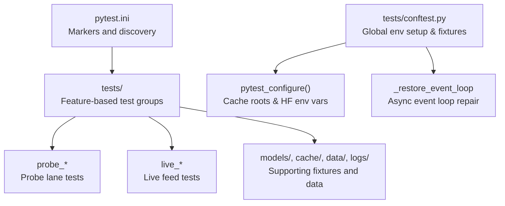
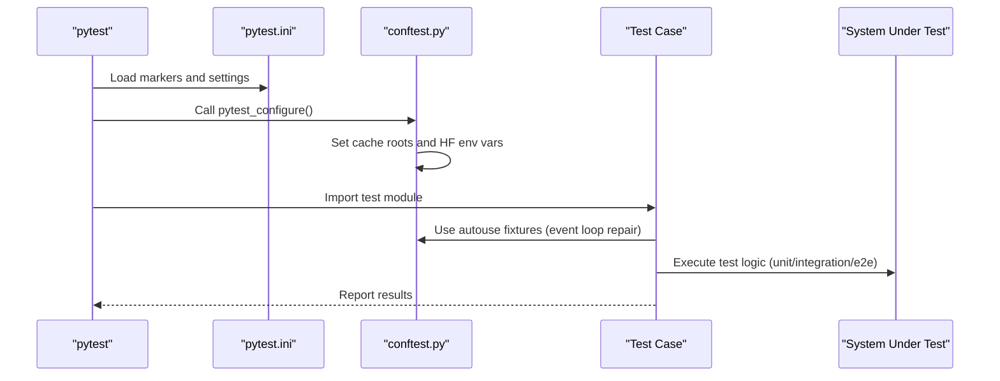
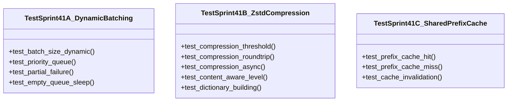
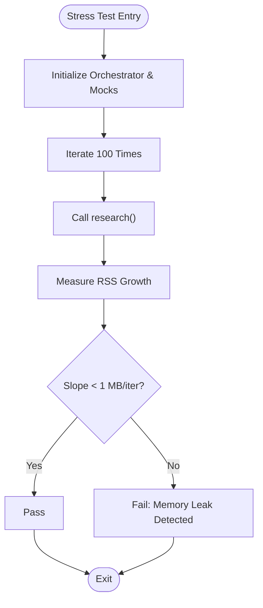
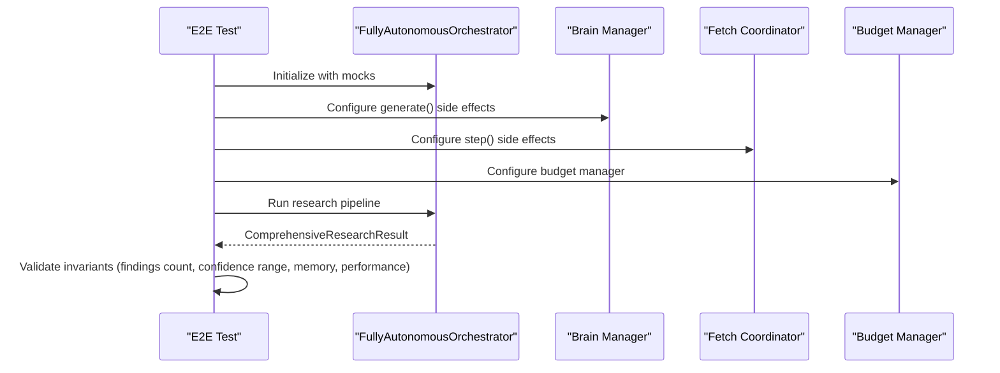
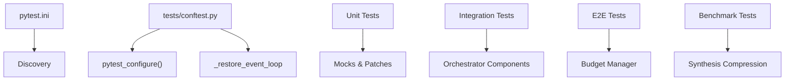

# Test Framework and Configuration

<cite>
**Referenced Files in This Document**
- [pytest.ini](file://pytest.ini)
- [conftest.py](file://tests/conftest.py)
- [test_sprint41.py](file://tests/test_sprint41.py)
- [test_sprint42.py](file://tests/test_sprint42.py)
- [test_sprint43.py](file://tests/test_sprint43.py)
- [test_sprint44.py](file://tests/test_sprint44.py)
- [test_sprint45.py](file://tests/test_sprint45.py)
- [test_e2e_pipeline.py](file://tests/test_e2e_pipeline.py)
- [test_e2e_pipeline_smoke.py](file://tests/test_e2e_pipeline_smoke.py)
- [test_sprint82j_benchmark.py](file://tests/test_sprint82j_benchmark.py)
- [test_sprint83a_network_recon.py](file://tests/test_sprint83a_network_recon.py)
- [test_sprint83b_network_recon_validation.py](file://tests/test_sprint83b_network_recon_validation.py)
- [test_sprint82i_benchmark.py](file://tests/test_sprint82i_benchmark.py)
</cite>

## Table of Contents
1. [Introduction](#introduction)
2. [Project Structure](#project-structure)
3. [Core Components](#core-components)
4. [Architecture Overview](#architecture-overview)
5. [Detailed Component Analysis](#detailed-component-analysis)
6. [Dependency Analysis](#dependency-analysis)
7. [Performance Considerations](#performance-considerations)
8. [Troubleshooting Guide](#troubleshooting-guide)
9. [Conclusion](#conclusion)

## Introduction
This document describes the test framework and configuration system used in the project. It explains pytest configuration, test discovery, global test setup, runner configuration, coverage settings, and continuous integration setup. It also documents test categorization, naming conventions, execution strategies, and how the framework supports unit, integration, and end-to-end tests. Finally, it covers test environment setup, fixture management, and isolation strategies.

## Project Structure
The test suite is organized under the tests/ directory with feature-based and probe-based subdivisions. The pytest configuration is centralized in pytest.ini, while global test setup is handled in tests/conftest.py. Individual tests are grouped by sprint or functional area and use unittest.TestCase or unittest.IsolatedAsyncioTestCase for synchronous and asynchronous test classes respectively.

**Diagram sources**
- [pytest.ini:1-16](file://pytest.ini#L1-L16)
- [conftest.py:14-57](file://tests/conftest.py#L14-L57)
- [conftest.py:68-97](file://tests/conftest.py#L68-L97)

**Section sources**
- [pytest.ini:1-16](file://pytest.ini#L1-L16)
- [conftest.py:14-57](file://tests/conftest.py#L14-L57)
- [conftest.py:68-97](file://tests/conftest.py#L68-L97)

## Core Components
- Pytest markers and discovery: The pytest.ini file registers markers for slow, stress, timeout, unit, integration, smoke, hermetic, and probe to categorize tests and enable selective execution.
- Global environment setup: tests/conftest.py sets cache roots and HuggingFace/transformers cache directories before any test module is imported, ensuring deterministic and isolated model caching behavior.
- Async event loop repair: An autouse fixture restores or recreates the event loop after each test to prevent failures caused by asyncio.run() closing the loop.
- Test categories:
  - Unit tests: Isolated logic tests using unittest.IsolatedAsyncioTestCase and standard unittest.TestCase.
  - Integration tests: Feature-level tests that coordinate multiple components (e.g., orchestrator, fetch coordinator).
  - End-to-end tests: Full pipeline tests that mock external systems to validate behavior without real network calls.
  - Benchmark tests: Long-running validations that collect metrics and enforce bounds.
  - Live smoke tests: Real HTTP tests that validate live feed ingestion with timeouts and network error handling.

**Section sources**
- [pytest.ini:7-16](file://pytest.ini#L7-L16)
- [conftest.py:14-57](file://tests/conftest.py#L14-L57)
- [conftest.py:68-97](file://tests/conftest.py#L68-L97)

## Architecture Overview
The test framework enforces early environment bootstrapping and provides robust fixtures to support diverse test types. The following diagram shows how pytest configuration, global setup, and fixtures interact with test classes.

**Diagram sources**
- [pytest.ini:1-16](file://pytest.ini#L1-L16)
- [conftest.py:14-57](file://tests/conftest.py#L14-L57)
- [conftest.py:68-97](file://tests/conftest.py#L68-L97)

## Detailed Component Analysis

### Pytest Configuration and Markers
- Purpose: Centralize test categorization and selective execution.
- Key aspects:
  - Registered markers: slow, stress, timeout, unit, integration, smoke, hermetic, probe.
  - Discovery: Root directory is already correct; no rootdir override is needed.
- Execution strategies:
  - Select by marker: e.g., exclude slow tests with -m "not slow".
  - Combine markers for smoke and integration suites.

**Section sources**
- [pytest.ini:1-16](file://pytest.ini#L1-L16)

### Global Environment Setup and Cache Management
- Early bootstrap: pytest_configure() runs before any test module import to set cache roots and HuggingFace/transformers cache directories.
- Behavior:
  - Determines runtime root from environment variables or falls back to a predefined path.
  - Ensures cache directories exist.
  - Sets HF_* and related cache environment variables to avoid system-wide cache pollution.
- Impact: Enables repeatable model downloads and caching behavior across CI and local environments.

**Section sources**
- [conftest.py:14-57](file://tests/conftest.py#L14-L57)

### Async Event Loop Repair Fixture
- Purpose: Fix failures caused by asyncio.run() permanently closing the event loop.
- Mechanism:
  - Snapshots the loop before the test.
  - Restores or recreates the loop after the test.
  - Prevents "There is no current event loop in thread 'MainThread'" errors.
- Scope: Autouse fixture applied to all tests.

**Section sources**
- [conftest.py:68-97](file://tests/conftest.py#L68-L97)

### Unit Tests: Parallelism and Compression
- Example: Tests for dynamic batching, zstd compression, and shared prefix cache.
- Patterns:
  - Uses unittest.IsolatedAsyncioTestCase for async tests.
  - Extensive mocking of external dependencies (psutil, asyncio, third-party libraries).
  - Verifies correctness under different memory conditions and partial failures.

**Diagram sources**
- [test_sprint41.py:29-256](file://tests/test_sprint41.py#L29-L256)

**Section sources**
- [test_sprint41.py:1-260](file://tests/test_sprint41.py#L1-L260)

### Unit Tests: Adaptive Intelligence and Stress
- Example: Aging, predictive RSS monitor, LinUCB contextual bandit, and stress tests.
- Patterns:
  - Uses unittest.IsolatedAsyncioTestCase for async logic.
  - Employs pytest.mark.stress for heavy load scenarios.
  - Validates memory growth and deadlock-free operation.

**Diagram sources**
- [test_sprint43.py:193-241](file://tests/test_sprint43.py#L193-L241)

**Section sources**
- [test_sprint42.py:1-245](file://tests/test_sprint42.py#L1-L245)
- [test_sprint43.py:1-263](file://tests/test_sprint43.py#L1-L263)

### Integration Tests: Fetch Coordinator and Forensics
- Example: Lightpanda integration, JS detection, proxy rotation, forensics analysis, and prediction logic.
- Patterns:
  - Uses AsyncMock and MagicMock extensively.
  - Validates fallback behavior and automatic compilation of external tools.
  - Tests prediction thresholds and contextual weighting.

**Section sources**
- [test_sprint44.py:1-252](file://tests/test_sprint44.py#L1-L252)
- [test_sprint45.py:1-243](file://tests/test_sprint45.py#L1-L243)

### End-to-End Tests: Pipeline and Live Feeds
- Example: Fully mocked pipeline test validates invariants across findings, confidence ranges, memory budgets, and performance.
- Live smoke test: Validates real HTTP ingestion from curated feeds with timeouts and network error handling; skips on network failures.

**Diagram sources**
- [test_e2e_pipeline.py:26-189](file://tests/test_e2e_pipeline.py#L26-L189)

**Section sources**
- [test_e2e_pipeline.py:1-189](file://tests/test_e2e_pipeline.py#L1-L189)
- [test_e2e_pipeline_smoke.py:1-105](file://tests/test_e2e_pipeline_smoke.py#L1-L105)

### Benchmark and Validation Tests
- Example: E2E benchmark smoke tests, bounded synthesis, archive rescue, onion fallback, contradiction preservation, winner-only synthesis, and final-phase acquisition gating.
- Patterns:
  - Validates constants and bounds.
  - Uses AsyncMock and patching to simulate external services.
  - Emphasizes observability fields and structured fallbacks.

**Section sources**
- [test_sprint82j_benchmark.py:1-952](file://tests/test_sprint82j_benchmark.py#L1-L952)
- [test_sprint82i_benchmark.py:1-401](file://tests/test_sprint82i_benchmark.py#L1-L401)

### Network Reconnaissance Integration and Validation
- Example: Integration of network_recon action, truth validation for subdomain forwarding, partial failure handling, cross-deduplication, and bounded live audit.
- Patterns:
  - Uses pytest fixtures to construct orchestrator state.
  - Validates observability fields and bounded constants.
  - Includes slow live audit tests with timeouts.

**Section sources**
- [test_sprint83a_network_recon.py:1-303](file://tests/test_sprint83a_network_recon.py#L1-L303)
- [test_sprint83b_network_recon_validation.py:1-255](file://tests/test_sprint83b_network_recon_validation.py#L1-L255)

## Dependency Analysis
- Test discovery: pytest discovers tests under tests/ using standard Python naming conventions and unittest classes.
- Global setup: tests/conftest.py executes before any test import, setting environment variables and ensuring cache directories exist.
- Fixture dependencies:
  - Event loop repair depends on asyncio.get_event_loop() and asyncio.new_event_loop().
  - Cache setup depends on environment variables and filesystem paths.
- Test categories:
  - Unit tests depend on internal modules and mocks.
  - Integration tests depend on orchestrator components and external adapters.
  - End-to-end tests depend on orchestrator orchestration and budget managers.
  - Benchmark tests depend on synthesis compression and metrics structures.

**Diagram sources**
- [pytest.ini:1-16](file://pytest.ini#L1-L16)
- [conftest.py:14-57](file://tests/conftest.py#L14-L57)
- [conftest.py:68-97](file://tests/conftest.py#L68-L97)

**Section sources**
- [pytest.ini:1-16](file://pytest.ini#L1-L16)
- [conftest.py:14-57](file://tests/conftest.py#L14-L57)
- [conftest.py:68-97](file://tests/conftest.py#L68-L97)

## Performance Considerations
- Event loop repair prevents cascading failures in async tests, reducing flakiness and improving reliability.
- Cache root enforcement avoids repeated model downloads and ensures consistent performance across runs.
- Stress tests and benchmarks validate memory growth and throughput bounds, helping maintain system stability under load.

## Troubleshooting Guide
- Event loop errors: If encountering "There is no current event loop in thread 'MainThread'", ensure the autouse fixture is active and that tests do not call asyncio.run() without restoration.
- Cache path issues: Verify HLEDAC_CACHE_ROOT and HF_* environment variables are set correctly by pytest_configure().
- Network smoke test failures: Live tests skip on network errors; confirm connectivity or adjust timeouts.
- Stress test failures: Investigate memory growth and deadlock scenarios using the provided stress markers and assertions.

**Section sources**
- [conftest.py:68-97](file://tests/conftest.py#L68-L97)
- [conftest.py:14-57](file://tests/conftest.py#L14-L57)
- [test_e2e_pipeline_smoke.py:36-51](file://tests/test_e2e_pipeline_smoke.py#L36-L51)
- [test_sprint43.py:193-241](file://tests/test_sprint43.py#L193-L241)

## Conclusion
The test framework leverages pytest’s marker system and centralized configuration to organize and execute diverse test categories efficiently. Global environment setup and async event loop repair ensure reliable test execution, while fixtures and mocks enable unit, integration, and end-to-end validation. Benchmarks and stress tests enforce performance and stability guarantees, and live smoke tests validate real-world behavior with robust error handling.