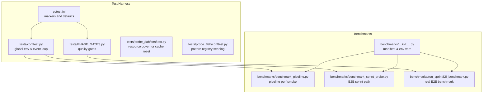
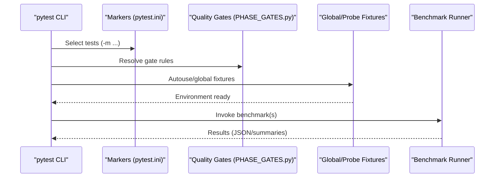
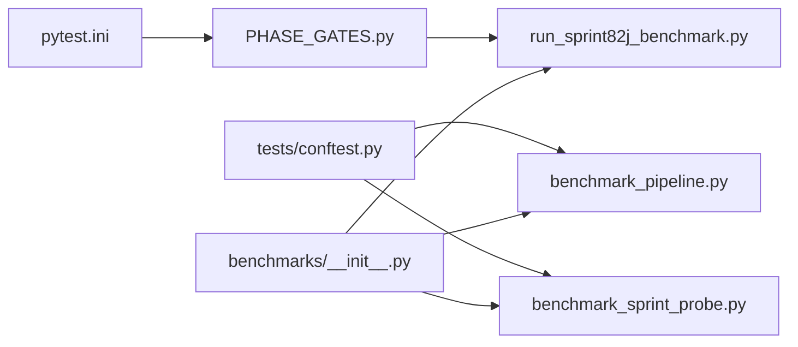

# Testing and Quality Assurance

<cite>
**Referenced Files in This Document**
- [pytest.ini](file://pytest.ini)
- [tests/conftest.py](file://tests/conftest.py)
- [tests/PHASE_GATES.py](file://tests/PHASE_GATES.py)
- [tests/probe_8ab/conftest.py](file://tests/probe_8ab/conftest.py)
- [tests/probe_8ah/conftest.py](file://tests/probe_8ah/conftest.py)
- [tests/test_sprint82j_benchmark.py](file://tests/test_sprint82j_benchmark.py)
- [benchmarks/__init__.py](file://benchmarks/__init__.py)
- [benchmarks/benchmark_pipeline.py](file://benchmarks/benchmark_pipeline.py)
- [benchmarks/benchmark_sprint_probe.py](file://benchmarks/benchmark_sprint_probe.py)
- [benchmarks/run_sprint82j_benchmark.py](file://benchmarks/run_sprint82j_benchmark.py)
</cite>

## Table of Contents
1. [Introduction](#introduction)
2. [Project Structure](#project-structure)
3. [Core Components](#core-components)
4. [Architecture Overview](#architecture-overview)
5. [Detailed Component Analysis](#detailed-component-analysis)
6. [Dependency Analysis](#dependency-analysis)
7. [Performance Considerations](#performance-considerations)
8. [Troubleshooting Guide](#troubleshooting-guide)
9. [Conclusion](#conclusion)

## Introduction
This document describes the testing and quality assurance subsystem of the project. It explains the test framework, probe system, benchmark suite, and quality gates used to ensure correctness, performance, and reliability across the system. It covers configuration, invocation relationships, domain models, and usage patterns, and provides practical guidance for both beginners and experienced developers.

## Project Structure
The testing and QA subsystem is organized around:
- Pytest configuration and markers for layered execution
- Global and per-probe fixtures for environment isolation
- A comprehensive benchmark suite capturing runtime behavior and performance
- Quality gates enabling staged, risk-aware test execution

**Diagram sources**
- [pytest.ini:1-16](file://pytest.ini#L1-L16)
- [tests/conftest.py:1-97](file://tests/conftest.py#L1-L97)
- [tests/PHASE_GATES.py:1-143](file://tests/PHASE_GATES.py#L1-L143)
- [tests/probe_8ab/conftest.py:1-20](file://tests/probe_8ab/conftest.py#L1-L20)
- [tests/probe_8ah/conftest.py:1-37](file://tests/probe_8ah/conftest.py#L1-L37)
- [benchmarks/__init__.py:1-37](file://benchmarks/__init__.py#L1-L37)
- [benchmarks/benchmark_pipeline.py:1-381](file://benchmarks/benchmark_pipeline.py#L1-L381)
- [benchmarks/benchmark_sprint_probe.py:1-371](file://benchmarks/benchmark_sprint_probe.py#L1-L371)
- [benchmarks/run_sprint82j_benchmark.py:1-800](file://benchmarks/run_sprint82j_benchmark.py#L1-L800)

**Section sources**
- [pytest.ini:1-16](file://pytest.ini#L1-L16)
- [tests/conftest.py:1-97](file://tests/conftest.py#L1-L97)
- [tests/PHASE_GATES.py:1-143](file://tests/PHASE_GATES.py#L1-L143)
- [tests/probe_8ab/conftest.py:1-20](file://tests/probe_8ab/conftest.py#L1-L20)
- [tests/probe_8ah/conftest.py:1-37](file://tests/probe_8ah/conftest.py#L1-L37)
- [benchmarks/__init__.py:1-37](file://benchmarks/__init__.py#L1-L37)
- [benchmarks/benchmark_pipeline.py:1-381](file://benchmarks/benchmark_pipeline.py#L1-L381)
- [benchmarks/benchmark_sprint_probe.py:1-371](file://benchmarks/benchmark_sprint_probe.py#L1-L371)
- [benchmarks/run_sprint82j_benchmark.py:1-800](file://benchmarks/run_sprint82j_benchmark.py#L1-L800)

## Core Components
- Pytest configuration and markers define test categories and selection semantics.
- Global fixtures enforce cache roots and restore the event loop after tests.
- Quality gates register markers for probe, canary, phase, and manual-only suites.
- Per-probe fixtures isolate environment state for specific lanes.
- Benchmark suite includes:
  - Runtime manifest and environment variables
  - Pipeline performance smoke tests
  - End-to-end sprint path benchmark
  - Real E2E benchmark capturing timing, memory, synthesis, and telemetry

Key configuration and behavior:
- Pytest markers include slow, stress, timeout, unit, integration, smoke, hermetic, and probe.
- Global conftest sets cache roots for model libraries and ensures a fresh event loop after each test.
- Quality gates define probe, canary, phase, and manual-only markers and durations.

**Section sources**
- [pytest.ini:1-16](file://pytest.ini#L1-L16)
- [tests/conftest.py:14-97](file://tests/conftest.py#L14-L97)
- [tests/PHASE_GATES.py:26-40](file://tests/PHASE_GATES.py#L26-L40)

## Architecture Overview
The QA architecture integrates pytest markers, fixtures, and benchmark runners to provide:
- Layered execution via quality gates
- Environment isolation via per-lane fixtures
- Comprehensive runtime profiling via benchmark modules

**Diagram sources**
- [pytest.ini:7-16](file://pytest.ini#L7-L16)
- [tests/PHASE_GATES.py:26-40](file://tests/PHASE_GATES.py#L26-L40)
- [tests/conftest.py:68-97](file://tests/conftest.py#L68-L97)
- [benchmarks/benchmark_pipeline.py:345-381](file://benchmarks/benchmark_pipeline.py#L345-L381)
- [benchmarks/benchmark_sprint_probe.py:347-371](file://benchmarks/benchmark_sprint_probe.py#L347-L371)
- [benchmarks/run_sprint82j_benchmark.py:439-605](file://benchmarks/run_sprint82j_benchmark.py#L439-L605)

## Detailed Component Analysis

### Pytest Configuration and Quality Gates
- Defines and registers markers for probe, canary, phase, and manual-only tests.
- Provides usage guidance for running subsets of tests efficiently and safely.
- Supports quick smoke tests and heavier integration tests with explicit selection.

Practical usage:
- Run probe gate tests: pytest tests/probe_*/ -m probe_gate -q
- Run AO canary: pytest tests/test_ao_canary.py -q
- Run phase gate: pytest tests/test_sprint*.py -m phase_gate -q
- Run manual-only: pytest tests/ -m manual_only -q

**Section sources**
- [pytest.ini:1-16](file://pytest.ini#L1-L16)
- [tests/PHASE_GATES.py:26-40](file://tests/PHASE_GATES.py#L26-L40)
- [tests/PHASE_GATES.py:42-143](file://tests/PHASE_GATES.py#L42-L143)

### Global Test Fixtures
- Enforces cache roots for model libraries before any test module import.
- Restores the event loop after each test to avoid “no current event loop” errors caused by asyncio.run().

Key behaviors:
- Cache root enforcement for HuggingFace/transformers/sentence-transformers.
- Event loop restoration via autouse fixture.

**Section sources**
- [tests/conftest.py:14-57](file://tests/conftest.py#L14-L57)
- [tests/conftest.py:68-97](file://tests/conftest.py#L68-L97)

### Per-Probe Fixtures
- Resource governor cache reset to prevent mock leakage between tests.
- Optional pattern registry seeding for integration tests that require pattern matching.

**Section sources**
- [tests/probe_8ab/conftest.py:14-20](file://tests/probe_8ab/conftest.py#L14-L20)
- [tests/probe_8ah/conftest.py:22-37](file://tests/probe_8ah/conftest.py#L22-L37)

### Benchmark Manifest and Environment Variables
- Declares a benchmark manifest with checks and environment variables for runtime verification.
- Exposes a function to retrieve the manifest programmatically.

Environment variables:
- HLEDAC_BENCHMARK: enables benchmark probe
- GHOST_FLOW_TRACE: enables flow tracing

Checks include singleton sessions, async session behavior, bounded queues, and gather return exceptions.

**Section sources**
- [benchmarks/__init__.py:16-37](file://benchmarks/__init__.py#L16-L37)
- [benchmarks/__init__.py:34-37](file://benchmarks/__init__.py#L34-L37)

### Pipeline Performance Benchmark (benchmark_pipeline.py)
Purpose:
- Runs multiple iterations of the pipeline with varied queries and measures phase timings and memory deltas.

Key parameters:
- num_runs: number of iterations
- queries: list of queries (defaults to predefined set)
- mode: pipeline mode
- duration_s: per-run sprint duration
- output_path: JSON output location

Statistics:
- Computes mean/min/max/stddev per phase and memory delta statistics.

Behavior:
- Uses uvloop if available.
- Supports mock fetch mode for fast, in-memory runs or live mode via a flag.

**Section sources**
- [benchmarks/benchmark_pipeline.py:53-158](file://benchmarks/benchmark_pipeline.py#L53-L158)
- [benchmarks/benchmark_pipeline.py:161-210](file://benchmarks/benchmark_pipeline.py#L161-L210)
- [benchmarks/benchmark_pipeline.py:213-342](file://benchmarks/benchmark_pipeline.py#L213-L342)
- [benchmarks/benchmark_pipeline.py:345-381](file://benchmarks/benchmark_pipeline.py#L345-L381)

### E2E Sprint Path Benchmark (benchmark_sprint_probe.py)
Purpose:
- Measures first-finding latency, memory ceiling, branch mix, and total findings on a canonical sprint path.

Key constants:
- BENCHMARK_DURATION_S: 60s
- BENCHMARK_MAX_CYCLES: 10
- M1_8GB_CEILING_MB: 6.5 GiB

Hermetic setup:
- Patches feed adapters and pattern matcher to avoid external I/O.
- Uses a temporary DuckDB shadow store.

Outputs:
- JSON with metadata, latency, findings, peak RSS, UMA state, branch mix, and pipeline result.

Exit code:
- 0 if memory ceiling OK, 1 otherwise.

**Section sources**
- [benchmarks/benchmark_sprint_probe.py:40-44](file://benchmarks/benchmark_sprint_probe.py#L40-L44)
- [benchmarks/benchmark_sprint_probe.py:98-164](file://benchmarks/benchmark_sprint_probe.py#L98-L164)
- [benchmarks/benchmark_sprint_probe.py:170-344](file://benchmarks/benchmark_sprint_probe.py#L170-L344)
- [benchmarks/benchmark_sprint_probe.py:347-371](file://benchmarks/benchmark_sprint_probe.py#L347-L371)

### Real End-to-End Benchmark (run_sprint82j_benchmark.py)
Purpose:
- Captures whole-run timing, per-layer acquisition stats, gating/admission metrics, lane metrics, memory/thermal stats, synthesis metrics, bottleneck diagnosis, and observability from real logs.

Domain models:
- BenchmarkConfig: duration, query, depth, output_dir, verbosity, tracking flags, data mode, and silent mode.
- BenchmarkResults: comprehensive timing, memory, acquisition, gating, synthesis, thermal, telemetry, and FPS metrics.
- Supporting dataclasses: BenchmarkPhaseMetrics, BenchmarkLaneMetrics, BenchmarkMemoryMetrics, BenchmarkAcquisitionMetrics, BenchmarkGatingMetrics, BenchmarkSynthesisMetrics, and summary structs for logs.

Execution flow:
- Attempts to create a real orchestrator with a timeout; falls back to a minimal mock orchestrator if initialization fails.
- Extracts metrics from orchestrator state, traces, and telemetry.
- Writes checkpoints to JSONL for silent benchmark harness.

Quality gates and telemetry:
- Tracks real vs mock usage, research entry, initialization errors, and early-exit reasons.
- Computes FPS from loop time, not wall clock.

**Section sources**
- [benchmarks/run_sprint82j_benchmark.py:51-66](file://benchmarks/run_sprint82j_benchmark.py#L51-L66)
- [benchmarks/run_sprint82j_benchmark.py:68-376](file://benchmarks/run_sprint82j_benchmark.py#L68-L376)
- [benchmarks/run_sprint82j_benchmark.py:439-605](file://benchmarks/run_sprint82j_benchmark.py#L439-L605)
- [benchmarks/run_sprint82j_benchmark.py:606-800](file://benchmarks/run_sprint82j_benchmark.py#L606-L800)

### Test Coverage for Benchmark Infrastructure (tests/test_sprint82j_benchmark.py)
Focus:
- Validates BenchmarkConfig defaults and smoke mode.
- Ensures BenchmarkResults fields and derived metrics (e.g., bottleneck detection).
- Verifies log/metrics wiring: tool execution, evidence, and metrics summaries.
- Confirms run_id extraction and graceful handling of missing logs.
- Includes tests for entropy masking termination, novelty scoring, iteration trace, query diversification, echo admission changes, domain extraction, offline mode detection, exception mapping, capability health, live audit targets, teardown timing, and FPS computation.

**Section sources**
- [tests/test_sprint82j_benchmark.py:30-82](file://tests/test_sprint82j_benchmark.py#L30-L82)
- [tests/test_sprint82j_benchmark.py:84-168](file://tests/test_sprint82j_benchmark.py#L84-L168)
- [tests/test_sprint82j_benchmark.py:198-234](file://tests/test_sprint82j_benchmark.py#L198-L234)
- [tests/test_sprint82j_benchmark.py:265-323](file://tests/test_sprint82j_benchmark.py#L265-L323)
- [tests/test_sprint82j_benchmark.py:426-451](file://tests/test_sprint82j_benchmark.py#L426-L451)
- [tests/test_sprint82j_benchmark.py:528-745](file://tests/test_sprint82j_benchmark.py#L528-L745)
- [tests/test_sprint82j_benchmark.py:747-790](file://tests/test_sprint82j_benchmark.py#L747-L790)
- [tests/test_sprint82j_benchmark.py:791-952](file://tests/test_sprint82j_benchmark.py#L791-L952)

## Dependency Analysis
The QA subsystem exhibits clear separation of concerns:
- Pytest markers and gates orchestrate test selection and execution order.
- Global fixtures ensure consistent environment setup across tests.
- Benchmark modules depend on orchestrator internals and telemetry to collect meaningful metrics.
- Per-probe fixtures isolate state for specific lanes.

**Diagram sources**
- [pytest.ini:1-16](file://pytest.ini#L1-L16)
- [tests/PHASE_GATES.py:1-143](file://tests/PHASE_GATES.py#L1-L143)
- [tests/conftest.py:1-97](file://tests/conftest.py#L1-L97)
- [benchmarks/__init__.py:1-37](file://benchmarks/__init__.py#L1-L37)
- [benchmarks/benchmark_pipeline.py:1-381](file://benchmarks/benchmark_pipeline.py#L1-L381)
- [benchmarks/benchmark_sprint_probe.py:1-371](file://benchmarks/benchmark_sprint_probe.py#L1-L371)
- [benchmarks/run_sprint82j_benchmark.py:1-800](file://benchmarks/run_sprint82j_benchmark.py#L1-L800)

**Section sources**
- [pytest.ini:1-16](file://pytest.ini#L1-L16)
- [tests/PHASE_GATES.py:1-143](file://tests/PHASE_GATES.py#L1-L143)
- [tests/conftest.py:1-97](file://tests/conftest.py#L1-L97)
- [benchmarks/__init__.py:1-37](file://benchmarks/__init__.py#L1-L37)
- [benchmarks/benchmark_pipeline.py:1-381](file://benchmarks/benchmark_pipeline.py#L1-L381)
- [benchmarks/benchmark_sprint_probe.py:1-371](file://benchmarks/benchmark_sprint_probe.py#L1-L371)
- [benchmarks/run_sprint82j_benchmark.py:1-800](file://benchmarks/run_sprint82j_benchmark.py#L1-L800)

## Performance Considerations
- Use uvloop when available to improve event loop performance in benchmarks.
- Prefer mock fetch modes for fast, deterministic runs; enable live mode only when necessary.
- Keep benchmarks bounded (e.g., M1 8GB ceiling) to avoid swap escalation in CI.
- Track memory deltas and UMA state to detect pressure and throttling.
- Compute FPS from loop time rather than wall clock to reflect actual work throughput.

[No sources needed since this section provides general guidance]

## Troubleshooting Guide
Common issues and resolutions:
- Event loop errors after asyncio.run(): resolved by the autouse fixture that restores or recreates the event loop.
- Cache root conflicts for model libraries: enforced globally via pytest_configure to avoid ~/.cache/ usage.
- Mock leakage in resource governor tests: reset _process_cache via per-probe fixture.
- Missing logs in benchmark extraction: gracefully handled by checking for None and skipping missing components.
- Offline mode detection: controlled by environment variable HLEDAC_OFFLINE; verify environment before running tests.
- Memory ceiling breaches: monitor RSS and UMA state; adjust workload or duration to stay within bounds.

**Section sources**
- [tests/conftest.py:68-97](file://tests/conftest.py#L68-L97)
- [tests/conftest.py:14-57](file://tests/conftest.py#L14-L57)
- [tests/probe_8ab/conftest.py:14-20](file://tests/probe_8ab/conftest.py#L14-L20)
- [tests/test_sprint82j_benchmark.py:117-149](file://tests/test_sprint82j_benchmark.py#L117-L149)
- [tests/test_sprint82j_benchmark.py:643-662](file://tests/test_sprint82j_benchmark.py#L643-L662)
- [benchmarks/benchmark_sprint_probe.py:329-335](file://benchmarks/benchmark_sprint_probe.py#L329-L335)

## Conclusion
The testing and quality assurance subsystem provides a robust, layered approach to validating correctness and performance. With pytest markers and quality gates, environment isolation via fixtures, and comprehensive benchmark suites capturing runtime behavior, teams can execute fast smoke tests, targeted integration checks, and full E2E profiling while maintaining safety and reproducibility.