# AI/ML Optimization Tools

<cite>
**Referenced Files in This Document**
- [brain/ane_embedder.py](file://brain/ane_embedder.py)
- [core/mlx_embeddings.py](file://core/mlx_embeddings.py)
- [utils/mlx_cache.py](file://utils/mlx_cache.py)
- [utils/mlx_prompt_cache.py](file://utils/mlx_prompt_cache.py)
- [utils/mps_graph.py](file://utils/mps_graph.py)
- [utils/uma_budget.py](file://utils/uma_budget.py)
- [utils/mlx_memory.py](file://utils/mlx_memory.py)
- [utils/thermal.py](file://utils/thermal.py)
- [brain/prompt_cache.py](file://brain/prompt_cache.py)
- [cache/budget_manager.py](file://cache/budget_manager.py)
</cite>

## Table of Contents
1. [Introduction](#introduction)
2. [Project Structure](#project-structure)
3. [Core Components](#core-components)
4. [Architecture Overview](#architecture-overview)
5. [Detailed Component Analysis](#detailed-component-analysis)
6. [Dependency Analysis](#dependency-analysis)
7. [Performance Considerations](#performance-considerations)
8. [Troubleshooting Guide](#troubleshooting-guide)
9. [Conclusion](#conclusion)

## Introduction
This document describes AI/ML optimization tools designed specifically for Apple Silicon systems. It focuses on:
- ANE pipeline management for embedding and reranking
- MLX cache systems and memory hygiene
- MPS Graph acceleration
- Unified Memory Architecture (UMA) budget management
- Prompt caching strategies
- Thermal-aware optimization
- Model compilation and memory allocation patterns
- Performance profiling and tuning for ML workloads

The goal is to help developers and operators deploy efficient, stable ML pipelines on M1-class devices with constrained unified memory.

## Project Structure
The AI/ML optimization stack is organized around several focused modules:
- Brain: ANE-based embedders and rerankers
- Core: MLX-based embedding manager
- Utils: MLX cache/memory controls, MPS Graph, UMA budgeting, thermal monitoring
- Brain prompt caches: approximate prompt similarity caches
- Budget manager: autonomous workflow resource control

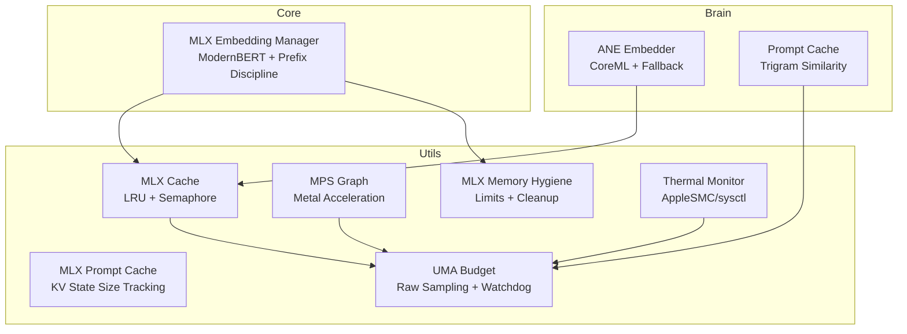

**Diagram sources**
- [brain/ane_embedder.py](file://brain/ane_embedder.py)
- [core/mlx_embeddings.py](file://core/mlx_embeddings.py)
- [utils/mlx_cache.py](file://utils/mlx_cache.py)
- [utils/mlx_prompt_cache.py](file://utils/mlx_prompt_cache.py)
- [utils/mps_graph.py](file://utils/mps_graph.py)
- [utils/uma_budget.py](file://utils/uma_budget.py)
- [utils/mlx_memory.py](file://utils/mlx_memory.py)
- [utils/thermal.py](file://utils/thermal.py)
- [brain/prompt_cache.py](file://brain/prompt_cache.py)

**Section sources**
- [brain/ane_embedder.py](file://brain/ane_embedder.py)
- [core/mlx_embeddings.py](file://core/mlx_embeddings.py)
- [utils/mlx_cache.py](file://utils/mlx_cache.py)
- [utils/mlx_prompt_cache.py](file://utils/mlx_prompt_cache.py)
- [utils/mps_graph.py](file://utils/mps_graph.py)
- [utils/uma_budget.py](file://utils/uma_budget.py)
- [utils/mlx_memory.py](file://utils/mlx_memory.py)
- [utils/thermal.py](file://utils/thermal.py)
- [brain/prompt_cache.py](file://brain/prompt_cache.py)
- [cache/budget_manager.py](file://cache/budget_manager.py)

## Core Components
- ANE Embedder: Provides CoreML-based embeddings with graceful fallback to MLX and a hash fallback path. Supports warmup and telemetry.
- MLX Embedding Manager: Loads ModernBERT via mlx-embeddings, applies task-aware prefixes, and manages normalization/truncation.
- MLX Cache: LRU cache for models/tokenizers with a shared semaphore to serialize inference and prevent OOM on M1 8GB.
- MLX Prompt Cache: LRU cache for prompt KV states with explicit size tracking and bounded growth.
- MPS Graph: PyObjC wrappers for Metal Performance Shaders Graph operations (dot products, matmul) with fallbacks.
- UMA Budget: Raw unified memory sampling, pressure classification, and watchdog with callbacks.
- MLX Memory Hygiene: Thin wrapper around MLX memory metrics, configurable limits, and cleanup routines.
- Thermal Monitor: Lightweight macOS thermal state reader with fail-open behavior.
- Prompt Cache (Brain): Trigram-based approximate similarity cache for prompt reuse.
- Budget Manager: Autonomous workflow resource control with stagnation detection and confidence thresholds.

**Section sources**
- [brain/ane_embedder.py](file://brain/ane_embedder.py)
- [core/mlx_embeddings.py](file://core/mlx_embeddings.py)
- [utils/mlx_cache.py](file://utils/mlx_cache.py)
- [utils/mlx_prompt_cache.py](file://utils/mlx_prompt_cache.py)
- [utils/mps_graph.py](file://utils/mps_graph.py)
- [utils/uma_budget.py](file://utils/uma_budget.py)
- [utils/mlx_memory.py](file://utils/mlx_memory.py)
- [utils/thermal.py](file://utils/thermal.py)
- [brain/prompt_cache.py](file://brain/prompt_cache.py)
- [cache/budget_manager.py](file://cache/budget_manager.py)

## Architecture Overview
The system integrates Apple Silicon-specific primitives:
- ANE/CoreML accelerates embedding and reranking when available.
- MLX handles model inference with strict memory limits and cleanup.
- MPS Graph accelerates numeric operations on Metal.
- UMA budget and thermal monitors enforce safe operation under memory pressure.
- Prompt caches reduce redundant computation and latency.

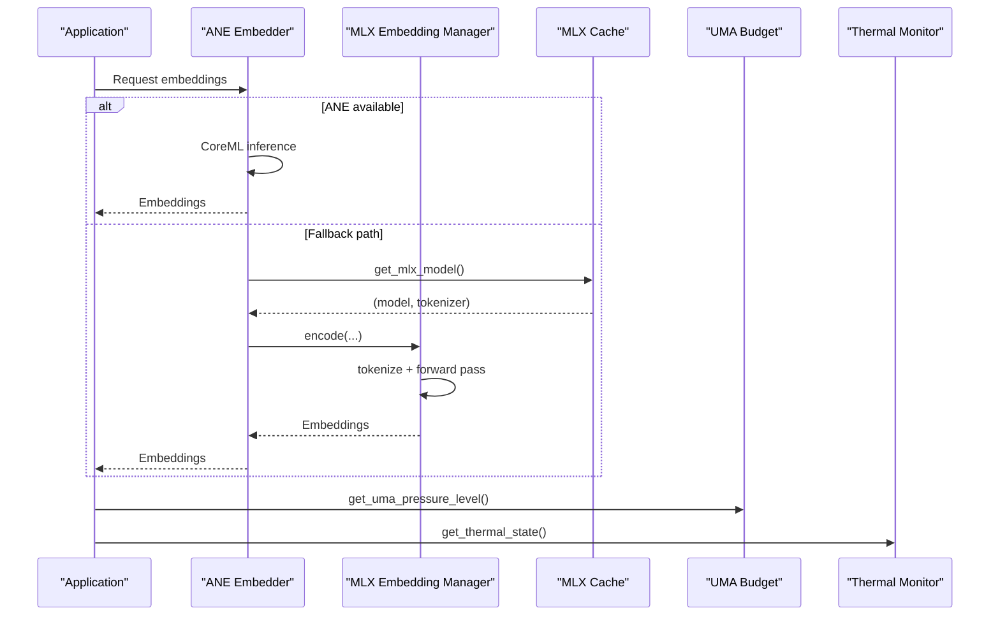

**Diagram sources**
- [brain/ane_embedder.py](file://brain/ane_embedder.py)
- [core/mlx_embeddings.py](file://core/mlx_embeddings.py)
- [utils/mlx_cache.py](file://utils/mlx_cache.py)
- [utils/uma_budget.py](file://utils/uma_budget.py)
- [utils/thermal.py](file://utils/thermal.py)

## Detailed Component Analysis

### ANE Pipeline Management
The ANE embedder provides:
- Lazy initialization and status telemetry
- CoreML model loading with fallback to MLX embedder and hash fallback
- Warmup routine to prime ANE cache
- Batch cosine similarity and cross-encoder reranking

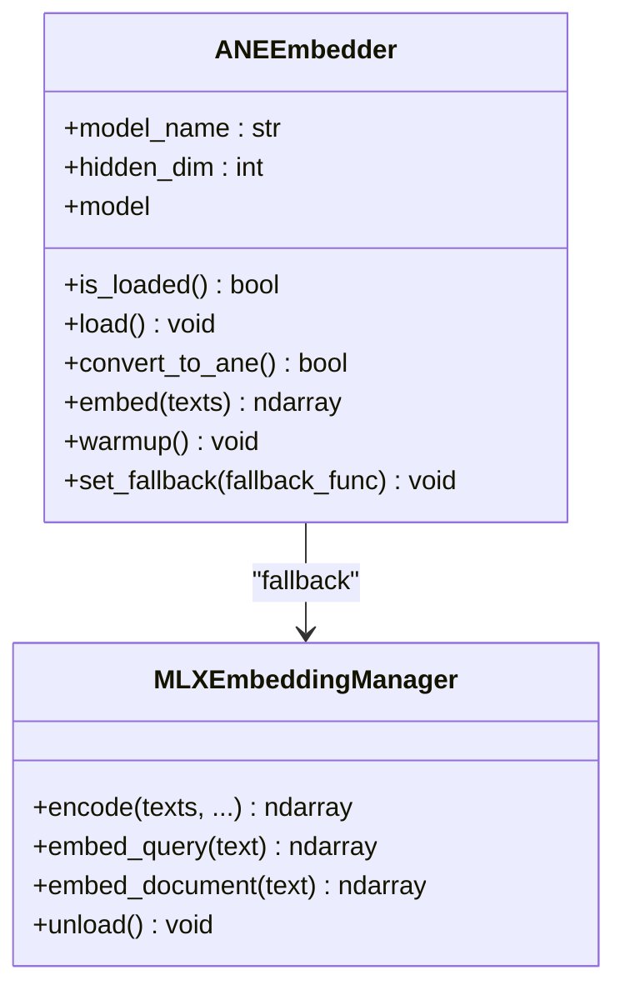

**Diagram sources**
- [brain/ane_embedder.py](file://brain/ane_embedder.py)
- [core/mlx_embeddings.py](file://core/mlx_embeddings.py)

**Section sources**
- [brain/ane_embedder.py](file://brain/ane_embedder.py)
- [core/mlx_embeddings.py](file://core/mlx_embeddings.py)

### MLX Cache Systems
Key features:
- LRU cache with max 2 models and eviction
- Shared semaphore to serialize inference and avoid OOM on M1 8GB
- Thread-safe async access with lazy initialization
- Cache hit/miss metrics and eviction statistics
- Cleanup helpers: sync and aggressive modes

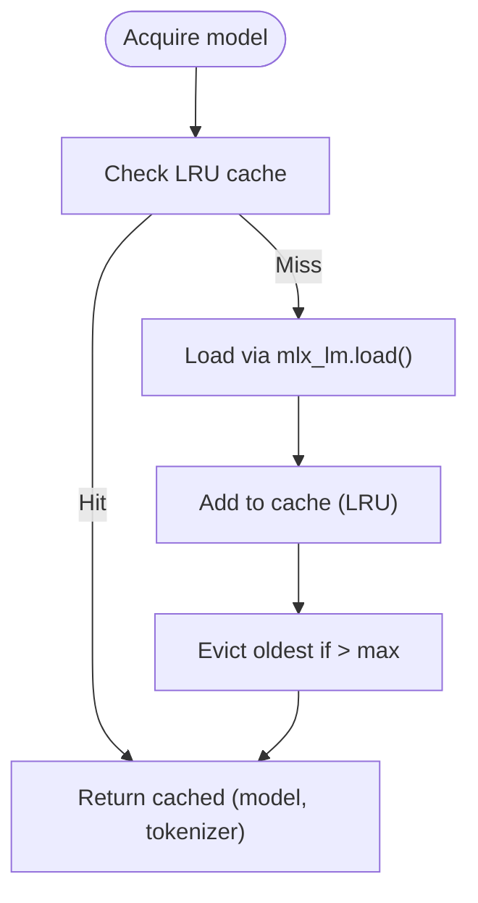

**Diagram sources**
- [utils/mlx_cache.py](file://utils/mlx_cache.py)

**Section sources**
- [utils/mlx_cache.py](file://utils/mlx_cache.py)

### MLX Prompt Cache (KV State)
- LRU cache for prompt cache states with explicit size tracking
- Bounded by max entries and total size bytes
- Async-safe with asyncio.Lock
- Tracks hits/misses and evictions

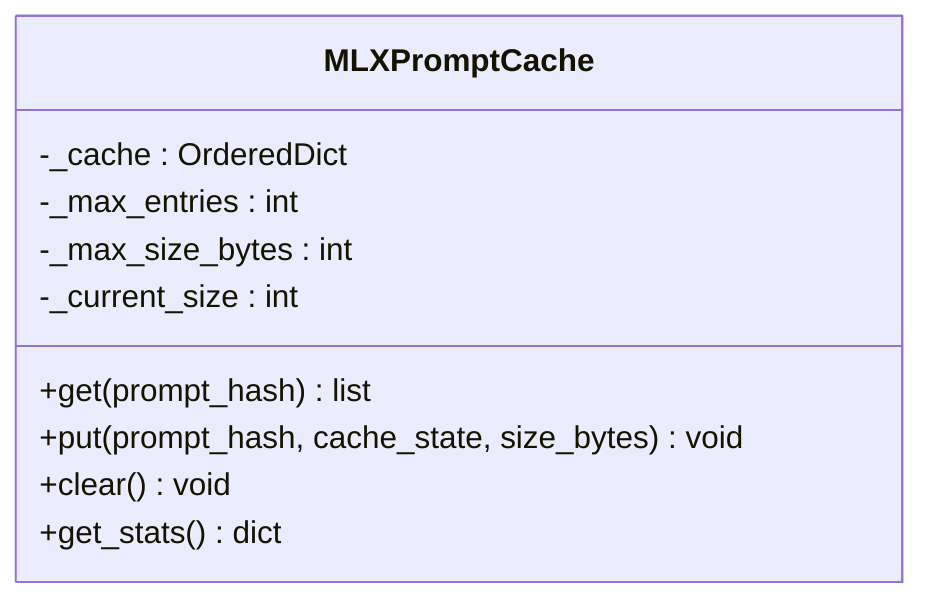

**Diagram sources**
- [utils/mlx_prompt_cache.py](file://utils/mlx_prompt_cache.py)

**Section sources**
- [utils/mlx_prompt_cache.py](file://utils/mlx_prompt_cache.py)

### MPS Graph Optimization
- PyObjC wrappers for MPSGraph and MPSImageDCT
- Batch dot product and matmul via MLX/Metal
- Fallbacks to numpy/scipy when unavailable
- Metal device memory info and ANE availability hints

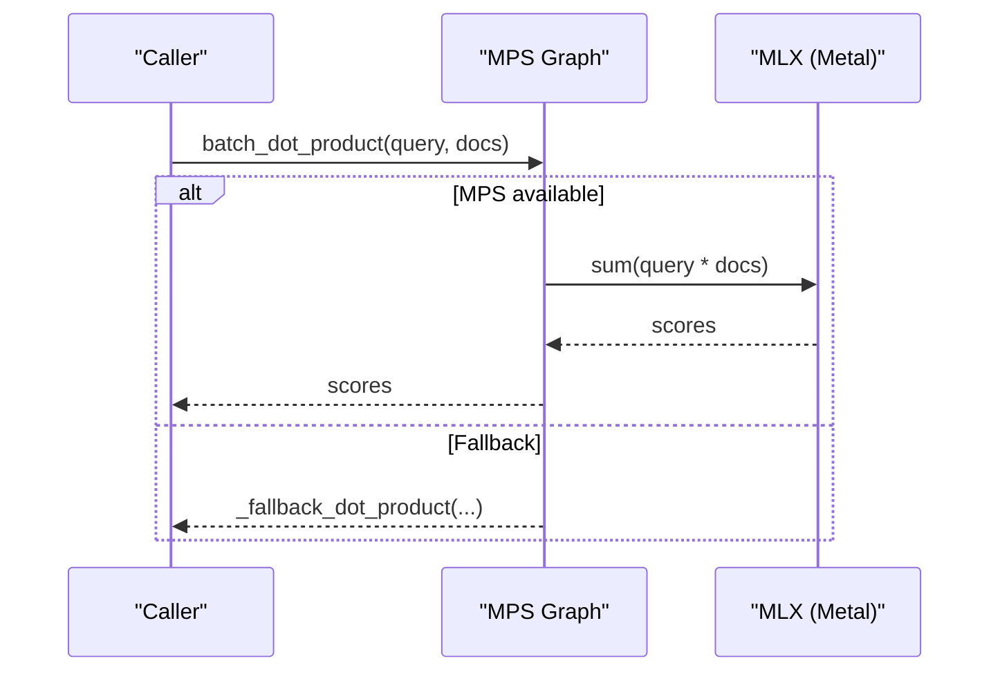

**Diagram sources**
- [utils/mps_graph.py](file://utils/mps_graph.py)

**Section sources**
- [utils/mps_graph.py](file://utils/mps_graph.py)

### UMA Budget Management
- Raw unified memory sampling (system RAM + MLX active)
- Pressure levels: normal/warn/critical/emergency
- Async watchdog with state-change callbacks and debounce
- Canonical thresholds for M1 8GB

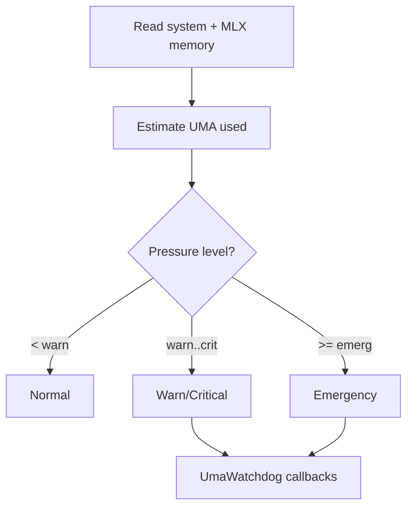

**Diagram sources**
- [utils/uma_budget.py](file://utils/uma_budget.py)

**Section sources**
- [utils/uma_budget.py](file://utils/uma_budget.py)

### Prompt Caching Strategies
- Approximate prompt similarity using trigram embeddings and cosine similarity
- TTL-based invalidation and LRU eviction
- System prompt KV cache for token prefix reuse

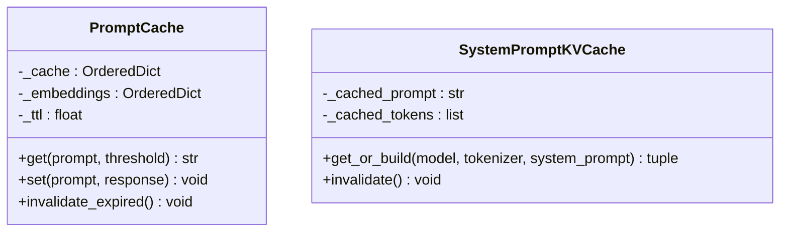

**Diagram sources**
- [brain/prompt_cache.py](file://brain/prompt_cache.py)

**Section sources**
- [brain/prompt_cache.py](file://brain/prompt_cache.py)

### Thermal-Aware Optimization
- Reads macOS thermal state via IOKit or sysctl
- Provides warn/critical thresholds for throttling decisions
- Integrates with UMA budgeting for responsive mitigation

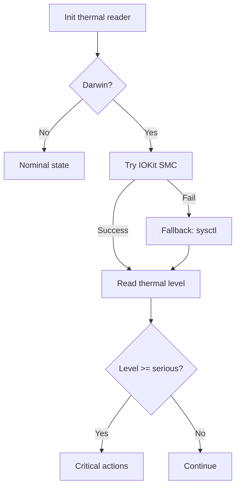

**Diagram sources**
- [utils/thermal.py](file://utils/thermal.py)

**Section sources**
- [utils/thermal.py](file://utils/thermal.py)

### Model Compilation and Memory Allocation Patterns
- MLX memory limits configured via Metal APIs (cache and wired limits)
- Cleanup order: Python GC → flush GPU queue → clear Metal cache
- Aggressive cleanup temporarily lowers cache limit to defragment
- Stream guard ensures Metal buffers are scoped to minimize peak usage

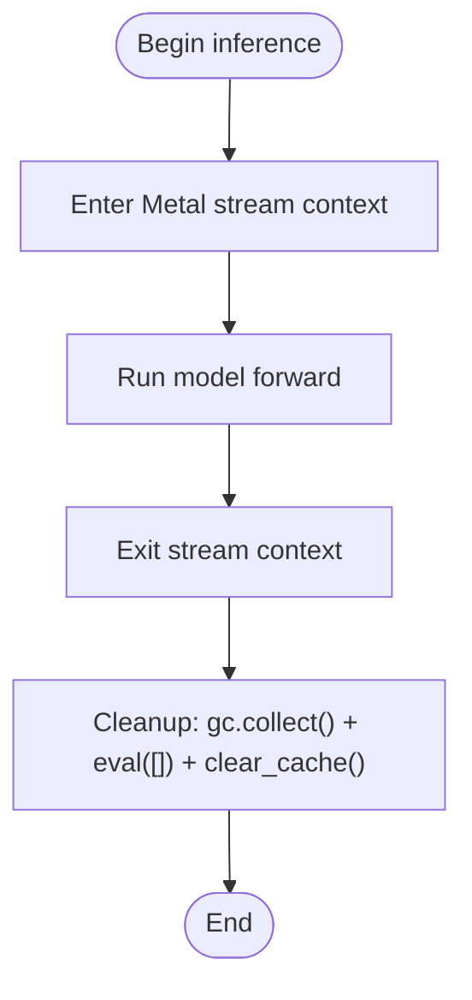

**Diagram sources**
- [core/mlx_embeddings.py](file://core/mlx_embeddings.py)
- [utils/mlx_cache.py](file://utils/mlx_cache.py)
- [utils/mlx_memory.py](file://utils/mlx_memory.py)

**Section sources**
- [core/mlx_embeddings.py](file://core/mlx_embeddings.py)
- [utils/mlx_cache.py](file://utils/mlx_cache.py)
- [utils/mlx_memory.py](file://utils/mlx_memory.py)

### Performance Tuning Techniques
- Use ANE/CoreML when available; enable warmup to prime caches
- Serialize inference with the MLX semaphore to avoid OOM
- Configure Metal cache/wired limits to leave headroom for model weights
- Apply task-aware prefixes for ModernBERT to improve retrieval quality
- Use prompt caches to avoid repeated tokenization and KV recomputation
- Monitor UMA pressure and thermal state; trigger cleanup on warn/critical
- Prefer Matryoshka representation learning (truncated embeddings) for downstream tasks

**Section sources**
- [brain/ane_embedder.py](file://brain/ane_embedder.py)
- [utils/mlx_cache.py](file://utils/mlx_cache.py)
- [utils/mlx_memory.py](file://utils/mlx_memory.py)
- [core/mlx_embeddings.py](file://core/mlx_embeddings.py)
- [utils/uma_budget.py](file://utils/uma_budget.py)
- [utils/thermal.py](file://utils/thermal.py)
- [brain/prompt_cache.py](file://brain/prompt_cache.py)

## Dependency Analysis
- ANE embedder depends on CoreML/pyobjc and optionally MLX embedder
- MLX embedding manager depends on mlx-embeddings and MLX core
- MLX cache depends on mlx_lm and provides a shared semaphore
- MLX memory utilities depend on MLX Metal APIs
- UMA budget depends on psutil and MLX memory APIs
- Thermal monitor depends on IOKit/sysctl
- Prompt caches are standalone but integrate with brain workflows

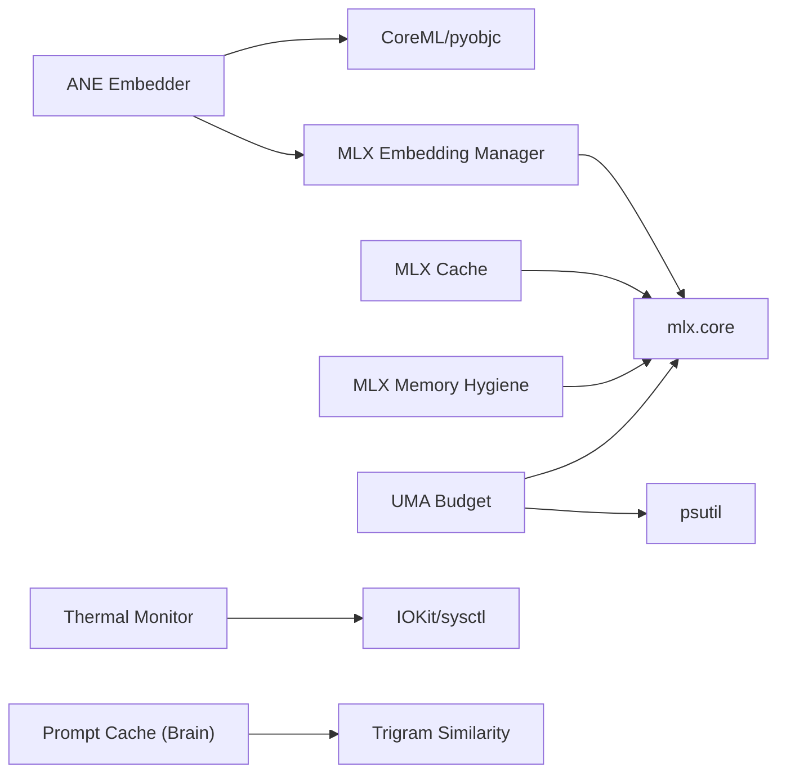

**Diagram sources**
- [brain/ane_embedder.py](file://brain/ane_embedder.py)
- [core/mlx_embeddings.py](file://core/mlx_embeddings.py)
- [utils/mlx_cache.py](file://utils/mlx_cache.py)
- [utils/mlx_memory.py](file://utils/mlx_memory.py)
- [utils/uma_budget.py](file://utils/uma_budget.py)
- [utils/thermal.py](file://utils/thermal.py)
- [brain/prompt_cache.py](file://brain/prompt_cache.py)

**Section sources**
- [brain/ane_embedder.py](file://brain/ane_embedder.py)
- [core/mlx_embeddings.py](file://core/mlx_embeddings.py)
- [utils/mlx_cache.py](file://utils/mlx_cache.py)
- [utils/mlx_memory.py](file://utils/mlx_memory.py)
- [utils/uma_budget.py](file://utils/uma_budget.py)
- [utils/thermal.py](file://utils/thermal.py)
- [brain/prompt_cache.py](file://brain/prompt_cache.py)

## Performance Considerations
- Memory budgeting: Keep MLX Metal cache/wired limits at 2.5 GiB each on M1 8GB to avoid contention with model weight loading.
- Inference serialization: Use the MLX semaphore to prevent concurrent heavy loads.
- Stream scoping: Guard Metal operations with a stream context to release buffers promptly.
- Prompt reuse: Enable MLX prompt cache and brain prompt cache to reduce tokenization overhead.
- Pressure-aware cleanup: Trigger MLX cleanup on warn/critical UMA pressure; escalate to aggressive cleanup on emergency.
- Thermal throttling: Reduce workload when thermal state reaches “serious” or “critical.”

[No sources needed since this section provides general guidance]

## Troubleshooting Guide
Common issues and remedies:
- MLX not available: The system fails open; ensure MLX is installed and importable.
- ANE unavailable: The embedder falls back to MLX or hash fallback; verify CoreML/pyobjc installation.
- UMA pressure spikes: Watchdog triggers cleanup; consider reducing concurrency or increasing headroom.
- Thermal throttling: Reduce workload or allow cooling; monitor thermal state.
- OOM during inference: Lower Metal cache limits, enable cleanup decorators, and use smaller batch sizes.

**Section sources**
- [utils/mlx_cache.py](file://utils/mlx_cache.py)
- [utils/uma_budget.py](file://utils/uma_budget.py)
- [utils/thermal.py](file://utils/thermal.py)
- [brain/ane_embedder.py](file://brain/ane_embedder.py)

## Conclusion
The AI/ML optimization toolkit leverages Apple Silicon’s unified memory and hardware accelerators to deliver robust, memory-aware inference. By combining ANE/CoreML acceleration, MLX memory hygiene, MPS Graph numeric kernels, UMA budgeting, and thermal monitoring, the system maintains stability and performance under real-world constraints. Prompt caching and task-aware embedding further improve throughput and quality.

[No sources needed since this section summarizes without analyzing specific files]