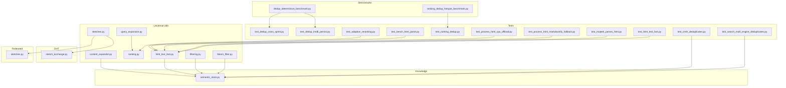
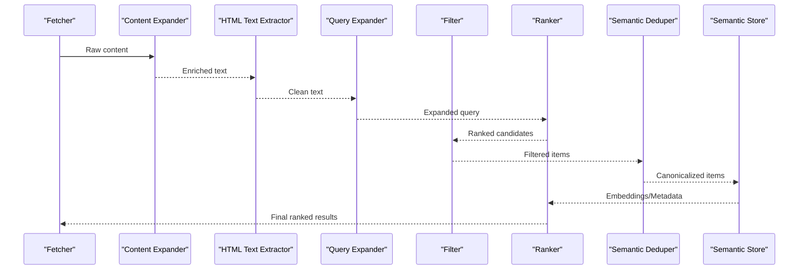
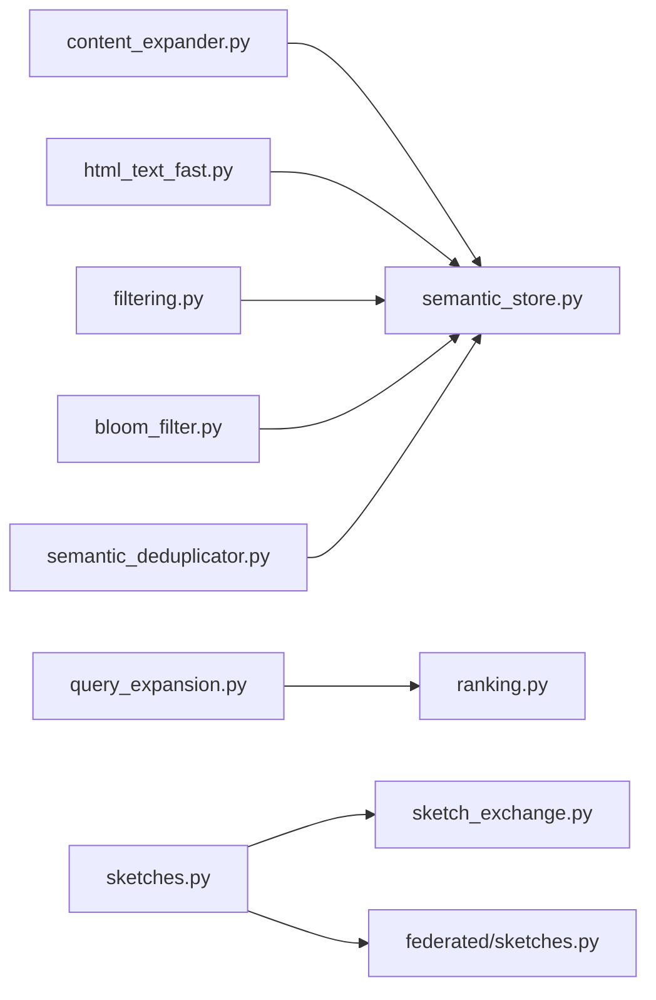

# Data Processing Tools

<cite>
**Referenced Files in This Document**
- [content_expander.py](file://universal/utils/content_expander.py)
- [query_expansion.py](file://universal/utils/query_expansion.py)
- [ranking.py](file://universal/utils/ranking.py)
- [html_text_fast.py](file://universal/utils/html_text_fast.py)
- [sketches.py](file://universal/utils/sketches.py)
- [sketch_exchange.py](file://universal/dht/sketch_exchange.py)
- [sketches.py](file://universal/federated/sketches.py)
- [filtering.py](file://universal/utils/filtering.py)
- [bloom_filter.py](file://universal/utils/bloom_filter.py)
- [semantic_deduplicator.py](file://universal/semantic_deduplicator.py)
- [semantic_store.py](file://universal/knowledge/semantic_store.py)
- [dedup_determinism_benchmark.py](file://universal/benchmarks/dedup_determinism_benchmark.py)
- [ranking_dedup_hotspot_benchmark.py](file://universal/benchmarks/ranking_dedup_hotspot_benchmark.py)
- [test_dedup_cross_sprint.py](file://universal/tests/probe_8ra/test_dedup_cross_sprint.py)
- [test_dedup_lmdb_persist.py](file://universal/tests/probe_8ra/test_dedup_lmdb_persist.py)
- [test_crtsh_deduplicates.py](file://universal/tests/probe_8vb/test_crtsh_deduplicates.py)
- [test_search_multi_engine_deduplicates.py](file://universal/tests/probe_8vb/test_search_multi_engine_deduplicates.py)
- [test_ranking_dedup.py](file://universal/tests/probe_f214opt_ranking_dedup/test_ranking_dedup.py)
- [test_adaptive_reranking.py](file://universal/tests/test_sprint76/test_adaptive_reranking.py)
- [test_bench_html_parse.py](file://universal/tests/probe_8c0/test_bench_html_parse.py)
- [test_process_html_cpu_offload.py](file://universal/tests/probe_8qb/test_process_html_cpu_offload.py)
- [test_process_html_markdownify_fallback.py](file://universal/tests/probe_8qb/test_process_html_markdownify_fallback.py)
- [test_mojeek_parses_html.py](file://universal/tests/probe_8vb/test_mojeek_parses_html.py)
- [test_html_text_fast.py](file://universal/tests/probe_f214opt_selectolax/test_html_text_fast.py)
</cite>

## Table of Contents
1. [Introduction](#introduction)
2. [Project Structure](#project-structure)
3. [Core Components](#core-components)
4. [Architecture Overview](#architecture-overview)
5. [Detailed Component Analysis](#detailed-component-analysis)
6. [Dependency Analysis](#dependency-analysis)
7. [Performance Considerations](#performance-considerations)
8. [Troubleshooting Guide](#troubleshooting-guide)
9. [Conclusion](#conclusion)
10. [Appendices](#appendices)

## Introduction
This document describes the data processing tools and algorithms that power content ingestion, enrichment, deduplication, filtering, ranking, and semantic analysis across the system. It covers:
- Content expansion utilities for enriching raw text
- Deduplication mechanisms for canonicalization and persistence
- Filtering systems for noise reduction and relevance
- Semantic analysis tools for similarity and grounding
- HTML text extraction utilities optimized for speed and robustness
- Query expansion techniques for retrieval
- Ranking algorithms for relevance ordering
- Sketch-based data structures for scalable approximate set operations
It also explains integration with the knowledge management system, optimization strategies, custom algorithm development patterns, and operational considerations for data quality, memory efficiency, and scalability.

## Project Structure
The data processing stack is primarily located under universal/utils and universal/knowledge, with specialized components distributed across dht and federated modules. Benchmarks and tests validate correctness, performance, and cross-sprint determinism.

**Diagram sources**
- [content_expander.py](file://universal/utils/content_expander.py)
- [query_expansion.py](file://universal/utils/query_expansion.py)
- [ranking.py](file://universal/utils/ranking.py)
- [html_text_fast.py](file://universal/utils/html_text_fast.py)
- [sketches.py](file://universal/utils/sketches.py)
- [sketch_exchange.py](file://universal/dht/sketch_exchange.py)
- [sketches.py](file://universal/federated/sketches.py)
- [filtering.py](file://universal/utils/filtering.py)
- [bloom_filter.py](file://universal/utils/bloom_filter.py)
- [semantic_store.py](file://universal/knowledge/semantic_store.py)
- [dedup_determinism_benchmark.py](file://universal/benchmarks/dedup_determinism_benchmark.py)
- [ranking_dedup_hotspot_benchmark.py](file://universal/benchmarks/ranking_dedup_hotspot_benchmark.py)
- [test_dedup_cross_sprint.py](file://universal/tests/probe_8ra/test_dedup_cross_sprint.py)
- [test_dedup_lmdb_persist.py](file://universal/tests/probe_8ra/test_dedup_lmdb_persist.py)
- [test_crtsh_deduplicates.py](file://universal/tests/probe_8vb/test_crtsh_deduplicates.py)
- [test_search_multi_engine_deduplicates.py](file://universal/tests/probe_8vb/test_search_multi_engine_deduplicates.py)
- [test_ranking_dedup.py](file://universal/tests/probe_f214opt_ranking_dedup/test_ranking_dedup.py)
- [test_adaptive_reranking.py](file://universal/tests/test_sprint76/test_adaptive_reranking.py)
- [test_bench_html_parse.py](file://universal/tests/probe_8c0/test_bench_html_parse.py)
- [test_process_html_cpu_offload.py](file://universal/tests/probe_8qb/test_process_html_cpu_offload.py)
- [test_process_html_markdownify_fallback.py](file://universal/tests/probe_8qb/test_process_html_markdownify_fallback.py)
- [test_mojeek_parses_html.py](file://universal/tests/probe_8vb/test_mojeek_parses_html.py)
- [test_html_text_fast.py](file://universal/tests/probe_f214opt_selectolax/test_html_text_fast.py)

**Section sources**
- [content_expander.py](file://universal/utils/content_expander.py)
- [query_expansion.py](file://universal/utils/query_expansion.py)
- [ranking.py](file://universal/utils/ranking.py)
- [html_text_fast.py](file://universal/utils/html_text_fast.py)
- [sketches.py](file://universal/utils/sketches.py)
- [sketch_exchange.py](file://universal/dht/sketch_exchange.py)
- [sketches.py](file://universal/federated/sketches.py)
- [filtering.py](file://universal/utils/filtering.py)
- [bloom_filter.py](file://universal/utils/bloom_filter.py)
- [semantic_store.py](file://universal/knowledge/semantic_store.py)
- [dedup_determinism_benchmark.py](file://universal/benchmarks/dedup_determinism_benchmark.py)
- [ranking_dedup_hotspot_benchmark.py](file://universal/benchmarks/ranking_dedup_hotspot_benchmark.py)
- [test_dedup_cross_sprint.py](file://universal/tests/probe_8ra/test_dedup_cross_sprint.py)
- [test_dedup_lmdb_persist.py](file://universal/tests/probe_8ra/test_dedup_lmdb_persist.py)
- [test_crtsh_deduplicates.py](file://universal/tests/probe_8vb/test_crtsh_deduplicates.py)
- [test_search_multi_engine_deduplicates.py](file://universal/tests/probe_8vb/test_search_multi_engine_deduplicates.py)
- [test_ranking_dedup.py](file://universal/tests/probe_f214opt_ranking_dedup/test_ranking_dedup.py)
- [test_adaptive_reranking.py](file://universal/tests/test_sprint76/test_adaptive_reranking.py)
- [test_bench_html_parse.py](file://universal/tests/probe_8c0/test_bench_html_parse.py)
- [test_process_html_cpu_offload.py](file://universal/tests/probe_8qb/test_process_html_cpu_offload.py)
- [test_process_html_markdownify_fallback.py](file://universal/tests/probe_8qb/test_process_html_markdownify_fallback.py)
- [test_mojeek_parses_html.py](file://universal/tests/probe_8vb/test_mojeek_parses_html.py)
- [test_html_text_fast.py](file://universal/tests/probe_f214opt_selectolax/test_html_text_fast.py)

## Core Components
- Content Expansion: Enriches raw text with contextual signals and metadata to improve downstream processing.
- Query Expansion: Augments user queries to capture broader semantics and synonyms for improved recall.
- Ranking: Computes relevance scores and reorders results using learned or rule-based models.
- HTML Text Extraction: Robustly extracts textual content from HTML with fallbacks and CPU offloading support.
- Filtering: Applies filters (e.g., Bloom filters, hotspots, ownership) to reduce false positives and irrelevant items.
- Sketch-Based Structures: Enables scalable approximate set operations via Count-Min Sketch and similar structures.
- Semantic Deduplication: Detects near-duplicates using embeddings and similarity thresholds.
- Semantic Store: Persistent storage and retrieval of semantic vectors and metadata.

**Section sources**
- [content_expander.py](file://universal/utils/content_expander.py)
- [query_expansion.py](file://universal/utils/query_expansion.py)
- [ranking.py](file://universal/utils/ranking.py)
- [html_text_fast.py](file://universal/utils/html_text_fast.py)
- [sketches.py](file://universal/utils/sketches.py)
- [filtering.py](file://universal/utils/filtering.py)
- [semantic_deduplicator.py](file://universal/semantic_deduplicator.py)
- [semantic_store.py](file://universal/knowledge/semantic_store.py)

## Architecture Overview
The data processing pipeline integrates ingestion, enrichment, deduplication, filtering, ranking, and semantic grounding. Benchmarks and tests ensure correctness and performance across scenarios.

**Diagram sources**
- [content_expander.py](file://universal/utils/content_expander.py)
- [html_text_fast.py](file://universal/utils/html_text_fast.py)
- [query_expansion.py](file://universal/utils/query_expansion.py)
- [filtering.py](file://universal/utils/filtering.py)
- [ranking.py](file://universal/utils/ranking.py)
- [semantic_deduplicator.py](file://universal/semantic_deduplicator.py)
- [semantic_store.py](file://universal/knowledge/semantic_store.py)

## Detailed Component Analysis

### Content Expansion Utilities
Purpose:
- Expand raw content with additional signals to improve downstream tasks like ranking and semantic analysis.

Key behaviors:
- Normalization and metadata enrichment
- Structured signal injection for richer embeddings

Usage patterns:
- Apply after initial parsing and before semantic indexing
- Integrate with batch processors for throughput

Implementation references:
- [content_expander.py](file://universal/utils/content_expander.py)

**Section sources**
- [content_expander.py](file://universal/utils/content_expander.py)

### Query Expansion Techniques
Purpose:
- Broaden user intent to capture synonyms and related terms for improved recall.

Key behaviors:
- Term expansion using lexical resources
- Optional entity-aware expansion

Usage patterns:
- Prepend to ranking pipeline
- Combine with BM25 or neural reranking

Implementation references:
- [query_expansion.py](file://universal/utils/query_expansion.py)

**Section sources**
- [query_expansion.py](file://universal/utils/query_expansion.py)

### Ranking Algorithms
Purpose:
- Compute relevance scores and reorder results.

Key behaviors:
- Hybrid scoring (e.g., BM25 + ML-based)
- Adaptive reranking based on feedback

Usage patterns:
- Post-filtering, pre-deduplication
- Streaming re-ranking for latency-sensitive paths

Implementation references:
- [ranking.py](file://universal/utils/ranking.py)
- [test_adaptive_reranking.py](file://universal/tests/test_sprint76/test_adaptive_reranking.py)
- [test_ranking_dedup.py](file://universal/tests/probe_f214opt_ranking_dedup/test_ranking_dedup.py)

**Section sources**
- [ranking.py](file://universal/utils/ranking.py)
- [test_adaptive_reranking.py](file://universal/tests/test_sprint76/test_adaptive_reranking.py)
- [test_ranking_dedup.py](file://universal/tests/probe_f214opt_ranking_dedup/test_ranking_dedup.py)

### HTML Text Extraction
Purpose:
- Extract clean text from HTML pages with robust fallbacks and CPU offloading.

Key behaviors:
- Fast parsing with Selectolax-like logic
- Markdownify fallback for malformed content
- CPU offload for heavy pages

Usage patterns:
- Pre-ranker enrichment
- Batch processing with backpressure controls

Implementation references:
- [html_text_fast.py](file://universal/utils/html_text_fast.py)
- [test_bench_html_parse.py](file://universal/tests/probe_8c0/test_bench_html_parse.py)
- [test_process_html_cpu_offload.py](file://universal/tests/probe_8qb/test_process_html_cpu_offload.py)
- [test_process_html_markdownify_fallback.py](file://universal/tests/probe_8qb/test_process_html_markdownify_fallback.py)
- [test_mojeek_parses_html.py](file://universal/tests/probe_8vb/test_mojeek_parses_html.py)
- [test_html_text_fast.py](file://universal/tests/probe_f214opt_selectolax/test_html_text_fast.py)

**Section sources**
- [html_text_fast.py](file://universal/utils/html_text_fast.py)
- [test_bench_html_parse.py](file://universal/tests/probe_8c0/test_bench_html_parse.py)
- [test_process_html_cpu_offload.py](file://universal/tests/probe_8qb/test_process_html_cpu_offload.py)
- [test_process_html_markdownify_fallback.py](file://universal/tests/probe_8qb/test_process_html_markdownify_fallback.py)
- [test_mojeek_parses_html.py](file://universal/tests/probe_8vb/test_mojeek_parses_html.py)
- [test_html_text_fast.py](file://universal/tests/probe_f214opt_selectolax/test_html_text_fast.py)

### Filtering Systems
Purpose:
- Reduce noise and irrelevant items using deterministic and probabilistic filters.

Key behaviors:
- Bloom filter for candidate pruning
- Hotspot/impact/ownership filters for domain-specific reduction

Usage patterns:
- Early-stage filtering to reduce compute
- Composable filter chains

Implementation references:
- [filtering.py](file://universal/utils/filtering.py)
- [bloom_filter.py](file://universal/utils/bloom_filter.py)
- [test_crtsh_deduplicates.py](file://universal/tests/probe_8vb/test_crtsh_deduplicates.py)
- [test_search_multi_engine_deduplicates.py](file://universal/tests/probe_8vb/test_search_multi_engine_deduplicates.py)

**Section sources**
- [filtering.py](file://universal/utils/filtering.py)
- [bloom_filter.py](file://universal/utils/bloom_filter.py)
- [test_crtsh_deduplicates.py](file://universal/tests/probe_8vb/test_crtsh_deduplicates.py)
- [test_search_multi_engine_deduplicates.py](file://universal/tests/probe_8vb/test_search_multi_engine_deduplicates.py)

### Semantic Analysis Tools
Purpose:
- Detect near-duplicates and ground content semantically.

Key behaviors:
- Embedding-based similarity detection
- Persistent canonicalization via semantic store

Usage patterns:
- Post-ranking, pre-export
- Incremental updates to semantic store

Implementation references:
- [semantic_deduplicator.py](file://universal/semantic_deduplicator.py)
- [semantic_store.py](file://universal/knowledge/semantic_store.py)
- [test_dedup_cross_sprint.py](file://universal/tests/probe_8ra/test_dedup_cross_sprint.py)
- [test_dedup_lmdb_persist.py](file://universal/tests/probe_8ra/test_dedup_lmdb_persist.py)

**Section sources**
- [semantic_deduplicator.py](file://universal/semantic_deduplicator.py)
- [semantic_store.py](file://universal/knowledge/semantic_store.py)
- [test_dedup_cross_sprint.py](file://universal/tests/probe_8ra/test_dedup_cross_sprint.py)
- [test_dedup_lmdb_persist.py](file://universal/tests/probe_8ra/test_dedup_lmdb_persist.py)

### Sketch-Based Data Structures
Purpose:
- Enable scalable approximate set operations (e.g., cardinality estimation, frequency estimation).

Key behaviors:
- Count-Min Sketch and similar structures
- Distributed sketch exchange and federated aggregation

Usage patterns:
- Real-time cardinality estimates
- Federated analytics and anomaly detection

Implementation references:
- [sketches.py](file://universal/utils/sketches.py)
- [sketch_exchange.py](file://universal/dht/sketch_exchange.py)
- [sketches.py](file://universal/federated/sketches.py)

**Section sources**
- [sketches.py](file://universal/utils/sketches.py)
- [sketch_exchange.py](file://universal/dht/sketch_exchange.py)
- [sketches.py](file://universal/federated/sketches.py)

## Dependency Analysis
The following diagram shows module-level dependencies among core data processing utilities.

**Diagram sources**
- [content_expander.py](file://universal/utils/content_expander.py)
- [query_expansion.py](file://universal/utils/query_expansion.py)
- [ranking.py](file://universal/utils/ranking.py)
- [html_text_fast.py](file://universal/utils/html_text_fast.py)
- [filtering.py](file://universal/utils/filtering.py)
- [bloom_filter.py](file://universal/utils/bloom_filter.py)
- [semantic_deduplicator.py](file://universal/semantic_deduplicator.py)
- [semantic_store.py](file://universal/knowledge/semantic_store.py)
- [sketches.py](file://universal/utils/sketches.py)
- [sketch_exchange.py](file://universal/dht/sketch_exchange.py)
- [sketches.py](file://universal/federated/sketches.py)

**Section sources**
- [content_expander.py](file://universal/utils/content_expander.py)
- [query_expansion.py](file://universal/utils/query_expansion.py)
- [ranking.py](file://universal/utils/ranking.py)
- [html_text_fast.py](file://universal/utils/html_text_fast.py)
- [filtering.py](file://universal/utils/filtering.py)
- [bloom_filter.py](file://universal/utils/bloom_filter.py)
- [semantic_deduplicator.py](file://universal/semantic_deduplicator.py)
- [semantic_store.py](file://universal/knowledge/semantic_store.py)
- [sketches.py](file://universal/utils/sketches.py)
- [sketch_exchange.py](file://universal/dht/sketch_exchange.py)
- [sketches.py](file://universal/federated/sketches.py)

## Performance Considerations
- HTML extraction:
  - Use CPU offloading for heavy pages to avoid blocking the main thread.
  - Prefer fast parsers with markdownify fallbacks for resilience.
- Ranking:
  - Apply adaptive reranking to reduce latency while maintaining quality.
  - Combine BM25-style features with lightweight ML rerankers.
- Deduplication:
  - Use Bloom filters early to prune candidates.
  - Persist canonical forms to disk-backed stores for cross-sprint determinism.
- Sketches:
  - Tune sketch parameters (width, depth) for desired error-rate vs memory trade-offs.
  - Distribute sketch updates via sketch exchange protocols.
- Memory efficiency:
  - Batch process content to amortize overhead.
  - Use streaming pipelines with backpressure controls.
- Scalability:
  - Horizontal sketch aggregation across nodes.
  - Partition semantic stores by domain/time slices.

[No sources needed since this section provides general guidance]

## Troubleshooting Guide
Common issues and resolutions:
- HTML parsing failures:
  - Validate fallback logic and ensure markdownify fallback is triggered.
  - Monitor CPU offload thresholds to prevent overload.
- Ranking instability:
  - Verify adaptive reranking parameters and feedback loops.
  - Confirm query expansion consistency across runs.
- Deduplication drift:
  - Audit cross-sprint persistence and canonicalization logic.
  - Check LMDB durability and transaction boundaries.
- Filter effectiveness:
  - Tune Bloom filter false positive rates and filter thresholds.
  - Validate hotspot/ownership filters against domain heuristics.
- Sketch accuracy:
  - Calibrate sketch parameters and monitor cardinality estimation errors.
  - Ensure sketch exchange synchronization across peers.

Validation references:
- [test_bench_html_parse.py](file://universal/tests/probe_8c0/test_bench_html_parse.py)
- [test_process_html_cpu_offload.py](file://universal/tests/probe_8qb/test_process_html_cpu_offload.py)
- [test_process_html_markdownify_fallback.py](file://universal/tests/probe_8qb/test_process_html_markdownify_fallback.py)
- [test_mojeek_parses_html.py](file://universal/tests/probe_8vb/test_mojeek_parses_html.py)
- [test_html_text_fast.py](file://universal/tests/probe_f214opt_selectolax/test_html_text_fast.py)
- [test_adaptive_reranking.py](file://universal/tests/test_sprint76/test_adaptive_reranking.py)
- [test_dedup_cross_sprint.py](file://universal/tests/probe_8ra/test_dedup_cross_sprint.py)
- [test_dedup_lmdb_persist.py](file://universal/tests/probe_8ra/test_dedup_lmdb_persist.py)
- [test_crtsh_deduplicates.py](file://universal/tests/probe_8vb/test_crtsh_deduplicates.py)
- [test_search_multi_engine_deduplicates.py](file://universal/tests/probe_8vb/test_search_multi_engine_deduplicates.py)
- [test_ranking_dedup.py](file://universal/tests/probe_f214opt_ranking_dedup/test_ranking_dedup.py)

**Section sources**
- [test_bench_html_parse.py](file://universal/tests/probe_8c0/test_bench_html_parse.py)
- [test_process_html_cpu_offload.py](file://universal/tests/probe_8qb/test_process_html_cpu_offload.py)
- [test_process_html_markdownify_fallback.py](file://universal/tests/probe_8qb/test_process_html_markdownify_fallback.py)
- [test_mojeek_parses_html.py](file://universal/tests/probe_8vb/test_mojeek_parses_html.py)
- [test_html_text_fast.py](file://universal/tests/probe_f214opt_selectolax/test_html_text_fast.py)
- [test_adaptive_reranking.py](file://universal/tests/test_sprint76/test_adaptive_reranking.py)
- [test_dedup_cross_sprint.py](file://universal/tests/probe_8ra/test_dedup_cross_sprint.py)
- [test_dedup_lmdb_persist.py](file://universal/tests/probe_8ra/test_dedup_lmdb_persist.py)
- [test_crtsh_deduplicates.py](file://universal/tests/probe_8vb/test_crtsh_deduplicates.py)
- [test_search_multi_engine_deduplicates.py](file://universal/tests/probe_8vb/test_search_multi_engine_deduplicates.py)
- [test_ranking_dedup.py](file://universal/tests/probe_f214opt_ranking_dedup/test_ranking_dedup.py)

## Conclusion
The data processing toolkit combines efficient extraction, robust filtering, adaptive ranking, and scalable semantic and sketch-based structures. Benchmarks and tests ensure correctness and performance across realistic workloads. Integrating these components into a cohesive pipeline yields high-quality, memory-efficient, and scalable content processing suitable for knowledge management and retrieval tasks.

[No sources needed since this section summarizes without analyzing specific files]

## Appendices

### Benchmarks and Tests Index
- Determinism and cross-sprint dedup:
  - [dedup_determinism_benchmark.py](file://universal/benchmarks/dedup_determinism_benchmark.py)
  - [test_dedup_cross_sprint.py](file://universal/tests/probe_8ra/test_dedup_cross_sprint.py)
  - [test_dedup_lmdb_persist.py](file://universal/tests/probe_8ra/test_dedup_lmdb_persist.py)
- Ranking and dedup hotspots:
  - [ranking_dedup_hotspot_benchmark.py](file://universal/benchmarks/ranking_dedup_hotspot_benchmark.py)
  - [test_ranking_dedup.py](file://universal/tests/probe_f214opt_ranking_dedup/test_ranking_dedup.py)
- HTML parsing and extraction:
  - [test_bench_html_parse.py](file://universal/tests/probe_8c0/test_bench_html_parse.py)
  - [test_process_html_cpu_offload.py](file://universal/tests/probe_8qb/test_process_html_cpu_offload.py)
  - [test_process_html_markdownify_fallback.py](file://universal/tests/probe_8qb/test_process_html_markdownify_fallback.py)
  - [test_mojeek_parses_html.py](file://universal/tests/probe_8vb/test_mojeek_parses_html.py)
  - [test_html_text_fast.py](file://universal/tests/probe_f214opt_selectolax/test_html_text_fast.py)

**Section sources**
- [dedup_determinism_benchmark.py](file://universal/benchmarks/dedup_determinism_benchmark.py)
- [ranking_dedup_hotspot_benchmark.py](file://universal/benchmarks/ranking_dedup_hotspot_benchmark.py)
- [test_dedup_cross_sprint.py](file://universal/tests/probe_8ra/test_dedup_cross_sprint.py)
- [test_dedup_lmdb_persist.py](file://universal/tests/probe_8ra/test_dedup_lmdb_persist.py)
- [test_ranking_dedup.py](file://universal/tests/probe_f214opt_ranking_dedup/test_ranking_dedup.py)
- [test_bench_html_parse.py](file://universal/tests/probe_8c0/test_bench_html_parse.py)
- [test_process_html_cpu_offload.py](file://universal/tests/probe_8qb/test_process_html_cpu_offload.py)
- [test_process_html_markdownify_fallback.py](file://universal/tests/probe_8qb/test_process_html_markdownify_fallback.py)
- [test_mojeek_parses_html.py](file://universal/tests/probe_8vb/test_mojeek_parses_html.py)
- [test_html_text_fast.py](file://universal/tests/probe_f214opt_selectolax/test_html_text_fast.py)