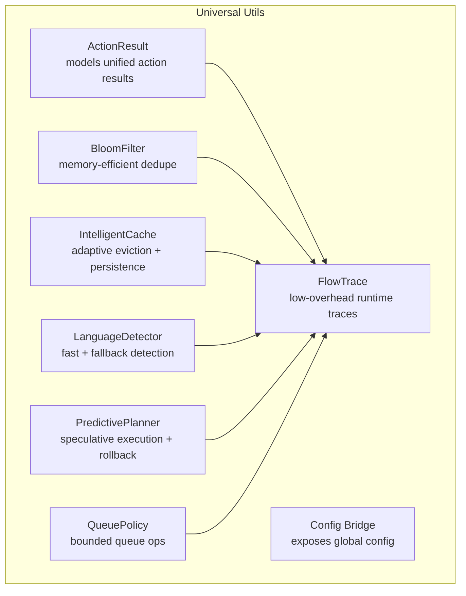
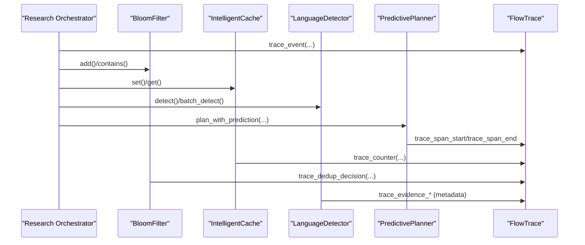
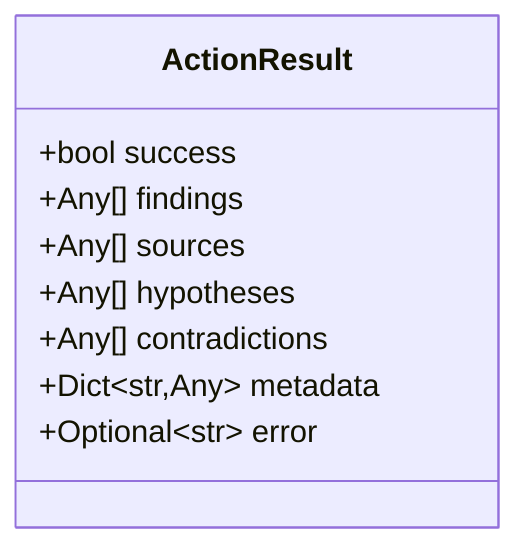
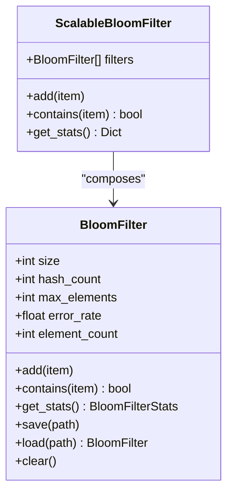
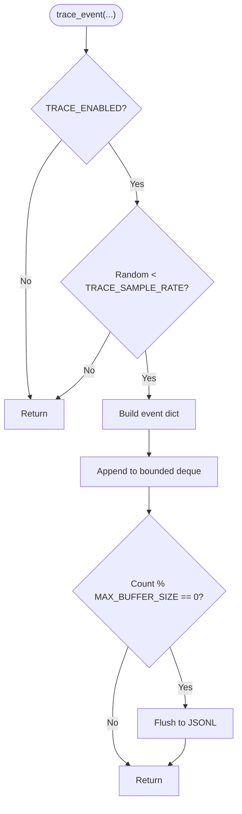
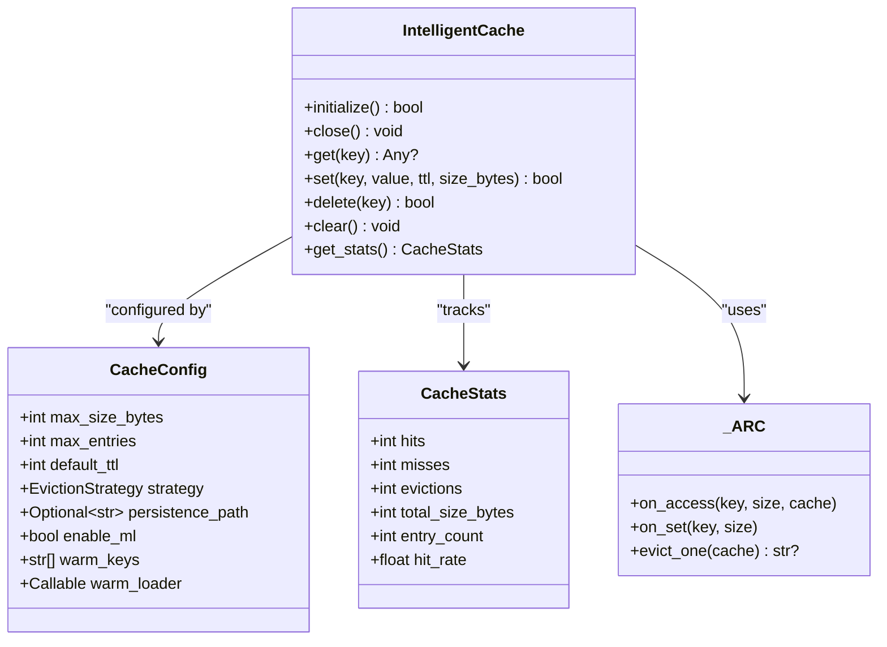
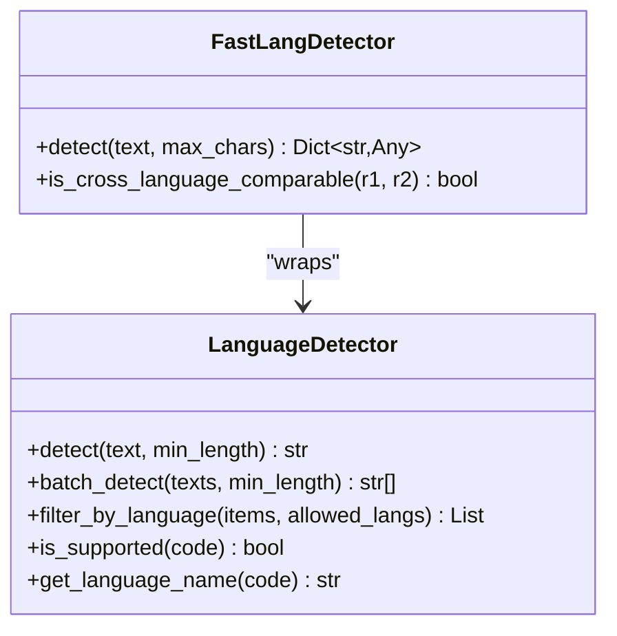
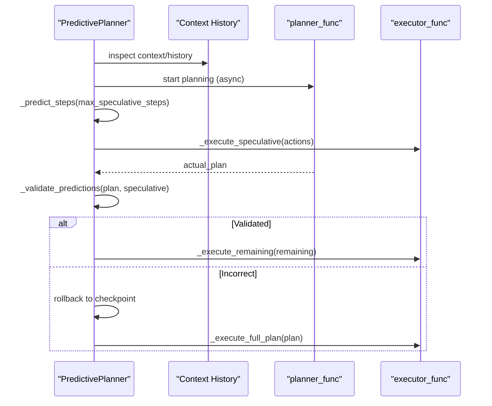
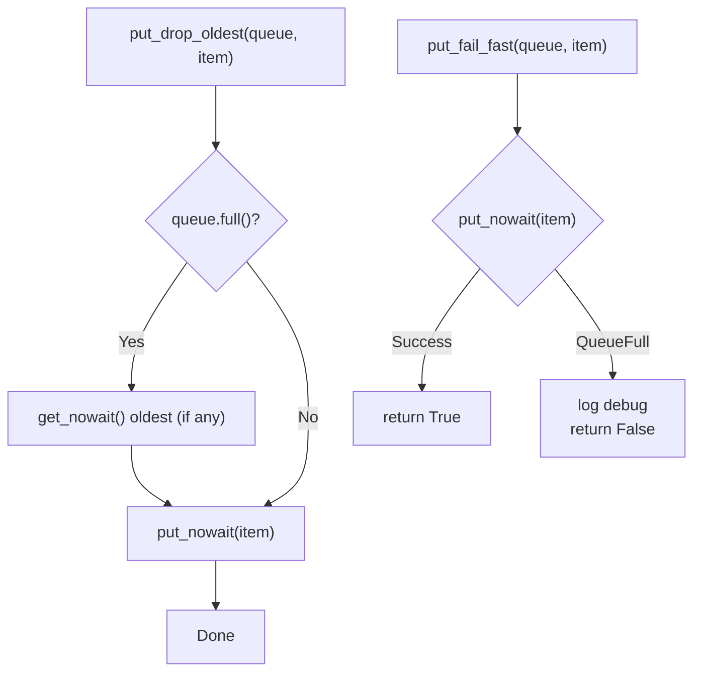
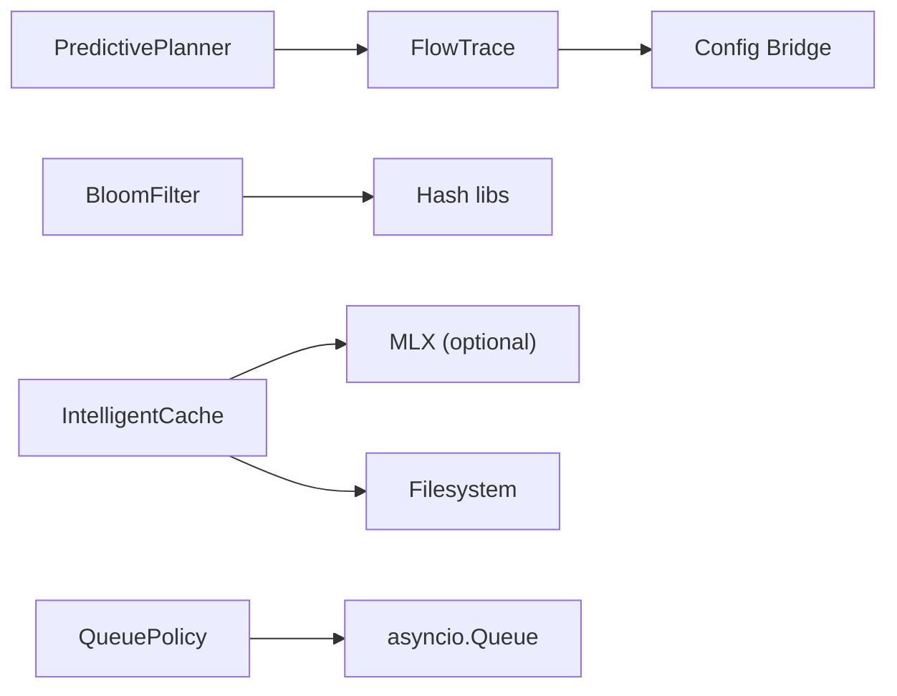

# Development Utilities

<cite>
**Referenced Files in This Document**
- [action_result.py](file://utils/action_result.py)
- [bloom_filter.py](file://utils/bloom_filter.py)
- [config.py](file://utils/config.py)
- [flow_trace.py](file://utils/flow_trace.py)
- [intelligent_cache.py](file://utils/intelligent_cache.py)
- [language.py](file://utils/language.py)
- [predictive_planner.py](file://utils/predictive_planner.py)
- [queue_policy.py](file://utils/queue_policy.py)
</cite>

## Table of Contents
1. [Introduction](#introduction)
2. [Project Structure](#project-structure)
3. [Core Components](#core-components)
4. [Architecture Overview](#architecture-overview)
5. [Detailed Component Analysis](#detailed-component-analysis)
6. [Dependency Analysis](#dependency-analysis)
7. [Performance Considerations](#performance-considerations)
8. [Troubleshooting Guide](#troubleshooting-guide)
9. [Conclusion](#conclusion)
10. [Appendices](#appendices)

## Introduction
This document describes development and operational utilities that power research orchestration, caching, deduplication, flow tracing, language detection, predictive planning, and queue management. It explains how these utilities integrate with the broader system, how to configure and operate them, and how to use them effectively in development and production workflows. It also covers intelligent caching strategies, rate limiting patterns, thread pool management, and debugging/logging approaches.

## Project Structure
The utilities documented here reside under the universal utilities package and are designed to be imported and used across the system without heavy side effects. They are organized by concern:
- Action result modeling
- Bloom filters for deduplication
- Configuration bridging
- Flow tracing for runtime observability
- Intelligent caching with adaptive eviction
- Language detection
- Predictive planning with rollback
- Queue policies for bounded throughput

**Diagram sources**
- [action_result.py:6-16](file://utils/action_result.py#L6-L16)
- [bloom_filter.py:60-352](file://utils/bloom_filter.py#L60-L352)
- [config.py:1-2](file://utils/config.py#L1-L2)
- [flow_trace.py:133-324](file://utils/flow_trace.py#L133-L324)
- [intelligent_cache.py:188-782](file://utils/intelligent_cache.py#L188-L782)
- [language.py:17-326](file://utils/language.py#L17-L326)
- [predictive_planner.py:103-361](file://utils/predictive_planner.py#L103-L361)
- [queue_policy.py:17-45](file://utils/queue_policy.py#L17-L45)

**Section sources**
- [action_result.py:1-16](file://utils/action_result.py#L1-L16)
- [bloom_filter.py:1-353](file://utils/bloom_filter.py#L1-L353)
- [config.py:1-2](file://utils/config.py#L1-L2)
- [flow_trace.py:1-956](file://utils/flow_trace.py#L1-L956)
- [intelligent_cache.py:1-782](file://utils/intelligent_cache.py#L1-L782)
- [language.py:1-326](file://utils/language.py#L1-L326)
- [predictive_planner.py:1-365](file://utils/predictive_planner.py#L1-L365)
- [queue_policy.py:1-45](file://utils/queue_policy.py#L1-L45)

## Core Components
- ActionResult: A unified result container for research actions, aggregating findings, sources, hypotheses, contradictions, metadata, and errors.
- BloomFilter and ScalableBloomFilter: Memory-efficient probabilistic structures for deduplication and fast existence checks, with statistics, persistence, and growth semantics.
- FlowTrace: Lightweight runtime tracing with spans, counters, sampling, and bounded buffers, producing JSONL and summary outputs.
- IntelligentCache: Async cache with adaptive eviction (ARC-inspired), TTL, persistence, and memory-conscious sizing.
- LanguageDetector and FastLangDetector: Fast language detection with fallbacks and bounded metadata for deduplication and comparability.
- PredictivePlanner: Speculative execution with prediction validation and rollback management.
- QueuePolicy: Bounded queue operations (drop-oldest and fail-fast) for M1 8GB memory safety.

**Section sources**
- [action_result.py:6-16](file://utils/action_result.py#L6-L16)
- [bloom_filter.py:60-352](file://utils/bloom_filter.py#L60-L352)
- [flow_trace.py:133-324](file://utils/flow_trace.py#L133-L324)
- [intelligent_cache.py:188-782](file://utils/intelligent_cache.py#L188-L782)
- [language.py:17-326](file://utils/language.py#L17-L326)
- [predictive_planner.py:103-361](file://utils/predictive_planner.py#L103-L361)
- [queue_policy.py:17-45](file://utils/queue_policy.py#L17-L45)

## Architecture Overview
The utilities are designed to be low-overhead, memory-conscious, and safe to enable/disable at runtime. They integrate with the orchestrator and research pipeline via explicit APIs and convenience wrappers.

**Diagram sources**
- [flow_trace.py:151-277](file://utils/flow_trace.py#L151-L277)
- [bloom_filter.py:146-174](file://utils/bloom_filter.py#L146-L174)
- [intelligent_cache.py:354-413](file://utils/intelligent_cache.py#L354-L413)
- [language.py:85-182](file://utils/language.py#L85-L182)
- [predictive_planner.py:120-203](file://utils/predictive_planner.py#L120-L203)

## Detailed Component Analysis

### ActionResult
- Purpose: Provide a single, typed result container for any research action, enabling uniform handling of findings, sources, hypotheses, contradictions, metadata, and errors.
- Typical usage: Return from research actions and propagate through the orchestrator and downstream consumers.

**Diagram sources**
- [action_result.py:6-16](file://utils/action_result.py#L6-L16)

**Section sources**
- [action_result.py:6-16](file://utils/action_result.py#L6-L16)

### BloomFilter and ScalableBloomFilter
- Purpose: Efficient deduplication and fast membership testing with configurable false positive rates and memory footprint.
- Features:
  - Optimal bit array and hash count computation
  - Multiple hash families (xxhash when available, MD5/SHA1 fallback)
  - Hash position caching with bounded eviction
  - Statistics collection (size, fill ratio, current FPP)
  - Persistence and loading
  - Scalable variant that grows filters automatically

**Diagram sources**
- [bloom_filter.py:60-352](file://utils/bloom_filter.py#L60-L352)

**Section sources**
- [bloom_filter.py:60-352](file://utils/bloom_filter.py#L60-L352)

### FlowTrace
- Purpose: Low-overhead runtime tracing for internal data flow and bottlenecks without heavy observability stacks.
- Key behaviors:
  - Environment-controlled enablement and sampling
  - Bounded in-memory event buffer with periodic flush
  - Thread-safe global state and per-run identifiers
  - Span tracking, counters, and convenience wrappers for common events
  - Extensible metadata with sanitization and size bounds

**Diagram sources**
- [flow_trace.py:151-213](file://utils/flow_trace.py#L151-L213)

**Section sources**
- [flow_trace.py:1-956](file://utils/flow_trace.py#L1-L956)

### IntelligentCache
- Purpose: Adaptive, memory-conscious caching with async operations, TTL, persistence, and optional ML-accelerated scoring.
- Key features:
  - ARC-inspired eviction with ghost lists and O(1) operations
  - Hybrid eviction strategy selection (LRU, LFU, Adaptive)
  - Background cleanup for expired entries
  - Optional persistence to disk and cache warming
  - Memory estimation and size-based rejection for oversized entries

**Diagram sources**
- [intelligent_cache.py:188-782](file://utils/intelligent_cache.py#L188-L782)

**Section sources**
- [intelligent_cache.py:188-782](file://utils/intelligent_cache.py#L188-L782)

### LanguageDetector and FastLangDetector
- Purpose: Fast language detection with fallbacks and bounded metadata for deduplication and cross-language comparison control.
- Features:
  - Priority on fast-langdetect with graceful fallback
  - Character-range heuristics and dictionary-based fallback
  - Batch detection and language filtering
  - Bounded metadata with confidence buckets and hashes

**Diagram sources**
- [language.py:17-326](file://utils/language.py#L17-L326)

**Section sources**
- [language.py:17-326](file://utils/language.py#L17-L326)

### PredictivePlanner
- Purpose: Speculative execution of predicted steps with validation and rollback to improve throughput while maintaining correctness.
- Features:
  - Prediction generation from historical patterns
  - Parallel speculative execution above a confidence threshold
  - Validation against the actual plan and selective continuation
  - Rollback manager for state checkpoints
  - Metrics tracking for prediction accuracy

**Diagram sources**
- [predictive_planner.py:120-203](file://utils/predictive_planner.py#L120-L203)

**Section sources**
- [predictive_planner.py:103-361](file://utils/predictive_planner.py#L103-L361)

### QueuePolicy
- Purpose: Provide bounded queue operations to prevent unbounded memory growth on M1 8GB systems.
- Operations:
  - Drop-oldest: Non-blocking put that drops the oldest item if full
  - Fail-fast: Non-blocking put that returns False if full

**Diagram sources**
- [queue_policy.py:17-45](file://utils/queue_policy.py#L17-L45)

**Section sources**
- [queue_policy.py:17-45](file://utils/queue_policy.py#L17-L45)

## Dependency Analysis
- FlowTrace depends on environment variables for configuration and writes to filesystem paths resolved at runtime.
- BloomFilter relies on optional xxhash for speed and falls back to standard hashing.
- IntelligentCache optionally integrates MLX for numerical computations and persists data to disk when configured.
- PredictivePlanner coordinates with external planner and executor functions and uses FlowTrace for span events.
- QueuePolicy is a pure utility with no heavy imports.

**Diagram sources**
- [flow_trace.py:73-127](file://utils/flow_trace.py#L73-L127)
- [bloom_filter.py:39-44](file://utils/bloom_filter.py#L39-L44)
- [intelligent_cache.py:31-42](file://utils/intelligent_cache.py#L31-L42)
- [predictive_planner.py:120-203](file://utils/predictive_planner.py#L120-L203)
- [queue_policy.py:6-10](file://utils/queue_policy.py#L6-L10)

**Section sources**
- [flow_trace.py:73-127](file://utils/flow_trace.py#L73-L127)
- [bloom_filter.py:39-44](file://utils/bloom_filter.py#L39-L44)
- [intelligent_cache.py:31-42](file://utils/intelligent_cache.py#L31-L42)
- [predictive_planner.py:120-203](file://utils/predictive_planner.py#L120-L203)
- [queue_policy.py:6-10](file://utils/queue_policy.py#L6-L10)

## Performance Considerations
- BloomFilter
  - Use appropriate error rates and capacities to minimize false positives while controlling memory.
  - Prefer xxhash when available for faster hashing; expect degraded performance otherwise.
  - Use ScalableBloomFilter for unbounded growth scenarios with controlled combined FPP.
- IntelligentCache
  - Tune max_size_bytes and max_entries for M1 8GB constraints; avoid caching oversized entries.
  - Enable persistence to reduce cold starts; use cache warming for hot keys.
  - Use adaptive eviction strategy for mixed recency/frequency workloads.
- FlowTrace
  - Control sampling rate and max events to bound memory and IO overhead.
  - Use spans and counters to identify hotspots without disrupting runtime.
- PredictivePlanner
  - Adjust min_confidence and max_speculative_steps to balance throughput and correctness risk.
  - Monitor prediction accuracy metrics to tune heuristics.
- QueuePolicy
  - Choose drop-oldest for loss-tolerant pipelines; choose fail-fast for backpressure signaling.

[No sources needed since this section provides general guidance]

## Troubleshooting Guide
- FlowTrace
  - Verify environment flags for enablement and sampling.
  - Inspect JSONL and summary outputs for anomalies; ensure file paths resolve correctly.
  - Confirm bounded buffer flushes and thread-safety around global state.
- BloomFilter
  - Check element count vs capacity; evaluate current FPP via statistics.
  - Validate persistence files and rehydration after restarts.
- IntelligentCache
  - Watch for background cleanup logs; ensure persistence succeeds.
  - Investigate cache misses and eviction patterns; adjust TTL and size budgets.
- LanguageDetector
  - Confirm availability of fast-langdetect; fallback mode may reduce accuracy.
  - Validate language names and supported codes.
- PredictivePlanner
  - Review prediction accuracy; investigate frequent rollbacks.
  - Inspect context history and prediction confidence decay.
- QueuePolicy
  - Observe dropped items and fail-fast returns; adjust queue sizes accordingly.

**Section sources**
- [flow_trace.py:133-324](file://utils/flow_trace.py#L133-L324)
- [bloom_filter.py:175-233](file://utils/bloom_filter.py#L175-L233)
- [intelligent_cache.py:559-638](file://utils/intelligent_cache.py#L559-L638)
- [language.py:7-14](file://utils/language.py#L7-L14)
- [predictive_planner.py:352-361](file://utils/predictive_planner.py#L352-L361)
- [queue_policy.py:17-45](file://utils/queue_policy.py#L17-L45)

## Conclusion
These development utilities provide robust, memory-conscious primitives for deduplication, caching, tracing, language detection, predictive planning, and bounded queue management. By combining deterministic behaviors, bounded memory footprints, and optional acceleration, they enable scalable and observable research workflows suitable for constrained environments like M1 8GB systems.

[No sources needed since this section summarizes without analyzing specific files]

## Appendices

### Configuration Management
- The config bridge exposes global configuration for the system. Use it to centralize feature flags and environment-specific settings.

**Section sources**
- [config.py:1-2](file://utils/config.py#L1-L2)

### Development Workflow Automation Examples
- Use FlowTrace to instrument research stages and capture spans for latency analysis.
- Integrate BloomFilter to deduplicate URLs and content fingerprints early in the pipeline.
- Employ IntelligentCache to cache expensive intermediate results and persist across runs.
- Apply PredictivePlanner to speculate on likely next steps and roll back on mispredictions.
- Enforce queue policies to maintain memory stability under bursty loads.

[No sources needed since this section provides general guidance]

### Rate Limiting Strategies
- Combine QueuePolicy’s fail-fast with backoff and jitter to handle upstream rate limits gracefully.
- Use FlowTrace to monitor fallback events and adjust retry windows.

[No sources needed since this section provides general guidance]

### Thread Pool Management
- Use asyncio queues and bounded policies to coordinate producers/consumers safely.
- Avoid blocking operations; rely on async cache and tracing to minimize contention.

[No sources needed since this section provides general guidance]

### Debugging Utilities and Logging Patterns
- Enable FlowTrace with sampling to capture runtime behavior without overhead.
- Log queue drops and cache misses to identify bottlenecks.
- Use bounded metadata in tracing to keep logs compact and analyzable.

[No sources needed since this section provides general guidance]