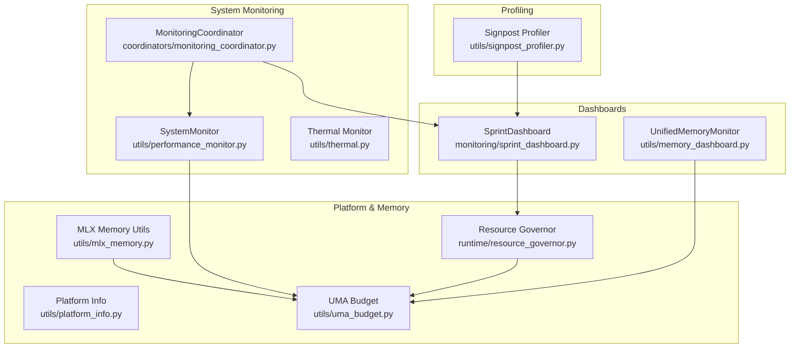
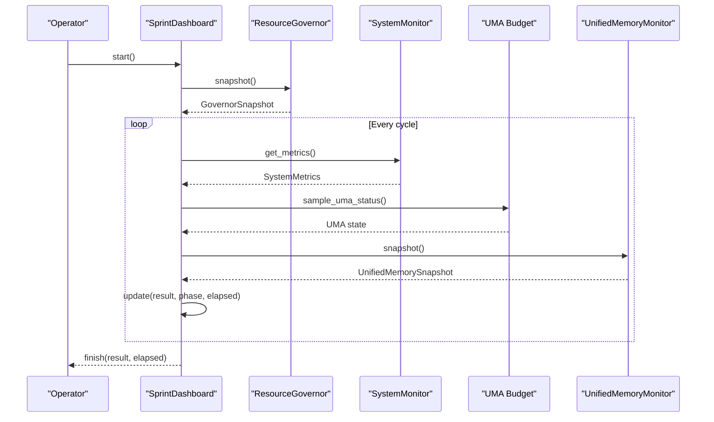
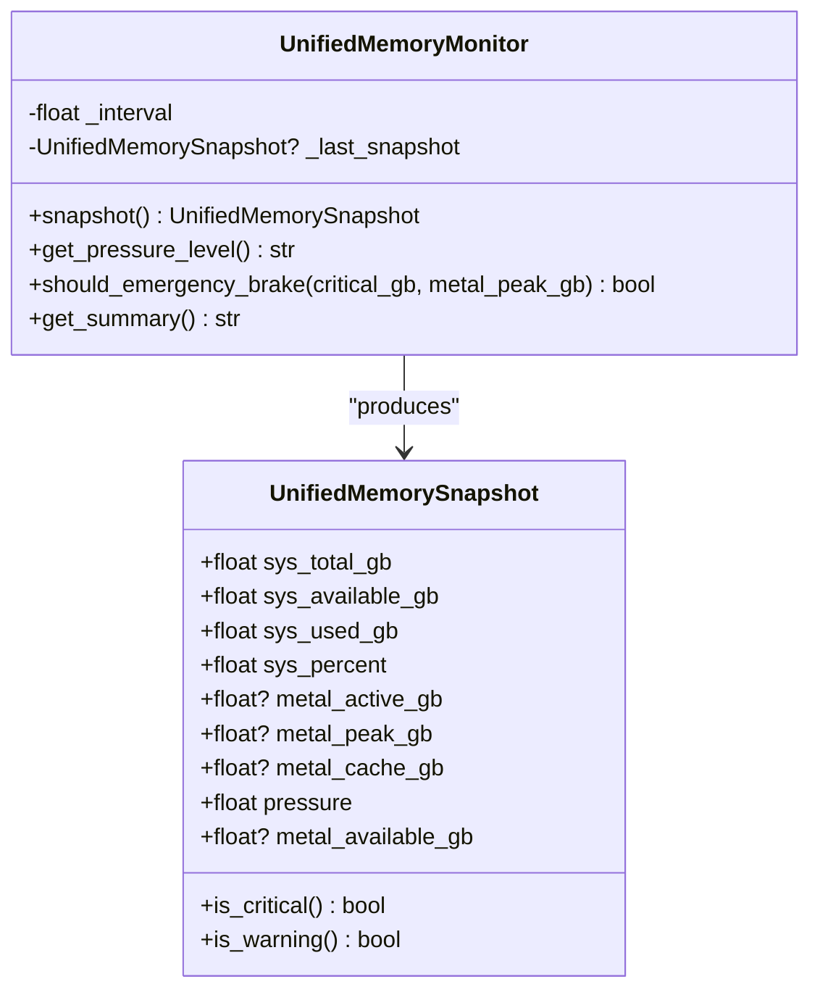
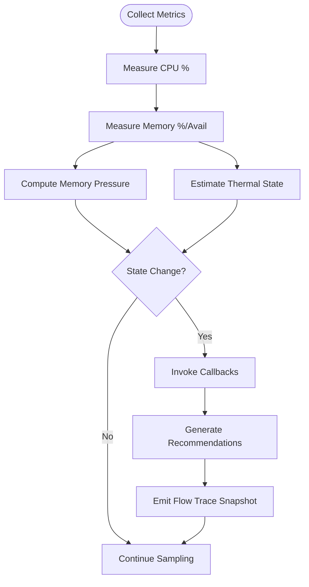
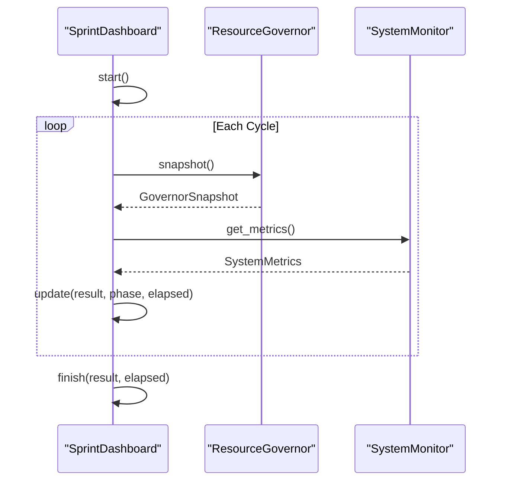
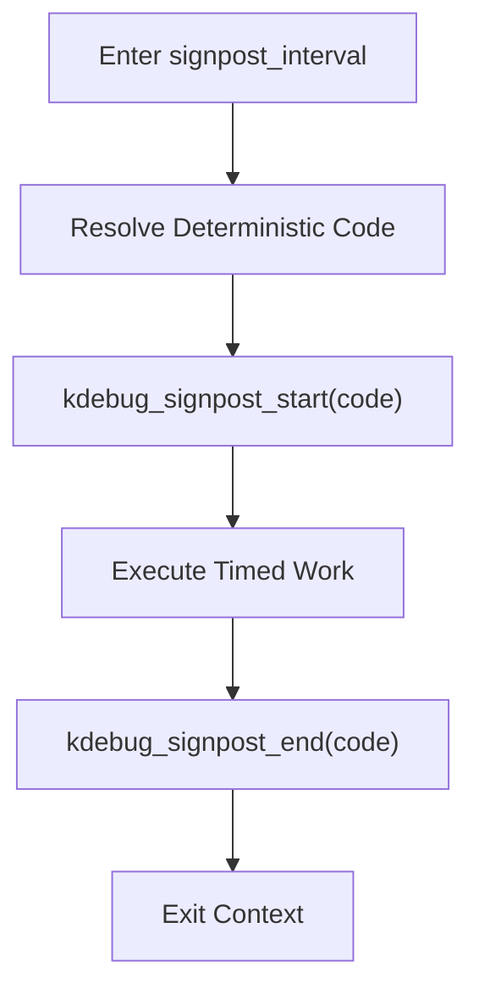
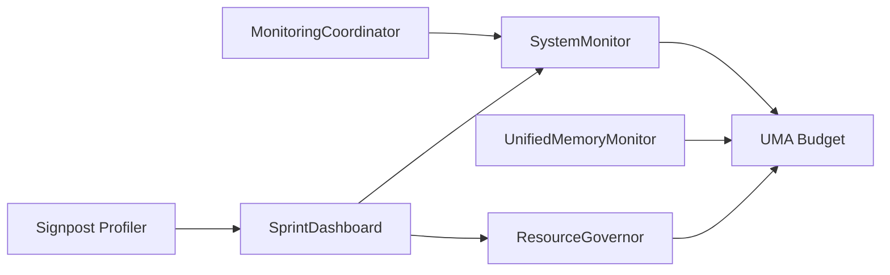

# Performance Monitoring

<cite>
**Referenced Files in This Document**
- [sprint_dashboard.py](file://monitoring/sprint_dashboard.py)
- [memory_dashboard.py](file://utils/memory_dashboard.py)
- [performance_monitor.py](file://utils/performance_monitor.py)
- [signpost_profiler.py](file://utils/signpost_profiler.py)
- [thermal.py](file://utils/thermal.py)
- [platform_info.py](file://utils/platform_info.py)
- [mlx_memory.py](file://utils/mlx_memory.py)
- [uma_budget.py](file://utils/uma_budget.py)
- [resource_governor.py](file://runtime/resource_governor.py)
- [monitoring_coordinator.py](file://coordinators/monitoring_coordinator.py)
</cite>

## Table of Contents
1. [Introduction](#introduction)
2. [Project Structure](#project-structure)
3. [Core Components](#core-components)
4. [Architecture Overview](#architecture-overview)
5. [Detailed Component Analysis](#detailed-component-analysis)
6. [Dependency Analysis](#dependency-analysis)
7. [Performance Considerations](#performance-considerations)
8. [Troubleshooting Guide](#troubleshooting-guide)
9. [Conclusion](#conclusion)

## Introduction
This document describes the performance monitoring and diagnostics toolkit integrated across the system. It covers memory dashboards, performance monitors, platform information gathering, thermal management, signpost profiling, and system health monitoring. It also explains Apple Silicon-specific monitoring, thermal throttling prevention, resource utilization tracking, debugging techniques, performance regression detection, and system stability monitoring.

## Project Structure
The performance monitoring ecosystem spans several modules:
- Live dashboards for sprint visibility
- Unified memory monitoring for system and GPU memory
- System monitoring for CPU, memory, disk, and thermal states
- Signpost profiling for lightweight Instruments integration
- Platform and acceleration status reporting
- Resource governance and UMA budgeting for Apple Silicon
- Coordinated monitoring with alerting and benchmarking

**Diagram sources**
- [sprint_dashboard.py:66-269](file://monitoring/sprint_dashboard.py#L66-L269)
- [memory_dashboard.py:82-242](file://utils/memory_dashboard.py#L82-L242)
- [performance_monitor.py:240-537](file://utils/performance_monitor.py#L240-L537)
- [thermal.py:118-203](file://utils/thermal.py#L118-L203)
- [monitoring_coordinator.py:101-800](file://coordinators/monitoring_coordinator.py#L101-L800)
- [platform_info.py:215-280](file://utils/platform_info.py#L215-L280)
- [mlx_memory.py:108-332](file://utils/mlx_memory.py#L108-L332)
- [uma_budget.py:253-311](file://utils/uma_budget.py#L253-L311)
- [resource_governor.py:116-353](file://runtime/resource_governor.py#L116-L353)

**Section sources**
- [sprint_dashboard.py:1-269](file://monitoring/sprint_dashboard.py#L1-L269)
- [memory_dashboard.py:1-242](file://utils/memory_dashboard.py#L1-L242)
- [performance_monitor.py:1-537](file://utils/performance_monitor.py#L1-L537)
- [thermal.py:1-203](file://utils/thermal.py#L1-L203)
- [monitoring_coordinator.py:1-800](file://coordinators/monitoring_coordinator.py#L1-L800)
- [platform_info.py:1-280](file://utils/platform_info.py#L1-L280)
- [mlx_memory.py:1-332](file://utils/mlx_memory.py#L1-L332)
- [uma_budget.py:1-507](file://utils/uma_budget.py#L1-L507)
- [resource_governor.py:1-353](file://runtime/resource_governor.py#L1-L353)

## Core Components
- Unified Memory Monitor: Combines system RAM and Metal GPU memory snapshots, computes pressure, and exposes emergency braking heuristics.
- System Monitor: Periodically samples CPU, memory, and thermal state; triggers callbacks on state changes; provides recommendations and flow-trace snapshots.
- Sprint Dashboard: Live terminal dashboard for sprint phases, findings, cycle progress, branch status, governor state, and kill-chain tagging.
- Signpost Profiler: Low-overhead macOS Instruments integration via kdebug_signpost with deterministic codes.
- Thermal Monitor: Lightweight macOS thermal state reader with fallbacks.
- Platform Info: Reports optional acceleration dependencies (MLX, Torch MPS, fast language detection, MinHash LSH, RapidFuzz).
- MLX Memory Utilities: Lazy MLX memory inspection, cache clearing, pressure calculation, and stream guards.
- UMA Budget: Canonical UMA sampling, pressure levels, watchdog with callbacks, and emergency actions.
- Resource Governor: Advisory safety layer for concurrency, renderer/model admission, and mission budget enforcement on Apple Silicon.

**Section sources**
- [memory_dashboard.py:37-200](file://utils/memory_dashboard.py#L37-L200)
- [performance_monitor.py:240-457](file://utils/performance_monitor.py#L240-L457)
- [sprint_dashboard.py:66-269](file://monitoring/sprint_dashboard.py#L66-L269)
- [signpost_profiler.py:42-79](file://utils/signpost_profiler.py#L42-L79)
- [thermal.py:118-203](file://utils/thermal.py#L118-L203)
- [platform_info.py:215-280](file://utils/platform_info.py#L215-L280)
- [mlx_memory.py:108-332](file://utils/mlx_memory.py#L108-L332)
- [uma_budget.py:201-311](file://utils/uma_budget.py#L201-L311)
- [resource_governor.py:116-353](file://runtime/resource_governor.py#L116-L353)

## Architecture Overview
The monitoring architecture integrates real-time system metrics, Apple Silicon-specific memory accounting, and adaptive governance. It supports:
- Live dashboards for sprint visibility
- Periodic system metrics collection with alerting
- Memory pressure detection and automatic mitigation
- Thermal-aware throttling decisions
- Lightweight profiling for Instruments
- Platform acceleration status reporting

**Diagram sources**
- [sprint_dashboard.py:96-137](file://monitoring/sprint_dashboard.py#L96-L137)
- [resource_governor.py:301-321](file://runtime/resource_governor.py#L301-L321)
- [performance_monitor.py:394-420](file://utils/performance_monitor.py#L394-L420)
- [uma_budget.py:253-283](file://utils/uma_budget.py#L253-L283)
- [memory_dashboard.py:102-158](file://utils/memory_dashboard.py#L102-L158)

## Detailed Component Analysis

### Unified Memory Monitor
- Purpose: Consolidate system RAM and Metal GPU memory into a single snapshot with derived pressure metrics.
- Key capabilities:
  - Snapshot collection via psutil and MLX Metal APIs
  - Derived metrics: total available memory (RAM + Metal cache), memory pressure, and critical/warning thresholds
  - Emergency brake decision helpers and human-readable summaries
- Apple Silicon focus: Uses MLX Metal memory APIs when available on Darwin platforms.

**Diagram sources**
- [memory_dashboard.py:37-101](file://utils/memory_dashboard.py#L37-L101)
- [memory_dashboard.py:82-200](file://utils/memory_dashboard.py#L82-L200)

**Section sources**
- [memory_dashboard.py:37-242](file://utils/memory_dashboard.py#L37-L242)

### System Monitor and Thermal Management
- SystemMonitor:
  - Periodic sampling of CPU, memory, and optional battery metrics
  - Memory pressure classification and thermal state estimation
  - Event-driven callbacks for state changes and critical conditions
  - Recommendations and flow-trace snapshot emission for diagnostics
- Thermal Monitor:
  - macOS thermal state reader with IOKit and sysctl fallbacks
  - Boolean helpers for warning and critical thresholds
  - Structured snapshot for observability

**Diagram sources**
- [performance_monitor.py:288-420](file://utils/performance_monitor.py#L288-L420)
- [thermal.py:118-203](file://utils/thermal.py#L118-L203)

**Section sources**
- [performance_monitor.py:240-537](file://utils/performance_monitor.py#L240-L537)
- [thermal.py:1-203](file://utils/thermal.py#L1-L203)

### Sprint Dashboard
- Live terminal dashboard showing:
  - Phase, elapsed/remaining time, and progress bar
  - Findings counters (accepted/public/CT/vision/forensics)
  - Cycle counts, duplicate hashes skipped, top sources
  - Branch timeouts/blockers and abort reasons
  - Governor state (UMA, fetch limit, concurrency)
  - Kill-chain tagging count
- Integration: pulls governor snapshot and system metrics for richer context.

**Diagram sources**
- [sprint_dashboard.py:96-137](file://monitoring/sprint_dashboard.py#L96-L137)
- [resource_governor.py:301-321](file://runtime/resource_governor.py#L301-L321)
- [performance_monitor.py:394-420](file://utils/performance_monitor.py#L394-L420)

**Section sources**
- [sprint_dashboard.py:66-269](file://monitoring/sprint_dashboard.py#L66-L269)

### Signpost Profiler
- Provides a context manager to mark timed intervals for Instruments:
  - Deterministic signpost codes generated from category/name
  - Safe harness for macOS API with fallback on non-Darwin
  - Lightweight overhead for consistent profiling across runs

**Diagram sources**
- [signpost_profiler.py:42-66](file://utils/signpost_profiler.py#L42-L66)

**Section sources**
- [signpost_profiler.py:1-79](file://utils/signpost_profiler.py#L1-L79)

### Platform Information Gathering
- Reports optional acceleration dependencies:
  - MLX availability and version
  - Torch MPS availability and notes
  - Optional extras: fast language detection, MinHash LSH, RapidFuzz
- Provides install hints and a concise summary for quick diagnostics.

**Section sources**
- [platform_info.py:215-280](file://utils/platform_info.py#L215-L280)

### MLX Memory Hygiene and Pressure
- Lazy MLX import to avoid heavy runtime on import
- Functions to inspect active/peak/cache memory and compute pressure
- Cache clearing with debouncing and stream context guard
- Configurable cache/memory limits with safe fallbacks

**Section sources**
- [mlx_memory.py:54-332](file://utils/mlx_memory.py#L54-L332)

### UMA Budget and Watchdog
- Canonical UMA sampling for M1 8GB:
  - System RAM + MLX active memory
  - Pressure levels: normal, warn, critical, emergency
  - Thresholds and formatted reports
- UMA Watchdog:
  - Async polling with state-change debounce
  - Callbacks for warn/critical/emergency with auto-actions
  - Non-blocking execution via threads for cleanup tasks

**Section sources**
- [uma_budget.py:201-311](file://utils/uma_budget.py#L201-L311)
- [uma_budget.py:380-507](file://utils/uma_budget.py#L380-L507)

### Resource Governor (Apple Silicon Advisory Layer)
- Advisory safety layer governing:
  - Fetch concurrency limits
  - Renderer and model load permissions
  - Sidecar admission with RSS and UMA checks
- Decisions based on UMA state, model lifecycle, and mission budget constraints

**Section sources**
- [resource_governor.py:116-353](file://runtime/resource_governor.py#L116-L353)

### Monitoring Coordinator (Coordinated System Health)
- Orchestrates:
  - Advanced monitoring, watchdog health checks, and psutil-based metrics
  - Background collection with memory-aware intervals
  - Performance benchmarking (CPU, memory, general)
  - Alert thresholds and historical metrics aggregation
- Provides health checks, averages, peaks, and security audit integration

**Section sources**
- [monitoring_coordinator.py:101-800](file://coordinators/monitoring_coordinator.py#L101-L800)

## Dependency Analysis
Key relationships:
- UnifiedMemoryMonitor depends on psutil and MLX Metal APIs
- SystemMonitor depends on psutil and optionally battery sensors
- ResourceGovernor reads UMA state and model lifecycle to advise concurrency and admission
- MonitoringCoordinator aggregates system metrics and routes to subsystems
- Signpost Profiler integrates with Instruments on macOS

**Diagram sources**
- [performance_monitor.py:240-457](file://utils/performance_monitor.py#L240-L457)
- [memory_dashboard.py:82-158](file://utils/memory_dashboard.py#L82-L158)
- [uma_budget.py:253-311](file://utils/uma_budget.py#L253-L311)
- [resource_governor.py:137-218](file://runtime/resource_governor.py#L137-L218)
- [monitoring_coordinator.py:394-445](file://coordinators/monitoring_coordinator.py#L394-L445)
- [sprint_dashboard.py:242-260](file://monitoring/sprint_dashboard.py#L242-L260)
- [signpost_profiler.py:42-66](file://utils/signpost_profiler.py#L42-L66)

**Section sources**
- [performance_monitor.py:240-537](file://utils/performance_monitor.py#L240-L537)
- [memory_dashboard.py:82-242](file://utils/memory_dashboard.py#L82-L242)
- [uma_budget.py:253-311](file://utils/uma_budget.py#L253-L311)
- [resource_governor.py:116-353](file://runtime/resource_governor.py#L116-L353)
- [monitoring_coordinator.py:101-800](file://coordinators/monitoring_coordinator.py#L101-L800)
- [sprint_dashboard.py:66-269](file://monitoring/sprint_dashboard.py#L66-L269)
- [signpost_profiler.py:1-79](file://utils/signpost_profiler.py#L1-L79)

## Performance Considerations
- Sampling cadence: SystemMonitor and MonitoringCoordinator adjust collection intervals under elevated memory pressure to reduce overhead.
- Asynchronous watchdogs: UMA Watchdog and FlowTraceSnapshotEmitter run in background tasks to avoid blocking the main loop.
- Lazy imports: MLX memory utilities and platform probes minimize startup cost when dependencies are unavailable.
- Deterministic profiling: Signpost codes ensure consistent profiling across runs without heavy instrumentation overhead.
- Emergency braking: UnifiedMemoryMonitor and UMA Watchdog provide immediate mitigations (cache clears, reduced concurrency) to prevent OOM and thermal throttling.

[No sources needed since this section provides general guidance]

## Troubleshooting Guide
Common scenarios and remedies:
- High memory pressure or critical UMA:
  - Use UnifiedMemoryMonitor.should_emergency_brake() and UMA Watchdog callbacks to trigger MLX cache cleanup and reduce concurrency.
  - Check governor state via SprintDashboard’s governor row for fetch limits and denied counts.
- Thermal throttling:
  - Use thermal.py helpers to detect warning/critical states and SystemMonitor recommendations to reduce load.
- Performance regressions:
  - Compare average and peak metrics from MonitoringCoordinator; run performance benchmarks to quantify changes.
- Diagnostics:
  - Enable signpost profiling around suspected hotspots; correlate with flow-trace snapshots emitted by SystemMonitor.
- Platform readiness:
  - Verify optional accelerations with platform_info.py; install missing packages to unlock performance features.

**Section sources**
- [memory_dashboard.py:178-200](file://utils/memory_dashboard.py#L178-L200)
- [uma_budget.py:380-507](file://utils/uma_budget.py#L380-L507)
- [resource_governor.py:301-321](file://runtime/resource_governor.py#L301-L321)
- [monitoring_coordinator.py:515-541](file://coordinators/monitoring_coordinator.py#L515-L541)
- [performance_monitor.py:405-420](file://utils/performance_monitor.py#L405-L420)
- [thermal.py:172-188](file://utils/thermal.py#L172-L188)
- [platform_info.py:215-280](file://utils/platform_info.py#L215-L280)
- [signpost_profiler.py:42-79](file://utils/signpost_profiler.py#L42-L79)

## Conclusion
The performance monitoring toolkit provides a cohesive set of utilities for live dashboards, unified memory and thermal awareness, asynchronous system health monitoring, and Apple Silicon–specific resource governance. Together with signpost profiling and coordinated benchmarking, it enables robust diagnostics, proactive throttling prevention, and stable operation under varying workloads.

[No sources needed since this section summarizes without analyzing specific files]