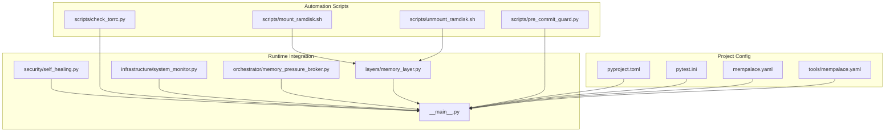
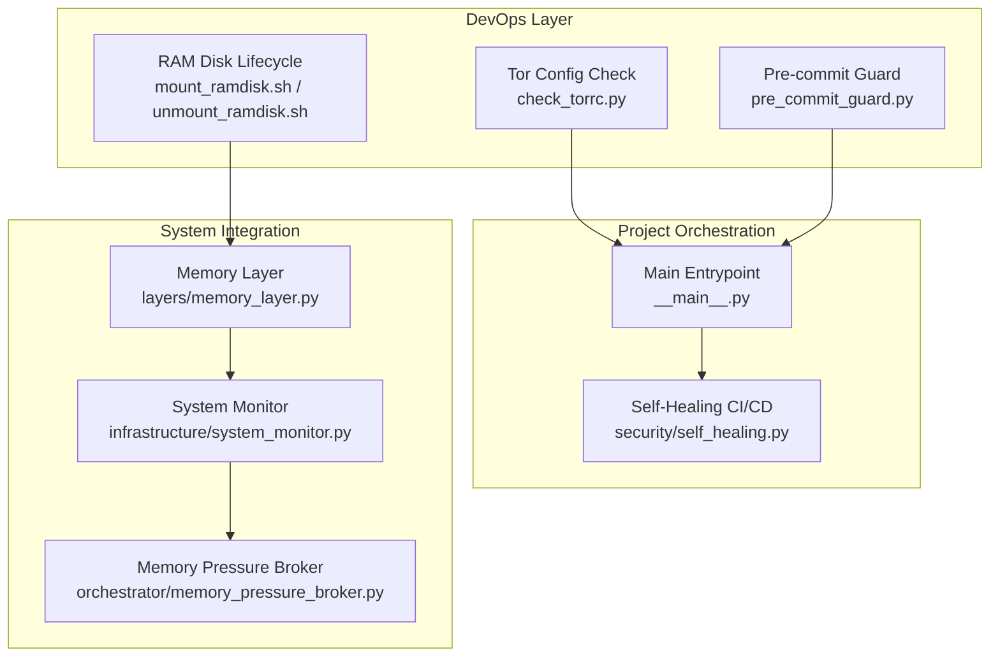
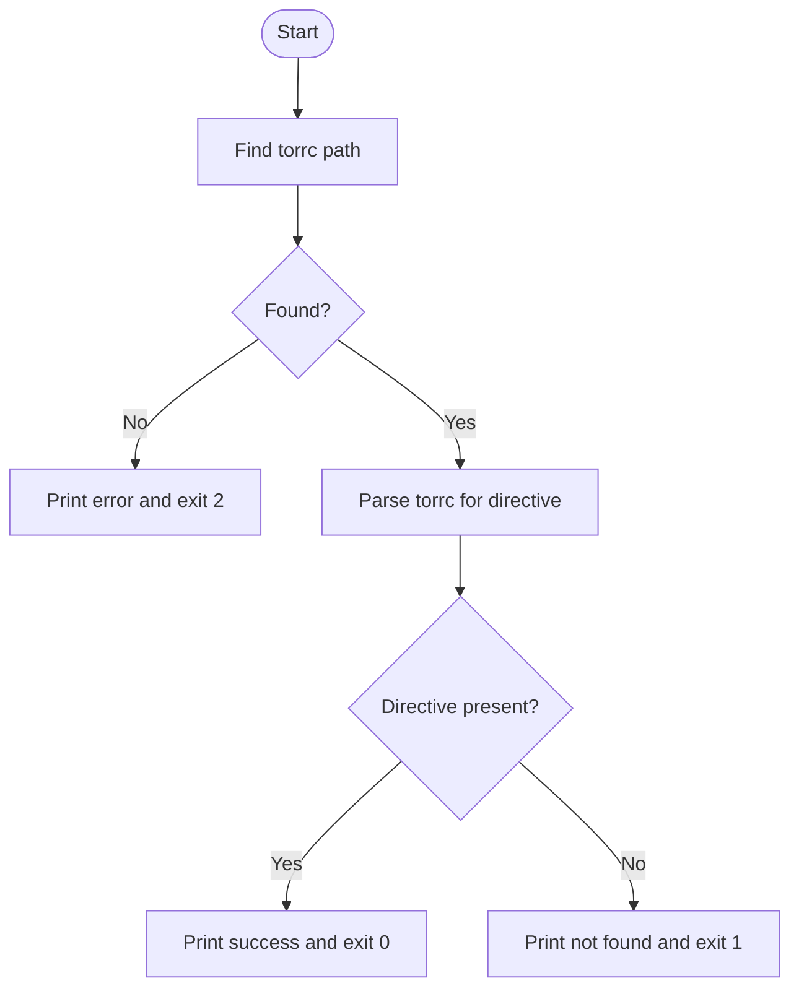
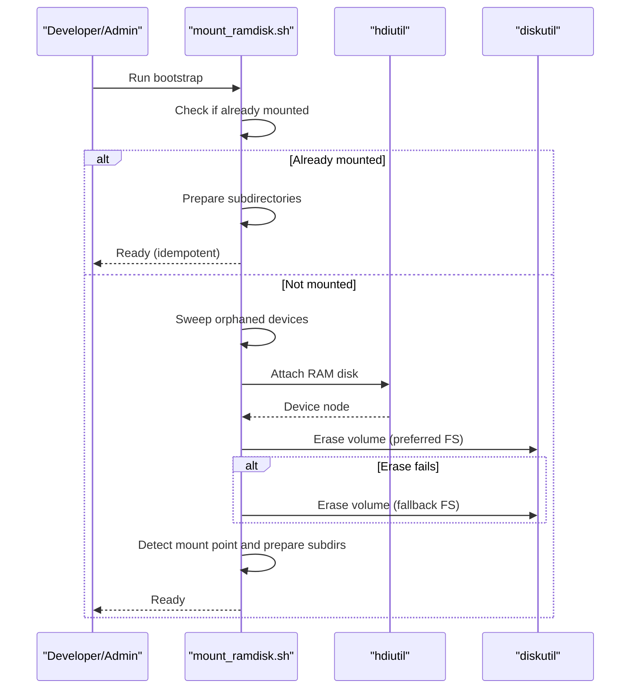
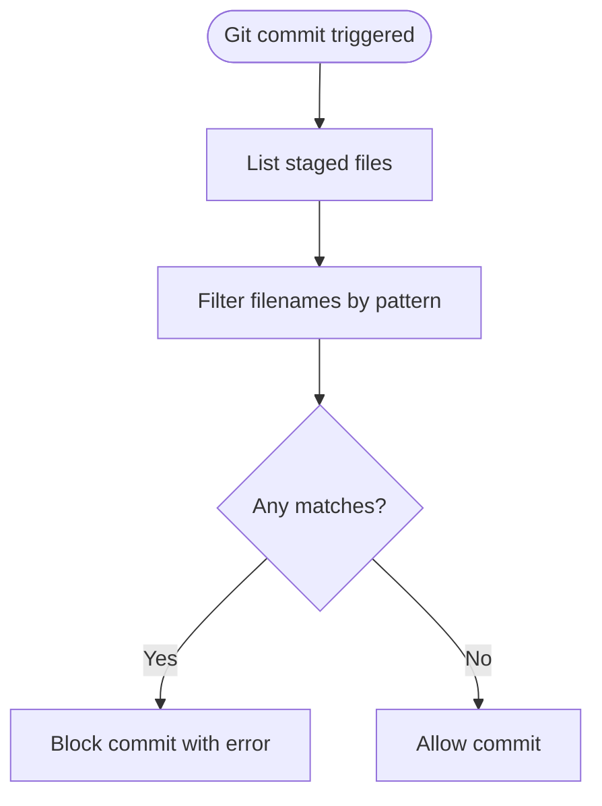
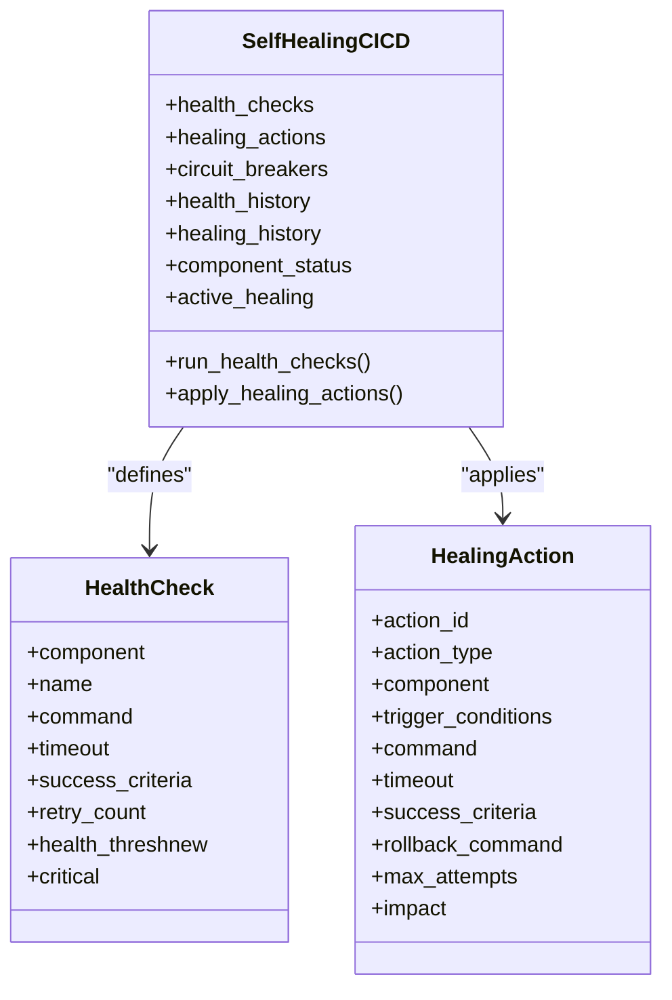
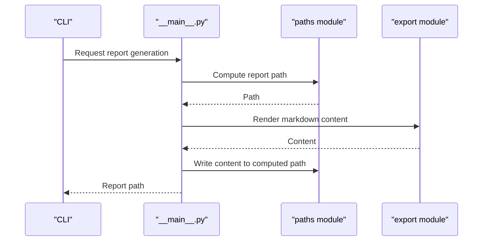
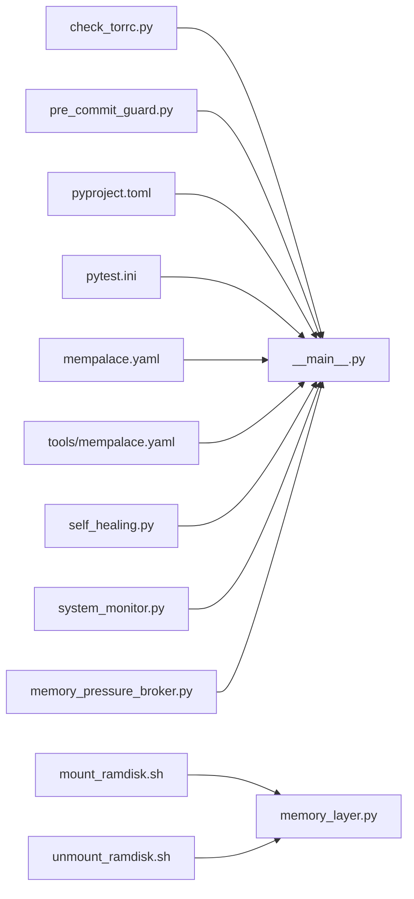

# Script Automation

<cite>
**Referenced Files in This Document**
- [check_torrc.py](file://scripts/check_torrc.py)
- [mount_ramdisk.sh](file://scripts/mount_ramdisk.sh)
- [unmount_ramdisk.sh](file://scripts/unmount_ramdisk.sh)
- [pre_commit_guard.py](file://scripts/pre_commit_guard.py)
- [pyproject.toml](file://pyproject.toml)
- [pytest.ini](file://pytest.ini)
- [mempalace.yaml](file://mempalace.yaml)
- [tools/mempalace.yaml](file://tools/mempalace.yaml)
- [self_healing.py](file://security/self_healing.py)
- [__main__.py](file://__main__.py)
- [memory_layer.py](file://layers/memory_layer.py)
- [system_monitor.py](file://infrastructure/system_monitor.py)
- [memory_pressure_broker.py](file://orchestrator/memory_pressure_broker.py)
</cite>

## Table of Contents
1. [Introduction](#introduction)
2. [Project Structure](#project-structure)
3. [Core Components](#core-components)
4. [Architecture Overview](#architecture-overview)
5. [Detailed Component Analysis](#detailed-component-analysis)
6. [Dependency Analysis](#dependency-analysis)
7. [Performance Considerations](#performance-considerations)
8. [Troubleshooting Guide](#troubleshooting-guide)
9. [Conclusion](#conclusion)
10. [Appendices](#appendices)

## Introduction
This document explains the system scripts and automation utilities that support development workflows, system bootstrapping, and operational maintenance in the project. It covers:
- Tor configuration sanity checks
- RAM disk management for high-throughput scratch storage
- Pre-commit guards to prevent problematic commits
- Orchestration of automated workflows and integration points
- Environment-specific configuration and customization
- Troubleshooting common automation issues

The goal is to make these utilities understandable and usable for both developers and system administrators, with practical guidance for CI/CD integration and maintenance automation.

## Project Structure
The automation assets are primarily located under the scripts directory and integrated with project configuration and runtime orchestration modules.

**Diagram sources**
- [check_torrc.py:1-114](file://scripts/check_torrc.py#L1-L114)
- [mount_ramdisk.sh:1-118](file://scripts/mount_ramdisk.sh#L1-L118)
- [unmount_ramdisk.sh:1-50](file://scripts/unmount_ramdisk.sh#L1-L50)
- [pre_commit_guard.py:1-16](file://scripts/pre_commit_guard.py#L1-L16)
- [pyproject.toml:1-219](file://pyproject.toml#L1-L219)
- [pytest.ini:1-62](file://pytest.ini#L1-L62)
- [mempalace.yaml:1-561](file://mempalace.yaml#L1-L561)
- [tools/mempalace.yaml:1-561](file://tools/mempalace.yaml#L1-L561)
- [self_healing.py:1-434](file://security/self_healing.py#L1-L434)
- [__main__.py:2415-2457](file://__main__.py#L2415-L2457)
- [memory_layer.py:282-319](file://layers/memory_layer.py#L282-L319)
- [system_monitor.py:121-152](file://infrastructure/system_monitor.py#L121-L152)
- [memory_pressure_broker.py:165-187](file://orchestrator/memory_pressure_broker.py#L165-L187)

**Section sources**
- [check_torrc.py:1-114](file://scripts/check_torrc.py#L1-L114)
- [mount_ramdisk.sh:1-118](file://scripts/mount_ramdisk.sh#L1-L118)
- [unmount_ramdisk.sh:1-50](file://scripts/unmount_ramdisk.sh#L1-L50)
- [pre_commit_guard.py:1-16](file://scripts/pre_commit_guard.py#L1-L16)
- [pyproject.toml:1-219](file://pyproject.toml#L1-L219)
- [pytest.ini:1-62](file://pytest.ini#L1-L62)
- [mempalace.yaml:1-561](file://mempalace.yaml#L1-L561)
- [tools/mempalace.yaml:1-561](file://tools/mempalace.yaml#L1-L561)
- [self_healing.py:1-434](file://security/self_healing.py#L1-L434)
- [__main__.py:2415-2457](file://__main__.py#L2415-L2457)
- [memory_layer.py:282-319](file://layers/memory_layer.py#L282-L319)
- [system_monitor.py:121-152](file://infrastructure/system_monitor.py#L121-L152)
- [memory_pressure_broker.py:165-187](file://orchestrator/memory_pressure_broker.py#L165-L187)

## Core Components
- Tor configuration checker: Validates presence of a required directive in torrc to ensure SOCKS isolation for privacy and reliability.
- RAM disk bootstrap and teardown: Creates and manages a macOS RAM disk for high-speed temporary storage, preparing dedicated subdirectories and cleaning transient content.
- Pre-commit guard: Blocks commits containing specific invalid filenames to maintain repository hygiene.
- Self-healing CI/CD: Provides automated recovery mechanisms for common CI/CD failures, including retries, rollbacks, and remediation actions.
- Orchestration integration: The main entrypoint coordinates report generation and integrates with automation scripts and configuration systems.

**Section sources**
- [check_torrc.py:1-114](file://scripts/check_torrc.py#L1-L114)
- [mount_ramdisk.sh:1-118](file://scripts/mount_ramdisk.sh#L1-L118)
- [unmount_ramdisk.sh:1-50](file://scripts/unmount_ramdisk.sh#L1-L50)
- [pre_commit_guard.py:1-16](file://scripts/pre_commit_guard.py#L1-L16)
- [self_healing.py:1-434](file://security/self_healing.py#L1-L434)
- [__main__.py:2415-2457](file://__main__.py#L2415-L2457)

## Architecture Overview
The automation utilities are designed to be modular and composable:
- Shell scripts handle OS-level tasks (Tor checks, RAM disk lifecycle).
- Python scripts provide configuration validation and pre-commit enforcement.
- Runtime modules integrate these utilities into the application lifecycle and orchestrate automated reporting and system monitoring.

**Diagram sources**
- [check_torrc.py:1-114](file://scripts/check_torrc.py#L1-L114)
- [mount_ramdisk.sh:1-118](file://scripts/mount_ramdisk.sh#L1-L118)
- [unmount_ramdisk.sh:1-50](file://scripts/unmount_ramdisk.sh#L1-L50)
- [pre_commit_guard.py:1-16](file://scripts/pre_commit_guard.py#L1-L16)
- [__main__.py:2415-2457](file://__main__.py#L2415-L2457)
- [self_healing.py:1-434](file://security/self_healing.py#L1-L434)
- [memory_layer.py:282-319](file://layers/memory_layer.py#L282-L319)
- [system_monitor.py:121-152](file://infrastructure/system_monitor.py#L121-L152)
- [memory_pressure_broker.py:165-187](file://orchestrator/memory_pressure_broker.py#L165-L187)

## Detailed Component Analysis

### Tor Configuration Checker
Purpose:
- Verify that the Tor configuration file contains a directive required for SOCKS isolation, ensuring privacy and predictable behavior of Tor-dependent transports.

Key behaviors:
- Searches common locations for torrc.
- Parses torrc content to detect the directive, handling comments, line continuations, and inline comments.
- Exits with distinct codes indicating success or failure reasons.

Usage:
- Invoke with optional explicit path override to target a specific torrc.
- Integrate into bootstrap or pre-flight checks before starting Tor-dependent services.

**Diagram sources**
- [check_torrc.py:27-105](file://scripts/check_torrc.py#L27-L105)

**Section sources**
- [check_torrc.py:1-114](file://scripts/check_torrc.py#L1-L114)

### RAM Disk Management
Purpose:
- Provide a fast, volatile scratch space for compute-intensive operations and temporary artifacts.

Key behaviors:
- Idempotent bootstrap: detects existing mounts and prepares subdirectories without duplication.
- Device cleanup: sweeps orphaned RAM disk devices left by previous runs.
- Formatting fallback: attempts preferred filesystem and falls back to a compatible alternative.
- Subdirectory preparation: creates and clears specific subdirectories used by the runtime.

**Diagram sources**
- [mount_ramdisk.sh:35-101](file://scripts/mount_ramdisk.sh#L35-L101)

**Section sources**
- [mount_ramdisk.sh:1-118](file://scripts/mount_ramdisk.sh#L1-L118)
- [unmount_ramdisk.sh:1-50](file://scripts/unmount_ramdisk.sh#L1-L50)
- [memory_layer.py:312-319](file://layers/memory_layer.py#L312-L319)

### Pre-commit Guard
Purpose:
- Prevent accidental commits of invalid filenames that could cause downstream issues.

Key behaviors:
- Lists staged files via Git.
- Filters filenames matching a specific pattern and blocks the commit with a message.

**Diagram sources**
- [pre_commit_guard.py:5-15](file://scripts/pre_commit_guard.py#L5-L15)

**Section sources**
- [pre_commit_guard.py:1-16](file://scripts/pre_commit_guard.py#L1-L16)

### Self-Healing CI/CD
Purpose:
- Provide automated recovery for CI/CD pipelines by detecting health issues and applying remediation actions.

Key behaviors:
- Health checks for code quality, security scans, unit/integration tests, build, and deployment.
- Remediation actions such as retries, dependency updates, cache clearing, and service restarts.
- Circuit breaker patterns and configurable thresholds.

**Diagram sources**
- [self_healing.py:176-434](file://security/self_healing.py#L176-L434)

**Section sources**
- [self_healing.py:1-434](file://security/self_healing.py#L1-L434)

### Orchestration Integration
Purpose:
- Coordinate report generation and integrate automation scripts and configuration systems.

Key behaviors:
- Delegates report path computation to canonical location.
- Renders markdown reports and writes them to disk.
- Integrates with configuration and runtime modules for environment-aware behavior.

**Diagram sources**
- [__main__.py:2439-2457](file://__main__.py#L2439-L2457)

**Section sources**
- [__main__.py:2415-2457](file://__main__.py#L2415-L2457)

## Dependency Analysis
The automation utilities depend on project configuration and runtime modules to ensure consistent behavior across environments.

**Diagram sources**
- [check_torrc.py:1-114](file://scripts/check_torrc.py#L1-L114)
- [mount_ramdisk.sh:1-118](file://scripts/mount_ramdisk.sh#L1-L118)
- [unmount_ramdisk.sh:1-50](file://scripts/unmount_ramdisk.sh#L1-L50)
- [pre_commit_guard.py:1-16](file://scripts/pre_commit_guard.py#L1-L16)
- [pyproject.toml:1-219](file://pyproject.toml#L1-L219)
- [pytest.ini:1-62](file://pytest.ini#L1-L62)
- [mempalace.yaml:1-561](file://mempalace.yaml#L1-L561)
- [tools/mempalace.yaml:1-561](file://tools/mempalace.yaml#L1-L561)
- [self_healing.py:1-434](file://security/self_healing.py#L1-L434)
- [__main__.py:2415-2457](file://__main__.py#L2415-L2457)
- [memory_layer.py:282-319](file://layers/memory_layer.py#L282-L319)
- [system_monitor.py:121-152](file://infrastructure/system_monitor.py#L121-L152)
- [memory_pressure_broker.py:165-187](file://orchestrator/memory_pressure_broker.py#L165-L187)

**Section sources**
- [pyproject.toml:1-219](file://pyproject.toml#L1-L219)
- [pytest.ini:1-62](file://pytest.ini#L1-L62)
- [mempalace.yaml:1-561](file://mempalace.yaml#L1-L561)
- [tools/mempalace.yaml:1-561](file://tools/mempalace.yaml#L1-L561)
- [__main__.py:2415-2457](file://__main__.py#L2415-L2457)
- [memory_layer.py:282-319](file://layers/memory_layer.py#L282-L319)
- [system_monitor.py:121-152](file://infrastructure/system_monitor.py#L121-L152)
- [memory_pressure_broker.py:165-187](file://orchestrator/memory_pressure_broker.py#L165-L187)

## Performance Considerations
- Tor configuration parsing is linear in torrc size and handles comments and continuations efficiently.
- RAM disk operations rely on system utilities; formatting and mounting are the most expensive steps.
- Pre-commit guard operates on staged files and is O(n) with minimal overhead.
- Self-healing CI/CD health checks and remediation actions should be tuned to avoid cascading failures; circuit breakers and timeouts mitigate risk.

[No sources needed since this section provides general guidance]

## Troubleshooting Guide
Common issues and resolutions:
- Tor configuration not found:
  - Ensure torrc exists in a supported location or provide an explicit path.
  - Verify read permissions and encoding.
- RAM disk creation fails:
  - Check available system memory and free space.
  - Review formatting fallback behavior and device cleanup logs.
- Pre-commit blocked:
  - Remove or rename files matching the guarded pattern before committing.
- CI/CD flakiness:
  - Enable self-healing actions and adjust thresholds.
  - Use circuit breakers to prevent cascading failures during remediation.

**Section sources**
- [check_torrc.py:92-105](file://scripts/check_torrc.py#L92-L105)
- [mount_ramdisk.sh:67-94](file://scripts/mount_ramdisk.sh#L67-L94)
- [unmount_ramdisk.sh:26-43](file://scripts/unmount_ramdisk.sh#L26-L43)
- [pre_commit_guard.py:10-14](file://scripts/pre_commit_guard.py#L10-L14)
- [self_healing.py:176-434](file://security/self_healing.py#L176-L434)

## Conclusion
The automation utilities provide robust, environment-aware support for development and operations:
- Tor configuration checks ensure privacy and reliability.
- RAM disk management accelerates I/O-heavy workflows.
- Pre-commit guards improve repository hygiene.
- Self-healing CI/CD increases resilience and reduces operator burden.
- Orchestration integration ensures consistent behavior across environments.

These components can be extended and customized to meet evolving project needs, with clear separation of concerns and straightforward integration points.

[No sources needed since this section summarizes without analyzing specific files]

## Appendices

### Configuration Management
- Project packaging and toolchain are defined in project configuration files, enabling reproducible environments and consistent automation behavior.
- Test gating and markers are configured to support selective execution and CI-friendly workflows.

**Section sources**
- [pyproject.toml:1-219](file://pyproject.toml#L1-L219)
- [pytest.ini:1-62](file://pytest.ini#L1-L62)

### System Maintenance Automation
- Memory monitoring and pressure detection inform runtime decisions and can trigger maintenance actions.
- RAM disk lifecycle scripts support deterministic cleanup and reuse.

**Section sources**
- [system_monitor.py:121-152](file://infrastructure/system_monitor.py#L121-L152)
- [memory_pressure_broker.py:165-187](file://orchestrator/memory_pressure_broker.py#L165-L187)
- [mount_ramdisk.sh:103-115](file://scripts/mount_ramdisk.sh#L103-L115)
- [unmount_ramdisk.sh:20-47](file://scripts/unmount_ramdisk.sh#L20-L47)