# Security and Cryptography

<cite>
**Referenced Files in This Document**
- [security/encryption.py](file://security/encryption.py)
- [utils/encryption.py](file://utils/encryption.py)
- [utils/entity_extractor.py](file://utils/entity_extractor.py)
- [utils/safe_render.py](file://utils/safe_render.py)
- [utils/robots_parser.py](file://utils/robots_parser.py)
- [utils/uuid7.py](file://utils/uuid7.py)
- [utils/shadow_dtos.py](file://utils/shadow_dtos.py)
- [security/key_manager.py](file://security/key_manager.py)
- [security/pq_crypto.py](file://security/pq_crypto.py)
- [security/pq_export_encryption.py](file://security/pq_export_encryption.py)
- [security/pq_export_encryption_swift.py](file://security/pq_export_encryption_swift.py)
- [security/quantum_safe.py](file://security/quantum_safe.py)
</cite>

## Table of Contents
1. [Introduction](#introduction)
2. [Project Structure](#project-structure)
3. [Core Components](#core-components)
4. [Architecture Overview](#architecture-overview)
5. [Detailed Component Analysis](#detailed-component-analysis)
6. [Dependency Analysis](#dependency-analysis)
7. [Performance Considerations](#performance-considerations)
8. [Troubleshooting Guide](#troubleshooting-guide)
9. [Conclusion](#conclusion)

## Introduction
This document focuses on security and cryptography utilities within the universal module. It covers encryption helpers, entity extraction tools, robots parser utilities, and safe rendering mechanisms. It also explains UUID generation, shadow DTO patterns, and security-focused data handling. Practical examples illustrate secure data processing, entity recognition workflows, and safe content rendering. Integration with security layers, threat detection patterns, and privacy-preserving utilities are addressed alongside cryptographic best practices, data sanitization techniques, and secure communication patterns.

## Project Structure
The security and cryptography utilities are organized under:
- security/: Post-quantum cryptography, export encryption, key management, and quantum-safe vaults
- utils/: general-purpose helpers for encryption, entity extraction, safe rendering, robots parsing, UUIDs, and shadow DTOs

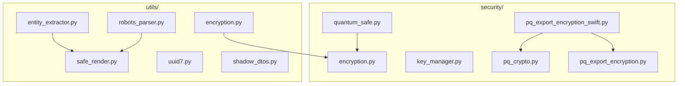

**Diagram sources**
- [security/encryption.py:1-23](file://security/encryption.py#L1-L23)
- [security/key_manager.py:1-175](file://security/key_manager.py#L1-L175)
- [security/pq_crypto.py:1-263](file://security/pq_crypto.py#L1-L263)
- [security/pq_export_encryption.py:1-479](file://security/pq_export_encryption.py#L1-L479)
- [security/pq_export_encryption_swift.py:1-404](file://security/pq_export_encryption_swift.py#L1-L404)
- [security/quantum_safe.py:1-800](file://security/quantum_safe.py#L1-L800)
- [utils/encryption.py:1-164](file://utils/encryption.py#L1-L164)
- [utils/entity_extractor.py:1-335](file://utils/entity_extractor.py#L1-L335)
- [utils/safe_render.py:1-119](file://utils/safe_render.py#L1-L119)
- [utils/robots_parser.py:1-422](file://utils/robots_parser.py#L1-L422)
- [utils/uuid7.py:1-35](file://utils/uuid7.py#L1-L35)
- [utils/shadow_dtos.py:1-262](file://utils/shadow_dtos.py#L1-L262)

**Section sources**
- [security/encryption.py:1-23](file://security/encryption.py#L1-L23)
- [utils/encryption.py:1-164](file://utils/encryption.py#L1-L164)
- [utils/entity_extractor.py:1-335](file://utils/entity_extractor.py#L1-L335)
- [utils/safe_render.py:1-119](file://utils/safe_render.py#L1-L119)
- [utils/robots_parser.py:1-422](file://utils/robots_parser.py#L1-L422)
- [utils/uuid7.py:1-35](file://utils/uuid7.py#L1-L35)
- [utils/shadow_dtos.py:1-262](file://utils/shadow_dtos.py#L1-L262)
- [security/key_manager.py:1-175](file://security/key_manager.py#L1-L175)
- [security/pq_crypto.py:1-263](file://security/pq_crypto.py#L1-L263)
- [security/pq_export_encryption.py:1-479](file://security/pq_export_encryption.py#L1-L479)
- [security/pq_export_encryption_swift.py:1-404](file://security/pq_export_encryption_swift.py#L1-L404)
- [security/quantum_safe.py:1-800](file://security/quantum_safe.py#L1-L800)

## Core Components
- AES-GCM encryption helpers:
  - Low-level AES-GCM functions for symmetric encryption/decryption
  - High-level DataEncryption class with environment-based key management and base64 serialization
- Post-quantum cryptography:
  - Hybrid signature sets (P-256 + optional ML-DSA-65)
  - HPKE export encryption with X-Wing ML-KEM-768/X25519
  - Swift-backed backend for macOS 26+ integration
- Key management:
  - Master key derivation via HKDF, LMDB-backed storage, and mlock protection
- Entity extraction:
  - Regex-based extractor for emails, crypto addresses, API keys, IPs, onion links, and sensitive patterns
- Safe rendering:
  - Markdown and HTML escaping, safe link rendering, and fenced code escaping
- Robots parsing:
  - robots.txt and sitemap parsing with caching, TTL, and memory-limited LRU eviction
- UUID generation:
  - Runtime UUIDv7 generation with fallback to uuid4 for older Python versions
- Shadow DTOs:
  - msgspec Struct twins for benchmarking and parity testing without affecting live DTOs

**Section sources**
- [security/encryption.py:6-22](file://security/encryption.py#L6-L22)
- [utils/encryption.py:36-164](file://utils/encryption.py#L36-L164)
- [security/pq_crypto.py:44-94](file://security/pq_crypto.py#L44-L94)
- [security/pq_export_encryption.py:44-91](file://security/pq_export_encryption.py#L44-L91)
- [security/pq_export_encryption_swift.py:176-404](file://security/pq_export_encryption_swift.py#L176-L404)
- [security/key_manager.py:53-175](file://security/key_manager.py#L53-L175)
- [utils/entity_extractor.py:69-335](file://utils/entity_extractor.py#L69-L335)
- [utils/safe_render.py:42-119](file://utils/safe_render.py#L42-L119)
- [utils/robots_parser.py:55-422](file://utils/robots_parser.py#L55-L422)
- [utils/uuid7.py:19-35](file://utils/uuid7.py#L19-L35)
- [utils/shadow_dtos.py:29-154](file://utils/shadow_dtos.py#L29-L154)

## Architecture Overview
The security utilities integrate symmetric encryption, post-quantum cryptography, and safe rendering to protect sensitive data and enforce compliance during export and rendering.

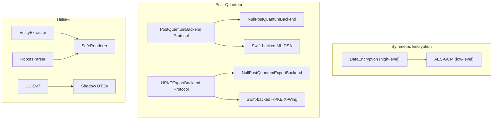

**Diagram sources**
- [security/encryption.py:6-22](file://security/encryption.py#L6-L22)
- [utils/encryption.py:36-164](file://utils/encryption.py#L36-L164)
- [security/pq_crypto.py:96-263](file://security/pq_crypto.py#L96-L263)
- [security/pq_export_encryption.py:173-359](file://security/pq_export_encryption.py#L173-L359)
- [security/pq_export_encryption_swift.py:176-404](file://security/pq_export_encryption_swift.py#L176-L404)
- [utils/entity_extractor.py:69-335](file://utils/entity_extractor.py#L69-L335)
- [utils/safe_render.py:42-119](file://utils/safe_render.py#L42-L119)
- [utils/robots_parser.py:55-422](file://utils/robots_parser.py#L55-L422)
- [utils/uuid7.py:19-35](file://utils/uuid7.py#L19-L35)
- [utils/shadow_dtos.py:29-154](file://utils/shadow_dtos.py#L29-L154)

## Detailed Component Analysis

### Symmetric Encryption Helpers
- Low-level AES-GCM:
  - Generates random 96-bit nonces and produces 128-bit authentication tags
  - Serializes nonce + tag + ciphertext for transport
- High-level DataEncryption:
  - Environment-driven key loading (base64), session-generated keys, and error handling
  - Base64-encodes ciphertext, nonce, and tag for safe transport
  - Removes legacy XOR fallback; strict AES-GCM enforcement

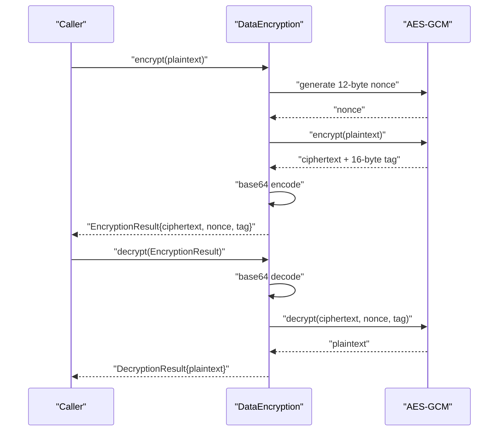

**Diagram sources**
- [utils/encryption.py:69-158](file://utils/encryption.py#L69-L158)
- [security/encryption.py:6-22](file://security/encryption.py#L6-L22)

**Section sources**
- [security/encryption.py:6-22](file://security/encryption.py#L6-L22)
- [utils/encryption.py:36-164](file://utils/encryption.py#L36-L164)

### Post-Quantum Cryptography and Export Encryption
- Hybrid signatures:
  - P-256 as primary signature; optional ML-DSA-65 for macOS 26+ environments
  - Fail-soft behavior when PQ backend unavailable
- HPKE export encryption:
  - X-Wing ML-KEM-768 + X25519 + AES-GCM-256
  - Swift-backed backend with helper tool resolution and status caching
  - Envelope design excludes private key material; supports persistent keychain or test-only ephemeral keys

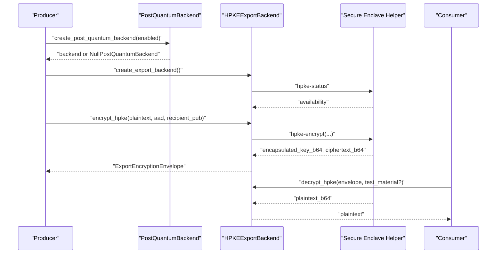

**Diagram sources**
- [security/pq_crypto.py:208-263](file://security/pq_crypto.py#L208-L263)
- [security/pq_export_encryption.py:304-359](file://security/pq_export_encryption.py#L304-L359)
- [security/pq_export_encryption_swift.py:176-404](file://security/pq_export_encryption_swift.py#L176-L404)

**Section sources**
- [security/pq_crypto.py:1-263](file://security/pq_crypto.py#L1-L263)
- [security/pq_export_encryption.py:1-479](file://security/pq_export_encryption.py#L1-L479)
- [security/pq_export_encryption_swift.py:1-404](file://security/pq_export_encryption_swift.py#L1-L404)

### Key Management
- Master key derivation:
  - HKDF-based per-bucket key generation from master key and salt
  - LMDB-backed storage with versioning and locking
  - mlock protection for key buffers during bootstrap
- Rotation and migration:
  - New master key generation with incremented version
  - Optional migration preserving backward-read capability

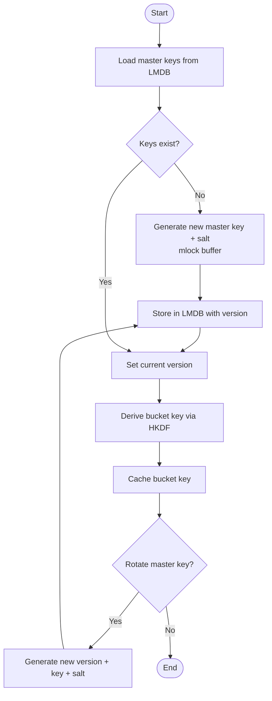

**Diagram sources**
- [security/key_manager.py:73-175](file://security/key_manager.py#L73-L175)

**Section sources**
- [security/key_manager.py:1-175](file://security/key_manager.py#L1-L175)

### Entity Extraction Tools
- Pattern types:
  - Emails, BTC/ETH/XMR addresses, AWS/Google/Stripe keys, IP addresses, onion links, private keys, passwords, generic API keys, URLs, phone numbers
- Confidence scoring:
  - Heuristic adjustments based on pattern characteristics
- Critical data detection:
  - Flags private keys, passwords, and API keys for risk mitigation
- Statistics and reset:
  - Tracks scans, entities found, critical findings, and per-pattern counts

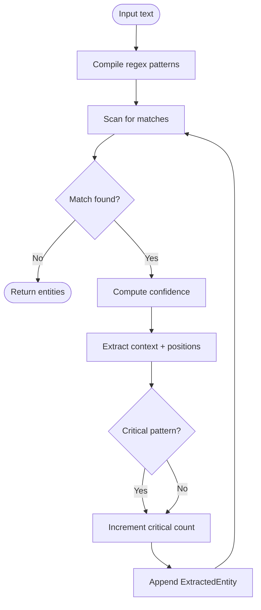

**Diagram sources**
- [utils/entity_extractor.py:87-314](file://utils/entity_extractor.py#L87-L314)

**Section sources**
- [utils/entity_extractor.py:1-335](file://utils/entity_extractor.py#L1-L335)

### Safe Rendering Mechanisms
- Markdown escaping:
  - Escapes backslash, backticks, asterisks, underscores, brackets, parentheses, angle brackets, pipes, and newlines
- HTML escaping:
  - Uses html.escape with quote=True
- Safe Markdown links:
  - Validates URL schemes (http/https/ftp/mailto), escapes labels, percent-encodes parentheses to prevent injection
- Safe code fences:
  - Escapes backslash and backtick to prevent fence breakout

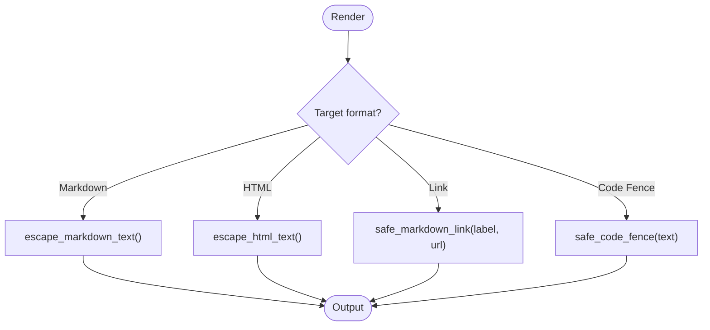

**Diagram sources**
- [utils/safe_render.py:42-119](file://utils/safe_render.py#L42-L119)

**Section sources**
- [utils/safe_render.py:1-119](file://utils/safe_render.py#L1-L119)

### Robots Parser Utilities
- robots.txt parsing:
  - Supports allow/disallow rules, crawl-delay, and sitemap directives
  - Caching with TTL and LRU eviction (limited to 128 domains)
- Sitemap parsing:
  - Memory-efficient regex-based extraction with URL limits and index detection
- Async session reuse:
  - Shared aiohttp.ClientSession via async context manager

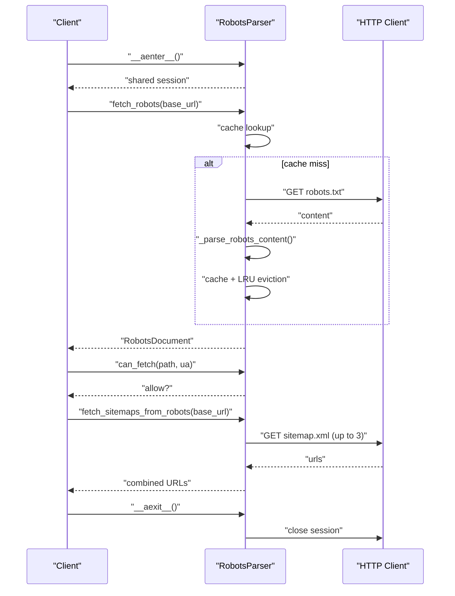

**Diagram sources**
- [utils/robots_parser.py:89-414](file://utils/robots_parser.py#L89-L414)

**Section sources**
- [utils/robots_parser.py:1-422](file://utils/robots_parser.py#L1-L422)

### UUID Generation
- Runtime identifiers:
  - Returns time-ordered UUIDv7 strings when available; falls back to uuid4 on older Python versions
  - Provides truncated prefixes for short labels and logs usage guidance

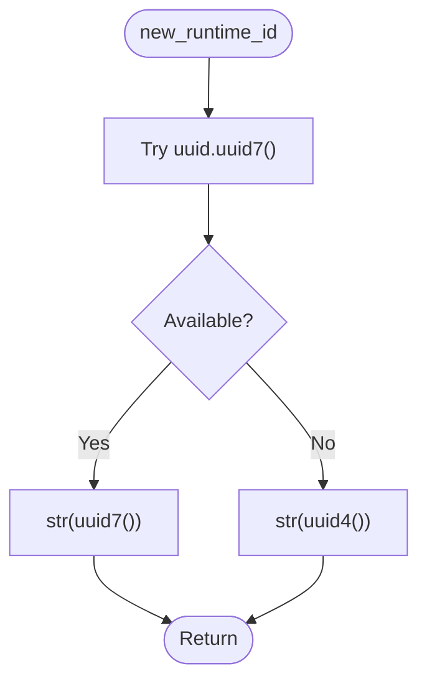

**Diagram sources**
- [utils/uuid7.py:13-26](file://utils/uuid7.py#L13-L26)

**Section sources**
- [utils/uuid7.py:1-35](file://utils/uuid7.py#L1-L35)

### Shadow DTO Patterns
- Purpose:
  - Benchmarks msgspec.Struct vs dataclass parity without touching live DTOs
- Structure:
  - msgspec.Struct twins mirror live DTO shapes exactly
  - Baseline dataclass clones for fair comparisons
- Adapters:
  - Convertions between live DTOs and shadow variants
  - Dictionary conversions for parity testing
- Benchmarks:
  - Construction and to_dict cost measurements with speedup calculations

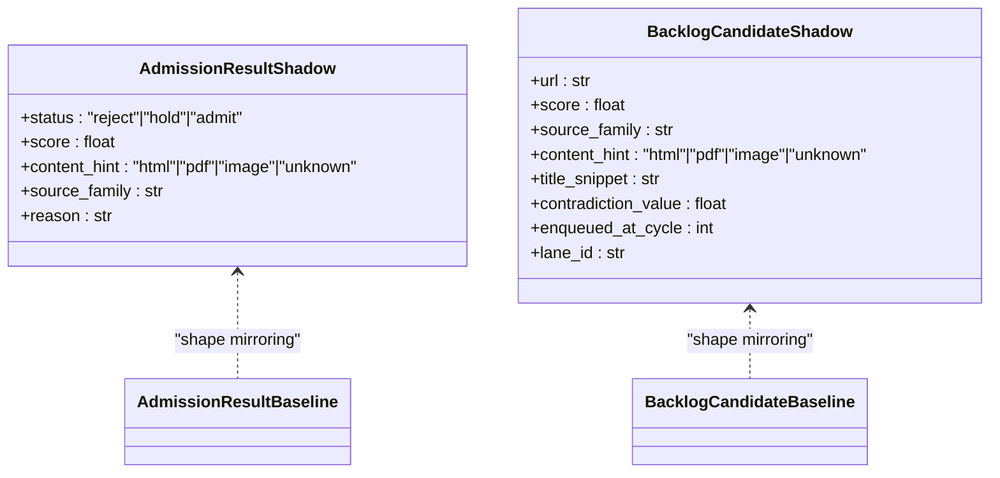

**Diagram sources**
- [utils/shadow_dtos.py:29-154](file://utils/shadow_dtos.py#L29-L154)

**Section sources**
- [utils/shadow_dtos.py:1-262](file://utils/shadow_dtos.py#L1-L262)

### Quantum-Safe Cryptography (Advanced)
- Implements:
  - ML-KEM (Kyber), ML-DSA (Dilithium), SLH-DSA (SPHINCS+)
  - Steganography (DCT, LSB, Neural)
  - Neuromorphic cryptography with SNN-based encryption/signatures
- Features:
  - Entropy pool with reseeding and mixing
  - Spiking neural networks and neuron models (Izhikevich, Hodgkin-Huxley)
  - Burst detection and temporal pattern analysis
  - Lazy initialization and memory cleanup for M1 8GB optimization

**Section sources**
- [security/quantum_safe.py:1-800](file://security/quantum_safe.py#L1-L800)

## Dependency Analysis
- Internal dependencies:
  - utils/encryption.py depends on cryptography for AES-GCM
  - security/* modules depend on cryptography and optional Swift helper tool
  - utils/safe_render.py depends on html module for HTML escaping
  - utils/robots_parser.py depends on aiohttp for async HTTP
- External integrations:
  - Swift-backed HPKE and ML-DSA via secure enclave helper tool
  - LMDB for key storage in KeyManager

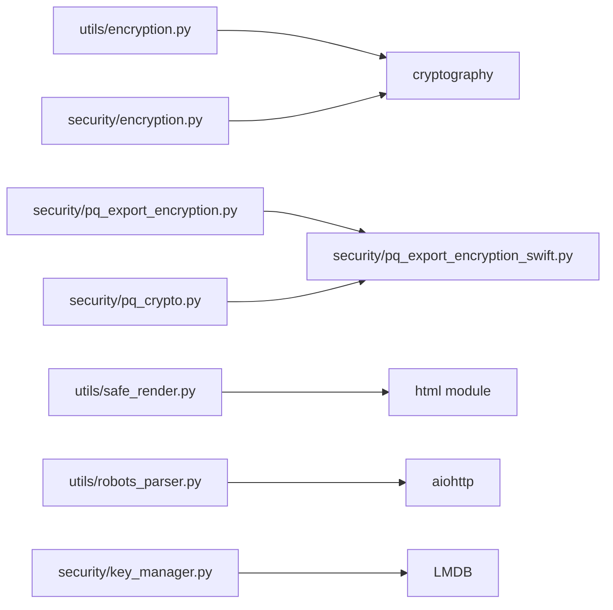

**Diagram sources**
- [utils/encryption.py:81-87](file://utils/encryption.py#L81-L87)
- [security/encryption.py:2-3](file://security/encryption.py#L2-L3)
- [security/pq_export_encryption.py:332-335](file://security/pq_export_encryption.py#L332-L335)
- [security/pq_export_encryption_swift.py:176-404](file://security/pq_export_encryption_swift.py#L176-L404)
- [utils/safe_render.py:65-67](file://utils/safe_render.py#L65-L67)
- [utils/robots_parser.py:26-27](file://utils/robots_parser.py#L26-L27)
- [security/key_manager.py:57-65](file://security/key_manager.py#L57-L65)

**Section sources**
- [utils/encryption.py:1-164](file://utils/encryption.py#L1-L164)
- [security/encryption.py:1-23](file://security/encryption.py#L1-L23)
- [security/pq_export_encryption.py:1-479](file://security/pq_export_encryption.py#L1-L479)
- [security/pq_export_encryption_swift.py:1-404](file://security/pq_export_encryption_swift.py#L1-L404)
- [utils/safe_render.py:1-119](file://utils/safe_render.py#L1-L119)
- [utils/robots_parser.py:1-422](file://utils/robots_parser.py#L1-L422)
- [security/key_manager.py:1-175](file://security/key_manager.py#L1-L175)

## Performance Considerations
- Memory constraints:
  - RobotsParser enforces cache size limits and TTL-based eviction for M1 8GB environments
  - QuantumSafeVault and NeuromorphicCryptoEngine use lazy initialization and cleanup to manage memory
- Benchmarking:
  - Shadow DTOs provide construction and serialization cost measurements for msgspec vs dataclass
- Asynchronous I/O:
  - Shared aiohttp sessions reduce overhead and improve throughput
- Cryptographic efficiency:
  - AES-GCM with 12-byte nonces and 16-byte tags balances security and performance
  - HKDF-derived per-bucket keys minimize repeated KDF computations via caching

[No sources needed since this section provides general guidance]

## Troubleshooting Guide
- Encryption failures:
  - Missing cryptography library: DataEncryption reports import errors and returns failure results
  - Legacy XOR fallback removed: Decryption rejects legacy data with explicit error
- PQ backend issues:
  - Import failures or runtime errors fall back to NullPostQuantumBackend; availability states logged
  - HPKE helper missing or not executable: Export backend returns safe defaults; helper path detection logs
- Robots parsing:
  - Large robots.txt or sitemaps ignored; cache eviction logs indicate removal
- Safe rendering:
  - Scheme validation blocks unsafe schemes; parentheses percent-encoded to prevent injection
- Key management:
  - mlock may fail silently; bootstrap-safe fail-open ensures operation continues

**Section sources**
- [utils/encryption.py:98-115](file://utils/encryption.py#L98-L115)
- [utils/encryption.py:129-135](file://utils/encryption.py#L129-L135)
- [security/pq_crypto.py:247-263](file://security/pq_crypto.py#L247-L263)
- [security/pq_export_encryption_swift.py:130-147](file://security/pq_export_encryption_swift.py#L130-L147)
- [utils/robots_parser.py:180-182](file://utils/robots_parser.py#L180-L182)
- [utils/safe_render.py:89-92](file://utils/safe_render.py#L89-L92)
- [security/key_manager.py:38-50](file://security/key_manager.py#L38-L50)

## Conclusion
The universal module’s security and cryptography utilities provide robust, production-ready capabilities:
- Secure symmetric encryption with AES-GCM and environment-driven key management
- Post-quantum readiness with hybrid signatures and HPKE export encryption
- Safe rendering and robots parsing for compliance and privacy
- Efficient entity extraction and UUID generation for operational needs
- Shadow DTOs for performance benchmarking without impacting live systems
These components collectively support cryptographic best practices, privacy-preserving workflows, and secure communication patterns across diverse environments.