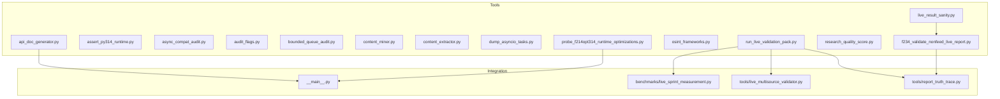
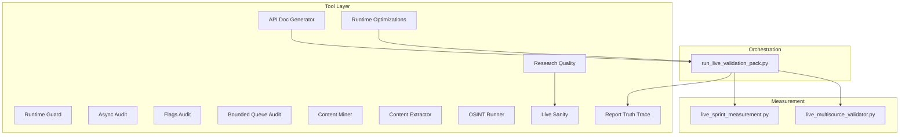
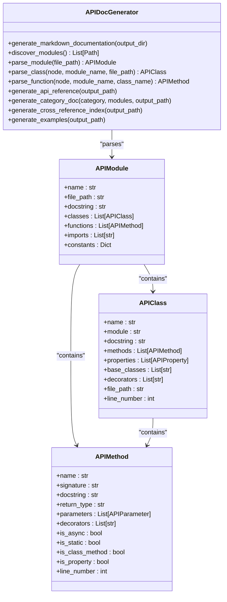
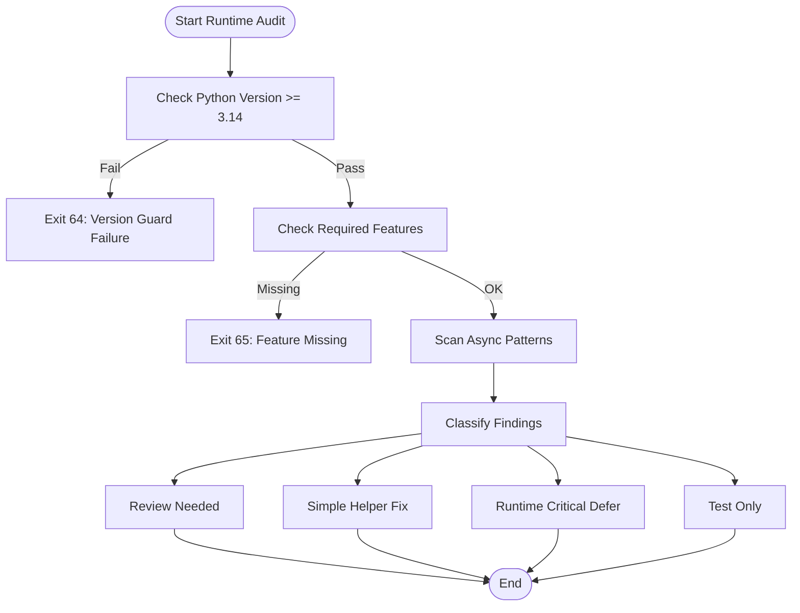
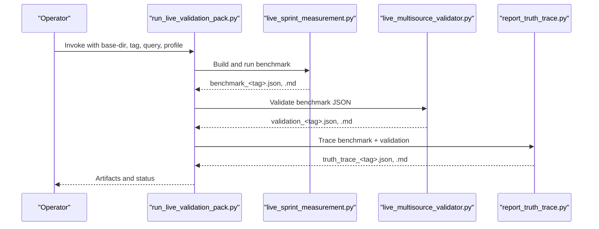
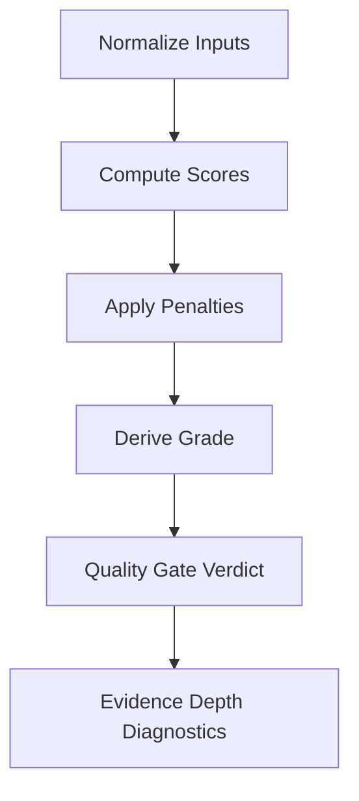
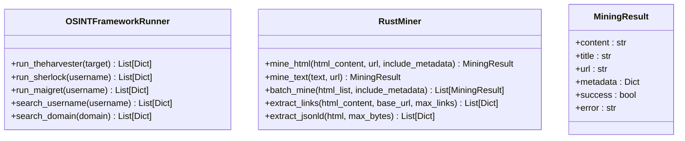
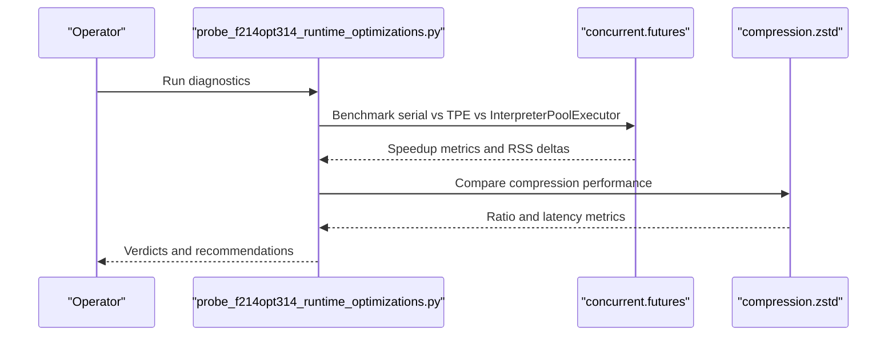
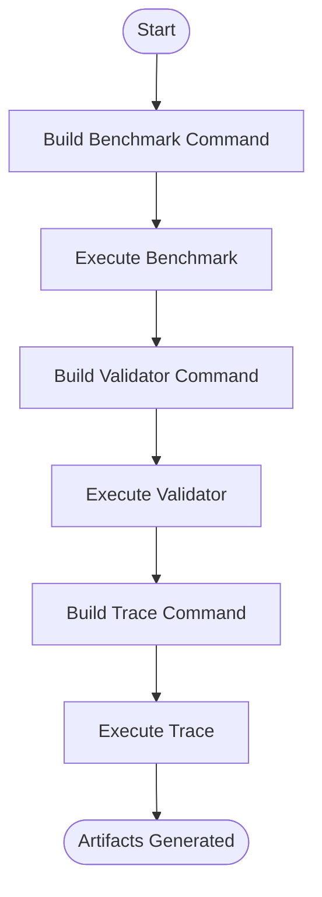

# Tool Development Framework

<cite>
**Referenced Files in This Document**
- [tools/__init__.py](file://tools/__init__.py)
- [tools/api_doc_generator.py](file://tools/api_doc_generator.py)
- [tools/assert_py314_runtime.py](file://tools/assert_py314_runtime.py)
- [tools/async_compat_audit.py](file://tools/async_compat_audit.py)
- [tools/audit_flags.py](file://tools/audit_flags.py)
- [tools/bounded_queue_audit.py](file://tools/bounded_queue_audit.py)
- [tools/content_miner.py](file://tools/content_miner.py)
- [tools/content_extractor.py](file://tools/content_extractor.py)
- [tools/dump_asyncio_tasks.py](file://tools/dump_asyncio_tasks.py)
- [tools/f234_validate_nonfeed_live_report.py](file://tools/f234_validate_nonfeed_live_report.py)
- [tools/live_result_sanity.py](file://tools/live_result_sanity.py)
- [tools/osint_frameworks.py](file://tools/osint_frameworks.py)
- [tools/probe_f214opt314_runtime_optimizations.py](file://tools/probe_f214opt314_runtime_optimizations.py)
- [tools/research_quality_score.py](file://tools/research_quality_score.py)
- [tools/run_live_validation_pack.py](file://tools/run_live_validation_pack.py)
</cite>

## Table of Contents
1. [Introduction](#introduction)
2. [Project Structure](#project-structure)
3. [Core Components](#core-components)
4. [Architecture Overview](#architecture-overview)
5. [Detailed Component Analysis](#detailed-component-analysis)
6. [Dependency Analysis](#dependency-analysis)
7. [Performance Considerations](#performance-considerations)
8. [Troubleshooting Guide](#troubleshooting-guide)
9. [Conclusion](#conclusion)

## Introduction
This document describes the Tool Development Framework used to build, validate, and operate the Hledac platform. It covers:
- API documentation generation
- Runtime assertion and compatibility auditing
- Audit systems for configuration flags and bounded queues
- Quality assurance utilities for research validation and live result sanity
- OSINT data extraction and content mining tools
- Performance probing and optimization diagnostics
- Extensibility patterns for building new tools and integrating them into workflows

The framework emphasizes deterministic, offline-safe operations, strict validation, and reproducible outputs suitable for CI and live measurements.

## Project Structure
The Tool Development Framework is organized under the tools/ directory and integrates with broader platform modules for orchestration, intelligence, and runtime.

**Diagram sources**
- [tools/api_doc_generator.py:85-708](file://tools/api_doc_generator.py#L85-L708)
- [tools/run_live_validation_pack.py:17-61](file://tools/run_live_validation_pack.py#L17-L61)
- [tools/f234_validate_nonfeed_live_report.py:1-1003](file://tools/f234_validate_nonfeed_live_report.py#L1-L1003)
- [tools/live_result_sanity.py:1-929](file://tools/live_result_sanity.py#L1-L929)
- [tools/probe_f214opt314_runtime_optimizations.py:1-551](file://tools/probe_f214opt314_runtime_optimizations.py#L1-L551)

**Section sources**
- [tools/__init__.py:1-42](file://tools/__init__.py#L1-L42)

## Core Components
- API Documentation Generator: Parses the codebase and generates structured API documentation with categorized modules, classes, methods, and examples.
- Runtime Guards and Audits: Validate Python 3.14+ runtime features, async compatibility, configuration flags, and bounded queue usage.
- Content Mining and Extraction: Lightweight HTML and text mining with fallback strategies and link extraction.
- OSINT Frameworks: Wraps external OSINT tools (theHarvester, Sherlock, Maigret) with structured output.
- Research Quality Scoring: Computes research quality metrics from benchmark/live reports.
- Live Validation Pack: Orchestrates benchmarking, validation, and tracing in a single workflow.
- Performance Probes: Diagnoses runtime optimization opportunities and constraints.

**Section sources**
- [tools/api_doc_generator.py:85-708](file://tools/api_doc_generator.py#L85-L708)
- [tools/assert_py314_runtime.py:58-76](file://tools/assert_py314_runtime.py#L58-L76)
- [tools/async_compat_audit.py:27-155](file://tools/async_compat_audit.py#L27-L155)
- [tools/audit_flags.py:56-110](file://tools/audit_flags.py#L56-L110)
- [tools/bounded_queue_audit.py:40-134](file://tools/bounded_queue_audit.py#L40-L134)
- [tools/content_miner.py:86-800](file://tools/content_miner.py#L86-L800)
- [tools/content_extractor.py:33-242](file://tools/content_extractor.py#L33-L242)
- [tools/osint_frameworks.py:16-207](file://tools/osint_frameworks.py#L16-L207)
- [tools/research_quality_score.py:605-756](file://tools/research_quality_score.py#L605-L756)
- [tools/run_live_validation_pack.py:23-134](file://tools/run_live_validation_pack.py#L23-L134)
- [tools/probe_f214opt314_runtime_optimizations.py:425-551](file://tools/probe_f214opt314_runtime_optimizations.py#L425-L551)

## Architecture Overview
The framework follows a modular, layered architecture:
- Tool Layer: Individual utilities for documentation, auditing, mining, OSINT, validation, and probing.
- Orchestration Layer: Scripts that chain tools together (e.g., run_live_validation_pack).
- Measurement Layer: Live benchmarking and validation that produce structured JSON outputs.
- Reporting Layer: Markdown and JSON artifacts for traceability and CI consumption.

**Diagram sources**
- [tools/run_live_validation_pack.py:17-61](file://tools/run_live_validation_pack.py#L17-L61)
- [tools/live_result_sanity.py:723-800](file://tools/live_result_sanity.py#L723-L800)
- [tools/f234_validate_nonfeed_live_report.py:1-1003](file://tools/f234_validate_nonfeed_live_report.py#L1-L1003)
- [tools/probe_f214opt314_runtime_optimizations.py:425-551](file://tools/probe_f214opt314_runtime_optimizations.py#L425-L551)

## Detailed Component Analysis

### API Documentation Generator
Generates comprehensive API documentation by parsing Python modules, classes, methods, functions, docstrings, and type hints. It categorizes modules, supports cross-references, and produces Markdown and examples.

**Diagram sources**
- [tools/api_doc_generator.py:23-230](file://tools/api_doc_generator.py#L23-L230)

**Section sources**
- [tools/api_doc_generator.py:85-708](file://tools/api_doc_generator.py#L85-L708)

### Runtime Assertion Tools
- Python 3.14+ Runtime Guard: Ensures required features (uuid.uuid7, annotationlib, InterpreterPoolExecutor) are available.
- Async Compatibility Audit: Identifies deprecated asyncio patterns and classifies remediation needs.
- Bounded Queue Audit: Detects unbounded asyncio.Queue usage across runtime-critical paths.

**Diagram sources**
- [tools/assert_py314_runtime.py:58-76](file://tools/assert_py314_runtime.py#L58-L76)
- [tools/async_compat_audit.py:27-155](file://tools/async_compat_audit.py#L27-L155)
- [tools/bounded_queue_audit.py:40-134](file://tools/bounded_queue_audit.py#L40-L134)

**Section sources**
- [tools/assert_py314_runtime.py:58-76](file://tools/assert_py314_runtime.py#L58-L76)
- [tools/async_compat_audit.py:55-155](file://tools/async_compat_audit.py#L55-L155)
- [tools/bounded_queue_audit.py:17-134](file://tools/bounded_queue_audit.py#L17-L134)

### Audit Systems
- Configuration Flags Audit: Scans for new configuration flags and enforces baseline compliance, with special handling for orchestrator flag counts.
- Report Truth Trace Validator: Validates live reports for structural consistency, terminality, and quality gates.
- Live Result Sanity Checker: Compares benchmark, validator, and trace surfaces to detect discrepancies and enforce quality thresholds.

**Diagram sources**
- [tools/run_live_validation_pack.py:23-134](file://tools/run_live_validation_pack.py#L23-L134)

**Section sources**
- [tools/audit_flags.py:56-110](file://tools/audit_flags.py#L56-L110)
- [tools/f234_validate_nonfeed_live_report.py:75-800](file://tools/f234_validate_nonfeed_live_report.py#L75-L800)
- [tools/live_result_sanity.py:723-929](file://tools/live_result_sanity.py#L723-L929)
- [tools/run_live_validation_pack.py:23-134](file://tools/run_live_validation_pack.py#L23-L134)

### Quality Assurance Utilities
- Research Quality Score: Computes a composite score from findings volume, source diversity, nonfeed evidence, and penalties for feed dominance, wall-clock overrun, and memory taint.
- Live Result Sanity: Enforces consistency across benchmark, validator, and trace surfaces; handles stale terminality and wall-clock budget violations.

**Diagram sources**
- [tools/research_quality_score.py:605-756](file://tools/research_quality_score.py#L605-L756)

**Section sources**
- [tools/research_quality_score.py:605-756](file://tools/research_quality_score.py#L605-L756)
- [tools/live_result_sanity.py:378-800](file://tools/live_result_sanity.py#L378-L800)

### OSINT Data Extraction and Content Mining
- OSINT Framework Runner: Integrates external tools (theHarvester, Sherlock, Maigret) with structured output parsing and timeouts.
- Content Miner: Multi-strategy HTML/text mining with Rust-backed extraction (trafilex/traflatura), regex fallback, and link extraction with scoring.
- Content Extractor: Bounded extraction of main text and structured snippets with graceful fallbacks.

**Diagram sources**
- [tools/osint_frameworks.py:16-207](file://tools/osint_frameworks.py#L16-L207)
- [tools/content_miner.py:86-800](file://tools/content_miner.py#L86-L800)
- [tools/content_extractor.py:174-242](file://tools/content_extractor.py#L174-L242)

**Section sources**
- [tools/osint_frameworks.py:16-207](file://tools/osint_frameworks.py#L16-L207)
- [tools/content_miner.py:86-800](file://tools/content_miner.py#L86-L800)
- [tools/content_extractor.py:33-242](file://tools/content_extractor.py#L33-L242)

### Performance Probing and Optimization
- Runtime Optimizations Probe: Benchmarks InterpreterPoolExecutor vs ThreadPoolExecutor, evaluates compression trade-offs, and checks JIT/tail-call status.
- Dump Asyncio Tasks: Manually dumps asyncio task state for stuck sprints using Python 3.14+ asyncio module.

**Diagram sources**
- [tools/probe_f214opt314_runtime_optimizations.py:425-551](file://tools/probe_f214opt314_runtime_optimizations.py#L425-L551)
- [tools/dump_asyncio_tasks.py:45-172](file://tools/dump_asyncio_tasks.py#L45-L172)

**Section sources**
- [tools/probe_f214opt314_runtime_optimizations.py:1-551](file://tools/probe_f214opt314_runtime_optimizations.py#L1-L551)
- [tools/dump_asyncio_tasks.py:25-172](file://tools/dump_asyncio_tasks.py#L25-L172)

### Tool Chaining Workflows
The run_live_validation_pack.py orchestrates a three-stage workflow:
1. Benchmark: Generates benchmark JSON and Markdown.
2. Validate: Runs validator to produce validation JSON and Markdown.
3. Trace: Produces truth trace JSON and Markdown.

**Diagram sources**
- [tools/run_live_validation_pack.py:23-134](file://tools/run_live_validation_pack.py#L23-L134)

**Section sources**
- [tools/run_live_validation_pack.py:23-134](file://tools/run_live_validation_pack.py#L23-L134)

### Automated Testing Frameworks
- Live Validation Pack Runner: Provides dry-run and execute modes to validate end-to-end workflows.
- Research Quality Score: Includes CLI for generating quality reports from benchmark/live JSON.
- Async Compatibility Audit: Produces structured JSON and Markdown reports for CI consumption.

**Section sources**
- [tools/run_live_validation_pack.py:114-134](file://tools/run_live_validation_pack.py#L114-L134)
- [tools/research_quality_score.py:762-778](file://tools/research_quality_score.py#L762-L778)
- [tools/async_compat_audit.py:114-155](file://tools/async_compat_audit.py#L114-L155)

### Versioning, Compatibility, and Extensibility
- Version Guard: Ensures Python 3.14+ runtime features are available before execution.
- Compatibility Audits: Detects deprecated patterns and classifies remediation paths.
- Extensibility Patterns:
  - Modular tool design with clear entry points and CLI interfaces.
  - Structured outputs (JSON/Markdown) for downstream consumers.
  - Configurable baselines (e.g., flags baseline) for controlled evolution.

**Section sources**
- [tools/assert_py314_runtime.py:58-76](file://tools/assert_py314_runtime.py#L58-L76)
- [tools/audit_flags.py:56-110](file://tools/audit_flags.py#L56-L110)
- [tools/async_compat_audit.py:55-155](file://tools/async_compat_audit.py#L55-L155)

## Dependency Analysis
The tools depend primarily on standard library modules and platform-specific integrations. There is minimal coupling between tools, enabling independent development and deployment.

```mermaid
graph TB
A["api_doc_generator.py"] --> B["ast"]
A --> C["inspect"]
A --> D["json"]
E["assert_py314_runtime.py"] --> F["sys"]
G["async_compat_audit.py"] --> H["re"]
G --> I["json"]
J["audit_flags.py"] --> K["ast"]
J --> L["json"]
M["bounded_queue_audit.py"] --> N["re"]
M --> O["json"]
P["content_miner.py"] --> Q["re"]
P --> R["asyncio"]
P --> S["selectolax/lxml"]
T["content_extractor.py"] --> U["BeautifulSoup"]
T --> V["re"]
W["osint_frameworks.py"] --> X["asyncio"]
W --> Y["json"]
Z["research_quality_score.py"] --> AA["json"]
Z --> AB["_safe_dataclass_to_dict"]
AC["run_live_validation_pack.py"] --> AD["subprocess"]
AC --> AE["pathlib"]
AF["probe_f214opt314_runtime_optimizations.py"] --> AG["concurrent.futures"]
AF --> AH["psutil"]
AF --> AI["gzip"]
AF --> AJ["compression.zstd"]
AK["live_result_sanity.py"] --> AL["json"]
AK --> AM["pathlib"]
AN["dump_asyncio_tasks.py"] --> AO["subprocess"]
AN --> AP["time"]
```

**Diagram sources**
- [tools/api_doc_generator.py:9-21](file://tools/api_doc_generator.py#L9-L21)
- [tools/assert_py314_runtime.py:18-20](file://tools/assert_py314_runtime.py#L18-L20)
- [tools/async_compat_audit.py:19-25](file://tools/async_compat_audit.py#L19-L25)
- [tools/audit_flags.py:7-12](file://tools/audit_flags.py#L7-L12)
- [tools/bounded_queue_audit.py:7-12](file://tools/bounded_queue_audit.py#L7-L12)
- [tools/content_miner.py:12-18](file://tools/content_miner.py#L12-L18)
- [tools/content_extractor.py:8-12](file://tools/content_extractor.py#L8-L12)
- [tools/osint_frameworks.py:6-12](file://tools/osint_frameworks.py#L6-L12)
- [tools/research_quality_score.py:14-22](file://tools/research_quality_score.py#L14-L22)
- [tools/run_live_validation_pack.py:12-15](file://tools/run_live_validation_pack.py#L12-L15)
- [tools/probe_f214opt314_runtime_optimizations.py:14-26](file://tools/probe_f214opt314_runtime_optimizations.py#L14-L26)
- [tools/live_result_sanity.py:14-21](file://tools/live_result_sanity.py#L14-L21)
- [tools/dump_asyncio_tasks.py:17-23](file://tools/dump_asyncio_tasks.py#L17-L23)

**Section sources**
- [tools/api_doc_generator.py:9-21](file://tools/api_doc_generator.py#L9-L21)
- [tools/assert_py314_runtime.py:18-20](file://tools/assert_py314_runtime.py#L18-L20)
- [tools/async_compat_audit.py:19-25](file://tools/async_compat_audit.py#L19-L25)
- [tools/audit_flags.py:7-12](file://tools/audit_flags.py#L7-L12)
- [tools/bounded_queue_audit.py:7-12](file://tools/bounded_queue_audit.py#L7-L12)
- [tools/content_miner.py:12-18](file://tools/content_miner.py#L12-L18)
- [tools/content_extractor.py:8-12](file://tools/content_extractor.py#L8-L12)
- [tools/osint_frameworks.py:6-12](file://tools/osint_frameworks.py#L6-L12)
- [tools/research_quality_score.py:14-22](file://tools/research_quality_score.py#L14-L22)
- [tools/run_live_validation_pack.py:12-15](file://tools/run_live_validation_pack.py#L12-L15)
- [tools/probe_f214opt314_runtime_optimizations.py:14-26](file://tools/probe_f214opt314_runtime_optimizations.py#L14-L26)
- [tools/live_result_sanity.py:14-21](file://tools/live_result_sanity.py#L14-L21)
- [tools/dump_asyncio_tasks.py:17-23](file://tools/dump_asyncio_tasks.py#L17-L23)

## Performance Considerations
- Memory-Conscious Design: Content miners avoid building large DOM trees and use streaming or regex-based extraction when dependencies are unavailable.
- Fallback Strategies: Tools degrade gracefully when optional dependencies are missing, ensuring robust operation on constrained environments.
- Benchmarking and Profiling: Dedicated probes evaluate executor performance and compression effectiveness to guide optimization decisions.
- Bounded Outputs: Extractors truncate and bound outputs to prevent excessive memory usage.

[No sources needed since this section provides general guidance]

## Troubleshooting Guide
- Asyncio Task Inspection: Use dump_asyncio_tasks.py to capture task state for stuck processes.
- Stale Terminality: Live sanity checker flags stale trace verdicts; use allow-stale-trace only when appropriate.
- Wallclock Budget Exceeded: Sanity checker reports actual vs planned durations; adjust plans or optimize execution.
- Research Quality Failures: Investigate quality gates and evidence depth diagnostics to identify root causes.

**Section sources**
- [tools/dump_asyncio_tasks.py:45-172](file://tools/dump_asyncio_tasks.py#L45-L172)
- [tools/live_result_sanity.py:410-428](file://tools/live_result_sanity.py#L410-L428)
- [tools/research_quality_score.py:668-756](file://tools/research_quality_score.py#L668-L756)

## Conclusion
The Tool Development Framework provides a comprehensive toolkit for documenting APIs, asserting runtime conditions, auditing configurations and async patterns, extracting and validating content, and measuring research quality. Its modular design, structured outputs, and strict validation make it suitable for both CI and live measurement scenarios while maintaining extensibility for future tool additions.