# Tools and Utilities

<cite>
**Referenced Files in This Document**
- [tools/__init__.py](file://hledac/universal/tools/__init__.py)
- [tools/api_doc_generator.py](file://hledac/universal/tools/api_doc_generator.py)
- [tools/capability_kpi_dashboard.py](file://hledac/universal/tools/capability_kpi_dashboard.py)
- [tools/hledac_doctor.py](file://hledac/universal/tools/hledac_doctor.py)
- [tools/dump_asyncio_tasks.py](file://hledac/universal/tools/dump_asyncio_tasks.py)
- [tools/f234_nonfeed_diagnostic_preflight.py](file://hledac/universal/tools/f234_nonfeed_diagnostic_preflight.py)
- [tools/run_live_validation_pack.py](file://hledac/universal/tools/run_live_validation_pack.py)
- [tools/checkpoint.py](file://hledac/universal/tools/checkpoint.py)
- [tools/bench_gc_314_runtime.py](file://hledac/universal/tools/bench_gc_314_runtime.py)
- [tools/bench_py314_jit.py](file://hledac/universal/tools/bench_py314_jit.py)
- [tools/cp314_wheel_gate.py](file://hledac/universal/tools/cp314_wheel_gate.py)
- [tools/assert_py314_runtime.py](file://hledac/universal/tools/assert_py314_runtime.py)
- [tools/async_compat_audit.py](file://hledac/universal/tools/async_compat_audit.py)
</cite>

## Table of Contents
1. [Introduction](#introduction)
2. [Project Structure](#project-structure)
3. [Core Components](#core-components)
4. [Architecture Overview](#architecture-overview)
5. [Detailed Component Analysis](#detailed-component-analysis)
6. [Dependency Analysis](#dependency-analysis)
7. [Performance Considerations](#performance-considerations)
8. [Troubleshooting Guide](#troubleshooting-guide)
9. [Conclusion](#conclusion)
10. [Appendices](#appendices)

## Introduction
This document describes the Hledac Universal tools and utilities ecosystem. It covers utility functions, helper scripts, diagnostic tools, and development utilities that support API documentation generation, capability KPI dashboards, performance profiling, system maintenance, deployment automation, and development workflow enhancement. It also documents configuration options, usage examples, integration patterns, and guidance for extending tools and automating workflows. Compatibility considerations across Python versions and system environments are addressed.

## Project Structure
The tools ecosystem resides under the universal package’s tools directory. It includes:
- API documentation generator
- Capability KPI dashboard
- Diagnostic and runtime probes
- Performance benchmarks for Python 3.14 features
- Dependency and environment gates
- Validation packs and preflight checks
- Checkpoint utilities for bounded serialization

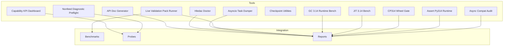

**Diagram sources**
- [tools/api_doc_generator.py:85-708](file://hledac/universal/tools/api_doc_generator.py#L85-L708)
- [tools/capability_kpi_dashboard.py:606-755](file://hledac/universal/tools/capability_kpi_dashboard.py#L606-L755)
- [tools/hledac_doctor.py:225-389](file://hledac/universal/tools/hledac_doctor.py#L225-L389)
- [tools/dump_asyncio_tasks.py:45-172](file://hledac/universal/tools/dump_asyncio_tasks.py#L45-L172)
- [tools/f234_nonfeed_diagnostic_preflight.py:211-243](file://hledac/universal/tools/f234_nonfeed_diagnostic_preflight.py#L211-L243)
- [tools/run_live_validation_pack.py:23-134](file://hledac/universal/tools/run_live_validation_pack.py#L23-L134)
- [tools/checkpoint.py:21-87](file://hledac/universal/tools/checkpoint.py#L21-L87)
- [tools/bench_gc_314_runtime.py:464-713](file://hledac/universal/tools/bench_gc_314_runtime.py#L464-L713)
- [tools/bench_py314_jit.py:236-310](file://hledac/universal/tools/bench_py314_jit.py#L236-L310)
- [tools/cp314_wheel_gate.py:202-375](file://hledac/universal/tools/cp314_wheel_gate.py#L202-L375)
- [tools/assert_py314_runtime.py:58-76](file://hledac/universal/tools/assert_py314_runtime.py#L58-L76)
- [tools/async_compat_audit.py:89-155](file://hledac/universal/tools/async_compat_audit.py#L89-L155)

**Section sources**
- [tools/__init__.py:1-42](file://hledac/universal/tools/__init__.py#L1-L42)

## Core Components
- API documentation generator: Parses the codebase and generates structured API docs with categories, cross-references, and examples.
- Capability KPI dashboard: Computes readiness and capability scores from probe artifacts without importing production modules.
- Hledac Doctor: Checks dependency availability and platform guards, outputs Markdown or JSON.
- Asyncio Task Dumper: Manually dumps asyncio task state for stuck sprints using Python 3.14+ commands.
- Nonfeed Diagnostic Preflight: Hermetic validation of acquisition plan and DuckDB safety for nonfeed diagnostics.
- Live Validation Pack Runner: Orchestrates benchmark, validator, and trace steps for live validation.
- Checkpoint Utilities: Bounded serialization helpers for safe checkpoint storage.
- GC 3.14 Runtime Bench: Measures GC behavior differences across Python 3.14.x versions.
- JIT 3.14 Bench: Compares default vs JIT-enabled import/boot performance.
- CP314 Wheel Gate: Validates macOS ARM64 wheel resolution for extras without installing.
- Assert Py314 Runtime: Guards runtime to ensure required Python 3.14 features are present.
- Async Compat Audit: Audits async patterns affected by Python 3.14 changes.

**Section sources**
- [tools/api_doc_generator.py:85-708](file://hledac/universal/tools/api_doc_generator.py#L85-L708)
- [tools/capability_kpi_dashboard.py:606-755](file://hledac/universal/tools/capability_kpi_dashboard.py#L606-L755)
- [tools/hledac_doctor.py:225-389](file://hledac/universal/tools/hledac_doctor.py#L225-L389)
- [tools/dump_asyncio_tasks.py:45-172](file://hledac/universal/tools/dump_asyncio_tasks.py#L45-L172)
- [tools/f234_nonfeed_diagnostic_preflight.py:211-243](file://hledac/universal/tools/f234_nonfeed_diagnostic_preflight.py#L211-L243)
- [tools/run_live_validation_pack.py:23-134](file://hledac/universal/tools/run_live_validation_pack.py#L23-L134)
- [tools/checkpoint.py:21-87](file://hledac/universal/tools/checkpoint.py#L21-L87)
- [tools/bench_gc_314_runtime.py:464-713](file://hledac/universal/tools/bench_gc_314_runtime.py#L464-L713)
- [tools/bench_py314_jit.py:236-310](file://hledac/universal/tools/bench_py314_jit.py#L236-L310)
- [tools/cp314_wheel_gate.py:202-375](file://hledac/universal/tools/cp314_wheel_gate.py#L202-L375)
- [tools/assert_py314_runtime.py:58-76](file://hledac/universal/tools/assert_py314_runtime.py#L58-L76)
- [tools/async_compat_audit.py:89-155](file://hledac/universal/tools/async_compat_audit.py#L89-L155)

## Architecture Overview
The tools ecosystem is organized around:
- Standalone CLI utilities with explicit exit codes and deterministic outputs
- Artifact-driven dashboards that read precomputed JSON artifacts
- Benchmarks that produce structured reports and optional JSON artifacts
- Gates and audits that validate environment and compatibility

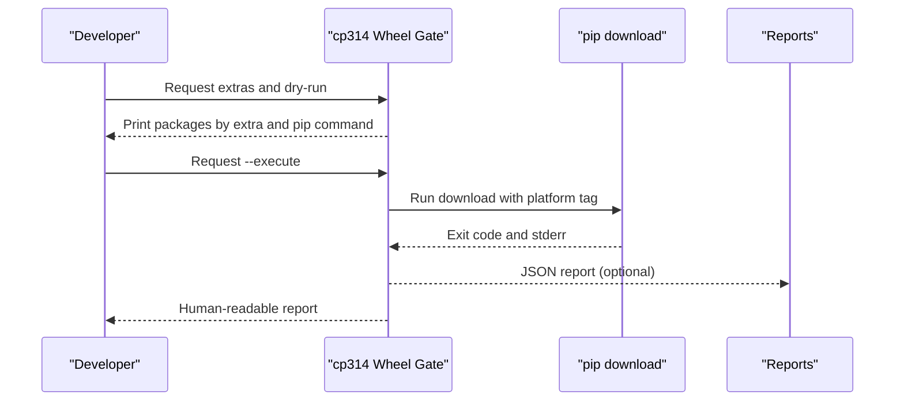

**Diagram sources**
- [tools/cp314_wheel_gate.py:202-375](file://hledac/universal/tools/cp314_wheel_gate.py#L202-L375)

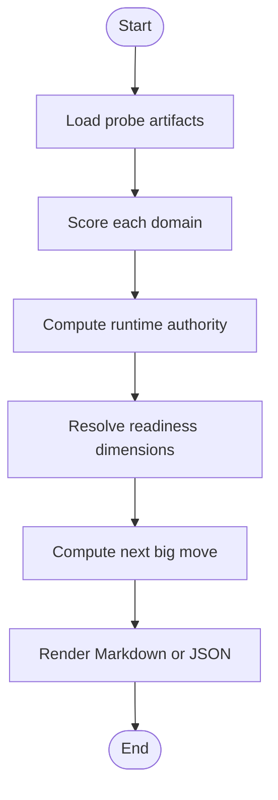

**Diagram sources**
- [tools/capability_kpi_dashboard.py:606-716](file://hledac/universal/tools/capability_kpi_dashboard.py#L606-L716)

## Detailed Component Analysis

### API Documentation Generator
- Purpose: Automatically generate comprehensive API documentation by parsing Python AST, extracting classes, methods, functions, docstrings, and type hints.
- Categories: Modules are categorized into agents, core, intelligence, llm, runtime, storage, monitoring, security, optimization, api, and utils.
- Output: Markdown API reference, category-specific docs, cross-reference index, and usage examples.
- Usage: Configure package path and output directory via CLI; runs discovery, parsing, and rendering.

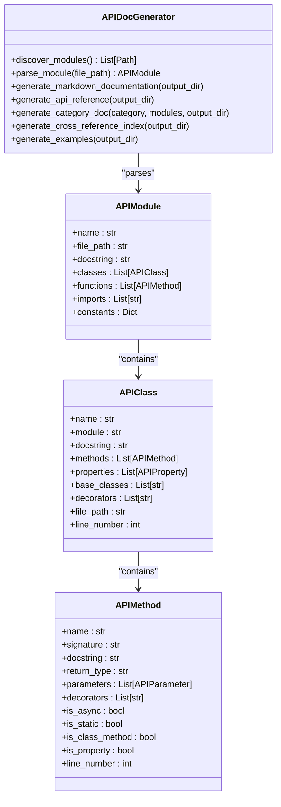

**Diagram sources**
- [tools/api_doc_generator.py:85-230](file://hledac/universal/tools/api_doc_generator.py#L85-L230)

**Section sources**
- [tools/api_doc_generator.py:85-708](file://hledac/universal/tools/api_doc_generator.py#L85-L708)

### Capability KPI Dashboard
- Purpose: Model-free readiness dashboard that computes capability_score, readiness_by_domain, blockers, and next_big_move from probe artifacts.
- Domains: Qoder truth, Transport authority, Acquisition strategy, Stealth safety, Memory safety, Graph authority, Live measurement.
- Readiness: Three readiness dimensions computed from domain scores and blockers.
- Output: JSON or Markdown; includes evidence artifacts and critical blockers.

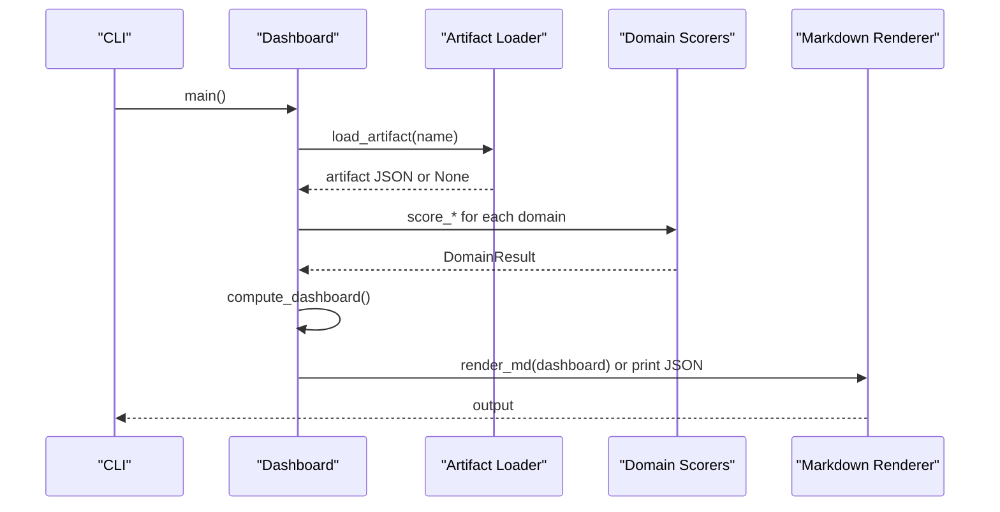

**Diagram sources**
- [tools/capability_kpi_dashboard.py:720-755](file://hledac/universal/tools/capability_kpi_dashboard.py#L720-L755)
- [tools/capability_kpi_dashboard.py:606-716](file://hledac/universal/tools/capability_kpi_dashboard.py#L606-L716)

**Section sources**
- [tools/capability_kpi_dashboard.py:606-755](file://hledac/universal/tools/capability_kpi_dashboard.py#L606-L755)

### Hledac Doctor
- Purpose: Dependency availability checker mirroring platform_info probe pattern; outputs JSON or Markdown; includes opsec warnings for Python 3.14 remote debug guard.
- Registry: Centralized dependency registry grouped by extras; supports baseline-required and optional categories.
- Output: Markdown table or JSON with statuses, missing-by-extra, and optional opsec warnings.

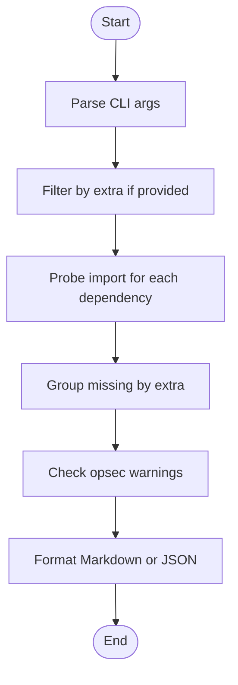

**Diagram sources**
- [tools/hledac_doctor.py:225-389](file://hledac/universal/tools/hledac_doctor.py#L225-L389)

**Section sources**
- [tools/hledac_doctor.py:225-389](file://hledac/universal/tools/hledac_doctor.py#L225-L389)

### Asyncio Task Dumper
- Purpose: Manual operator tool to dump asyncio ps and pstree for a running process using Python 3.14+ asyncio module commands.
- Usage: Provide PID; optionally set output directory and timeout; validates PID and prints saved file paths.

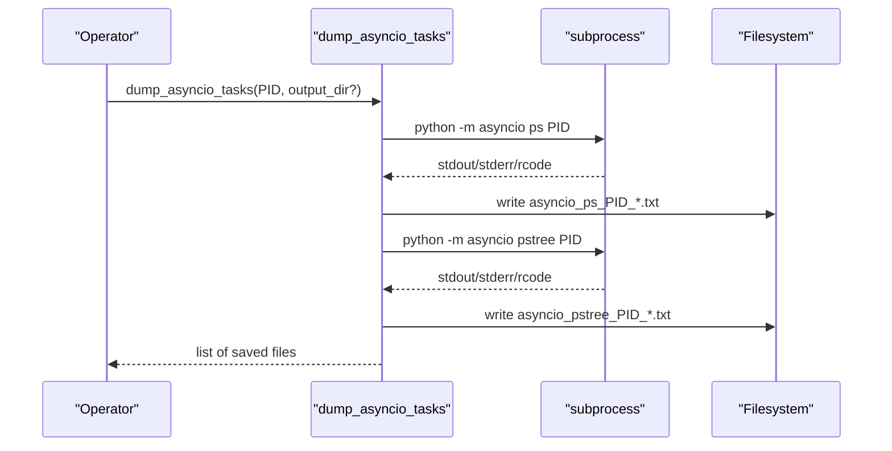

**Diagram sources**
- [tools/dump_asyncio_tasks.py:45-87](file://hledac/universal/tools/dump_asyncio_tasks.py#L45-L87)

**Section sources**
- [tools/dump_asyncio_tasks.py:45-172](file://hledac/universal/tools/dump_asyncio_tasks.py#L45-L172)

### Nonfeed Diagnostic Preflight
- Purpose: Hermetic validation for nonfeed diagnostics without live network or MLX.
- Checks: Profile normalization, acquisition plan propagation, PUBLIC lane enablement, DuckDBShadowStore aclose safety, research quality replay fixture.
- Exit codes: 0 on success, 1 on any failure.

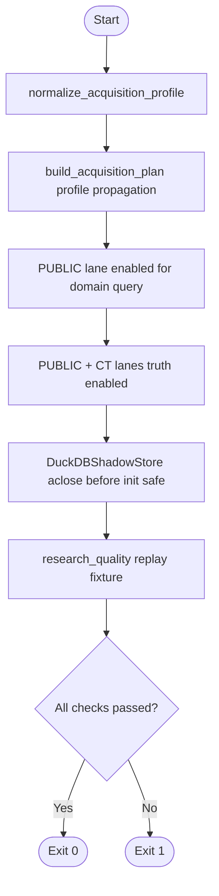

**Diagram sources**
- [tools/f234_nonfeed_diagnostic_preflight.py:211-243](file://hledac/universal/tools/f234_nonfeed_diagnostic_preflight.py#L211-L243)

**Section sources**
- [tools/f234_nonfeed_diagnostic_preflight.py:211-243](file://hledac/universal/tools/f234_nonfeed_diagnostic_preflight.py#L211-L243)

### Live Validation Pack Runner
- Purpose: One-command orchestration of benchmark, validator, and trace steps for live validation.
- Steps: Build commands for benchmark, validator, and trace; dry-run prints; execute runs each step and exits on failure.

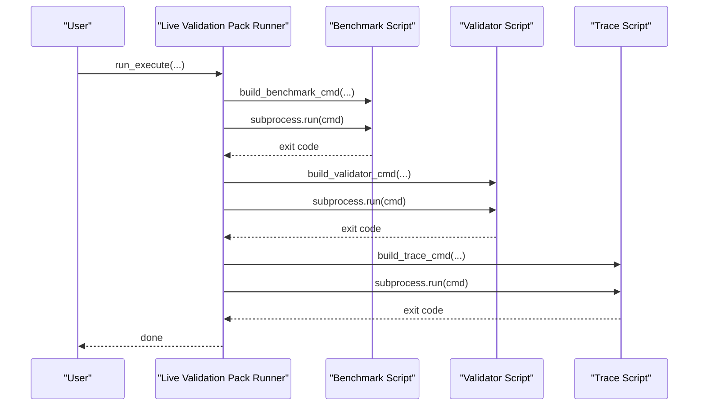

**Diagram sources**
- [tools/run_live_validation_pack.py:80-112](file://hledac/universal/tools/run_live_validation_pack.py#L80-L112)

**Section sources**
- [tools/run_live_validation_pack.py:23-134](file://hledac/universal/tools/run_live_validation_pack.py#L23-L134)

### Checkpoint Utilities
- Purpose: Safe checkpoint serialization with bounded fields to prevent oversized artifacts.
- Features: Bound host_penalties by count and value, enforce max bytes, truncate debug_info or results if needed.

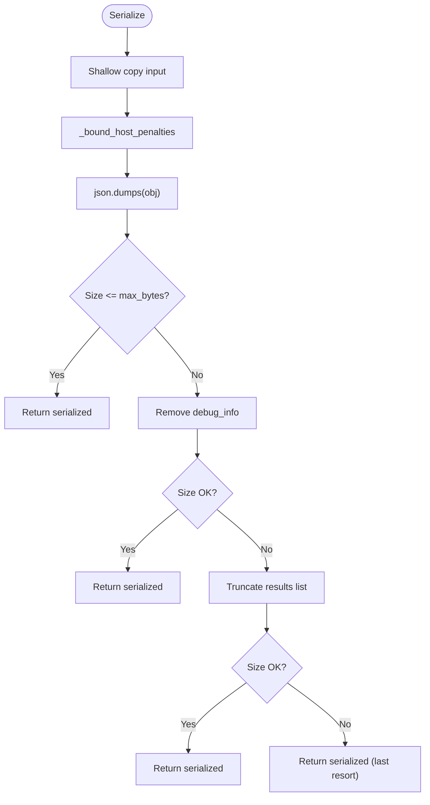

**Diagram sources**
- [tools/checkpoint.py:55-87](file://hledac/universal/tools/checkpoint.py#L55-L87)

**Section sources**
- [tools/checkpoint.py:21-87](file://hledac/universal/tools/checkpoint.py#L21-L87)

### GC 3.14 Runtime Bench
- Purpose: Compare GC behavior across Python 3.14.x versions on M1 8GB UMA; measures RSS, swap, wall clock, GC collections, and SIGINT cleanup warnings.
- Phases: Baseline GC snapshot, module import smoke, boot smoke, lightweight sprint, post-sprint GC pressure.
- Recommendation: NO_PATCH vs PATCH based on criteria (swap, wall clock, SIGINT warnings).

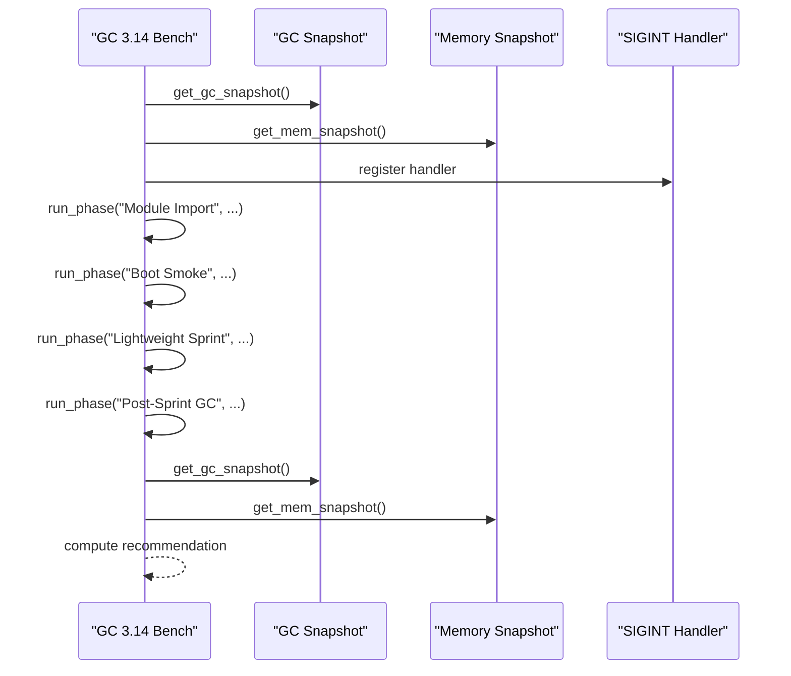

**Diagram sources**
- [tools/bench_gc_314_runtime.py:464-713](file://hledac/universal/tools/bench_gc_314_runtime.py#L464-L713)

**Section sources**
- [tools/bench_gc_314_runtime.py:464-713](file://hledac/universal/tools/bench_gc_314_runtime.py#L464-L713)

### JIT 3.14 Bench
- Purpose: Compare default vs JIT-enabled import/boot performance; report-only, no production changes.
- Benchmarks: Import smoke, boot smoke, execution optimizer smoke, content miner smoke.
- Verdict: KEEP_DISABLED or EXPERIMENTAL_ONLY depending on observed improvements.

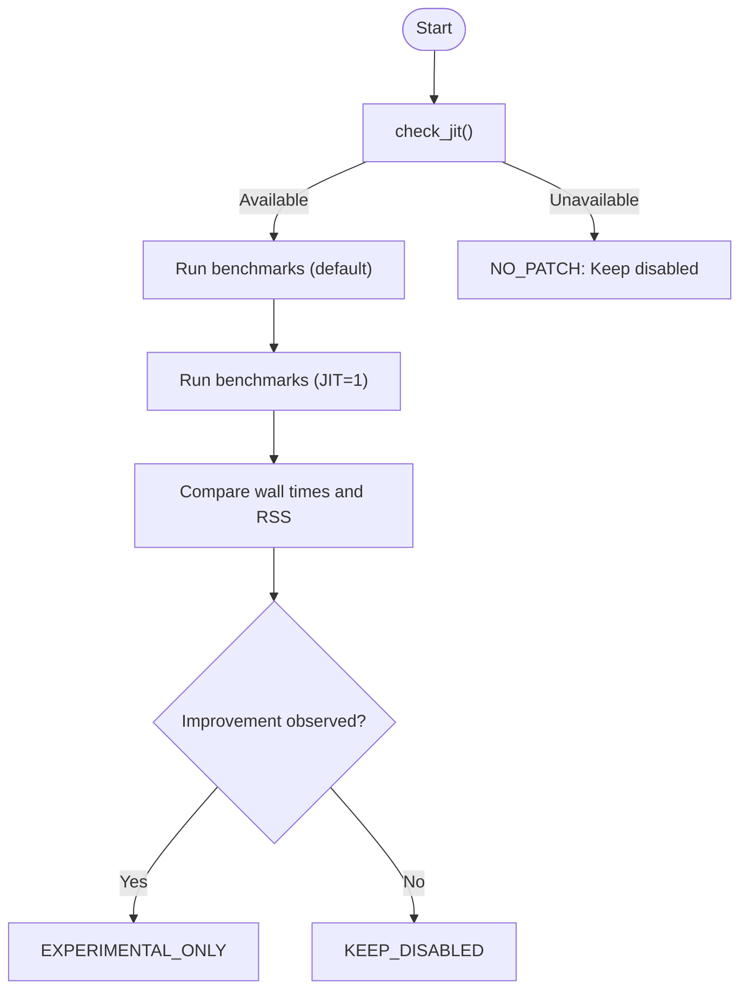

**Diagram sources**
- [tools/bench_py314_jit.py:236-310](file://hledac/universal/tools/bench_py314_jit.py#L236-L310)

**Section sources**
- [tools/bench_py314_jit.py:236-310](file://hledac/universal/tools/bench_py314_jit.py#L236-L310)

### CP314 Wheel Gate
- Purpose: Validate macOS ARM64 wheel resolution for extras without installing; supports dry-run and optional execution.
- Extras: default, light, apple-accel, osint-html, graph-storage, torch, dev, acceleration, nlp, rerank, browser, security, transport, all.
- Output: Human-readable report and optional JSON with packages by extra and pip command.

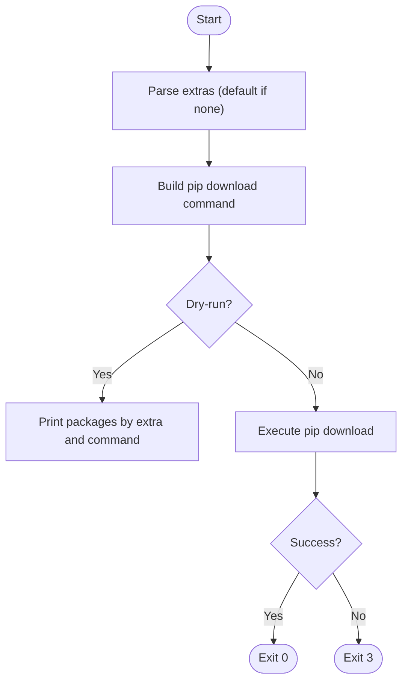

**Diagram sources**
- [tools/cp314_wheel_gate.py:202-375](file://hledac/universal/tools/cp314_wheel_gate.py#L202-L375)

**Section sources**
- [tools/cp314_wheel_gate.py:202-375](file://hledac/universal/tools/cp314_wheel_gate.py#L202-L375)

### Assert Py314 Runtime
- Purpose: Guard runtime to ensure active interpreter is Python 3.14+ with required features: annotationlib, uuid.uuid7, InterpreterPoolExecutor.
- Exit codes: 0 on success, 64 on version guard failure, 65 on feature guard failure.

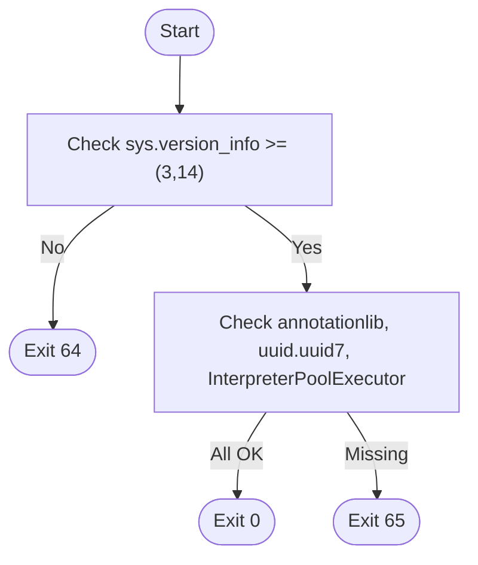

**Diagram sources**
- [tools/assert_py314_runtime.py:58-76](file://hledac/universal/tools/assert_py314_runtime.py#L58-L76)

**Section sources**
- [tools/assert_py314_runtime.py:58-76](file://hledac/universal/tools/assert_py314_runtime.py#L58-L76)

### Async Compat Audit
- Purpose: Audit async patterns affected by Python 3.14 changes and classify findings by severity and location.
- Patterns: get_event_loop, wait_for, ensure_future.
- Classification: SAFE_TEST_ONLY, NEEDS_REVIEW, SIMPLE_HELPER_FIX, RUNTIME_CRITICAL_DEFER.

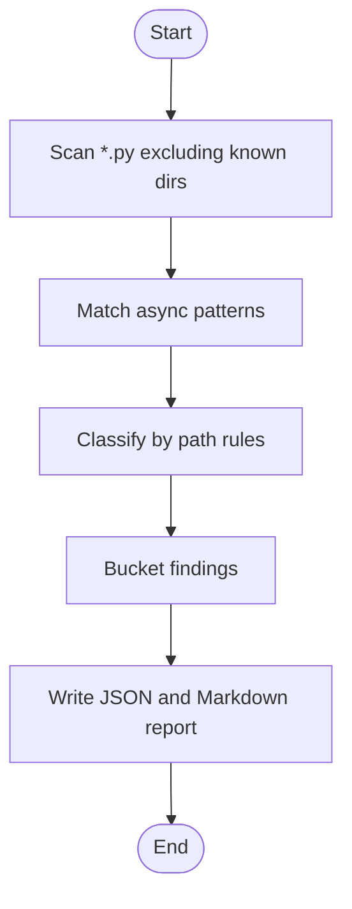

**Diagram sources**
- [tools/async_compat_audit.py:89-155](file://hledac/universal/tools/async_compat_audit.py#L89-L155)

**Section sources**
- [tools/async_compat_audit.py:89-155](file://hledac/universal/tools/async_compat_audit.py#L89-L155)

## Dependency Analysis
- Coupling: Tools are largely independent and invoked via CLI; dashboards depend on artifact files; benchmarks produce artifacts consumed by other tools.
- Cohesion: Each tool focuses on a single concern (docs, readiness, diagnostics, benchmarks, gates).
- External dependencies: Many tools rely on standard library and optional packages (psutil, resource, subprocess); some require Python 3.14+ features.

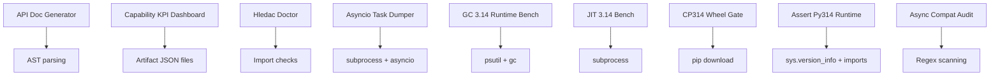

**Diagram sources**
- [tools/api_doc_generator.py:99-148](file://hledac/universal/tools/api_doc_generator.py#L99-L148)
- [tools/capability_kpi_dashboard.py:104-114](file://hledac/universal/tools/capability_kpi_dashboard.py#L104-L114)
- [tools/hledac_doctor.py:167-201](file://hledac/universal/tools/hledac_doctor.py#L167-L201)
- [tools/dump_asyncio_tasks.py:25-43](file://hledac/universal/tools/dump_asyncio_tasks.py#L25-L43)
- [tools/bench_gc_314_runtime.py:113-151](file://hledac/universal/tools/bench_gc_314_runtime.py#L113-L151)
- [tools/bench_py314_jit.py:81-131](file://hledac/universal/tools/bench_py314_jit.py#L81-L131)
- [tools/cp314_wheel_gate.py:177-200](file://hledac/universal/tools/cp314_wheel_gate.py#L177-L200)
- [tools/assert_py314_runtime.py:62-67](file://hledac/universal/tools/assert_py314_runtime.py#L62-L67)
- [tools/async_compat_audit.py:66-86](file://hledac/universal/tools/async_compat_audit.py#L66-L86)

**Section sources**
- [tools/api_doc_generator.py:99-148](file://hledac/universal/tools/api_doc_generator.py#L99-L148)
- [tools/capability_kpi_dashboard.py:104-114](file://hledac/universal/tools/capability_kpi_dashboard.py#L104-L114)
- [tools/hledac_doctor.py:167-201](file://hledac/universal/tools/hledac_doctor.py#L167-L201)
- [tools/dump_asyncio_tasks.py:25-43](file://hledac/universal/tools/dump_asyncio_tasks.py#L25-L43)
- [tools/bench_gc_314_runtime.py:113-151](file://hledac/universal/tools/bench_gc_314_runtime.py#L113-L151)
- [tools/bench_py314_jit.py:81-131](file://hledac/universal/tools/bench_py314_jit.py#L81-L131)
- [tools/cp314_wheel_gate.py:177-200](file://hledac/universal/tools/cp314_wheel_gate.py#L177-L200)
- [tools/assert_py314_runtime.py:62-67](file://hledac/universal/tools/assert_py314_runtime.py#L62-L67)
- [tools/async_compat_audit.py:66-86](file://hledac/universal/tools/async_compat_audit.py#L66-L86)

## Performance Considerations
- Prefer dry-run modes for network-heavy or destructive operations (e.g., wheel gate).
- Use bounded serialization for checkpoints to avoid oversized artifacts.
- For runtime diagnostics, leverage structured concurrency timeouts and memory snapshots to detect pressure.
- When comparing Python 3.14 features, run controlled benchmarks and interpret results against baseline conditions.

[No sources needed since this section provides general guidance]

## Troubleshooting Guide
- Capability KPI Dashboard: If computation fails, a JSON error response is emitted; verify artifact paths and permissions.
- Asyncio Task Dumper: Ensure Python 3.14+ and that the asyncio module is available; validate PID accessibility.
- Nonfeed Diagnostic Preflight: On any check failure, the runner returns non-zero; inspect printed details for failing assertion.
- Live Validation Pack Runner: On subprocess failure, the runner exits with the failing command’s return code; check intermediate artifacts.
- Checkpoint Utilities: If serialization exceeds limits, the utility attempts truncation; monitor logs for warnings.
- GC 3.14 Runtime Bench: Swap appearance or SIGINT warnings indicate potential resource leaks; review cleanup paths.
- JIT 3.14 Bench: If JIT is unavailable, keep disabled; otherwise, evaluate marginal gains for benchmarking only.
- CP314 Wheel Gate: Without --execute, only dry-run is performed; use --execute to run pip download with explicit permission.
- Assert Py314 Runtime: If version or features are missing, update interpreter to Python 3.14+ with required components.
- Async Compat Audit: Review findings by classification and address runtime-critical paths in later sprints.

**Section sources**
- [tools/capability_kpi_dashboard.py:729-750](file://hledac/universal/tools/capability_kpi_dashboard.py#L729-L750)
- [tools/dump_asyncio_tasks.py:147-167](file://hledac/universal/tools/dump_asyncio_tasks.py#L147-L167)
- [tools/f234_nonfeed_diagnostic_preflight.py:237-239](file://hledac/universal/tools/f234_nonfeed_diagnostic_preflight.py#L237-L239)
- [tools/run_live_validation_pack.py:89-111](file://hledac/universal/tools/run_live_validation_pack.py#L89-L111)
- [tools/checkpoint.py:72-86](file://hledac/universal/tools/checkpoint.py#L72-L86)
- [tools/bench_gc_314_runtime.py:615-642](file://hledac/universal/tools/bench_gc_314_runtime.py#L615-L642)
- [tools/bench_py314_jit.py:248-252](file://hledac/universal/tools/bench_py314_jit.py#L248-L252)
- [tools/cp314_wheel_gate.py:230-236](file://hledac/universal/tools/cp314_wheel_gate.py#L230-L236)
- [tools/assert_py314_runtime.py:63-72](file://hledac/universal/tools/assert_py314_runtime.py#L63-L72)
- [tools/async_compat_audit.py:149-155](file://hledac/universal/tools/async_compat_audit.py#L149-L155)

## Conclusion
The Hledac Universal tools and utilities provide a robust toolkit for documentation, diagnostics, readiness assessment, performance profiling, and environment validation. They emphasize determinism, hermetic testing, and safe defaults, enabling reliable development and deployment workflows across Python 3.14+ environments.

[No sources needed since this section summarizes without analyzing specific files]

## Appendices

### Configuration Options and Usage Examples
- API Documentation Generator
  - CLI: --package-path, --output-dir
  - Example: python tools/api_doc_generator.py --package-path hledac --output-dir docs
- Capability KPI Dashboard
  - CLI: --output-json, --output-md
  - Example: python tools/capability_kpi_dashboard.py --output-md
- Hledac Doctor
  - CLI: --json, --extra, --verbose, --output
  - Example: python tools/hledac_doctor.py --extra apple-accel --verbose
- Asyncio Task Dumper
  - CLI: <PID>, --output-dir, --timeout
  - Example: python tools/dump_asyncio_tasks.py 12345 --output-dir /tmp/dumps
- Nonfeed Diagnostic Preflight
  - CLI: none (invokes run_preflight and returns exit code)
  - Example: python tools/f234_nonfeed_diagnostic_preflight.py
- Live Validation Pack Runner
  - CLI: --base-dir, --tag, --query, --profile, --query-type, --execute
  - Example: python tools/run_live_validation_pack.py --base-dir /tmp/results --tag f209b --query "domain:example.com" --profile active300 --execute
- Checkpoint Utilities
  - API: bounded_json_dumps(obj, max_bytes)
  - Example: Use bounded_json_dumps for checkpoint serialization
- GC 3.14 Runtime Bench
  - CLI: --label, --out
  - Example: python tools/bench_gc_314_runtime.py --label test-run --out report.json
- JIT 3.14 Bench
  - CLI: none (runs benchmarks and prints comparison)
  - Example: python3.14 tools/bench_py314_jit.py
- CP314 Wheel Gate
  - CLI: --extra, --dry-run/--execute, --output-json, --python-version
  - Example: python tools/cp314_wheel_gate.py --extra apple-accel --output-json wheels.json
- Assert Py314 Runtime
  - CLI: none
  - Example: python tools/assert_py314_runtime.py
- Async Compat Audit
  - CLI: none (runs audit and writes JSON/MD)
  - Example: python tools/async_compat_audit.py

**Section sources**
- [tools/api_doc_generator.py:688-708](file://hledac/universal/tools/api_doc_generator.py#L688-L708)
- [tools/capability_kpi_dashboard.py:720-750](file://hledac/universal/tools/capability_kpi_dashboard.py#L720-L750)
- [tools/hledac_doctor.py:367-389](file://hledac/universal/tools/hledac_doctor.py#L367-L389)
- [tools/dump_asyncio_tasks.py:89-172](file://hledac/universal/tools/dump_asyncio_tasks.py#L89-L172)
- [tools/f234_nonfeed_diagnostic_preflight.py:242-243](file://hledac/universal/tools/f234_nonfeed_diagnostic_preflight.py#L242-L243)
- [tools/run_live_validation_pack.py:114-134](file://hledac/universal/tools/run_live_validation_pack.py#L114-L134)
- [tools/checkpoint.py:55-87](file://hledac/universal/tools/checkpoint.py#L55-L87)
- [tools/bench_gc_314_runtime.py:464-713](file://hledac/universal/tools/bench_gc_314_runtime.py#L464-L713)
- [tools/bench_py314_jit.py:236-310](file://hledac/universal/tools/bench_py314_jit.py#L236-L310)
- [tools/cp314_wheel_gate.py:333-375](file://hledac/universal/tools/cp314_wheel_gate.py#L333-L375)
- [tools/assert_py314_runtime.py:58-76](file://hledac/universal/tools/assert_py314_runtime.py#L58-L76)
- [tools/async_compat_audit.py:114-155](file://hledac/universal/tools/async_compat_audit.py#L114-L155)

### Integration Patterns
- Artifact-driven dashboards: Produce JSON artifacts; consume them in dashboards for readiness and capability scoring.
- Benchmark pipelines: Chain benchmark, validator, and trace steps; propagate errors and halt on failure.
- Gates and audits: Use wheel gates and runtime asserts to validate environment before running production or benchmark code.
- Diagnostics: Use doctor and async compat audit to maintain environment hygiene and compatibility.

**Section sources**
- [tools/capability_kpi_dashboard.py:606-716](file://hledac/universal/tools/capability_kpi_dashboard.py#L606-L716)
- [tools/run_live_validation_pack.py:80-112](file://hledac/universal/tools/run_live_validation_pack.py#L80-L112)
- [tools/cp314_wheel_gate.py:202-265](file://hledac/universal/tools/cp314_wheel_gate.py#L202-L265)
- [tools/async_compat_audit.py:89-155](file://hledac/universal/tools/async_compat_audit.py#L89-L155)

### Custom Tool Development and Extension
- Follow CLI conventions: Provide help, dry-run modes, JSON output options, and explicit exit codes.
- Use bounded serialization for artifacts to prevent unbounded growth.
- Prefer deterministic, hermetic validations where possible (e.g., nonfeed preflight).
- Integrate with existing reporting and artifact systems for consistency.

[No sources needed since this section provides general guidance]

### Maintenance, Versioning, and Compatibility
- Python 3.14+ features: Guard runtime with assert_py314_runtime; audit async compatibility; benchmark JIT and GC behavior.
- Wheel validation: Use cp314 wheel gate to validate macOS ARM64 wheels for extras without installation.
- Environment checks: Use hledac_doctor to verify dependency availability and platform guards.
- Compatibility audits: Use async compat audit to track and mitigate changes in Python 3.14.

**Section sources**
- [tools/assert_py314_runtime.py:58-76](file://hledac/universal/tools/assert_py314_runtime.py#L58-L76)
- [tools/bench_py314_jit.py:236-310](file://hledac/universal/tools/bench_py314_jit.py#L236-L310)
- [tools/bench_gc_314_runtime.py:464-713](file://hledac/universal/tools/bench_gc_314_runtime.py#L464-L713)
- [tools/cp314_wheel_gate.py:202-375](file://hledac/universal/tools/cp314_wheel_gate.py#L202-L375)
- [tools/hledac_doctor.py:225-389](file://hledac/universal/tools/hledac_doctor.py#L225-L389)
- [tools/async_compat_audit.py:89-155](file://hledac/universal/tools/async_compat_audit.py#L89-L155)