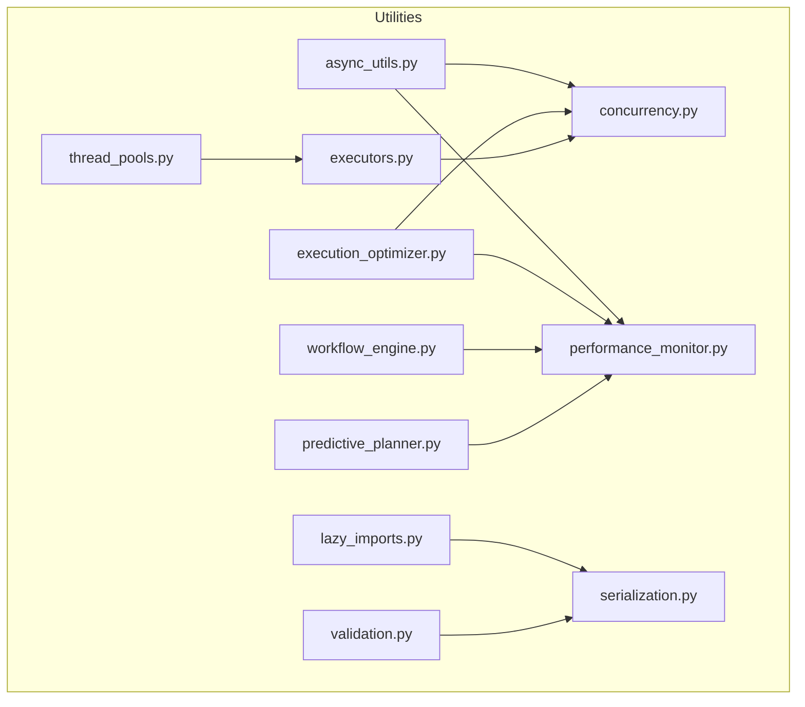
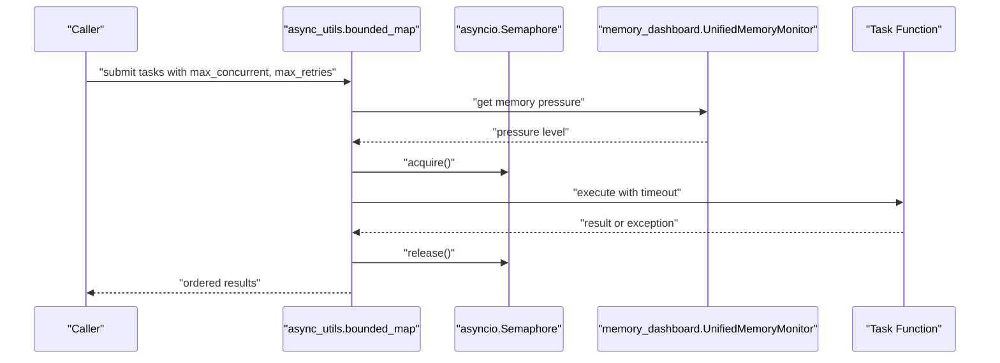
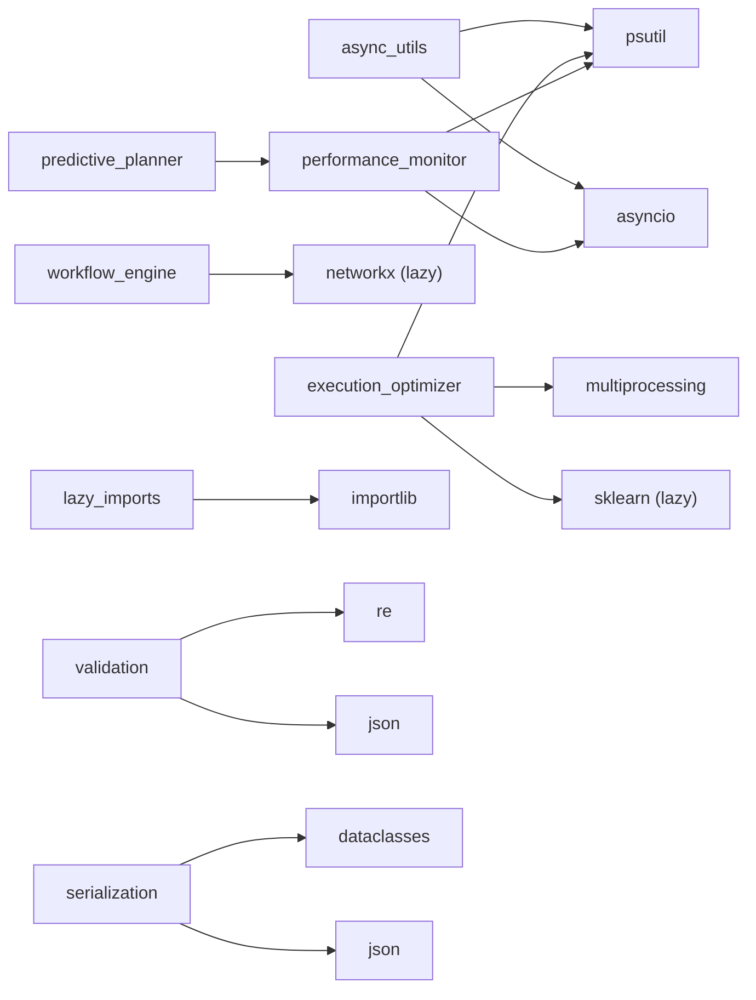

# Utility Functions

<cite>
**Referenced Files in This Document**
- [utils/__init__.py](file://utils/__init__.py)
- [utils/async_utils.py](file://utils/async_utils.py)
- [utils/execution_optimizer.py](file://utils/execution_optimizer.py)
- [utils/workflow_engine.py](file://utils/workflow_engine.py)
- [utils/lazy_imports.py](file://utils/lazy_imports.py)
- [utils/serialization.py](file://utils/serialization.py)
- [utils/validation.py](file://utils/validation.py)
- [utils/concurrency.py](file://utils/concurrency.py)
- [utils/executors.py](file://utils/executors.py)
- [utils/thread_pools.py](file://utils/thread_pools.py)
- [utils/performance_monitor.py](file://utils/performance_monitor.py)
- [utils/predictive_planner.py](file://utils/predictive_planner.py)
</cite>

## Table of Contents
1. [Introduction](#introduction)
2. [Project Structure](#project-structure)
3. [Core Components](#core-components)
4. [Architecture Overview](#architecture-overview)
5. [Detailed Component Analysis](#detailed-component-analysis)
6. [Dependency Analysis](#dependency-analysis)
7. [Performance Considerations](#performance-considerations)
8. [Troubleshooting Guide](#troubleshooting-guide)
9. [Conclusion](#conclusion)
10. [Appendices](#appendices)

## Introduction
This document covers the utility functions and helpers that power the Universal Research Orchestrator. It focuses on asynchronous programming utilities, concurrency primitives, execution optimizers, workflow engines, lazy import systems, serialization utilities, and validation frameworks. Practical usage patterns, configuration options, performance characteristics, and integration strategies are explained to help developers leverage these utilities effectively across the system.

## Project Structure
The utility layer is organized around cohesive functional areas:
- Asynchronous helpers for bounded concurrency and graceful error handling
- Execution optimizer for adaptive parallelism and resource-aware scheduling
- Workflow engine for DAG-based orchestration with retries and conditional logic
- Lazy import system to defer expensive imports until needed
- Serialization utilities for safe dataclass-to-dict conversion and JSON serialization
- Validation framework for robust data validation with caching and structured error reporting
- Concurrency primitives and shared executors for controlled parallelism
- Performance monitoring and predictive planning for system-wide observability and speculative execution

**Diagram sources**
- [utils/async_utils.py:1-231](file://utils/async_utils.py#L1-L231)
- [utils/execution_optimizer.py:1-800](file://utils/execution_optimizer.py#L1-L800)
- [utils/workflow_engine.py:1-369](file://utils/workflow_engine.py#L1-L369)
- [utils/lazy_imports.py:1-243](file://utils/lazy_imports.py#L1-L243)
- [utils/serialization.py:1-150](file://utils/serialization.py#L1-L150)
- [utils/validation.py:1-656](file://utils/validation.py#L1-L656)
- [utils/concurrency.py:1-142](file://utils/concurrency.py#L1-L142)
- [utils/executors.py:1-28](file://utils/executors.py#L1-L28)
- [utils/thread_pools.py:1-327](file://utils/thread_pools.py#L1-L327)
- [utils/performance_monitor.py:1-537](file://utils/performance_monitor.py#L1-L537)
- [utils/predictive_planner.py:1-365](file://utils/predictive_planner.py#L1-L365)

**Section sources**
- [utils/__init__.py:1-273](file://utils/__init__.py#L1-L273)

## Core Components
- Asynchronous helpers: bounded concurrency, retries with exponential backoff, streaming completion, and memory-aware throttling
- Execution optimizer: adaptive strategies, resource-aware scheduling, worker pools, and M1-specific constraints
- Workflow engine: DAG validation, topological execution, conditional/loop tasks, and retry/backoff
- Lazy import system: on-demand module loading with statistics and preloading
- Serialization utilities: safe dataclass-to-dict conversion and JSON serialization with cycle handling
- Validation framework: email, URL, and JSON schema validation with caching and structured errors
- Concurrency primitives: shared semaphores for fetch limits and adaptive clearnet/Tor separation
- Executors: centralized thread pools for CPU-bound and I/O-bound workloads
- Performance monitor: throughput, speedup, quality scoring, and system metrics
- Predictive planner: speculative execution, prediction accuracy tracking, and rollback management

**Section sources**
- [utils/__init__.py:23-272](file://utils/__init__.py#L23-L272)

## Architecture Overview
The utilities integrate across layers to enable scalable, observable, and resilient automation:
- Async helpers coordinate parallel tasks with bounded concurrency and memory-aware throttling
- Execution optimizer adapts worker allocation and strategies based on system metrics and task profiles
- Workflow engine orchestrates DAG-based pipelines with retries and conditional logic
- Lazy import system reduces cold-start overhead by deferring expensive imports
- Serialization and validation utilities ensure safe data handling and robust input validation
- Concurrency primitives and executors enforce resource boundaries and improve throughput
- Performance monitor and predictive planner provide observability and speculative acceleration

**Diagram sources**
- [utils/async_utils.py:78-156](file://utils/async_utils.py#L78-L156)

**Section sources**
- [utils/async_utils.py:1-231](file://utils/async_utils.py#L1-L231)

## Detailed Component Analysis

### Asynchronous Programming Utilities
Asynchronous helpers provide bounded concurrency, retry logic, and streaming completion:
- bounded_map: executes a list of (callable, args, kwargs) tasks with a BoundedSemaphore, optional timeouts, and exponential backoff with jitter
- map_as_completed: streams results as they complete using a bounded queue to prevent unbounded memory growth
- bounded_gather: simplified wrapper around bounded_map for gather semantics
- TaskResult: structured result container with success/error tracking

Key behaviors:
- Memory-aware throttling: checks memory pressure and reduces concurrency when above threshold
- Retry strategy: exponential backoff with jitter for transient failures
- Python 3.11+ TaskGroup support for cancel_on_error behavior
- Index-mapping preserves input order even with partial failures

Common usage patterns:
- Batch processing with bounded concurrency and retries
- Streaming results for real-time pipelines
- Controlled parallelism with timeout enforcement

**Section sources**
- [utils/async_utils.py:40-231](file://utils/async_utils.py#L40-L231)

### Concurrency Primitives and Shared Semaphores
Centralized concurrency control ensures predictable parallelism:
- Fetch semaphore: shared semaphore for network fetches with dynamic adjustment
- Clearnet/Tor separation: distinct semaphores to avoid head-of-line blocking
- Adaptive limits: reduce concurrency under memory pressure on M1 systems

Integration patterns:
- Use get_fetch_semaphore() to gate network operations
- Adjust limits dynamically after heavy LLM usage
- Separate clearnet and Tor pools for fairness and responsiveness

**Section sources**
- [utils/concurrency.py:18-142](file://utils/concurrency.py#L18-L142)

### Execution Optimizer and Worker Pools
The execution optimizer coordinates adaptive parallelism:
- Strategies: round-robin, load-balanced, resource-aware, predictive, adaptive
- Worker pools: thread/process pools with M1-specific tuning
- Resource monitoring: CPU/memory/thermal state for throttling decisions
- Bounded pending operations: prevents unbounded task creation on constrained hardware
- Lazy ML predictor: defers sklearn import to avoid cold-start overhead

Key configuration:
- Environment variable HLEDAC_MAX_PENDING_OPS controls pending operation limit
- M1 8GB defaults tuned for Metal memory pressure
- Auto-tuning and learning rate for adaptive strategies

Execution patterns:
- Round-robin: distribute tasks evenly across workers
- Load-balanced: distribute based on current worker loads
- Resource-aware: classify tasks by resource profile and allocate accordingly
- Predictive: train on historical data to predict execution times
- Adaptive: adjust worker count based on performance feedback

**Section sources**
- [utils/execution_optimizer.py:36-800](file://utils/execution_optimizer.py#L36-L800)

### Thread Pools and Named Executors
Named executors provide specialized worker pools:
- CPU pool: P-cores with User Initiated QoS for compute-intensive tasks
- IO pool: E-cores with Background QoS for I/O-bound tasks
- PersistentActorExecutor: dedicated worker thread bridging sync work to event loop
- ANE/DB executors: specialized actors for Apple Neural Engine and database workloads

Health monitoring:
- Tracks submitted/completed/orphaned job counts
- Graceful shutdown via sentinel-based protocol
- Thread-safe queue with condition-based wakeups

**Section sources**
- [utils/thread_pools.py:18-327](file://utils/thread_pools.py#L18-L327)

### Workflow Engine
DAG-based workflow execution with robust retry and conditional logic:
- Task types: normal, conditional, loop, parallel
- Validation: DAG acyclicity and dependency resolution
- Execution: topological ordering with level-wise parallelism
- Retry/backoff: exponential backoff with configurable attempts
- Parameter resolution: context-driven parameter substitution

Use cases:
- Multi-stage research pipelines
- Conditional branching based on intermediate results
- Looping over dynamic sets of tasks
- Parallel processing within stages

**Section sources**
- [utils/workflow_engine.py:36-369](file://utils/workflow_engine.py#L36-L369)

### Lazy Import System
On-demand module loading to reduce cold-start time:
- LazyLoader: defers import until attribute access
- LazyImportManager: central registry with statistics tracking
- Preloading: force-load modules ahead of time
- Decorator support: inject lazy loaders into function signatures

Benefits:
- Reduced startup time for expensive libraries
- Statistics for performance monitoring
- Cache hits for repeated access

**Section sources**
- [utils/lazy_imports.py:42-243](file://utils/lazy_imports.py#L42-L243)

### Serialization Utilities
Safe conversion and JSON serialization for complex dataclasses:
- _safe_dataclass_to_dict: shallow-copy dict/list fields, handle cycles, unwrap enums
- _make_serializable: replace cycles with placeholders, convert Path to str
- safe_to_json: drop-in replacement for json.dumps(asdict(obj), default=str)

Use cases:
- Exporting runtime reports with nested structures
- Logging complex dataclass instances
- Interoperability with external systems

**Section sources**
- [utils/serialization.py:23-150](file://utils/serialization.py#L23-L150)

### Validation Framework
Robust validation with caching and structured error reporting:
- DataValidator: email, URL, JSON schema validation with memoization
- ValidationSeverity: INFO/WARNING/ERROR/CRITICAL severity levels
- ValidationError: structured error with timestamp
- Custom validators: extensible rule system

Performance optimizations:
- Pre-compiled regex patterns
- LRU cache for validation results
- Type checks mapped to JSON schema types

**Section sources**
- [utils/validation.py:51-656](file://utils/validation.py#L51-L656)

### Performance Monitor and Predictive Planner
Observability and speculative acceleration:
- PerformanceMonitor: generation metrics, speedup tracking, quality scoring
- QualityValidator: similarity-based quality checks
- SystemMonitor: thermal/memory pressure tracking with callbacks
- PredictivePlanner: speculative execution, prediction accuracy, rollback management

Integration:
- FlowTraceSnapshotEmitter: periodic system snapshots for tracing
- Metrics feeding into adaptive strategies and throttling decisions

**Section sources**
- [utils/performance_monitor.py:69-537](file://utils/performance_monitor.py#L69-L537)
- [utils/predictive_planner.py:103-365](file://utils/predictive_planner.py#L103-L365)

## Dependency Analysis
The utilities form a cohesive ecosystem with minimal coupling:
- async_utils depends on asyncio, memory dashboard (optional), and Python 3.11+ TaskGroup
- execution_optimizer integrates with psutil, multiprocessing, and sklearn (lazy)
- workflow_engine depends on networkx (lazy) for DAG validation
- performance_monitor integrates with psutil and asyncio
- predictive planner relies on performance_monitor for system state

**Diagram sources**
- [utils/async_utils.py:29-35](file://utils/async_utils.py#L29-L35)
- [utils/execution_optimizer.py:6-33](file://utils/execution_optimizer.py#L6-L33)
- [utils/workflow_engine.py:22-31](file://utils/workflow_engine.py#L22-L31)
- [utils/performance_monitor.py:13-20](file://utils/performance_monitor.py#L13-L20)
- [utils/predictive_planner.py:11-18](file://utils/predictive_planner.py#L11-L18)
- [utils/lazy_imports.py:21-27](file://utils/lazy_imports.py#L21-L27)
- [utils/validation.py:8-14](file://utils/validation.py#L8-L14)
- [utils/serialization.py:15-21](file://utils/serialization.py#L15-L21)

**Section sources**
- [utils/async_utils.py:1-231](file://utils/async_utils.py#L1-L231)
- [utils/execution_optimizer.py:1-800](file://utils/execution_optimizer.py#L1-L800)
- [utils/workflow_engine.py:1-369](file://utils/workflow_engine.py#L1-L369)
- [utils/lazy_imports.py:1-243](file://utils/lazy_imports.py#L1-L243)
- [utils/serialization.py:1-150](file://utils/serialization.py#L1-L150)
- [utils/validation.py:1-656](file://utils/validation.py#L1-L656)
- [utils/performance_monitor.py:1-537](file://utils/performance_monitor.py#L1-L537)
- [utils/predictive_planner.py:1-365](file://utils/predictive_planner.py#L1-L365)

## Performance Considerations
- Memory-aware concurrency: async helpers and execution optimizer reduce concurrency under memory pressure to prevent OOM
- Adaptive worker allocation: execution optimizer dynamically adjusts worker counts based on system metrics and task profiles
- Lazy imports: defer expensive library imports until needed to reduce cold-start time
- Predictive planning: speculative execution accelerates common paths while maintaining correctness via rollback
- Threading QoS: thread pools set appropriate QoS classes for Apple Silicon to balance responsiveness and efficiency
- Bounded pending operations: prevents unbounded task creation on constrained hardware like M1 8GB

Best practices:
- Use bounded_map for batch processing with retries and timeouts
- Leverage adaptive limits for clearnet/Tor separation
- Employ lazy imports for optional heavy dependencies
- Apply validation caching for frequently reused schemas
- Monitor system metrics and throttle when thermal/memory pressure is high

[No sources needed since this section provides general guidance]

## Troubleshooting Guide
Common issues and resolutions:
- Memory pressure causing reduced concurrency: monitor memory pressure and reduce max_concurrent or use bounded_map with memory_pressure_check
- Task failures: configure retryable_exceptions and max_retries; use TaskResult to track individual task outcomes
- OOM on M1: lower HLEDAC_MAX_PENDING_OPS; reduce worker pools; use resource-aware strategies
- Circular references in dataclasses: use safe_to_json to serialize without RecursionError
- Validation failures: review ValidationError details and adjust schemas or input data
- Workflow deadlocks: ensure DAG acyclicity and correct dependency declarations

**Section sources**
- [utils/async_utils.py:78-156](file://utils/async_utils.py#L78-L156)
- [utils/execution_optimizer.py:189-205](file://utils/execution_optimizer.py#L189-L205)
- [utils/serialization.py:130-150](file://utils/serialization.py#L130-L150)
- [utils/validation.py:325-381](file://utils/validation.py#L325-L381)
- [utils/workflow_engine.py:148-179](file://utils/workflow_engine.py#L148-L179)

## Conclusion
The utility functions provide a robust foundation for asynchronous, observable, and adaptive automation. By combining bounded concurrency, adaptive execution strategies, DAG-based workflows, lazy imports, safe serialization, and comprehensive validation, the system achieves high performance and reliability across diverse environments, especially constrained platforms like M1 8GB devices.

[No sources needed since this section summarizes without analyzing specific files]

## Appendices

### Practical Usage Patterns
- Async helpers: batch processing with bounded_map, streaming results with map_as_completed
- Execution optimizer: adaptive strategies for mixed workloads, resource-aware task classification
- Workflow engine: multi-stage pipelines with conditional branches and retries
- Lazy imports: optional ML libraries, large datasets, or heavy frameworks
- Serialization: exporting runtime reports, logging complex structures
- Validation: input sanitization, schema enforcement, custom validators
- Concurrency: fetch limits, clearnet/Tor separation, dynamic adjustments
- Executors: CPU-bound vs I/O-bound workloads, specialized actors for ANE/DB
- Performance monitor: throughput tracking, quality scoring, system state monitoring
- Predictive planner: speculative execution for common paths, rollback on mispredictions

[No sources needed since this section provides general guidance]