# HTTP Transports

<cite>
**Referenced Files in This Document**
- [base.py](file://transport/base.py)
- [httpx_transport.py](file://transport/httpx_transport.py)
- [httpx_client.py](file://transport/httpx_client.py)
- [inmemory_transport.py](file://transport/inmemory_transport.py)
- [transport_resolver.py](file://transport/transport_resolver.py)
- [transport_router.py](file://transport/transport_router.py)
- [circuit_breaker.py](file://transport/circuit_breaker.py)
- [session_runtime.py](file://network/session_runtime.py)
- [domain_concurrency.py](file://network/domain_concurrency.py)
- [session_manager.py](file://tools/session_manager.py)
- [curl_cffi_transport.py](file://transport/curl_cffi_transport.py)
- [curl_cffi_runtime.py](file://transport/curl_cffi_runtime.py)
</cite>

## Table of Contents
1. [Introduction](#introduction)
2. [Project Structure](#project-structure)
3. [Core Components](#core-components)
4. [Architecture Overview](#architecture-overview)
5. [Detailed Component Analysis](#detailed-component-analysis)
6. [Dependency Analysis](#dependency-analysis)
7. [Performance Considerations](#performance-considerations)
8. [Troubleshooting Guide](#troubleshooting-guide)
9. [Security Considerations](#security-considerations)
10. [Conclusion](#conclusion)

## Introduction
This document explains the HTTP transport implementations in the universal module, focusing on:
- HTTPX transport for standard HTTP/HTTPS requests using the HTTPX library, including async/await support, connection pooling, and retry/error classification.
- In-memory transport for testing and internal use cases, including mock responses and session isolation.
- Shared transport interface contracts, common methods, and error handling patterns.
- Configuration options for timeouts, headers, proxies, and SSL verification.
- Integration with session management systems and connection reuse strategies.
- Performance optimization techniques, concurrent request handling, and resource cleanup.
- Examples of transport usage across normal operation, testing, and debugging.
- Security considerations for HTTP communications, certificate validation, and man-in-the-middle attack prevention.

## Project Structure
The transport layer is organized around a small set of modules:
- Transport interface contract
- HTTPX transport and client
- In-memory transport
- Transport routing and resolution
- Circuit breaker and session/runtime utilities
- Session manager for persisted credentials
- Curl-cffi integration for stealth/anti-bot escalation

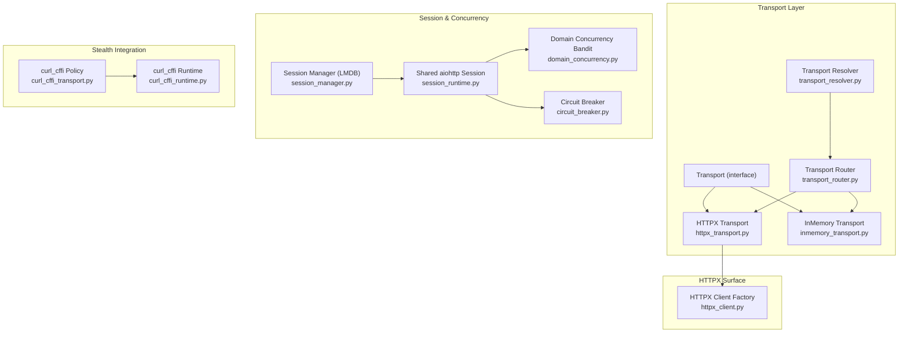

**Diagram sources**
- [base.py:1-24](file://transport/base.py#L1-L24)
- [httpx_transport.py:1-532](file://transport/httpx_transport.py#L1-L532)
- [inmemory_transport.py:1-98](file://transport/inmemory_transport.py#L1-L98)
- [transport_router.py:1-358](file://transport/transport_router.py#L1-L358)
- [transport_resolver.py:1-361](file://transport/transport_resolver.py#L1-L361)
- [httpx_client.py:1-213](file://transport/httpx_client.py#L1-L213)
- [session_runtime.py:1-442](file://network/session_runtime.py#L1-L442)
- [domain_concurrency.py:1-215](file://network/domain_concurrency.py#L1-L215)
- [circuit_breaker.py:1-429](file://transport/circuit_breaker.py#L1-L429)
- [session_manager.py:1-302](file://tools/session_manager.py#L1-L302)
- [curl_cffi_transport.py:1-86](file://transport/curl_cffi_transport.py#L1-L86)
- [curl_cffi_runtime.py:1-193](file://transport/curl_cffi_runtime.py#L1-L193)

**Section sources**
- [base.py:1-24](file://transport/base.py#L1-L24)
- [httpx_transport.py:1-532](file://transport/httpx_transport.py#L1-L532)
- [inmemory_transport.py:1-98](file://transport/inmemory_transport.py#L1-L98)
- [transport_router.py:1-358](file://transport/transport_router.py#L1-L358)
- [transport_resolver.py:1-361](file://transport/transport_resolver.py#L1-L361)
- [httpx_client.py:1-213](file://transport/httpx_client.py#L1-L213)
- [session_runtime.py:1-442](file://network/session_runtime.py#L1-L442)
- [domain_concurrency.py:1-215](file://network/domain_concurrency.py#L1-L215)
- [circuit_breaker.py:1-429](file://transport/circuit_breaker.py#L1-L429)
- [session_manager.py:1-302](file://tools/session_manager.py#L1-L302)
- [curl_cffi_transport.py:1-86](file://transport/curl_cffi_transport.py#L1-L86)
- [curl_cffi_runtime.py:1-193](file://transport/curl_cffi_runtime.py#L1-L193)

## Core Components
- Transport interface: Defines the contract for all transports, including lifecycle and messaging methods.
- HTTPX transport: Provides HTTP/2-capable fetch with manual redirect handling, SSRF protections, and error classification.
- HTTPX client factory: Lazy, singleton HTTPX AsyncClient with configurable limits and timeouts.
- In-memory transport: Lightweight in-process transport for testing and internal bus simulation with bounded queues and handlers.
- Transport router: Stateless policy that selects lanes (aiohttp_default, httpx_h2, curl_cffi_stealth, tor_socks, i2p_socks, js_renderer).
- Transport resolver: Domain-classification helper for darknet routing and policy gates.
- Circuit breaker: Domain-scoped resilience with adaptive recovery and half-open probing.
- Session runtime: Shared aiohttp session with connection limits, DNS caching, and concurrency control.
- Session manager: Persistent credential storage (cookies/headers) keyed by domain using LMDB.
- Curl-cffi integration: Optional stealth escalation with profile-based impersonation and bounded session cache.

**Section sources**
- [base.py:1-24](file://transport/base.py#L1-L24)
- [httpx_transport.py:361-442](file://transport/httpx_transport.py#L361-L442)
- [httpx_client.py:93-152](file://transport/httpx_client.py#L93-L152)
- [inmemory_transport.py:14-98](file://transport/inmemory_transport.py#L14-L98)
- [transport_router.py:134-259](file://transport/transport_router.py#L134-L259)
- [transport_resolver.py:152-170](file://transport/transport_resolver.py#L152-L170)
- [circuit_breaker.py:79-186](file://transport/circuit_breaker.py#L79-L186)
- [session_runtime.py:191-229](file://network/session_runtime.py#L191-L229)
- [session_manager.py:218-241](file://tools/session_manager.py#L218-L241)
- [curl_cffi_transport.py:34-85](file://transport/curl_cffi_transport.py#L34-L85)
- [curl_cffi_runtime.py:61-88](file://transport/curl_cffi_runtime.py#L61-L88)

## Architecture Overview
The transport system separates concerns across:
- Policy (router/resolver) determines which lane to use.
- HTTPX transport executes HTTP/2 requests with safeguards.
- Shared session runtime and domain concurrency control connection reuse.
- Circuit breaker protects domains under stress.
- Session manager persists credentials for authenticated flows.
- Curl-cffi provides stealth escalation when needed.

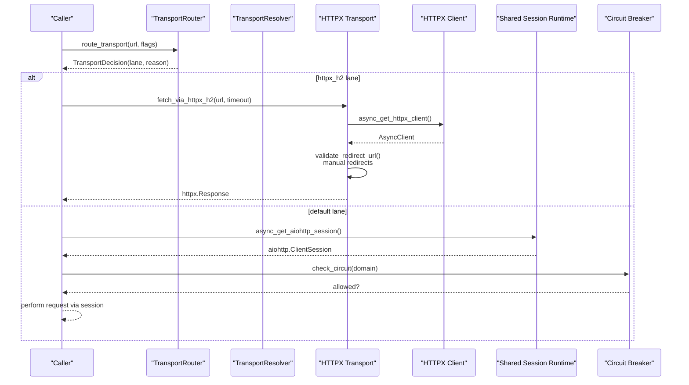

**Diagram sources**
- [transport_router.py:134-259](file://transport/transport_router.py#L134-L259)
- [httpx_transport.py:361-442](file://transport/httpx_transport.py#L361-L442)
- [httpx_client.py:93-152](file://transport/httpx_client.py#L93-L152)
- [session_runtime.py:191-229](file://network/session_runtime.py#L191-L229)
- [circuit_breaker.py:100-146](file://transport/circuit_breaker.py#L100-L146)

## Detailed Component Analysis

### HTTPX Transport
The HTTPX transport encapsulates HTTP/2-capable fetching with:
- Async/await support and manual redirect handling with SSRF validation.
- Browser-like headers to reduce fingerprinting.
- Circuit breaker to auto-disable after repeated failures.
- Error classification for retries and diagnostics.

Key behaviors:
- Redirect handling enforces safety checks and avoids loops.
- SSRF protections validate redirect targets and block private/reserved IPs.
- HTTPX client is lazily created with HTTP/2 enabled and tuned limits/timeouts.
- Environment gate controls activation of HTTPX H2 lane.

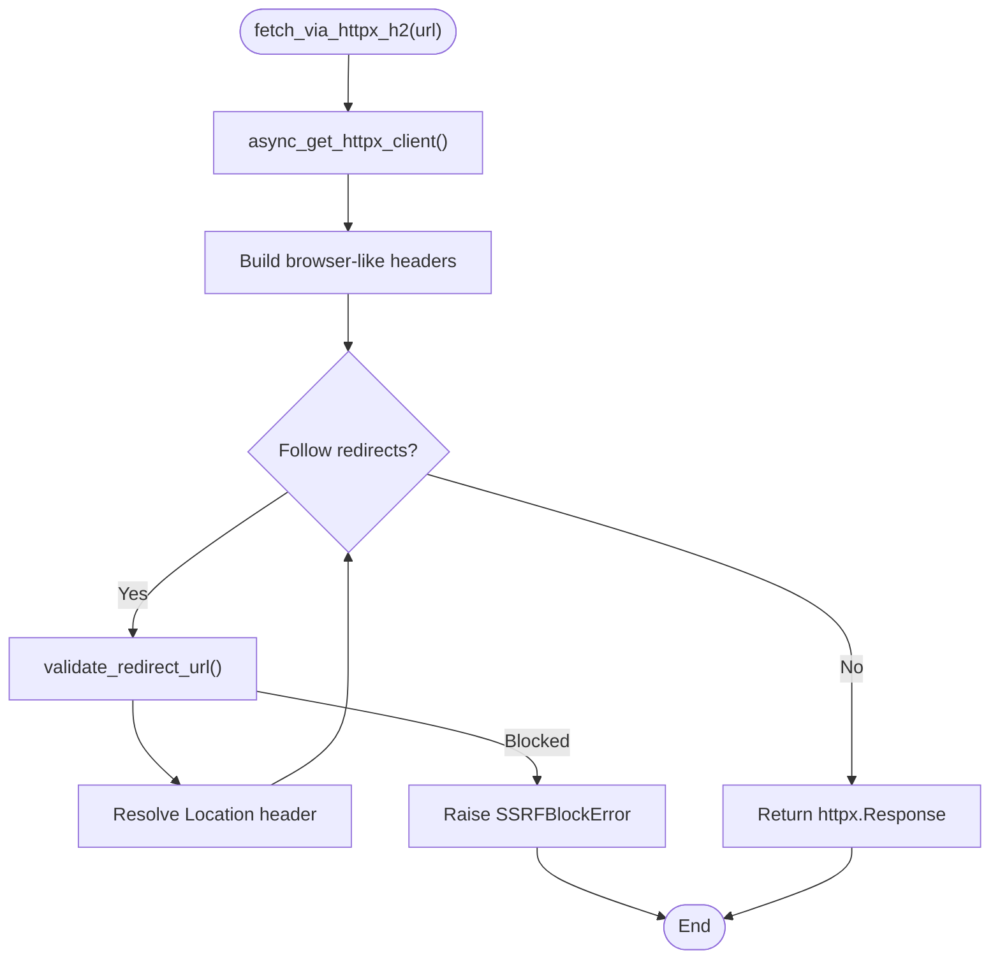

**Diagram sources**
- [httpx_transport.py:361-442](file://transport/httpx_transport.py#L361-L442)
- [httpx_transport.py:449-520](file://transport/httpx_transport.py#L449-L520)
- [httpx_client.py:93-152](file://transport/httpx_client.py#L93-L152)

**Section sources**
- [httpx_transport.py:361-442](file://transport/httpx_transport.py#L361-L442)
- [httpx_transport.py:449-520](file://transport/httpx_transport.py#L449-L520)
- [httpx_client.py:93-152](file://transport/httpx_client.py#L93-L152)

### HTTPX Client Factory
The HTTPX client factory provides:
- Lazy initialization guarded by a lock.
- HTTP/2 enabled with conservative connection limits.
- Timeouts configured for connect/read/write/pool.
- Explicit control over proxy trust and redirect handling.
- Idempotent close semantics.

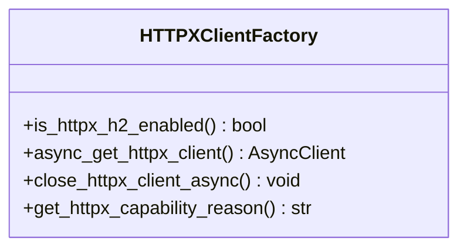

**Diagram sources**
- [httpx_client.py:93-152](file://transport/httpx_client.py#L93-L152)
- [httpx_client.py:173-205](file://transport/httpx_client.py#L173-L205)

**Section sources**
- [httpx_client.py:48-81](file://transport/httpx_client.py#L48-L81)
- [httpx_client.py:93-152](file://transport/httpx_client.py#L93-L152)
- [httpx_client.py:173-205](file://transport/httpx_client.py#L173-L205)

### In-Memory Transport
The in-memory transport is designed for testing and internal use:
- Implements the Transport interface with start/stop/wait_ready/register_handler/send_message.
- Maintains a bounded queue and a set of peer transports.
- Provides receive/poll_once for message processing.
- Enforces peer limits and bounded queue sizes to prevent memory issues.

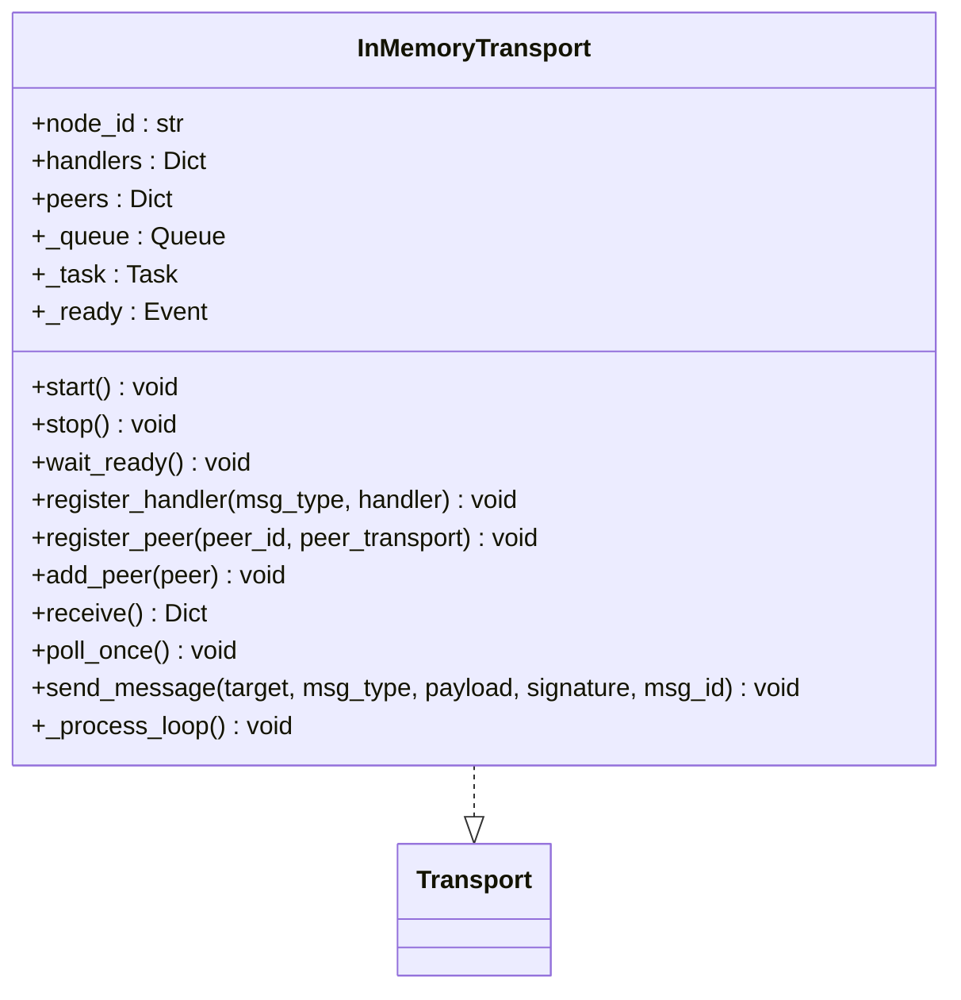

**Diagram sources**
- [inmemory_transport.py:14-98](file://transport/inmemory_transport.py#L14-L98)
- [base.py:4-23](file://transport/base.py#L4-L23)

**Section sources**
- [inmemory_transport.py:14-98](file://transport/inmemory_transport.py#L14-L98)
- [base.py:4-23](file://transport/base.py#L4-L23)

### Transport Router
The router selects the appropriate lane based on URL characteristics and flags:
- Priority rules include darknet suffixes, JS rendering, stealth, retry statuses, and HTTPX H2 eligibility.
- Returns a decision with lane, reason, cache allowance, and passthrough fields.

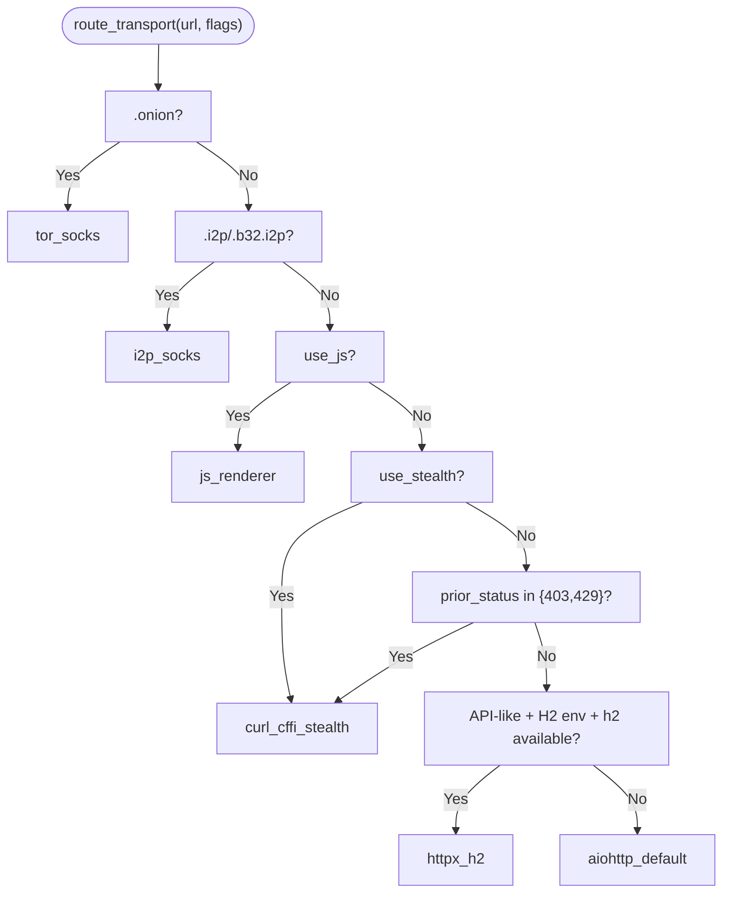

**Diagram sources**
- [transport_router.py:134-259](file://transport/transport_router.py#L134-L259)

**Section sources**
- [transport_router.py:134-259](file://transport/transport_router.py#L134-L259)

### Transport Resolver
The resolver classifies URLs by domain suffix and provides a fast, deterministic classification:
- Supports .onion (mandatory Tor), .i2p (stub), and clearnet defaults.
- Provides helpers for policy integration and transport hints.

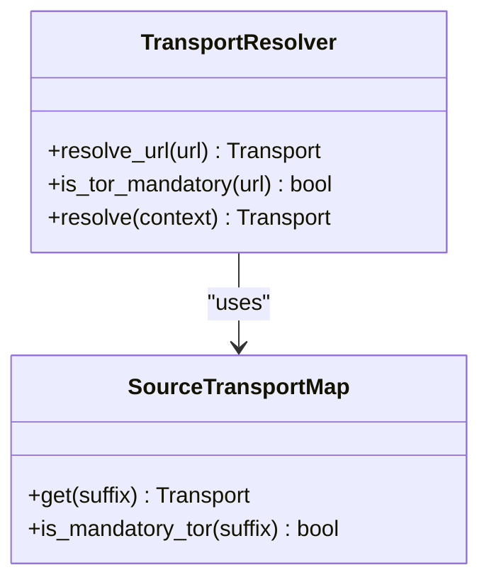

**Diagram sources**
- [transport_resolver.py:95-239](file://transport/transport_resolver.py#L95-L239)
- [transport_resolver.py:69-85](file://transport/transport_resolver.py#L69-L85)

**Section sources**
- [transport_resolver.py:152-170](file://transport/transport_resolver.py#L152-L170)
- [transport_resolver.py:268-300](file://transport/transport_resolver.py#L268-L300)

### Circuit Breaker
The circuit breaker protects domains under repeated failures/timeouts:
- Tracks state (CLOSED, OPEN, HALF_OPEN) and recovery timeouts.
- Allows limited probes in HALF_OPEN to test recovery.
- Provides snapshots and registry access for diagnostics.

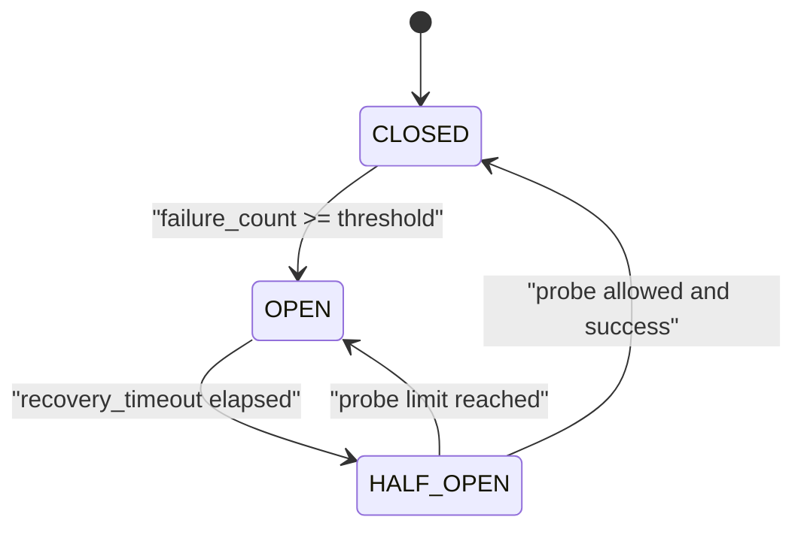

**Diagram sources**
- [circuit_breaker.py:51-98](file://transport/circuit_breaker.py#L51-L98)
- [circuit_breaker.py:100-146](file://transport/circuit_breaker.py#L100-L146)

**Section sources**
- [circuit_breaker.py:79-186](file://transport/circuit_breaker.py#L79-L186)
- [circuit_breaker.py:308-324](file://transport/circuit_breaker.py#L308-L324)

### Session Runtime and Concurrency Control
The shared aiohttp session provides:
- Lazy creation with TCPConnector limits and DNS caching.
- Adaptive concurrency via Domain Concurrency Bandit.
- Standardized timeout constants and gather result helper.

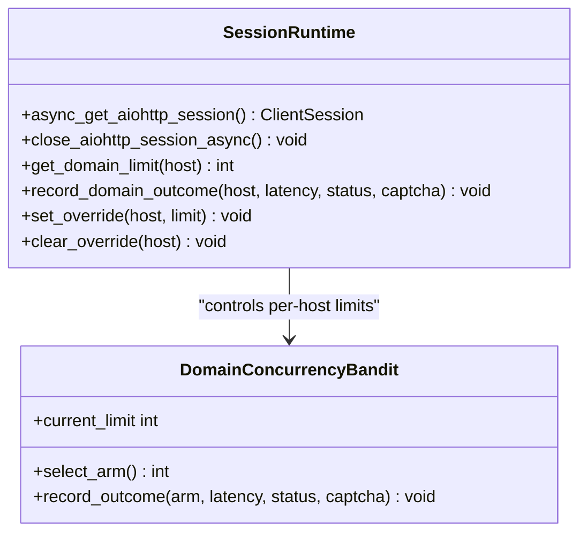

**Diagram sources**
- [session_runtime.py:191-229](file://network/session_runtime.py#L191-L229)
- [domain_concurrency.py:31-110](file://network/domain_concurrency.py#L31-L110)

**Section sources**
- [session_runtime.py:191-229](file://network/session_runtime.py#L191-L229)
- [domain_concurrency.py:118-179](file://network/domain_concurrency.py#L118-L179)

### Session Manager
The session manager persists cookies and headers per domain:
- Uses LMDB with optional Fernet encryption.
- Async operations via thread pool executor.
- Caching and read-only behavior after close.

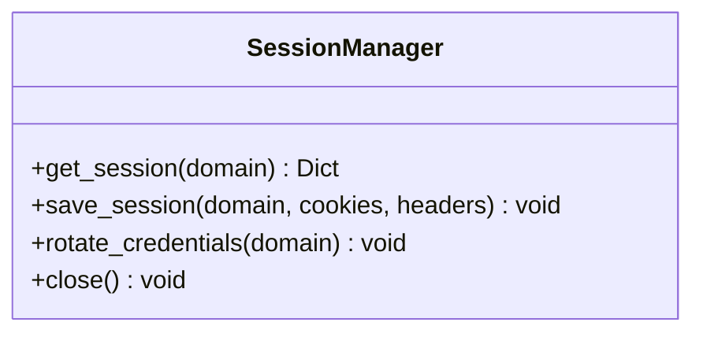

**Diagram sources**
- [session_manager.py:218-241](file://tools/session_manager.py#L218-L241)
- [session_manager.py:287-302](file://tools/session_manager.py#L287-L302)

**Section sources**
- [session_manager.py:218-241](file://tools/session_manager.py#L218-L241)
- [session_manager.py:287-302](file://tools/session_manager.py#L287-L302)

### Curl-cffi Integration
Curl-cffi provides stealth escalation:
- Policy-driven selection based on environment, prior status, and protection hints.
- Runtime provides bounded session cache with profile fallback and graceful fallback.

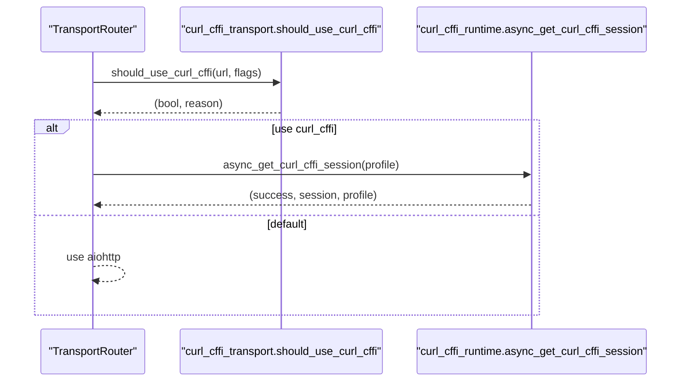

**Diagram sources**
- [transport_router.py:218-238](file://transport/transport_router.py#L218-L238)
- [curl_cffi_transport.py:34-85](file://transport/curl_cffi_transport.py#L34-L85)
- [curl_cffi_runtime.py:61-88](file://transport/curl_cffi_runtime.py#L61-L88)

**Section sources**
- [curl_cffi_transport.py:34-85](file://transport/curl_cffi_transport.py#L34-L85)
- [curl_cffi_runtime.py:37-58](file://transport/curl_cffi_runtime.py#L37-L58)
- [curl_cffi_runtime.py:61-88](file://transport/curl_cffi_runtime.py#L61-L88)

## Dependency Analysis
- HTTPX transport depends on HTTPX client factory for the AsyncClient and uses redirect/validation utilities.
- Router and resolver provide policy decisions that influence which transport is used.
- Session runtime and domain concurrency integrate with circuit breaker to manage resilience and throughput.
- Session manager complements shared sessions for authenticated flows.

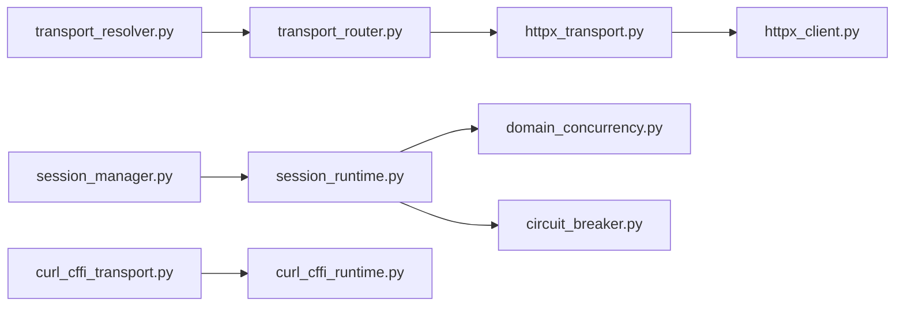

**Diagram sources**
- [httpx_transport.py:391-442](file://transport/httpx_transport.py#L391-L442)
- [httpx_client.py:93-152](file://transport/httpx_client.py#L93-L152)
- [transport_router.py:134-259](file://transport/transport_router.py#L134-L259)
- [transport_resolver.py:152-170](file://transport/transport_resolver.py#L152-L170)
- [session_runtime.py:191-229](file://network/session_runtime.py#L191-L229)
- [domain_concurrency.py:118-179](file://network/domain_concurrency.py#L118-L179)
- [circuit_breaker.py:100-146](file://transport/circuit_breaker.py#L100-L146)
- [session_manager.py:218-241](file://tools/session_manager.py#L218-L241)
- [curl_cffi_transport.py:34-85](file://transport/curl_cffi_transport.py#L34-L85)
- [curl_cffi_runtime.py:61-88](file://transport/curl_cffi_runtime.py#L61-L88)

**Section sources**
- [httpx_transport.py:391-442](file://transport/httpx_transport.py#L391-L442)
- [httpx_client.py:93-152](file://transport/httpx_client.py#L93-L152)
- [transport_router.py:134-259](file://transport/transport_router.py#L134-L259)
- [transport_resolver.py:152-170](file://transport/transport_resolver.py#L152-L170)
- [session_runtime.py:191-229](file://network/session_runtime.py#L191-L229)
- [domain_concurrency.py:118-179](file://network/domain_concurrency.py#L118-L179)
- [circuit_breaker.py:100-146](file://transport/circuit_breaker.py#L100-L146)
- [session_manager.py:218-241](file://tools/session_manager.py#L218-L241)
- [curl_cffi_transport.py:34-85](file://transport/curl_cffi_transport.py#L34-L85)
- [curl_cffi_runtime.py:61-88](file://transport/curl_cffi_runtime.py#L61-L88)

## Performance Considerations
- HTTPX H2 lane is environment-gated and restricted to API-like URLs to maximize multiplexing benefits.
- HTTPX client uses higher connection limits suitable for API batching and HTTP/2.
- Shared aiohttp session employs conservative per-host limits with adaptive bandit learning to balance throughput and detection risk.
- Circuit breaker reduces load on failing domains and accelerates recovery.
- Curl-cffi sessions are bounded and profile-fallback driven to minimize overhead.
- Resource cleanup:
  - HTTPX client close is idempotent and awaited outside locks.
  - Shared session close is idempotent and safe to call multiple times.
  - Curl-cffi sessions close asynchronously after lock release to avoid blocking.

[No sources needed since this section provides general guidance]

## Troubleshooting Guide
Common issues and remedies:
- HTTPX H2 disabled: Check environment gate and h2 availability; review classification reasons.
- Redirect errors: SSRF validation blocks private IPs and unsafe schemes; verify redirect targets.
- Circuit breaker open: Inspect domain state and adjust risk level; allow recovery time.
- Session errors: Use runtime status to confirm session state and last errors.
- Curl-cffi not available: Confirm availability and profile fallback; fall back to default lanes.

**Section sources**
- [httpx_transport.py:112-182](file://transport/httpx_transport.py#L112-L182)
- [httpx_client.py:173-205](file://transport/httpx_client.py#L173-L205)
- [session_runtime.py:253-282](file://network/session_runtime.py#L253-L282)
- [curl_cffi_runtime.py:37-58](file://transport/curl_cffi_runtime.py#L37-L58)

## Security Considerations
- Redirect safety: Manual redirect handling validates targets and blocks private/reserved IPs to prevent SSRF.
- Browser-like headers: Reduce fingerprinting and client identification risks.
- Proxy trust: HTTPX client disables environment proxy trust by default; configure explicitly when needed.
- Certificate validation: HTTPX relies on default SSL verification; ensure certificates are valid and up-to-date.
- Man-in-the-middle prevention: Use HTTPS endpoints, validate hostnames, and avoid accepting untrusted certificates.
- Stealth escalation: Curl-cffi impersonation helps bypass anti-bot systems; ensure compliance with terms of service.

**Section sources**
- [httpx_transport.py:396-406](file://transport/httpx_transport.py#L396-L406)
- [httpx_client.py:147-148](file://transport/httpx_client.py#L147-L148)
- [curl_cffi_transport.py:34-85](file://transport/curl_cffi_transport.py#L34-L85)

## Conclusion
The transport system combines policy-driven routing, robust HTTPX and aiohttp surfaces, and resilience primitives to deliver reliable, efficient, and secure HTTP communications. The HTTPX transport leverages HTTP/2 with careful safeguards, while the in-memory transport supports testing and internal workflows. Together with session management, concurrency control, and circuit breaking, the system balances performance, reliability, and security across diverse operational scenarios.