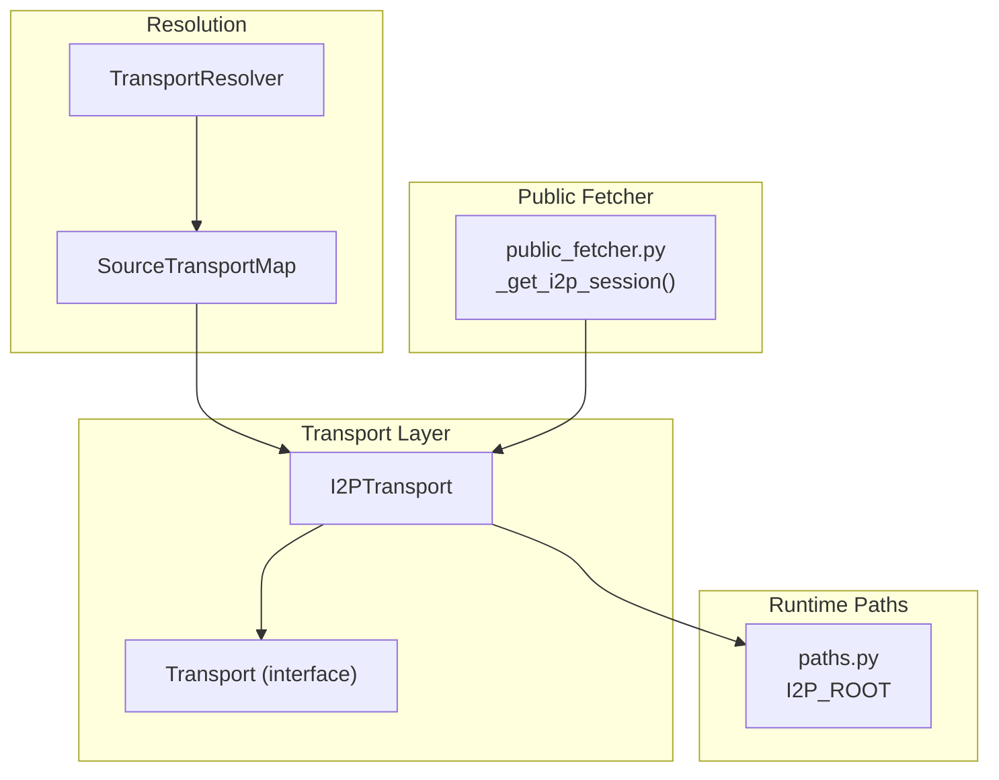
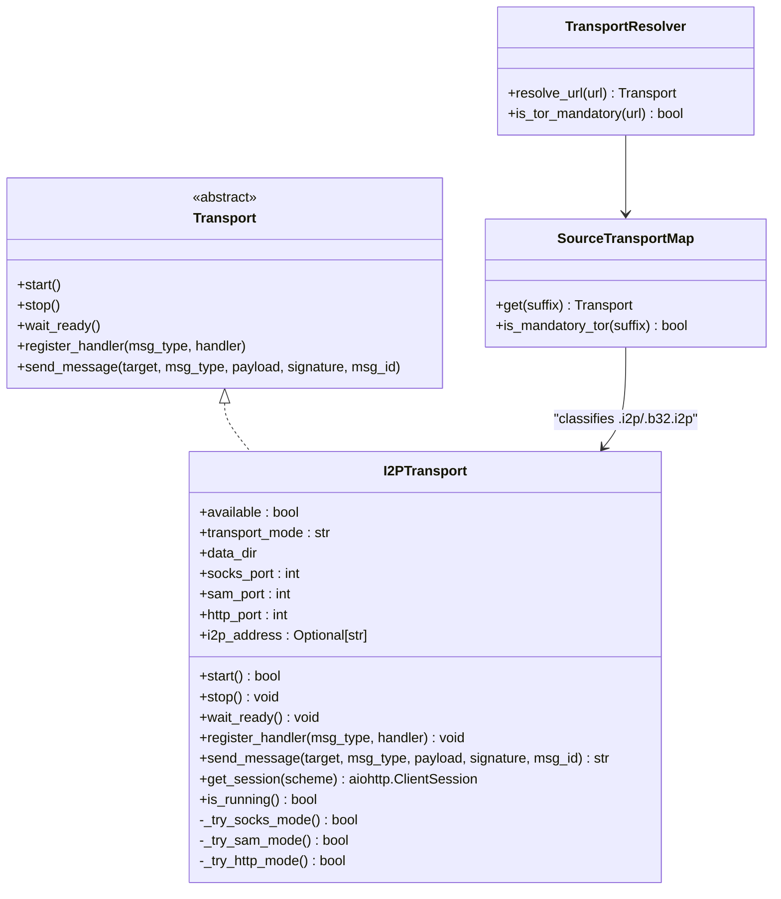
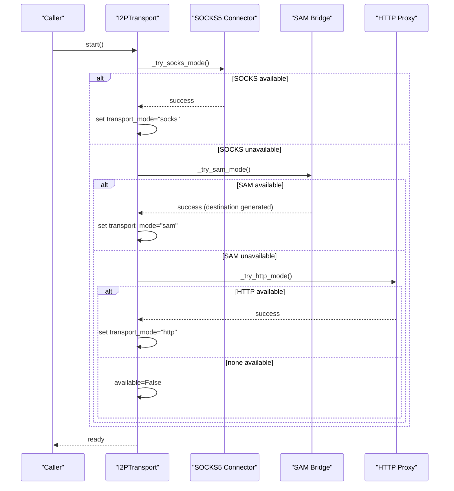
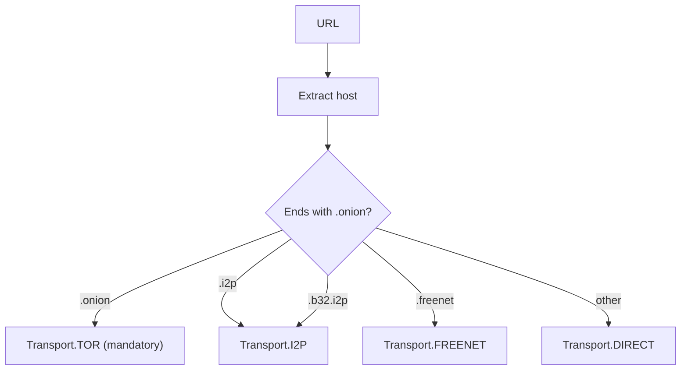
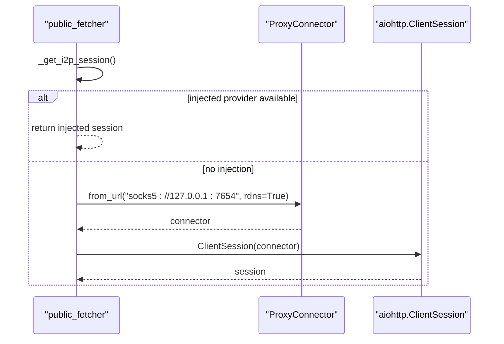
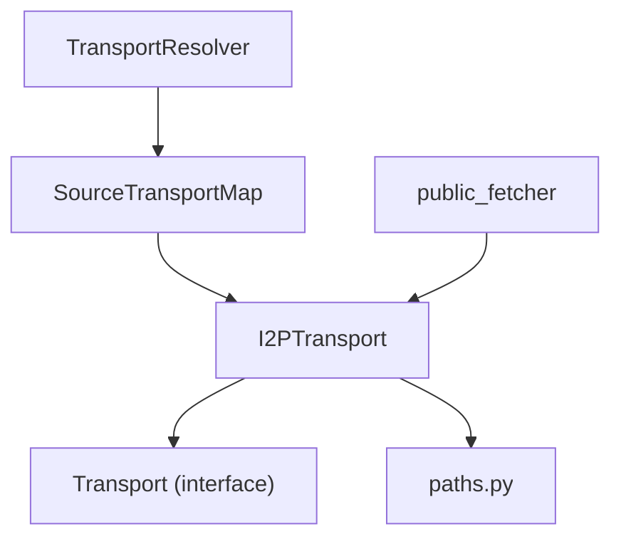

# I2P Transport

<cite>
**Referenced Files in This Document**
- [i2p_transport.py](file://hledac/universal/transport/i2p_transport.py)
- [base.py](file://hledac/universal/transport/base.py)
- [transport_resolver.py](file://hledac/universal/transport/transport_resolver.py)
- [paths.py](file://hledac/universal/paths.py)
- [public_fetcher.py](file://hledac/universal/fetching/public_fetcher.py)
</cite>

## Table of Contents
1. [Introduction](#introduction)
2. [Project Structure](#project-structure)
3. [Core Components](#core-components)
4. [Architecture Overview](#architecture-overview)
5. [Detailed Component Analysis](#detailed-component-analysis)
6. [Dependency Analysis](#dependency-analysis)
7. [Performance Considerations](#performance-considerations)
8. [Troubleshooting Guide](#troubleshooting-guide)
9. [Security Considerations](#security-considerations)
10. [Conclusion](#conclusion)

## Introduction
This document explains the I2P (Invisible Internet Project) transport system in the codebase. It focuses on:
- How the I2PTransport class integrates SOCKS5 and SAM (Simple Anonymous Messaging) proxies to access I2P hidden services
- The transport lifecycle from initialization to session termination
- I2P addressing support (.i2p and .b32.i2p) and the handling of base32 and base64 formats
- Configuration options for router connectivity, tunnel parameters, and network settings
- Troubleshooting guidance for connectivity issues, SAM bridge problems, and hidden service resolution failures
- Security considerations specific to I2P networking

## Project Structure
The I2P transport is implemented as part of the transport subsystem and integrates with the broader transport resolution framework. Key locations:
- Transport interface and I2P implementation: transport/i2p_transport.py
- Transport base interface: transport/base.py
- Transport resolution and classification: transport/transport_resolver.py
- Runtime paths and I2P data directory: paths.py
- Public fetcher integration for .i2p/.b32.i2p URLs: fetching/public_fetcher.py

**Diagram sources**
- [i2p_transport.py:41-325](file://hledac/universal/transport/i2p_transport.py#L41-L325)
- [base.py:4-24](file://hledac/universal/transport/base.py#L4-L24)
- [transport_resolver.py:69-85](file://hledac/universal/transport/transport_resolver.py#L69-L85)
- [paths.py:298](file://hledac/universal/paths.py#L298)
- [public_fetcher.py:683-709](file://hledac/universal/fetching/public_fetcher.py#L683-L709)

**Section sources**
- [i2p_transport.py:1-361](file://hledac/universal/transport/i2p_transport.py#L1-L361)
- [base.py:1-24](file://hledac/universal/transport/base.py#L1-L24)
- [transport_resolver.py:1-361](file://hledac/universal/transport/transport_resolver.py#L1-L361)
- [paths.py:298](file://hledac/universal/paths.py#L298)
- [public_fetcher.py:683-709](file://hledac/universal/fetching/public_fetcher.py#L683-L709)

## Core Components
- I2PTransport: Implements the Transport interface and provides three modes:
  - SOCKS5 mode: Connects to the local I2P SOCKS proxy (default port 7654)
  - SAM mode: Communicates directly with the I2P SAM bridge (default port 7656) to generate destinations
  - HTTP mode: Connects to the I2P HTTP proxy (Freenet FProxy compatibility, default port 8888)
- TransportResolver and SourceTransportMap: Classify URLs ending with .i2p and .b32.i2p to I2P transport
- paths.py: Defines I2P_ROOT for persistent runtime artifacts and ensures secure directory permissions
- public_fetcher.py: Provides a module-level lazy singleton for I2P SOCKS5 sessions used by public fetcher

Key behaviors:
- Graceful fallback when I2P is unavailable (available flag set to False)
- Session creation per mode with timeouts and bounded guards
- Destination generation via SAM protocol and base64-encoded addresses
- Support for .i2p and .b32.i2p addressing schemes

**Section sources**
- [i2p_transport.py:41-325](file://hledac/universal/transport/i2p_transport.py#L41-L325)
- [transport_resolver.py:61-66](file://hledac/universal/transport/transport_resolver.py#L61-L66)
- [paths.py:298](file://hledac/universal/paths.py#L298)
- [public_fetcher.py:683-709](file://hledac/universal/fetching/public_fetcher.py#L683-L709)

## Architecture Overview
The I2P transport architecture combines a pluggable transport interface with automatic mode detection and integration points for higher-level components.

**Diagram sources**
- [base.py:4-24](file://hledac/universal/transport/base.py#L4-L24)
- [i2p_transport.py:41-325](file://hledac/universal/transport/i2p_transport.py#L41-L325)
- [transport_resolver.py:69-85](file://hledac/universal/transport/transport_resolver.py#L69-L85)

## Detailed Component Analysis

### I2PTransport Class
I2PTransport implements the Transport interface and encapsulates:
- Mode detection and selection (SOCKS5 → SAM → HTTP)
- Session management for SOCKS5 and HTTP proxies
- Destination generation via SAM protocol
- Addressing support for .i2p and .b32.i2p targets

**Diagram sources**
- [i2p_transport.py:93-123](file://hledac/universal/transport/i2p_transport.py#L93-L123)
- [i2p_transport.py:125-150](file://hledac/universal/transport/i2p_transport.py#L125-L150)
- [i2p_transport.py:152-195](file://hledac/universal/transport/i2p_transport.py#L152-L195)
- [i2p_transport.py:197-219](file://hledac/universal/transport/i2p_transport.py#L197-L219)

Key implementation notes:
- SOCKS5 mode uses aiohttp_socks.ProxyConnector with rdns enabled
- SAM mode performs HELLO and DEST GENERATE exchanges and parses base64-encoded destination
- HTTP mode uses a plain aiohttp.ClientSession for Freenet FProxy compatibility
- Sessions are lazily created and bounded by timeouts

**Section sources**
- [i2p_transport.py:41-325](file://hledac/universal/transport/i2p_transport.py#L41-L325)

### Transport Resolution and Addressing
TransportResolver and SourceTransportMap classify URLs for I2P:
- .onion → TOR (mandatory)
- .i2p → I2P
- .b32.i2p → I2P (base32-encoded hidden service)
- .freenet → FREENET (HTTP proxy)
- others → DIRECT

**Diagram sources**
- [transport_resolver.py:152-170](file://hledac/universal/transport/transport_resolver.py#L152-L170)
- [transport_resolver.py:290-300](file://hledac/universal/transport/transport_resolver.py#L290-L300)

**Section sources**
- [transport_resolver.py:61-66](file://hledac/universal/transport/transport_resolver.py#L61-L66)
- [transport_resolver.py:152-170](file://hledac/universal/transport/transport_resolver.py#L152-L170)
- [transport_resolver.py:290-300](file://hledac/universal/transport/transport_resolver.py#L290-L300)

### Public Fetcher Integration
The public fetcher provides a module-level lazy singleton for I2P SOCKS5 sessions:
- Uses aiohttp_socks.ProxyConnector with socks5://127.0.0.1:7654
- Supports injection of external sessions
- Telemetry tracks whether the session is injected or local

**Diagram sources**
- [public_fetcher.py:683-709](file://hledac/universal/fetching/public_fetcher.py#L683-L709)

**Section sources**
- [public_fetcher.py:683-709](file://hledac/universal/fetching/public_fetcher.py#L683-L709)

## Dependency Analysis
- I2PTransport depends on:
  - aiohttp and aiohttp_socks for proxy-aware HTTP requests
  - paths.I2P_ROOT for secure runtime data directory
  - Transport base interface for lifecycle management
- TransportResolver and SourceTransportMap depend on URL suffix classification
- Public fetcher depends on I2PTransport for .i2p/.b32.i2p targets

**Diagram sources**
- [i2p_transport.py:23](file://hledac/universal/transport/i2p_transport.py#L23)
- [paths.py:298](file://hledac/universal/paths.py#L298)
- [transport_resolver.py:69-85](file://hledac/universal/transport/transport_resolver.py#L69-L85)
- [public_fetcher.py:683-709](file://hledac/universal/fetching/public_fetcher.py#L683-L709)

**Section sources**
- [i2p_transport.py:23](file://hledac/universal/transport/i2p_transport.py#L23)
- [paths.py:298](file://hledac/universal/paths.py#L298)
- [transport_resolver.py:69-85](file://hledac/universal/transport/transport_resolver.py#L69-L85)
- [public_fetcher.py:683-709](file://hledac/universal/fetching/public_fetcher.py#L683-L709)

## Performance Considerations
- Mode detection uses short timeouts and executor-bound socket checks to minimize latency
- Sessions are lazily created and reused; SOCKS5 mode enables DNS resolution via proxy (rdns=True)
- HTTP mode leverages aiohttp’s efficient connection pooling
- Data directory permissions are enforced securely (0o700) to protect sensitive runtime artifacts

[No sources needed since this section provides general guidance]

## Troubleshooting Guide
Common issues and resolutions:
- I2P router not running
  - Symptom: I2PTransport.available becomes False; start() returns False
  - Action: Ensure I2P router is running and listening on the expected ports
- SOCKS5 proxy unreachable (port 7654)
  - Symptom: SOCKS mode fails; logs show OSError during connection
  - Action: Verify I2P router SOCKS proxy is enabled and firewall allows connections
- SAM bridge unreachable (port 7656)
  - Symptom: SAM mode fails; logs show timeout or protocol errors
  - Action: Confirm SAM bridge is enabled and reachable; check I2P router configuration
- HTTP proxy unreachable (port 8888)
  - Symptom: HTTP mode fails; logs show connection refusal
  - Action: Ensure Freenet FProxy is running or disable HTTP mode
- Missing dependencies
  - Symptom: ImportError for aiohttp or aiohttp_socks
  - Action: Install required packages (pip install aiohttp aiohttp_socks)
- Addressing issues
  - Symptom: .i2p or .b32.i2p targets fail to resolve
  - Action: Verify target addresses are valid; ensure hidden service is published and reachable

**Section sources**
- [i2p_transport.py:71-73](file://hledac/universal/transport/i2p_transport.py#L71-L73)
- [i2p_transport.py:129-150](file://hledac/universal/transport/i2p_transport.py#L129-L150)
- [i2p_transport.py:160-195](file://hledac/universal/transport/i2p_transport.py#L160-L195)
- [i2p_transport.py:201-219](file://hledac/universal/transport/i2p_transport.py#L201-L219)

## Security Considerations
- Address space protection
  - I2P_ROOT is created with restrictive permissions (0o700) to protect runtime artifacts
  - SOCKS5 mode enables remote DNS resolution (rdns=True) to reduce local leakage
- Traffic obfuscation
  - SOCKS5 proxy routes traffic through the I2P network, hiding origin
  - SAM mode generates ephemeral destinations; base64-encoded destinations are used internally
- Operational security
  - Graceful degradation: when I2P is unavailable, the system does not crash but marks transport as not available
  - Session lifecycle management: public_fetcher provides safe session close routines to prevent resource leaks

**Section sources**
- [paths.py:407-408](file://hledac/universal/paths.py#L407-L408)
- [i2p_transport.py:143-146](file://hledac/universal/transport/i2p_transport.py#L143-L146)
- [public_fetcher.py:799-855](file://hledac/universal/fetching/public_fetcher.py#L799-L855)

## Conclusion
The I2P transport system provides a robust, fail-safe mechanism to access I2P hidden services through multiple modes:
- SOCKS5 for seamless integration with existing I2P routers
- SAM for direct destination management and messaging
- HTTP for Freenet FProxy compatibility

It integrates cleanly with the transport resolution framework, supports modern I2P addressing schemes, and emphasizes security and operational safety through secure directory permissions, graceful fallbacks, and careful session management.