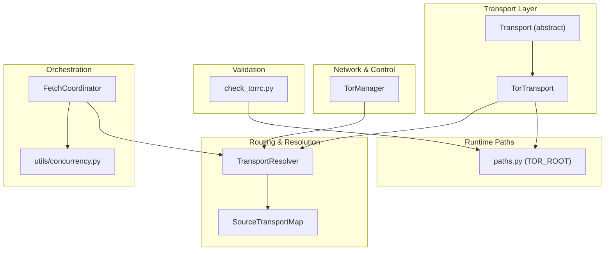
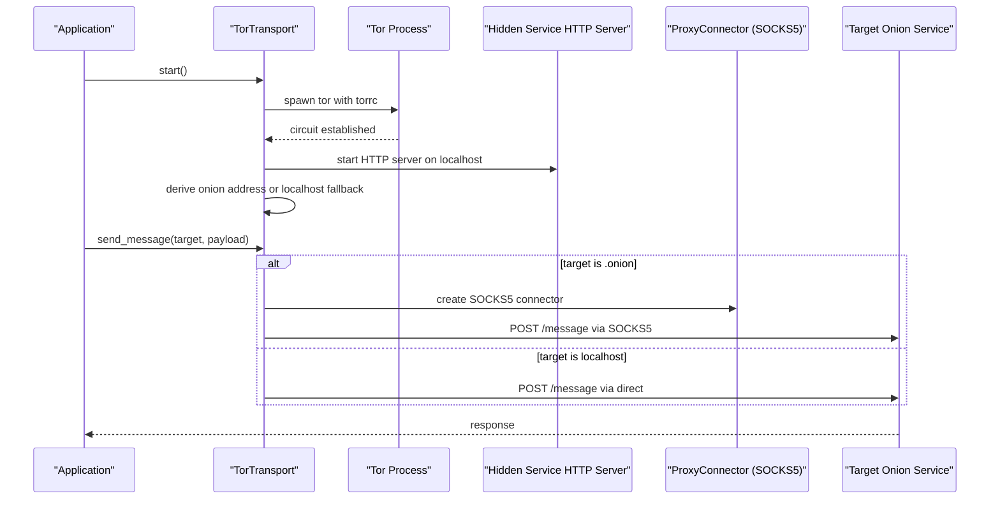
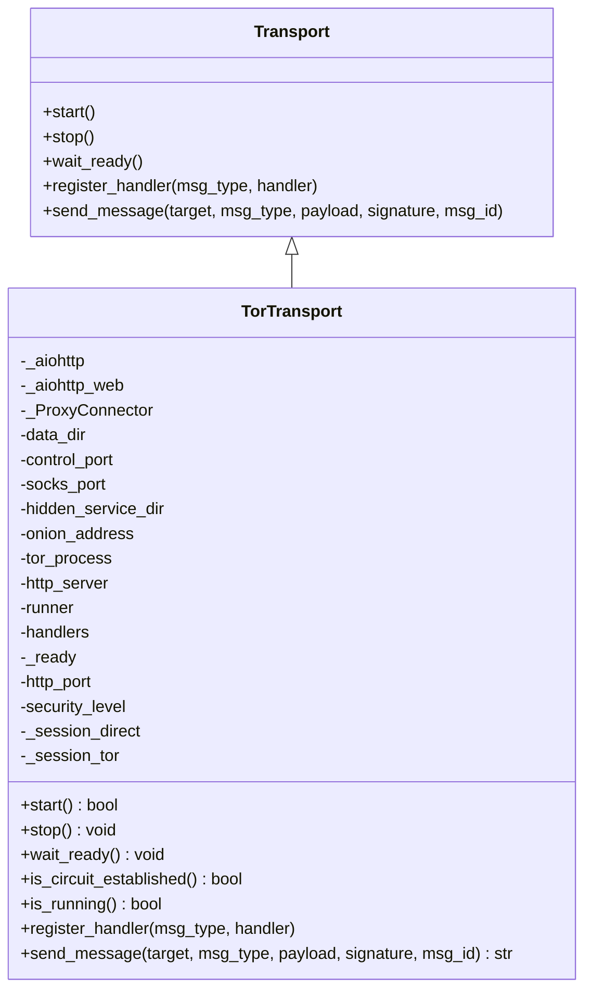
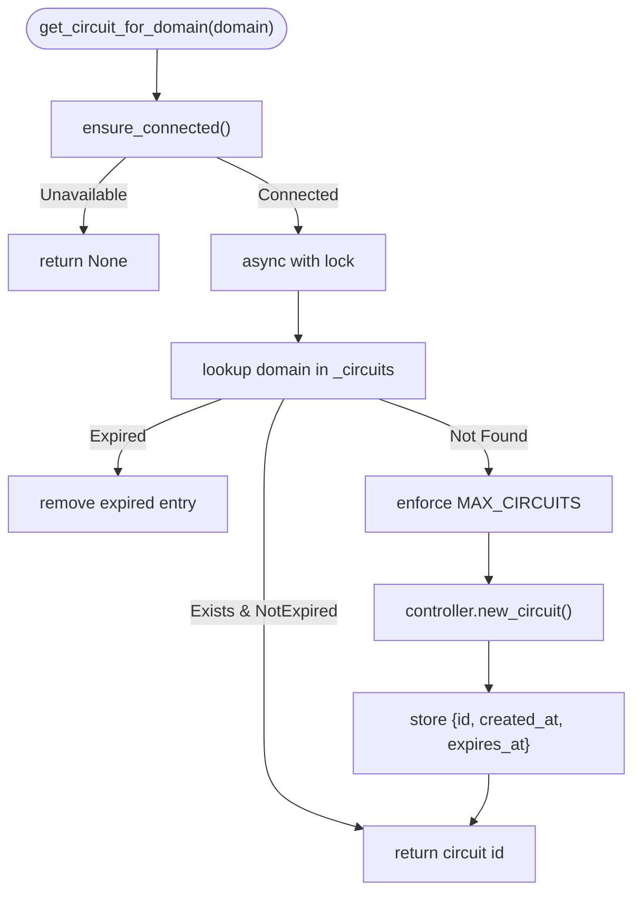
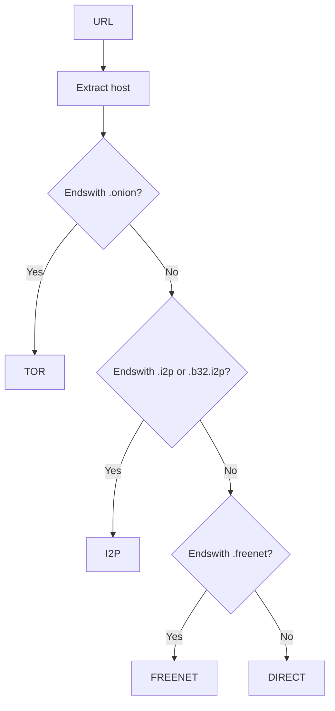
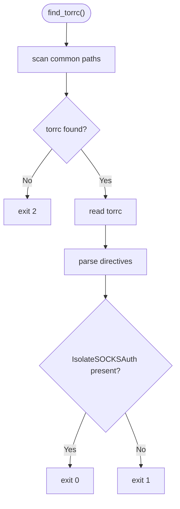
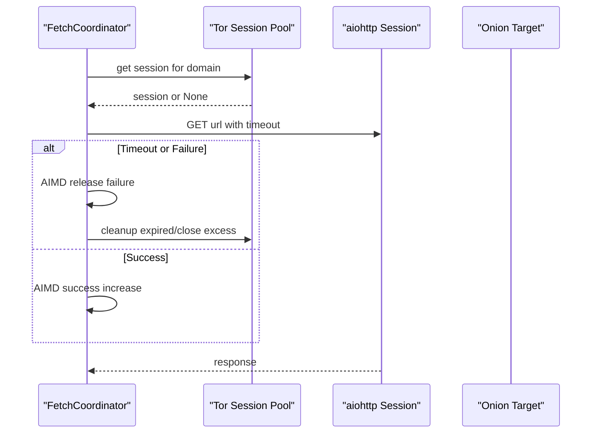
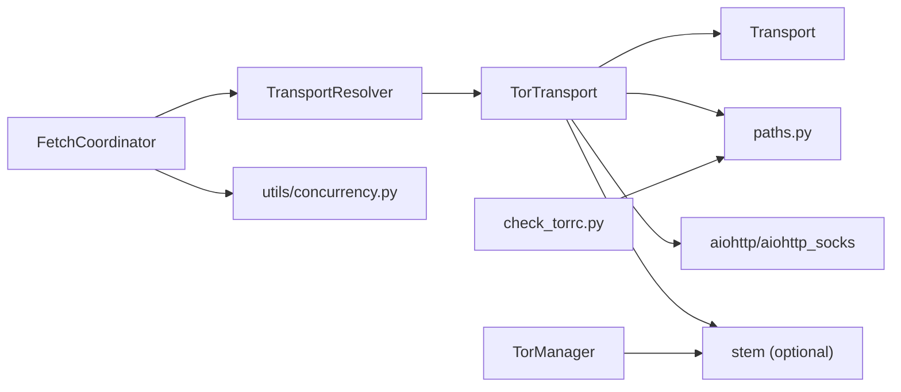

# Tor Transport

<cite>
**Referenced Files in This Document**
- [tor_transport.py](file://transport/tor_transport.py)
- [base.py](file://transport/base.py)
- [paths.py](file://paths.py)
- [tor_manager.py](file://network/tor_manager.py)
- [transport_resolver.py](file://transport/transport_resolver.py)
- [check_torrc.py](file://scripts/check_torrc.py)
- [fetch_coordinator.py](file://coordinators/fetch_coordinator.py)
- [concurrency.py](file://utils/concurrency.py)
- [probe_f206ar.py](file://tests/probe_f206ar.py)
</cite>

## Table of Contents
1. [Introduction](#introduction)
2. [Project Structure](#project-structure)
3. [Core Components](#core-components)
4. [Architecture Overview](#architecture-overview)
5. [Detailed Component Analysis](#detailed-component-analysis)
6. [Dependency Analysis](#dependency-analysis)
7. [Performance Considerations](#performance-considerations)
8. [Troubleshooting Guide](#troubleshooting-guide)
9. [Security Considerations](#security-considerations)
10. [Conclusion](#conclusion)

## Introduction
This document explains the Tor transport implementation used for anonymous browsing on the Tor network. It focuses on the SOCKS5 proxy-based transport system, the TorTransport class architecture, session management, and connection pooling mechanisms. It also covers integration with Tor’s SOCKS proxy, port configuration, authentication handling, transport lifecycle (initialization, connection establishment, and cleanup), error handling strategies, timeouts, retry mechanisms, and security considerations such as traffic analysis resistance and timing attack prevention.

## Project Structure
The Tor transport implementation spans several modules:
- Transport abstraction and concrete Tor transport
- Tor runtime path management
- Tor controller wrapper for circuit isolation and rotation
- Transport resolution and routing
- Tor configuration validation script
- Fetch orchestration and concurrency controls
- Tests validating Tor-related behavior

**Diagram sources**
- [tor_transport.py:37-83](file://transport/tor_transport.py#L37-L83)
- [base.py:4-24](file://transport/base.py#L4-L24)
- [paths.py:296-296](file://paths.py#L296-L296)
- [tor_manager.py:21-42](file://network/tor_manager.py#L21-L42)
- [transport_resolver.py:40-85](file://transport/transport_resolver.py#L40-L85)
- [check_torrc.py:27-38](file://scripts/check_torrc.py#L27-L38)
- [fetch_coordinator.py:822-974](file://coordinators/fetch_coordinator.py#L822-L974)
- [concurrency.py:90-118](file://utils/concurrency.py#L90-L118)

**Section sources**
- [tor_transport.py:1-345](file://transport/tor_transport.py#L1-L345)
- [base.py:1-24](file://transport/base.py#L1-L24)
- [paths.py:296-296](file://paths.py#L296-L296)
- [tor_manager.py:1-146](file://network/tor_manager.py#L1-L146)
- [transport_resolver.py:1-361](file://transport/transport_resolver.py#L1-L361)
- [check_torrc.py:1-114](file://scripts/check_torrc.py#L1-L114)
- [fetch_coordinator.py:822-974](file://coordinators/fetch_coordinator.py#L822-L974)
- [concurrency.py:90-118](file://utils/concurrency.py#L90-L118)

## Core Components
- Transport abstraction: Defines the contract for transport implementations.
- TorTransport: Implements a SOCKS5-based transport with embedded Tor process management, hidden service hosting, and dual HTTP client sessions (direct and Tor).
- TorManager: Provides Tor controller integration for circuit isolation and rotation.
- TransportResolver and SourceTransportMap: Classify URLs and enforce mandatory Tor for .onion.
- paths.py: Centralized runtime path management, including TOR_ROOT for Tor data and configuration.
- check_torrc.py: Validates IsolateSOCKSAuth presence in torrc.
- FetchCoordinator and concurrency controls: Manage Tor session pools, timeouts, and concurrency limits.

**Section sources**
- [base.py:4-24](file://transport/base.py#L4-L24)
- [tor_transport.py:37-83](file://transport/tor_transport.py#L37-L83)
- [tor_manager.py:21-42](file://network/tor_manager.py#L21-L42)
- [transport_resolver.py:40-85](file://transport/transport_resolver.py#L40-L85)
- [paths.py:296-296](file://paths.py#L296-L296)
- [check_torrc.py:41-76](file://scripts/check_torrc.py#L41-L76)
- [fetch_coordinator.py:913-974](file://coordinators/fetch_coordinator.py#L913-L974)
- [concurrency.py:90-118](file://utils/concurrency.py#L90-L118)

## Architecture Overview
The Tor transport architecture integrates:
- TorTransport: Starts/stops Tor, exposes a local HTTP endpoint, and routes messages to targets via SOCKS5 when available.
- TorManager: Manages Tor controller connections, creates isolated circuits per domain, and rotates circuits.
- TransportResolver: Determines whether a URL must use Tor (.onion) and provides hints for policy engines.
- FetchCoordinator: Orchestrates Tor sessions, enforces timeouts, and applies AIMD-based congestion control.
- paths.py: Ensures consistent Tor data directories and permissions.

**Diagram sources**
- [tor_transport.py:84-164](file://transport/tor_transport.py#L84-L164)
- [tor_transport.py:249-264](file://transport/tor_transport.py#L249-L264)

## Detailed Component Analysis

### TorTransport Class
TorTransport encapsulates:
- Initialization with configurable data_dir, control_port, and socks_port.
- Embedded HTTP server for inter-process messaging within the Tor domain.
- Dual aiohttp sessions: one direct and one proxied via SOCKS5.
- Tor process lifecycle: start, circuit establishment polling, hidden service hostname resolution, and graceful stop.
- Circuit health checks via SOCKS port probing and optional stem controller inspection.

Key behaviors:
- Port configuration: Defaults to 9050 for SOCKS and 9051 for ControlPort; configurable via constructor and torrc generation.
- Authentication handling: Uses IsolateSOCKSAuth in torrc to isolate credentials per connection.
- Session management: Maintains two HTTP sessions; the Tor session uses ProxyConnector from aiohttp_socks.
- Lifecycle: start() spawns Tor, waits for circuit, derives onion address, initializes sessions, and marks readiness; stop() terminates Tor gracefully and closes sessions.

**Diagram sources**
- [base.py:4-24](file://transport/base.py#L4-L24)
- [tor_transport.py:37-83](file://transport/tor_transport.py#L37-L83)
- [tor_transport.py:84-210](file://transport/tor_transport.py#L84-L210)

**Section sources**
- [tor_transport.py:37-83](file://transport/tor_transport.py#L37-L83)
- [tor_transport.py:84-164](file://transport/tor_transport.py#L84-L164)
- [tor_transport.py:211-244](file://transport/tor_transport.py#L211-L244)
- [tor_transport.py:246-275](file://transport/tor_transport.py#L246-L275)

### Tor Manager (Circuit Isolation and Rotation)
TorManager provides:
- Controller connectivity with optional password authentication.
- Per-domain circuit isolation with bounded concurrency and expiration.
- Circuit rotation via NEWNYM signal.

Operational highlights:
- MAX_CIRCUITS limits concurrent isolated circuits.
- CIRCUIT_REUSE_SECONDS governs circuit reuse windows.
- Thread-pool execution ensures non-blocking controller operations.

**Diagram sources**
- [tor_manager.py:43-68](file://network/tor_manager.py#L43-L68)
- [tor_manager.py:70-110](file://network/tor_manager.py#L70-L110)

**Section sources**
- [tor_manager.py:21-42](file://network/tor_manager.py#L21-L42)
- [tor_manager.py:70-110](file://network/tor_manager.py#L70-L110)
- [tor_manager.py:116-136](file://network/tor_manager.py#L116-L136)

### Transport Resolution and Routing
TransportResolver and SourceTransportMap classify URLs and enforce mandatory Tor for .onion:
- get_transport_for_url(url) returns TOR for .onion, I2P for .i2p/.b32.i2p, FREENET for .freenet, and DIRECT otherwise.
- is_tor_mandatory(url) returns True for .onion.
- get_transport_hint_string(url) maps to policy-friendly strings.

**Diagram sources**
- [transport_resolver.py:27-37](file://transport/transport_resolver.py#L27-L37)
- [transport_resolver.py:268-300](file://transport/transport_resolver.py#L268-L300)

**Section sources**
- [transport_resolver.py:40-85](file://transport/transport_resolver.py#L40-L85)
- [transport_resolver.py:268-300](file://transport/transport_resolver.py#L268-L300)
- [transport_resolver.py:303-317](file://transport/transport_resolver.py#L303-L317)

### Tor Configuration Validation
check_torrc validates IsolateSOCKSAuth presence in torrc:
- Searches common locations for torrc.
- Parses directives, handling comments, inline comments, and line continuations.
- Exits with codes indicating presence or absence of IsolateSOCKSAuth.

**Diagram sources**
- [check_torrc.py:27-38](file://scripts/check_torrc.py#L27-L38)
- [check_torrc.py:41-76](file://scripts/check_torrc.py#L41-L76)
- [check_torrc.py:79-105](file://scripts/check_torrc.py#L79-L105)

**Section sources**
- [check_torrc.py:1-114](file://scripts/check_torrc.py#L1-L114)

### Fetch Orchestration and Concurrency Controls
FetchCoordinator manages Tor sessions with:
- Session pools with TTL-based cleanup and enforced limits.
- Global concurrency limits: lower limits for Tor to reduce fingerprinting and preserve anonymity.
- AIMD-based congestion control reacting to timeouts and failures.

**Diagram sources**
- [fetch_coordinator.py:913-974](file://coordinators/fetch_coordinator.py#L913-L974)
- [concurrency.py:90-118](file://utils/concurrency.py#L90-L118)

**Section sources**
- [fetch_coordinator.py:822-974](file://coordinators/fetch_coordinator.py#L822-L974)
- [concurrency.py:90-118](file://utils/concurrency.py#L90-L118)

## Dependency Analysis
- TorTransport depends on:
  - Transport abstraction for interface compliance.
  - paths.py for TOR_ROOT and derived data directories.
  - aiohttp and aiohttp_socks for HTTP and SOCKS5 connectors.
  - stem for optional controller-based circuit checks.
- TorManager depends on stem for controller operations.
- TransportResolver depends on TorTransport availability for dynamic selection.
- FetchCoordinator depends on TorTransport classification and concurrency utilities.

**Diagram sources**
- [tor_transport.py:10-61](file://transport/tor_transport.py#L10-L61)
- [paths.py:296-296](file://paths.py#L296-L296)
- [tor_manager.py:10-18](file://network/tor_manager.py#L10-L18)
- [transport_resolver.py:129-150](file://transport/transport_resolver.py#L129-L150)
- [fetch_coordinator.py:822-974](file://coordinators/fetch_coordinator.py#L822-L974)
- [concurrency.py:90-118](file://utils/concurrency.py#L90-L118)
- [check_torrc.py:27-38](file://scripts/check_torrc.py#L27-L38)

**Section sources**
- [tor_transport.py:10-61](file://transport/tor_transport.py#L10-L61)
- [tor_manager.py:10-18](file://network/tor_manager.py#L10-L18)
- [transport_resolver.py:129-150](file://transport/transport_resolver.py#L129-L150)
- [fetch_coordinator.py:822-974](file://coordinators/fetch_coordinator.py#L822-L974)
- [concurrency.py:90-118](file://utils/concurrency.py#L90-L118)
- [check_torrc.py:27-38](file://scripts/check_torrc.py#L27-L38)

## Performance Considerations
- Lower Tor concurrency: Concurrency limits are intentionally low for Tor to reduce fingerprinting and preserve anonymity.
- Session pooling with TTL and limits: Prevents resource exhaustion and reduces overhead.
- AIMD congestion control: Adapts to network conditions, reducing retries on timeouts and failures.
- Circuit reuse windows: Balance between performance and isolation guarantees.
- Hidden service startup and fallback: If hidden service hostname is unavailable, TorTransport falls back to localhost with reduced security level.

[No sources needed since this section provides general guidance]

## Troubleshooting Guide
Common issues and remedies:
- Tor binary not found: Ensure tor is installed and discoverable via PATH. TorTransport logs installation guidance.
- Circuit establishment timeout: TorTransport polls with exponential backoff; if exceeded, raises an error. Verify torrc and IsolateSOCKSAuth.
- Hidden service hostname missing: TorTransport falls back to localhost and sets a local security level.
- Tor controller unavailable: TorManager falls back to non-controller checks; ensure stem is available if circuit control is required.
- Configuration validation: Use check_torrc to verify IsolateSOCKSAuth presence in torrc.
- Bandwidth and performance: Reduce Tor concurrency, leverage AIMD, and consider circuit rotation for fresh paths.

**Section sources**
- [tor_transport.py:84-164](file://transport/tor_transport.py#L84-L164)
- [tor_transport.py:122-152](file://transport/tor_transport.py#L122-L152)
- [tor_manager.py:43-68](file://network/tor_manager.py#L43-L68)
- [check_torrc.py:79-105](file://scripts/check_torrc.py#L79-L105)
- [fetch_coordinator.py:966-974](file://coordinators/fetch_coordinator.py#L966-L974)

## Security Considerations
- Traffic analysis resistance:
  - Use Tor SOCKS5 proxy to anonymize traffic.
  - Circuit isolation per domain via TorManager to reduce correlation.
  - Lower Tor concurrency to minimize fingerprinting.
- Timing attacks prevention:
  - Use randomized delays during startup and circuit establishment.
  - Avoid predictable request patterns; leverage session pooling and AIMD.
- Authentication and isolation:
  - IsolateSOCKSAuth in torrc prevents credential leakage across connections.
  - TorTransport sets MaxCircuitDirtiness and NumEntryGuards for operational hardening.
- Hidden service security:
  - Hidden service directory permissions are managed via paths.py.
  - Onion address derivation and fallback to localhost ensure secure operation even without hidden service.

**Section sources**
- [tor_transport.py:15-30](file://transport/tor_transport.py#L15-L30)
- [tor_transport.py:211-244](file://transport/tor_transport.py#L211-L244)
- [tor_manager.py:24-25](file://network/tor_manager.py#L24-L25)
- [paths.py:407-408](file://paths.py#L407-L408)
- [check_torrc.py:41-76](file://scripts/check_torrc.py#L41-L76)

## Conclusion
The Tor transport implementation provides a robust, SOCKS5-based transport for anonymous browsing on the Tor network. It integrates Tor process lifecycle management, hidden service hosting, circuit isolation, and controller-based rotation. The system balances security and performance through conservative concurrency limits, session pooling, and AIMD congestion control. Configuration validation and clear fallbacks ensure resilient operation even when Tor components are unavailable.