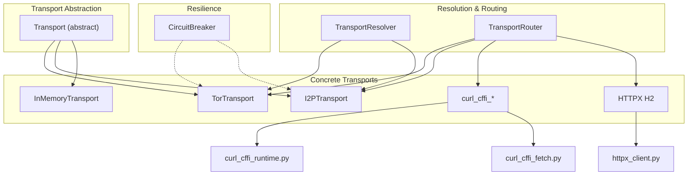
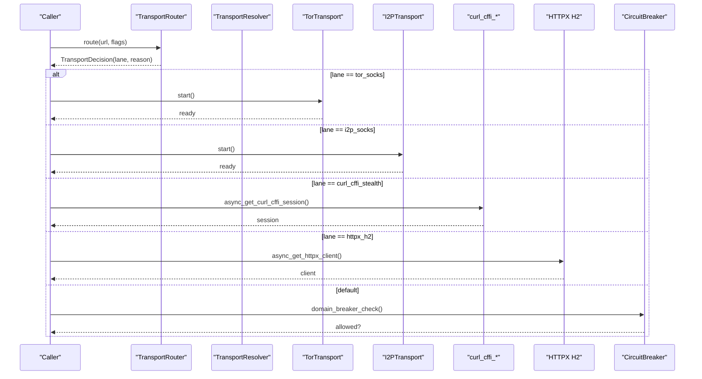
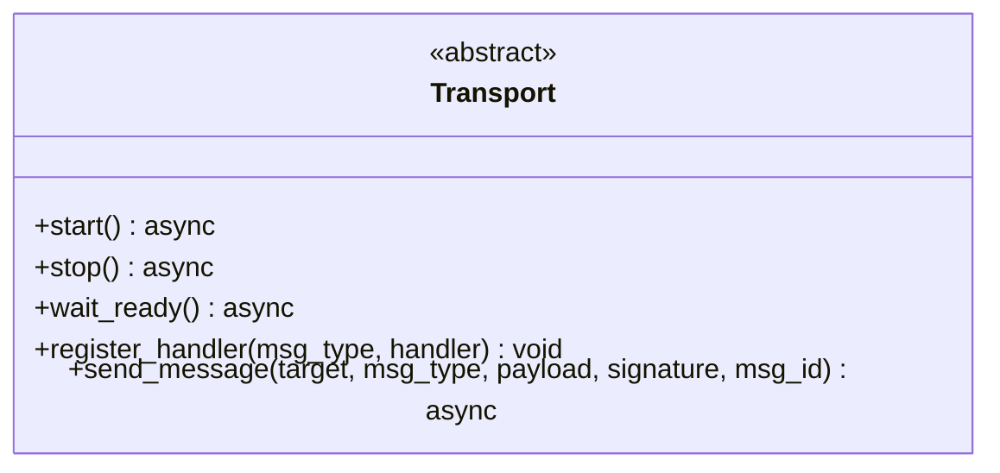
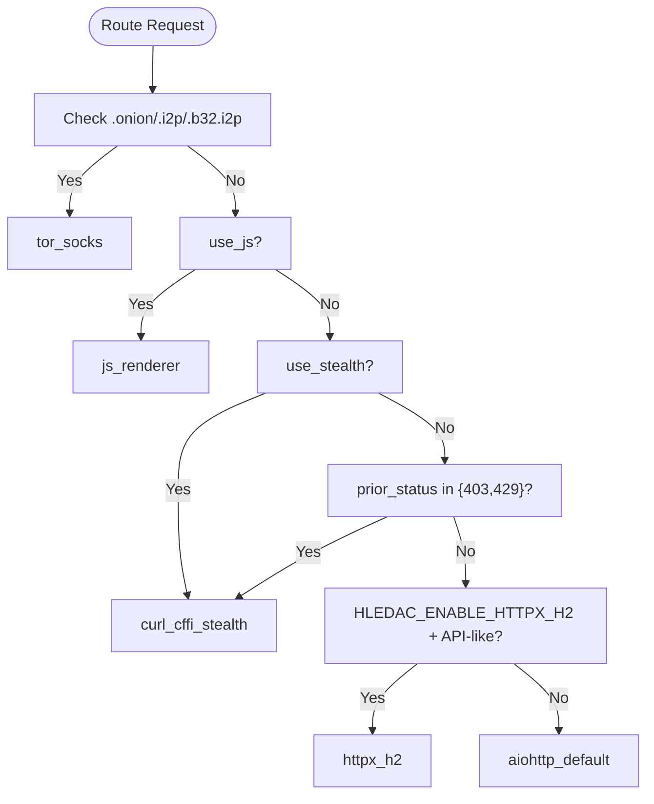
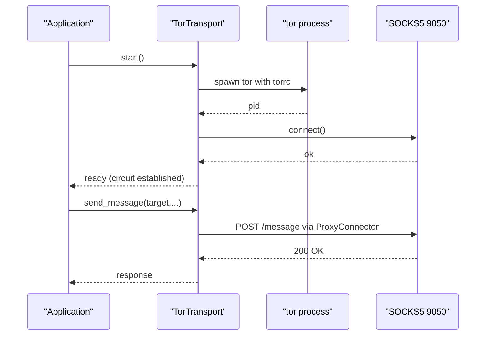
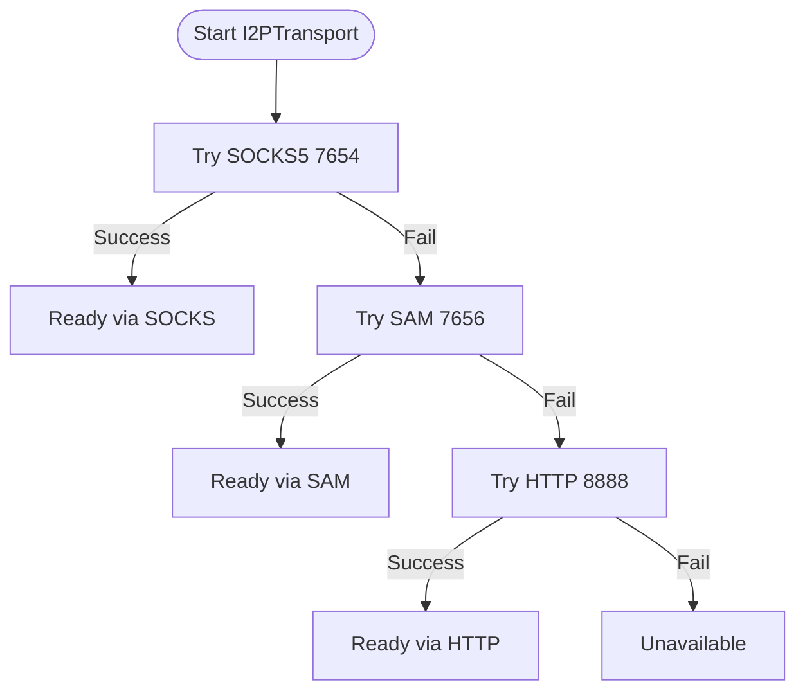
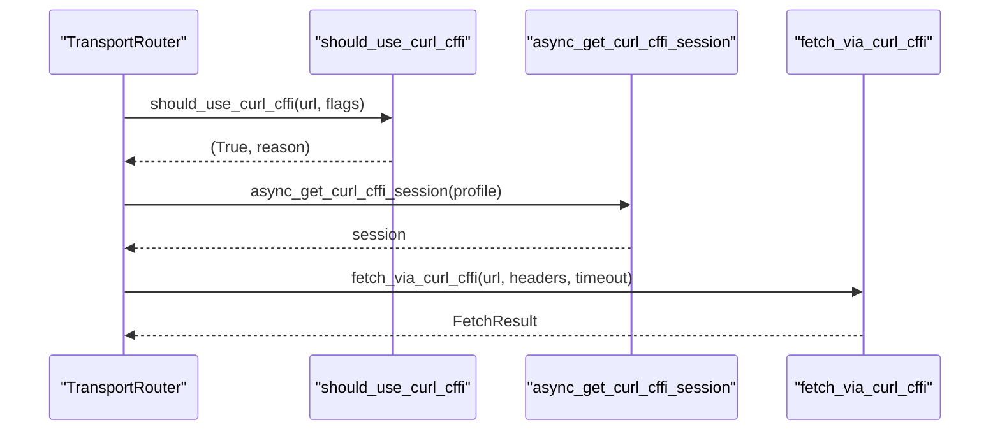
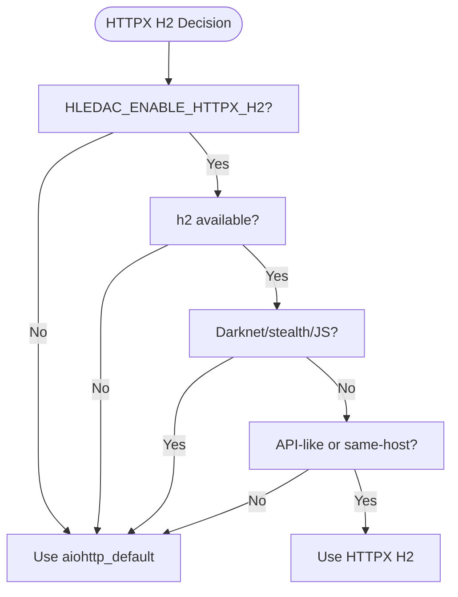
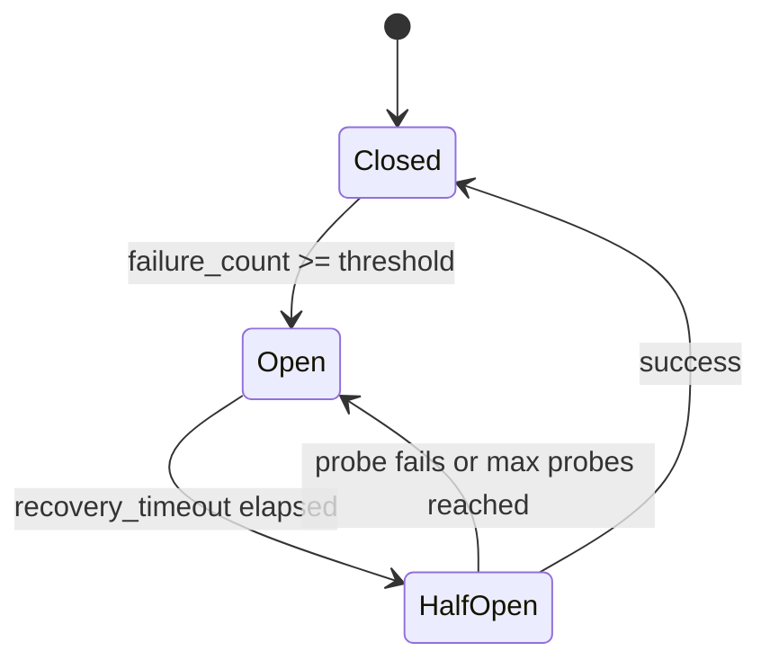
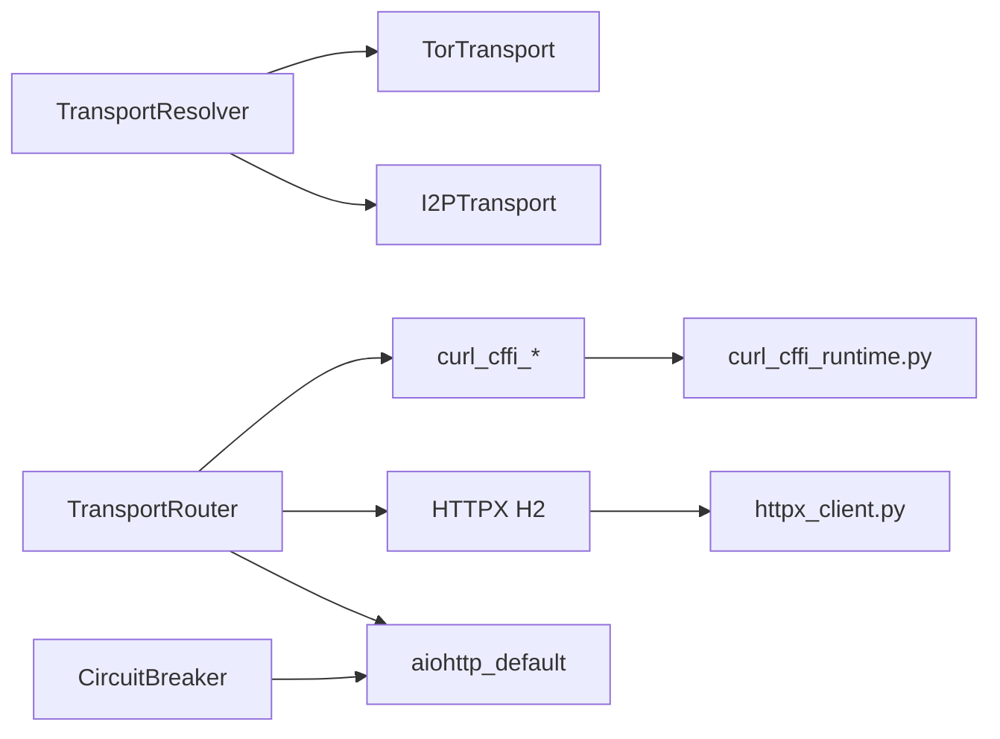

# Transport Layer

<cite>
**Referenced Files in This Document**
- [transport/__init__.py](file://transport/__init__.py)
- [transport/base.py](file://transport/base.py)
- [transport/transport_resolver.py](file://transport/transport_resolver.py)
- [transport/transport_router.py](file://transport/transport_router.py)
- [transport/circuit_breaker.py](file://transport/circuit_breaker.py)
- [transport/tor_transport.py](file://transport/tor_transport.py)
- [transport/i2p_transport.py](file://transport/i2p_transport.py)
- [transport/curl_cffi_transport.py](file://transport/curl_cffi_transport.py)
- [transport/curl_cffi_runtime.py](file://transport/curl_cffi_runtime.py)
- [transport/curl_cffi_fetch.py](file://transport/curl_cffi_fetch.py)
- [transport/httpx_transport.py](file://transport/httpx_transport.py)
- [transport/httpx_client.py](file://transport/httpx_client.py)
- [transport/inmemory_transport.py](file://transport/inmemory_transport.py)
- [federated/transport_tor.py](file://federated/transport_tor.py)
</cite>

## Table of Contents
1. [Introduction](#introduction)
2. [Project Structure](#project-structure)
3. [Core Components](#core-components)
4. [Architecture Overview](#architecture-overview)
5. [Detailed Component Analysis](#detailed-component-analysis)
6. [Dependency Analysis](#dependency-analysis)
7. [Performance Considerations](#performance-considerations)
8. [Security and Anonymity Features](#security-and-anonymity-features)
9. [Configuration Examples](#configuration-examples)
10. [Troubleshooting Guide](#troubleshooting-guide)
11. [Conclusion](#conclusion)

## Introduction
This document describes the transport layer system used by Hledac Universal for network abstraction, multi-protocol support, and transport resolution. It covers:
- Transport abstraction and pluggable implementations
- Multi-protocol support: Tor, I2P, curl_cffi stealth, HTTP/2 via HTTPX, and direct HTTP
- Transport resolution and routing mechanisms
- Circuit management, timeouts, and retry strategies
- Security and anonymity features, including traffic obfuscation
- Configuration examples and performance optimization guidelines

## Project Structure
The transport layer is organized around a small set of core abstractions and concrete implementations:
- Base transport interface
- Transport resolver and router for policy-driven selection
- Concrete transports: Tor, I2P, curl_cffi, HTTPX, and in-memory
- Circuit breaker for resilience and domain-level failure management

**Diagram sources**
- [transport/base.py:4-24](file://transport/base.py#L4-L24)
- [transport/transport_resolver.py:95-240](file://transport/transport_resolver.py#L95-L240)
- [transport/transport_router.py:101-260](file://transport/transport_router.py#L101-L260)
- [transport/tor_transport.py:37-345](file://transport/tor_transport.py#L37-L345)
- [transport/i2p_transport.py:41-361](file://transport/i2p_transport.py#L41-L361)
- [transport/curl_cffi_transport.py:34-86](file://transport/curl_cffi_transport.py#L34-L86)
- [transport/curl_cffi_runtime.py:37-193](file://transport/curl_cffi_runtime.py#L37-L193)
- [transport/curl_cffi_fetch.py:23-187](file://transport/curl_cffi_fetch.py#L23-L187)
- [transport/httpx_transport.py:316-532](file://transport/httpx_transport.py#L316-L532)
- [transport/httpx_client.py:93-213](file://transport/httpx_client.py#L93-L213)
- [transport/inmemory_transport.py:14-98](file://transport/inmemory_transport.py#L14-L98)
- [transport/circuit_breaker.py:78-230](file://transport/circuit_breaker.py#L78-L230)

**Section sources**
- [transport/__init__.py:1-16](file://transport/__init__.py#L1-L16)
- [transport/base.py:4-24](file://transport/base.py#L4-L24)

## Core Components
- Transport: Abstract base interface defining lifecycle and messaging semantics.
- TransportResolver: Autonomous, context-driven selection among available transports (Nym, Tor, Direct, InMemory).
- TransportRouter: Stateless policy engine selecting lanes (tor_socks, i2p_socks, curl_cffi_stealth, httpx_h2, aiohttp_default).
- Concrete Transports: TorTransport, I2PTransport, curl_cffi runtime and fetch adapters, HTTPX client, InMemoryTransport.
- CircuitBreaker: Domain-scoped resilience with configurable thresholds and half-open probing.

**Section sources**
- [transport/base.py:4-24](file://transport/base.py#L4-L24)
- [transport/transport_resolver.py:95-240](file://transport/transport_resolver.py#L95-L240)
- [transport/transport_router.py:101-260](file://transport/transport_router.py#L101-L260)
- [transport/circuit_breaker.py:78-230](file://transport/circuit_breaker.py#L78-L230)

## Architecture Overview
The transport layer separates concerns:
- Policy: TransportResolver and TransportRouter determine which transport/lane to use.
- Execution: Concrete transports implement the actual networking.
- Resilience: CircuitBreaker protects against cascading failures at the domain level.

**Diagram sources**
- [transport/transport_router.py:134-260](file://transport/transport_router.py#L134-L260)
- [transport/transport_resolver.py:176-240](file://transport/transport_resolver.py#L176-L240)
- [transport/tor_transport.py:84-165](file://transport/tor_transport.py#L84-L165)
- [transport/i2p_transport.py:93-124](file://transport/i2p_transport.py#L93-L124)
- [transport/curl_cffi_runtime.py:61-91](file://transport/curl_cffi_runtime.py#L61-L91)
- [transport/httpx_client.py:93-152](file://transport/httpx_client.py#L93-L152)
- [transport/circuit_breaker.py:308-325](file://transport/circuit_breaker.py#L308-L325)

## Detailed Component Analysis

### Transport Abstraction
The Transport interface defines the contract for all transports:
- Lifecycle: start, stop, wait_ready
- Messaging: register_handler, send_message
- Uniform behavior across transports for higher-level orchestration

**Diagram sources**
- [transport/base.py:4-24](file://transport/base.py#L4-L24)

**Section sources**
- [transport/base.py:4-24](file://transport/base.py#L4-L24)

### Transport Resolution and Routing
- TransportResolver: Autonomously chooses transport based on context (requires_anonymity, risk_level) and availability of Nym/Tor. It avoids per-request lifecycle for production alignment.
- TransportRouter: Stateless decision engine selecting lanes based on URL characteristics, flags, and environment. Enforces invariants (e.g., HTTPX H2 not used for darknet/stealth/JS).

**Diagram sources**
- [transport/transport_router.py:134-260](file://transport/transport_router.py#L134-L260)
- [transport/transport_resolver.py:268-301](file://transport/transport_resolver.py#L268-L301)

**Section sources**
- [transport/transport_resolver.py:95-240](file://transport/transport_resolver.py#L95-L240)
- [transport/transport_router.py:101-260](file://transport/transport_router.py#L101-L260)

### Tor Integration
- TorTransport encapsulates:
  - Autonomous Tor process startup with generated torrc
  - SOCKS5 proxy connector via aiohttp_socks
  - Health checks (SOCKS reachability and optional stem circuit status)
  - Session management for direct and Tor-scoped HTTP
  - Optional hidden service hosting for inter-peer messaging
- Security features include IsolateSOCKSAuth, MaxCircuitDirtiness, and NumEntryGuards.

**Diagram sources**
- [transport/tor_transport.py:84-165](file://transport/tor_transport.py#L84-L165)
- [transport/tor_transport.py:211-241](file://transport/tor_transport.py#L211-L241)

**Section sources**
- [transport/tor_transport.py:37-345](file://transport/tor_transport.py#L37-L345)

### I2P Support
- I2PTransport supports multiple modes:
  - SOCKS5 proxy (port 7654)
  - SAM protocol (port 7656) for destination generation
  - HTTP proxy (Freenet FProxy on port 8888)
- Graceful fallback: if no mode is available, transport becomes unavailable without crashing.
- Provides get_session() and send_message() for messaging over I2P.

**Diagram sources**
- [transport/i2p_transport.py:93-124](file://transport/i2p_transport.py#L93-L124)

**Section sources**
- [transport/i2p_transport.py:41-361](file://transport/i2p_transport.py#L41-L361)

### curl_cffi Stealth Browsing
- Policy: curl_cffi is selected based on environment gate, explicit flags, prior status, and protection hints. It is intentionally excluded from darknet/JS/stealth lanes by design.
- Runtime: Lazy availability check and bounded LRU session cache with multiple impersonation profiles.
- Fetch adapter: Returns standardized FetchResult-compatible dict with telemetry and error categorization.

**Diagram sources**
- [transport/curl_cffi_transport.py:34-86](file://transport/curl_cffi_transport.py#L34-L86)
- [transport/curl_cffi_runtime.py:61-91](file://transport/curl_cffi_runtime.py#L61-L91)
- [transport/curl_cffi_fetch.py:23-118](file://transport/curl_cffi_fetch.py#L23-L118)

**Section sources**
- [transport/curl_cffi_transport.py:34-86](file://transport/curl_cffi_transport.py#L34-L86)
- [transport/curl_cffi_runtime.py:37-193](file://transport/curl_cffi_runtime.py#L37-L193)
- [transport/curl_cffi_fetch.py:23-187](file://transport/curl_cffi_fetch.py#L23-L187)

### HTTPX H2 Transport
- HTTPX H2 is conditionally enabled via environment variable and capability detection.
- Policy excludes darknet/stealth/JS URLs; favors API-like and same-host patterns.
- Includes manual redirect handling with SSRF protections and a per-instance circuit breaker.

**Diagram sources**
- [transport/httpx_transport.py:277-354](file://transport/httpx_transport.py#L277-L354)
- [transport/httpx_client.py:93-152](file://transport/httpx_client.py#L93-L152)

**Section sources**
- [transport/httpx_transport.py:316-532](file://transport/httpx_transport.py#L316-L532)
- [transport/httpx_client.py:93-213](file://transport/httpx_client.py#L93-L213)

### In-Memory Transport
- Bounded queue and peer registration for internal testing and isolated environments.
- Useful for controlled testing scenarios and internal bus simulation.

**Section sources**
- [transport/inmemory_transport.py:14-98](file://transport/inmemory_transport.py#L14-L98)

### Circuit Breaker
- Domain-scoped resilience with configurable thresholds and exponential backoff for recovery.
- Provides shared registry across modules and helpers for aiohttp GET/POST with breaker integration.

**Diagram sources**
- [transport/circuit_breaker.py:51-147](file://transport/circuit_breaker.py#L51-L147)

**Section sources**
- [transport/circuit_breaker.py:78-230](file://transport/circuit_breaker.py#L78-L230)

## Dependency Analysis
- Coupling: TransportRouter and TransportResolver are decoupled from concrete transports; they rely on pure functions and environment checks.
- Cohesion: Each transport module encapsulates its own lifecycle and proxy/session management.
- External dependencies:
  - aiohttp and aiohttp_socks for Tor/I2P SOCKS connectors
  - curl_cffi for stealth impersonation
  - httpx + h2 for HTTP/2
  - stem for optional Tor circuit inspection

**Diagram sources**
- [transport/transport_resolver.py:124-151](file://transport/transport_resolver.py#L124-L151)
- [transport/transport_router.py:101-260](file://transport/transport_router.py#L101-L260)
- [transport/httpx_client.py:93-152](file://transport/httpx_client.py#L93-L152)
- [transport/curl_cffi_runtime.py:61-91](file://transport/curl_cffi_runtime.py#L61-L91)

**Section sources**
- [transport/transport_resolver.py:124-151](file://transport/transport_resolver.py#L124-L151)
- [transport/transport_router.py:101-260](file://transport/transport_router.py#L101-L260)
- [transport/httpx_client.py:93-152](file://transport/httpx_client.py#L93-L152)
- [transport/curl_cffi_runtime.py:61-91](file://transport/curl_cffi_runtime.py#L61-L91)

## Performance Considerations
- HTTPX H2:
  - Enable via environment variable and ensure h2 is installed.
  - Use for API-like URLs and same-host batches to leverage HTTP/2 multiplexing.
  - Circuit breaker auto-disables after repeated failures to protect performance.
- curl_cffi:
  - Use bounded session cache with LRU eviction (max 3 profiles).
  - Prefer when encountering anti-bot protections (Cloudflare/Akamai/etc.) or 403/429 responses.
- Tor/I2P:
  - Use SOCKS5 connectors; circuit establishment delays are expected.
  - Hidden service hosting can reduce latency for local inter-peer messaging.
- CircuitBreaker:
  - Limits tracked domains and caps recovery timeouts to prevent cascading failures.

[No sources needed since this section provides general guidance]

## Security and Anonymity Features
- Tor:
  - SOCKS5 proxy with isolation and circuit dirtiness controls.
  - Optional hidden service hosting for peer-to-peer messaging.
- I2P:
  - Multiple modes: SOCKS5, SAM, HTTP proxy.
  - Destination generation via SAM for ephemeral identities.
- curl_cffi:
  - TLS impersonation profiles to mimic popular browsers.
  - Bounded session cache to reduce fingerprint persistence.
- HTTPX H2:
  - Standardized browser-like headers to reduce fingerprinting.
  - Manual redirect handling with SSRF validation.
- CircuitBreaker:
  - Protects against abuse and cascading failures.

**Section sources**
- [transport/tor_transport.py:211-241](file://transport/tor_transport.py#L211-L241)
- [transport/i2p_transport.py:152-196](file://transport/i2p_transport.py#L152-L196)
- [transport/curl_cffi_runtime.py:126-136](file://transport/curl_cffi_runtime.py#L126-L136)
- [transport/httpx_transport.py:396-442](file://transport/httpx_transport.py#L396-L442)
- [transport/circuit_breaker.py:100-147](file://transport/circuit_breaker.py#L100-L147)

## Configuration Examples
- Enable curl_cffi stealth lane:
  - Set environment variable to activate the policy.
  - Use explicit flags when initiating fetches.
- Enable HTTPX H2:
  - Set environment variable and ensure httpx + h2 are installed.
  - Policy will select HTTPX H2 for API-like URLs.
- Tor/I2P:
  - Ensure tor/i2p router is running; the transports will auto-detect and configure SOCKS proxies.
- CircuitBreaker:
  - Shared domain breaker protects against repeated failures; no manual configuration required.

[No sources needed since this section provides general guidance]

## Troubleshooting Guide
- Tor not available:
  - TorTransport gracefully falls back to localhost and adjusts security level accordingly.
  - Check tor binary presence and torrc generation.
- I2P not available:
  - I2PTransport tries SOCKS, SAM, and HTTP modes in order; if none succeed, transport becomes unavailable.
- curl_cffi not available:
  - Availability checked lazily; if missing, policy falls back to default lanes.
  - Inspect runtime status for cached profiles and capacity.
- HTTPX H2 disabled:
  - Ensure environment gate is set and h2 is installed; circuit breaker may auto-disable after failures.
- CircuitBreaker:
  - Use diagnostic helpers to inspect breaker states and snapshots for problematic domains.

**Section sources**
- [transport/tor_transport.py:84-100](file://transport/tor_transport.py#L84-L100)
- [transport/i2p_transport.py:93-124](file://transport/i2p_transport.py#L93-L124)
- [transport/curl_cffi_runtime.py:37-59](file://transport/curl_cffi_runtime.py#L37-L59)
- [transport/httpx_client.py:112-116](file://transport/httpx_client.py#L112-L116)
- [transport/circuit_breaker.py:213-230](file://transport/circuit_breaker.py#L213-L230)

## Conclusion
The transport layer provides a modular, policy-driven network stack supporting Tor, I2P, curl_cffi stealth, HTTP/2 via HTTPX, and direct HTTP. It emphasizes resilience via domain-scoped circuit breaking, security through isolation and impersonation, and performance through selective HTTP/2 usage and bounded session caching. The separation of policy (resolver/router) from execution (transports) ensures maintainability and extensibility.