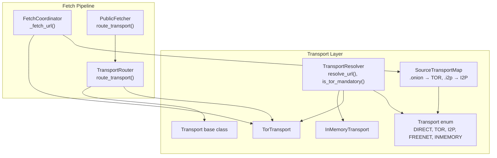
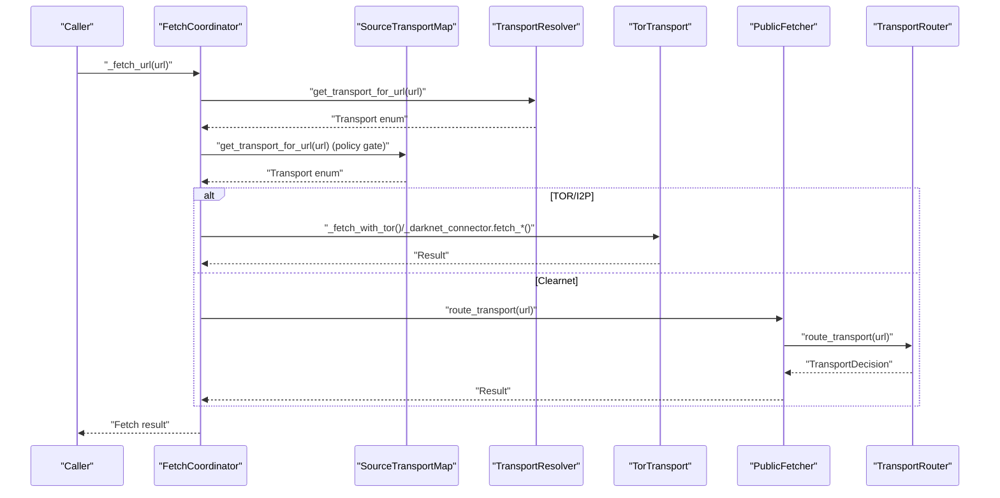
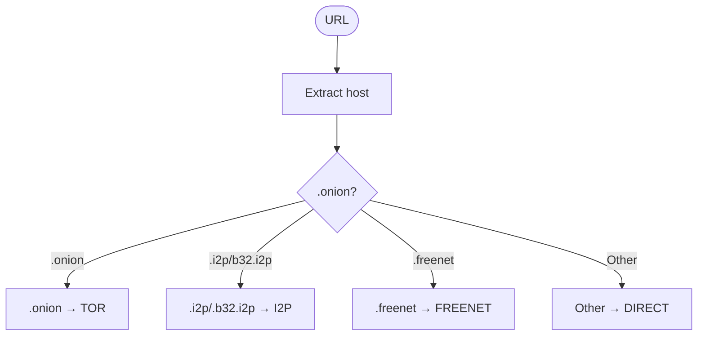
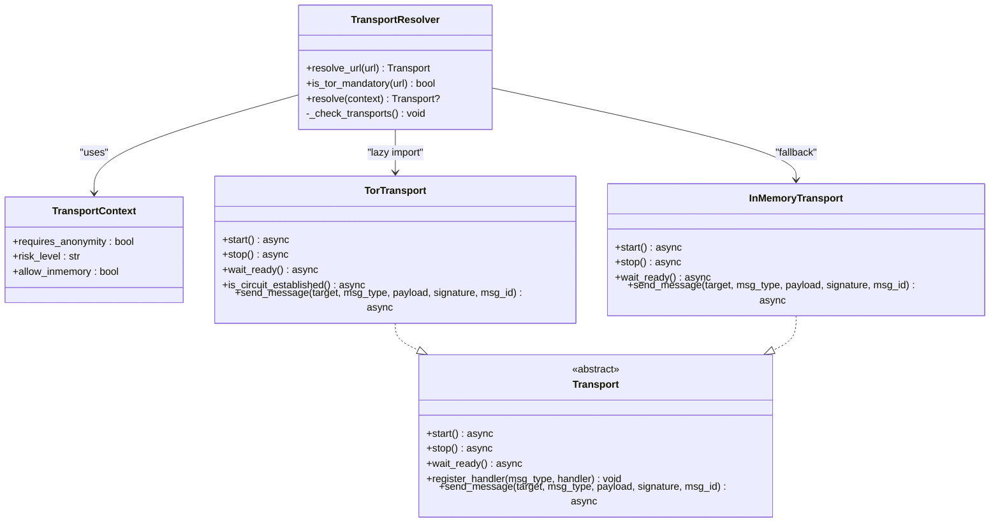
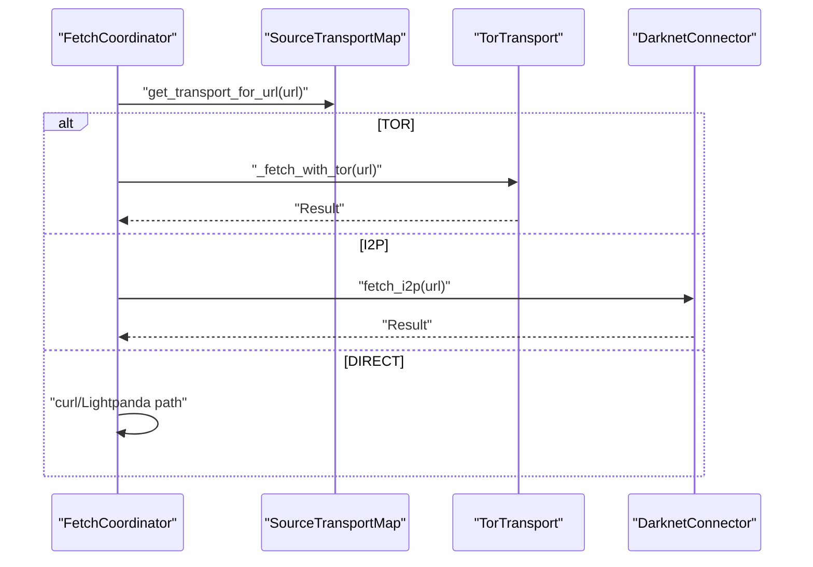
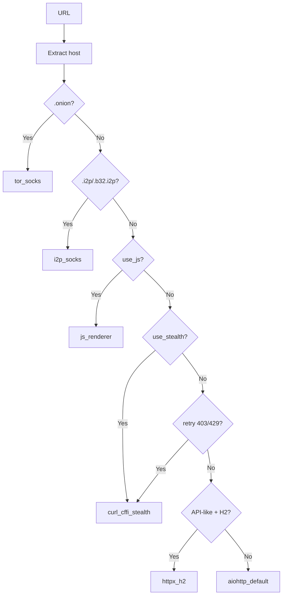
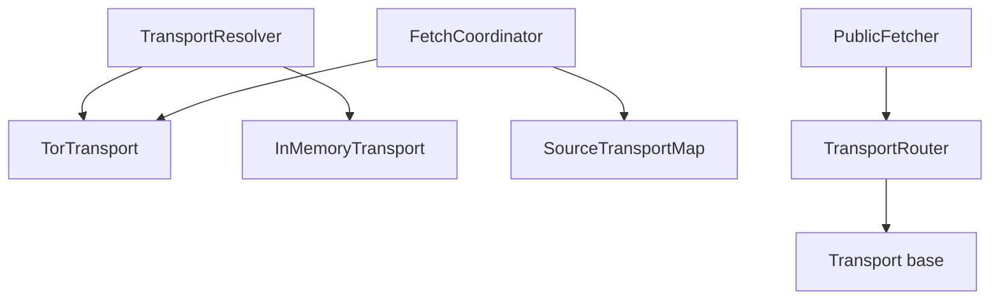

# Transport Resolver

<cite>
**Referenced Files in This Document**
- [transport_resolver.py](file://transport/transport_resolver.py)
- [transport_router.py](file://transport/transport_router.py)
- [base.py](file://transport/base.py)
- [tor_transport.py](file://transport/tor_transport.py)
- [inmemory_transport.py](file://transport/inmemory_transport.py)
- [fetch_coordinator.py](file://coordinators/fetch_coordinator.py)
- [public_fetcher.py](file://fetching/public_fetcher.py)
- [test_source_transport_map_mandatory.py](file://tests/probe_8pa/test_source_transport_map_mandatory.py)
- [test_transport_resolver_decision.py](file://tests/probe_transport_resolver_f206av/test_transport_resolver_decision.py)
</cite>

## Table of Contents
1. [Introduction](#introduction)
2. [Project Structure](#project-structure)
3. [Core Components](#core-components)
4. [Architecture Overview](#architecture-overview)
5. [Detailed Component Analysis](#detailed-component-analysis)
6. [Dependency Analysis](#dependency-analysis)
7. [Performance Considerations](#performance-considerations)
8. [Troubleshooting Guide](#troubleshooting-guide)
9. [Conclusion](#conclusion)

## Introduction
This document describes the Transport Resolver system, an autonomous transport selection mechanism that operates without configuration toggles. It relies on runtime signals and context analysis to choose the appropriate transport for fetching resources. The system classifies URLs into transport categories (DIRECT, TOR, I2P, FREENET, INMEMORY) and integrates with the broader fetch pipeline through policy gates and router decisions.

Key goals:
- Eliminate hard-coded URL checks in favor of explicit policy classification.
- Provide a policy seam that supports mandatory routing for .onion and .i2p.
- Enable future migration toward a unified resolver-driven transport authority.
- Maintain backwards compatibility during the transition.

## Project Structure
The Transport Resolver resides in the transport package and integrates with the fetch pipeline via two primary pathways:
- Policy gate via SourceTransportMap and get_transport_for_url() for immediate classification.
- Router-based lane selection via TransportRouter for broader fetch orchestration.

**Diagram sources**
- [transport_resolver.py:95-240](file://transport/transport_resolver.py#L95-L240)
- [transport_router.py:101-260](file://transport/transport_router.py#L101-L260)
- [base.py:4-24](file://transport/base.py#L4-L24)
- [tor_transport.py:37-83](file://transport/tor_transport.py#L37-L83)
- [inmemory_transport.py:14-53](file://transport/inmemory_transport.py#L14-L53)
- [fetch_coordinator.py:1280-1320](file://coordinators/fetch_coordinator.py#L1280-L1320)
- [public_fetcher.py:1251-1272](file://fetching/public_fetcher.py#L1251-L1272)

**Section sources**
- [transport_resolver.py:1-361](file://transport/transport_resolver.py#L1-L361)
- [transport_router.py:1-358](file://transport/transport_router.py#L1-L358)
- [fetch_coordinator.py:1210-1399](file://coordinators/fetch_coordinator.py#L1210-L1399)
- [public_fetcher.py:1240-1439](file://fetching/public_fetcher.py#L1240-L1439)

## Core Components
- Transport enum: Classifies URLs into DIRECT, TOR, I2P, FREENET, INMEMORY for policy purposes.
- SourceTransportMap: Domain-suffix mapping enforcing mandatory Tor routing for .onion and I2P routing for .i2p.
- TransportContext: Runtime context for anonymity requirements and risk levels.
- TransportResolver: Autonomous resolver with policy gate methods and a dormant resolve() method.
- TransportRouter: Stateless router selecting lanes (tor_socks, i2p_socks, curl_cffi_stealth, etc.) based on URL characteristics.
- Base Transport: Abstract interface for transport implementations.

**Section sources**
- [transport_resolver.py:40-127](file://transport/transport_resolver.py#L40-L127)
- [transport_resolver.py:69-85](file://transport/transport_resolver.py#L69-L85)
- [transport_resolver.py:87-93](file://transport/transport_resolver.py#L87-L93)
- [transport_resolver.py:95-240](file://transport/transport_resolver.py#L95-L240)
- [transport_router.py:101-260](file://transport/transport_router.py#L101-L260)
- [base.py:4-24](file://transport/base.py#L4-L24)

## Architecture Overview
The Transport Resolver system separates policy classification from execution. Policy gate classification is performed synchronously and deterministically, while execution-level transport selection is delegated to the router and coordinator.

**Diagram sources**
- [fetch_coordinator.py:1280-1320](file://coordinators/fetch_coordinator.py#L1280-L1320)
- [transport_resolver.py:268-301](file://transport/transport_resolver.py#L268-L301)
- [public_fetcher.py:1251-1272](file://fetching/public_fetcher.py#L1251-L1272)
- [transport_router.py:134-260](file://transport/transport_router.py#L134-L260)

## Detailed Component Analysis

### Transport Enum and Classification
- DIRECT: Plain TCP for clearnet URLs.
- TOR: Mandatory for .onion; proxy-aware SOCKS5 for .onion domains.
- I2P: Proxy-aware SOCKS5 for .i2p domains.
- FREENET: HTTP proxy namespace (.freenet); currently unsupported by router.
- INMEMORY: Test/internal only.

Classification logic:
- .onion → TOR (mandatory)
- .i2p → I2P
- .b32.i2p → I2P (base32 I2P)
- .freenet → FREENET
- Other → DIRECT

**Section sources**
- [transport_resolver.py:40-58](file://transport/transport_resolver.py#L40-L58)
- [transport_resolver.py:60-66](file://transport/transport_resolver.py#L60-L66)
- [transport_resolver.py:268-301](file://transport/transport_resolver.py#L268-L301)

### SourceTransportMap: Domain-Suffix Mapping
- Enforces mandatory Tor routing for .onion.
- Routes .i2p and .b32.i2p to I2P.
- Defaults to DIRECT for other suffixes.
- Provides is_mandatory_tor() for quick checks.

**Diagram sources**
- [transport_resolver.py:27-38](file://transport/transport_resolver.py#L27-L38)
- [transport_resolver.py:60-85](file://transport/transport_resolver.py#L60-L85)
- [transport_resolver.py:268-301](file://transport/transport_resolver.py#L268-L301)

**Section sources**
- [transport_resolver.py:69-85](file://transport/transport_resolver.py#L69-L85)
- [test_source_transport_map_mandatory.py:10-61](file://tests/probe_8pa/test_source_transport_map_mandatory.py#L10-L61)

### TransportContext: Runtime Decision Inputs
- requires_anonymity: Whether anonymity is required.
- risk_level: "low", "medium", "high".
- allow_inmemory: Enables INMEMORY fallback for testing/internal use.

**Section sources**
- [transport_resolver.py:87-93](file://transport/transport_resolver.py#L87-L93)

### TransportResolver: Autonomous Selection and Policy Gate
- resolve_url(url): Fast, deterministic classification for policy gate usage.
- is_tor_mandatory(url): Boolean check for .onion.
- resolve(context): Dormant method attempting per-request transport lifecycle (not production).
- Lazy import of Tor/Nym transports; logs availability.

**Diagram sources**
- [transport_resolver.py:95-240](file://transport/transport_resolver.py#L95-L240)
- [base.py:4-24](file://transport/base.py#L4-L24)
- [tor_transport.py:37-83](file://transport/tor_transport.py#L37-L83)
- [inmemory_transport.py:14-53](file://transport/inmemory_transport.py#L14-L53)

**Section sources**
- [transport_resolver.py:152-175](file://transport/transport_resolver.py#L152-L175)
- [transport_resolver.py:176-240](file://transport/transport_resolver.py#L176-L240)
- [transport_resolver.py:129-151](file://transport/transport_resolver.py#L129-L151)

### Integration with Fetch Coordinator
- Policy gate: SourceTransportMap.get() replaces hardcoded url.endswith() checks.
- Darknet handling: .onion via _fetch_with_tor(); .i2p via _darknet_connector.
- Clearnet: Uses PublicFetcher with TransportRouter-selected lanes.

**Diagram sources**
- [fetch_coordinator.py:1280-1320](file://coordinators/fetch_coordinator.py#L1280-L1320)

**Section sources**
- [fetch_coordinator.py:1210-1399](file://coordinators/fetch_coordinator.py#L1210-L1399)

### TransportRouter: Lane Selection
- Decisions based on URL characteristics and environment flags.
- Priority: .onion → tor_socks; .i2p/.b32.i2p → i2p_socks; JS-heavy → js_renderer; stealth → curl_cffi_stealth; API-like + HLEDAC_ENABLE_HTTPX_H2=1 → httpx_h2; default → aiohttp_default.
- Stateless and deterministic; no network I/O.

**Diagram sources**
- [transport_router.py:134-260](file://transport/transport_router.py#L134-L260)

**Section sources**
- [transport_router.py:101-260](file://transport/transport_router.py#L101-L260)
- [public_fetcher.py:1251-1272](file://fetching/public_fetcher.py#L1251-L1272)

### Policy Gate Pattern and Backwards Compatibility
- Policy gate: get_transport_for_url() wraps resolve_url() to provide explicit classification without changing execution.
- Backwards compatibility: Existing hardcoded logic remains as fallback truth; SourceTransportMap.get() is the active policy layer.
- Migration path: Future wiring of TransportResolver.resolve() requires:
  - Persistent Tor/Nym session management.
  - Replacement of per-request transport lifecycle with pooled sessions.
  - Resolver-backed session pools.

**Section sources**
- [transport_resolver.py:242-266](file://transport/transport_resolver.py#L242-L266)
- [transport_resolver.py:324-361](file://transport/transport_resolver.py#L324-L361)
- [fetch_coordinator.py:1219-1228](file://coordinators/fetch_coordinator.py#L1219-L1228)

## Dependency Analysis
- TransportResolver depends on lazy imports of TorTransport and NymTransport.
- FetchCoordinator depends on SourceTransportMap for policy gate and on TorTransport/DarknetConnector for darknet fetches.
- PublicFetcher depends on TransportRouter for lane selection and on StealthSession for stealth mode.

**Diagram sources**
- [transport_resolver.py:129-151](file://transport/transport_resolver.py#L129-L151)
- [fetch_coordinator.py:1280-1320](file://coordinators/fetch_coordinator.py#L1280-L1320)
- [public_fetcher.py:1251-1272](file://fetching/public_fetcher.py#L1251-L1272)
- [transport_router.py:101-260](file://transport/transport_router.py#L101-L260)

**Section sources**
- [transport_resolver.py:124-151](file://transport/transport_resolver.py#L124-L151)
- [fetch_coordinator.py:1280-1320](file://coordinators/fetch_coordinator.py#L1280-L1320)
- [public_fetcher.py:1251-1272](file://fetching/public_fetcher.py#L1251-L1272)

## Performance Considerations
- Classification is suffix-based and deterministic, avoiding network calls and transport initialization.
- Tests demonstrate sub-second performance for thousands of calls.
- Router decisions are stateless and pure functions, minimizing overhead.

[No sources needed since this section provides general guidance]

## Troubleshooting Guide
Common issues and resolutions:
- Tor unavailable: TransportResolver logs warnings and falls back; ensure tor binary and dependencies are available.
- Nym unavailable: TransportResolver attempts Tor fallback; verify Nym transport availability.
- .freenet classification gap: resolve_url() falls through to DIRECT; use get_transport_for_url() for correct classification.
- InMemory fallback: Only for testing; ensure allow_inmemory is set appropriately.

**Section sources**
- [transport_resolver.py:188-211](file://transport/transport_resolver.py#L188-L211)
- [transport_resolver.py:212-239](file://transport/transport_resolver.py#L212-L239)
- [test_transport_resolver_decision.py:144-151](file://tests/probe_transport_resolver_f206av/test_transport_resolver_decision.py#L144-L151)

## Conclusion
The Transport Resolver system establishes a clean policy gate for transport classification and a foundation for future migration toward a unified resolver-driven authority. It preserves backwards compatibility while enabling autonomous, context-aware transport selection. Integration with FetchCoordinator and PublicFetcher ensures that policy decisions align with execution paths, and the router provides deterministic lane selection for clearnet and specialized transports.