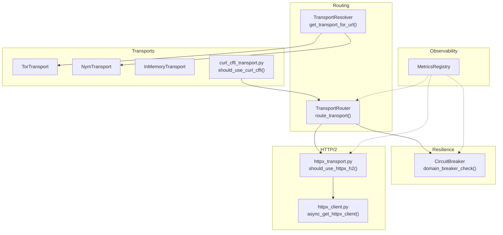
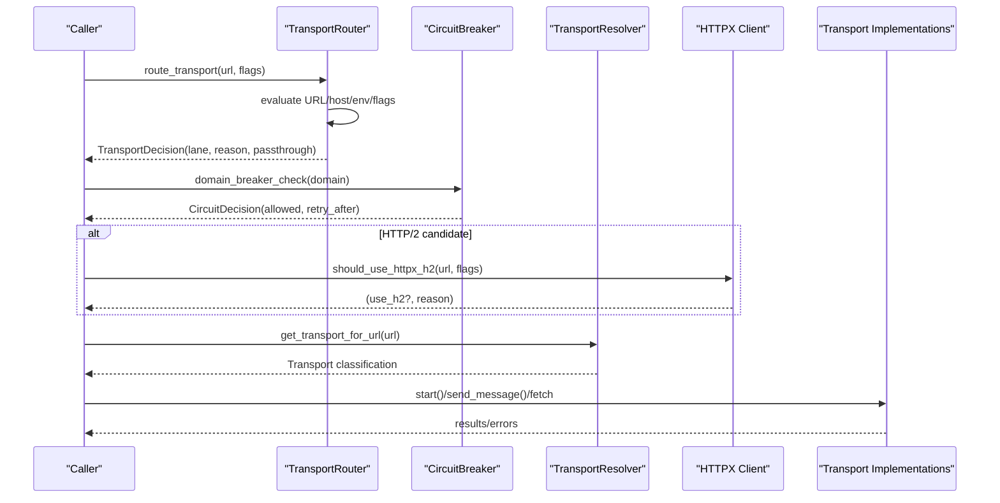
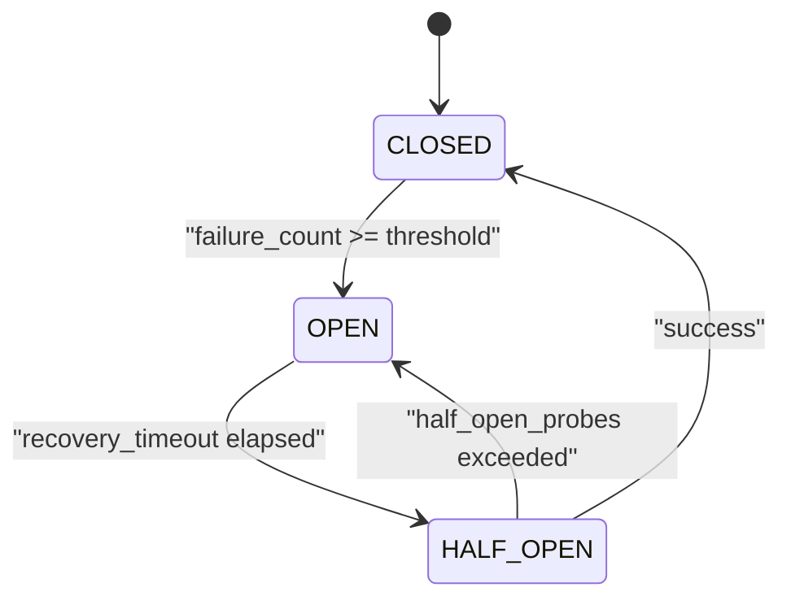
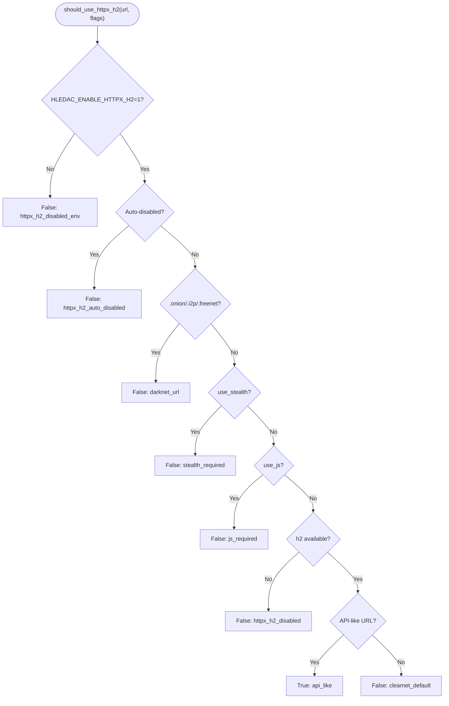
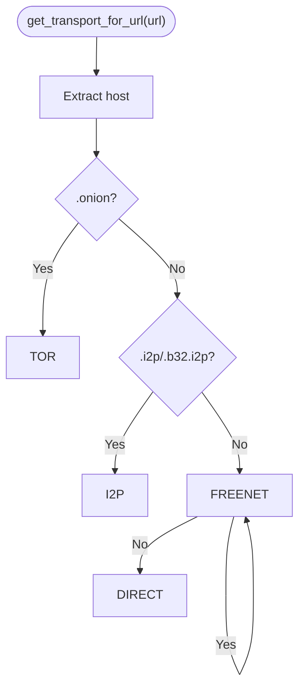
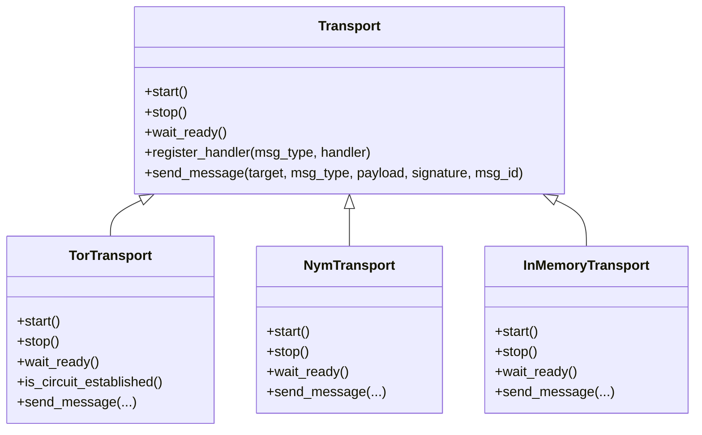
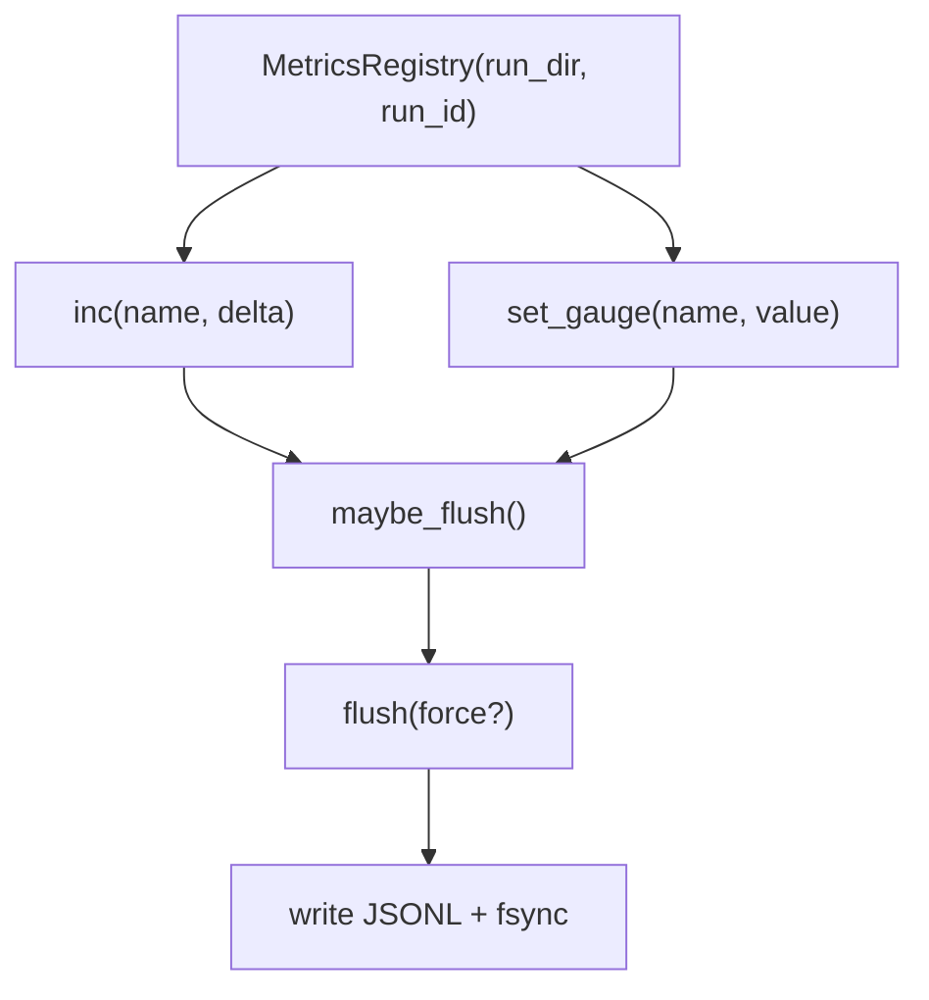
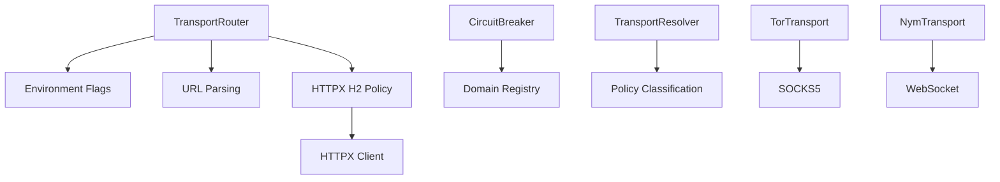

# Transport Routing and Circuit Management

<cite>
**Referenced Files in This Document**
- [transport_router.py](file://transport/transport_router.py)
- [circuit_breaker.py](file://transport/circuit_breaker.py)
- [transport_resolver.py](file://transport/transport_resolver.py)
- [httpx_transport.py](file://transport/httpx_transport.py)
- [httpx_client.py](file://transport/httpx_client.py)
- [curl_cffi_transport.py](file://transport/curl_cffi_transport.py)
- [tor_transport.py](file://transport/tor_transport.py)
- [nym_transport.py](file://transport/nym_transport.py)
- [inmemory_transport.py](file://transport/inmemory_transport.py)
- [base.py](file://transport/base.py)
- [metrics_registry.py](file://metrics_registry.py)
- [nym_policy.py](file://policy/nym_policy.py)
</cite>

## Table of Contents
1. [Introduction](#introduction)
2. [Project Structure](#project-structure)
3. [Core Components](#core-components)
4. [Architecture Overview](#architecture-overview)
5. [Detailed Component Analysis](#detailed-component-analysis)
6. [Dependency Analysis](#dependency-analysis)
7. [Performance Considerations](#performance-considerations)
8. [Troubleshooting Guide](#troubleshooting-guide)
9. [Security Considerations](#security-considerations)
10. [Configuration Options](#configuration-options)
11. [Examples and Scenarios](#examples-and-scenarios)
12. [Conclusion](#conclusion)

## Introduction
This document explains the transport routing and circuit management systems that govern how requests are directed across lanes (clearnet, stealth, anonymity networks, and in-memory), how resilience is enforced via circuit breakers, and how observability is achieved through metrics. It covers:
- Transport router decision logic and routing policies
- Circuit breaker pattern for domain-level fault tolerance
- HTTP/2 capability detection and fallback behavior
- Transport resolver and policy classification
- Integration with transport pools, session management, and connection lifecycles
- Monitoring and observability via metrics
- Configuration options and operational controls
- Security considerations for traffic analysis resistance and destination masking

## Project Structure
The transport subsystem is organized around a router that selects lanes, a circuit breaker that protects domains from cascading failures, and transport implementations for different worlds (clearnet, stealth, Tor, I2P, Nym, in-memory). Supporting modules provide HTTP/2 capability detection, policy classification, and metrics.



**Diagram sources**
- [transport_router.py:101-358](file://transport/transport_router.py#L101-L358)
- [transport_resolver.py:95-361](file://transport/transport_resolver.py#L95-L361)
- [circuit_breaker.py:78-429](file://transport/circuit_breaker.py#L78-L429)
- [httpx_transport.py:277-532](file://transport/httpx_transport.py#L277-L532)
- [httpx_client.py:93-213](file://transport/httpx_client.py#L93-L213)
- [curl_cffi_transport.py:34-86](file://transport/curl_cffi_transport.py#L34-L86)
- [metrics_registry.py:86-388](file://metrics_registry.py#L86-L388)

**Section sources**
- [transport_router.py:1-358](file://transport/transport_router.py#L1-L358)
- [transport_resolver.py:1-361](file://transport/transport_resolver.py#L1-L361)
- [circuit_breaker.py:1-429](file://transport/circuit_breaker.py#L1-L429)
- [httpx_transport.py:1-532](file://transport/httpx_transport.py#L1-L532)
- [httpx_client.py:1-213](file://transport/httpx_client.py#L1-L213)
- [curl_cffi_transport.py:1-86](file://transport/curl_cffi_transport.py#L1-L86)
- [metrics_registry.py:1-388](file://metrics_registry.py#L1-L388)

## Core Components
- TransportRouter: Stateless decision engine that selects a lane based on URL characteristics, flags, and environment conditions. Outputs a TransportDecision with passthrough fields for timeouts, concurrency, caching, and telemetry.
- CircuitBreaker: Domain-scoped resilience mechanism that opens after consecutive failures/timeouts, progressively recovers, and allows limited half-open probes.
- TransportResolver: Policy classification for URL suffixes to determine mandatory anonymity transport (e.g., .onion) and hints for OPSEC policy.
- HTTP/2 capability layer: Detects HTTPX + h2 availability, provides a lazy client singleton, and classifies URLs suitable for HTTP/2 multiplexing.
- curl_cffi policy: Escalation rules for stealth mode and protection detection.
- Transport implementations: TorTransport, NymTransport, InMemoryTransport define connection lifecycles and security levels.
- MetricsRegistry: Lightweight, bounded metrics collection with periodic flush and ring-buffer snapshots.

**Section sources**
- [transport_router.py:101-358](file://transport/transport_router.py#L101-L358)
- [circuit_breaker.py:78-429](file://transport/circuit_breaker.py#L78-L429)
- [transport_resolver.py:95-361](file://transport/transport_resolver.py#L95-L361)
- [httpx_transport.py:277-532](file://transport/httpx_transport.py#L277-L532)
- [httpx_client.py:93-213](file://transport/httpx_client.py#L93-L213)
- [curl_cffi_transport.py:34-86](file://transport/curl_cffi_transport.py#L34-L86)
- [metrics_registry.py:86-388](file://metrics_registry.py#L86-L388)

## Architecture Overview
The routing pipeline integrates policy decisions, resilience checks, and transport execution. The router determines the lane; the circuit breaker guards domain health; HTTP/2 capability detection influences transport selection; and metrics capture performance and health.



**Diagram sources**
- [transport_router.py:134-259](file://transport/transport_router.py#L134-L259)
- [circuit_breaker.py:308-324](file://transport/circuit_breaker.py#L308-L324)
- [httpx_transport.py:277-354](file://transport/httpx_transport.py#L277-L354)
- [transport_resolver.py:268-300](file://transport/transport_resolver.py#L268-L300)

## Detailed Component Analysis

### TransportRouter
- Role: Stateless decision engine selecting the appropriate lane for a given URL and flags.
- Decision rules (priority):
  1) .onion → tor_socks
  2) .i2p/.b32.i2p → i2p_socks
  3) use_js=True → js_renderer
  4) use_stealth=True → curl_cffi_stealth
  5) retry_after_status in (403, 429) → curl_cffi_stealth
  6) API-like URL + HLEDAC_ENABLE_HTTPX_H2=1 + h2 available → httpx_h2
  7) default → aiohttp_default
- Cache policy: cache_allowed only when cache_safe=True AND lane is not volatile.
- Passthrough fields: max_bytes, timeout_s, concurrency_class, selected_transport for telemetry.

```mermaid
flowchart TD
Start(["route_transport()"]) --> Extract["Extract hostname"]
Extract --> Onion{".onion?"}
Onion --> |Yes| Tor["tor_socks<br/>reason=darknet_onion"]
Onion --> |No| I2P{".i2p/.b32.i2p?"}
I2P --> |Yes| I2PPath["i2p_socks<br/>reason=darknet_i2p"]
I2P --> |No| JS{use_js?}
JS --> |Yes| JSPath["js_renderer<br/>reason=js_required"]
JS --> |No| Stealth{use_stealth?}
Stealth --> |Yes| StealthPath["curl_cffi_stealth<br/>reason=explicit_stealth"]
Stealth --> |No| Retry{retry_after_status in {403,429}?}
Retry --> |Yes| RetryPath["curl_cffi_stealth<br/>reason=retry_after_http_X"]
Retry --> |No| H2{should_use_httpx_h2?}
H2 --> |Yes| H2Path["httpx_h2<br/>reason=api_like_httpx_h2"]
H2 --> |No| Default["aiohttp_default<br/>reason=clearnet_default"]
```

**Diagram sources**
- [transport_router.py:134-259](file://transport/transport_router.py#L134-L259)

**Section sources**
- [transport_router.py:101-358](file://transport/transport_router.py#L101-L358)

### CircuitBreaker
- Purpose: Prevent cascading failures by opening the circuit after repeated failures/timeouts for a domain.
- State machine: CLOSED → OPEN → HALF_OPEN → CLOSED.
- Recovery: Exponential backoff for timeouts; resets on success.
- Registry: LRU-eviction registry of up to 500 tracked domains.
- External helpers: domain_breaker_check(), checked_aiohttp_get/post() integrate with HTTP clients.



**Diagram sources**
- [circuit_breaker.py:51-146](file://transport/circuit_breaker.py#L51-L146)

**Section sources**
- [circuit_breaker.py:78-429](file://transport/circuit_breaker.py#L78-L429)

### HTTP/2 Capability and Selection
- should_use_httpx_h2(): Determines if HTTPX H2 is appropriate based on URL patterns, environment gate, and availability.
- async_get_httpx_client(): Lazy, singleton HTTPX client with HTTP/2 enabled and conservative limits.
- classify_httpx_h2_error(): Classifies errors for telemetry and fallback decisions.
- Auto-disable: After 3 failures in-process, HTTPX H2 is auto-disabled for the remainder of the process.



**Diagram sources**
- [httpx_transport.py:277-354](file://transport/httpx_transport.py#L277-L354)
- [httpx_client.py:93-161](file://transport/httpx_client.py#L93-L161)

**Section sources**
- [httpx_transport.py:277-532](file://transport/httpx_transport.py#L277-L532)
- [httpx_client.py:93-213](file://transport/httpx_client.py#L93-L213)

### TransportResolver and Policy Classification
- get_transport_for_url(url): Fast, deterministic classification for policy gating.
- get_transport_hint_string(url): Maps to opsec-policy-friendly strings ("tor", "i2p", "clearnet").
- Resolver.resolve(): Autonomous selection path (DORMANT in production; requires lifecycle changes).



**Diagram sources**
- [transport_resolver.py:268-300](file://transport/transport_resolver.py#L268-L300)

**Section sources**
- [transport_resolver.py:95-361](file://transport/transport_resolver.py#L95-L361)

### Transport Implementations
- TorTransport: SOCKS5-based, circuit establishment, health checks, and message transport over Tor.
- NymTransport: WebSocket-based messaging with internal circuit breaker and health checks.
- InMemoryTransport: Bounded queue-based in-memory transport for testing and internal use.
- Base Transport: Abstract interface for transport implementations.



**Diagram sources**
- [base.py:4-24](file://transport/base.py#L4-L24)
- [tor_transport.py:37-345](file://transport/tor_transport.py#L37-L345)
- [nym_transport.py:14-239](file://transport/nym_transport.py#L14-L239)
- [inmemory_transport.py:14-98](file://transport/inmemory_transport.py#L14-L98)

**Section sources**
- [base.py:1-24](file://transport/base.py#L1-L24)
- [tor_transport.py:1-345](file://transport/tor_transport.py#L1-L345)
- [nym_transport.py:1-239](file://transport/nym_transport.py#L1-L239)
- [inmemory_transport.py:1-98](file://transport/inmemory_transport.py#L1-L98)

### Metrics and Observability
- MetricsRegistry: Bounded counters/gauges, periodic flush to JSONL, ring-buffer snapshots, and correlation metadata.
- Usage: Increment counters and set gauges around routing, breaker checks, and transport operations; flush on cadence or close.



**Diagram sources**
- [metrics_registry.py:181-311](file://metrics_registry.py#L181-L311)

**Section sources**
- [metrics_registry.py:86-388](file://metrics_registry.py#L86-L388)

## Dependency Analysis
- Router depends on environment flags and URL parsing; it does not perform network I/O.
- CircuitBreaker maintains a bounded registry of domain breakers and exposes shared helpers for HTTP clients.
- HTTP/2 selection relies on capability detection and environment gates; it avoids darknet and stealth contexts.
- Resolver provides policy classification independent of execution; TransportResolver.resolve() is currently DORMANT.
- Transport implementations encapsulate lifecycle and security; base interface ensures consistent behavior.



**Diagram sources**
- [transport_router.py:286-314](file://transport/transport_router.py#L286-L314)
- [circuit_breaker.py:199-206](file://transport/circuit_breaker.py#L199-L206)
- [httpx_transport.py:317-354](file://transport/httpx_transport.py#L317-L354)
- [httpx_client.py:48-82](file://transport/httpx_client.py#L48-L82)
- [transport_resolver.py:152-170](file://transport/transport_resolver.py#L152-L170)

**Section sources**
- [transport_router.py:1-358](file://transport/transport_router.py#L1-L358)
- [circuit_breaker.py:1-429](file://transport/circuit_breaker.py#L1-L429)
- [httpx_transport.py:1-532](file://transport/httpx_transport.py#L1-L532)
- [httpx_client.py:1-213](file://transport/httpx_client.py#L1-L213)
- [transport_resolver.py:1-361](file://transport/transport_resolver.py#L1-L361)

## Performance Considerations
- Router is stateless and pure, avoiding I/O and state mutation—minimal overhead.
- HTTP/2 selection is lazy and gated by environment and capability checks; auto-disable prevents repeated failures.
- Circuit breaker uses bounded memory (LRU registry) and exponential backoff to reduce probing costs.
- Metrics registry flushes periodically and persists to disk to minimize runtime overhead.
- Transport lifecycles (e.g., Tor) include health checks and graceful shutdown to avoid resource leaks.

[No sources needed since this section provides general guidance]

## Troubleshooting Guide
Common issues and remedies:
- HTTP/2 disabled unexpectedly: Verify HLEDAC_ENABLE_HTTPX_H2 is set to "1" and h2 is installed; check capability detection and auto-disable state.
- Circuit breaker blocking requests: Inspect domain breaker state and snapshots; adjust recovery timeout or allow time for half-open probes.
- curl_cffi escalation not triggered: Confirm environment gate (HLEDAC_ENABLE_CURL_CFFI=1), absence of darknet/JS requirements, and presence of protection hints or prior 403/429.
- Tor/Nym transport failures: Review transport readiness, health checks, and logs; ensure dependencies are available and ports are reachable.

**Section sources**
- [httpx_client.py:48-82](file://transport/httpx_client.py#L48-L82)
- [circuit_breaker.py:308-429](file://transport/circuit_breaker.py#L308-L429)
- [curl_cffi_transport.py:34-86](file://transport/curl_cffi_transport.py#L34-L86)
- [tor_transport.py:84-244](file://transport/tor_transport.py#L84-L244)
- [nym_transport.py:52-239](file://transport/nym_transport.py#L52-L239)

## Security Considerations
- Traffic analysis resistance:
  - HTTP/2 browser-like headers and manual redirect handling reduce fingerprint distinctiveness.
  - curl_cffi escalation targets protection systems (Cloudflare, Akamai, etc.) to avoid detection.
  - Circuit breaker reduces probing of failing domains, minimizing attack surface.
- Destination masking:
  - Tor/I2P routing ensures destination anonymity.
  - Policy classification prevents accidental routing to stealth or darknet lanes.
- SSRF protections:
  - Redirect URL validation blocks private IPs and unsafe schemes; DNS rebinding checks enforce safe redirection.

**Section sources**
- [httpx_transport.py:396-520](file://transport/httpx_transport.py#L396-L520)
- [curl_cffi_transport.py:34-86](file://transport/curl_cffi_transport.py#L34-L86)
- [transport_resolver.py:268-300](file://transport/transport_resolver.py#L268-L300)

## Configuration Options
- Environment gates:
  - HLEDAC_ENABLE_HTTPX_H2: Enable HTTP/2 lane selection.
  - HLEDAC_ENABLE_CURL_CFFI: Enable curl_cffi escalation.
- Router passthrough:
  - suggested_timeout_s, suggested_max_bytes, suggested_concurrency influence TransportDecision fields.
- HTTP/2 behavior:
  - Auto-disable after 3 failures per process.
  - Limits and timeouts configured in HTTPX client.
- Circuit breaker:
  - MAX_TRACKED_DOMAINS: 500 (bounded registry).
  - MAX_RECOVERY_TIMEOUT_S: 300.0.
  - BASE_RECOVERY_TIMEOUT_S: 30.0.
  - CIRCUIT_FAILURE_THRESHOLD: 3.
  - CIRCUIT_HALF_OPEN_PROBES: 1.

**Section sources**
- [transport_router.py:143-146](file://transport/transport_router.py#L143-L146)
- [httpx_client.py:123-149](file://transport/httpx_client.py#L123-L149)
- [circuit_breaker.py:44-48](file://transport/circuit_breaker.py#L44-L48)

## Examples and Scenarios
- Multi-path routing:
  - Router escalates to curl_cffi for 403/429 retries or when protection hints are detected; otherwise defaults to aiohttp or HTTP/2 depending on URL classification.
- Adaptive load balancing:
  - HTTP/2 is selected for API-like URLs to leverage multiplexing; otherwise, the system falls back to aiohttp with conservative timeouts and concurrency classes.
- Emergency failover:
  - Circuit breaker opens after repeated failures/timeouts; half-open probes allow limited recovery; domain_hint strings assist OPSEC policy decisions.

**Section sources**
- [transport_router.py:163-171](file://transport/transport_router.py#L163-L171)
- [httpx_transport.py:277-354](file://transport/httpx_transport.py#L277-L354)
- [circuit_breaker.py:100-146](file://transport/circuit_breaker.py#L100-L146)

## Conclusion
The transport routing and circuit management system combines a stateless router, domain-scoped circuit breakers, and HTTP/2 capability detection to deliver resilient, observable, and secure routing across lanes. Policy classification ensures correct anonymity routing, while metrics enable continuous monitoring. Configurable environment gates and bounded behavior ensure predictable performance under failure conditions.